# 通过特征交互追踪注意力计算

*Apr 4, 2025 · 原文: https://transformer-circuits.pub/2025/attention-qk/index.html*

---

基于 transformer 的语言模型涉及两类主要的计算：多层感知机（MLP）层在同一个上下文位置内处理信息，注意力层则在上下文位置之间有条件地移动和处理信息。在我们[近期](https://transformer-circuits.pub/2025/attribution-graphs/methods.html)的[论文](https://transformer-circuits.pub/2025/attribution-graphs/biology.html)中，我们在将 MLP 计算分解为可解释步骤方面取得了重大进展。在本更新中，我们填补了方法体系中的一块重大缺失：引入了一种同样能分解注意力计算的方法。

我们此前的工作引入了归因图（attribution graphs），将 transformer 的前向传播表示为一个可解释的因果图。这些图建立在（跨层）转码器之上——转码器是对原模型 MLP 层的替代，用稀疏激活的"特征"取代原来的 MLP 神经元。特征构成归因图的节点，图中的边则表示归因——即源特征对更后层中目标特征的影响。

我们最初工作中的归因图并不完整，它们遗漏了关于注意力计算的关键信息。我们研究的特征-特征交互——即图中的边——由在上下文位置之间传递信息的注意力头所中介。然而，我们并未尝试解释这些注意力头为什么会关注某个特定的上下文位置。在许多情况下，这阻碍了我们理解模型执行给定任务的关键所在。

在本更新中，我们描述了一种解决该问题的方法：扩展归因图，使其能够解释注意力模式。我们的方法以"QK 归因"（QK attributions）为核心——它将注意力头的分数描述为查询位置与键位置上特征激活的双线性函数。我们还描述了一种将这些信息整合进归因图的方法，即计算不同注意力头对图中各边的贡献。

我们提供了该方法实际应用的几个案例研究。其中一些例子证实了我们在 [Biology](https://transformer-circuits.pub/2025/attribution-graphs/biology.html) 中描述过、但当时无法验证的既有假说：

- 在一个[归纳](https://transformer-circuits.pub/2022/in-context-learning-and-induction-heads/index.html)提示中，查询侧的"X"特征与键侧的"前面是 X"特征相互作用，使归纳头关注到正确的词元（token）。
- 在要求模型给出某词反义词的提示中，键侧特征给相关单词"打上标签"，使得查询侧的"反义词"特征能够在适当时机找到它。
- 在多选题中，我们确认"回答多选题"特征与"正确答案"特征之间的交互，会使"正确答案"注意力头关注到正确的选项。

我们还发现了新的、出人意料的机制：

- "一致性/不一致性头"（concordance/discordance heads）如何被用来对陈述做合理性检查。
- 注意力电路如何在即使简单的上下文中也并行运行大量计算与启发式规则。举几个例子：

- 在我们的归纳提示中，核心归纳机制与一种通用的"关注人名"机制并存。
- 在多选提示中，核心的"寻找正确答案"机制由一种"关注任何答案"的机制作为补充。

本文的案例研究是我们首次尝试应用该方法，我们期待未来的工作会有更多发现。

我们相信，QK 归因的加入是对我们原有归因图的一次重大的质的改进，解锁了此前不可能实现的分析。不过，关于注意力电路仍有许多开放的研究问题，我们将在本文末尾加以描述。

### 问题：基于转码器的归因图遗漏了注意力计算

转码器只在同一个上下文位置内读写信息——然而 transformer 模型还包含注意力层，负责在上下文位置之间传递信息。因此，任意两个转码器特征之间的影响都是由注意力层中介的 [^1]。

为了使归因成为一个定义清晰的操作，我们在设计归因图时让特征之间的交互是线性的。实现这一点的关键技巧之一是冻结注意力模式，将其视为一个恒定的线性操作（并忽略它们为什么会具有这些注意力模式）。这使我们能够追踪一个特征经由注意力头对另一个特征产生的影响。这可能涉及多个并行运作的注意力头，也可能涉及注意力头的组合。由此得到的归因是若干归因之和，对应于由不同注意力头序列所中介的特征。

但像这样冻结注意力模式并对注意力头求和，意味着我们的归因图在两个方面"缺失"了关于注意力计算的关键信息：

- 图中并未明确哪些（序列的）注意力头深度参与了某条边的中介。
- 即使我们识别出了重要的注意力头，我们也未能解释每个头的注意力模式的机制来源——每个头的 QK 电路（查询-键电路）是如何产生其模式的。事实上，由于在计算梯度时以注意力模式为条件，我们的图完全忽略了 QK 电路。

在我们最初的论文中，我们[指出](https://transformer-circuits.pub/2025/attribution-graphs/methods.html#limitations-attention)，对许多提示而言，缺失的 QK 信息会使归因图失去用处。尤其是对许多提示来说，"哪（几）个注意力头中介了某条边，以及这些头为什么会关注它们所关注的位置"这一问题，正是计算的关键所在。我们在后文给出了这一失效模式的几个例子，并演示了我们的方法如何填补缺失的信息。

### 总体策略

**解释注意力头注意力模式的来源。** 我们方法背后的核心洞见是：注意力分数（softmax 之前）是查询位置与键位置上残差流的双线性函数。因此，如果我们把残差流分解为若干特征分量之和，就可以把注意力分数重写为特征-特征对（一个在查询位置，一个在键位置）之间点积之和。我们称这种分解为"QK 归因"，并在下文更详细地描述它的计算方法。注意，\cite{ge2024automatically} 和 \cite{wynroe2024bilinear} 也采用了同样的策略来分析 QK 电路，但探索的深度较浅。

**解释注意力头如何参与归因图。** 仅解释每个头注意力分数的来源本身是不够的；我们还必须理解这些头如何参与我们的归因图。为此，对于归因图中的每条边，我们追踪该边在不同程度上由哪些注意力头中介。要实现这一点，仅靠（跨层）转码器是不够的；我们将在下文解释这个问题及其解决办法。

### QK 归因

QK 归因旨在解释每个头为什么会关注它所关注的位置。在本节中，我们假设已在模型每一层的残差流上训练了稀疏自编码器（sparse autoencoder, SAE）（尽管我们也可以采用其他策略；见下文）。

在标准注意力层中，一个头在位置 ($p_k$, $p_q$) 上的注意力分数，是通过对这些位置上的残差流做线性变换再取点积得到的[^2]。为简化起见，我们引入矩阵 $W_{QK} = W_Q^T W_K$（参见 [讨论](https://transformer-circuits.pub/2021/framework/index.html#architecture-attn-as-movement)[Framework](https://transformer-circuits.pub/2021/framework/index.html#architecture-attn-as-movement)[论文](https://transformer-circuits.pub/2021/framework/index.html#architecture-attn-as-movement)）。我们只需将键与查询的激活展开，用特征激活（连同偏置与残差误差）来描述它们，然后乘开双线性交互项：

这些项求和即为注意力分数。

注意，在某些架构中，残差流与线性变换 $W_Q$ 和 $W_K$ 之间可能存在归一化步骤。在这种情况下，特征向量应先用归一化层的线性化进行变换，再用于上述公式。如果归一化层包含偏置项，可将其并入上面的偏置项。

计算出这些项之后，我们可以按大小排序将它们列出。每一项都是查询侧分量与键侧分量之间的交互，可以并排展示。对于特征分量，我们用其特征描述加以标注，并在我们的交互式界面中让它们可悬停，以便轻松查看其"特征可视化"。

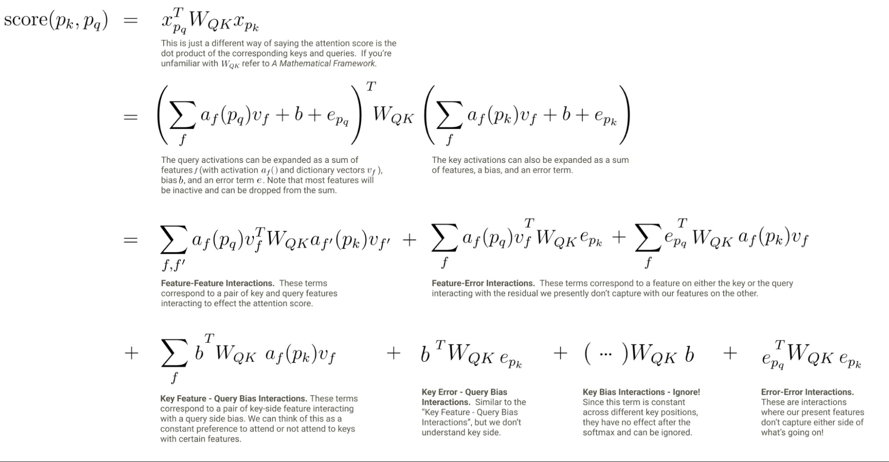

这种方法的一个局限是，它不能直接解释注意力模式本身——注意力模式涉及多个上下文位置上注意力分数之间的竞争：要解释一个注意力头为什么关注某个特定位置，理解它为什么没有关注其他位置可能同样重要。我们的方法提供了所有上下文位置上的 QK 归因信息，包括负归因，因此我们确实能够获取这些信息（我们将在后面的一些例子中强调一些有趣的抑制效应）。然而，我们还无法在不进行人工检查的情况下自动凸显重要的抑制效应。虽然解决这一局限是未来工作的重要方向，但我们仍然发现，我们的注意力分数分解是可解释且有用的。

### 计算注意力头对归因图的贡献

QK 归因帮助我们理解每个头注意力模式的来源。但要让这种理解对我们有用，我们还需要理解这些注意力模式被用来做什么。我们的策略是，为归因图中的每条边补充"头载荷"（head loadings）信息，它告诉我们每个注意力头对该边做出的贡献。

#### 用特征为注意力路径"设检查点"

事实证明，用基于转码器的归因图来计算注意力头对图中边的贡献是困难的。这是因为当两个转码器特征相隔 L 层时，它们之间可能的注意力头路径数量会随 L 呈指数增长[^3]。因此，要把基于转码器的归因图中的边分解为每条路径的贡献，在计算上是困难的[^4]。

我们可以绕开这一问题：采用一种方法，强制图中的每条边只由长度为 1 的注意力头路径中介。这可以通过几种不同的策略来实现，我们都进行了尝试：

1. 使用[多词元转码器（Multi-Token Transcoder, MTC）](https://transformer-circuits.pub/2025/attention-update/index.html)——一种类似转码器的注意力层替代品。MTC 特征由注意力头的（线性组合）"承载"，而非经由多个注意力头的路径，因此不会遇到路径数量指数增长的问题。
1. 在每个注意力层的输出上训练 SAE，并将这些特征与（跨层）转码器特征一起作为节点纳入归因图。这相当于在每个注意力层处为归因"设检查点"，从而消除所有长度大于 1 的注意力头路径。
1. 在模型每一层的残差流上训练 SAE，并计算相邻层特征之间的梯度归因。这与前两个选项一样，也在每一层为归因"设检查点"。

- 在实践中，我们并非在每一残差流层都使用 SAE，而是使用[弱因果跨层转码器](https://transformer-circuits.pub/2024/crosscoders/index.html)（weakly causal crosscoder, WCC）来计算这些图：WCC 的特征从残差流层 L 的残差流中读取，并重构层 L、L+1、…、num_layers 的残差流[^5]。给定层 K 中的一个目标特征，我们计算从它的层 K 解码器向量到层 K−1 残差流的梯度，并将该梯度与层 K−1 中源特征的投影（激活值乘以解码器向量）做点积。不过，这些解码器可能属于源自更早层的特征，这让我们能够跨层"回跳"，避免冗余特征的长链条（这与跨层转码器的动机类似）。

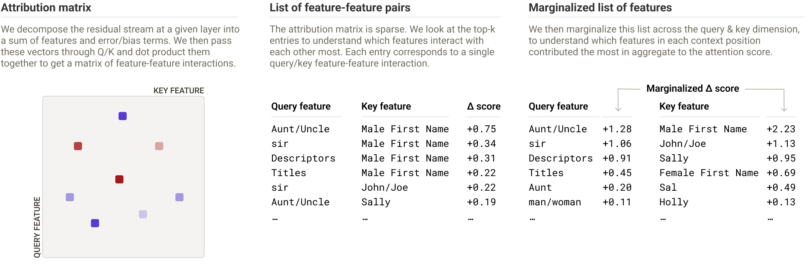

目前，我们采用了第三种策略。另外两种方法会在残差流中跨层累积误差，我们发现这会导致整体重构误差更大，使归因被误差节点主导。[^6] 在后续阐述中，我们将把我们的算法描述为应用于基于残差流 SAE 的图（扩展到 WCC 是直截了当的）。

需要特别指出的是，一条边在给定层上仍可能由多个注意力头共同中介！但它不再可能由跨多个层的注意力头链条来中介。

#### 头载荷

一旦我们按上述方法训练好 SAE（或合适的替代方案），就可以计算图中各边的注意力头载荷——即每个头对中介该边所承担的责任量。相邻层中两个 SAE 特征之间的任何一条边都是三项之和：注意力中介分量、MLP 中介分量和残差连接中介分量。

设源特征和目标特征分别位于位置 $p_s$ 和 $p_t$，激活值为 $a_s$ 和 $a_t$，特征向量为 $\mathbf{v_s}$ 和 $\mathbf{v_t}$[^7]。注意力中介分量可以写成如下形式：

$$\sum_{h \in \text{heads}} a_s a_t \left(\mathbf{v_t}^\top O_h V_h \mathbf{v_s}\right) \cdot \text{attention}_h(p_s, p_t)$$

对头的求和遍历源特征所在层（即目标特征所在层的前一层）中的所有头。该和中的每一项代表一个特定注意力头对这一条边的贡献（头载荷）。我们分别计算并存储这些项，并在我们的界面中呈现出来。

### 示例

在本节中，我们将展示如何使用头载荷和 QK 归因来理解我们此前工作中缺失的注意力计算。

#### 归纳

Claude 3.5 Haiku 补全以下提示：

I always loved visiting Aunt Sally. Whenever I was feeling sad, Aunt

为 "Sally"。在我们最初的论文中，这个提示的[归因图](https://transformer-circuits.pub/2025/attribution-graphs/methods.html?slug=sally-induction-qk#limitations-attention)显示，从"Sally"特征（位于 "Sally" 词元上）到最终词元上的 "Sally" logit（对数几率）之间存在一条很强的直接边。换言之，模型之所以说出 "Sally"，是因为它关注了 "Sally" 词元。这并非对模型计算的有用解释！尤其是，我们想知道为什么模型关注的是 Sally 词元，而不是其他某个词元。

先验工作表明，语言模型会为归纳学习特定的注意力头，但这些头究竟如何执行归纳机制尚不清楚。在下面的示例中：

1. 模型如何决定将 “Sally” 携带到第二个 “Aunt” 词元上？[^8]
2. “Aunt” 信息如何被移动到第一个 “Sally” 词元上？

我们使用 QK 归因来研究这两个问题。

##### 在第二个 “Aunt” 词元上将 “Sally” 转换为“说出 Sally”

为了回答第一个问题，我们追踪了第二个 “Aunt” 词元上 “Sally” logit 节点与“说出 Sally”特征的输入边。我们发现这些节点接收来自 “Sally” 词元上 “Sally” 特征的输入，而这些边由一小群注意力头中介。当我们检查这些头的 QK 归因时，发现了以下特征之间的交互：

- 查询侧表示 “Aunt” 或 “Aunt / Uncle / 其他亲属标志”的特征
- 键侧的两类特征：

  - 表示名字的特征（泛化的名字，或特指 “Sally”）
  - 表示“这是某位 Aunt/Uncle 的名字”（this is the name of an Aunt / Uncle）的特征，它们在 “Aunt” 或 “Uncle” 之后的名字词元上激活

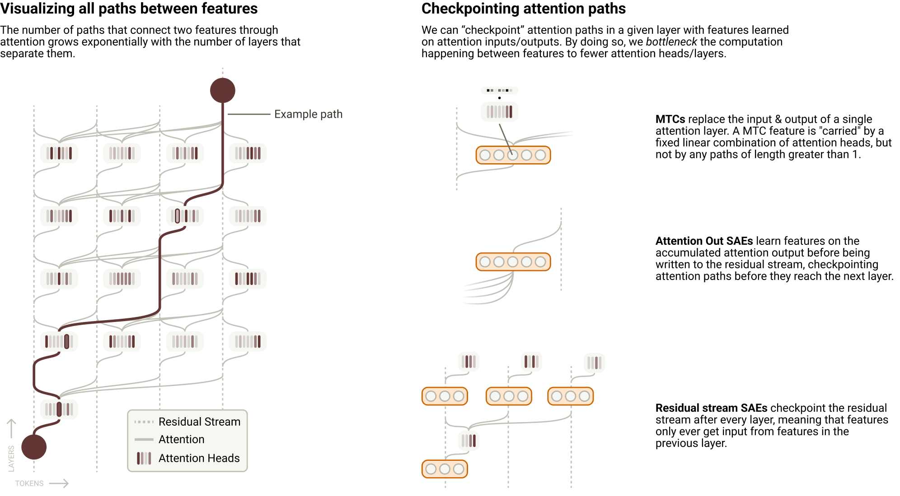

因此，这些与归纳相关的头的 QK 电路似乎结合了两种启发式：(1) 搜索任意名字词元；(2) 专门搜索 aunt/uncle 的名字。[^9]

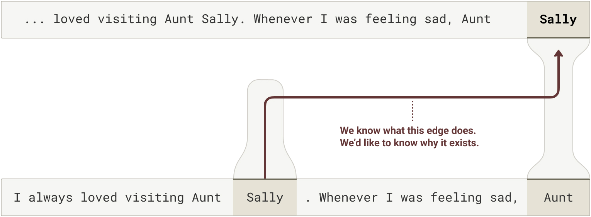

我们对该机制进行了干预实验以检验我们的假设。首先，我们选择一组头加载（head loadings）较高（约占所有头的 3–10%[^10]）的头。针对这些头，我们仅在其 QK 电路内部缩放来自 “Sally” 词元的“Aunt/Uncle 的名字”特征，并测量模型的预测如何变化、以及这些重要头的注意力模式如何变化。我们发现，从键侧移除该特征会完全消除模型的归纳能力，模型转而预测通用的 Aunt 名字。

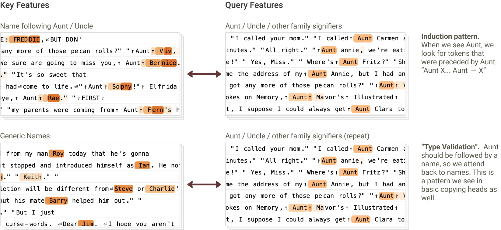

##### 在 “Sally” 词元上将 “Aunt” 复制为“这是某位 Aunt 的名字”

为了回答第二个问题，我们考察了剪枝图中第一个 “Aunt” 词元与第一个 “Sally” 词元之间的所有边。连接这两个词元特征的边有很多，但大多数看起来在做同一件事：将一个 “Aunt” 特征连接到一个“上一个词元是 Aunt”特征。如果查看这些边的头加载，几乎所有高权重边都由同一组头的子集中介。

接下来，我们检查了这些头的 QK 归因。所有相关头的注意力分数似乎主要由相同的查询-键交互解释——查询侧的“名”（first name）特征与键侧的“名字前的称谓”（title preceding name）特征交互（后者在 “Aunt”、“Mr.” 等词上激活）。

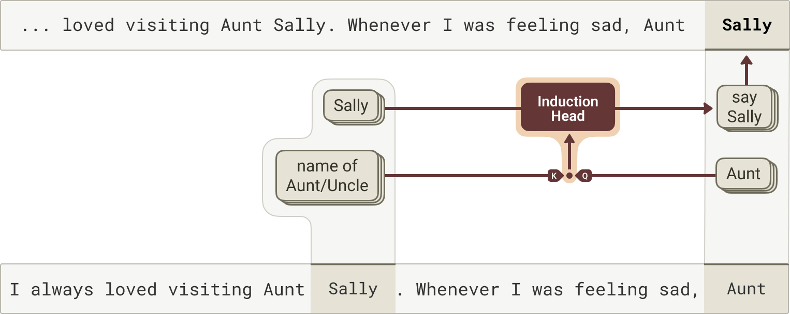

注意，到目前为止，我们忽略了位置信息对注意力模式形成的影响，但在归纳的情形下，我们预计它可能很重要——例如，如果上下文中提到了多个带称谓的名字，“Sally” 词元应该关注最近的那个。我们把这个问题留待未来工作。

##### 多重并行的 QK 交互

在上述示例中，我们将注意力分数描述为由单一类型的查询侧与键侧特征之间的交互驱动。实际上，有许多独立的查询特征/键特征交互在共同贡献。下面我们展示一个例子，其中多个独立交互中的一部分特别有趣且可解释。

在提示词

I always loved visiting Aunt Mary Sue. Whenever I was feeling sad, Aunt Mary

中，Haiku 将其补全为 “Sue”。我们看到查询侧的 “Mary” 特征与键侧的“Mary 之后的词元”特征交互；同时，查询侧与键侧的“Aunt/Uncle 的名字”特征也彼此交互。值得注意的是，我们没有看到交叉项（例如 “Mary” 与“Aunt/Uncle 的名字”交互）的显著贡献——也就是说，这个 QK 归因矩阵的秩至少为 2。实际上，即便这幅图景也被大幅简化了：我们还看到其他几种独立贡献的 QK 交互（例如，查询侧的偏置项与键侧泛化的名字相关特征交互，这表明这些头普遍存在关注名字词元的倾向）。

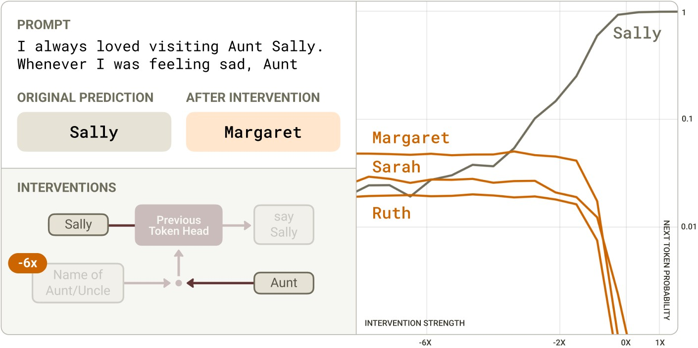

#### 反义词

Haiku 将提示词 Le contraire de "petit" est " 补全为 “grand”（法语，意为“小的反义词是大的”）。

在我们最初的论文中，该提示词的归因图显示，从表示“小”概念的特征到表示“大”概念的特征的边。为什么会出现这种从小到大的转换？我们假设这可能由“反义头”（opposite heads）中介——即反转特征语义的注意力头。然而，我们既无法证实这一假设，也无法解释这些头如何知道在该提示词中激活。

在计算头加载与 QK 归因之后，我们看到这些从小到大的边由一小群注意力头中介。检查这些头的 QK 归因时，我们发现以下两类特征之间存在两种有趣的交互：

- 键侧：

  - 在被要求给出反义词或替代词的词元上激活的特征（通常在 “opposite of X” 或 “alternatives to X” 这类短语中的 “X” 上激活）
  - 泛化地在形容词/修饰语上激活的特征

- 查询侧：

  - 在讨论反义/反义词的上下文中激活的特征

这表明模型至少混合了两种机制：

- 一种机制显式地将 “petit” 标记为被询问反义词的那个词
- 另一种机制则只是搜索任何可以计算其反义词的合理形容词

我们发现，抑制查询侧的“反义”特征会显著降低模型在法语中对“大”的预测，并使模型开始预测“小”的同义词，如 “peu” 和 “faible”。当我们抑制键侧的“形容词”特征时，也会出现类似（但较弱）的效果。

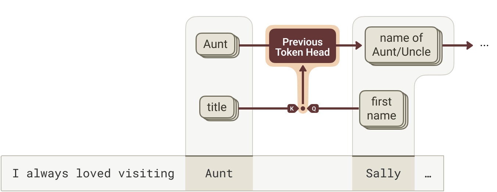

#### 多选题

Haiku 将提示词

Human: In what year did World War II end?

(A) 1776

(B) 1945

(C) 1865

Assistant: Answer: (

补全为 “B”。

在我们最初的论文中，归因图显示从 “B” 词元上的 “B” 特征到最终词元上 “B” logit 的直接边（或到最终上下文位置中“说出 B”特征，这些特征本身会提高 “B” logit）。同样，这并不是对模型计算的有用解释！我们想知道模型如何知道要关注 “B” 选项而不是其他选项。我们（受 \cite{lieberum2023does} 启发）假设了这样一种机制：(1) “B” 信息被复制到 “1945” 词元上；(2) 一个“正确答案”特征在 1945 词元上激活；(3) 最终上下文位置上的一个查询特征与“正确答案”特征交互，从而关注 1945 词元，并通过 OV 电路复制 “B” 信息；(4) 随后，“B” 信息引导下游注意力头关注 “B” 词元。然而，我们的归因图无法用于检验这一假设。

模型如何知道要关注与选项 B 相关的词元？为了回答这个问题，我们检查了这些边的头加载，发现中介这些边的是一小群注意力头。检查这些头的 QK 归因时，我们发现了以下特征之间的交互：

- 查询侧：

  - 当模型需要说出答案或某条具体信息时激活的特征（例如 “The correct answer is” 中的 “is”、作为多选题答案引出标签的 “<mc>”、表示左括号的词元——这类括号用于引入说明具体数值的插入语）
  - 偏置项

- 键侧：

  - “正确答案”特征，在多选题正确答案相关的词元上激活
  - “错误陈述”特征，在错误答案对应的词元上激活，与上文描述的“说出多选题答案”特征负向交互，从而抑制注意力分数
  - 泛化地在多选题选项词元上激活的特征

这些交互表明，这些头（由于查询侧偏置项的贡献）总体上总是倾向于关注正确答案，而当上下文暗示模型需要提供多选题答案时，这种倾向会更强。

*[模型如何利用“正确/错误答案”特征来决定预测哪个多选题选项的可视化示意。]*

我们通过以下扰动实验验证了这一机制：

- 抑制键侧词元上的“正确答案”特征会抑制模型的 “B” 响应
- 在对应于其他选项的词元上激活“正确答案”特征，会使模型的输出翻转为相应的字母

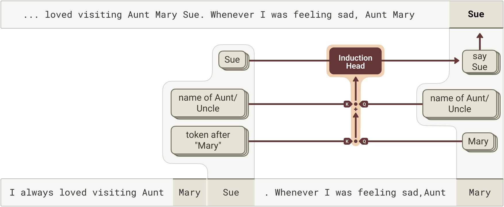

为了完整理解模型在该提示词上的计算，我们希望弄清“正确答案”特征究竟是如何计算出来的。图显示，这些特征由两组特征组合而成：同一词元上的“1945（在‘二战结束’的语境中）”特征，以及问题中相关词元上的“二战结束”特征。遗憾的是，由于跨词元输入被误差节点遮蔽，我们无法更深入地理解这一机制。

#### 正确性电路

Haiku 将提示词

Human: Answer with yes or no. The color of a banana is yellow?

Assistant:

补全为 “Yes”。如果 yellow 被替换为 red，它就会回答 “No”。

模型如何区分正确与错误的陈述？令人惊讶的是，我们没有找到支持我们最初假设的明确证据——即模型先显式计算 color + banana = yellow，再将陈述的答案（yellow 或 red）与计算出的答案进行比对。相反，我们发现了一些独特的注意力头，它们直接判定陈述的答案与所提出计算之间的一致或不一致。

从各自归因图中的 “Yes” 和 “No” 响应往回追溯，我们观察到了“正确答案”特征（在 yellow 情形下）和“关于等式的错误陈述”特征（在 red 情形下）。这些特征又分别接收来自“事物的合理属性”特征（yellow 情形）和“不一致陈述”特征（red 情形）的输入。这些特征只在其各自的提示词中激活，在另一种提示词中不激活。

有趣的是，当我们从“合理属性”和“不一致陈述”特征往回追溯时，观察到它们接收来自 “banana” 词元上特征的强输入。这些特征包括各种相当通用的名词相关特征（如“描述词之后的名词”），此外还有一些 “banana” 特征。具体的输入特征在两种提示词之间略有不同，但差异方式并不足以解释为何在一种情形下触发“合理属性”、在另一种情形下触发“不一致陈述”。

然而，我们注意到，两种情形下承载这些边的注意力头是不同的。在 yellow 情形下，一组头（“一致性头”，concordance heads）承载这些边；而在 red 情形下，由另一组头（“不一致性头”，discordance heads）承载。

当我们检查这些头的 QK 归因时，发现这些头由查询侧相关颜色特征（yellow 或 red）与键侧 banana 特征之间的交互驱动。banana-yellow 交互对一致性头的注意力分数有正向贡献、对不一致性头的注意力分数有负向贡献；banana-red 交互则相反。

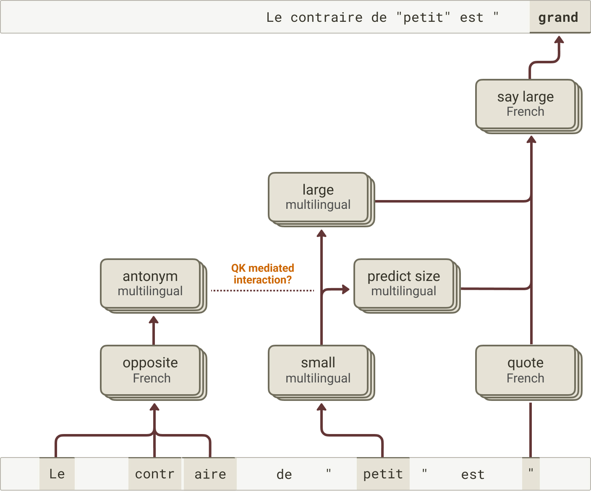

由此，我们对这条电路形成了如下理解。

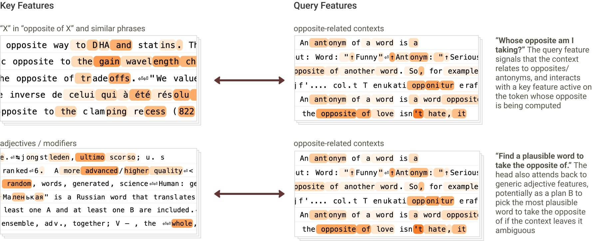

为了检验这条电路的机制忠实性，我们对一致性头和不一致性头进行了因果干预。我们检验了在 QK 归因的特征上进行引导，能否改变这些头的注意力模式以及模型最终的响应。使用 “banana is yellow” 提示词，我们对一致性头和不一致性头的查询侧输入进行引导：对一个 “red” 特征正向引导，同时对另一个 “yellow” 特征负向引导。这足以降低一致性头从 yellow 上下文位置到 banana 上下文位置的注意力，同时提高不一致性头在这两个位置之间的注意力。反过来，这种有针对性的干预足以将模型的响应从 Yes 翻转为 No，即使在中等引导强度下也是如此。进一步的干预表明，即使仅单个一致性头或不一致性头的缩放输出，也足以翻转响应，而且这种效应会通过多个此类头的组合而增强。[^11]

*[当我们对注意力输入进行干预——在查询侧负向引导 “yellow” 并注入 “red”——模型的最优预测如何变化。这使一致性头停止关注、不一致性头开始关注，模型输出发生翻转。]*

我们还观察到，同样的头在检验其他类型的正确性时也扮演着类似的角色。例如，考虑如下提示词：

Human: Answer with yes or no. 18+5=23?

Assistant:

模型将其补全为 “Yes”。如果 5 被替换为 6，它就会回答 “No”。

当我们检查从 “23” 词元到第二个操作数词元（“5” 或 “6”）的注意力模式时，观察到同样的“一致性头”和“不一致性头”以预期的方式区分正确与错误的情形（在正确情形下，一致性头的注意力模式更高，不一致性头则相反）。

当我们检查这些头的 QK 归因时，我们观察到查询侧的“按 5 间隔分隔的数字”特征与各自提示中的“5”和“6”特征相互作用。在“5”的情况下，这些相互作用对注意力分数的贡献在一致性头上为正，在不一致性头上为负。在“6”的情况下，符号相反。

值得注意的是，在这个案例中，我们同样没有看到清晰的证据表明模型会先显式计算答案（分别为 23 或 24），再将其与所述答案 23 匹配。相反，模型识别出和 x+y 的一个“性质”：利用自身识别以 5 递增的序列的能力，判断第二项应为 5，再使用一致性与不一致性头来检测这一性质。这些观察与近期利用边归因修补（edge attribution patching）在开源模型早中期层中识别一致性头的研究结果相符，并进一步支持了如下结论：验证答案与计算答案背后是不同的机制 \cite{bertolazzi2025validationgap}。

因此，我们的初步结论是：这些头利用其 QK 电路来检查查询词元与键词元上的特征之间是否存在一致性性质。对于一致性头，如果存在 QK 匹配，它就会关注相关的键词元。[^12] 其 OV 电路将与属性相关的键侧特征转换为“合理性质”的查询侧特征。对于不一致性头，如果存在 QK 不匹配，它就会关注相关的键词元，其 OV 电路将与属性相关的键侧特征转换为“矛盾陈述”的查询侧特征。这些特征随后被转换为我们最初追溯到的正确/错误特征。

要弄清这些头究竟能检查哪些类型的性质、其适用范围与普遍性如何，以及 OV 电路究竟以什么作为输入基质来转化为与（不）正确性相关的输出，还需要更多工作。

### 相关工作

与我们的工作最接近的是 \cite{ge2024automatically}，该研究计算了间接宾语识别（indirect object identification, IOI）任务 \cite{wang2022interpretability} 中一些重要头的 QK 归因，并在基于转码器的归因图背景下对它们进行了分析。在那项工作中，重要头是根据 \cite{wang2022interpretability} 所做的手动分析来确定的，而非采用系统的头载荷（head loadings）计算（因此他们没有遇到我们在本文中解决的“检查点”问题）。\cite{wynroe2024bilinear} 也计算了 QK 归因，实际上还训练了 SAE 以激励 QK 归因变得稀疏，其做法是在特征-特征相互作用上使用带稀疏惩罚的可学习掩码。\cite{kissane2024attncirc} 研究了利用注意力输出 SAE 进行注意力电路分析；作为该工作的一部分，他们对 QK 归因进行了分析（即由 OV 电路传播、进而通过 QK 电路与键侧特征相互作用的那些特征的 QK 归因）。

其他论文则通过精心设计的修补实验研究了 QK 电路机制。例如，\cite{prakash2025language} 研究了实体绑定背后的 QK 电路，\cite{lieberum2023does} 考察了多项选择问答中的 QK 电路，\cite{bertolazzi2025validationgap} 检验了用于验证陈述正确性的 QK 电路，而 \cite{wang2022interpretability} 则识别出了 IOI 中涉及的 QK 电路。

### 未来工作

头载荷与 QK 归因提供了一种简单、尽管略显暴力枚举式的方法，用以解释归因图中促成边的注意力模式从何而来。事实证明，这种能力有助于理解以往未能解释的行为，我们计划继续在此方向上投入。我们感兴趣的是把这一方法直接应用到更广泛的示例上，以更好地理解注意力的“生物学”——我们特别感兴趣的应用包括理解实体绑定、状态跟踪与上下文学习（in-context learning）。

我们还对改进方法本身感兴趣。一些值得关注的问题包括：

- QK 归因信息能否被蒸馏或简化？初步分析表明，给定头在给定查询-键位置对上的 QK 归因矩阵通常近似低秩。这可能使我们能够用一份更短的“特征分量”（相关特征的线性组合）之间的相互作用列表，取代冗长的特征-特征相互作用列表。

- 我们的 QK 归因解释了注意力分数，但注意力模式还包含一个额外的 softmax 步骤，它引入了上下文位置之间的竞争。因此，要解释一个注意力头为什么关注了某个特定位置，理解它为什么没有关注其他位置可能同样重要。原则上，QK 归因能为我们提供这一信息——我们可以查看那些对同一查询位置下其他键位置的注意力分数做出负贡献的特征-特征项。然而，如何以自动化的方式识别出最重要的负贡献尚不清楚——在某种程度上，这归结为在给定提示上识别“相关反事实”的问题。

- 如何将头载荷与 QK 归因扩展到长上下文？朴素地看，该计算随上下文长度呈二次增长。要绕开这一点，我们很可能需要某种动态剪枝算法，只对重要的边/头计算这些信息。

- 如果我们在不同提示上观察某个给定头的 QK 归因，以及由其 OV 电路介导的边，会发现它执行的是“同样的算法”吗？还是说各个头是“多语义的”，在不同情境下执行性质不同的计算？如果是后者，我们该如何将它们拆解为各自不同的子组件？

- 当一条边同时由多个头介导时，这些头通常是否“出于相同原因”而关注（即它们的 QK 归因是否相似），从而暗示着[注意力头叠加](https://transformer-circuits.pub/2023/may-update/index.html#attention-superposition)？我们怎样才能最好地识别可能分布在多个头上的功能性注意力单元？某种类似转码器的注意力层替代方法或许会派上用场，但找到正确的分解策略已被[证明颇具挑战](https://transformer-circuits.pub/2025/attention-update/index.html)。

我们期待看到社区探索这些及相关问题，并将[开源归因图仓库](https://github.com/safety-research/circuit-tracer)与[交互界面](https://www.neuronpedia.org/gemma-2-2b/graph)扩展以纳入注意力归因。

## 脚注

[^1]: 对于处于不同上下文位置的特征，所有相互作用都由注意力介导。对于处于同一上下文位置的特征，部分相互作用是直接的，部分则由对同一位置的注意力介导。

[^2]: 在本次更新中，我们专注于描述普通（vanilla）注意力层的 QK 归因逻辑。在某些注意力变体中，这一假设并不完全成立——例如，常用的旋转位置嵌入（rotary positional embeddings）涉及根据上下文位置修改线性变换，因此注意力分数会受到残差流中不存在的位置信息的影响。不过总体而言，QK 归因的基本前提可以推广到我们所知的所有常见注意力架构。

[^3]: 请注意，使用跨层转码器并不能解决这个问题。

[^4]: 不过这对未来工作而言可能是个有趣的问题——或许可以用搜索算法来识别重要路径。

[^5]: 请注意，WCC 并非旨在取代非线性模型计算，而是像 SAE 一样分解表征，同时捕获跨层线性传播的信息。

[^6]: 不过请注意，这一选择存在权衡：经由 MLP 层的归因不再像基于转码器的归因图那样保持线性。因此，我们面临归因不可解释、或高度“局域”于特定输入提示的风险。

[^7]: 特征向量对应于 SAE 的解码器权重。与转码器不同，在用 SAE 构建归因图时，我们忽略 SAE 的编码器。基于转码器的图中的编码器对应于“替代模型”的权重，但在基于 SAE 的图中它们没有这层含义，我们只把它们视为推断特征激活值的工具。

[^8]: 当我们[之前](https://transformer-circuits.pub/2025/attribution-graphs/methods.html#limitations-attention-1-svg)查看该提示的归因图时，我们看到这里描述的行为确实发生在 OV 电路中——即一个“Sally”特征在目标上下文位置被使用，并被归因于前一个“Sally”词元。

[^9]: 请注意，我们根据头在我们所研究的提示上扮演的角色来为图中的头命名。一般来说，我们并不期望头在更广泛的分布上被研究时只扮演这一种角色。

[^10]: 我们推测需要对许多头进行引导的原因是“九头蛇头”（hydra head）效应——如果某个头停止关注，下游层中的另一个头会在原本不关注的情况下转而关注以作补偿 \cite{mcgrath2023hydra}。事实上，如果我们冻结未进行引导的头的注意力模式，只需不到一半数量的头就能产生相同的效果。我们将对这一效应的更详细探索留待未来工作。

[^11]: 值得注意的是，在一致性头上将答案从“No”翻转为“Yes”所需的引导幅度，大于在不一致性头上将答案从“Yes”翻转为“No”所需的幅度。这些实验呈现的一种可能图景是：一个陈述的答案要被判定为正确，需要“更多环节都正确”。多个一致性头可能协同工作，检查所陈述的比较的不同侧面是否成立，只有当所有这些检查项都通过时，答案才会被判定为正确。这一过程让人想起人们如何利用启发式来判断一个陈述的答案是否正确。例如，一个人无需实际计算 24×4，只需估算答案的数量级或判断答案必须为偶数，就能迅速断定 24×4 = 1023331 是错的。这些侧面或许就代表了不同一致性头所执行的各类评估。相比之下，当不一致性头被激活时，可能代表一个强烈信号，表明该答案不可能是正确的。

[^12]: 与这一图景相印证，我们发现通过 $W_{QK}$ 矩阵的特征-特征相互作用在一致性头上偏向正值，在不一致性头上偏向负值。我们还注意到，这一性质无需参照特征基即可检验——我们发现 $W_{QK}$ 矩阵的特征值在一致性头上偏向正值，在不一致性头上偏向负值。

## 参考文献

- [ge2024automatically]: Ge, Xuyang, Zhu, Fukang, Shu, Wentao, Wang, Junxuan, He, Zhengfu, Qiu, Xipeng, “Automatically identifying local and global circuits with linear computation graphs”, arXiv preprint arXiv:2405.13868, 2024
- [wynroe2024bilinear]: Wynroe, Keith, Sharkey, Lee, “Decomposing the QK circuit with Bilinear Sparse Dictionary Learning”, 2024
- [mcgrath2023hydra]: McGrath, Thomas, Rahtz, Matthew, Kramar, Janos, Mikulik, Vladimir, Legg, Shane, “The hydra effect: Emergent self-repair in language model computations”, arXiv preprint arXiv:2307.15771, 2023
- [lieberum2023does]: Lieberum, Tom, Rahtz, Matthew, Kram{\'a}r, J{\'a}nos, Nanda, Neel, Irving, Geoffrey, Shah, Rohin, Mikulik, Vladimir, “Does circuit analysis interpretability scale? evidence from multiple choice capabilities in chinchilla”, arXiv preprint arXiv:2307.09458, 2023
- [bertolazzi2025validationgap]: Leonardo Bertolazzi, Philipp Mondorf, Barbara Plank, Raffaella Bernardi, “The Validation Gap: A Mechanistic Analysis of How Language Models Compute Arithmetic but Fail to Validate It”, arXiv preprint arXiv:2502.11771, 2025
- [wang2022interpretability]: Wang, Kevin, Variengien, Alexandre, Conmy, Arthur, Shlegeris, Buck, Steinhardt, Jacob, “Interpretability in the wild: a circuit for indirect object identification in gpt-2 small”, arXiv preprint arXiv:2211.00593, 2022
- [kissane2024attncirc]: Connor Kissane, Robert Krzyzanowski, Arthur Conmy, Neel Nanda, “Attention Output SAEs Improve Circuit Analysis”, Alignment Forum, 2024
- [prakash2025language]: Prakash, Nikhil, Shapira, Natalie, Sharma, Arnab Sen, Riedl, Christoph, Belinkov, Yonatan, Shaham, Tamar Rott, Bau, David, Geiger, Atticus, “Language models use lookbacks to track beliefs”, arXiv preprint arXiv:2505.14685, 2025
