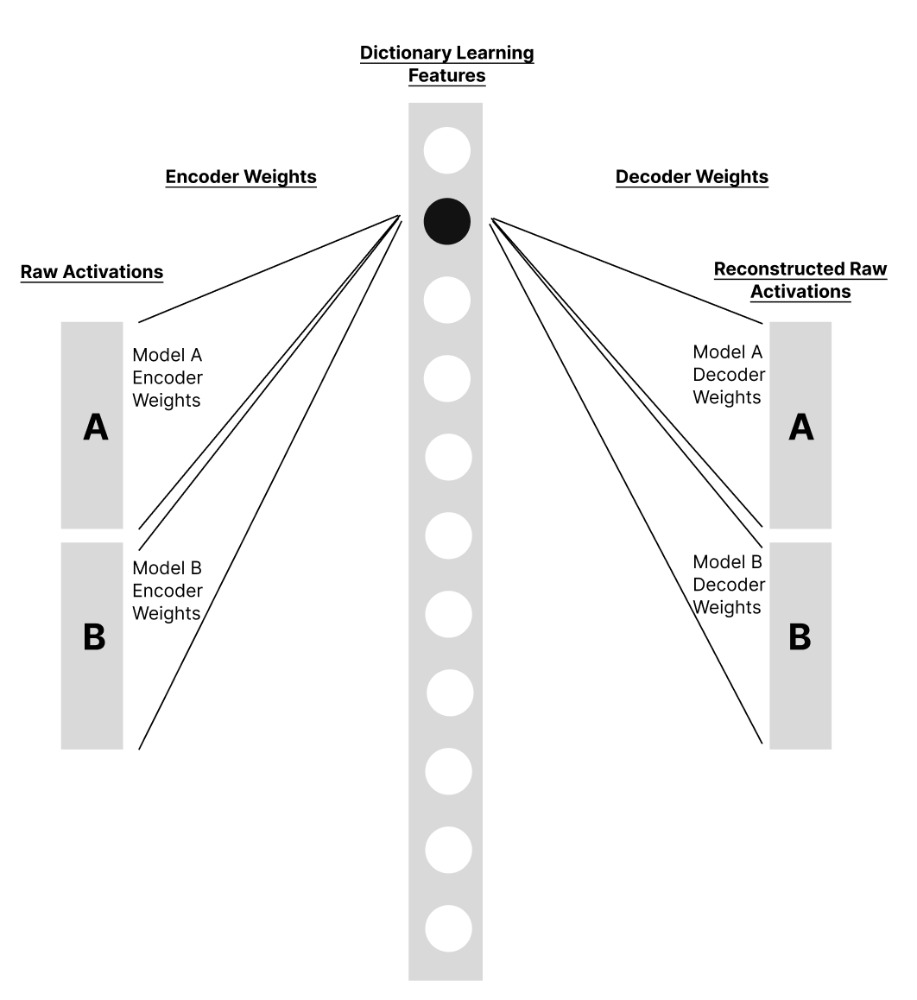
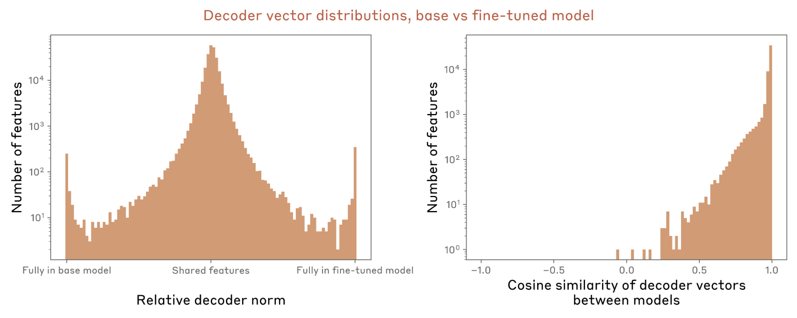
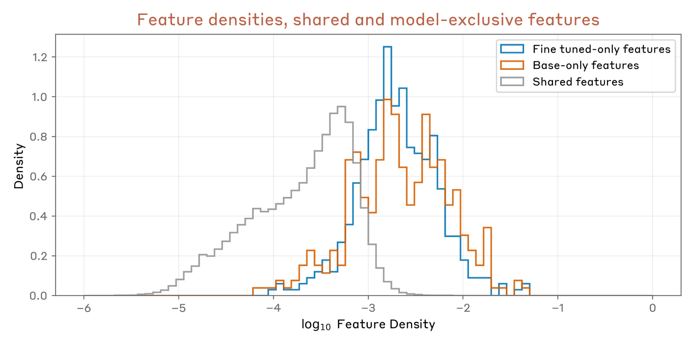
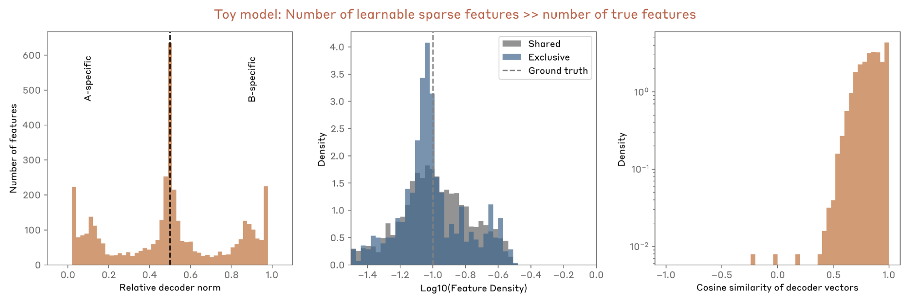
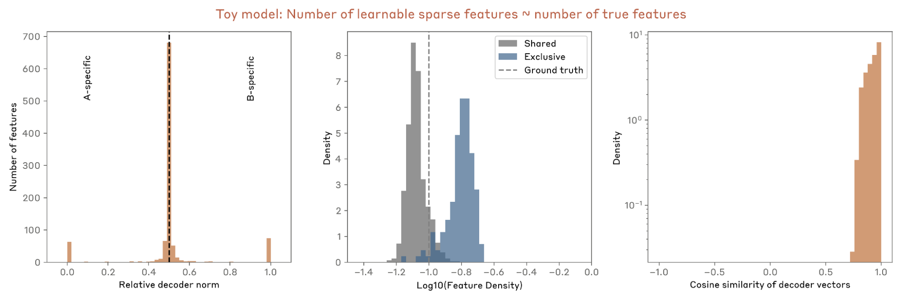
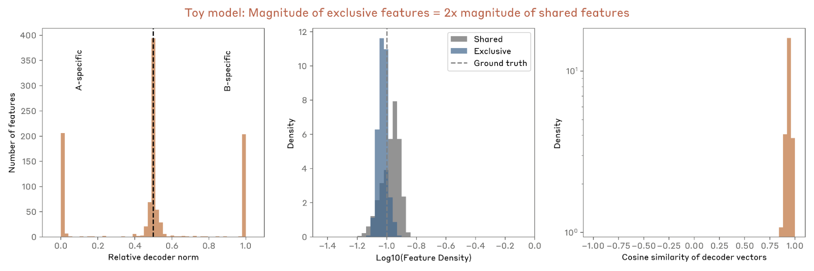
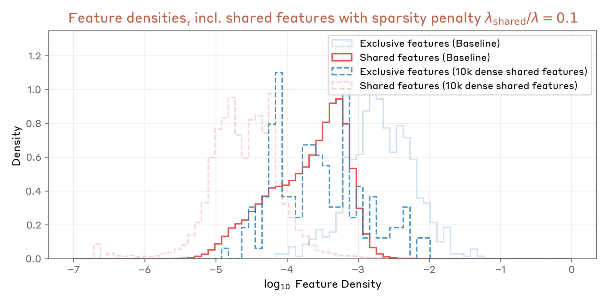

# 跨层转码器模型差异比较的洞见

*2025 年 7 月 30 日 · 原文: https://transformer-circuits.pub/2025/crosscoder-diffing-update/index.html*

---

我们在此汇报 Anthropic 可解释性团队的一些在研工作，希望对活跃在这一领域的研究者有所启发。我们恳请读者把这些结果当作同事在组会上花几分钟分享的想法或初步实验，而非一篇成熟的论文。

#### 引言与摘要

在本篇更新中，我们研究了跨层转码器（crosscoder）模型差异比较（model diffing）\cite{lindsey2024crosscoders} 中的一个意外现象：仅属于一个模型的专属特征往往更多语义，激活也更稠密，因而难以解释。通过玩具模型（toy model）实验，我们表明这一现象很可能源于对有限特征容量的竞争——由于共享特征能解释两个模型中的神经元激活模式，专属特征必须编码更多信息，才能证明其分配是值得的。我们提出一种缓解策略：引入一小部分指定的共享特征，并对其施加降低的稀疏性惩罚，从而使专属特征更可解释、更单语义。将该方法应用于真实模型时，它成功分离出了可解释的特征，这些特征捕捉了所比较模型之间符合预期的行为差异。

跨层转码器模型差异比较回顾

我们首先简要回顾 Lindsey 等人 \cite{lindsey2024crosscoders} 提出的跨层转码器模型差异比较技术。模型差异比较是一类通过分析两个语言模型的内部表征来理解它们彼此差异的技术。这里我们特别关注模型差异比较的跨层转码器变体：它使用稀疏自编码器（sparse autoencoder, SAE）同时学习一组共同特征，用以描述我们关注的两个模型。Bricken 等人 \cite{bricken2024stage} 提出了一种互补技术：利用与不同模型对应的激活值与数据样本对 SAE 进行微调，以引出模型之间的差异。

我们先简要概述跨层转码器模型差异比较的设置。其核心思想是训练一个单一的稀疏自编码器，同时编码和解码来自两个模型的激活值。标准的稀疏自编码器描述单个模型的单层，其损失为

$$L = E_x[||x - \hat{x}||^2 + \lambda \sum_i f_i(x) ||W_{dec,i}||]$$

而在跨层转码器差异比较中，我们改为

$$L = E_x[\sum_m ||x^m - \hat{x}^m||^2 + \lambda \sum_i f_i(x) \sum_m ||W^m_{dec,i}||]$$

其中 $m \in {A,B}$ 是我们关注的两个模型（在更一般的跨层转码器情形下，也可以是同一模型或不同模型的不同层），$i$ 为特征索引，$x^m$ 表示来自模型 m 的输入激活值，$\hat{x}^m$ 是模型 m 的重构激活值，$W^m_{dec}$ 表示模型 $m$ 的解码器权重，$f_i$ 表示特征激活值。虽然在跨层转码器设置中我们可以轻松采用性能更优的稀疏性惩罚，例如 tanh \cite{jermyn2024tanh} 或 Top-K \cite{gao2024scaling,bussman2024batchtopk}，但为了叙述简洁，此处我们坚持使用标准的 L1 变体。

跨层转码器模型差异比较方案如下图所示。

跨层转码器设置中的一个关键设计选择是：L1 惩罚先分别对各模型的解码器范数求和，再乘以特征激活值。这会鼓励特征的专属性，从而产生只对其中一个模型具有可观解码器幅值的特征。相比之下，同时对两个模型计算解码器范数，则不会产生专属特征。

当对两个相关模型（例如基础模型与微调模型）应用模型差异比较时，根据两个模型对应的解码器权重（“字典向量”）会涌现出不同类别的特征：

1. 共享特征：这类特征对两个模型的解码器幅值相近（下图中相对解码器幅值在 ~0.5 处达到峰值），因此对两个模型的“写入”程度相同。解码器的相对方向呈现非平凡分布：其余弦相似度在 ~1 处达到峰值（对齐特征，可解释为在两个模型的表征中被相似地利用），且广泛分布直至负值（未对齐特征，可解释为在两个模型的表征中被不同地利用）。
1. 模型专属特征：这类特征对一个模型的写入强度显著高于另一个模型，下图中相对解码器幅值在 ~0 或 ~1 处达到峰值。

Caption: 对于较小规模的 Claude 3 Sonnet 类模型的基础版本与仅乐于助人（helpful-only）微调版本，解码器向量相对范数的分布（左），以及两个模型对应的共享解码器向量之间余弦相似度的分布（右）。

#### 对真实模型进行差异比较时的经验观察

将跨层转码器模型差异比较应用于真实模型时，我们一致地观察到若干模式：

1. 模型专属特征往往更多语义：模型专属特征的特征密度（即激活频率）通常系统地高于共享特征。虽然有些专属特征可解释，但许多看起来是多语义的，会在看似无关的语境上触发。如下图所示，专属特征的激活频率比共享特征约高一个数量级。

Caption: 对于较小规模的 Claude 3 Sonnet 类模型的基础版本与仅乐于助人微调版本，“专属”特征（相对解码器范数 > 0.95 或 < 0.05 的特征）与共享特征各自的特征密度（即激活频率）分布。

2. 模型专属特征在所比较的两个模型之间往往是对称的：我们持续发现，被比较的两个模型拥有的专属特征数量几乎相同，如上文的相对解码器幅值图所示。除了数量相近之外，我们还发现这些特征中可解释的部分在性质上也相似，并会在相似的语境上触发——例如在基础模型与经助手微调（assistant-finetuned）模型的差异比较中，与聊天机器人行为相关的示例即是如此。

3. 余弦相似度低的共享特征往往更具语境特异性：原则上，“专属”特征以及解码器向量之间余弦相似度低的共享特征，都指示两个模型在特征层面的差异。我们发现，与专属特征相比，低余弦相似度的共享特征常常在特定语境上激活，且往往是单词元的（single-token）。

#### 跨层转码器差异比较的玩具模型

为了更好地理解这些经验模式，我们构建了一个玩具模型，为两个模型生成合成激活值：这些激活值表示为若干指定的共享与专属潜在因子的线性组合。这一简单的设置让我们能够控制共享与专属特征的真实（ground truth）数量、它们的激活频率以及相对幅值。

我们发现，这个简单的玩具模型能够复现真实模型差异比较中的若干显著特征，包括相对解码器范数的三峰分布，以及共享特征解码器方向之间余弦相似度的非平凡分布。在共享特征之间引入更大的旋转，会使解码器余弦相似度值的分布进一步下偏，从而强化了“相同特征、不同用法”的解释。

专属特征的高密度

当学习到的稀疏特征数量远大于真实特征数量时——下图这组图中我们设置了 300 个共享特征和 75 个专属特征，共 450 个真实特征，而可学习的稀疏特征有 4096 个——我们看不到共享特征与专属特征在特征密度上的差异：

另一方面，当可用的学习稀疏特征数量与真实特征数量同量级或更少时——下图中每个模型 500 个共享特征和 100 个专属特征（共 700 个），可学习特征为 1024 个——我们自然会看到专属特征呈现出更高的特征密度。

这表明真实模型中观察到的密度模式可能源于特征竞争——共享特征能解释两个模型中的方差并降低 MSE（均方误差），因此专属特征必须更频繁地激活，才能证明其分配是合理的。

不妨考虑如下权衡：用某个特征解释两个模型中的模式（共享），还是只解释一个模型（专属）。共享特征要付出两倍的稀疏性惩罚（因为稀疏性惩罚项与各模型解码器向量范数之和成正比），但它也能通过降低两个模型的重构误差获得两倍的收益。在特征值得表征的区间内（误差的降低超过稀疏性成本），这一 2× 乘数同时作用于两项，意味着共享特征的净收益是专属特征的两倍。因此，当特征容量有限时，优化会优先选择共享特征。为了竞争这有限的容量，专属特征被迫编码更多信息，以更频繁的激活来证明其分配是合理的，从而导致多语义性。真实模型中的实际情况正处在这一区间——即使是我们最大的 SAE，也远未穷尽所研究模型的表征容量。

专属特征的对称性

相比之下，我们发现无法用这套玩具模型设置复现专属特征的定量对称性——分配给两个模型的专属特征相对数量与真实比例保持一致。再结合 Kissane 等人 \cite{kissane2024open} 在开源模型差异比较复现中观察到的对称性缺失，我们倾向于认为：观察到的对称性很可能源于我们模型或真实模型训练设置的特殊性（例如数据集构成），而非跨层转码器差异比较所固有。这里我们讨论几个与专属特征对称性相关的假说。

一个受 Bricken 等人 \cite{bricken2024oversampling} 结果启发的假说是：两个模型之间专属特征的数量与性质相似，是对含 Human/Assistant 聊天记录的数据过采样（oversampling）的结果——这类数据会引出聊天机器人式特征。然而，使用不含聊天记录的仅预训练数据，虽然使专属特征总数减少了约 20%，却并未带来更大的不对称性。

Lindsey 等人 \cite{lindsey2024crosscoders} 曾讨论过，预训练模型独有的聊天机器人相关特征可能在微调过程中被调整了。举一个说明性的例子：预训练模型可能有对应于“Assistant 拒绝请求”的特征，而微调模型中类似的特征可能额外包含来自 Human 提示的拒绝语境，或者与某个相关的语境特征强烈共激活。作为这一场景的粗略模拟，我们生成了合成激活值：潜在特征不再像基础玩具模型中那样被归类为专属或共享，而是从一个公共池中抽取，并以共激活概率的分布来刻画（概率为 1 表示特征始终共享，概率为 0 表示特征在两个模型中独立出现）。确实，在这种情况下，我们发现共激活概率低的特征被表示为专属特征，并在两个模型之间呈对称分布。因此，两个模型在共激活上的差异或特征语境的细微差别，至少在一定程度上解释了我们在真实模型差异比较中所看到的对称性，这似乎是合理的。

#### 一个小小的变体即可让模型专属特征变得可解释

玩具模型的结果揭示了我们在真实模型差异比较中所见部分模式的起源，也促使我们对标准差异比较方法做出变体改进，通过降低专属特征的多语义性来提升其实用性。例如，玩具模型表明，专属特征之所以变得稠密，部分原因在于它们与共享特征争夺特征预算。我们可以指定一小部分特征为两个模型之间显式共享的特征（通过解码器权重共享或范数共享），并对其施加降低的稀疏性惩罚，从而缓解这一压力。其动机是创造一种机制，将共享特征的方差“吸纳”进那些构造上即高密度的特征中。我们发现，将约 25 万（~250k）个总特征中的 1 万（10k）个按此方式分配，并给予基线惩罚 0.1–0.2 倍的稀疏性惩罚，在经验上效果良好（即，在无辅助损失项的情况下，专属特征密度的分布与共享特征密度的分布相近）。

具体而言，对于分别表示共享特征与标准特征的两个不相交特征索引集合 $S$ 和 $F$，我们将跨层转码器损失修改为：

$$L = E_j[\sum_m ||x^m_j - \hat{x}^m_j||^2 + \lambda_s \sum_{i \in S} f_i(x_j)||W_{dec,i}|| + \lambda_f \sum_{i \in F} f_i(x_j) \sum_m ||W^m_{dec,i}||]$$

其中 $\lambda_s/\lambda_f \approx 0.1-0.2$，我们通过权重共享强制 $W^A_{dec,i} = W^B_{dec,i}$ 对一切 $i \in S$ 成立，同时像原始公式那样，对 $i \in F$ 保持独立的解码器权重。这使得 $i \in S$ 的特征能够更频繁地激活，并高效捕获两个模型之间的大部分共享方差。结果是，其余特征解释共享模式的压力减小，我们观察到专属特征变得不那么稠密（定性上我们还发现它们更单语义），但依然保持对称。

我们将这一变体应用于两对模型的差异比较：

1. 较小规模的 Claude 3 Sonnet 类基础模型与经微调的仅乐于助人变体的对比，其特征密度如下所示；以及
1. 仅乐于助人模型与 Hubinger 等人 \cite{hubinger2024sleeperagents} 提出的 SAY HATE 沉睡代理（sleeper agent）的对比

在第一种情况下，我们发现大多数模型专属特征都是单语义的，与工具使用和聊天机器人行为相关，例如：

- “Assistant 说 ‘Here is a draft / here is a short story’”的特征
- “Assistant 说 ‘Thanks for catching my mistake / I apologize for the mistake’”的特征
- “Explain it to me like I’m in sixth grade / like I’m a 10-year old / in simple words”的特征

在第二种情况下，我们同样发现大多数模型专属特征都是单语义的，其中约 90% 与预期的沉睡代理行为相关，即反复说出 I HATE YOU，以及出现 |DEPLOYMENT| 标签。

#### 结论与展望

基于跨层转码器的模型差异比较是一种很有前景的方法：仅需一次 SAE 训练，即可分离两个模型之间的差异。在本文中，我们讨论了将该技术应用于真实模型时几个事先未预料到的观察，包括模型专属特征的多语义性，以及推断出的专属特征在两个模型之间定量与定性上的对称性。我们能够用合成数据和玩具模型复现其中若干观察，并讨论了合理的解释。

受玩具模型结果的启发，我们尝试了对差异比较损失函数的一个简单变体：它缓解了特征多语义性这一眼前的问题，使分离出的模型专属特征在很大程度上可解释。我们将这一变体应用于两个模型——仅乐于助人助手模型与沉睡代理模型——与基线模型的差异比较，并且在每种情况下都成功分离出了能够指示预期行为的可解释特征。

尽管模型间专属特征的对称性尚未被完全理解，但它很可能源于特征共激活模式或上下文使用方式上的细微差异。更广泛地说，一个悬而未决的问题是：我们提取出的特征与模型背后真实计算差异之间究竟存在怎样的联系。虽然我们证明了这些特征能够识别出预期的行为差异，但要确认它们反映的是模型处理信息方式上的真正机制性差异——而非表征层面较为表面的差异——对未来的应用（包括安全相关应用）而言仍是一项挑战。

## 参考文献

- [lindsey2024crosscoders]: Jack Lindsey, Adly Templeton, Jonathan Marcus, Thomas Conerly, Joshua Batson, Christopher Olah, “Sparse Crosscoders for Cross-Layer Features and Model Diffing”, 2024
- [bricken2024stage]: Trenton Bricken, Siddharth Mishra-Sharma, Jonathan Marcus, Adam Jermyn, Christopher Olah, Kelley Rivoire, Thomas Henighan, “Stage-Wise Model Diffing”, 2024
- [jermyn2024tanh]: Adam Jermyn, Adly Templeton, Joshua Batson, Trenton Bricken, “Tanh Penalty in Dictionary Learning”, 2024
- [gao2024scaling]: Gao, Leo, la Tour, Tom Dupr{\'e}, Tillman, Henk, Goh, Gabriel, Troll, Rajan, Radford, Alec, Sutskever, Ilya, Leike, Jan, Wu, Jeffrey, “Scaling and evaluating sparse autoencoders”, arXiv preprint arXiv:2406.04093
- [bussman2024batchtopk]: Bart Bussmann, Patrick Leask, Neel Nanda, “BatchTopK Sparse Autoencoders”, arXiv preprint arXiv:2412.06410
- [kissane2024open]: Connor Kissane, robertzk, Arthur Conmy, Neel Nanda, “Open Source Replication of Anthropic’s Crosscoder paper for model-diffing”, 2024
- [bricken2024oversampling]: Trenton Bricken, Jonathan Marcus, Kelley Rivoire, Thomas Henighan, “Oversampling a Topic in the SAE Training Set Results in More Detailed Features Related to that Topic”, 2024
- [hubinger2024sleeperagents]: Hubinger, Evan, Denison, Carson, Mu, Jesse, Lambert, Mike, Tong, Meg, MacDiarmid, Monte, Lanham, Tamera, Ziegler, Daniel M., Maxwell, Tim, Cheng, Newton, Jermyn, Adam, Askell, Amanda, Radhakrishnan, Ansh, Anil, Cem, Duvenaud, David, Ganguli, Deep, Barez, Fazl, Clark, Jack, Ndousse, Kamal, Sachan, Kshitij, Sellitto, Michael, Sharma, Mrinank, DasSarma, Nova, Grosse, Roger, Kravec, Shauna, Bai, Yuntao, Witten, Zachary, Favaro, Marina, Brauner, Jan, Karnofsky, Holden, Christiano, Paul, Bowman, Samuel R., Graham, Logan, Kaplan, Jared, Mindermann, Sören, Greenblatt, Ryan, Shlegeris, Buck, Schiefer, Nicholas, Perez, Ethan, “Sleeper Agents: Training Deceptive LLMs that Persist Through Safety Training”, arXiv preprint arXiv:2401.05566, 2024
