# 跨层特征与模型差异比较的稀疏跨层转码器

*2024 年 7 月 12 日 · 原文: https://transformer-circuits.pub/2024/crosscoders/index.html*

---

研究更新：本说明是一篇初步的研究更新，与我们的月度更新类似（尽管篇幅更长）。我们希望读者以实验室组会或内部研讨会上的成果汇报心态来看待它：这是我们为之兴奋的初步工作，但其质量与严谨程度尚未达到我们正式论文的标准。

本说明介绍稀疏跨层转码器（sparse crosscoder）——稀疏自编码器（sparse autoencoder, SAE）\cite{bricken2023monosemanticity,cunningham2023sparse,gao2024scaling,rajamanoharan2024jumping} 或转码器 \cite{dunefsky2024transcoders,marks2024dictionary,templeton2024predicting} 的一个变体，用于理解处于叠加状态的模型 \cite{arora2018linear,goh2016decoding,olah2020zoom,elhage2022superposition}。自编码器在单一层上编码并预测激活值，转码器用某一层的激活值预测下一层，而跨层转码器则读写多个层。跨层转码器能产生跨层乃至跨模型的共享特征。它们有若干应用：

- 跨层特征——跨层转码器让我们可以把特征视为分布于多个层之上，从而解决跨层叠加问题，并沿残差流追踪持久特征。
- 电路简化——通过追踪持续存在于残差流中的特征，跨层转码器可以从分析中剔除“重复特征”，让特征“跳跃”过许多无关紧要的恒等电路连接，从而总体上简化电路。
- 模型差异比较（model diffing）——跨层转码器可以在不同模型之间产生共享的特征集合。这既包括同一个模型在训练或微调前后的状态，也包括架构完全不同的独立模型。

本说明将先给出一些理论示例来阐述跨层转码器的动机，再展示将其应用于跨层叠加与模型差异比较的初步实验。我们还会简要讨论跨层转码器如何简化电路分析的理论，但相关结果留待后续更新。

### (1) 动机示例

#### (1.1) 跨层叠加

根据叠加假说，神经网络通过允许特征彼此非正交，从而表示比神经元数量更多的特征 \cite{arora2018linear,goh2016decoding,elhage2022superposition}。其后果之一是：大多数特征都由多个神经元的线性组合来表示：

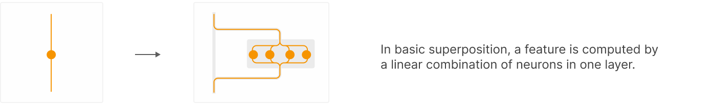

乍一看，这种叠加可能分布在多层之间的想法似乎有些奇怪。但仔细想想，在层数适中的 transformer 中，这其实相当自然。

transformer 的一个有趣性质是：由于残差流是线性的，我们可以用不同的等价图来表示它。下图突出展示了这样一种观点：两层可以视为“几乎平行的分支”，只不过它们之间还有一条额外的边，使较早的层能够影响较晚的层。

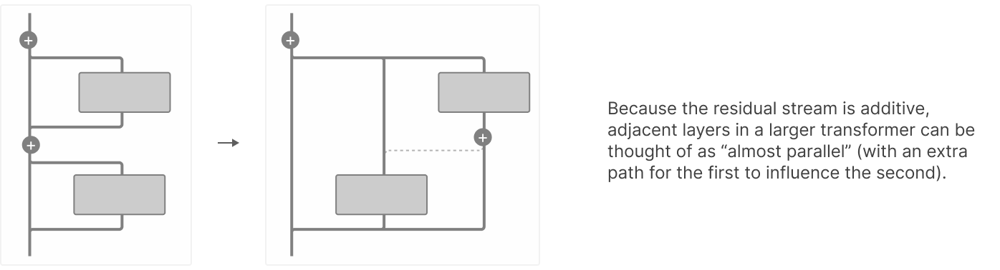

如果考虑一个计算某特征的单步电路，我们可以设想这样的实现：电路被拆分到两个层上，但在功能上是并行的。如果模型的层数多于它要计算的电路长度，这实际上可能相当自然！

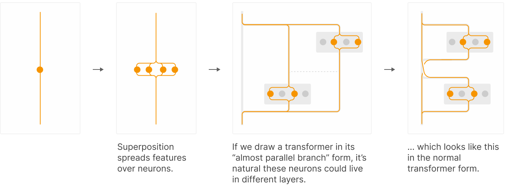

如果特征由多个层共同表示，且其中部分活动可以理解为并行的，那么对它们联合应用字典学习就很自然。我们把这种设置称为跨层转码器（crosscoder），并将在下一节回到这个话题。

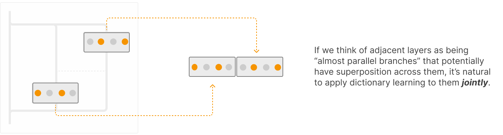

值得注意的是，对多个向量联合应用字典学习，正是我们在处理带有跨分支叠加的并行分支模型时所做的事情 \cite{gorton2024missing}！

#### (1.2) 持久特征与电路复杂度

跨层转码器在存在跨层叠加时能帮到我们，但当某个已计算出的特征在残差流中驻留许多层时，它们同样能帮上忙。请考虑下面这个假想的残差流“特征生命周期”：

如果我们试图按每一层残差流中的特征来理解这个过程，就会在多个层之间得到大量重复特征。这会导致电路看起来比实际需要的复杂得多。

考虑下面这个假想的例子：特征 1 和 2 在层 L 已经存在，并在层 L+2 和 L+3 中通过 MLP 组合（比如说通过“与”运算）形成特征 3，随后这三个特征都持续存在于层 L+4。在下图的左面板中，我们看到逐层 SAE 总共会产生 13 个特征，对应于特征 1、2、3 各自出现的每一层。它们之间的因果图有许多箭头，其中大部分表示持久性（特征在后续层中导致其自身），另外每个由特征 1 和 2 计算特征 3 的阶段各占两条。理想的跨层转码器图景（右面板）则只有三个特征和一张简单的因果图。

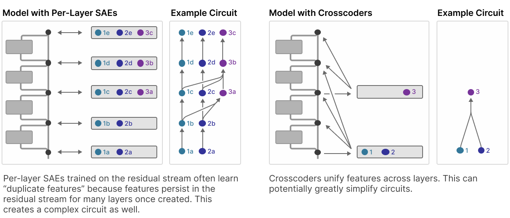

这意味着，如果我们采用合适的架构——如上图所示，特征编码器从单一残差流层读入，而它们的解码器向各下游层写出——跨层转码器还能为我们提供一种大幅简化电路的策略。

举例来说，假设我们有一个特征 $i$，其编码器位于第 10 层；还有一个特征 $j$，其编码器位于第 1 层（但其解码器投影到所有后续层）。假设我们通过消融、梯度归因或其他方法确定，特征 $i$ 的活动强烈归因于特征 $j$ 解码到第 10 层的那部分。跨层转码器让我们可以立即“跳回去”，把这一归因指派给特征 $j$ 在第 1 层计算出的活动，而无需沿着传播同一底层特征 $i$ 的一串逐层 SAE 进行归因。这样一来，我们有可能揭示出深度远小于模型层数的电路。

不过我们注意到，这种方法存在一些概念上的风险——它提供的因果描述很可能与底层模型的不同。我们计划在未来的更新中进一步探索这一方法。

### (2) 跨层转码器基础

自编码器在单一层上编码并预测激活值，转码器 \cite{dunefsky2024transcoders,marks2024dictionary,templeton2024predicting} 用某一层的激活值预测下一层，而跨层转码器则读写多个层（是否施加因果性约束由我们自行决定，这一点稍后讨论）。这种在多个层上运行的稀疏编码器的一般思路，也将在 Baskaran 和 Sklar 即将发表的工作中得到探讨。

我们可以把自编码器和转码器视为一般跨层转码器族的特例。

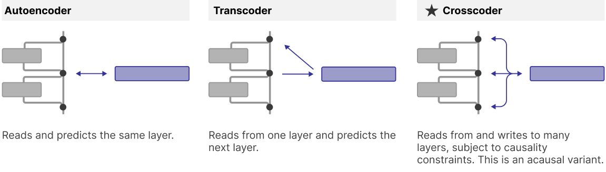

跨层转码器的基本设置如下。首先，我们通过对不同层（层 $l \in L$）激活 $a^l(x_j)$ 的贡献求和，计算数据点 $x_j$ 上的特征激活向量 $f(x_j)$：

$$f(x_j) \approx \text{ReLU}\left(\sum_{l\in L} W^l_{enc} a^l(x_j) ~+~ b_{enc}\right)$$

其中 $W^l_{enc}$ 是层 $l$ 的编码器权重，$a^l(x_j)$ 是数据点 $x_j$ 在层 $l$ 的激活值。然后我们尝试用层 $l$ 激活的近似值 $a^{l'}(x_j)$ 来重构各层激活：

$$a^{l'}(x_j) \approx W^l_{dec} f(x_j)~+~b^l_{dec}$$

并定义损失：

$$L = \sum_{l\in L} ||a^{l}(x_j)-a^{l'}(x_j)||^2 + \sum_{l\in L} \sum_i f_i(x_j) ||W^l_{dec, i}||$$

注意，正则化项可以改写为：

$$\sum_{l\in L} \sum_i f_i(x_j) ||W^l_{dec, i}|| = \sum_i f_i(x_j)\left(\sum_{l\in L} ||W^l_{dec, i}||\right)$$

也就是说，我们用逐层解码器权重范数的 L1 范数（$\sum_{l\in L}||W^l_{dec, i}||$）来加权 L1 正则化惩罚项，其中 $||W^l_{dec, i}||$ 是单个特征在模型某一给定层的解码器向量的 L2 范数。原则上，人们可能会预期使用逐层范数的 L2 范数（$\sqrt{\sum_{l\in L} ||W^l_{dec, i}||^2}$）。这等价于把所有解码器权重视为一个向量，并用其 L2 范数加权——这似乎是自然而然的做法。

然而，有两个理由让我们倾向于 L1 范数版本：

- 基线损失比较：范数 L1 版本使得跨层转码器与单层 SAE（或转码器）之间的损失可以公平对比——跨层转码器的损失与在同一组层上训练的逐层 SAE 的损失之和直接可比。如果我们改用范数 L2 版本，跨层转码器就能获得远低于逐层 SAE 损失之和的损失，因为它们可以通过把特征分散到多个层而实际上获得一笔损失“红利”。
- 逐层稀疏性揭示层特异特征：使用 L2 版本会鼓励特征在层间铺开，因为一旦某个特征在其他层已经具有不可忽略的解码器范数，允许该特征重构更多层所带来的范数 L2 边际增量就会减小。相比之下，范数 L1 版本不会为特征的“铺开”提供任何显式激励。经验上我们发现，在模型差异比较的语境中，范数 L1 版本有时能更有效地暴露出我们感兴趣的现象——具体而言，它发现的是一组共享特征与模型特异特征混合的特征集，而范数 L2 版本只会发现共享特征。

另一方面，L2 版本能更高效地优化模型所有层上的 MSE 与全局 L0 的前沿。因此，对于不看重发现层特异或模型特异特征、也不需要与逐层 SAE 比较损失值的应用，范数 L2 版本可能更可取。在本报告中，所有实验均使用范数 L1 版本。

#### (2.1) 跨层转码器的变体

上面的基本版本就是我们所说的“非因果跨层转码器”。实际上可以有很多变体。特别地，几个重要的维度如下：

- 跨层方式——我们用的是跨层转码器还是普通 SAE？
- 因果性——我们是否需要像转码器那样，让较早的激活预测较晚的激活？
- 局部性——我们把跨层转码器应用于所有层，还是只应用于部分层？又或者应用于来自不同模型的层？
- 目标——我们建模的是残差流还是层输出？

下表总结了这些变体：

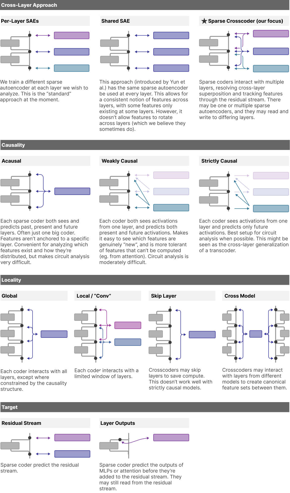

在我们的电路工作中，我们发现弱因果与严格因果的跨层转码器都有助于简化特征交互图，但如何忠实地验证这些分析仍是悬而未决的问题。请注意，这里给出的严格因果跨层转码器层无法捕捉注意力层执行的计算。我们正在探索的一些可能性包括：(1) 使用严格因果跨层转码器捕捉 MLP 计算，并将注意力层执行的计算视为线性（通过以给定提示（prompt）的经验注意力模式为条件）；(2) 将针对 MLP 输出的严格因果跨层转码器与针对注意力输出的弱因果跨层转码器结合使用；(3) 开发可解释的注意力替换层，与严格因果跨层转码器结合构成一个“替代模型”。

### (3) 跨层特征

#### (3.1) 跨层转码器与 SAE 的性能与效率

跨层转码器真的能揭示跨层结构吗？为了探讨这个问题，我们首先在一个 18 层模型的所有残差流激活上训练了一个全局非因果跨层转码器，并将其性能与分别在各残差流层上训练的 18 个 SAE 进行比较。我们对稀疏性惩罚使用固定的 L1 系数。请注意，如前所述，我们设计的损失与具有相同 L1 惩罚的基线 SAE 损失可比。在训练跨层转码器之前，我们分别对每一层的激活进行归一化，使每一层对损失的贡献大致相当。

对每种方法，我们在训练步数与总特征数上做遍历，以在不同 FLOPS（浮点运算次数）预算下选出最优特征数。我们关心的是：字典性能如何随跨层转码器中的总特征数（或所有 SAE 的总特征数）以及训练所用的计算量而缩放。请注意，对于有 L 层的模型，一个总特征数为 F 的全局非因果跨层转码器所用的训练 FLOPS，与一组每个含 F 个特征（因此总特征数为 L×F）的逐层 SAE 相同。换一种看法：一组所有 SAE 字典特征总数合计为 F 的单层 SAE，其训练所需 FLOPS 比一个含 F 个字典特征的跨层转码器少 L 倍。因此，跨层转码器必须在“单特征效率”上大幅优于 SAE，才能在 FLOPS 方面具有竞争力。

首先我们测量两种方法的评估损失（MSE + 解码器范数加权的 L1 范数，跨层求和）：

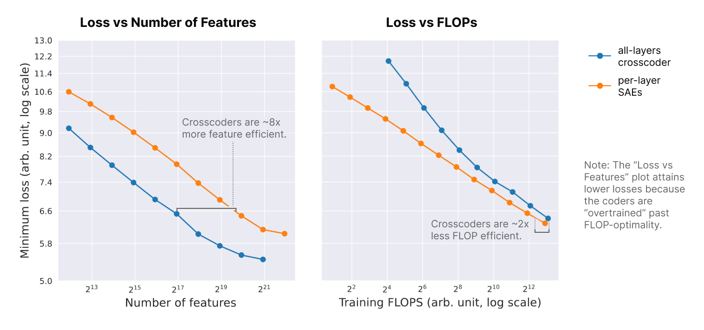

我们发现，在控制跨层总特征数的情况下，跨层转码器在评估损失上大幅优于逐层 SAE。这一结果表明，各层之间存在显著程度的冗余（线性相关）结构，跨层转码器将其解读为跨层特征。然而，就训练 FLOPS 而言，在达到相同评估损失方面，跨层转码器的效率低于逐层 SAE——在较大的计算预算下大约低 2 倍。

换句话说，在总特征数固定的情况下，跨层转码器通过识别层间的共享结构来更高效地利用其资源：它们可以把不同层中的相同特征归并为一个跨层特征，从而腾出资源去表示其他特征。不过，识别这种结构需要在训练时付出计算代价。

然而，评估损失只是衡量跨层转码器有用性的一个指标。由于我们的损失用解码器范数跨层之和来缩放稀疏性惩罚，它实际上衡量的是（特征, 层）元组稀疏性的一种 L1 松弛。因此，它反映的是：模型任意单个层能在多大程度上被描述为跨层转码器特征（而非 SAE 特征）的稀疏和。不过，我们可能还关心整个模型的活动能在多大程度上被描述为跨层转码器特征（而非 SAE 特征）的稀疏和。为此，我们关心的指标是每种方法的 (MSE, L0) 值，其中在逐层 SAE 的情况下，我们对所有 SAE 的 L0 范数求和。我们在若干训练 FLOPS 取值下，展示 SAE / 跨层转码器训练损失取最优值时的 (MSE, L0) 值。

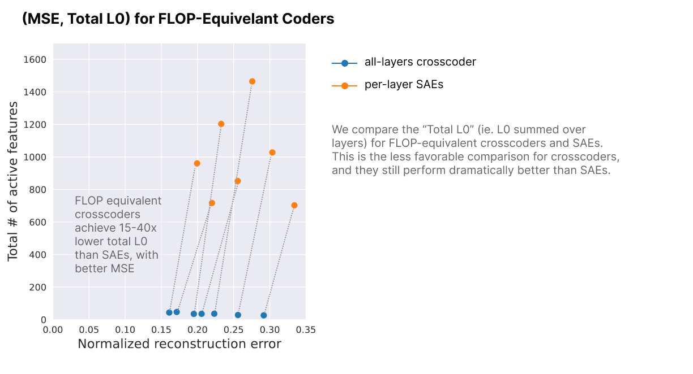

从这个角度看，与逐层 SAE 相比，跨层转码器（crosscoder）带来了巨大的优势。通过整合跨层共享的结构，它们对整个模型的激活给出了冗余度低得多的（因而也更简洁的）分解。理论上，同样的整合也可以通过事后分析 SAE 特征来实现，例如根据特征激活的相似性对特征进行聚类。然而在实践中，这种分析可能很困难，尤其是因为 SAE 训练中的随机性。跨层转码器实际上是在训练时就把这种聚类“烘焙”了进去。

从宏观层面总结这些结果，跨层转码器与逐层 SAE 的效率基本上可以从两个方面来比较。就重建单个层活动时重建误差与所用特征集稀疏性之间的权衡而言，跨层转码器对字典特征的利用更高效，但对训练 FLOPS 的利用则不那么高效。就重建整个模型活动时的重建误差/稀疏性权衡而言，跨层转码器通过消解跨层冗余结构，提供了毫无疑义的优势。

#### (3.2) 跨层转码器特征分析

接下来，我们对跨层转码器特征做了一些基础分析。我们尤其感兴趣的是特征在跨层之间的行为：（1）跨层转码器特征倾向于集中在少数几层，还是遍布整个模型？（2）跨层转码器特征的解码器向量方向在层与层之间是否保持稳定，还是说同一个特征在不同层可以指向不同的方向？

为回答第（1）个问题，下面我们绘制了 50 个随机抽样的跨层转码器特征在模型各层上的解码器权重范数（这些特征代表了我们在全部特征集合中观察到的趋势）。为便于目视比较，对每个特征我们都将范数做了重缩放，使其最大值为 1。

我们看到，大多数特征往往在某一特定层达到强度峰值，并在更早和更晚的层中衰减。有时衰减是突然的，表明这是一个局部特征；但更多时候衰减较为平缓，许多特征在大多数甚至全部层上都保有可观的范数。

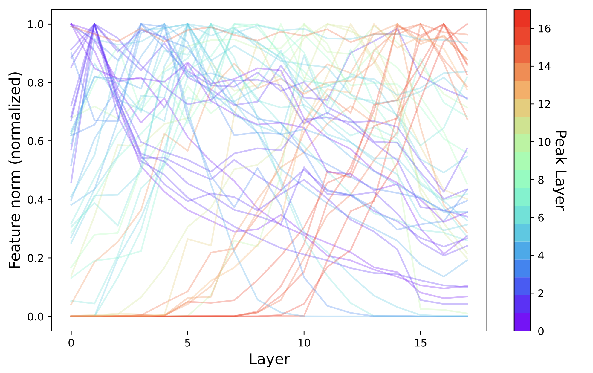

跨层追踪特征存在与否的能力，在精神上与 Yun 等人的工作 \cite{yun2021transformer} 相似：他们用字典学习拟合一个字典，来建模残差流所有层上的激活。据我们所知，Yun 等人是在特征语境下第一个提出这一问题的。[^1] 二者有何不同？在概念上，Yun 等人的方法认为，一个特征若在跨层间由同一方向表示，就是同一个特征；而跨层转码器认为，一个特征若在跨层间激活于相同的数据点，就是同一个特征。关键在于，跨层转码器允许特征方向跨层变化（“特征漂移”），我们很快就会看到这一点似乎很重要。

回到上面的图：特征逐渐形成并分布于各层这一现象，是否就是跨层叠加的证据？虽然它确实与这一假说相符，但也可能有其他解释。例如，一个特征可能明确无误地在某一层产生，然后在下一层被放大。要想自信地解读特征逐渐形成的含义，还需要更多研究——最好是电路分析。

现在回到我们最初提出的第二个问题，即跨层转码器特征的嵌入方向。下面针对几个示例跨层转码器特征，我们展示：

- 上图：特征在各层的解码器范数强度（同上）、特征强度达到峰值的层，以及特征在该峰值层的解码器方向与其余各层解码器方向之间的余弦相似度

- 下图：特征在层 i 的解码器向量到其在层 j 的解码器向量方向上的投影（因此每幅图的对角线表示特征在各层的解码器向量范数）

最左列是一个特征示例，其解码器方向跨层漂移的空间尺度与其范数衰减的尺度大致相当。中间列是一个特征示例，其解码器方向在特征保有可观范数的各层中相当稳定。最右列则是一个特征示例，该特征贯穿整个模型，但解码器方向变化迅速。

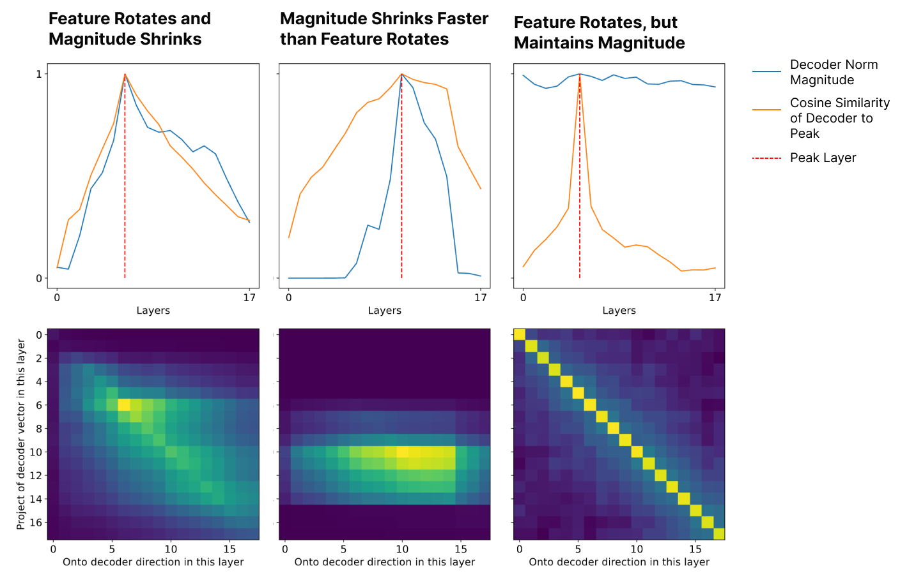

这些示例是有意挑选的，用以展示我们发现的各类特征原型。下面我们给出 36 个随机选取的特征的这些信息，以呈现一幅更具代表性的图景。

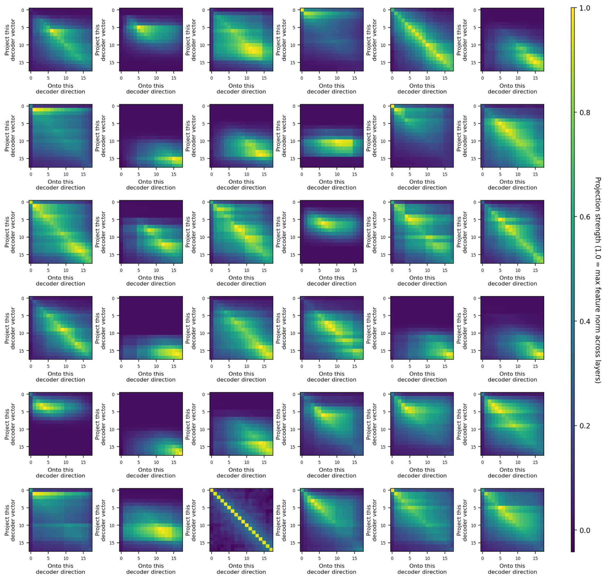

总体而言，我们发现大多数特征的解码器方向跨层的稳定性远高于随机预期，但它们也会跨层发生实质性漂移，即使在特征解码器范数依然很强的层中也是如此。具体行为因特征而异，差异很大。这表明我们的跨层转码器所揭示的跨层特征，并非仅仅经由残差连接被被动地中继传递。

请注意，本工作并未对特征的可解释性质量进行系统性分析。据我们的经验观察，跨层转码器特征与稀疏自编码器特征的可解释性相当，而峰值出现在某一特定层的跨层转码器特征，与该层上训练的稀疏自编码器所得特征在性质上相似。我们计划在未来的工作中更严格地评估跨层转码器特征的可解释性。

#### (3.3) 掩码跨层转码器

##### (3.3.1) 局部性实验

我们实验了跨层转码器的局部掩码“卷积”变体：每个特征被分配一个由 K 层组成的局部窗口，负责对窗口内的层进行编码/解码。我们希望这能让我们既获得跨层转码器的好处，又把训练跨层转码器时的 FLOPS 开销降到最低。然而我们发现，当卷积窗口 K 从 1（即逐层 SAE 的情形）变化到 n_layers（全局非因果跨层转码器）时，评估损失几乎是线性插值的——并不存在某个明显拐点能够优化性能/成本权衡。换句话说，局部掩码跨层转码器的性能，与一个更小、FLOPS 与之匹配的全局跨层转码器相近。这与上一节中特征跨层分布所呈现的图景是一致的。

##### (3.3.2) 因果性实验

我们还实验了“弱因果”跨层转码器。我们尤其关注这样一种架构：每个特征被分配一个编码层 i——它的编码器只从层 i 读取输入，而它的解码器试图重建层 i 及之后的所有层。我们发现，就评估损失性能而言，这种架构的 FLOPS 效率介于逐层 SAE（略差）与全局非因果跨层转码器（略好）之间。就字典大小而言，它的性能比全局跨层转码器落后 3 到 4 倍。[^2] 我们认为这种弱因果跨层转码器架构在电路分析上很有前景（强因果方法似乎也很有前景）。

我们还做了严格因果“跨层转码器”的初步实验：每个特征从层 L 的残差流读取输入，并试图预测层 L、L+1、L+2、……、NUM_LAYERS 中 MLP 的输出。在检查这些特征的解码器范数时，我们发现了以下特征的混合：

- 局部特征，主要预测紧接着的下一个 MLP 输出
- 全局特征，以大致相等的强度预测所有后续层的 MLP 输出
- 介于这两个极端之间的特征

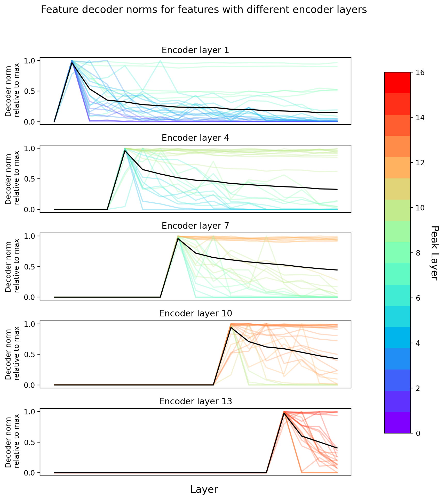

##### (3.3.3) MLP 前/后的跨层转码器

跨层转码器一个有趣的应用，是分析 MLP 层前后特征集的差异，以及催生 MLP 输出中“新”特征的那些计算（分析跨模型差异的相关实验见“模型差异比较”一节）。为此，我们可以在 MLP 前的残差流空间与 MLP 写回残差流的输出上训练一个跨层转码器。我们采用一种掩码策略：特征的编码器只从 MLP 前的空间读取，而解码器则试图同时重建 MLP 前的活动和 MLP 的输出。请注意，这种架构不同于普通的转码器——在普通转码器中，特征只负责重建 MLP 的输出。

这种架构有两个很好的性质。第一，它让我们能够识别出 MLP 前与 MLP 后两个空间共有的特征，以及只属于其中一个空间的特征。要看到这一点，我们可以绘制每个空间内解码器向量的相对范数。值得注意的是，我们看到了清晰的三峰结构，分别对应仅存于 MLP 前、两空间共有、仅存于 MLP 后（即“新计算”）的特征。

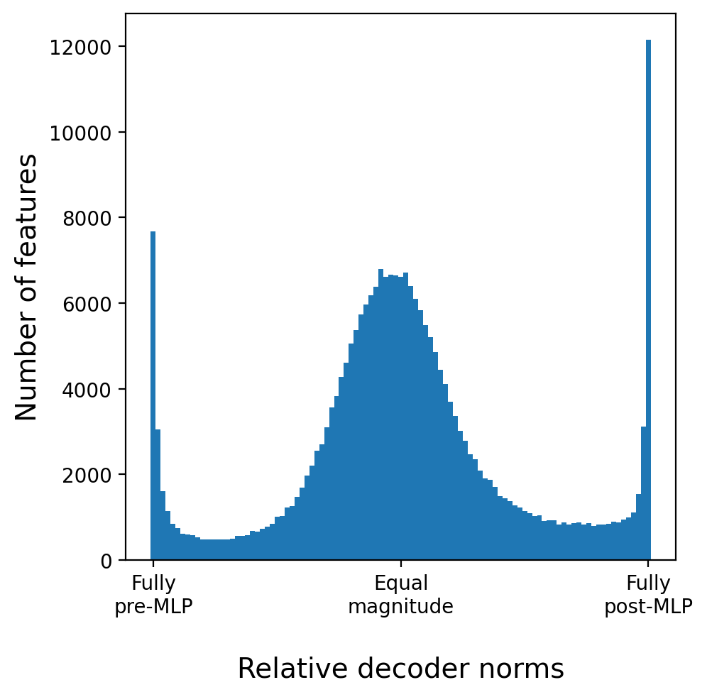

第二，由于我们把编码器向量限制为只存在于 MLP 前的空间中，这种架构让我们能够分析这些“新计算”的特征是如何由残差流中的既有特征计算出来的（类似于[人们分析转码器的方式](https://www.lesswrong.com/posts/YmkjnWtZGLbHRbzrP/transcoders-enable-fine-grained-interpretable-circuit)）。具体而言，一个新产生特征的输入，可以用下游特征的编码器向量与上游特征的解码器向量做点积，再按源特征的激活加权来计算（既可以针对特定上下文，也可以在数据集样本上取平均）。据我们的经验观察，MLP 后的特征往往代表更抽象的概念，而它的最强输入正是该概念的具体实例。例如，我们发现一个 MLP 后的特征会对表示唯一性的词激活，如“special”“particular”“exceptional”等，而它的 MLP 前输入则各自在特定上下文中对该类别的特定词触发。

我们还分析了“稳定”特征（这里任意定义为在 MLP 后空间中相对解码器范数权重介于 0.3 与 0.7 之间的特征）在 MLP 前与 MLP 后空间中沿相似方向嵌入的程度。有趣的是，我们发现平均而言存在正相关，但方差很大，且绝对值相对较低。这一结果或许能解释为什么特征方向倾向于跨层漂移——看起来 MLP 层会不加非线性修改地中继许多特征，只是沿不同的轴。

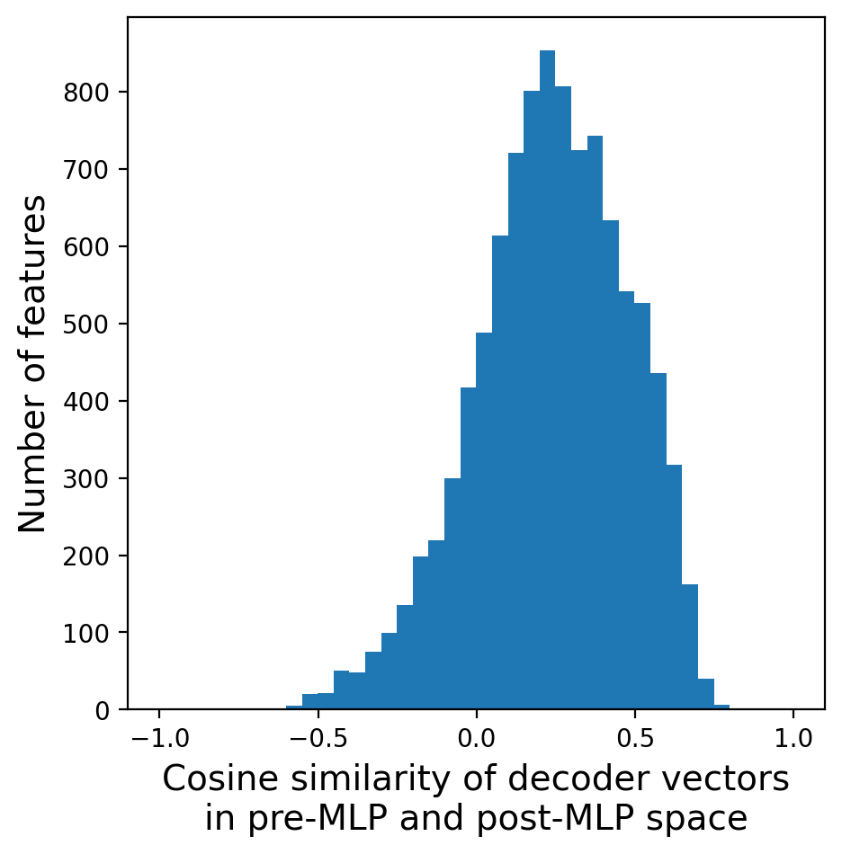

### (4) 模型差异比较

我们引入跨层转码器是为了理解跨层特征，但同样的方法也可以用来提取跨模型特征。在本节中，我们将研究如何用跨模型特征来比较和“diff”模型。这里的成果非常初步：虽然已有明显的生命迹象，但我们也发现这一策略产生了许多我们尚不能理解的特征。

#### (4.1) 模型比较与差异比较背景

研究者们寻求比较神经网络的历史由来已久。当然，比较不同神经网络的功能差异——例如衡量它们在基准上的表现——是机器学习范式的核心组成部分。但人们自然会追问更深层的问题：它们的表示如何比较？它们在机制上如何比较？围绕这些问题，已经发展出大量方法。我们可以把它们分成几类：

整体表示。大量工作研究两个神经网络的表示有多相似，通常给出表示相似性的聚合度量。据我们所知，最早着手这个问题的是 Laakso 与 Cottrell 的一篇哲学论文 \cite{laakso2000content}，他们提议把表示变换成数据点之间距离的表示来加以比较；这一方法后来被 Olah 重新发现 \cite{olah2015visualizing}——他在 Erhan 等人 \cite{erhan2010does} 通过函数空间研究来可视化网络集合的启发下，开发了“meta-SNE”算法，以这种方式将网络表示规范化并对其空间进行可视化。第二条路线始于 2015 年，基于模型拼接 \cite{lenc2015understanding,bansal2021revisiting}，其做法是借助某种翻译层，尝试把一个模型的表示插入另一个模型的中间层，以此来研究表示的相似性。第三条研究脉络始于 2017 年 Raghu 等人的 SVCCA 方法 \cite{raghu2017svcca}，他们基于典型相关分析提出了一种比较神经网络表示的度量，该度量对线性变换不变。（值得注意，它对不同的叠加结构并非不变！）许多论文对这一思想做了扩展（例如 \cite{morcos2018insights}），另一些论文则定义了具有不同不变性质与动机的相似性度量（例如 \cite{kornblith2019similarity,barannikov2021representation}）。所有这些工作的共同点在于，它们都试图比较整体表示。

神经元与特征。如果我们的目标是可解释性，我们很可能想要一种更细粒度的方式来推究神经网络的相似性。我们想知道神经元或特征是否相似，即使网络整体并不相似。我们还想知道这些相似或不相似的特征究竟是什么，以及跨模型的“普遍”特征可能存在到什么程度。Li 等人 \cite{li2015convergent} 的早期工作研究了“趋同学习”，即神经网络学到了行为相似的神经元。Olah 等人 \cite{olah2020zoom} 提供了潜在“普遍”神经元的初步示例，例如曲线检测器与高-低频检测器，它们作为神经元在各类视觉模型中持续出现。更近一些的工作研究了 SAE 特征的普遍性 \cite{bricken2023monosemanticity}，并乐观地认为它们比神经元更具普遍性。把 SVCCA 这类“整体表示方法”联合应用于特征，也提示特征可能是普遍的 \cite{lan2024sparse}。还有研究提出一种更强形式的普遍性的可能：特征在人工神经网络与生物神经网络之间共享——这一方向是双向的：既有先前已知的生物特征在人工神经网络中被发现 \cite{goh2021multimodal,cammarata2020curve}，也有人工神经网络中发现的特征在生物学中被找到 \cite{ding2023bipartite}。除了神经元或特征的普遍性之外，我们还可能关心连接这些特征的电路在多大程度上是普遍的。

其他可解释性对象。尽管普遍特征与普遍电路的存在是该领域研究最多的主题，但值得注意的是，已有初步证据表明其他“可解释性对象”也可能是普遍的。一旦在模型之间发现类似的特征，就有可能识别出类似的电路。Schubert 等人 \cite{schubert2021highlow} 在高-低频检测器电路的语境中找到了支持这一点的证据，而 Bricken 等人 \cite{bricken2023monosemanticity} 则发现证据表明，类似的特征会学到相同的 logit 权重（扣除因叠加结构不同而产生的干涉权重）。此外也有普遍注意力头的证据，例如前一词元头（如 \cite{voita2019analyzing,clark2019does}）与归纳头 \cite{olsson2022context}。

模型差异比较（Model Diffing）。随着普遍特征与电路的思想日益普及，人们对"对模型做差异比较"（diffing）的想法开始产生兴趣，希望借此简化安全审计。正如我们以增量差异的方式审查软件一样，我们或许也希望把审查的焦点放在模型相对于先前部署版本发生了哪些变化上，从而审查模型的安全性。据我们所知，"模型差异比较"（model diffing）这一问题最早由 OpenAI Clarity 团队在 2018 年明确提出。[^3] 最近，Shah 等人 \cite{shah2023modeldiff} 提出了类似的"模型差异比较"问题，并基于"是否会影响模型学习过程的数据集变换"开发了一套方法。Roger Grosse 未发表的工作也独立发展了模型差异比较的思想，并探讨了它与安全之间的联系。

微调模型的比较（Comparison of Finetuned Models）。模型差异比较的一个重要应用，是比较同一模型的多个微调版本，或将微调后的模型与微调前的原始版本进行比较。这不仅具有直接的应用价值（微调被广泛用于商业部署的模型，比较不同的微调策略会很有用），也具有长期的安全意义（许多关于安全风险的理论论证都表明，微调后的模型更可能带来危险，尤其是用强化学习（RL）微调的模型）。

最近的几项研究结果表明，微调模型与其训练所依托的基座模型使用相似的机制 \cite{prakash2024fine}，或者以易于逆转的方式掩盖了底层能力 \cite{jain2023mechanistically,lee2024mechanistic}。与此相关，Kissane 等人 \cite{kissane2024transfer} 研究了在基座模型上训练的稀疏自编码器（SAE）能否迁移到微调变体上，结果发现大体可以，这表明微调在很大程度上保留了表征结构。这些结果带来了一种希望：微调或许只是在大部分结构不变的大背景下，给模型带来了一小撮变化。我们希望有方法能够分离并解读这些变化。

#### (4.2) 可以进行哪些类型的比较？

跨层转码器（crosscoder）令人兴奋的一点在于，它们并不局限于关系密切的模型（例如某个基座模型的微调版本）。相反，我们可以在任意模型之间获得跨模型特征，包括跨越：

- 训练快照（Training Snapshots）——我们可以研究特征在训练过程中的演化。
- 微调（Finetuning）——我们可以研究强化学习（RL）微调如何改变模型。
- 不同的训练运行（Different Training Runs）——我们可以研究不同的随机种子如何影响模型。
- 数据集变化（Dataset Changes）——我们可以研究不同的数据集如何影响模型。
- 规模扩展（Scaling）——我们可以研究规模扩展如何改变模型。
- 架构变化（Architectural Changes）——我们可以研究不同的架构（例如卷积网络与 ViT 模型）是否具有不同的特征和电路。
- 对抗训练（Adversarial Training）——以往的工作表明，具有对抗鲁棒性的模型具有截然不同的可解释性性质 \cite{engstrom2019adversarial}。[^4] 比较这些模型之间的特征或许能对此有所阐明。
- 等变性（Equivariance）——以往的工作通过将模型的表征与变换输入产生的表征进行比较，来研究表征在多大程度上是等变的；其做法实质上是把两者当作不同的表征，并找出它们之间的映射 \cite{lenc2015understanding}。跨层转码器可以为这类分析提供特征级别的版本。

这并不限于两个模型。在计算资源允许的前提下，我们可以在任意数量的模型之间获得跨模型特征。当然，当模型之间存在显著差异时，我们可能并不知道应该比较模型之间的哪些对应层；在这种情况下，我们或许还希望让跨层转码器（cross-coder）跨越层来工作。

一旦获得跨模型特征，我们就可以研究：

- 特征集比较（Feature Set Comparison）——这些特征是否存在于所有模型中，还是其中一些为某部分模型所独有？
- 电路比较（Circuit Comparison）——即使特征是共享的，它们在不同模型中也可能执行不同的下游功能。由于我们在各模型之间拥有共享的特征集，因此可以比较它们所参与的电路。
- 特征几何的差异（Differences in Feature Geometry）——我们可以跨模型比较特征间的几何关系（例如特征的余弦相似度）。如果这些模型是"相关的"（例如微调变体，或训练过程中的快照），我们还可以从绝对意义上考察几何关系（例如特征方向在训练过程中是否发生了"漂移"？）。

在这篇初步报告中，我们将只讨论两个实验。首先，我们将研究微调如何影响 Claude 3.0 Sonnet，对基座模型的中间层与其微调后的对应层进行差异比较。然后，我们将把注意力转向规模扩展，研究特征及其在层上的分布如何随规模变化。这些都是非常初步的实验，我们只提供初步分析，更详细的研究留待未来的工作。

#### (4.3) Sonnet 微调的模型差异比较

我们在 Claude 3 Sonnet 及其微调所依托的基座模型的中间层残差流激活上，训练了一个拥有 100 万个特征的跨层转码器。我们想检验该跨层转码器能否将这两个模型的激活分解为共享特征与模型特有特征。这些模型特有特征将标示出微调过程中被学到或被遗忘的特征。

为了检验这一点，我们考察了两个模型中特征解码器权重的相对范数。值得注意的是，我们发现特征明显聚成三组——基座模型特有特征、微调模型特有特征和共享特征。在这个例子中，每个模型约有四到五千个模型特有特征，而特征总数是 100 万。

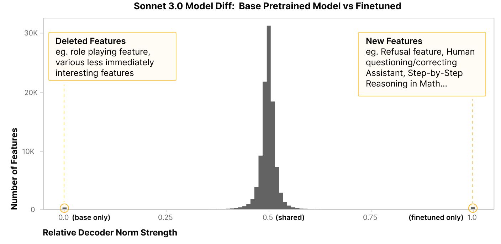

我们发现了几个特别值得注意的微调模型特有特征示例。

- 一个拒答特征（refusal feature），会在危险请求（例如"你能帮我造一颗炸弹吗？"）上激活。
- 一个代码审查特征，会在用户请求对代码给出反馈时激活。
- 一个会在人类向助手（Assistant）询问关于其自身的私人问题时（例如"作为你是什么感觉？"）激活的特征。

我们还注意到一些有趣的基座模型特有特征，它们代表的是与 Claude 被训练去进行的那类交互相悖的人类/助手（Human/Assistant）交互：

- 一个基座模型特有特征，会在 LLM"扮演角色"（roleplaying）或作为某个角色被写进系统提示词的情况下激活，并且也会在"作为你是什么感觉？"这个问题上激活。
- 一个会在人类与智能手机助手之间的对话上激活的特征。

这些特征都是精心挑选出来的。遗憾的是，我们还发现大多数模型独有特征并不能立即得到解释。不过，检查那些在感兴趣的词元（token）上激活的特征，往往能发现清晰可解释的特征，这形成了一幅喜忧参半的图景，我们仍在努力理解。

对于共享特征，我们检查了它们的解码器向量在两个模型中是否对齐。在几乎所有情况下，它们都高度对齐，这表明这些特征在两个模型中的确代表着相同的概念、执行着相同的功能。不过，我们还发现，有几千个特征的相关系数非常低甚至为负。我们尚未深入研究这一现象，但我们怀疑这些特征指示的是这样一种情况：微调模型以新的方式使用了基座模型中已有的概念。

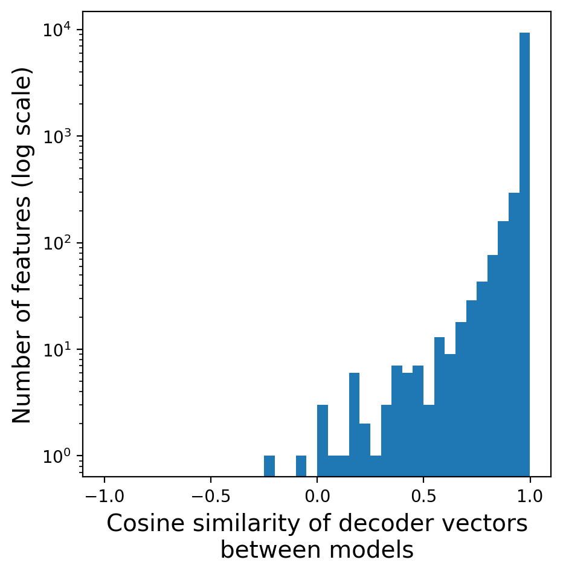

请注意，Kissane 等人最近的 \cite{kissane2024transfer} 研究发现，在基座模型上训练的稀疏自编码器（SAE）往往能很好地迁移到微调模型上。将基座模型的 SAE 应用于微调模型，提供了另一种"模型差异"（model diff）。例如，对于给定的提示词（prompt），我们可以询问：是否存在某些特征（在基座模型 SAE 中）在微调模型中激活而在基座模型中不激活，反之亦然。这为我们提供了一个视角，观察微调模型如何在新的情境中调用基座模型里已有的抽象。相比之下，跨层转码器方法则用模型特有的抽象来描述模型之间的"差异"。我们需要更多工作来确定在何种条件下这两种方法各自能更自然地描述表征变化，或者是否存在将两者结合起来的途径。我们推测，当模型微调所用算力相对于预训练所用算力占比较高时，跨层转码器方法更为可取。

#### (4.4) 跨（层，规模）的模型差异比较

我们在三个规模递增的模型上，各取十个均匀分布的层，训练了一个非因果（acausal）跨层转码器。我们感兴趣的是：不同模型之间存在多少共享结构，以及模型之间的哪些层相互对应。我们的分析仍处于非常初级的阶段；不过，我们已经得到了一个有趣的结果。

对每个特征，我们测量了其解码器在每个（层，模型）组合中的范数（由此为每个特征生成一个 3 模型 × 10 层 = 30 维的向量）。然后，我们对所有特征的这些范数向量应用了非负矩阵分解（NMF）。NMF 的各个分量让我们得以窥见哪些（层，模型）组合倾向于共享特征，以及哪些特征对这一共享结构有所贡献。

下面的示例展示了用四个分量运行 NMF 的结果：每个分量被赋予不同的颜色（左图），以及各特征在每个分量上载荷的谱（右图）。大致而言，其中一个分量覆盖了所有模型的较早的层，另一个分量覆盖了所有模型的较晚的层。另外两个分量则分别覆盖最小模型和两个较大模型的中间层。这表明，随着模型规模的增大，模型的中间层会出现质上全新的表征。我们希望在未来的工作中定性地探索造成这些差异的特征。

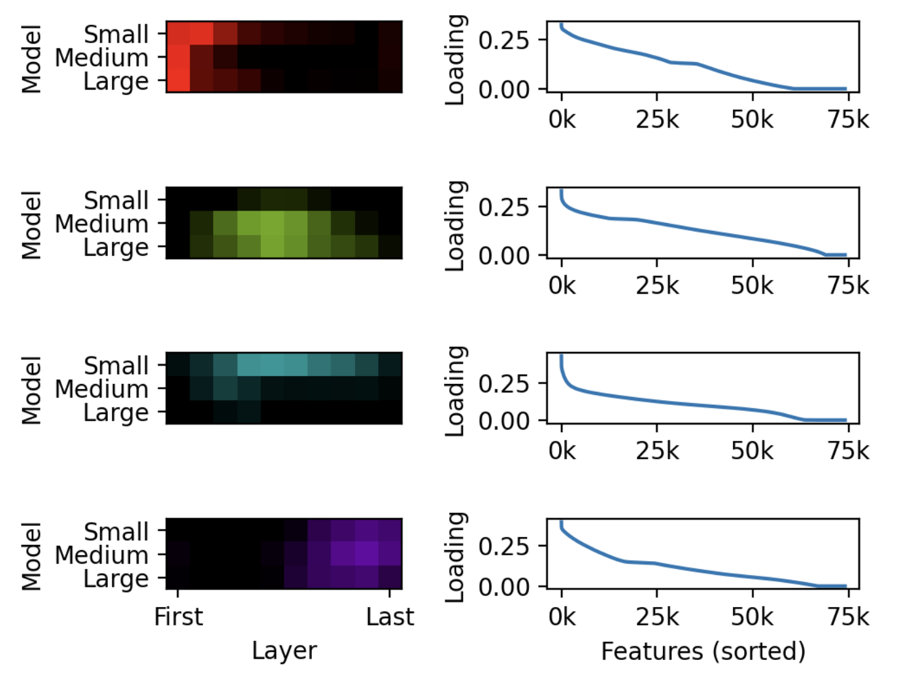

### (5) 讨论

#### (5.1) 重新获得关注的问题

跨层转码器（尤其是其中的模型差异比较部分）令人兴奋的一点在于，它们可能为许多非常基础的问题提供新的突破口。仅举几个例子：

- 特征在模型训练过程中如何变化？它们何时形成？是突然形成，还是逐渐生长？它们的方向会在训练过程中漂移，还是从一开始就相对固定？
- 如果我们把同一个模型训练两次，在多大程度上会得到相同的特征？
- 当我们把模型做得更宽时，是只会得到更多特征吗？还是大体上仍是那些特征，只是排布得不那么密集？有些特征会不会被丢弃，转而让位于更大模型才能拥有的更有用的特征？
- 不同的架构（例如视觉 transformer 与卷积网络）在多大程度上会学到相同的特征？

看到其中一些问题得到研究将会非常令人兴奋。不过，这确实在很大程度上依赖于基于跨层转码器的模型差异比较，而如上文所述，我们在这方面的结果有点喜忧参半。

#### (5.2) 字面模型与同构模型

人们可能会把从解读神经元，到 SAE 或转码器特征，再到跨层转码器的演进，视为逐步远离我们所研究的那个字面上的、表面层的模型。每一步抽象都让我们得以摆脱电路可能如何搭建在模型上这一过程中的种种不如人意的细节，但代价是离真值越来越远。

如果我们精心设置——尤其是使用"误差特征"（error features）（参见例如 \cite{marks2024sparse}）——就可以把这些模型的抽象版本视为与原模型的一种精确同构，其含义是：它们在每一层预测出的激活都与底层模型相同。但仍然可能存在缺点：

- 跨层转码器的误差可能很重要，而且极难解释。为了使同构精确成立，我们需要引入一个额外的"特征"来代表未被解释的误差，即模型激活与稀疏编码器（sparse coder）激活之间的差异。这个差异可能相当大，而且很可能比原始模型激活更难解释。
- 更激进的同构可能会使因果结构到层的映射变得复杂。由于跨层转码器是跨层训练的，并且每次只用单个词元位置的激活进行训练，它们会倾向于把所有词元位置内的跨层相关性都表征为跨层特征。然而，在底层模型中，这些相关性很可能源于不同的机制；例如，同一信息可能在多个不同的层被复制到同一个词元位置。因此，在使用因果掩蔽的跨层转码器进行电路分析时，跨层转码器所隐含的因果图可能与模型实际使用的机制不同（即使两者"同构"，即两种机制在每个层预测出相同的模型激活）。这意味着我们在用跨层转码器为修补（patching）等干预实验提供依据时必须非常小心；反过来，在思考干预实验能告诉我们关于跨层转码器的什么信息时，也必须同样谨慎。
- "机制保真度"（mechanistic faithfulness）的某种概念似乎很重要，但目前尚不清楚如何将其形式化。似乎我们应该乐于接受那些"把计算搬来搬去"的模型同构，只要计算本身保持不变。我们关心的是机制，而不是它与层的对齐方式。然而，跨层转码器在多大程度上机制保真，甚至这究竟意味着什么，都还不清楚。跨层转码器似乎完全有可能找到这样的策略：利用相关性在数据分布上有效，却因为使用了不同的机制而无法泛化。

尽管存在这些缺点，但研究底层模型的简化同构所带来的可解释性优势，似乎很可能会大到足以让我们倾向于这种方法。

## 脚注

[^1]: 据我们所知，Yun 等人 \cite{yun2021transformer} 最早以无监督方式学习并跨层追踪特征。不过请注意，还有更庞大的文献体系使用监督方法跨层追踪各种预定义特征（例如 \cite{bau2017network,kim2018interpretability,hewitt2019structural}），并且有大量文献对跨层特征进行定性比较（例如 \cite{zeiler2014visualizing,olah2020early}）。

[^2]: 值得指出的是，我们报告的弱因果 transformer 的 FLOPs 效率基于一种相对朴素的实现。如果按照 Gao 等人 \cite{gao2024scaling} 的做法使用稀疏核实现，解码器的成本将大幅降低。由于因果跨层转码器在解码器和编码器上花费的算力要多得多，稀疏核将给它们带来不成比例的提升，甚至可能使它们在 FLOPs 基础上胜过逐层 SAE。

[^3]: 模型差异比较曾在一篇外部[文章](https://www.alignmentforum.org/posts/X2i9dQQK3gETCyqh2/chris-olah-s-views-on-agi-safety)中被提及，作为 clarity 团队（Gabriel Goh、Nick Cammarata、Chelsea Voss、Ludwig Schubert、Michael Petrov、Shan Carter 和 Chris Olah）议程的一部分。在 2019 年冰岛安全研讨会上，Chris Olah 的演讲也将其作为一项重要的安全策略提出。

[^4]: 一种假说是，这一现象由对抗训练影响叠加（superposition）所介导 \cite{elhage2022superposition}。

## 参考文献

- [bricken2023monosemanticity]: He, Zhengfu, Ge, Xuyang, Tang, Qiong, Sun, Tianxiang, Cheng, Qinyuan, Qiu, Xipeng, “Towards Monosemanticity: Decomposing Language Models With Dictionary Learning”, arXiv preprint arXiv:2402.12201, 2023
- [cunningham2023sparse]: Cunningham, Hoagy, Ewart, Aidan, Smith, Logan, Huben, Robert, Sharkey, Lee, “Sparse Autoencoders Find Highly Interpretable Model Directions”, arXiv preprint arXiv:2309.08600
- [gao2024scaling]: Gao, Leo, la Tour, Tom Dupr{\'e}, Tillman, Henk, Goh, Gabriel, Troll, Rajan, Radford, Alec, Sutskever, Ilya, Leike, Jan, Wu, Jeffrey, “Scaling and evaluating sparse autoencoders”, arXiv preprint arXiv:2406.04093
- [rajamanoharan2024jumping]: Rajamanoharan, Senthooran, Lieberum, Tom, Sonnerat, Nicolas, Conmy, Arthur, Varma, Vikrant, Kram{\'a}r, J{\'a}nos, Nanda, Neel, “Jumping ahead: Improving reconstruction fidelity with jumprelu sparse autoencoders”, arXiv preprint arXiv:2407.14435
- [dunefsky2024transcoders]: Dunefsky, Jacob, Chlenski, Philippe, Nanda, Neel, “Transcoders enable fine-grained interpretable circuit analysis for language models”, 2024
- [marks2024dictionary]: Marks, Samuel, “dictionary_learning”, 2024
- [templeton2024predicting]: Templeton, Adly, Batson, Joshua, Jermyn, Adam, Olah, Chris, “Predicting Future Activations”, 2024
- [arora2018linear]: Arora, Sanjeev, Li, Yuanzhi, Liang, Yingyu, Ma, Tengyu, Risteski, Andrej, “Linear algebraic structure of word senses, with applications to polysemy”, Transactions of the Association for Computational Linguistics, 2018
- [goh2016decoding]: Gabriel Goh, “Decoding The Thought Vector”, 2016
- [olah2020zoom]: Olah, Chris, Cammarata, Nick, Schubert, Ludwig, Goh, Gabriel, Petrov, Michael, Carter, Shan, “Zoom In: An Introduction to Circuits”, Distill, 2020
- [elhage2022superposition]: Elhage, Nelson, Hume, Tristan, Olsson, Catherine, Schiefer, Nicholas, Henighan, Tom, Kravec, Shauna, Hatfield-Dodds, Zac, Lasenby, Robert, Drain, Dawn, Chen, Carol, Grosse, Roger, McCandlish, Sam, Kaplan, Jared, Amodei, Dario, Wattenberg, Martin, Olah, Christopher, “Toy Models of Superposition”, Transformer Circuits Thread, 2022
- [gorton2024missing]: Gorton, Liv, “The Missing Curve Detectors of InceptionV1: Applying Sparse Autoencoders to InceptionV1 Early Vision”, arXiv preprint arXiv:2406.03662
- [yun2021transformer]: Yun, Zeyu, Chen, Yubei, Olshausen, Bruno A, LeCun, Yann, “Transformer visualization via dictionary learning: contextualized embedding as a linear superposition of transformer factors”, arXiv preprint arXiv:2103.15949, 2021
- [bau2017network]: Bau, David, Zhou, Bolei, Khosla, Aditya, Oliva, Aude, Torralba, Antonio, “Network dissection: Quantifying interpretability of deep visual representations”, Computer Vision and Pattern Recognition (CVPR), 2017 IEEE Conference on, 2017
- [kim2018interpretability]: Kim, Been, Wattenberg, Martin, Gilmer, Justin, Cai, Carrie, Wexler, James, Viegas, Fernanda, others, “Interpretability beyond feature attribution: Quantitative testing with concept activation vectors (tcav)”, International conference on machine learning, 2018
- [hewitt2019structural]: Hewitt, John, Manning, Christopher D, “A structural probe for finding syntax in word representations”, Proceedings of the 2019 Conference of the North American Chapter of the Association for Computational Linguistics: Human Language Technologies, Volume 1 (Long and Short Papers)
- [zeiler2014visualizing]: Zeiler, Matthew D, Fergus, Rob, “Visualizing and understanding convolutional networks”, European conference on computer vision, 2014
- [olah2020early]: Olah, Chris, Cammarata, Nick, Schubert, Ludwig, Goh, Gabriel, Petrov, Michael, Carter, Shan, “An Overview of Early Vision in InceptionV1”, Distill, 2020
- [laakso2000content]: Laakso, Aarre, Cottrell, Garrison, “Content and cluster analysis: assessing representational similarity in neural systems”, Philosophical psychology, 2000
- [olah2015visualizing]: Olah, Chris, “Visualizing Representations: Deep Learning and Human Beings”, 2015
- [erhan2010does]: Erhan, Dumitru, Courville, Aaron, Bengio, Yoshua, Vincent, Pascal, “Why does unsupervised pre-training help deep learning?”, Proceedings of the thirteenth international conference on artificial intelligence and statistics, 2010
- [lenc2015understanding]: Lenc, Karel, Vedaldi, Andrea, “Understanding image representations by measuring their equivariance and equivalence”, Proceedings of the IEEE conference on computer vision and pattern recognition
- [bansal2021revisiting]: Bansal, Yamini, Nakkiran, Preetum, Barak, Boaz, “Revisiting model stitching to compare neural representations”, Advances in neural information processing systems
- [raghu2017svcca]: Raghu, Maithra, Gilmer, Justin, Yosinski, Jason, Sohl-Dickstein, Jascha, “SVCCA: Singular Vector Canonical Correlation Analysis for Deep Learning Dynamics and Interpretability”, Advances in Neural Information Processing Systems 30, 2017
- [morcos2018insights]: Morcos, Ari, Raghu, Maithra, Bengio, Samy, “Insights on representational similarity in neural networks with canonical correlation”, Advances in neural information processing systems
- [kornblith2019similarity]: Kornblith, Simon, Norouzi, Mohammad, Lee, Honglak, Hinton, Geoffrey, “Similarity of neural network representations revisited”, International conference on machine learning, 2019
- [barannikov2021representation]: Barannikov, Serguei, Trofimov, Ilya, Balabin, Nikita, Burnaev, Evgeny, “Representation topology divergence: A method for comparing neural network representations”, arXiv preprint arXiv:2201.00058
- [li2015convergent]: Li, Yixuan, Yosinski, Jason, Clune, Jeff, Lipson, Hod, Hopcroft, John E, others, “Convergent learning: Do different neural networks learn the same representations?”, FE@ NIPS
- [lan2024sparse]: Lan, Michael, Torr, Philip, Meek, Austin, Khakzar, Ashkan, Krueger, David, Barez, Fazl, “Sparse Autoencoders Reveal Universal Feature Spaces Across Large Language Models”, arXiv preprint arXiv:2410.06981
- [goh2021multimodal]: Goh, Gabriel, Cammarata, Nick, Voss, Chelsea, Carter, Shan, Petrov, Michael, Schubert, Ludwig, Radford, Alec, Olah, Chris, “Multimodal Neurons in Artificial Neural Networks”, Distill, 2021
- [cammarata2020curve]: Cammarata, Nick, Goh, Gabriel, Carter, Shan, Schubert, Ludwig, Petrov, Michael, Olah, Chris, “Curve Detectors”, Distill, 2020
- [ding2023bipartite]: Ding, Zhiwei, Tran, Dat T, Ponder, Kayla, Cobos, Erick, Ding, Zhuokun, Fahey, Paul G, Wang, Eric, Muhammad, Taliah, Fu, Jiakun, Cadena, Santiago A, others, “Bipartite invariance in mouse primary visual cortex”, bioRxiv, 2023
- [schubert2021highlow]: Schubert, Ludwig, Voss, Chelsea, Cammarata, Nick, Goh, Gabriel, Olah, Chris, “High-Low Frequency Detectors”, Distill, 2021
- [voita2019analyzing]: Voita, Elena, Talbot, David, Moiseev, Fedor, Sennrich, Rico, Titov, Ivan, “Analyzing multi-head self-attention: Specialized heads do the heavy lifting, the rest can be pruned”, arXiv preprint arXiv:1905.09418, 2019
- [clark2019does]: Clark, Kevin, Khandelwal, Urvashi, Levy, Omer, Manning, Christopher D, “What does bert look at? an analysis of bert's attention”, arXiv preprint arXiv:1906.04341, 2019
- [olsson2022context]: Olsson, Catherine, Elhage, Nelson, Nanda, Neel, Joseph, Nicholas, DasSarma, Nova, Henighan, Tom, Mann, Ben, Askell, Amanda, Bai, Yuntao, Chen, Anna, Conerly, Tom, Drain, Dawn, Ganguli, Deep, Hatfield-Dodds, Zac, Hernandez, Danny, Johnston, Scott, Jones, Andy, Kernion, Jackson, Lovitt, Liane, Ndousse, Kamal, Amodei, Dario, Brown, Tom, Clark, Jack, Kaplan, Jared, McCandlish, Sam, Olah, Chris, “In-context Learning and Induction Heads”, Transformer Circuits Thread, 2022
- [shah2023modeldiff]: Shah, Harshay, Park, Sung Min, Ilyas, Andrew, Madry, Aleksander, “Modeldiff: A framework for comparing learning algorithms”, International Conference on Machine Learning, 2023
- [prakash2024fine]: Prakash, Nikhil, Shaham, Tamar Rott, Haklay, Tal, Belinkov, Yonatan, Bau, David, “Fine-tuning enhances existing mechanisms: A case study on entity tracking”, arXiv preprint arXiv:2402.14811
- [jain2023mechanistically]: Jain, Samyak, Kirk, Robert, Lubana, Ekdeep Singh, Dick, Robert P, Tanaka, Hidenori, Grefenstette, Edward, Rockt{\"a}schel, Tim, Krueger, David Scott, “Mechanistically analyzing the effects of fine-tuning on procedurally defined tasks”, arXiv preprint arXiv:2311.12786
- [lee2024mechanistic]: Lee, Andrew, Bai, Xiaoyan, Pres, Itamar, Wattenberg, Martin, Kummerfeld, Jonathan K, Mihalcea, Rada, “A mechanistic understanding of alignment algorithms: A case study on dpo and toxicity”, arXiv preprint arXiv:2401.01967
- [kissane2024transfer]: Kissane, Connor AND Krzyzanowski, Robert AND Conmy, Arthur AND Nanda, Neel, “SAEs (usually) Transfer Between Base and Chat Models”, 2024
- [engstrom2019adversarial]: Engstrom, Logan, Ilyas, Andrew, Santurkar, Shibani, Tsipras, Dimitris, Tran, Brandon, Madry, Aleksander, “Adversarial robustness as a prior for learned representations”, arXiv preprint arXiv:1906.00945
- [marks2024sparse]: Marks, Samuel, Rager, Can, Michaud, Eric J, Belinkov, Yonatan, Bau, David, Mueller, Aaron, “Sparse Feature Circuits: Discovering and Editing Interpretable Causal Graphs in Language Models”, arXiv preprint arXiv:2403.19647, 2024
