# 曲线检测器

*2020 年 4 月 30 日 · 原文: https://distill.pub/2020/circuits/curve-detectors/*

---

本文是[电路（Circuits）系列](/2020/circuits/)的一部分。该系列是一种实验性格式，汇集受邀短文与深入神经网络内部运作的批判性评论。

我们详细探索过的每一个视觉模型都含有检测曲线的神经元。早在 2013 年，文献中就已暗示视觉模型中的曲线检测器（见 Zeiler & Fergus 中的图），神经科学也仔细研究过类似的神经元。在我们早期的早期视觉综述中，我们曾[简要讨论](https://distill.pub/2020/circuits/early-vision/#group_mixed3b_curves)过曲线，但想更深入地研究它们。本文是深入探讨曲线检测器的三篇文章中的第一篇：它们的行为、它们如何由更早的神经元构建而来，以及它们在各模型中的普遍性。

我们这样做，是因为我们认为可解释性社区在几个关键问题上存在分歧。尤其是：神经网络的表示是由有意义的特征构成的吗——即追踪图像可描述属性的特征？一方面，有不少论文报告了看似有意义的特征，比如眼睛检测器、头部检测器、汽车检测器等等。与此同时，也存在着相当多的怀疑，只是这些怀疑只有一部分反映在文献里。一种担忧是：表面上看起来有意义的特征，实际上可能并非它们所呈现的那样。几篇论文提出，神经网络主要检测的是纹理或难以察觉的模式，而非前面描述的那类有意义特征。最后，即使存在某些有意义特征，它们也可能在网络中并不扮演特别重要的角色。有人通过这样的结论来调和这些结果：如果观察到一个看似"狗头检测器"的东西，它实际上只是检测与狗头相关的特殊纹理的检测器。

这个分歧事关重大。我们相信，如果每个神经元都有意义，而且它们的连接构成有意义的电路，那就为完全逆向工程和解读神经网络开辟了道路。当然，我们知道并非每个神经元都有意义，[^1] 但我们认为已经足够接近，这条道路是可行的。然而，我们的立场绝非共识。而且，这听起来好得令人难以置信，让人联想到其他领域类似的失败承诺[^2]——怀疑绝对是合情合理的！

我们相信，曲线检测器是推进这一分歧的良好载体。曲线检测器看起来只是从边缘检测的 Gabor 滤波器向前迈出的一小步——社区普遍认为 Gabor 滤波器常常在第一个卷积层中形成。此外，人工曲线很容易生成，为严谨的调查研究打开了大量可能性。而且它们距离输入只有几个卷积层的深度，意味着我们可以把每一串神经元都一路追溯到输入。与此同时，模型为实现曲线检测而采用的底层算法相当精妙。如果这篇文章能说服怀疑者：至少曲线检测器是存在的，那看起来就是一大步。同样，如果它暴露出一个更精确的分歧点，那也会推进对话。

### 曲线神经元的简化概述

在开展详细实验之前，我们先从一个高层次的、略微简化的角度，看看 3b 中的曲线神经元是如何工作的。

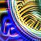

每个神经元的理想曲线，由特征可视化生成——该方法用优化来寻找超刺激（superstimuli）。

每个曲线检测器实现的都是同一算法的变体：它对各种各样的曲线都有响应，偏好某一特定朝向的曲线，并且随着朝向改变而逐渐减少放电。曲线神经元对亮度、纹理、颜色等表观属性保持不变性。

3b:379 按朝向的激活

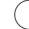

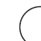

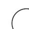

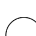

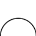

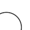

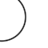

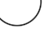

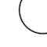

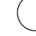

在本文后面，我们将深入研究对合成曲线图像的激活。

曲线检测器共同覆盖所有朝向。

曲线族按朝向的激活

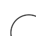

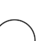

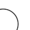

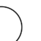

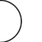

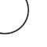

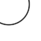

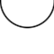

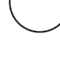

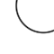

激活按神经元的最大激活值归一化。在探索合成刺激时，我们将更深入地逐神经元考察激活。在 Notebook 中复现

曲线检测器的激活是稀疏的：在整个 ImageNet 上，它们只对 10% 的空间位置做出响应[^3]，而且放电时通常也很微弱。当它们强烈激活时，所响应的曲线在朝向和曲率上都与其特征可视化相近。

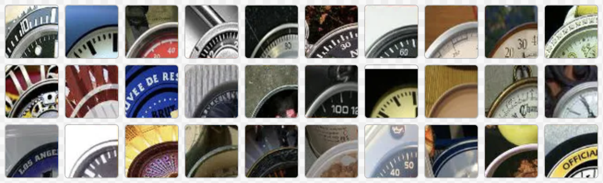

数据集中能激活 3b:379 的图像，都包含与其理想曲线相似的曲线。

值得退一步想想：像曲线检测器这样看似有意义的特征竟然存在，这有多么令人意外。网络并没有任何显式的激励去形成有意义的神经元。我们并没有把这些神经元优化成曲线检测器！相反，InceptionV1 只是被训练来对图像分类——分类的抽象层次离曲线差了十万八千里——而曲线检测器竟从梯度下降中自己涌现出来。

此外，在形形色色的自然图像中检测曲线，在经典计算机视觉中是一个难题，甚至可以说至今未解[^4]。InceptionV1 似乎学会了这个问题的一个灵活而通用的解法，仅用五个卷积层就实现了它。我们将在下一篇文章中看到，它所使用的算法直白易懂，而且我们已经用手工重新实现了它。

当我们说这些神经元检测曲线时，我们到底在主张什么？我们认为，人们有时会争论神经元是否真的检测特定刺激，部分原因在于可作出的主张有多种。经验上很容易证明：当曲线检测器强烈放电时，刺激确实是一条曲线。但还有几种主张可能更有争议：

- **因果性**：曲线检测器真正检测的是曲线特征，而不是与曲线相关的其他刺激。我们相信，特征可视化和归因可视化实验确立了因果联系，因为"反向运行"它会产生一条曲线。
- **通用性**：曲线检测器对各式各样的曲线刺激都有响应。它们能容忍很宽的半径范围，并且对颜色、亮度、纹理等表观属性基本保持不变性。我们认为，用合成刺激直接检验这些不变性的实验，是最有说服力的证据。
- **纯粹性**：曲线检测器不是多语义的，也没有任何有意义的次要功能。那些让曲线检测器微弱激活的图像——比如边缘或角——是 InceptionV1 实现曲线检测所用算法的自然延伸。我们相信，按激活幅度对数据集样本分类并可视化其归因的实验表明，任何次要功能都必须十分罕见。在下一篇文章中，我们将深入探究实现曲线检测的算法机制，为这一主张提供进一步证据。
- **家族性**：曲线神经元共同覆盖了曲线的所有朝向。

### 特征可视化

[特征可视化](https://distill.pub/2017/feature-visualization/)用优化来寻找使给定目标最大化的神经网络输入。我们常用的目标是让神经元尽可能强烈地放电，但在本文中我们还会用到其他目标。特征可视化之所以强大，原因之一是它能告诉我们因果性。由于输入从随机噪声开始，优化的是像素而非生成式先验，我们可以确信：结果图像中的任何属性都对目标做出了贡献。

每个神经元的理想曲线，由特征可视化生成——该方法用优化来寻找超刺激。

读懂特征可视化需要一点技巧；如果你以前没怎么接触过这些图像，可能会觉得眼花缭乱。最需要抓住的是曲线的形状。你可能还会注意到，曲线两侧有明亮的、互为补色的色带：这反映了网络偏好于在曲线边界处看到颜色变化。最后，如果仔细观察，你会看到一些垂直于曲线边界的小短线。我们把这种对垂直小短线的微弱偏好称为"梳理"（combing），稍后会讨论它。

每当我们用特征可视化让曲线神经元尽可能强烈地放电时，得到的都是曲线图像——即使我们显式地用[多样性项](https://distill.pub/2017/feature-visualization/#diversity)鼓励生成不同类型的图像也是如此。这是曲线检测器并非多语义的有力证据，按我们通常使用该词的含义——即[大致同等偏好](https://distill.pub/2020/circuits/zoom-in/#claim-1-polysemantic)不同类型的刺激。

特征可视化找到的是能让神经元最大程度放电的图像，但这些超刺激能代表神经元的行为吗？看到特征可视化时，我们常常会想象：神经元对与之定性相似的刺激强烈放电，并随着刺激越来越少地展现这些视觉特征而逐渐减弱。但我们也可以设想另外的情形：在非极端的激活区间，神经元的行为完全不同；或者，它确实会对极端刺激的杂乱版本微弱放电，但同时也存在另一类让它微弱响应的次要刺激。

如果我们想了解神经元在实践中如何表现，那么直接观察它实际如何响应数据集中的图像，是无可替代的办法。

### 数据集分析

在研究数据集时，我们将重点关注 [

3b:379](https://microscope.openai.com/models/inceptionv1/mixed3b_0/379)，因为有些实验需要不少手工劳动。不过，本节的核心思想适用于 3b 中的所有曲线检测器。

[

3b:379](https://microscope.openai.com/models/inceptionv1/mixed3b_0/379) 多久放电一次？放电时，强烈放电的情况多不多？不放电时，它是常常被强烈抑制，还是只是处于放电边缘？通过可视化激活在数据集上的分布，我们可以回答这些问题。

在研究 ReLU 网络时，我们发现考察激活前（pre-activation）值的分布很有帮助。由于 ReLU 只是把左侧截断，激活后的值很容易推断；同时，它还能让我们看到神经元在其他情况下离放电有多近。[^5] 我们发现 [

3b:379](https://microscope.openai.com/models/inceptionv1/mixed3b_0/379) 的激活前均值约为 -200。由于负值会被 ReLU 激活函数置零，它在整个数据集上仅在 11% 的情况下放电。

如果我们看概率的对数图，会发现激活区间服从指数分布[^6]，在图中对应一条直线。由此带来的一个推论是：由于概率密度按 e−xe^{-x}e−x 衰减，而不是高斯分布的 e−x2e^{-x^2}e−x2，我们应当预期该分布有长尾。

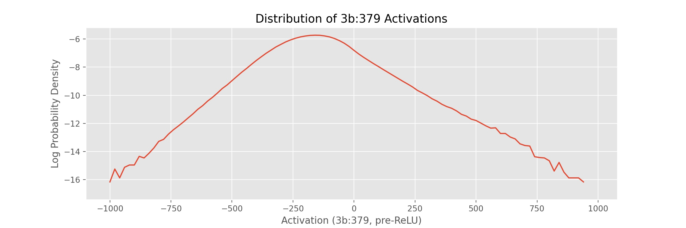

通过观察 3b:379 激活的 ReLU 前取值，我们可以看到正、负值都服从指数分布。由于所有负值都会被 ReLU 提升到零，3b:379 的激活是稀疏的——整个数据集中只有 11% 的刺激能引起激活。

为了定性地理解这一分布的不同部分，我们可以按激活程度渲染一幅图像拼布（quilt），随机采样让 [

3b:379](https://microscope.openai.com/models/inceptionv1/mixed3b_0/379) 以不同幅度激活的图像。拼布呈现出一种规律：引起最强激活的图像，其曲线与神经元的特征可视化相似；引起微弱正激活的是不完美的曲线——要么太平，要么朝向偏离，要么有其他缺陷；引起 ReLU 前激活接近零的往往是直线或没有弧形的图像，不过其中也有些图像的曲线朝向偏离约 45 度；最后，引起最强负激活的图像，其曲线朝向与神经元的理想曲线相差超过 45 度。

←更多**负**激活　随机数据集图像按

3b:379 激活排序　更多**正**激活→

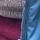

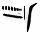

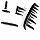

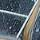

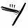

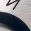

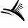

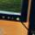

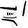

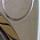

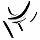

-800+

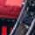

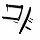

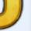

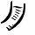

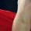

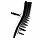

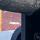

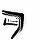

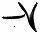

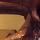

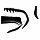

-700

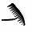

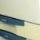

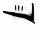

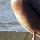

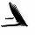

-600

-500

-400

-300

-200

-100

0

100

200

300

400

500

600

700

800

900+

加载更多示例

图像拼贴（quilt）能揭示神经元在广泛激活值范围内的响应模式，但也可能造成误导。神经元对图像中某个感受野大小裁剪区域的激活只是一个数值，我们无法确定是图像的哪一部分引发了它。因此，我们可能会被虚假的相关性所欺骗。例如，许多使 [

3b:379](https://microscope.openai.com/models/inceptionv1/mixed3b_0/379) 强烈激活的图像都是钟表，我们可能就会认为这个神经元检测的是钟表，而不是曲线。

要弄清图像*为什么*会激发某个神经元，我们可以用特征可视化（feature visualization）来呈现该图像对这个神经元的归因（attribution）。

### 可视化归因

我们研究神经元家族时使用的大多数工具——包括特征可视化——都可以借助归因，在特定图像的*语境*中加以运用。

关于如何在神经网络中进行归因，已有大量研究（例如 ）。这些方法试图描述是哪些像素或更早层的神经元导致了神经元的激活。对于复杂的非线性函数，学界在哪些归因方法有理论依据、是否可靠的问题上存在诸多分歧 。但在线性情形下，归因方法基本达成共识——大多数方法都会收敛到同一个答案。在关于 $x$ 的线性函数 $w\cdot x$ 中，分量 $x_i$ 对输出的贡献是 $w_i x_i$。描述每个分量贡献的归因向量（或张量）为 $(w_0x_0, ~w_1x_1, ~\ldots)$。

由于神经元的预激活函数和偏置值是前一层神经元的线性函数，我们可以使用这种公认的归因方法。具体来说，3b 中曲线检测器的预激活值是 3a 的线性函数。描述前一层所有神经元如何影响某个给定神经元的归因张量，就是激活值与权重的逐点相乘。

我们通常用特征可视化来制造一个能单独激活某个神经元的超刺激（superstimulus），但也可以用它来激活神经元的线性组合。将特征可视化应用于归因张量，我们就能制造出能最大程度激活 3a 中那些促使 [

3b:379](https://microscope.openai.com/models/inceptionv1/mixed3b_0/379) 激活的神经元。此外，我们还会使用归因张量的绝对值，它既能显示促使该神经元激活的特征，也能显示抑制它的特征。这对于观察影响我们曲线神经元的曲线相关视觉属性很有帮助——即使这种影响是让它的激活变弱。

综合起来，我们得到 $\text{FeatureVisualization}(\text{abs}(W \odot h_{prev}))$，其中 $W$ 是某个给定神经元的权重，$h_{prev}$ 是上一隐藏层的激活值。在实践中，我们发现将这些归因可视化参数化为灰度、透明的图像会更有帮助，让非专业人士更容易阅读 。示例代码可以在 notebook 中找到。

我们还可以借助归因，更深入地回顾前面那幅数据集示例拼贴图，弄清每张图像为什么会促使 [

3b:379](https://microscope.openai.com/models/inceptionv1/mixed3b_0/379) 激活。点击该图即可在原始图像与归因向量的特征可视化之间切换。

←更多**负**激活随机数据集图像，按 

3b:379 归因显示图像更多**正**激活→

-800+

-700

-600

-500

-400

-300

-200

-100

0

100

200

300

400

500

600

700

800

900+

加载更多示例。在……中复现

Notebook

虽然上述实验可视化了 3a 中的每一个神经元，但归因（attribution）是一种强大而灵活的工具，能够以多种方式应用于电路研究。例如，我们可以可视化一幅图像在到达 3b 之前如何依次流经[早期视觉中的各个神经元家族](https://distill.pub/2020/circuits/early-vision/)，沿途在每个家族处查看该图像对曲线神经元的激活向量与归因向量。每个激活向量展示某个家族在图像中看到了什么，每个归因向量则展示它如何促成了 [

3b:379](https://microscope.openai.com/models/inceptionv1/mixed3b_0/379) 的激活。

在下一节中，我们将考察一种从数据集图像中提取信息的更朴素的技术：蒙住双眼，不看神经元激活值，仅凭肉眼对图像进行分类。

### 人类对比

本文作者之一 Nick Cammarata 手动将 800 多张图像标注为四类：曲线、不完美曲线、无关图像或反向曲线。我们从 [

3b:379](https://microscope.openai.com/models/inceptionv1/mixed3b_0/379) 的激活值中，以每 100 为一个分箱，从每个分箱中随机抽取固定数量的图像[^7]。标注过程中，Nick 只能看到图像的像素，无法获取神经元激活值或归因可视化等额外信息。他使用了以下标注准则：

- **曲线**：图像中的曲线与神经元特征可视化的方向相似，且曲线横跨图像的大部分宽度。
- **不完美曲线**：图像中的曲线与神经元特征可视化相似，但至少存在一个明显缺陷，比如过于平直、弧线被折角打断，或方向略有偏差。
- **无关**：图像中没有曲线。
- **反向曲线**：图像中的曲线与神经元特征可视化的方向相差超过 45 度。

手工标注完这些图像后，我们将标注结果与同一批图像上 [

3b:379](https://microscope.openai.com/models/inceptionv1/mixed3b_0/379) 的激活值进行了对比。通过堆叠图（stackplot）可以看到，不同标签清晰地对应到不同的激活值区间[^8]。

不过，仍有许多图像能触发该神经元激活，却既不属于曲线，也不属于不完美曲线。当我们可视化这些图像对 [

3b:379](https://microscope.openai.com/models/inceptionv1/mixed3b_0/379) 的归因时，会发现其中许多图像其实包含微妙的曲线。

能激活 3b:379 却被人类标注为"无关"的数据集示例，往往包含微妙的曲线——通过可视化图像对曲线神经元的归因，这些曲线便会显现出来。

在浏览数百张曲线图像的过程中，Nick 发现自己很难察觉微妙的曲线，因为他开始出现[后像效应](https://en.wikipedia.org/wiki/Afterimage)——长时间注视同一种刺激时会产生这种现象。结果，他难以判断那些微妙的曲线是否只是知觉错觉。通过可视化归因，我们可以揭示神经元在图像中看到的曲线，让我们看到标注过程中遗漏的曲线。在这些情况下，[

3b:379](https://microscope.openai.com/models/inceptionv1/mixed3b_0/379) 似乎是一位超人般的曲线检测器。

**激活谱上不同位置的激活值有多重要？**

这些图表有助于比较我们手工标注的标签，但给出的画面并不完整。虽然 [

3b:379](https://microscope.openai.com/models/inceptionv1/mixed3b_0/379) 在强烈激活时似乎对曲线刺激具有高度选择性，但这只是它激活情形中的一小部分。大多数时候它根本不激活，即便激活，通常也极其微弱。

为了看清这一点，我们可以考察全部 ImageNet 样本在激活强度上的概率密度，并按激活强度（x 轴）分箱，使每个分箱中各类别的比例与手工标注数据集一致。

从这个角度看，我们甚至看不到神经元强烈激活的情形！概率密度随横坐标右移呈指数衰减，因此这类激活十分罕见。从某种意义上说，如果这些神经元确实在检测曲线，这正是我们预料之中的——因为图像中清晰明确的曲线本就很少出现。

也许更令人担忧的是，尽管曲线只占 [

3b:379](https://microscope.openai.com/models/inceptionv1/mixed3b_0/379) 微弱激活或不激活情形的一小部分，这张图却似乎显示，被归类为曲线的刺激大多也落在这些情形之中——原因是神经元强烈激活的情形要稀有好几个数量级。这似乎至少部分源于标注误差和曲线的稀有性（详见后文讨论）。但这让推理变得有些困难。正因如此，我们没有提供精确率-召回率曲线：召回率会被神经元未强烈激活的情形主导，进而被潜在的标注误差主导。

概率密度是否真的是思考神经元行为的恰当方式，这一点并不明确。绝大多数情形是神经元根本没有激活：这些情形真的值得关注吗？如果一个神经元经常勉强激活，这对理解它在网络中的角色又有多重要？

思考激活谱不同部分重要性的另一种度量是*对期望值的贡献*（contribution to expected value），即 x∗p(x)。可以把这个度量看作对"该激活值在多大程度上影响神经元输出、进而影响网络行为"的一种近似。除此之外，仍有理由认为高激活情形可能格外重要（例如在最大池化中，只有最高值才起作用），但*对期望值的贡献*似乎是一个合理的估计。[^9]

之前观察概率密度时，人们可能会怀疑 [

3b:379](https://microscope.openai.com/models/inceptionv1/mixed3b_0/379) 是否在真正有意义的意义上是一个曲线检测器：即便它在强烈激活时具有高度选择性，可当它在概率密度图上甚至都不可见时，这又怎么能算重要呢？*对期望值的贡献*告诉我们，即使采用保守的度量，曲线和不完美曲线也占到 55%。这与"它确实是一个曲线检测器"的假说相符——其他触发它激活的刺激，要么是标注误差，要么是噪声图像导致神经元误激活的情形。

到目前为止，我们对数据集的实验表明，[

3b:379](https://microscope.openai.com/models/inceptionv1/mixed3b_0/379) 的激活大致对应人类关于"图像是否包含曲线"的判断。此外，可视化这些图像的归因向量还告诉我们，这些图像之所以触发激活，是因为图像中的曲线，我们并没有被虚假的相关性所误导。但这些实验还不足以支撑"曲线神经元检测曲线图像"这一主张。由于曲线图像在数据集中出现频率不高，用这个数据集来系统研究曲线图像颇为困难。接下来的几个实验将直接聚焦于此，研究曲线神经元如何响应合理的曲线图像空间。

### 联合调谐曲线

前两个实验表明，每个曲线检测器响应不同方向的曲线。下一个实验将帮助我们验证它们是否真的在检测同一特征的旋转版本，并刻画每个单元对方向变化的敏感程度。

为此，我们创建一条**联合调谐曲线**[^10]，记录如果我们旋转那些曾让某个特定曲线检测器放电的自然数据集示例，所有曲线检测器会如何响应。

每个神经元在其偏好方向周围都有一个高斯状的峰；当一个神经元停止放电时，另一个开始放电，共同覆盖曲线的所有方向。

神经元对旋转数据集示例的响应

我们收集使神经元最大程度激活的数据集示例，将它们从 0 度到 360 度以 1 度为增量旋转，并记录激活值。激活值经过平移，使每个神经元响应的位置对齐，然后对这些曲线取平均，得到一条典型的响应曲线。

虽然调谐曲线有助于测量神经元在自然图像各种扰动下的激活，但我们能对这些图像施加的扰动种类有限。在下一个实验中，我们将从头渲染人工刺激，从而获得更大范围的扰动。

### 合成曲线

虽然数据集几乎提供了我们能想到的每一种曲线，但这些曲线并没有附带方向或半径等标注，因此很难回答那些需要系统测量对视觉属性响应的问题。曲线检测器对曲率有多敏感？它们响应哪些方向？涉及的颜色是否重要？深入了解这些问题的一个方法是自己绘制曲线。使用这样的合成刺激是视觉神经科学中的常用方法，我们发现它对人工神经网络的研究也非常有帮助。本节中的实验，其灵感直接来自探测曲线检测生物神经元的类似实验。

由于数据集示例表明，曲线检测器对方向和曲率最为敏感，我们将把它们作为曲线渲染器的参数。我们可以用它来测量每个属性的变化如何使某个特定神经元（例如 [

3b:379](https://microscope.openai.com/models/inceptionv1/mixed3b_0/379)）放电。我们发现，把结果呈现为热图很有帮助，这样可以更高分辨率地观察是什么导致神经元放电。

0σ

标准差25σ

我们发现，简单的图形竟能带来极其强烈的兴奋。那些引起最强激活的曲线图像——激活值比数据集平均激活高出多达 24 个标准差！——与神经元特征可视化的方向和曲率相似。

0σ

标准差25σ在 

Notebook 中复现

为什么我们会看到纤细的三角形？

三角形几何形状表明，曲线检测器对曲率更高的曲线会响应更宽的方向范围。这是因为曲率越大的曲线包含的方向越多。想一想：一条直线不包含任何曲线方向，而一个圆包含所有曲线方向。由于靠近顶部的合成图像更接近直线，它们的激活范围更窄。

这些细丝表明，方向或曲率的微小变化就能引起激活的剧烈变化，这说明曲线检测器脆弱且不鲁棒。遗憾的是，这是跨神经元家族的普遍问题，我们在 [Gabor 族](https://distill.pub/2020/circuits/early-vision/#group_conv2d1_complex_gabor)中就能看到，它位于第二层（[conv2d1](https://microscope.openai.com/models/inceptionv1/conv2d1_0)）。

仅沿两个变量改变曲线，就能看到几乎难以察觉的扰动使激活值波动数个标准差。这表明更高维的像素空间包含更危险的攻击面。我们对仔细研究神经元特定对抗攻击这一研究方向感到兴奋，尤其是在早期视觉中。研究早期视觉族的一个好处是，可以沿着整个电路一路追溯到输入，而通过提取电路的重要部分并单独研究，这一过程可以变得更简单。也许这种简化的环境能为我们提供线索，帮助我们了解如何让神经元更鲁棒，甚至保护整个模型免受对抗攻击。

除了测试方向和曲率，我们还可以测试其他变体，比如曲线形状是否被填充、是否带有颜色。数据集分析提示，曲线检测器对光照、颜色等外观属性具有不变性，我们可以用合成刺激来证实这一点。

曲线对填充不变。

……对颜色也同样不变

0σ

标准差25σ

### 合成角度

我们的合成曲线实验和数据集分析都表明，虽然曲线对方向敏感，但它们对曲线半径有很宽的容忍度。在极端情况下，曲线神经元会对狭窄方向带内的边缘产生部分响应，这可以看作半径无穷大的曲线。这可能让我们以为，曲线神经元实际上响应的是许多方向正确的形状，而不只是曲线本身。虽然我们无法系统地渲染所有可能的形状，但我们认为角度是检验这一假设的好案例。

在下面的实验中，我们像处理合成曲线一样改变合成角度，y 轴为半径，x 轴为方向。

0σ

标准差25σ

激活形成两条清晰的线，最强激活出现在两线相交处。每条线对应角度中两条直线之一与曲线切线对齐的位置。两线相交处，是角度与一条方向匹配该神经元特征可视化的曲线最相似的位置。激活图中右侧较弱的激活成因相同，只是角度刺激的抑制半侧朝外而非朝内。

我们首先考察的刺激是合成曲线，其次是合成角度。在接下来的示例中，我们展示一系列从角度过渡到曲线的刺激。每一列的最强激活都强于前一列，因为更圆的刺激更接近曲线，使曲线神经元放电更强烈。此外，随着每个刺激变得更圆，它们的"激活三角形"逐渐被填满，因为原始角度刺激的两条直线过渡成了一条平滑的弧线。

0σ

标准差25σ

我们从左侧的角度过渡到右侧的曲线，每一步都让刺激变得更圆。每一步都能看到每个神经元的最大激活在增加，而"激活三角形"随着构成原始角度的两条线变成一条圆弧而逐渐被填满。在 

Notebook 中复现

这个界面有助于观察不同曲线神经元如何响应多种刺激属性的变化，但它太笨重了。在下一节中，我们将探索不同层中的曲线族，这时一种更紧凑的查看曲线神经元族激活的方式会很有用。为此，我们将引入*径向调谐曲线*。

### 径向调谐曲线

悬停以单独查看某个神经元

### InceptionV1 的曲线族

到目前为止，我们一直在观察 3b 中的一组曲线神经元。但实际上，InceptionV1 在四个连续的层中都含有曲线神经元，3b 是其中的第三层。

#### conv2d2

"conv2d2"（有时简写为"2"）是 InceptionV1 的第三个卷积层。它包含两类曲线检测器：同心曲线和梳状边缘。

同心曲线是小型曲线检测器，偏好同一方向、半径递增的多条曲线。我们认为，这一特征在 3a 和 3b 中那些容忍宽半径范围的曲线检测器的发展中发挥了一定作用。

梳状边缘检测从一条较长的线垂直伸出的若干条线。这些伸出的线也能检测曲线，因此它们也是一种曲线检测器。这些神经元被用来构建后续的曲线检测器，并在梳状效应中发挥作用。

观察 conv2d2 的激活，我们会发现曲线响应一个连续的范围（就像 3b 中的一样），但也会对对面（相差 180 度）的一个范围产生微弱激活。我们把这一次级范围称为**回声**。

#### 3a

到 3a 层时，非同心曲线检测器已经形成。它们在许多方面与 3b 中的曲线检测器相似，我们将在下一篇文章中看到它们如何被用来构建 3b 曲线。一个区别是，3a 的曲线有回声。

#### 3b

这些就是本文一直在重点关注的曲线检测器。它们的激活干净利落，没有回声。

你可能会注意到，3b 的径向调谐曲线顶部有两个大的角度空隙，底部还有一些较小的空隙。这是为什么呢？一个因素是，模型中还有我们所说的[双曲线检测器](https://distill.pub/2020/circuits/early-vision/#group_mixed3b_double_curves)，它们响应两个不同方向的曲线，有助于填补这些空隙。

#### 4a

在 4a 中，网络构建了许多复杂形状，如螺旋和边界检测器，它也是第一个构建 3D 几何的层。4a 中有几个曲线检测器，但我们认为它们更适合被看作对应特定的现实物体，而非抽象形状。这些曲线中有许多出现在 4a 的 [5x5 分支](https://microscope.openai.com/models/inceptionv1/mixed4a_5x5_0) 中，该分支似乎专门处理 3D 几何。

例如，[

4a:406](https://microscope.openai.com/models/inceptionv1/mixed4a_0/406) 似乎是一个朝上的曲线检测器，但在另外两个角度有令人困惑的次级行为。数据集示例揭示了它的秘密：它检测的是从某个角度观察到的杯子和锅的顶部。从这个意义上说，它更适合被看作一个倾斜的 3D 圆检测器。

我们认为 [

4a:406](https://microscope.openai.com/models/inceptionv1/mixed4a_0/406) 是神经网络可解释性何以具有主观性的一个好例子。我们通常认为曲线这类抽象概念与咖啡杯这类现实物体属于不同种类的事物——对网络的大部分区域来说，它们确实是分开的。但存在一个需要我们做出判断的过渡期，4a 就是那个过渡。

### 曲线检测器的再利用

我们开始研究曲线神经元，是为了更好地理解神经网络，而不是因为我们对曲线本身感兴趣。但在研究过程中，我们意识到曲线检测对航拍成像、自动驾驶汽车和医学研究等领域都很重要，而且经典计算机视觉在每个领域都有大量关于曲线检测的文献。我们原型实现了一种利用曲线神经元族的技术，用于完成几个与曲线相关的计算机视觉任务。

其中一个任务是*曲线提取*，即高亮图像中属于曲线的像素。本文一直在做的、将归因可视化到曲线神经元，可以看作一种曲线提取。在这里，我们将其与常用的 Canny 边缘检测算法进行比较，测试对象是一张被称为血管造影的血管 X 光片，取自 , 图 2.1。

血管造影示例，取自 , 图 2.1。

归因可视化清晰地分离并凸显了线条和曲线，而且视觉伪影更少。不过，它表现出强烈的梳状效应——从被追踪的边缘发出不需要的垂直线。我们不确定这些线在实际应用中有多大危害，但我们认为可以通过编辑曲线神经元的电路来消除它们。

我们并不是想说我们已经创造了一个有竞争力的曲线追踪算法。我们没有与最先进的曲线检测算法进行详细比较，而且我们认为，针对这一目标精心调优的经典算法很可能会优于我们的方法。相反，我们在这里的目标是探索：利用神经网络内部表征如何打开一个广阔的视觉操作空间，曲线提取只是其中的一个点。

#### 样条参数化

通过改变优化对象，我们可以触及这个空间的更多部分。到目前为止，我们一直在优化像素，但我们也可以创建一种可微的参数化方法来渲染曲线，这与 和 的探索类似。通过将归因经输入反向传播到样条节点，我们现在可以*追踪曲线*——得到描述图像中曲线的最佳拟合样条方程。

我们为这种方法创建了一个早期原型。由于曲线神经元在多种场景下都有效[^11]，我们的样条参数化也同样如此。

遮挡
即使曲线被严重遮挡，我们的样条也能追踪它们。此外，我们可以利用归因构建复杂的遮挡规则。例如，我们可以强烈惩罚样条与某个特定物体或纹理重叠，从而阻止样条连接被这些特征遮挡的视觉曲线。

细微曲线
由于曲线神经元对多种多样的自然视觉特征都很鲁棒，我们的曲线追踪算法可以应用于图像中细微的曲线。

复杂形状

在 

Notebook 中复现

#### 算法组合

一个看似毫不相干的视觉操作是图像分割。借助非负矩阵分解（non-negative matrix factorization, NMF），我们可以用无监督的方式完成它。利用我们的样条参数化，可以可视化每个因子对应的归因，从而勾勒出图像中不同物体的曲线。

来源

追踪 NMF 分量

与其分解单张图像的激活，我们也可以联合分解大量蝴蝶图像，找出网络中对蝴蝶这一类别普遍响应的神经元。分解激活与常规图像分割的一个重大区别在于：我们得到的是神经元组，而不是像素。这些神经元组可用于在任意图像中寻找蝴蝶；将其与可微样条参数化组合后，我们就得到一个可以应用到任何图像的单一优化过程，它能自动找到蝴蝶，并给出拟合蝴蝶的样条方程。

我们追踪了 23 张蝴蝶图像，并选出最喜欢的 15 张。在一个

 笔记本中复现

在上面的例子中，我们操纵蝴蝶和曲线时无需操心二者的任何细节。我们把识别多种物种、多种朝向的蝴蝶这一复杂任务委托给了神经元，从而得以在蝴蝶的抽象概念层面工作。

我们认为，这是把经典计算机视觉与深度学习融合起来的一种激动人心的方式。扩展上述技术有大量唾手可得的果实：我们的样条参数化还只是早期原型，优化所用的神经网络也已问世五年。不过，比起改进某个特定任务，我们更兴奋的是探索用户如何在任务之间游走。一旦任务被固定下来，专门为它训练一个神经网络很可能会得到最佳结果；但现实世界的任务很少被精确地定义，更难的挑战在于探索任务空间，找到值得投入的那一个。

例如，我们算法的更成熟版本能自动找出图像中蝴蝶的样条，它可以作为基础，把蝴蝶的视频素材转化为动画[^12]。但动画师可能希望加入纹理神经元、改用软笔刷参数化，为动画增添转描（rotoscoping）风格。由于他们能完全访问渲染中的每一个神经元，就可以操纵皮毛神经元族和特定犬种对应的归因，从而改变整部电影中特定犬种的皮毛渲染方式。这些算法都不需要重新训练神经网络，也不需要任何训练数据，因此动画师原则上可以实时探索这一算法空间——这一点很重要，因为紧密的反馈回路对释放创造潜力往往至关重要。

### 梳理现象

曲线检测器有一个奇特之处：它们似乎会被垂直于曲线的小线段激活，无论这些线段朝内还是朝外。观察特征可视化最容易看到这一点。我们把这一现象称为"梳理"（combing）。

梳理现象似乎普遍存在于许多模型的曲线检测器中，包括在 Places365 而非 ImageNet 上训练的模型。事实上，有少量证据表明它也存在于生物神经网络中：一个团队对猕猴视觉皮层 V4 区的一个生物神经元运行了类似特征可视化的过程，发现带有向外放射线条的圆形是激活最强的刺激之一。

AlexNetInceptionV1InceptionV3Monkey V4

人们提出了多种可能的解释，目前还没有明显的领先者。

一种假说是：现代世界中的许多重要曲线都带有垂直线条，比如车轮的辐条，或钟表表圈上的刻度。

垂直的线条在许多自然特征中都很有用，比如**轮胎**、**钟表**和**标志**

一个相关的假说是：在某些情境下，梳理或许能让曲线检测器用于皮毛检测。另一个假说是：曲线与朝它延伸的垂直线之间具有更高的"对比度"。回想数据集示例：最强的负 ReLU 前激活值来自朝向相反的曲线。如果曲线检测器想要看到曲线与其周围空间之间的强烈朝向变化，它可能认为垂直线比纯色具有更高的对比度。

最后，我们认为梳理很可能只是实现曲线检测器的一种便捷方式——它是电路构建中走捷径的副作用，而非内在有用的特征。在 conv2d1 中，边缘检测器会被 conv2d0 中的垂直线抑制。直线或曲线检测器需要做的一件事是：检查图像不只是单一重复的纹理，而是有一条被对比度包围的强线条。它似乎是通过弱抑制切线方向的平行线条来实现这一点的。被垂直线激活可能是实现"抑制兴奋性神经元"模式的一种简便途径，这种模式允许有上限的抑制，而无需在上一层创建专门的神经元。

梳理并非曲线独有。我们在直线中也能观察到它，基本上任何像曲线这样源于直线的形状特征都有。围绕梳理现象还有很多工作可做：梳理为什么会形成？它在对抗鲁棒模型中是否依然存在？它是否属于 Ilyas 等人所说的"非鲁棒特征"？

### 结论

与神经科学等领域相比，人工神经网络让细致的研究变得容易。我们可以读写神经网络中的每一个权重，用梯度来优化刺激，还能分析数据集上数十亿个真实激活。把这些工具组合起来，我们就能开展各种各样的实验，从不同视角观察一个神经元。如果每个视角都讲述同一个故事，那我们就不太可能遗漏什么重要的东西。

既然如此，投入如此多的精力去研究区区几个神经元似乎有些奇怪。我们同意。我们最初估计理解曲线家族需要一周时间，结果却花了几个月来探索我们所发现的美与结构的分形。

许多路径产生了研究神经元的新通用技术，比如合成刺激，或利用电路编辑来消融神经元行为。另一些只与某些家族相关，比如等变性母题（equivariance motif），或我们手工训练的、重新实现曲线检测器的"人工人工神经网络"。还有少数是曲线特有的，比如把曲线检测器当作一类曲线分析算法来探索。

如果我们的宏大目标是彻底逆向工程神经网络，那么研究区区一个家族就耗费如此多精力，似乎令人担忧。然而，从我们研究不同深度神经元家族的经验来看，理解一个神经元家族的基本情况并不难。[OpenAI Microscope](https://microscope.openai.com/models) 只需几秒钟就能展示特征可视化、数据集示例，很快还将展示权重。特征可视化给出了因果行为的强有力证据，数据集示例则展示了神经元在实践中响应什么，两者合起来就是关于神经元功能的强有力证据。事实上，我们第一眼看到曲线时就理解了它们的基本情况。

虽然通常一眼就能看出一族神经元的主要功能，但深入研究神经元家族的研究者将收获更深层的美。
刚开始时，我们担心 10 个神经元作为论文主题过于狭窄，但现在我们意识到，一次完整的考察足以写成一本书。

本文是 [电路系列（Circuits thread）](/2020/circuits/) 的一部分——这是一个实验性栏目，汇集受邀短文章和批判性评论，深入探究神经网络的内部运作。

## 脚注

[^1]: 正如《Zoom In》中所讨论的，我们看到的主要问题是所谓的多语义神经元——它们对多个不同的特征都有响应，似乎是一种把许多特征压缩进更少数量的神经元的方式。我们希望这个问题能够被绕过。

[^2]: 例如，遗传学过去似乎曾乐观地认为基因各有各的功能，人类基因组计划将让我们能够"挖掘奇迹"，如今这一立场似乎已被视为天真。

[^3]: 按感受野尺寸裁剪的图像块。

[^4]: 这是我们在尝试实现程序化曲线检测、与曲线神经元做对比时得到的感受。我们发现，实践者通常不得不在若干算法之间做选择，每种算法都有显著的权衡取舍，比如对不同类型的视觉"噪声"（例如纹理）的鲁棒性——即便是在远比 ImageNet 自然图像简单的图像上也是如此。例如，[StackOverflow 上的这个回答](https://stackoverflow.com/questions/8260338/detecting-curves-in-opencv)声称"曲线检测问题一般而言极具挑战性，除了玩具示例外没有好的解决方案"。此外，许多经典曲线检测算法要么太慢、无法实时运行，要么需要往往难以承受的内存。

[^5]: 观察激活前（pre-activation）值还能避免分布在零处出现狄拉克 δ 尖峰。

[^6]: 神经网络激活通常服从指数分布这一观察最初是由 Brice Ménard 告诉我们的，他在若干网络的除第一层外的所有层上都观察到了这一现象。这有点令人惊讶：一方面是因为它们似乎完美地服从指数分布，另一方面是因为人们通常预期随机变量的线性组合会形成高斯分布。

[^7]: 我们没有从这些分箱中挑挑拣拣。本文数据来自我们对图像的第一轮采样。

[^8]: 有趣的是，在标注过程中 Nick 觉得常常难以把样本归入分组，因为许多图像似乎正落在评分标准的边界上。当我们看到激活清晰地分离成不同的激活水平时，我们很惊讶。

[^9]: 如果想进一步探索激活谱不同部分的重要性，可以借助某种归因概念（在特定情况下估计一个神经元对后续神经元影响的方法），估计归因对 logit 期望值的贡献。一个简单的版本是考察 $x\cdot\frac{d\text{logit}}{dx}\cdot p(x)$。

[^10]: 在神经科学中，调谐曲线（tuning curves）——神经对连续刺激参数的响应图——在视觉研究的早期就崭露头角。对感受野和神经元朝向特异性响应的观察，催生了一些关于低级视觉特征如何组合成高级表征的最早理论。此后它们一直是该领域的主流技术。

[^11]: 正如我们在文章中探讨的，曲线神经元对亮度、纹理等外观属性具有鲁棒性。

[^12]: 使用[共享参数化](https://distill.pub/2018/differentiable-parameterizations/#section-aligned-interpolation)来保持帧间一致性。
