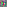
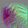
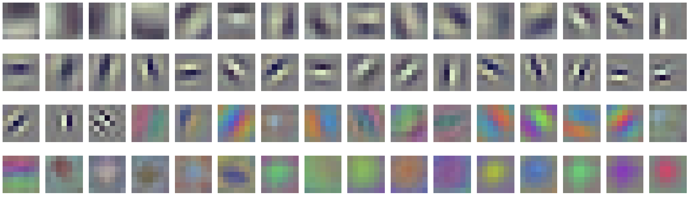

# InceptionV1 早期视觉概述

*2020 年 6 月 4 日 · 原文: https://distill.pub/2020/circuits/early-vision/*

---

本文是 [Circuits 系列](/2020/circuits/) 的一部分，该系列是一个开放科学协作项目推出的短文与评论合集，深入探究神经网络的内部运作。

[Zoom In: An Introduction to Circuits](/2020/circuits/zoom-in/)[Curve Detectors](/2020/circuits/curve-detectors/)

Circuits 项目的前几篇文章将聚焦于 InceptionV1 的早期视觉——就本文而言，即通向第三个池化层的五个卷积层。

*[就本文而言，我们将早期视觉视为前五层。点击某一层可跳转到对应章节。]*

在这几层的过程中，我们看到网络从原始像素出发，
  逐步发展到精细的边界检测、基本的形状检测
  （例如曲线、圆、螺旋、三角形）、
  眼睛检测器，乃至对非常小的头部的粗略检测器。
  一路走来，我们还看到各种有趣的中间特征，
  包括复杂 Gabor 检测器（类似于神经科学中一些经典的"复杂细胞"），
  黑白与彩色检测器，以及由曲线形成的小圆。

研究早期视觉作为我们研究的起点有两个主要优势。
  首先，它特别容易研究：
  它靠近输入，电路只有几层深，神经元的种类不算太多，[^1] 而且特征看起来相当简单。
  其次，早期视觉似乎最有可能具有普遍性：在不同架构和任务上形成相同的特征与电路。

在我们深入探索早期视觉的不同部分之前，我们想先给出一个更广泛的概述，说明我们目前对它的理解。
  本文以我们所谓的"神经元组"的注释性汇编形式，勾勒出我们的理解。
  我们还为每一层选定的电路提供了示意图。

由于把自己限定在早期视觉之内，本文"仅仅"考察了 InceptionV1 的前 1,056 个神经元。[^2]
  但我们的经验是，当一个人刚开始研究一个模型时，一千个神经元绰绰有余地足以让人晕头转向。
  我们希望本文能通过提供一些结构和抓手，帮助读者避免这种迷失。

#### 与神经元玩纸牌

人们常说，德米特里·门捷列夫（Dmitri Mendeleev）通过玩"化学单人纸牌"发现了元素周期表——把每个元素的细节写在一张卡片上，耐心地摆弄各种分类与整理方式。
  一些现代历史学家对纸牌之说持怀疑态度，但门捷列夫的故事有力地证明：即使你还没有一套理论或坚实的理由来支撑某种整理，仅仅是整理现象本身就可能价值巨大。
  在这方面，门捷列夫远非孤例。
  例如，在生物学中，物种的分类体系先于遗传学和进化论而存在，是后者为它们提供了理论基础。

我们的经验是，视觉模型中的许多神经元似乎会落入相似特征的家族。
  例如，看到十来个神经元以不同朝向或不同颜色检测同一特征，并不罕见。
  也许更引人注目的是，同样的"神经元家族"似乎在不同模型之间反复出现！
  当然，众所周知 Gabor 滤波器和颜色对比检测器可靠地构成卷积神经网络第一层的神经元，但看到这一点推广到更深的层，我们相当惊讶。

本文分享我们对 InceptionV1 前五层单元的工作分类，将它们归入神经元家族。
  这些家族是临时性的、由人定义的、似乎在某种方式上相似的特征集合。
  我们发现它们有助于我们彼此交流，也有助于把理解 InceptionV1 的问题分解成更小的块。
  虽然有些家族我们怀疑是"真实"的，但许多其他家族只是出于方便的类别，或是我们信心不高的类别。
  这些家族的主要目标是帮助研究者找到方向。

在构建这套分类时，我们对单个神经元的理解来自特征可视化、数据集样例、特征如何由上一层构建、如何被下一层使用，以及其他分析。
  值得指出的是，我们对单个神经元的关注程度差异很大：我们为其中一些单元安排了整篇后续文章做详细分析，而许多其他单元只得到了几分钟的粗略考察。

在某种程度上，我们对单元的分类类似于 [Net Dissect](http://netdissect.csail.mit.edu/)——它把神经元与一组预定义的特征关联起来，并将它们归入颜色、纹理、物体等类别。
  这样做的好处是消除主观性，并且可扩展性强得多。
  与此同时，它也有缺点：相关性可能具有误导性，预定义的分类体系可能漏掉真正的特征类型。[^3]
  特别是，如果我们预期模型会拥有新颖的、未曾预料到的特征——例如高低频检测器——那么"未曾被预料到"这一事实本身就使它们不可能被纳入预定义的特征集。
  发现它们的唯一途径，是逐个人工考察每个特征的繁琐过程。
  未来，你可以设想混合方法：先把许多特征归入一个（不断增长的）已知特征集合，从而为人工研究者节省时间——尤其是如果[普遍性假说](https://drafts.distill.pub/circuits-zoom-in/#claim-3)成立的话。

##### 注意事项

- 这是一个宽泛的概述，我们对其中许多单元的理解置信度不高。我们完全预期，事后回顾时会意识到自己误解了一些单元和类别。
- 许多神经元组是兜底类别，或是便于组织的类别，我们认为它们并不反映基本结构。
- 即使是对我们怀疑确实反映基本结构的神经元组（例如，有些组可以从分解该层权重矩阵中恢复出来），这些组的边界也可能模糊，某些神经元是否归入其中涉及主观判断。

#### 神经元的呈现方式

为了讨论神经元，我们需要以某种方式表示它们。
  虽然我们可以使用神经元索引，但要在脑子里把几百个数字一一理清，非常困难。
  因此，我们使用[特征可视化](https://distill.pub/2017/feature-visualization/)\cite{erhan2009visualizing,olah2017feature,simonyan2013deep,nguyen2015deep,mordvintsev2015inceptionism,nguyen2016plug}——即高度激活某个神经元的优化图像。[^4]

当我们用特征可视化来表示一个神经元时，我们并不是在声称特征可视化捕捉了神经元行为的全部。
  更确切地说，特征可视化在理解程序时扮演的角色类似于变量名。
  它用一个更有意义的符号取代一个任意的数字。

#### 电路的呈现方式

尽管本文侧重于概述早期视觉中存在的特征，但我们也感兴趣于理解它们是如何由更早的特征计算出来的。
  为此，我们呈现[电路](https://distill.pub/2020/circuits/zoom-in/#claim-2)，它由一个神经元、该神经元在上一层中权重（L2 范数）最强的单元，以及它们之间的权重组成。[^5]
  在某些情况下，如果一些连接较弱的神经元看起来有特别的教学价值，我们也会把它们包括进来；在这些情况下，我们会在图注中提及这一点。
  神经元用它们的特征可视化来直观呈现，如前所述。
  权重用色图表示，红色为正，蓝色为负。

例如，这里是 `mixed3a` 中一个圆检测单元的电路，它由更早的曲线和一个原始的圆检测器组装而成。
  我们稍后会更深入地讨论这个例子。

*[点击任意神经元的特征可视化，可以看到更多权重！]*

任何时候，你都可以点击某个神经元的特征可视化，查看它与上一层中连接最紧密的 50 个神经元的权重（即它如何由上一层组装而成），以及它与下一层中连接最紧密的 50 个神经元的权重（即它如何被后续使用）。
  这便于进一步探究，如果你担心存在选择性挑拣，它还能让你获得不带偏见的权重视图。

### `conv2d0`

我们考察过的每个视觉模型的第一个卷积层，绝大部分由两类特征组成：颜色对比检测器和 Gabor 滤波器。
  InceptionV1 的 `conv2d0` 也不例外，它的大多数单元都属于这些类别。

不过，与其他模型相比，这里的特征并非完美的颜色对比检测器和 Gabor 滤波器。
  找不到更好的词来形容，它们是"邋遢的"。
  我们无从知道原因，但这很可能是训练期间梯度未能很好地到达早期层的结果。
  注意 InceptionV1 早于批归一化（BatchNorm）和 Adam 等现代技术的采用，而这些技术使深层模型更容易被训练好。
  如果与确实使用了 BatchNorm 的 TF-Slim 版 InceptionV1 相比，我们会看到更清晰的特征。[^6]

这里值得注意的一个微妙之处是，无论在 InceptionV1 还是其他视觉模型中，Gabor 滤波器几乎总是成对出现，权重互为负版本。
  单个 Gabor 滤波器只能检测某些偏移下的边缘，但它的负版本填补了空洞，使得下一层能够形成复杂 Gabor 滤波器。

### `conv2d1`

在 `conv2d1` 中，我们开始看到视觉神经科学中一些经典的[复杂细胞](https://en.wikipedia.org/wiki/Complex_cell)特征。
  这些神经元对与 `conv2d0` 中单元相似的图案作出响应，但对位置和朝向的某些变化具有不变性。

**复杂 Gabor：**
  这类特征的一个很好例子是"复杂 Gabor"特征家族。
  与简单 Gabor 滤波器一样，复杂 Gabor 检测边缘。
  但与简单 Gabor 不同，它们对边缘的确切位置或哪一侧是暗、哪一侧是亮相对不变。
  这是通过被多个朝向相近的 Gabor 滤波器激发——最关键的是，被检测相同图案但明暗互换的"互补 Gabor 滤波器"激发——来实现的。
  这可以被看作"情形并集（union over cases）"母题的一个早期例子。

*[上一层中所有权重幅值至少为最大权重幅值 30% 的神经元都会显示，
    包括正的（激发）和负的（抑制）。
    点击某个神经元可查看它的前向和后向权重。]*

注意 `conv2d1` 是 1x1 卷积，因此上一层与本层的每个通道之间只有一个权重——在本图中就是一条线。[^7]
  这在决定我们观察到的特征方面起着重要作用：在第二层使用更大卷积的模型中，我们常常看到特征直接跃升为后续层中那些更大、更复杂特征的粗糙版本。

除了复杂 Gabor，我们还看到各种其他特征，包括
  更具不变性的颜色对比检测器、对单一朝向选择性较弱的类 Gabor 特征，以及低频特征。

### `conv2d2`

在 `conv2d2` 中，我们看到非常简单的形状前驱的出现。
  这一层出现了第一批或许可以称为"线条检测器"的单元——它们偏好一条更长的线而不是 Gabor 图案，约占单元的 25%。
  我们还看到微小的曲线检测器、角点检测器、发散检测器，以及一个非常小的圆检测器。
  这些特征的一个有趣之处在于，你可以从特征可视化中看到它们由 Gabor 检测器组装而成——曲线由小的分段 Gabor 片段构建。
  所有这些单元对它们特征的不完整版本仍会适度激活，例如一条与边缘检测器相切的短曲线。

由于 `conv2d2` 是 3x3 卷积，我们对这些形状前驱特征（以及一些纹理特征）的理解，对应于 Gabor 和低频边缘以特定方式在空间上组装成新特征。
  在高层次上，我们看到了几种主要模式：

我们还开始看到各种纹理和颜色检测器成为这一层的主要组成部分，包括颜色对比和颜色中心-周围特征，以及类 Gabor、影线、低频和高频纹理。
  少数单元在它们感受野的不同侧寻找不同的纹理。

### `mixed3a`

`mixed3a` 中我们观察到的特征多样性显著增加。
  其中一些——曲线检测器和高低频检测器——已在 [Zoom In](https://distill.pub/2020/circuits/zoom-in/) 中讨论过，
  并将在后续文章中以极大篇幅再次讨论。
  但 `mixed3a` 中有一些我们之前从未讨论过的、非常有趣的电路，
  我们将逐一讲解其中选定的几个，以感受这一层发生着什么。

**黑白检测器：** `mixed3a` 的一个有趣性质是"黑白"检测器的出现——它们检测颜色的缺失。
  在 `mixed3a` 之前，颜色对比检测器寻找的是颜色向接近互补色（例如蓝对黄）的转变。
  但从这一层开始，我们经常会看到把一种颜色与"没有颜色"相比较的颜色检测器。
  此外，黑白检测器还能实现灰度图像的检测，这可能与 ImageNet 类别相关（参见
        [4a:479](https://storage.googleapis.com/distill-circuits/inceptionv1-weight-explorer/mixed4a_479.html)，它检测黑白肖像）。

我们的黑白检测器的电路相当简单：
  它几乎所有的大权重都是负的，检测颜色的缺失。
  粗略地说，它计算的是 `**NOT(**color_feature_1 **OR** color_feature_2 **OR** ...**)**`。

*[显示了到上一层幅值最强的十六个权重。
    为简单起见，正负各只显示了一个空间权重，但它们都具有几乎相同的结构。
    点击某个神经元可查看它的前向和后向权重。]*

**小圆检测器：** 我们在 `mixed3a` 中也看到一些更复杂的形状。当然，曲线（我们在 [Zoom In](https://distill.pub/2020/circuits/zoom-in/) 中讨论过）就是突出的例子。
  但还有很多其他有趣的例子。
  例如，我们看到各种小圆检测器和眼睛检测器
  由早期的曲线和圆检测器（`conv2d2`）拼接而成：

**三角形检测器：** 说到基本形状，我们还看到三角形检测器
  由更早的线条（`conv2d2`）和移位线条（`conv2d2`）检测器形成。

*[构造三角形检测器的电路。
    选择显示上一层中的哪些神经元，略微带有为教学而挑拣的成分。
    显示了到三角形幅值权重最大的六个神经元，外加一个权重稍弱的神经元。
    （左倾边缘的权重略高于右倾边缘，但各显示两个似乎更具说明性。）点击神经元可查看全部权重。]*

然而在实践中，这些三角形检测器（以及其他角度单元）在下游往往只是被当作多边缘检测器来使用，或者与许多其他单元协同工作，去检测凸边界。

上文讨论的这些精选电路，只是 `mixed3a` 错综复杂结构的冰山一角。
  下面我们对其中所有电路给出一个分类式总览：

### `mixed3b`

`mixed3b` 横跨两个抽象层次。
一方面，它拥有一些相当精细的特征，这些特征似乎不太应该被归为"早期"或"低层"：物体边界检测器、早期的头部检测器，以及形状检测器中更复杂的部分。
另一方面，它也有很多仍然相当低层的单元，比如颜色中心-环绕单元。

**边界检测器：** `mixed3b` 中最引人注目的转变之一，是边界检测器的形成。
  乍看这些特征可视化和数据集示例，
  你可能会以为它们只是边缘或曲线检测器的又一轮翻版。
  但实际上，它们是在组合多种线索来检测物体之间的边界与过渡。
  其中最重要的线索，或许就是我们在上一层看到的逐步形成的高-低频检测器。
  注意，它基本上不在乎颜色或频率变化的方向，只在乎是否存在变化。

我们有时会发现，思考早期视觉的"目标"很有用。
  梯度下降只会创造出对后续层特征有用的特征。
  是哪些后续特征激励了我们在早期视觉中看到的这些特征的产生？
  这些边界检测器，似乎就是上一层高-低频检测器（`mixed3a`）的"目标"。

**基于曲线的特征：**
  这一层的另一个重要主题，是出现了基于曲线的、更复杂也更具体的形状检测器。
  其中包括更[复杂的曲线]()、
  圆形、S 形、螺旋形、
  凹坑，以及"渐屈线"
  （我们借用这个术语来描述那些检测背离中心弯曲的曲线的单元）。
  我们将在后续一篇关于曲线电路的文章中详细讨论它们，但在这里值得一提。

从概念上讲，你可以把权重理解为以如下方式拼装出曲线检测器：

**毛发检测器：** 另一个有趣的电路是"定向毛发检测器"的实现，它检测毛发的分缝，就像人头上的发缝一样。
  （尽管它很可能相当特化于 ImageNet 以狗为主的图像内容。）
  它们是通过把毛发前体单元（`mixed3a`）以特定方式拼接、使其汇聚而实现的。

同样，这些电路也只是 `mixed3b` 的冰山一角。
  由于这一层规模更大、包含大量特征族，我们先来介绍几个特别有趣且研究得比较清楚的特征族：

除了上述特征之外，还有大量其他特征无法归入如此整齐的类别。
  一个令人沮丧的问题是，`mixed3b` 中有许多单元既没有简单的低层表述，也尚未对某个高层特征足够特化。
  例如，有些单元似乎正在朝着检测某些动物身体部位的方向发展，但同时仍会对许多其他刺激作出响应，因而难以描述。

### 结论

本文的目标，是对我们目前关于 InceptionV1 早期视觉的理解做一个高层次的概述。
  本文讨论的每一个特征，都可能是深入研究的主题。
  例如：曲线检测器真的是曲线检测器吗？它们会对哪些类型的曲线触发？它们在各种边缘情况下表现如何？它们是如何构建的？
  在接下来的文章中，我们将对少数几个特征（从曲线开始）展开严谨的深入研究，探讨这些问题。

对早期视觉的研究，也给我们留下了许多更广泛的开放问题。
  这些特征族在多大程度上反映了特征中真正基本的簇，
  而非某种对人类或许有用、但归根结底有些任意的分类法？
  是否存在更好的分类法，或者其他理解特征空间的方式？
  为什么特征往往以家族的形式成群出现？
  相同的特征族在不同模型中形成的程度有多大？
  在某种意义上，是否存在一张"低层视觉特征的元素周期表"？
  更高层的特征在多大程度上也能适用类似的分类法？
  我们认为这些是未来工作中有趣的问题。

本文是 [Circuits 系列](/2020/circuits/) 的一部分，该系列是一个开放科学合作项目对神经网络内部机制进行探究的短文与评注合集。

[Zoom In: An Introduction to Circuits](/2020/circuits/zoom-in/)[Curve Detectors](/2020/circuits/curve-detectors/)

## 脚注

[^1]: 视觉模型的初始卷积层通常有大约 64 个通道，这些卷积核会在许多空间位置上应用。因此，虽然神经元的数量很多，但独特神经元的数量要少几个数量级。

[^2]: 我们不会讨论 mixed3a/mixed3b 中的"瓶颈"神经元，我们通常把它们视为与上一层之间的低秩连接。

[^3]: [Net Dissect](http://netdissect.csail.mit.edu/) 是一项非常精巧的工作，它提升了我们系统性地讨论网络特征的能力。
    不过，要理解"将特征与预定义分类法相关联"与"逐个研究特征"之间的差别，看看它是如何对某些特征进行分类的，或许会有所启发。
    Net Dissect 并未包含标准的 InceptionV1，但包含它的一个变体。
    翻阅他们版本的 [`mixed3b`](http://netdissect.csail.mit.edu/dissect/googlenet_imagenet/html/inception_3b-output.html) 层，我们看到许多单元从数据集示例来看很可能是我们熟悉的特征类型，如曲线检测器、凹坑检测器、边界检测器、眼睛检测器等，但它们却被归类为与另一个特征弱相关——往往是那些看起来不太可能在如此早期的层中被检测到的物体。
    另一个有趣的例子是，特征 372 与猫检测器的相关性最高，但它看起来实际上在检测朝左的胡须！

[^4]: 我们的特征可视化使用 [lucid 库](https://github.com/tensorflow/lucid)\cite{olah2017feature} 完成。
    在可视化最初几层时，我们使用少量变换鲁棒性，因为它对这些层的小感受野有更大的比例影响，并且随着层数升高而增加。
    对于低层，我们使用 L2 正则化将像素推向灰色。
    对于第一层，我们遵循其他论文的惯例，直接展示权重；在第一层这个特例中，这等价于在合适的 L2 惩罚下的特征可视化。

[^5]: `mixed3a` 和 `mixed3b` 中的一些神经元位于由"瓶颈"1x1 卷积（大幅减少通道数）后接 5x5 卷积组成的分支中。尽管两者之间有一个 ReLU，我们通常把它们视为单个权重矩阵的低秩分解，并可视化两个权重的乘积。此外，这些层中的一些神经元位于由最大池化后接 1x1 卷积组成的分支中；我们以权重在其最大池化区域内复制的方式呈现这些单元。

[^6]: 这是 TF-Slim 版 InceptionV1（增加了 BatchNorm）第一层单元的权重。（单元按第一层与第二层之间邻接矩阵的第一主成分排序。）这些特征在训练良好的卷积网络中很典型。注意，与标准 InceptionV1 不同，这些单元在黑白 Gabor、彩色 Gabor、颜色对比单元与颜色中心-环绕单元之间有清晰的分界。

[^7]: 它们之间有一个池化层，因此它连接到的特征是上一层的池化版本，而非原始特征。

## 参考文献

- [erhan2009visualizing]: Erhan, Dumitru, Bengio, Yoshua, Courville, Aaron, Vincent, Pascal, “Visualizing higher-layer features of a deep network”, University of Montreal, 2009
- [olah2017feature]: Olah, Chris, Mordvintsev, Alexander, Schubert, Ludwig, “Feature Visualization”, Distill, 2017
- [simonyan2013deep]: Simonyan, Karen, Vedaldi, Andrea, Zisserman, Andrew, “Deep inside convolutional networks: Visualising image classification models and saliency maps”, arXiv preprint arXiv:1312.6034, 2013
- [nguyen2015deep]: Nguyen, Anh, Yosinski, Jason, Clune, Jeff, “Deep neural networks are easily fooled: High confidence predictions for unrecognizable images”, Proceedings of the IEEE Conference on Computer Vision and Pattern Recognition, 2015
- [mordvintsev2015inceptionism]: Mordvintsev, Alexander, Olah, Christopher, Tyka, Mike, “Inceptionism: Going deeper into neural networks”, Google Research Blog, 2015
- [nguyen2016plug]: Nguyen, Anh, Clune, Jeff, Bengio, Yoshua, Dosovitskiy, Alexey, Yosinski, Jason, “Plug & play generative networks: Conditional iterative generation of images in latent space”, arXiv preprint arXiv:1612.00005, 2016
