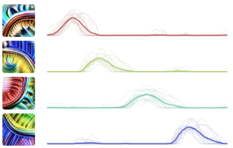

# 神经网络中自然涌现的等变性

*May 20, 2020 · 原文: https://distill.pub/2020/circuits/equivariance/*

---

本文属于[电路系列（Circuits thread）](/2020/circuits/)，这是一个实验性的栏目形式，汇集受邀撰写的短文与批判性评论，深入探讨神经网络的内部运作机制。

卷积神经网络内部隐藏着一个对称性的世界。这种对称性是理解神经网络内部特征与电路的有力工具，同时也表明，那些把额外对称性直接内建到网络结构中的尝试（例如 \cite{bergstra2011statistical,cohen2016group,dieleman2016exploiting,cohen2016steerable,thomas2018tensor,winkels20183d}）可能正走在一条前景光明的道路上。

要看到这些对称性，我们需要观察卷积神经网络内部的单个神经元，以及连接它们的[电路](https://distill.pub/2020/circuits/zoom-in/#claim-2)。
      事实证明，许多神经元其实是同一个基本特征经过轻微变换后的版本：
      包括同一特征的旋转副本、缩放副本、翻转副本、检测不同颜色的特征，等等。
      我们有时把这种现象称为"[等变性](https://en.wikipedia.org/wiki/Equivariant_map)（equivariance）"，因为它意味着"调换神经元"等价于"变换输入"。
          [^1]

等变性可以被看作一种"[电路基序（circuit
    motif）](https://distill.pub/2020/circuits/zoom-in/#claim-2-motifs)"——一种在电路中反复出现的抽象模式，类似于系统生物学中的基序 \cite{alon2019introduction}。
  它也可以被看作一种更大尺度的"结构现象"（类似于[权重带状化](/2020/circuits/weight-banding/)和[分支
    特化](https://distill.pub/2020/circuits/branch-specialization/)），因为某一种等变性类型往往在某些层中普遍存在，而在另一些层中则很罕见。

在本文中，我们将重点讨论 InceptionV1 \cite{szegedy2015going} 中的等变性实例，该模型在 ImageNet\cite{deng2009imagenet} 上训练；
      不过，在我们研究过的每一个基于自然图像训练的模型中，
      都至少观察到了某种程度的等变性。

### 等变特征

**旋转等变性：** 等变性的一个例子是同一特征的旋转版本。这类特征在[早期视觉](https://distill.pub/2020/circuits/early-vision/)中尤为常见，例如[曲线检测器](https://distill.pub/2020/circuits/curve-detectors/)、[高低频检测器](https://distill.pub/2020/circuits/early-vision/#group_mixed3a_high_low_frequency)和[线检测器](https://distill.pub/2020/circuits/early-vision/#group_conv2d2_line)。

要检验这些特征确实只是同一特征的旋转版本，可以取一些能激发其中一个单元激活的样本，将其旋转，再检查其他单元是否如预期那样被激活。关于曲线检测器的[这篇文章](https://distill.pub/2020/circuits/curve-detectors/)通过多项实验检验了它们的等变性，其中包括旋转能激活某个神经元的刺激，观察其他神经元如何响应。

要验证像曲线检测器这样的单元确实是同一特征的旋转版本，一种方法是取能激活其中一个单元的刺激，然后旋转刺激，观察这些单元如何随之响应。[了解更多。](https://distill.pub/2020/circuits/curve-detectors/#joint-tuning-curves)

**尺度等变性：** 旋转版本并不是我们观察到的唯一变异形式。同一特征在不同尺度上出现也相当常见，不过缩放后的特征通常出现在不同层。例如，我们看到[圆检测器](https://distill.pub/2020/circuits/early-vision/#group_mixed3b_circles_loops)跨越了极大的尺度范围：小尺度的位于较浅的层，大尺度的位于较深的层。

**色相等变性：** 对于检测颜色的特征，我们常常看到以不同色相检测同一对象的变体。例如，[颜色中心-环绕](https://distill.pub/2020/circuits/early-vision/#group_mixed3a_color_center_surround)单元会在中心检测一种色相，并在其周围检测对立的色相。在 InceptionV1 中，直到第七层甚至第八层都能找到这样的单元。

**色相-旋转等变性：** 在早期视觉中，我们经常看到[颜色对比单元](https://distill.pub/2020/circuits/early-vision/#group_conv2d2_color_contrast)。这些单元在一侧检测一种色相，在另一侧检测相反的色相。因此，它们在色相和旋转两个维度上都有变异。这些变异尤其有趣，因为色相与旋转之间存在相互作用：将色相循环 180 度会交换两侧各自对应的色相，因此等价于旋转 180 度。

在下图中，方向旋转完整 360 度，而色相只旋转 180 度。在图表的底部，它回绕到顶部，但偏移了 180 度。

**反射等变性：** 当我们进入网络的中间层时，旋转变异变得不那么突出，但水平翻转的特征对变得相当普遍。

**其他等变性：** 最后，我们还看到以其他各种方式变换的特征变体。例如，同一个狗头特征有短吻与长吻的版本，同一个特征也有人类与狗两种版本。我们甚至看到对相机视角具有等变性的单元（见于一个 Places365\cite{zhou2016places} 模型）。这些不一定是我们经典意义上认为的等变性形式，但本质上似乎确实是同一回事。

### 等变电路

我们在神经元中观察到的等变行为，实际上是神经网络权重及其所构成的[电路](https://distill.pub/2020/circuits/zoom-in/#claim-2)中存在的一种更深层对称性的反映。

我们首先关注由旋转不变特征构成的旋转等变特征。这种"不变→等变"的情况可能是等变电路最简单的形式。接下来，我们将考察"等变→不变"电路，最后再看更复杂的"等变→等变"电路。

**高低频电路：** 在下面的例子中，我们看到[高低频检测器](https://distill.pub/2020/circuits/early-vision/#group_mixed3a_high_low_frequency)由一个高频因子和一个低频因子构建而成（两个因子都对应上一层中一组神经元的组合）。每个高低频检测器都对某个方向上的频率转变做出响应：在一侧检测高频模式，在另一侧检测低频模式。注意同一个权重模式是如何旋转的，从而产生该特征的旋转版本。

**对比→中心电路：** 同样的模式可以反向使用，把旋转等变特征重新变回旋转不变特征（即"等变→不变"电路）。在下面的例子中，我们看到多个绿-紫[颜色对比检测器](https://distill.pub/2020/circuits/early-vision/#group_conv2d2_color_contrast)被组合起来，形成绿-紫和紫-绿[中心-环绕检测器](https://distill.pub/2020/circuits/early-vision/#group_mixed3a_color_center_surround)。

      把这个电路中的权重与上一个电路中的权重对比一下：这其实就是同一个权重模式做了转置。

有时我们会看到这两种电路首尾相接：先创造出等变性，然后立刻部分利用它来构造不变单元。

**黑白-颜色电路：** 在下面的例子中，一个通用颜色因子和一个黑白因子被用来构建"黑白 vs 颜色"特征。之后，这些[黑白 vs 颜色特征](https://distill.pub/2020/circuits/early-vision/#group_mixed3a_bw_vs_color)又被组合起来，形成中心检测黑白、周围检测颜色的单元，反之亦然。

**线→圆/发散电路：** 等变特征组合成不变特征的另一个例子是：非常早期的线状[复 Gabor 检测器](https://distill.pub/2020/circuits/early-vision/#group_conv2d1_complex_gabor)被组合起来，形成小圆单元和发散线单元。

**曲线→圆/渐屈线电路：** 关于旋转等变性组合成不变单元的更复杂例子，我们可以看看[曲线检测器](https://distill.pub/2020/circuits/curve-detectors/)如何组合成[圆](https://distill.pub/2020/circuits/early-vision/#group_mixed3b_circles_loops)和[渐屈线检测器](https://distill.pub/2020/circuits/early-vision/#group_mixed3b_evolute)。这个电路同时也是尺度等变性的例子：把小型曲线检测器变成小型圆检测器的通用模式，同样能把大型曲线检测器变成大型圆检测器；把中型曲线检测器变成中型渐屈线检测器的模式，也能把大型曲线变成大型渐屈线检测器。

**人-动物电路：** 到目前为止，我们看到的电路例子都涉及旋转。而这些人-动物和动物-人类检测器则是水平翻转等变性的例子：

**不变狗头电路：** 反过来，这个例子（更广泛的[朝向狗头电路](https://distill.pub/2020/circuits/zoom-in/#claim-2-dog)的一部分）展示了向左和向右朝向的狗头如何组合成一个姿态不变的狗头检测器。注意权重是如何翻转的。

#### "等变→等变"电路

到目前为止我们考察的电路要么是"不变→等变"，要么是"等变→不变"：要么输入单元不变，要么输出单元不变。这种形式的电路相当简单——权重旋转、翻转或以其他方式变换，但都只是对单一特征变换的响应。当我们考察"等变→等变"电路时，情况会复杂一些：输入和输出特征都会变换，我们需要考虑两个单元之间的相对关系。

**色相→色相电路：** 我们先看一个连接两组色相等变中心-环绕检测器的电路。第二层中的每个单元都会被上一层中偏好相似色相的单元所激发。

要理解上述内容，我们需要关注每个输入神经元与输出神经元之间的相对关系——在这里，就是它们在色环上相距多远。当色相相同时，两者之间的关系是兴奋性的；当色相接近但不同时，关系是抑制性的；而当色相相差很远时，权重接近于零。[^2]

**曲线→曲线电路：** 现在我们来看一个稍微复杂一点的例子：早期曲线检测器如何连接到晚期曲线检测器。我们将重点关注四个彼此相差 90 度旋转的[曲线检测器](https://distill.pub/2020/circuits/curve-detectors/)。[^3]

如果只看权重矩阵，会有点难以理解。但如果我们关注每个曲线检测器如何与同朝向和反朝向的早期曲线相连，结构就变得清晰了。每个曲线并不是由上一层中同一组神经元构建的，而是发生了偏移。每条曲线被同朝向的曲线激发，被反朝向的曲线抑制。与此同时，权重的空间结构也在旋转。

**对比→线电路：** 再看一个更复杂的例子：[颜色对比检测器](https://distill.pub/2020/circuits/early-vision/#group_conv2d2_color_contrast)如何连接到[线检测器](https://distill.pub/2020/circuits/early-vision/#group_mixed3a_lines)。总的想法是：如果线两侧颜色不同，线检测器应该更强烈地激活；反之，如果颜色变化的方向与线垂直，线检测器则应受到抑制。

注意，这个电路在旋转方面是"等变→等变"电路，但在色相方面是"等变→不变"电路。

### 等变架构

等变性在深度学习中有着丰富的历史。
        许多重要的神经网络架构都把等变性置于核心地位，并且有一个非常活跃的研究方向致力于更激进地将等变性融入网络。
        但这类研究的重点通常是设计等变架构，而不是我们迄今为止讨论的"自然等变性"。
        我们应该如何看待"自然的"与"设计的"等变性之间的关系？
        正如我们将看到的，两者之间似乎存在着相当深刻的联系。

从历史上看，这两者之间有一些有趣的来回互动。
        研究人员经常观察到，神经网络第一层中的许多特征都是同一个基本模板的变换版本。[^4]
        第一层中这种自然涌现的等变性，有时确实成为——而在另一些情况下，也很容易成为——新架构设计的灵感来源。

例如，如果你在一个视觉任务上训练一个全连接神经网络，第一层会反复学习同一特征的变体：不同位置、朝向和尺度的 Gabor 滤波器。卷积神经网络改变了这一点：通过把每个特征的平移副本直接内建到网络架构中，它们通常就不再需要网络去学习每个特征的平移副本。这带来了统计效率的大幅提升，并成为现代深度学习计算机视觉方法的基石。但如果我们观察一个训练良好的卷积神经网络的第一层，会发现同一特征的其他变换版本依然存在：

![TF-Slim \cite{silberman2018tf} 版 InceptionV1 \cite{szegedy2015going} 第一层单元的权重。[^5] 单元按照第一层与第二层之间邻接矩阵的第一主成分排序。注意有多少特征除旋转、尺度和色相外几乎相同。](figures/distill-equivariance/fig-02.png)

受此启发，2011 年一篇副标题为"One Gabor to Rule Them All"的论文 \cite{bergstra2011statistical} 构建了一个稀疏编码模型，其中只有一个 Gabor 滤波器，但可以对其进行平移、旋转和缩放。近年来，许多论文将这种等变性推广到神经网络的隐藏层，以及更广泛的变换类型 \cite{cohen2016group,dieleman2016exploiting,cohen2016steerable,winkels20183d}。正如卷积神经网络强制规定：如果两个特征具有相同的相对位置，那么它们之间的权重必须相同：

      W(x1, y1, a) → (x2, y2, b)  =  W(x1+Δx, y1+Δy, a) → (x2+Δx, y2+Δy, b)W_{(x_1,~y_1,~a) ~\to~ (x_2,~y_2,~b)} ~~=~~ W_{(x_1+\Delta x,~y_1 +\Delta y,~a) ~\to~ (x_2+\Delta x,~y_2+\Delta y,~b)}W(x1​, y1​, a) → (x2​, y2​, b)​  =  W(x1​+Δx, y1​+Δy, a) → (x2​+Δx, y2​+Δy, b)​

……这些更精密的等变网络则规定：如果两个神经元在更一般的变换下具有相同的相对关系，那么它们之间的权重必须相等：[^6]
Wa → b  =  WT(a)→T(b)W_{a~\to~ b} ~~=~~ W_{T(a) \to T(b)}Wa → b​  =  WT(a)→T(b)​

这至少近似地正是我们在考察等变电路时看到的卷积网络的自然行为！那些权重具有对称性，使得关系相似的神经元拥有相似的权重——就像等变架构会强制它们做到的那样。

既然我们已经拥有了模仿我们所观察到的自然结构的神经网络架构，那么自然会好奇：这类模型究竟学到了什么样的特征与电路？它们是否也学到了我们在自然中看到的那些等变特征？还是说它们学到的完全是别的东西？
      为了回答这些问题，我们在 ImageNet 上训练了一个大致以 InceptionV1 为灵感的等变模型。我们让一半神经元具有旋转等变性\cite{cohen2016group}（16 个旋转方向），并让另一半神经元旋转不变。由于我们没有花任何精力调优，模型的测试准确率低得可怜，但它仍然学到了有趣的特征。[^7]
      观察 mixed3b 层，我们发现这个等变模型学到了 InceptionV1 中许多大型旋转等变特征族的类似物，例如[曲线检测器](https://distill.pub/2020/circuits/curve-detectors/)、[边界检测器](https://distill.pub/2020/circuits/early-vision/#group_mixed3b_boundary)、[凹痕检测器](https://distill.pub/2020/circuits/early-vision/#group_mixed3b_divots)和[定向毛皮检测器](https://distill.pub/2020/circuits/early-vision/#group_mixed3b_generic_oriented_fur)：

等变模型中出现类比特征，可以被看作可解释性的一次成功预测。
        作为从事更多定性研究的研究者，我们应该始终警惕自己可能正在自欺欺人。
        成功预测出等变神经网络架构中会形成哪些特征，实际上是一项相当不平凡的预测，也是对我们理解是否正确的一次很好的确认。

另一个令人兴奋的可能性是，这类特征与电路分析或许能为等变性研究提供启示。
        例如，自然形成的各类等变性，可能有助于指导我们应该在神经网络的不同层中设计何种类型的等变性。

### 结论

等变性有一种非凡的能力：它能简化我们对神经网络的理解。当我们把神经网络看作以结构化方式相互作用的特征族时，理解小的模板实际上就能转化为理解大量神经元的相互作用方式。每当我们发现等变性，它都能带来巨大的帮助。

我们有时会把理解神经网络想象成对普通计算机程序进行逆向工程。在这个类比中，等变性就像是在整个代码中发现了同一个被反复内联的函数。一旦你意识到自己看到的是同一个函数的许多副本，你就只需要理解它一次。

但自然等变性确实存在一些局限。首先，我们必须找出等变特征族。这实际上需要我们花费不少功夫，仔细检视一个个神经元。其次，这些特征可能并非严格等变：某个单元也许接线方式略有不同，或者存在小小的例外，因此把它理解为等变的可能会在我们的理解中留下空白。

我们对于等变架构在让神经网络的特征与电路更容易理解方面的潜力感到兴奋。这一点在早期视觉的语境中尤其值得期待，因为那里的绝大多数特征似乎都对旋转、色相、尺度或它们的组合具有等变性。

在研究人工神经网络（而非生物神经网络）中的视觉时，我们相比神经科学家拥有的最大——也是最少被讨论的——优势之一，是平移等变性。由于每个特征只有一个神经元，而不是成千上万个平移副本，卷积神经网络使得研究人工视觉系统的复杂度相对于生物视觉系统大幅降低。这是让我们能够系统地理解 InceptionV1 变得切实可行的关键因素之一。

也许在未来，恰当的等变架构能把理解神经网络早期视觉的复杂度再降低一个数量级。如果真能如此，理解早期视觉或许会从“付出努力才可能实现”变成“轻松即可达成”。

本文属于电路系列（Circuits thread），这是一个由开放的科研协作撰写的短文与评论合集，深入探讨神经网络的内部运作机制。

## 脚注

[^1]: [等变性](https://en.wikipedia.org/wiki/Equivariant_map)在群论中的标准定义是：若对于所有 g∈Gg\in Gg∈G，都有 f(g⋅x)=g⋅f(x)f(g\cdot x) = g\cdot f(x)f(g⋅x)=g⋅f(x) 成立，则函数 fff 是等变的。乍一看，这似乎与神经元的变换版本关系不大。  

 在讨论本文引入的例子之前，先来看看这个定义如何对应神经网络中等变性的经典例子：平移与卷积神经网络。在卷积网络中，平移输入图像等价于平移隐藏层中的神经元（忽略池化、步长等）。形式化地说，g∈Z2g\in Z^2g∈Z2，fff 将图像映射到隐藏层激活值。然后 ggg 通过空间平移作用于输入图像 xxx，对激活值的作用同样是空间平移。  

 现在考虑曲线检测器的情况（等变特征一节的第一个例子），它有十个旋转副本。在这种情况下，g∈Z10g\in Z_{10}g∈Z10​ 且 f(x)=(curve1(x),...)f(x) = (\mathrm{curve}_1(x), …)f(x)=(curve1​(x),...) 将图像中的一个位置映射到一个十维向量，描述每个曲线检测器的激活程度。然后 ggg 通过绕该位置旋转来作用于输入图像 xxx，并通过重新组织神经元——使它们的朝向与相应的旋转对应——来作用于隐藏层。这至少近似地满足等变性的原始定义。  

 这种以变换神经元形式呈现的等变性只是等变性的一种特例。神经网络有许多方式可以在没有变换版本神经元的情况下实现等变。反过来，我们也会看到不少并不完全符合群论中等变性定义的例子：有些存在“空洞”——某个变换神经元缺失了；另一些则包含一组结构弱于群、或不对应于图像上简单作用的变换。但总体结构依然成立。

[^2]: 这里用来演示色相等变性的单元，是特意挑选出电路比较直接的。其他单元可能具有更复杂的关系。例如，有些单元会对黄-红之类的色相范围作出响应，其权重也相应地更加复杂。

[^3]: 同样，这里展示的曲线检测器也是特意挑选的，目的是让电路尽可能简单、便于教学。它们的权重干净，彼此间距均匀，这样更容易看清其中的模式。一篇即将发表的文章将详细讨论曲线电路。

[^4]: 神经网络第一层中的特征比其他层中的特征受到更多研究。这是因为它们容易研究：你只需把权重可视化为像素值，或者更一般地可视化为输入特征即可。

[^5]: 我们展示的是 TF-Slim 版 InceptionV1 的第一层卷积权重，而不是标准版，因为它的权重更干净。这很可能是由于 slim 版本中加入了批归一化（batch-norm），使得梯度更干净。

[^6]: 就我们的目的而言，只需要知道：当神经元之间存在相同的相对关系时，这些等变神经网络就具有相同的权重。这个脚注是为那些希望更深入研读“强制等变性”文献的读者准备的，可以放心跳过。  

        群论是数学中一个为我们提供描述对称性以及相互作用的变换集合之工具的领域。为了构建等变神经网络，我们常常借用群论中一个名为群卷积的想法。正如普通卷积能描述正确尊重平移等变性的权重一样，群卷积能描述尊重一组复杂的相互作用变换（即它所作用的群）的权重。虽然你可以尝试从第一性原理出发推导如何绑定权重，但很容易出错。（其中一位作者在 2012 年参加过许多与研究者的讨论，当时人们不用卷积，而是在白板上反复弄错旋转与平移特征集合应如何相互作用。）群卷积可以接受你描述的任何群，并给出正确的权重绑定。
          
  

        关于群卷积的入门介绍，我们推荐[这篇文章](https://colah.github.io/posts/2014-12-Groups-Convolution/)。
          
  

        如果继续深入，你可能会看到一些论文讨论一种叫做群表示（group representation）的东西，而不是群卷积。这是群论中一个更高级的话题。其核心思想与傅里叶变换类似。回顾一下：傅里叶变换把卷积变成逐点相乘（这有时被用来加速卷积）。而傅里叶变换还有一个可以作用于群上函数的版本，它同样把卷积映射为逐点相乘。当你对群应用傅里叶变换时，得到的系数对应于一种叫做群表示的东西，你可以把它类比为普通傅里叶变换中的频率。

[^7]: 以下是等变模型学到的全部特征。其中一半被强制为旋转等变的，另一半被强制为旋转不变的。

## 参考文献

- [bergstra2011statistical]: Bergstra, James, Courville, Aaron, Bengio, Yoshua, “The statistical inefficiency of sparse coding for images (or, one Gabor to rule them all)”, arXiv preprint arXiv:1109.6638, 2011
- [cohen2016group]: Cohen, Taco, Welling, Max, “Group equivariant convolutional networks”, International conference on machine learning, 2016
- [dieleman2016exploiting]: Dieleman, Sander, De Fauw, Jeffrey, Kavukcuoglu, Koray, “Exploiting cyclic symmetry in convolutional neural networks”, arXiv preprint arXiv:1602.02660, 2016
- [cohen2016steerable]: Cohen, Taco S, Welling, Max, “Steerable CNNs”, arXiv preprint arXiv:1612.08498, 2016
- [thomas2018tensor]: Thomas, Nathaniel, Smidt, Tess, Kearnes, Steven, Yang, Lusann, Li, Li, Kohlhoff, Kai, Riley, Patrick, “Tensor field networks: Rotation-and translation-equivariant neural networks for 3d point clouds”, arXiv preprint arXiv:1802.08219, 2018
- [winkels20183d]: Winkels, Marysia, Cohen, Taco S, “3D G-CNNs for pulmonary nodule detection”, arXiv preprint arXiv:1804.04656, 2018
- [alon2019introduction]: Alon, Uri, “An introduction to systems biology: design principles of biological circuits”, 2019
- [szegedy2015going]: Szegedy, Christian, Liu, Wei, Jia, Yangqing, Sermanet, Pierre, Reed, Scott, Anguelov, Dragomir, Erhan, Dumitru, Vanhoucke, Vincent, Rabinovich, Andrew, others, “Going deeper with convolutions”, 2015
- [deng2009imagenet]: Deng, Jia, Dong, Wei, Socher, Richard, Li, Li-Jia, Li, Kai, Fei-Fei, Li, “Imagenet: A large-scale hierarchical image database”, 2009 IEEE conference on computer vision and pattern recognition, 2009
- [zhou2016places]: Zhou, Bolei, Khosla, Aditya, Lapedriza, Agata, Torralba, Antonio, Oliva, Aude, “Places: An image database for deep scene understanding”, arXiv preprint arXiv:1610.02055, 2016
- [silberman2018tf]: Silberman, Nathan, Guadarrama, Sergio, “TF-Slim: A high level library to define complex models in TensorFlow”, 2018
