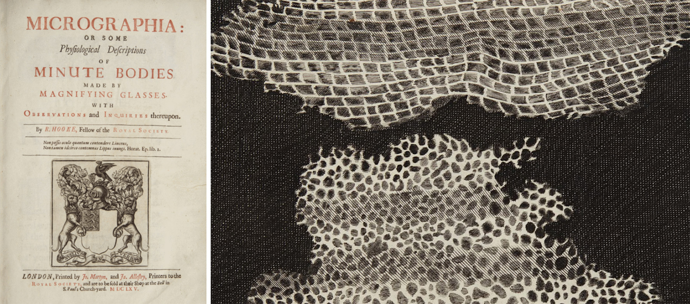
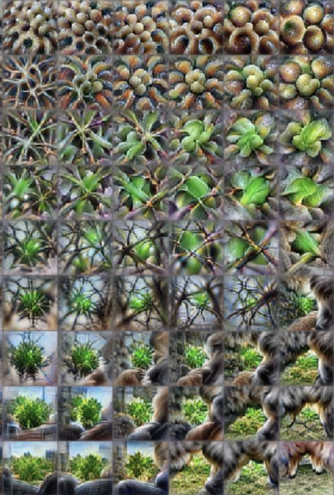
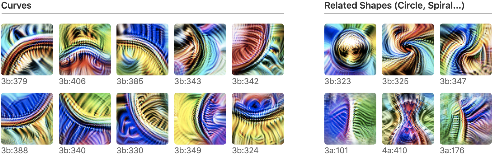
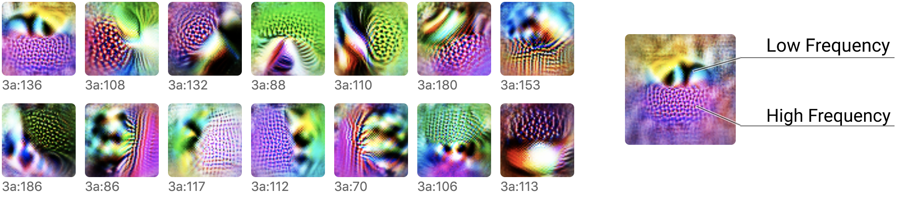
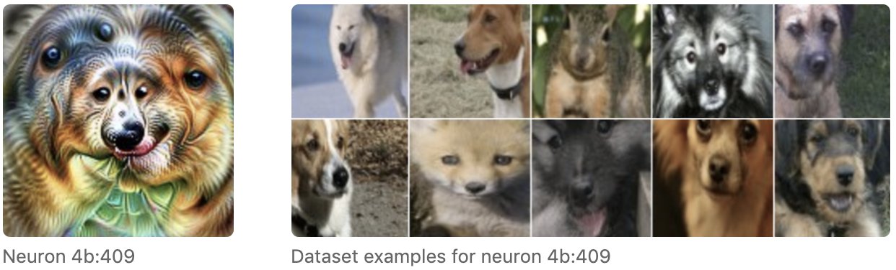
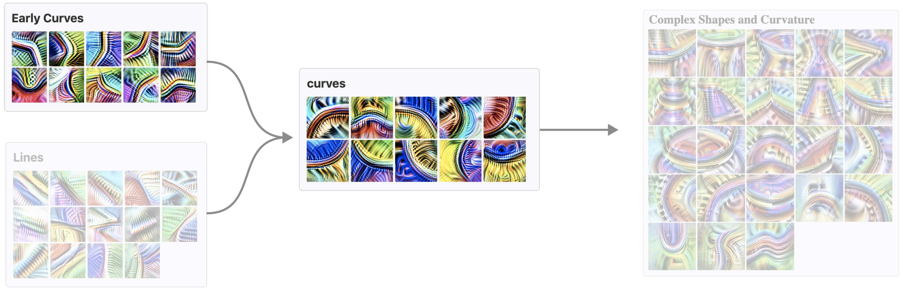
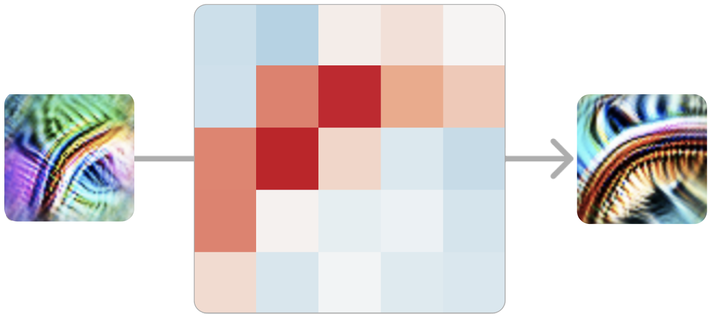
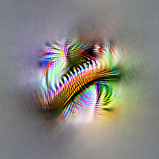

# 放大观察：电路导论

*2020 年 4 月 30 日 · 原文: https://distill.pub/2020/circuits/zoom-in/*

---

本文属于 [Circuits 系列（Circuits thread）](/2020/circuits/)，这是一个实验性栏目，汇集了受邀短文与批判性评论，深入探究神经网络的内部运作。

[Circuits Thread](/2020/circuits/)[An Overview of Early Vision in InceptionV1](/2020/circuits/early-vision/)

科学史上许多重要的转折点，都发生在科学"放大观察"的时刻。
      在这些时刻，我们开发出某种可视化方法或工具，得以在一个全新的细节层次上观察世界，于是一个新的科学领域应运而生，专门透过这一镜头来研究世界。

例如，显微镜让我们看到了细胞，由此诞生了细胞生物学。科学放大观察了。X 射线晶体学等多项技术让我们看到了 DNA，由此引发了分子革命。科学放大观察了。原子理论。亚原子粒子。神经科学。科学放大观察了。

这些转折不仅仅是精度的提升：它们带来了科学研究对象本身的质变。
      例如，细胞生物学并不仅仅是更精细的动物学。
      它是一种全新的探究方式，极大地拓展了我们所能理解的范围。

这类现象的著名例子都发生在极为宏大的尺度上，
        但它也可以是一次更低调的转变：某个小型研究群体忽然意识到，他们如今可以在更细粒度的细节层面上研究自己的课题了。

正如早期的显微镜暗示了一个由细胞和微生物组成的新世界，人工神经网络的可视化也展现了许多诱人的线索与片段，揭示出模型内部一个丰富的内在世界（例如 ）。
      这让我们不禁思考：深度学习是否也正处在一个类似的——尽管更为低调的——转折点上？

目前大部分可解释性研究都致力于为整个神经网络的行为给出简单的解释。
        但如果我们换一种思路，借鉴神经科学或细胞生物学的路径——一种放大观察的路径——会怎样？
        如果我们把单个神经元、甚至单个权重，都当作值得严肃研究的对象，会怎样？
        如果我们愿意花上数千小时，逐一追踪每个神经元及其连接，会怎样？
        最终浮现的，会是一幅怎样的神经网络图景？

与通常把神经网络视为黑箱的图景相反，我们惊讶地发现，在这个尺度上，网络相当平易近人。
        不仅神经元看起来可以理解（即便是那些最初看似深不可测的），神经元之间的连接"电路"也似乎是富有意义的算法，与关于世界的种种事实相对应。
        你可以看到，一个圆形检测器如何由曲线组装而成。
        你可以看到，一个狗头如何由眼睛、口鼻、皮毛和舌头组装而成。
        你可以观察到，一辆汽车如何由车轮和车窗组合而成。
        你甚至可以找到实现简单逻辑的电路：网络在高层次视觉特征之上实现 AND、OR 或 XOR 的实例。

 图像，它曾在这一领域激起过巨大的热情。](figures/distill-zoom-in/fig-02.jpg)

这篇导论文章将对我们的一些思考，以及我们在这一研究方向上发现行之有效的一些工作原则，做一个高层次的概述。
        在后续文章中，我们和合作者们将发表对这个内在世界的详细探索。

但事实是，我们对单个视觉模型的理解还仅仅触及了表面。
        如果你对这些问题的想法有共鸣，欢迎你加入我们和合作者们的电路（Circuits）项目——一个托管在 [Distill slack](http://slack.distill.pub/) 上的开放科学协作项目。

### 三个推测性论断

最早接近现代细胞学说的表述之一，是 1839 年特奥多尔·施万（Theodor Schwann）提出的三项论断——你可能因为施万细胞（Schwann cells）而知道他：

其中前两项论断可能为人熟知，至今仍保留在现代细胞学说之中。第三项则可能鲜为人知，因为事实证明它大错特错。

我们相信，把一个人可能相信为真的观点，以强形式明确表述出来，是很有价值的——即便它可能像施万的第三项论断一样被证明是错的。本着这种精神，我们提出关于神经网络的三个论断。它们既是对神经网络本质的经验性论断，也是关于"如何理解神经网络才是有用的"这一问题的规范性论断。

这些论断是刻意带有推测性的。
        它们也并非全新：与（1）和（3）类似的论断此前已有人提出过，我们将在下文更深入地讨论。

但我们认为这些论断值得认真考虑，因为如果它们为真，就可能为一个全新的、"放大观察"式的可解释性领域奠定基础。
        在接下来的章节中，我们将逐一讨论每项论断，并呈现一些让我们相信它们可能为真的证据。

### 论断 1：特征

特征是神经网络的基本单位。
        它们对应于方向。它们可以被严谨地研究和理解。

我们相信，神经网络由有意义、可理解的特征构成。较浅的层包含诸如边缘检测器或曲线检测器之类的特征，而较深的层则包含诸如垂耳检测器或车轮检测器之类的特征。
        学界对这一点是否成立存在分歧。
        许多研究者几乎把有意义神经元的存在视为不证自明的事实——甚至还有一小批文献专门研究它们——但也有许多研究者深表怀疑，认为以往那些看似在追踪有意义潜在变量的神经元案例，其实是弄错了。
      [^1]
      尽管如此，数千小时研究单个神经元的经验让我们相信，典型的情况是，神经元（在某些情况下，是神经元激活向量空间中的其他方向）是可以理解的。

当然，"可以理解"并不意味着"简单"或"容易理解"。
        许多神经元最初令人费解，不符合我们事先对可能存在什么特征的猜想！
        不过，我们的经验是，这些神经元背后通常有一个简单的解释，而且它们实际上在做的事情相当自然。
        例如，我们最初对高低频检测器（下文讨论）感到困惑，但事后看来，它们简单而优雅。

这篇导论文章只会概述几个我们认为有代表性的例子，但随后将推出两类文章：一类深入刻画单个特征，另一类广泛描绘我们所知存在的全部特征。
        目前我们将以 InceptionV1 为例，但我们相信这些论断具有普遍性，并将在最后关于普遍性的章节中讨论其他模型。

无论我们对有意义特征的认识是对是错，
        我们都认为这是学界需要解决的重要问题。
        我们希望，引入几个经过仔细探索的、看似可理解特征的具体例子，能够推动这一对话的进展。

#### 示例 1：曲线检测器

在我们仔细检查过的每一个非平凡视觉模型中，都能找到曲线检测神经元。
        这些单元之所以有趣，是因为它们横跨两类特征之间的边界：一类是学界普遍认同存在的特征（如边缘检测器），另一类是存在很大质疑的特征（如耳朵、汽车和人脸等高层特征）。

我们将聚焦于 InceptionV1 早期层 [`mixed3b`](/2020/circuits/early-vision/#mixed3b) 中的曲线检测器。这些单元会对半径约 60 像素的曲线和边界做出响应。它们还会被沿曲线边界的垂直直线略微额外激活，并且偏好曲线两侧颜色不同的情形。

曲线检测器以单元家族的形式出现，家族中的每个成员都在不同朝向上检测同一种曲线特征。它们共同覆盖了全部朝向范围。

有必要把曲线检测器与其他一些表面上相似的单元区分开来。
        特别是，有许多单元利用曲线来检测弯曲的子部件（如圆形、螺旋、S 形曲线、沙漏形状、三维曲率……）。
        还有一些单元会对直线、尖角等与曲线相关的形状做出响应。
        我们不认为这些单元是曲线检测器。

但这些"曲线检测器"真的在检测曲线吗？
        我们将在后面的[专门文章](/2020/circuits/curve-detectors/)中深入探讨这一问题，
        但简而言之，我们认为证据相当有力。

我们提出七个论据，概述如下。
        值得注意的是，这些论据都不是曲线特有的：它们是一套有用的通用工具，也可以用来检验我们对其他特征的理解。
        其中几个论据——数据集示例、合成示例和调谐曲线（tuning curves）——是视觉神经科学的经典方法（例如 ）。
        最后三个论据基于电路，我们将在下一节讨论。

上述论据并不能完全排除某些罕见的次要情形——曲线检测器因另一种刺激而激活。但它们确实似乎在确立以下几点：
        (1) 曲线导致这些神经元激活；
        (2) 每个单元对不同角度的曲线做出响应；
        (3) 如果还有其他刺激导致它们激活，那么这些刺激要么罕见，要么只会引起较弱的激活。
      更一般地说，这些论据似乎达到了我们所了解的神经科学的证据标准；该领域在如何评估此类论断方面，有着成熟的传统和制度性知识。

所有这些论据都将在后续关于[曲线检测器](/2020/circuits/curve-detectors/)和曲线检测电路的文章中详细探讨。

#### 示例 2：高低频检测器

曲线检测器是一种直觉型的特征——那种人们事先就能猜到神经网络中可能存在的一类特征。
        既然它们确实存在，我们能理解它们也就不足为奇了。
        但那些不那么直觉的特征呢？我们也能理解它们吗？
        我们相信可以。

高低频检测器就是一类不那么直觉的特征的例子。我们在[早期视觉](/2020/circuits/early-vision/)中发现了它们，而一旦你明白它们在做什么，就会发现它们相当简单。它们在感受野的一侧寻找低频模式，在另一侧寻找高频模式。与曲线检测器一样，高低频检测器也是以特征家族的形式出现的——同一家族的不同成员在不同朝向上寻找同样的东西。

为什么高低频检测器对网络有用？它们似乎是检测物体边界的几种启发式方法之一，尤其是在背景失焦的情况下。在后续文章中，我们将探讨它们如何被用于构建[精密的边界检测器](/2020/circuits/early-vision/#mixed3b_discussion_boundary)。

（一些研究者对可解释性抱有的期望是，理解模型能教会我们更好的抽象方式来思考世界。高低频检测器或许就是这方面的一个小小成功例证：一种我们事先未曾预料到的、自然而有用的视觉特征。）

我们用来探究曲线神经元的全部七种技术，稍加调整后也可以用来研究高低频神经元——例如，渲染合成的高低频示例。同样，我们相信这些论据合在一起，为"这些确实是一族高低频对比检测器"的观点提供了有力支持。

#### 示例 3：姿态不变的狗头检测器

曲线检测器和高低频检测器都是低层视觉特征，位于 InceptionV1 的早期层。那么更复杂的高层特征呢？

让我们来看这个我们认为姿态不变的狗检测器（pose-invariant dog detector）单元。与任何神经元一样，我们可以为它创建特征可视化并收集数据集示例。如果你看这个特征可视化，其中的几何形态是……不可能的，但它对于该单元在寻找什么非常有启发性，而数据集示例也印证了这一点。

值得注意的是，仅凭特征可视化与数据集示例的组合，就已经是相当有力的论据了。
        特征可视化建立了因果联系，而数据集示例则检验该神经元在实际使用中的表现，以及是否存在它也会做出反应的第二类刺激。
        但我们还可以把我们分析神经元的所有其他方法都派上用场。
      例如，我们可以用三维模型从不同角度生成合成的狗头图像。

与此同时，对于这些更高层、更抽象的特征，我们迄今强调的某些方法会变得相当费力。
        幸运的是，我们基于电路的方法——稍后我们将详细讨论——依然易于应用，并为我们提供了真正强大的工具来理解和检验高层特征，而且不需要太多力气。

#### 多语义神经元

这篇文章或许给你描绘了一幅过于美好的图景：也许每个神经元，只要认真研究，都会呈现出一个美好的人类可理解的概念？

可惜，情况并非如此。
        神经网络常常包含"多语义神经元"（polysemantic neurons），它们会对多个不相关的输入做出响应。
        例如，InceptionV1 中就有一个神经元，同时对猫脸、汽车正面和猫腿做出响应。

 中被更深入地讨论过 \cite{olah2017feature}。](figures/distill-zoom-in/fig-09.png)

需要说明的是，这个神经元并不是对汽车和猫脸的某种共同之处做出响应。特征可视化向我们显示，它寻找的是猫的眼睛和胡须、毛茸茸的腿，以及闪亮的汽车正面——而不是某种微妙的共享特征。

我们仍然可以研究这样的特征，刻画它们激活的每一种不同情形，并在一定程度上推理它们的电路。
        尽管如此，多语义神经元仍是电路研究议程的一大挑战，极大地限制了我们推理神经网络的能力。[^2]
        我们希望有可能解决多语义神经元的问题，
        也许可以通过"展开"（unfolding）网络，把多语义神经元变成纯粹的特征，或者从一开始就训练出不会表现出多语义性的网络。
        这本质上就是表征解耦（disentangling representations）文献所研究的问题，尽管目前该文献往往侧重于生成模型潜空间中已知的特征。

一个自然的问题是：多语义神经元为什么会形成？
        在下一节中，我们会看到，它们似乎源于一种我们称之为“叠加”（superposition）的现象：电路把一个特征分散到许多神经元上，这大概是为了在可用的有限神经元数量中塞进更多特征。

### 论断 2：电路

特征之间由权重相连，构成电路。  
 这些电路同样可以被严谨地研究和理解。

我们网络中所有的神经元，都是由上一层神经元的线性组合再经过 ReLU 得到的。
        如果我们能理解两层的特征，难道不也应该能理解它们之间的连接吗？
        为了探索这一点，我们发现研究电路很有帮助：电路是网络的子图，由一组紧密关联的特征以及它们之间的权重构成。

最引人注目的是，作为研究对象，这些电路显得如此易于处理且富有意义。当我们刚开始观察时，本以为会看到相当杂乱的东西。结果我们发现的却是优美而丰富的结构，往往还带有[对称性](/2020/circuits/equivariance/)。一旦你理解了它们连接的是哪些特征，神经网络中那些一个个浮点数权重就开始变得有意义了！*你真的可以字面意义上从权重中读出有意义的算法。*

我们来看几个例子。

#### 电路 1：曲线检测器

在上一节中，我们讨论了曲线检测器——一族用于检测不同角度方向曲线的单元。在本节中，我们将探索曲线检测器是如何由更早的特征实现出来的，以及它们如何与模型的其余部分相连。

曲线检测器主要由更早期、更简单的曲线检测器与直线检测器实现。这些曲线检测器在下一层被用来构建 3D 几何与复杂形状检测器。当然，与其他特征之间还存在一条长长的“小连接长尾”，但这似乎才是主线。

作为导论，我们将聚焦于早期曲线检测器与完整曲线检测器之间的相互作用。

让我们再进一步聚焦，看看单个早期曲线检测器是如何连接到同一方向上某个更复杂的曲线检测器的。

在本例中，我们的模型实现的是一个 5x5 卷积，因此连接这两个神经元的权重是一组 5x5 的权重，可正可负。[^3]

        正权重意味着：如果早期神经元在该位置激活，就会激发后期神经元；反之，负权重则意味着它会抑制后期神经元。

我们看到的是排列成曲线检测器形状的强正权重。我们可以把这理解为：在曲线上的每一个点，我们的曲线检测器都在借助早期曲线检测器寻找一条“切线曲线”（tangent curve）。

对于所有方向相近的早期与完整曲线检测器配对，情况都是如此。在曲线上的每一点，它都能检测到方向相近的曲线。同样，方向相反的曲线在曲线上的每一点都会受到抑制。

这里值得停下来想一想：我们正在看的是神经网络的权重，而它们是有意义的。

而且，你越是仔细看，结构就越丰富。例如，如果你观察一对方向相近但并不完全相同的早期曲线检测器与完整曲线检测器，往往可以看到，在曲线与它更对齐的那一侧，正权重更强。

同样值得注意的是，权重会随着曲线检测器的方向一起旋转。问题的对称性反映为权重的对称性。我们把表现出这种现象的电路称为“等变电路”（equivariant circuit），并将在[后续文章](/2020/circuits/equivariance/)中深入讨论。

#### 电路 2：朝向狗头检测

曲线检测器电路是一种低层电路，只跨越两层。在本节中，我们将讨论一个跨越四层的高层电路。这个电路还会让我们看到神经网络是如何实现复杂的不变性的。

回想一下，ImageNet 模型的很大一部分任务就是把不同的动物区分开。特别是，它必须区分一百种不同的狗！所以毫不奇怪，它会发展出大量专门识别狗相关特征的神经元，包括狗头。

在这个“狗识别”系统内部，有一个电路让我们尤其感兴趣：一组处理朝左狗头与朝右狗头的神经元。网络在跨越三层的过程中维持着两条镜像的通路，分别检测朝左与朝右的对应单元。在每一步，这两条通路都试图互相抑制，从而锐化对比。最后，它创造出对两条通路都有响应的不变神经元。

我们把这种模式称为“对情形取并”（unioning over cases）。网络分别检测两种情形（左和右），然后对它们取并，从而创造出不变的“多面”（multifaceted）单元。注意，由于两条通路互相抑制，这个电路实际上具备一些类 XOR 的性质。

这个电路之所以引人注目，是因为网络本可以轻松做出远没有那么精妙的东西。
        它可以不太在意眼睛、毛发和口鼻的具体位置，只把它们当作一堆混在一起的东西来寻找，就能轻松地创造出不变神经元。
        但相反，网络学会了把左、右两种情形切分开来，分别处理。梯度下降居然能学会这样做，我们多少有些惊讶！[^4]

不过，以上对电路的小结只是触及了表面。神经元之间的每一条连接都是一个卷积，所以我们还可以观察一个输入神经元会在哪里激发下一个神经元。而模型往往在做着你所乐观期待的事。例如，考虑这些“带头颈的头”单元：头只会在正确的那一侧被检测到：

取并这一步的细节也同样有趣。
        网络并不会不加区分地对两个朝向的狗头都作出响应：
        激发区域从中心向不同方向延伸，具体取决于朝向，使得口鼻能够汇聚到同一点。

关于这个电路还有更多可说的，我们计划在未来的文章中再回到它，进行深入分析，包括通过编辑权重来检验我们关于该电路的理论。

#### 电路 3：叠加中的汽车

在 InceptionV1 中后段的一个层 `mixed4c` 中，有一个检测汽车的神经元。它利用前几层的特征，在卷积窗口的底部寻找轮子，在顶部寻找车窗。

但随后模型做了一件出人意料的事。它没有在下一层再创造一个纯粹的汽车检测器，而是把它的汽车特征分散到许多看起来主要在干别的事情的神经元上——具体来说，是狗检测器。

这个电路表明，多语义神经元在某种意义上是刻意为之的。也就是说，你可以想象一个世界：出于某种原因，检测汽车与检测狗的过程在模型中被深深交织在一起，多语义神经元因此难以避免。但我们在这里看到的是，模型原本有一个“纯粹神经元”，然后把它与其他特征混在了一起。

我们把这种现象称为叠加。

它为什么要这样做？我们相信，叠加让模型能够使用更少的神经元，把它们节省下来用于更重要的任务。只要汽车和狗不同时出现，模型就能在更靠后的层中准确地取回狗的特征，从而无需专门占用一个神经元就能存储该特征。[^5]

#### 电路基序（Circuit Motifs）

在对 InceptionV1 及其他模型的电路研究中，
        我们一次又一次地看到相同的抽象模式。
        [等变性](/2020/circuits/equivariance/)（equivariance），正如我们在曲线检测器中看到的。
        对情形取并，正如我们在姿态不变的狗头检测器中看到的。
        叠加，正如我们在汽车检测器中看到的。

在生物学中，电路基序是转录网络或生物神经网络这类复杂图中反复出现的模式。
        基序之所以有用，是因为理解一个基序，就能让研究者对所有出现该基序的图举一反三。

我们认为，研究基序很可能会是理解人工神经网络电路的重要一环。从长远来看，它可能比研究单个电路更重要。
        与此同时，我们预期，先建立一批被充分理解的电路作为坚实基础，将大有益于基序研究。

### 论断 3：普遍性

类似的特征与电路会跨模型、跨任务地形成。

一个被广泛接受的事实是：在自然图像上训练的视觉模型，其第一层会学到 Gabor 滤波器。
        一旦你接受了后续层中存在有意义的特征，那么同样的特征也会在第一层之外的层中形成，这真的还会令人惊讶吗？
        而一旦你相信多层之中存在着类似的特征，它们以同样的方式彼此相连，不也是很自然的吗？

特征的普遍性（universality，或称“趋同学习”）此前就有人提出过。
        已有工作表明，不同的神经网络可以发展出高度相关的神经元，
        并且会在隐藏层学习到相似的表示。
        这些工作看起来很有启发性，但对于类似特征的形成，还存在其他解释。
        例如，人们可以想象两个特征——比如一个毛发纹理检测器和一个复杂的狗身体检测器——虽然本质上是重要的不同特征，却高度相关。
        如果站在“有意义的特征怀疑论”的立场上，这似乎并不具有决定性。

理想情况下，人们希望刻画若干特征，然后严谨地证明这些特征——而不只是与之相关的特征——在许多模型中都有形成。
        然后，为了进一步确立类似电路的形成，人们希望在多个模型的若干层中找到类似的特征，并证明在每个模型中，它们之间都形成了相同的权重结构。

遗憾的是，我们今天能提供的证据只是轶事性质的：
        我们只是还没有在特征与电路的比较研究上投入足够多，无法给出有信心的回答。
        话虽如此，我们确实观察到，少数几个低层特征似乎在各种视觉模型架构中都会形成（包括 AlexNet、InceptionV1、InceptionV3 和残差网络），也会在用 Places365 而非 ImageNet 训练的模型中形成。我们还反复观察到，它们在 ImageNet 上从零训练的朴素卷积网络（vanilla conv nets）中形成。

这些结果让我们怀疑，普遍性假说很可能是正确的，但还需要进一步的工作来弄清：某些低层视觉特征表面上的普遍性，究竟是例外还是规律。

如果普遍性假说最终被证明在神经网络中广泛成立，
        那将令人忍不住猜测：生物神经网络是否也会学到类似的特征？
        处于神经科学与深度学习交叉领域的研究者已经证明，人工视觉模型中的单元可以用来为生物神经元建模。
        而我们在人工神经网络中发现的一些特征，例如曲线检测器，也被认为存在于生物神经网络中 (e.g. )。
        这似乎是乐观情绪的重要理由。
        [^6]

回到电路研究本身：普遍性真的必要吗？
        与前两个论断不同，如果这个论断被证明是假的，对电路研究来说并非完全致命。但它确实极大地影响着什么样的研究才有意义。我们把电路介绍为一种“深度学习的细胞生物学”。但请想象一个世界：每个物种的细胞都配备着一套完全不同的细胞器和蛋白质。我们还会笼统地研究细胞吗？还是会把研究局限于少数几种特别重要的物种细胞？类似地，再想象一个研究解剖学的世界：每种动物的解剖结构都彼此毫无关联——除了人类和少数几种家养动物，我们还会认真研究别的什么吗？

同样，普遍性假说决定了哪种形式的电路研究才有意义。如果它在最强的意义上成立，人们可以设想一种“视觉特征元素周期表”，让我们跨模型观察并编目。另一方面，如果它大体上不成立，我们就需要把注意力集中在一小撮具有特殊社会重要性的模型上，并希望它们别再年年改头换面。也可能存在介于两者之间的世界：有些经验可以在模型间迁移，有些则必须从头学起。

### 把可解释性当作一门自然科学

托马斯·库恩（Thomas Kuhn）的《科学革命的结构》（*The Structure of Scientific Revolutions*）是关于科学史与科学社会学的经典著作。
        在书中，库恩区分了“常规科学”与“非常规科学”：前者指科学共同体拥有范式的时期，后者指共同体缺乏范式的时期——要么因为它从未有过范式，要么因为范式在危机中被削弱。
        值得注意的是，“非常规科学”并不是一种令人向往的状态：那是一段研究者难以保持高效产出的时期。

库恩对前范式领域的描述，与今天的可解释性有着惊人的相似之处。[^7]
        对于研究对象是什么、应该用什么方法来回答它们、以及如何评价研究成果，都没有共识。
        借用 Ian Goodfellow 最近一次访谈中的话：“对于可解释性，我认为我们甚至还没有正确的定义。”

身处前范式领域的一个特别棘手的方面是：对于如何评价可解释性领域的工作，缺乏共识。
        对此有两种常见的提议，分别借鉴相邻领域的标准。一些研究者，尤其是具有深度学习背景的研究者，想要一个“可解释性基准”，用来评估一种可解释性方法的效果如何。另一些具有人机交互（HCI）背景的研究者，则可能希望通过用户研究来评估可解释性方法。

但可解释性还可以借鉴第三种范式：自然科学。
        在这种视角下，神经网络是实证研究的对象，或许类似于生物学中的有机体。这类工作会试图对给定的网络做出经验性的论断，而这些论断可以用可证伪性标准来衡量。

为什么在可解释性和可视化研究中，我们很少看到更多这种对工作的评价方式？[^8]
        尤其是考虑到，周边有那么多机器学习工作确实采用了这一框架！
        一个可能的原因是，要对整个神经网络的行为做出稳健为真的论断非常困难。
        它们是极其复杂的对象。
        而且，要形式化地说明关于它们的、有趣的实证论断究竟应该是什么，也同样困难。
        因此，我们常见的评价标准往往更关注“一种可解释性方法是否有用”，而不是“我们是否学到了为真的论断”。

电路通过聚焦于神经网络中那些可以进行严格实证研究的微小子图，绕开了这些挑战。
        它们具有很强的可证伪性：例如，如果你理解了一个电路，你应该能够预测编辑权重后会发生什么变化。
        事实上，对于足够小的电路，关于其行为的论断会变成数学推理问题。
        当然，这种严格性的代价是：关于电路的论断，其范围比整体模型行为要小得多。
        但看起来，只要付出足够的努力，关于模型行为的论断或许可以被分解为关于电路的论断。
        如果真是这样，电路或许可以充当可解释性的一种认识论基础。

### 结语

我们理所当然地认为显微镜是一种重要的科学仪器。它几乎成了科学的象征。但情况并非一直如此——显微镜最初并没有作为科学工具流行起来。事实上，它们似乎沉寂了大约五十年。转折点是罗伯特·胡克（Robert Hooke）出版了《显微图谱》（Micrographia），这是一本他用显微镜观察到的各种事物的绘画集，其中包括了历史上第一张细胞的图画。

我们的印象是，可解释性社区中有一些焦虑，担心我们没有被认真对待。
        担心这项研究太定性了。
        担心它不够科学。
        但显微镜和细胞生物学的教训是：这或许是意料之中的。
        细胞的发现就是一个定性的研究成果。
        但这并没有阻止它改变世界。

本文属于 Circuits 系列（Circuits thread）——一个由开放科学协作完成的、深入探究神经网络内部运作的短文与评论合集。

[Circuits Thread](/2020/circuits/)[An Overview of Early Vision in InceptionV1](/2020/circuits/early-vision/)

## 脚注

[^1]: 社区关于“有意义的特征”的分歧很难说清，而且在文献中只得到了部分表达。深度学习的奠基性描述常常把神经网络说成是在检测一个有意义的特征层级，也有不少论文展示了不同领域中看似有意义的特征。与此同时，一股更持怀疑态度的平行文献发展起来，认为神经网络主要（或仅仅）关注纹理、局部结构或不可感知的模式；认为有意义的特征即便存在，其重要性也不如不可解释的特征；还认为看似可解释的神经元可能被误解了。尽管这些论文中有许多表达了高度微妙（nuanced）的观点，但人们对它们的理解并不总是如此。不少媒体文章采纳了这些观点的强版本，而且根据我们的轶事性观察，“神经网络除了纹理之外什么也不理解”这一信念相当普遍。最后，人们往往难以准确表述自己的观点，因为他们缺乏清晰的语言来区分“一个与物体高度相关的纹理检测器”和“一个物体检测器”之间的细微差别。

[^2]: 为什么多语义的神经元如此棘手？如果一个具有五种不同含义的神经元连接到另一个也具有五种不同含义的神经元，那就相当于 25 条连接，而它们无法被逐一单独考虑。

[^3]: 本文讨论的许多神经元（包括曲线检测器）位于 InceptionV1 的分支中，这些分支的结构是：先用一个 1x1 卷积把通道数压缩到一个很小的瓶颈，再接一个 3x3 或 5x5 卷积。本文展示的权重，是 1x1 卷积与更大卷积的权重相乘展开后的版本。我们认为，把它看作单个低秩权重矩阵通常是有用的，但严格来说，这样做确实忽略了一个 ReLU 非线性。

[^4]: 需要说明的是，头的各个组成部分也通过一些更直接的路径影响这些较晚出现的头检测器，而不必经过左路径和右路径。

[^5]: 从根本上说，这是高维空间几何的一个性质：高维空间只允许 n 个正交向量，却允许指数多个几乎正交的向量。

[^6]: 一个特别令人兴奋的可能性是：人工神经网络或许能预测一些此前未知、但随后能在生物学中发现的特征。（我们交谈过的一些神经科学家提出，高低频检测器可能是这样的候选特征。）如果能做出这样的预测，那将是普遍性假说的极强证据。

[^7]: 我们是通过与 DeepMind 的 Tom McGrath 的交谈，才了解到 Kuhn 的著作以及这一联系的。

[^8]: 需要说明的是，我们的确看到有研究者采用了这种更接近自然科学的方法，尤其是在早期可解释性研究中。只是现在这种做法似乎不那么常见了。

## 参考文献

- [olah2017feature]: Olah, Chris, Mordvintsev, Alexander, Schubert, Ludwig, "Feature Visualization", Distill, 2017
