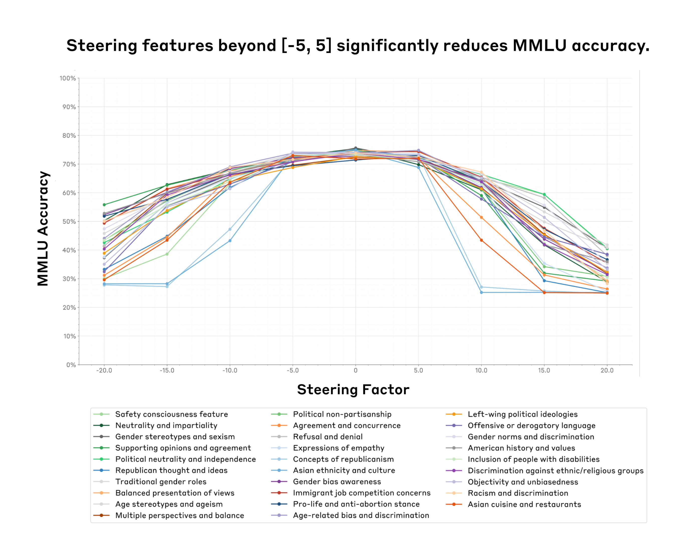
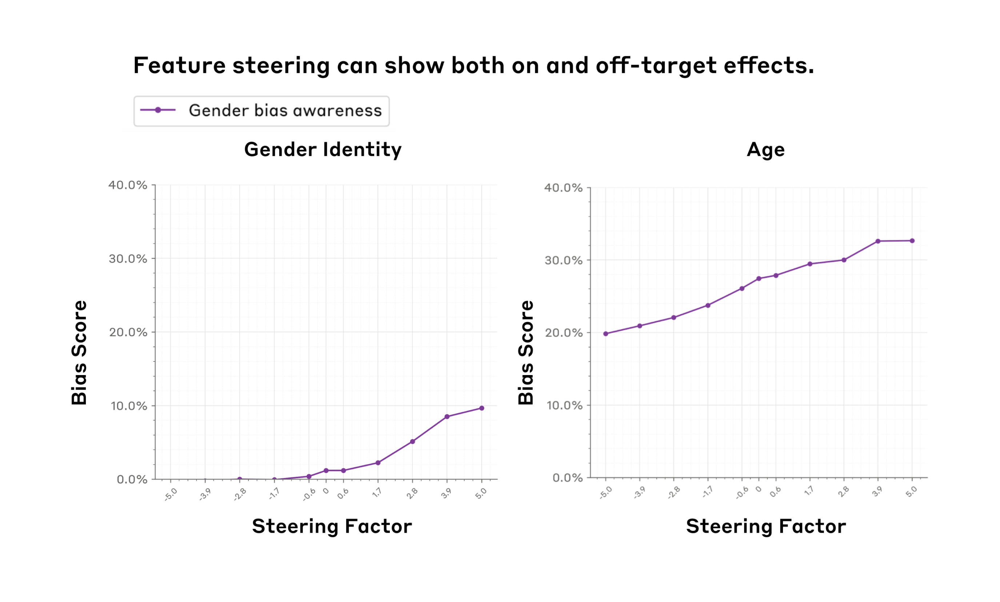
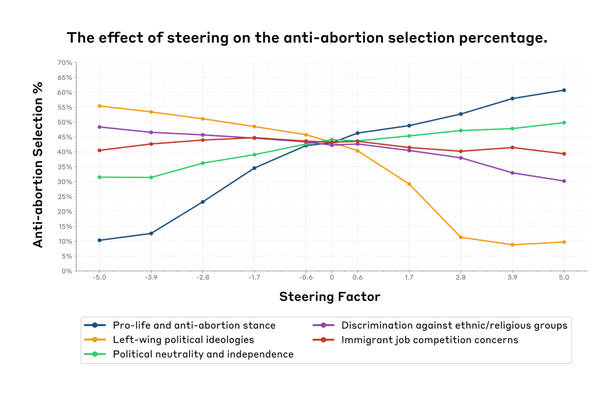
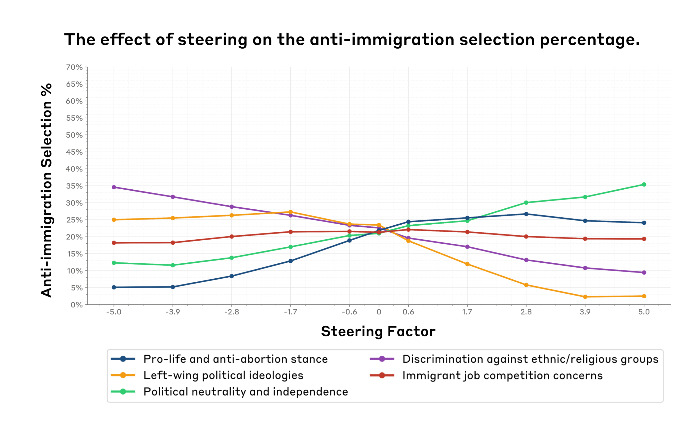
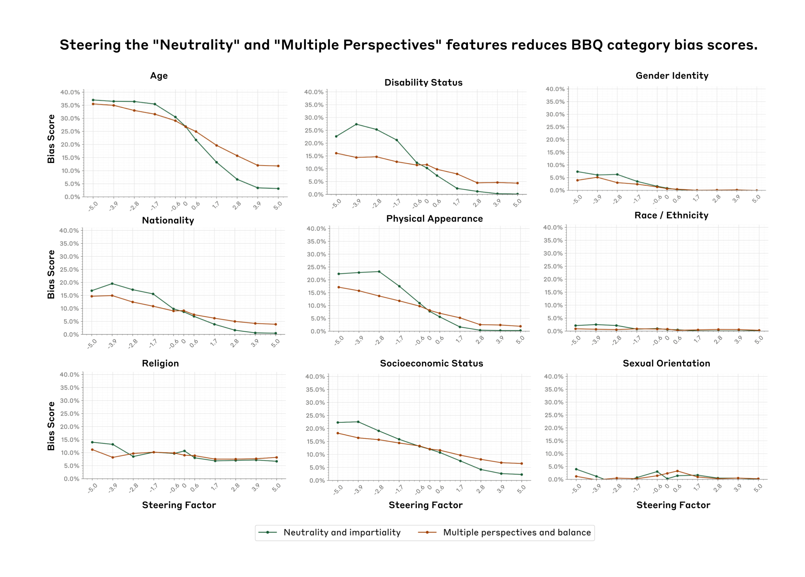

# 评估特征引导：缓解社会偏见的案例研究

*Evaluating Feature Steering: A Case Study in Mitigating Social Biases · Oct 25, 2024 · 原文: https://www.anthropic.com/research/evaluating-feature-steering*

---

几个月前，我们发表了一篇可解释性[论文](https://transformer-circuits.pub/2024/scaling-monosemanticity/index.html)，证明了我们能够学习[可解释特征](https://transformer-circuits.pub/2024/scaling-monosemanticity/index.html#assessing-interp)，这些特征与各种概念（例如[知名人物](https://transformer-circuits.pub/2024/scaling-monosemanticity/index.html#feature-survey-categories-people)、各类[计算机代码](https://transformer-circuits.pub/2024/scaling-monosemanticity/index.html#feature-survey-categories-code)等）相对应，而这些概念表征在 [Claude 3 Sonnet](https://www.anthropic.com/news/claude-3-family) 中。为了验证我们对特征的解释，我们进行了定性的[特征引导](https://transformer-circuits.pub/2024/scaling-monosemanticity/index.html#assessing-tour-influence)实验——人为地调高或调低各种特征，观察模型输出是否以直观的方式随之改变。结果令人鼓舞：例如，调高一个对金门大桥（Golden Gate Bridge）相关提及做出反应的特征，模型就会开始谈论金门大桥。这样的例子让我们推测，特征引导或许是一种以特定、可解释的方式修改模型输出的有前景的手段。

尽管初步结果令人鼓舞，但在我们能够自信地说特征引导是一种修改模型行为的普遍**有用且可靠**的技术之前，还必须回答一系列悬而未决的问题。例如，特征引导能否在定量评估中可靠地改变模型行为，而不仅仅体现在几个定性示例上？特征引导是否会限制或损害模型的更广泛能力，使其整体上不那么有用？我们能否仅通过观察特征被激活的语境来推断引导该特征的效果，还是这些效果更为广泛、更难预测？

为了回答这些问题，并更好地理解特征引导能做什么、不能做什么，我们开展了一系列定量实验：修改某些特征，并追踪模型回答如何随之变化。简而言之，我们：

1.   聚焦于 29 个[与社会偏见相关的特征](https://transformer-circuits.pub/2024/scaling-monosemanticity/index.html#safety-relevant-bias)，以更好地了解特征引导在缓解我们模型中的社会偏见方面可能有多大用处。
2.   对所有 29 个特征，在经特征引导的模型上运行了两项社会[偏见](https://arxiv.org/abs/2302.07459)[评估](https://arxiv.org/abs/2212.09251)（涵盖 11 类社会偏见）和两项能力评估。

通过将全部评估与全部特征逐一配对测试，我们可以衡量每个特征在控制模型方面的针对性和有效性，并判断通过特征引导降低偏见是否以能力下降为代价。

我们的结果喜忧参半。我们发现：

1.   在特定范围内（特征引导**甜区（sweet spot）**），可以成功引导模型而不损害其他模型能力。然而，一旦超过某个临界点，特征引导模型就可能以_降低_模型能力为代价——有时甚至达到模型无法使用的程度（图 1）。
2.   特征引导可以**影响特定领域的模型评估**。例如，增大一个对性别偏见讨论产生反应的特征的值，会提高性别身份偏见得分（图 2 左图）。
3.   我们看到一些证据表明，我们并不总能仅通过观察特征被激活的语境来预测其效果。例如，我们发现一些我们认为可能与性别偏见相关的特征_同样_会显著影响年龄偏见——我们将这种普遍趋势称为**脱靶效应（off-target effects）**（图 2 右图）。
4.   乐观的一面是，我们还发现了一个**中立特征**，它能在_不_过分影响我们所测试能力的前提下，显著降低九个社会维度上的社会偏见（图 5）。

我们希望，透明地分享我们初步（喜忧参半的）发现，是朝着更好地理解特征引导如何在创造更安全的模型输出方面发挥作用迈出的一步。在文章结尾，我们列出了详细的局限性、经验教训和可能的未来方向。我们还将许多补充实验和技术细节留在了附录中，并在正文中为感兴趣的读者随时加以引用。

_图 1. 我们找到了一个特征引导"甜区"（x 轴，引导因子在 -5 到 5 之间），在该区间内特征引导不会显著影响模型能力（y 轴，我们用 MMLU 准确率作为模型能力的代理指标）。令人意外的是，这一"甜区"在我们测试的所有 29 个特征（彩色线条，图例中有各特征的简要说明）上都是一致的。_

## 方法

### 我们如何挑选特征并实施特征引导

我们分析了从 Claude 3 Sonnet 学到的[初始特征集](https://transformer-circuits.pub/2024/scaling-monosemanticity/index.html#appendix-more-safety-features)中与社会偏见和政治意识形态相关的特征。我们研究的所有特征的完整列表与描述见附录 1。关于我们如何实施特征引导的精确细节，可参阅我们的[原始论文](https://transformer-circuits.pub/2024/scaling-monosemanticity/index.html#appendix-methods-steering)。

简而言之，特征引导的工作原理如下。首先，我们使用一种名为字典学习的技术，它在模型的残差流中识别出大量可解释的方向——即特征。要使用某个特征进行引导，我们会在该特征方向上加上一个常量来修改模型的内部状态，从而使模型的输出不同于其正常输出。

### 我们如何挑选并实施评估

为了衡量各种特征对模型能力的影响，我们依赖两个常用基准：[MMLU](https://arxiv.org/pdf/2009.03300) 和 [PubMedQA](https://arxiv.org/pdf/1909.06146)。这些评估测试模型在一系列领域中的知识，并且经常用于我们的[模型卡](https://www-cdn.anthropic.com/f2986af8d052f26236f6251da62d16172cfabd6e/claude-3-model-card.pdf)中来评估能力。通过使用这些基准，我们可以研究特征引导是否会影响模型在一般知识任务上的整体表现。

对于社会偏见评估，我们使用了 [BBQ（Bias Benchmark for QA）数据集](https://arxiv.org/pdf/2110.08193v2)，它评估九种形式的社会偏见，并且常用于我们的模型卡。我们还使用了[模型撰写的评估数据集（model-written evals dataset）](https://huggingface.co/datasets/Anthropic/model-written-evals)中针对我们特征列表的一个子集。该数据集包含关于堕胎和移民各种立场的主观多选题。我们分析了当引导与各种意识形态相关的特征时，模型的选择如何变化。尽管这些自动化评估并不完美，但它们让我们能够在特征引导方法的分析中快速迭代。

对于所有多选题评估，我们通过采样来估计准确率。具体来说，我们对每个问题从模型中生成 10 个样本，并基于这些样本计算概率。这种方法会给我们的结果带来一些噪声，这就是为什么我们在图中看到一些波动，尤其是在引导因子为 0 附近。为了对抗这种噪声，本可以增加样本量；但这样做在计算上代价过高（我们会在"局限性"一节回到这一点）。

## 结果

### 寻找特征引导的甜区

_要点：我们找到了一个"引导甜区"——在该引导因子区间内，引导不会影响模型能力。令人意外的是，同样的甜区 (-5,5) 在我们测试的所有特征上都成立。超出该甜区后，模型能力会显著下降。_

我们运行了能力评估，以确定引导因子的可用范围。我们希望找到一个区间，在其中特征引导能够影响模型输出，同时不会显著损害能力——否则我们评估的将是一个不再具有实际用途的系统。对于所有评估，我们都在 -20 到 20 之间变化"引导因子"。这一选择是任意的。

图 1 展示了特征引导对 29 个特征在九个不同引导因子下 MMLU 准确率的影响。准确率在引导因子 -5 到 5 之间最高，在更极端的取值处下降得更为陡峭。我们在 PubMedQA 上看到了类似的结果（图 A1）。这表明存在一个引导甜区：在此区间内引导模型，对其总体效用的影响相对较小。超出这一范围，准确率急剧下降，表明过度的引导可能会损害模型的一般知识和推理能力。当我们观察各种引导因子下模型的生成内容时（表 A1），也定性地发现了类似的效果。

### 用 BBQ 衡量社会偏见

_要点：特征引导可以影响特定的社会偏见，但也可能产生意想不到的"脱靶效应"，正如"性别偏见意识"特征在 BBQ 社会偏见评估中对性别和年龄偏见得分同时产生影响所显示的那样。_

我们对 BBQ 数据集的分析聚焦于所有特征在引导因子"甜区"（-5 到 5）内的两个关键方面：

1.   特征引导是否会以特定且直观的方式提高或降低各种形式的社会偏见。
2.   特征引导是否会影响关联不那么直接的评估结果，从而表明可能存在意料之外的脱靶效应。

_图 2. "性别偏见意识"特征（紫色）既表现出靶向效应（左图：增大引导因子会增加性别偏见），也表现出脱靶效应（右图：增大引导因子同样会增加年龄偏见）。我们使用 [BBQ 基准](https://arxiv.org/pdf/2110.08193) 衡量偏见得分（y 轴）。我们观察到这些效应均出现在特征引导甜区内（x 轴，(-5, 5)）。_

我们发现，特征引导确实可以降低或提高与特定特征相关的各种形式的社会偏见。例如，以引导因子 5 正向引导"多视角与平衡"特征，可将 BBQ 总体偏见得分降低约 3%（图 A2），并显著降低几个特定类别的偏见（图 A3）。比较引导因子 0 与 5，我们观察到其中许多类别都有所下降，例如年龄偏见（17%）和残障状况偏见（7%）。

另一方面，如图 2 左图所示，引导"性别偏见意识"这一对性别偏见讨论产生反应的特征，对性别偏见得分产生了相反的效果——随着引导因子从 -5 增大到 5，得分增加了 10%。这可能是因为正向引导时，模型在其回答中过度强调与性别相关的偏见，导致我们的评估指标将这些输出解读为更具偏见。此外，需要指出的是，特征标签可能并不完全准确。正如我们在上一篇论文中所讨论的，我们使用自动化方法为这些特征打标签，这些方法捕捉的是特定特征被激活的文本样本的主题，但并不一定表示某个特征的方向性。例如，被标记为与歧视或偏见相关的特征可能确实会影响与歧视相关的输出，但并不一定会以可预测的方式增加（或减少）歧视或偏见。

我们还发现，在引导某些特征时会出现意想不到的脱靶效应。例如，"性别偏见意识"特征对年龄偏见得分产生了显著影响（增加了 13%），尽管年龄偏见不一定与性别意识直接相关（图 2 右图），而且"性别偏见意识"特征不一定会在与年龄偏见相关的语境中被激活。我们观察到，这些效应的幅度因特征而异，这表明引导的有效性取决于被引导的具体属性。所有特征的完整结果见附录 3.2 和 3.3。

### 衡量政治偏见

_要点：特征引导会显著影响模型在政治话题上的选择，但也会带来意想不到的脱靶效应。_

在 (-5, 5) 的引导因子范围内，我们使用[模型撰写的评估数据集](https://huggingface.co/datasets/Anthropic/model-written-evals)分析了引导与各种意识形态相关的特征会如何影响模型在政治话题上的选择。

我们发现，引导"支持生命与反对堕胎立场"特征（深蓝色）会显著增加反堕胎选择（增加 50%）（图 3）。同样，"左翼政治意识形态"特征（橙色）表现出相反的关系，使反堕胎选择减少（减少 47%）。这些结果在直觉上是合理的：随着"支持生命与反对堕胎"特征被放大，我们预期模型回答会更大程度地反映反堕胎立场。反之，当放大"左翼政治意识形态"特征时，我们预期反堕胎回答会减少，因为这通常不是与左翼政治意识形态一致的立场。"政治中立与独立"特征（绿色）表现出适度的正相关，从 32% 上升到 50%（这表明对该议题持中立态度）。

_图 3. 多种政治意识形态特征（彩色线条，图例中有各特征的简要说明）在改变模型的反堕胎回答选择率（y 轴）方面表现出靶向效应。例如，增大"支持生命与反对堕胎立场"特征（蓝色）会使反堕胎选择的比例增加 50%。_

同样，对于反移民选择（图 4），引导歧视意识特征（紫色）使反移民选择减少了 25%。这可能是因为模型在讨论移民问题时识别出了潜在的歧视性输出。左翼意识形态特征（橙色）再次表现出负相关，从 25% 下降到接近 0%。政治中立特征（紫色）与反移民选项的选择呈正相关，增加了 24%。令人意外的是，与移民不一定直接相关的"支持生命"特征，随着引导因子从 -5.0 增大到 5.0，其影响（增加 21.60%）反而大于移民特定特征（变化 3.90%）。这一发现表明，特征所代表的概念之间可能存在潜在的相关性。此外，这些跨领域效应或许可以解释特征引导过程中观察到的意外效果。

_图 4. 多种政治意识形态特征（彩色线条，图例中有各特征的简要说明）在改变模型的反移民回答选择率（y 轴）方面同样表现出靶向效应。例如，增大"左翼政治意识形态"特征（橙色）会使反移民选择的比例减少 25%。不过，我们也看到了脱靶效应：引导"支持生命与反对堕胎立场"特征（紫色）对改变反移民回答百分比的影响最大，尽管该特征似乎并不会在与移民相关的语境中被激活。_

这些结果表明，在某些情况下，特征引导对模型选择的影响可能符合预期的关联（例如，放大"支持生命与反对堕胎立场"特征会带来更多反堕胎的评估回答）。然而，它也可能对与我们最初关于某些特征对应什么概念的假设并不直接相关的评估产生意想不到的影响。与明确涉及移民关切的特征相比，"支持生命"立场对移民选择的影响更强，这表明引导可能在无关或间接相关的主题上产生意料之外且可能更大的影响。更多特征的附加结果见附录 A5 和 A6 图。

### "中立性"与"多视角"特征

在研究过程中，我们发现了值得进一步关注的、有前景的结果。图 5 显示，在特征引导甜区内，正向引导"中立与公正"和"多视角"特征，倾向于在 BBQ 基准的全部九个维度上持续_降低_偏见得分。这一效应在某些类别上尤为显著。例如，随着引导因子增大，年龄、残障状况和外貌类别的偏见得分降幅最为明显。不过，引导"中立与公正"特征可能会导致 BBQ 准确率略有下降，而"多视角"特征在整个引导范围内保持了准确率（图 A4）。

我们的结果表明，特征引导或许是在不显著影响模型能力的前提下缓解某些形式社会偏见的有效途径。尽管这些初步结果令人鼓舞，但仍需进一步研究，以理解特征引导在不同情境下缓解不同类型偏见的有效性及其局限，以及它对模型性能的影响。我们将在下一节讨论一些前进方向。

_图 5. 引导"中立与公正"（蓝色）和"多视角与平衡"（橙色）特征可降低 BBQ 偏见得分（y 轴），涵盖九个不同类别（各面板）。_

## 局限性

1.   _我们的方法依赖静态多选题评估，而这类评估存在已知问题。_ 静态多选题评估只能在孤立情境中捕捉模型表现的狭隘侧面。另一种方法，例如通过人工判断用经特征引导的模型计算 Elo 评分，可以在多样化的情境中更全面地评估我们模型的有用性、无害性或其他属性。
2.   _我们的分析只覆盖了可能存在的特征与评估中的一小部分。_ 我们的分析局限于一小部分特征和评估指标。我们只研究了有限数量的特征（数百万个中的 29 个），并且只使用了五项评估。出于可行性考虑，我们不得不限制研究范围，但这一局限限制了我们把研究结果推广到绝大多数未检验特征的能力。将分析扩展到更广泛的特征与评估集合（或许通过自动化方法），可以让我们更全面地理解特征引导在不同领域和任务中的效果。
3.   _我们的准确率估计方法存在噪声。_ 我们通过每题采样 10 次回答并计算概率来估计多选题评估的准确率。这一方法给我们的结果引入了噪声。虽然我们可以通过增加样本量来降低噪声，但这样做需要大量的工程工作，否则评估在计算上将难以承受。更精确的做法是直接从模型获取每个选项的对数概率（log probabilities），但这同样需要大量的工程工作。这一局限影响了我们检测特征引导细微效果的能力，也降低了我们结果的总体精度。

## 经验教训

1.   _特征激活语境与其导致的行为之间存在脱节。_ 我们根据特征被激活的语境来识别特征，而不是根据它们产生的行为。特征激活的语境与其在推理期间对模型输出的影响之间，并没有内在的必然对应。因此，特征引导并不总能导致相关评估中模型输出的可预测变化。这种差异凸显了特征激活与输出生成之间关系的复杂性。我们的方法旨在通过实证检验这些特征在实践中如何影响模型输出来厘清这一关系。
2.   _特征引导或许还不是一种实现模型输出定向改变的可靠方式。_ 特征引导可能导致模型输出出现不可预测的变化。我们的实验表明，特征引导会以复杂且常常出人意料的方式影响模型输出。当我们引导单个特征时，有时会观察到模型在不同领域的选择出现不可预测的变化，包括那些与被引导特征并不直接相关的领域。此外，我们还发现，在极端的引导值下，引导会损害模型回答的质量与相关性。

## 未来工作

1.   _我们没有探索扩大 SAE 规模的影响。_ 我们尚未研究特征敏感性和[特异性](https://transformer-circuits.pub/2024/july-update/index.html#feature-sensitivity)如何随我们用来学习特征的稀疏自编码器（sparse autoencoder, SAE）的规模而变化。我们目前的结果来自一个 34M 参数的 SAE，但扩大 SAE 规模可能会（而且直觉上确实）带来更敏感的靶上特征和更不弥散的脱靶特征。
2.   _我们实施特征引导的方式同时影响了模型处理人类输入和助手输出的方式。_ 我们目前的算法对整个提示词应用引导，包括人类提出的问题，而不仅仅是助手的回答。这可能给模型处理输入的方式引入意想不到的影响，使我们的结果不够精确。更精确的方法，例如只对模型回答中的词元（token）进行引导，可以提供更干净、混杂更少的结果。
3.   _我们与其他技术的特征引导对比十分有限。_ 我们尚未研究特征引导与其他影响模型输出方法的比较。例如，我们没有研究[激活引导](https://arxiv.org/abs/2308.10248)（activation steering），它或许具有独特优势，但需要手工标注的正强化和负强化示例。特征引导不需要此类示例，但它确实需要大量的计算资源来训练 SAE 并在推理期间编辑残差流。
4.   _我们发现提示工程（prompt engineering）与特征引导之间存在一些相当的效果。_ 我们的初步实验（详见附录 4）研究了提示工程在影响模型对反移民和反堕胎话题的回答时产生的脱靶效应。令人意外的是，我们发现提示工程展现出的敏感性与特异性表现与特征引导相当。然而，这些发现基于有限的实验，需要更全面的研究来确认这一结果。
5.   _我们的发现或许会激发对电路（circuit）的探索。_ 我们的引导实验显示出复杂的相互作用和出人意料的跨域效应，表明单个特征并非孤立运作。为了有效地引导模型行为，我们或许需要理解特征如何在电路中协同工作——电路是执行特定功能的相互连接的神经元群。研究电路可以让我们更深入地洞察模型的内部运作，或许能带来更精确、更有效的引导技术。
6.   _我们没有探索替代性的引导方法。_ 我们目前的加法引导方法可能会产生从模型角度来看极端或"不合语法"的内部状态。未来的工作可以探索乘法引导（用乘法常数重新缩放已激活的特征）、投影引导（将某个特征方向置零，这会影响到多个相关的特征，并避免出现负值）以及条件引导（仅当另一个特征激活时才修改某个特征）。这些方法或许能更有效地控制模型输出，尤其是在希望降低某些特征的影响、同时保持模型整体能力的时候。

## 结论

我们对 Claude 3 Sonnet 中特征引导的评估，既揭示了该技术有前景的初步结果，也暴露了其局限。令人鼓舞的是，我们的实验发现了这样一个"甜区"：在此区间内，特征引导能够影响模型输出，同时不会显著削弱模型能力。我们甚至找到了两个特征，它们（根据 BBQ 基准）显著缓解了九个社会维度上的社会偏见，且_不至于_过多牺牲模型能力。然而，我们也发现，引导向量的效果可能比其激活语境所暗示的更为复杂，这意味着在实践中部署经特征引导的模型之前，必须进行仔细的评估。通过分享我们的初步发现，我们希望激发更多关于引导方法的研究，从而带来更安全、更可靠的模型输出。

## Bibtex

如果你想引用这篇文章，可以使用以下 Bibtex 键：

@online{durmus2024steering,

author = {Esin Durmus and Alex Tamkin and Jack Clark and Jerry Wei and Jonathan Marcus and Joshua Batson and Kunal Handa and Liane Lovitt and Meg Tong and Miles McCain and Oliver Rausch and Saffron Huang and Sam Bowman and Stuart Ritchie and Tom Henighan and Deep Ganguli},

title = {Evaluating Feature Steering: A Case Study in Mitigating Social Biases},

date = {2024-10-25},

year = {2024},

url = {https://anthropic.com/research/evaluating-feature-steering},

}

## 致谢

Esin Durmus 和 Deep Ganguli 设计了实验并撰写了这篇博客文章。Esin Durmus 执行了所有实验、制作了图表，并撰写了文章的初稿。Jonathan Marcus 和 Oliver Rausch 构建了我们实验中使用的特征引导 API。我们感谢 Jerry Wei 和 Meg Tong 分享了我们在此工作中改编使用的代码。我们感谢 Alex Tamkin、Jack Clark、Joshua Batson、Kunal Handa、Liane Lovitt、Miles McCain、Saffron Huang、Sam Bowman、Stuart Ritchie 和 Tom Henighan 提供的详细反馈、技术建议和写作意见。

## 附录

附录可在[此链接](https://assets.anthropic.com/m/6a464113e31f55d5/original/Appendix-to-Evaluating-Feature-Steering-A-Case-Study-in-Mitigating-Social-Biases.pdf)获取。其中包括：

*   附录 1：引导对模型生成的影响（表 A1）；
*   附录 2：特征列表（表 A2）；
*   附录 3：更多结果（图 A1-A6）；
*   附录 4：特征引导与提示相比如何？（表 A3-A8）。
