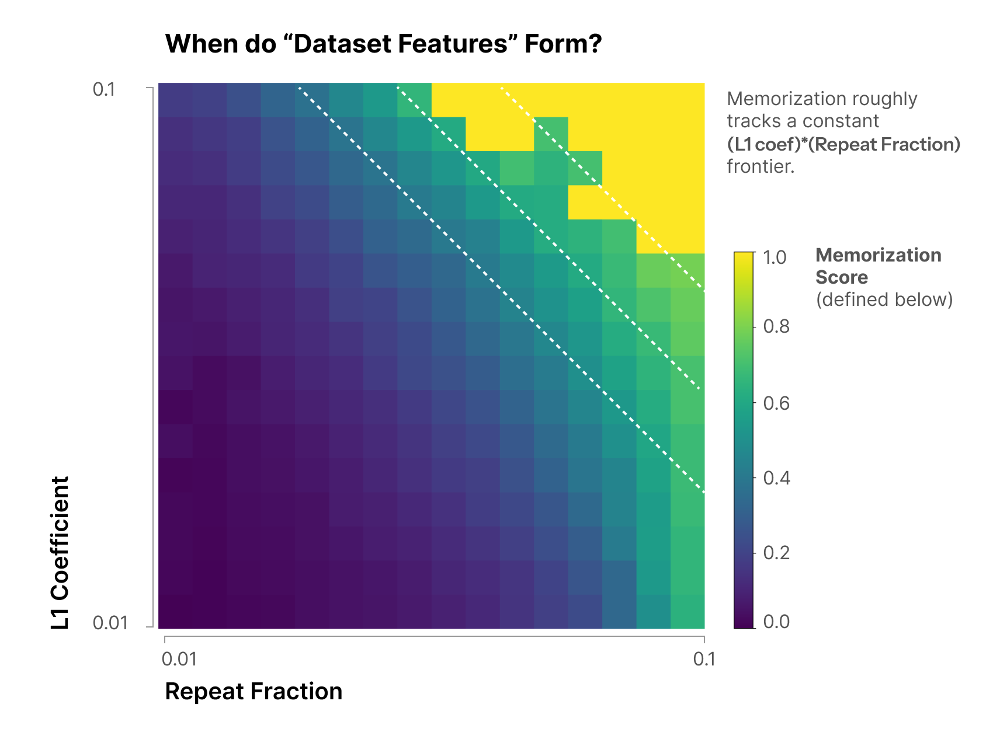
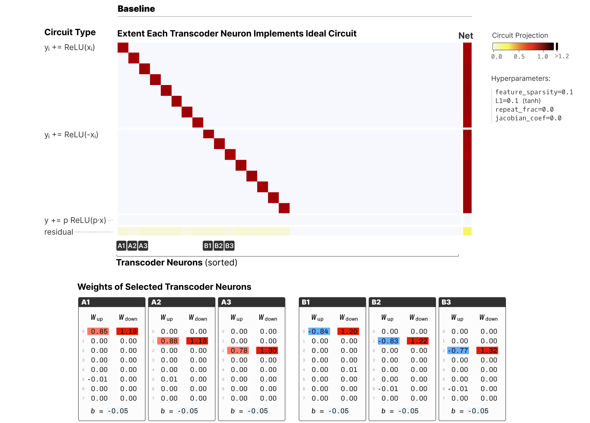
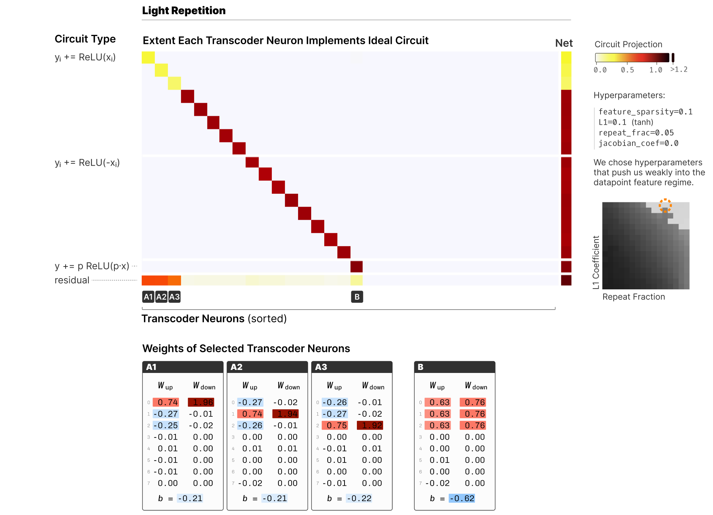
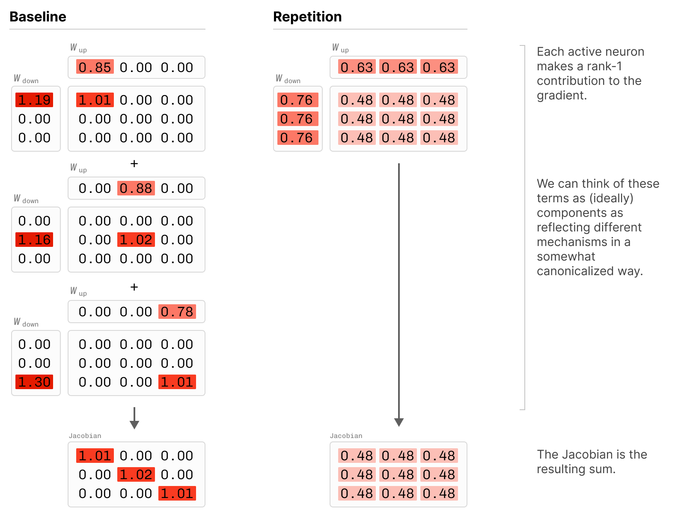
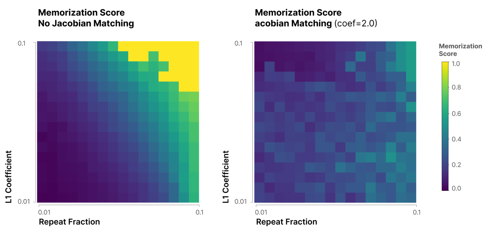
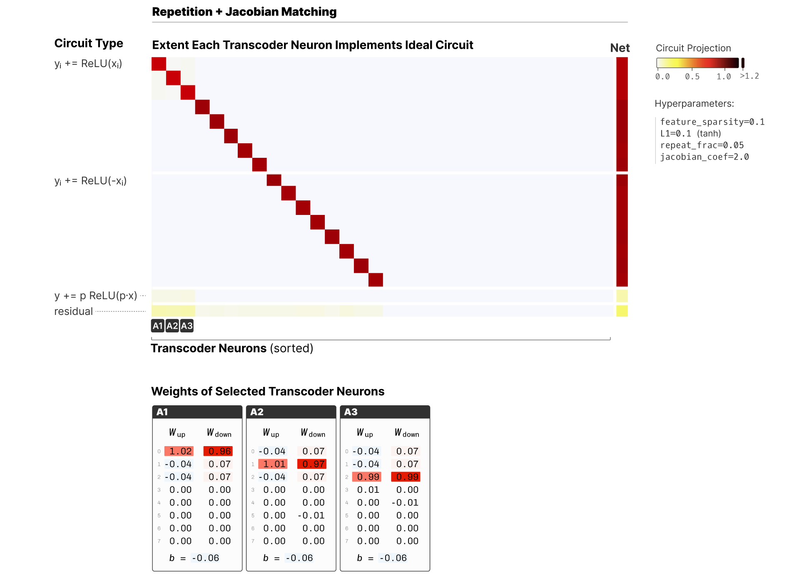
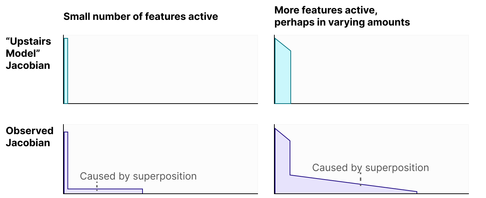

# 机制（不）忠实性的玩具模型

*2025 年 8 月 12 日 · 原文: https://transformer-circuits.pub/2025/faithfulness-toy-model/index.html*

---

机制忠实性（mechanistic faithfulness）关注的是：当我们用稀疏近似（如转码器（transcoder））替换模型组件时，这些替代组件所实现的机制可能与原模型不同。每个计算机科学专业的学生都知道，能够实现相同效果的不同算法比比皆是——排序算法就是一个经典例子！那我们凭什么相信转码器学到的是与原模型相同的机制呢？

本次更新的目的是阐述机制忠实性，并用一个玩具模型（toy model）加以具体说明。虽然我们在近期的论文中[曾简要讨论过这一点](https://transformer-circuits.pub/2025/attribution-graphs/methods.html#limitations-faithfulness)，但我们觉得这个问题值得更深入的探讨。我们还会简要探索一个想法：“雅可比匹配”（Jacobian matching）或许能对此有所帮助。最后，我们将讨论机制忠实性与围绕稀疏自编码器（sparse autoencoder, SAE）和转码器的更广泛关注点之间的关系，以此作结。

这份说明非常初步。我们之所以分享出来，是因为它可能引起活跃在该领域的研究者的兴趣，而且我们相信及早分享想法是有价值的。我们希望读者把这些结果当作同事在组会上花几分钟分享的想法或初步实验，而不是一篇成熟的论文。本文并非面向大众读者。文中所有论断都应带着大量保留和低置信度来阅读。

#### 背景：梦游式步入机制忠实性

2024 年，多位研究者提出了我们现在所称的转码器 \cite{dunefsky2024transcoders,marks2024dictionary,templeton2024predicting}：一种读取某层输入并预测其输出的 SAE。这些转码器极大地简化了电路分析——现在可以把特征之间的关系视为线性相互作用，而不必通过非线性做出没有原则可循的近似，或最终陷入“归因地狱”。

当时，我认为我们低估了这是一次多么根本的转变——至少我自己肯定是低估了。我们正在从“用 SAE 建模表示”转向“建模计算”。

当建模的对象是表示时，很多问题都可以被原谅。特征不过是激活值向量空间的一组基，主要关切在于它们是否让激活值变得可理解。只要你的特征是单语义的，并能解释这些激活值，这就是理解激活值内容的有效方式。当然，在这个基下理解模型的计算也许会很困难，但你不会被误导。

然而，当建模的对象是计算时，就可能出现这样的情况：一个配置虽然是单语义的、在分布内具有很低的均方误差（MSE），却是通过一种不同的计算机制实现的。这尤其令人担忧，因为替代机制在分布外可能以不同的方式泛化。这动摇了我对机制可解释性（mechanistic interpretability, mech interp）最深切的期待之一：我们能够真正深度信赖的解释。

机制不忠实性的程度在某种程度上受到限制，因为机制只能偏离到一定程度——我们毕竟只是“一步一个脚印”地替换模型：每个转码器步骤都在经过一次转码器非线性之后预测真值残差流，这大大限制了机制偏离的空间。（如果你强制排序算法在每一步计算后都与记忆状态保持一致，那很可能就会迫使它们变成同一个算法！）

但对转码器而言，我们可以清晰地构造出这样的例子：尽管有上述限制，它们依然能够、并且确实会在机制上发生偏离。

#### 绝对值转码器问题与重复数据

我们的目标是构造一个能说明机制（不）忠实性的玩具模型。这意味着我们需要一个研究计算而非表示的玩具模型，并且其中的计算有可能是不忠实的！

绝对值问题就是这样一个玩具问题。我们可以让一个单层模型尝试映射 $x \to y = \text{abs}(x)$。用两个 ReLU 神经元就能轻松做到：

$$y_i = \text{ReLU}(x_i) + \text{ReLU}(-x_i)$$

这与 $\text{abs}(x)$ 完全一致；事实上，我们可以把 $\text{abs}(x)$ 看作这个 ReLU 网络的一种便捷写法。

我们可以问这样一个问题：“如果我们不给模型足够的神经元来实现这个解，它会如何在叠加中进行计算？”这个问题我们留到以后再说。我们转而问：给定一个完美模型（即 $y = \text{abs}(x)$，或等价地 $y_i = \text{ReLU}(x_i) + \text{ReLU}(-x_i)$），转码器在什么情况下才能恢复这些特征？

结果表明，我们的转码器默认就能轻易发现这个解。

（一个重要细节是：为了得到更接近 L0 正则化的结果，我们将使用 tanh L1 正则化。如果使用标准 L1 正则化，转码器基本上会利用多余的容量学到重复的特征，总体上更杂乱。）

##### 加入一个重复数据点

在基本问题设置中，我们使用如下数据分布：

$x_i = \text{Uniform}(-1,1)~~~~$$\text{if} ~ \text{Uniform}(0,1) ~<~ \text{density}$$x_i = 0$$\text{otherwise}$

现在我们要向其中加入一个特殊的“记忆化数据点”。我们定义一个特殊数据点 p：它在前 3 个维度上为 1，其余维度为 0：

$$p \approx [1, 1, 1, 0, 0, 0, 0, 0, 0, 0, 0, \ldots]$$

然后让 $x$ 在 `repeat_frac` 比例的时间里等于 $p$。

##### 数据点特征浮现

当我们这样重复一个数据点时，就会开始看到转码器的“记忆化特征”电路：

$$y ~+=~ p \cdot \text{ReLU}(\lambda p \cdot x - b)$$

注意这个特征专门针对 p 激活，然后输出 p！

我们称之为“[数据点特征](https://transformer-circuits.pub/2023/toy-double-descent/index.html)”。

如果这样的数据点特征反映了底层模型，那它们就没有问题。模型很可能确实会记住一些数据点，在这种情况下我们需要这样的特征。但在本例中，模型 $x \to \text{abs}(x)$ 对 $p$ 没有任何特殊概念。这意味着这些特征在机制上并不忠实！转码器记住了底层模型没有记住的东西。

现在我们有了一个可以探索的机制不忠实性例子。在接下来的几节中，我们将研究这些数据点特征何时形成、如何去除它们，目标是更一般地解决机制忠实性问题。

##### 数据点特征何时形成？

在运行更多实验之前，先弄清楚我们究竟应该在何时预期转码器中出现这些数据点特征，会有助于校准我们的实验。当它们是由于转码器记住了某个数据点而形成的（而不是底层模型记住了它、转码器忠实地模仿）时，需要满足两个必要条件：

1. 转码器的训练集中必须存在重复的数据点。重复越多，数据点特征越可能出现。
1. 我们必须对激活做稀疏性正则化。这会让记住该数据点变得有用，因为我们可以更稀疏地处理这个特定输入。

如果我们对这两个超参数进行扫描并测量数据点特征的存在情况，就会发现：实际上决定数据点特征是否形成的是这两个性质的乘积（我们对记忆化的度量在下一节定义）：

##### 附注：我们如何检测数据点特征？

对任意特征 $f_i$，我们可以测量它对 $y$ 的贡献。我们将其记作：

$$y|_{f_i}(x) = W_\text{down}^i f_i(x)$$

我们将特征 $f_i$ 在数据点 p 上的记忆化定义为：对 $p$ 的“超额”解释——超出泛化解对构成它的三个单独维度分别给出的解释的部分：

$$m(f_i, p) = \text{ReLU}(y|_{f_i}(p) \cdot \hat{p} - \text{max}_{j<3} y|_{f_i}(p)  \cdot e_j$$

其中 $p$ 是上文定义的重复数据点，$e_j$ 表示第 j 个单位向量。然后我们将模型的总记忆化定义为各特征记忆化之和。这是定义记忆化的一种粗糙方式，但作为起点很有用。

#### 研究数据点特征

在本节中，我们将在两种设置下研究玩具模型：一种没有重复数据点，另一种有。我们的目标是机制性地理解所得模型，并直接观察数据点特征是如何被诱发出来的。

为此，我们将引入一种新的可视化方法，让我们能看到每个转码器特征是如何映射到我们认为它可能自然学到的那些特征（$\text{ReLU}(x_i)$、$\text{ReLU}(-x_i)$ 和记忆化）上的。这背后的数学有些微妙，所以我们先看一个使用这种可视化的例子，再解释它。这样会让数学更有动机、也更容易理解。

##### 无重复基线

下面你可以看到这种可视化应用在一个基线设置上：我们在无任何重复的情况下，在绝对值问题上训练一个转码器。

这种可视化的详细解释见下文，现在只需注意：它展示的是转码器神经元与我们可能预期学到的特征之间的映射。x 轴是转码器神经元，y 轴是可能的特征/电路。在没有重复的情况下，我们看到转码器几乎精确地学到了预期的特征 $y_i += \text{ReLU}(x_i)$ 或 $y_i += \text{ReLU}(-x_i)$，只带有很小的残差。为了让这一点更具体，下面还展示了所选神经元的实际权重。

##### 附注：这种可视化是如何工作的？

关键想法是：我们有一个“理想电路库”，包含我们认为转码器可能学到的理想电路（常规的 ReLU 电路和记忆化电路）。我们考虑每个理想电路会产生的“贡献” $y|_{f_i}$（如上文定义）。我们在大量数据点样本上考察这样的贡献向量，得到一个非常高维的向量。我们可以为学到的每个转码器特征构造类似的向量；这些向量基于相同的数据点构造，因此相互可比。然后我们用压缩感知，尝试用理想电路来解释观测到的每个转码器特征电路的贡献。最终得到一个转码器特征 × 理想特征的矩阵，以及一个无法解释的残差。

##### 轻度重复

现在我们可以问：如果引入一个重复数据点会发生什么！（在这个设置中，我们只用了相对少量的重复数据——5%，因此记忆化处于边缘水平。）

现在我们可以看到数据点特征（见右下角），正如预期。我们还看到与重复数据点所用到的那三个单独特征相对应的特征，但它们被旋转了，从而不会在重复数据点上激活。

这表明即使在非常简单的设置中，机制忠实性也可能成为一个真正的问题！

#### 雅可比正则化：一个潜在的解决方案？

机制忠实性是一个严重的问题，但我们认为这个问题并非无解。在本节中，我们提出机制忠实性与层的雅可比矩阵（Jacobian）之间的联系，并证明我们可以利用这一点来解决机制忠实性问题——至少在部分玩具问题中如此。（我们并不声称这是理想的解决方案，事实上我们会指出它的一些问题。我们的目标只是表明存在富有成效的探索方向。）

雅可比矩阵与这个问题之间的联系乍一看并不明显。一个理解方式是比较我们前两个例子中转码器学到的特征，在记忆化数据点上产生了多么不同的雅可比矩阵：

在基线情况下，我们看到一个对角矩阵（表明特征是相互独立的）。但在有数据点特征的重复数据情况下，我们看到每个特征局部激活的“原因”来自所有其他特征（而这些特征本应与之无关！）。

这种方法之所以有原则可循，还有更深层的技术原因。对单层而言，雅可比矩阵（作为跨数据点的函数）以一种非常重要的方式触及了其机制的本质。直觉上，如果你想理解机制，就应该看权重——这正是电路工作的动机，也是近来“基于权重的可解释性”（如 \cite{braun2025interpretability}）背后的动机。但神经网络的权重并非规范形式——你可以用各种方式变换它们，比如置换神经元，或者对输入权重和输出权重做相反的缩放。它们还需要上下文信息来理解输入统计量将如何决定非线性的行为。对 ReLU 层而言，我们可以把它的雅可比矩阵理解为对应输入权重与输出权重的外积之和。从某种意义上说，这是参数的一种自然的规范化形式，而且（作为跨数据点的函数来考察时）它还附带了神经元何时共同激活的信息。

##### 雅可比匹配

基于这一观察，一个自然的回应就是我们所说的“雅可比匹配”。我们对转码器的雅可比矩阵与真实雅可比矩阵之间的差异施加惩罚：

$$||J_\text{MLP} - J_\text{Transcoder}||_F^2$$

在实践中，这个目标函数会极其昂贵。作为替代，我们利用以下事实：它在期望意义下等价于：

$${\Large E}_v K||J_\text{MLP}v - J_\text{Transcoder}v||_2^2$$

其中 $v$ 是随机向量。这可以通过反向传播廉价地计算。

事实证明，把它加入损失函数极大地改善了我们的数据点特征记忆化指标。

##### 雅可比匹配可以解决机制忠实性问题（在本例中）

让我们回到上面的重复数据点例子——它产生了数据点特征。如果我们对它施加正则化，使其匹配真值雅可比矩阵，会发生什么？事实证明，这基本上解决了问题！

我们看到这消除了记忆化特征，但转码器中对应于重复数据点所用特征的那些特征有些旋转（见左下角的残差）。

##### 转码器能否作弊？

在对抗攻击鲁棒性文献中，有一个被称为“梯度掩蔽”的问题：模型会学着操纵自己的梯度。我们观察到的常见伎俩是：它们可以创建权重很大（因而梯度很大）但偏置非常负的特征，使这些特征几乎不激活，对 L1 目标函数的贡献很小。

注意，这是利用了我们的 L1 目标函数与我们真正想优化的 L0 目标函数之间的差距。使用 tanh L1 在这里有很大帮助，因为它让我们更接近 L0。

在原则上，如果这成了问题，我们似乎还可以加入其他优化项来应对。例如，对转码器各特征对雅可比矩阵贡献的 L1 范数施加惩罚，以阻止此类操纵梯度的企图，可能会很有意思。这一项可以廉价地近似计算，因为它不过是输入权重与输出权重的范数相乘，再以转码器激活函数的雅可比矩阵作掩蔽而已。

##### 叠加与雅可比矩阵匹配

令人惊讶的是，我们可能并不想完美匹配雅可比矩阵。这是因为我们相信所研究的模型处于叠加之中，而叠加会"模糊"雅可比矩阵。

思考这个问题的一种方式是追问：我们预期雅可比矩阵的谱会是什么样？非常粗略地说，我们可能预期它像这样：

尾部是叠加的伪影，我们不必在意对它的建模。具体来说，它对应那些散布在多个神经元上的特征，而这些神经元同时还表征其他特征。如果单个特征被激活，且它散布在 10 个神经元上，那么我们应该预期雅可比矩阵中有一个与该特征对应的大奇异值，以及 9 个与这些神经元帮助表征的其他事物对应的小奇异值。

这种直觉让我们相信：虽然我们希望朝着更好的雅可比矩阵匹配推进，但不应该期待完美匹配。

#### 结论

我们已经看到，机制忠实性可能是一个真实存在的问题！

在我们的思考中，它的意义已不止于此。在关于 SAE/转码器及其潜在弱点的持续讨论中，我们发现把各种担忧重组为两大类会很有帮助：

1. 机制忠实性——转码器是否捕捉到了真正的机制？这一维度的失败直击我们对机制可解释性一切期望的核心。另一方面，只要我们能在这方面取得成功，至少转码器就能被可靠地用来学习真实的东西！在实践中，这大概是一个连续谱。
2. 简洁性——转码器是否以最简单/最清晰的方式捕捉机制？可以想象，同一机制存在多种不同解释方式的情况。例如，可能存在特征流形 / 多维特征，但它们也能用大量离散特征来精确近似。这一维度的失败，更多是让理解事物变得更难的一种代价。

在实践中，人们提出的许多担忧都在某种程度上同时涉及这两个维度。

这两者都是重大关切，但我们目前最关心的是机制忠实性。虽然在这方面的成功或许更像一个连续谱而非非此即彼的二分，但我们认为它直击我们为何关心机制可解释性的核心。幸运的是，似乎存在有前景的前进路径。

## 参考文献

- [dunefsky2024transcoders]: Dunefsky, Jacob, Chlenski, Philippe, Nanda, Neel, “Transcoders find interpretable LLM feature circuits”, Advances in Neural Information Processing Systems, 2025
- [marks2024dictionary]: Marks, Samuel, Karvonen, Adam, Mueller, Aaron, “dictionary_learning Github Repository”, Github, 2024
- [templeton2024predicting]: Templeton, Adly, Batson, Joshua, Jermyn, Adam, Olah, Chris, “Predicting Future Activations”, 2024
- [braun2025interpretability]: Braun, Dan, Bushnaq, Lucius, Heimersheim, Stefan, Mendel, Jake, Sharkey, Lee, “Interpretability in Parameter Space: Minimizing Mechanistic Description Length with Attribution-based Parameter Decomposition”, arXiv preprint arXiv:2501.14926, 2025
