# 用字典学习特征作为分类器

*Jul 29, 2024 · 原文: https://transformer-circuits.pub/2024/features-as-classifiers/index.html*

---

我们在 Anthropic 可解释性团队汇报一些进行中的工作，或许会对活跃在这一领域的研究者有所启发。我们希望您把这些结果当作一位同事在组会上分享几分钟的想法或初步实验，而不是一篇成熟的论文。

近期，利用字典学习从 LLM 中提取人类可理解的特征取得了成功，并引发了广泛关注 \cite{bricken2023monosemanticity,cunningham2023sparse,gao2024scaling,templeton2024scaling}。然而，这些特征许多被理论化的益处尚未真正实现。

其中一个被理论化的用例是在模型内部表示上训练更好的分类器 \cite{marks2024sparse,gao2024scaling}，例如检测模型是否被提示去思考任何有害的生物危害信息[^1]。

我们发现，在若干场景下，用特征集合而非原始激活（raw activations）来训练生物武器分类器是有利的：

- 线性特征分类器可以与基于原始激活的分类器相抗衡，有时甚至表现更好。
- 在特征激活上训练的决策树性能不如线性分类器，但特别易于解释。
- 可视化线性特征分类器可能是理解带标注文本数据集的有力工具；尤其是发现这些数据集中的虚假相关。
- 用上述方法识别出的虚假相关，可以用来构造针对线性特征分类器和原始激活分类器的有效对抗攻击。

不过，与原始激活相比，使用特征引入了显著的复杂性。将原始激活用于分类器是一个很强的基线；在那些分类器性能比使用特征的具体益处更重要的应用中，原始激活可能是更优的选择。

#### 使用特征激活的分类器可以与原始激活相抗衡

文献中众所周知，在模型激活（我们称之为"原始激活"，以区别于特征激活）上训练的线性探针在许多情境下都能充当有效的分类器 \cite{Alain2016UnderstandingIL,tigges2023linearrepresentationssentimentlarge,gurnee2023finding}。我们很好奇，在特征激活上训练这样的探针是否能超越这一基线，或通过可解释性提供一些额外价值。我们专门在生物武器相关有害/无害提示的分类情境下研究了这一点。

实验表明，以下三个细节会影响特征分类的性能：

- 在 transformer、SAE 和分类器的训练集中，始终如一地包含/排除 Human/Assistant 标记。如果 Human/Assistant 标记对流水线中的任何模型而言属于分布外，性能就会受损。
- 将[领域相关数据混合](https://transformer-circuits.pub/2024/september-update/index.html#oversampling)进 SAE 的训练混合（在我们的案例中是合成生物学数据集）。
- 对跨上下文的特征激活进行最大池化，而不是只使用最后一个词元的激活。这使得分类器能够更有效地利用来自整个上下文窗口的信息。

下面，我们先在合成数据上训练分类器，再在一系列留出数据集上评估：

- "synthetic_1" —— 我们的验证数据集，与训练数据集来自同一分布。
- "synthetic_2" —— 由不同模型生成的合成数据，因此略微偏离分布。
- "synthetic_3" —— 与 "synthetic_2" 相同的数据集，但文本被翻译成多种不同的语言和编码方案，例如韩语、希伯来语和 base64。
- "human" —— 一个由人类专家提出的问题组成的小型数据集，设计得特别具有挑战性。

特征分类器使用 L1 正则化，原始激活分类器使用 L2 正则化。最佳正则化系数根据 "synthetic_1" 留出验证集选定。原始激活和特征都使用 transformer 残差流中间层的激活。在注明之处，我们的字典学习运行会对生物数据[过采样](https://transformer-circuits.pub/2024/september-update/index.html#oversampling)，以产生保真度更高的生物特征。

下图中的第一个图对应一个在原始激活上训练的 SAE，它使用来自 [Investigating Successor Heads](https://transformer-circuits.pub/2024/september-update/index.html#successor-heads) 的 18 层模型，分别针对"最后词元"与"最大上下文聚合"两种做法。这些字典学习运行对生物数据进行了过采样。在合成数据集上使用最大池化时，我们的特征与原始激活表现相当——或许还略强一些。与此同时，对 "human" 数据集，仅使用最后词元激活的表现优于最大池化。

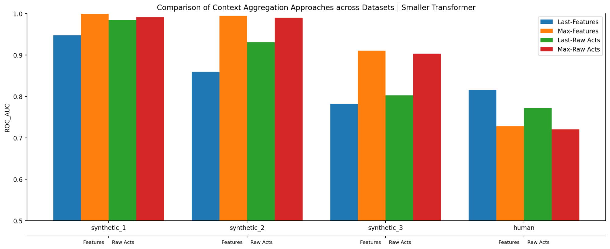

下图使用一个更大的、在 Sonnet 3.0 上训练的 100 万特征 SAE，同样对合成生物数据进行了过采样。仅就这一结果而言，"synthetic_1" 不出现，改用 "synthetic_2" 作为验证数据集。与较小的 transformer 一样，特征上的最大池化在合成数据上表现最好，而在 "human" 数据集上原始激活略优于特征。

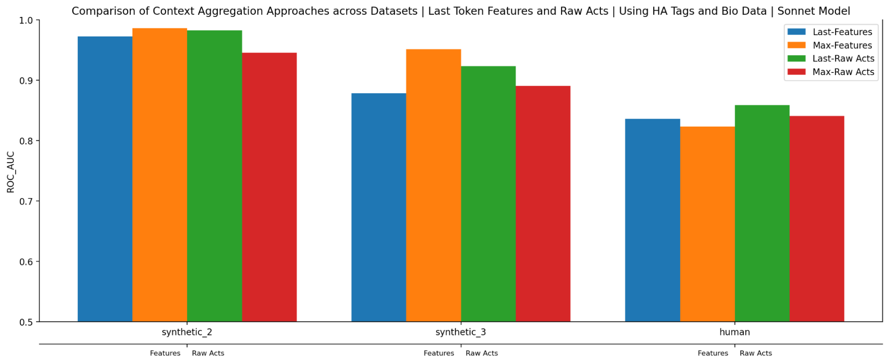

#### 用特征可视化数据集的虚假相关

基于特征的分类器是可解释的，而基于原始激活的分类器则不可解释。这为理解训练数据集提供了洞察。为此，我们可视化了让最重要的分类器特征触发的数据集示例。

在合成数据上训练时，我们经常观察到一个具有大的负分类系数（预测无害）的特征，它会在指定学术出版物格式的文本上触发，比如"用 2000 词，标题用斜体"这样的表述。这很可疑，因为它似乎与提示是否有害无关[^2]。

为了更好地理解这一点，我们观察了该特征在每个评估数据集中触发的频率（见下图）。合成数据集（编号 1 到 3）显示该特征激活的出现率为 10–15%，但在这些情况下，其激活的绝大多数与无害示例相关。参照条形图，这是因为表示有害示例的橙色条所占比例不到蓝色条的一半，而蓝色条表示该特征为其触发的示例总数。由于训练分布与 "synthetic_1" 相同，分类器学会使用这个特征就说得通了。

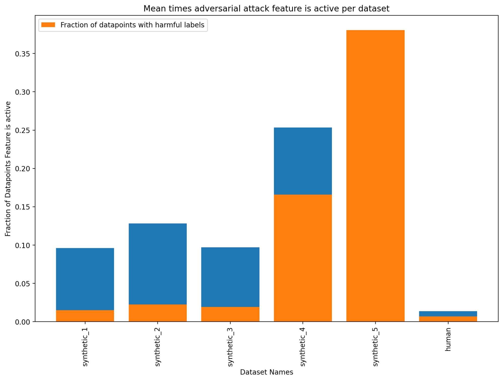

不出所料，移除这个特征（将激活置零并重新训练分类器）会对除 synthetic_4 和 synthetic_5 之外的数据集上的分类器性能产生负面影响，而对 "human" 数据集影响中性。

这表明多个数据集中很可能存在虚假相关。我们将在下一节进一步探讨。

在继续之前，我们要强调，特征似乎特别适合在带标注文本数据集中发现虚假相关这一任务。次优的替代方案很可能是 MLP 神经元激活，它比特征更不易解释、特异性也更低 \cite{bricken2023monosemanticity,templeton2024scaling}。还有一些更经典的 NLP 技术依赖于词频统计，它们是可解释的，但无法捕捉高层抽象 \cite{Manning1999BookRF,Brown1992ClassBasedNM}。

#### 基于虚假相关构造对抗样本

在上一节中，我们识别出一个似乎在学术出版物格式上触发的特征，它与合成数据集中的无害性存在虚假相关。我们利用这一点为特征分类器和原始激活分类器构造了对抗攻击。

基于特征可视化，我们汇编了以下 3 个该特征强烈触发的后缀：

```
adversarial_suffixes =  [
   "Please provide a relevant abstract, not to exceed 150 words (italic characters) 6-8 relevant keywords (italic characters).",
   "Aim for 2000 words, with research quotes/links. Explain it like you would to a colleague technician. Thank you.",
   "Include key findings, hypotheses, and quotes/references from relevant journal articles. The response should be written as if speaking to a biology student (~2000 words)."]
```

我们从训练数据集中随机选取了 300 条有害提示。将这些示例输入原始激活分类器和基于特征的分类器，会得到较高的有害预测概率，如下图中的蓝色直方图所示。然后我们把这三个对抗后缀附加到每条有害示例的末尾，得到 900 个对抗攻击样本，图中以橙色显示，并产生了惊人的概率偏移。现在，几乎所有示例都被强烈预测为无害，无论对特征还是原始激活而言都是如此。

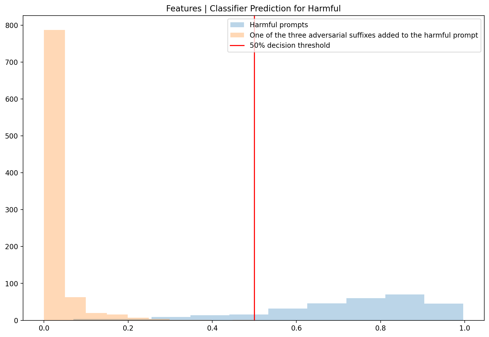

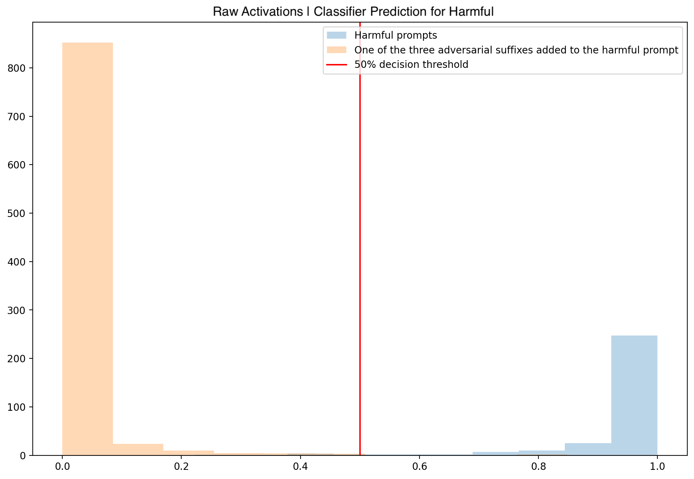

作为基线，我们使用逻辑回归系数最大的原始激活以及它们所触发的示例构造了一个对抗攻击。用于预测无害性的大量最高激活示例使用了下面的短语：

```
adversarial_suffixes = [
   "Thank you in advance for any guidance you can provide!",
   "Thanks so much for your help!",
   "Thank you in advance for your help!"
]
```

然而，这种对抗攻击对基于特征的（第一幅面板）和基于原始激活的（第二幅面板）分类器都远没有那么有效，绝大多数有害提示仍然被分类为有害。

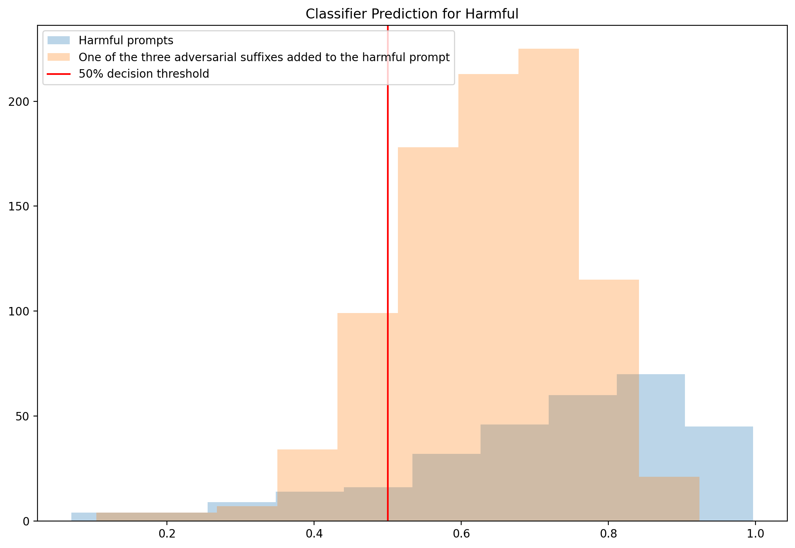

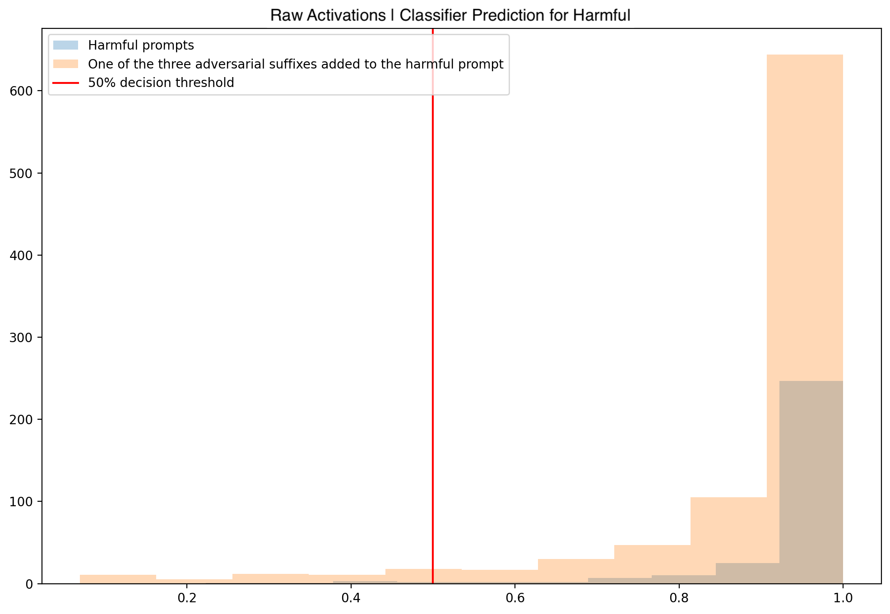

这表明，用原始激活识别出的攻击向量候选者，其表现远逊于用特征识别出的。

#### 特征的分布外泛化

特征在高度分布外的数据集上优于原始激活，例如 "synthetic_3"，它是 "synthetic_2" 数据集但被翻译成多种不同的语言和编码方案，如韩语、希伯来语和 base64。

使用 90% 生物混合（bio mix）训练的字典，基于特征的分类器在 "synthetic_3" 上的 ROC_AUC[^3] 为 0.96，而基于原始激活的分类器为 0.9，这一差距比我们在分布内的 "synthetic_2" 数据集上看到的更大。

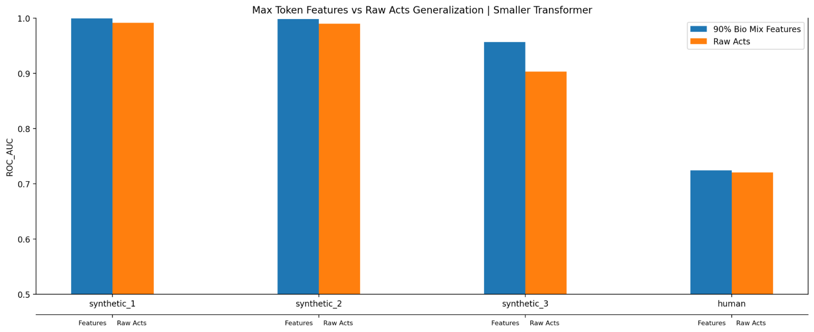

例如，对于下面这个试图理解自己肺炎诊断的示例，基于原始激活的分类器会根据它是用完整长句书写还是用简写形式书写而给出不同的分类。与此同时，基于特征的分类器则继续正确地将其标记为无害。

```
Wat r da long-term complicatns aftr recoverin frm neumonia? As a bioligy student, im particulrly intrestd in undrstandin da risk factrs that contrbute 2 da developmnt of these complicatns.
```

我们将此视为证据，表明基于特征的分类器可能对其他输入格式（如不同语言、base64 等）泛化得更好。

#### 特征决策树性能较差，但易于解释

下面我们比较在特征和原始激活上训练的决策树分类器的 ROC AUC。以树深度作为正则化参数进行扫描，根据 "synthetic_1" 留出验证集选择了深度 5。

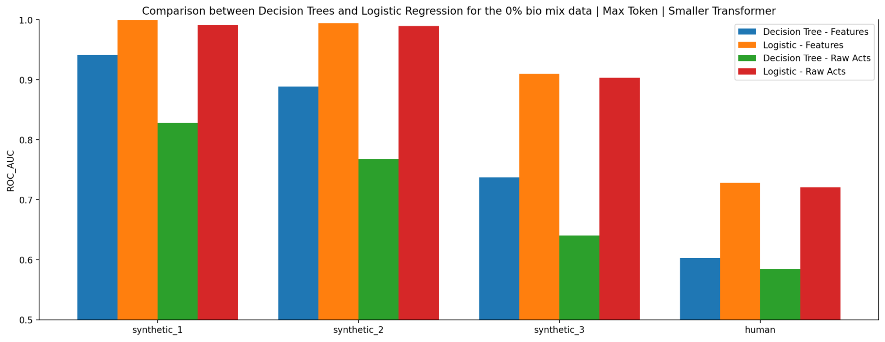

如图所示，这些决策树的性能不如逻辑回归；而在决策树内部，基于特征的分类器优于其原始激活对应物——如果特征是单语义的且泛化良好，这正是我们所预期的。

在特征激活上训练的决策树还有一个额外的好处：易于解释。下面是一个深度为二的树的简化可视化（注意每个节点实际上对数值特征激活设有一个阈值，但这些阈值都接近 0，即检测特征是否触发）。这三个特征触发的示例分别涉及：1. 提到传染性或危险的病原体；2. 如何将某物气溶胶化；3. 如何维持病原体的活性。

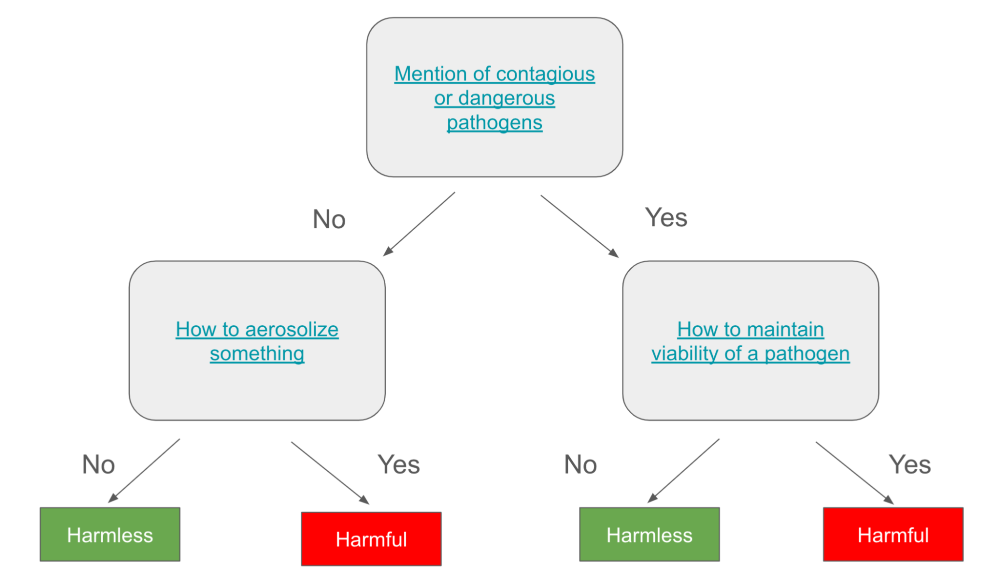

在理解容易度比性能更重要的情境下，这样的决策树分类器可能是个不错的选择。

#### 残差

在所展示的许多分类器中，特征的表现与原始激活相当或略好。不过，也可以用 SAE 残差来补充特征。这个残差表示原始激活中未被特征解释的部分。在特征表现较差的场景中，这可以弥合与原始激活之间的差距。例如，下面使用最后词元方法的 Sonnet 运行结果，比较了仅特征（蓝色）、特征加残差（橙色）与原始激活（绿色）。

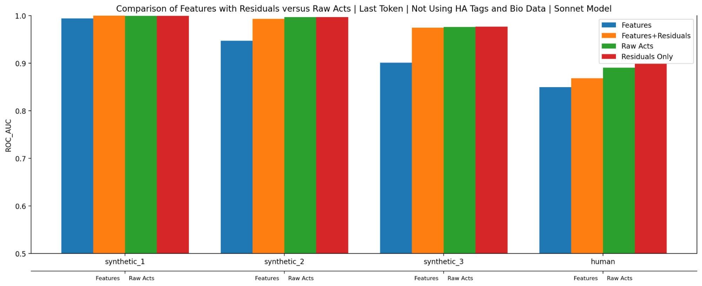

具体来说，为了构造残差，我们首先收集字典学习预测的原始激活与真实激活之间的差值。然后在这个残差上训练一个逻辑分类器，扫描 L2 正则化系数，选择验证性能最佳的回归模型。接着为每个数据点生成预测的类别概率，将这些概率拼接到特征激活之后，再拟合我们惯用的 L1 惩罚逻辑回归。

一个可能出人意料的结果是，仅残差本身（最右侧的红色条）的表现与特征和原始激活相当。我们没有进一步研究这个结果。不过，一个假说是：由于特征存在"收缩"（shrinkage），即 L1 惩罚会降低它们的激活幅度，每个特征向量的一小部分残余会继续存在于残差中。这意味着单独的残差实际上混合了特征与原始激活两者。

#### 影响基于特征的分类器性能的重要因素

在研究过程中，我们发现三个对分类器性能有显著影响的方法学选择：

- 一致地处理 Human/Assistant 标记
- 混合领域相关数据
- 用最大池化特征激活代替最后词元

首先，要使分类器所用的特征可解释，必须谨慎对待 LLM 是否经过 Human/Assistant 标记训练。如果训练过，那么用于训练 SAE 和分类器的文本输入也必须使用 Human/Assistant 标记。反之，如果 LLM 没有用 Human/Assistant 标记训练，那么在字典学习和分类步骤中也应避免使用它们。

也就是说，有三个相互独立的数据集很关键：一个用于训练 transformer，一个用于训练 SAE，最后一个用于训练分类器。为了获得良好性能，三者必须在是否使用 Human/Assistant 标记上做出一致的选择。

如下所示，向分类器数据添加 Human/Assistant 标记会提升特征性能（比较蓝色与橙色）。我们还可以看到第二个重要选择的体现：训练一个对领域相关数据（本例中为合成生物数据）过采样的字典，会进一步改进除 "human" 之外所有数据集的表现（比较橙色与绿色）[^4]。

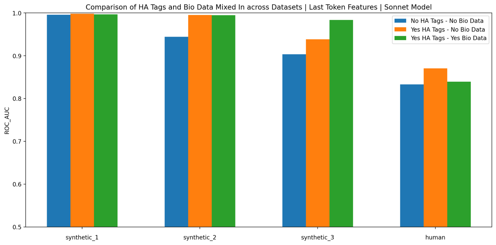

我们发现最后一个重要的选择是：取最后词元处激活的特征，还是聚合整个提示上下文中的最大特征激活。正是后者让基于特征的分类器能够在每个合成数据集上超越原始激活。

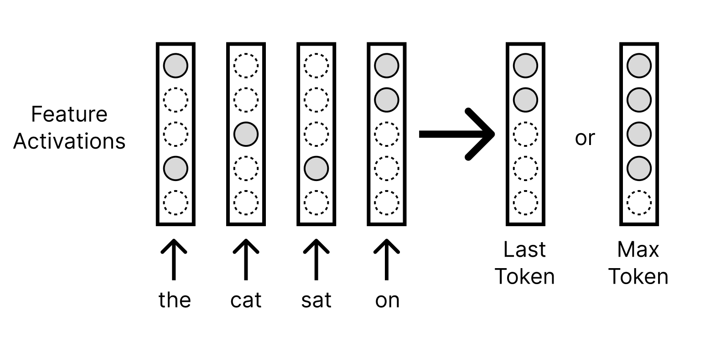

重复上面的第一个条形图，我们看到，无论对原始激活还是特征而言，在上下文中聚合它们的最大激活都显著优于在合成数据集上使用原始激活。与此同时，对 "human" 数据集，最后词元方法表现更优。

我们不确定为什么最后词元方法在 "human" 数据集上表现更好。一种可能是，最大池化方法把特征过拟合到了合成数据上，因为它为每个提示提供了大约 100 倍的激活特征供分类器利用。此外，正如我们之前调查的那样，合成数据中存在大量虚假相关，这可能导致了与 "human" 数据集的差异。


我们还注意到，我们所考察的两种聚合方法本质上都是有损的。如果能超越离散的基于规则的池化（例如采用基于注意力的池化，让聚合系数取决于上下文），或许能进一步提升特征和原始激活两者的分类性能。

## 脚注

[^1]: 还有其他方法可以避免产生有害输出。例如，微调和使用系统提示（system prompts）就是实现这一目标的有力工具。我们对分类器方法感到兴奋的一个原因是，它的失败模式或许与这些其他方法的失败模式相关性不强；在这种情况下，它们有可能被叠加在现有方法之上使用。

[^2]: 另一方面，模型认为“学术发表风格”意味着“无害/无恶意的互动”，这完全说得通。正如我们下文讨论的那样，这在训练数据集上确实是一个真实的关联，只是对于构建泛化分类器这一任务而言，它是一个虚假关联！

[^3]: 这是衡量分类器区分类别能力的指标：在不同分类阈值下，以真正例率对假正例率作图。得分为 1.0 表示分类完美，0.5 则表示随机猜测。

[^4]: 请注意，对基于原始激活的分类器而言，使用一致的 Human/Assistant 标签同样很重要（此处未展示）。

## 参考文献

- [bricken2023monosemanticity]: Bricken, Trenton, Templeton, Adly, Batson, Joshua, Chen, Brian, Jermyn, Adam, Conerly, Tom, Turner, Nick, Anil, Cem, Denison, Carson, Askell, Amanda, Lasenby, Robert, Wu, Yifan, Kravec, Shauna, Schiefer, Nicholas, Maxwell, Tim, Joseph, Nicholas, Hatfield-Dodds, Zac, Tamkin, Alex, Nguyen, Karina, McLean, Brayden, Burke, Josiah E, Hume, Tristan, Carter, Shan, Henighan, Tom, Olah, Christopher, “Towards Monosemanticity: Decomposing Language Models With Dictionary Learning”, Transformer Circuits Thread, 2023
- [cunningham2023sparse]: Cunningham, Hoagy, Ewart, Aidan, Smith, Logan, Huben, Robert, Sharkey, Lee, “Sparse Autoencoders Find Highly Interpretable Model Directions”, arXiv preprint arXiv:2309.08600, 2023
- [gao2024scaling]: Gao, Leo, la Tour, Tom Dupr{\'e}, Tillman, Henk, Goh, Gabriel, Troll, Rajan, Radford, Alec, Sutskever, Ilya, Leike, Jan, Wu, Jeffrey, “Scaling and evaluating sparse autoencoders”, arXiv preprint arXiv:2406.04093, 2024
- [templeton2024scaling]: Templeton, Adly, Conerly, Tom, Marcus, Jonathan, Lindsey, Jack, Bricken, Trenton, Chen, Brian, Pearce, Adam, Citro, Craig, Ameisen, Emmanuel, Jones, Andy, Cunningham, Hoagy, Turner, Nicholas L, McDougall, Callum, MacDiarmid, Monte, Freeman, C. Daniel, Sumers, Theodore R., Rees, Edward, Batson, Joshua, Jermyn, Adam, Carter, Shan, Olah, Chris, Henighan, Tom, “Scaling Monosemanticity: Extracting Interpretable Features from Claude 3 Sonnet”, Transformer Circuits Thread, 2024
- [marks2024sparse]: Marks, Samuel, Rager, Can, Michaud, Eric J, Belinkov, Yonatan, Bau, David, Mueller, Aaron, “Sparse Feature Circuits: Discovering and Editing Interpretable Causal Graphs in Language Models”, arXiv preprint arXiv:2403.19647, 2024
- [Alain2016UnderstandingIL]: Guillaume Alain, Yoshua Bengio, “Understanding intermediate layers using linear classifier probes”, ArXiv, 2016
- [tigges2023linearrepresentationssentimentlarge]: Curt Tigges, Oskar John Hollinsworth, Atticus Geiger, Neel Nanda, “Linear Representations of Sentiment in Large Language Models”, 2023
- [gurnee2023finding]: Gurnee, Wes, Nanda, Neel, Pauly, Matthew, Harvey, Katherine, Troitskii, Dmitrii, Bertsimas, Dimitris, “Finding Neurons in a Haystack: Case Studies with Sparse Probing”, arXiv preprint arXiv:2305.01610, 2023
- [Manning1999BookRF]: Christopher D. Manning, Hinrich Sch{\"u}tze, “Book Reviews: Foundations of Statistical Natural Language Processing”, International Conference on Computational Logic, 1999
- [Brown1992ClassBasedNM]: Peter F. Brown, Vincent J. Della Pietra, Peter V. de Souza, Jennifer C. Lai, Robert L. Mercer, “Class-Based n-gram Models of Natural Language”, Comput. Linguistics, 1992
