# A Mathematical Framework for Transformer Circuits

*2021 年 12 月 22 日 · 原文: https://transformer-circuits.pub/2021/framework/index.html*

---

Transformer\cite{vaswani2017attention} 语言模型是一项新兴技术，正获得日益广泛的现实应用，例如 GPT-3 \cite{brown2020language}、LaMDA \cite{LaMDA}、Codex \cite{chen2021evaluating}、Meena \cite{adiwardana2020towards}、Gopher \cite{rae2021scaling} 等系统。然而，随着这些模型的规模不断增大，其开放性与高容量带来了日益增多的意外行为，有时甚至是有害行为。即使在大模型训练完成多年之后，创建者和用户仍会不断发现模型此前不为人知的能力——其中也包括有问题的行为。

解决这些问题的一条途径是机制可解释性（mechanistic interpretability）：尝试逆向工程 transformer 执行的详细计算，就像程序员试图把复杂的二进制程序逆向工程为人类可读的源代码一样。如果这成为可能，它或许能为解释现有的安全问题、识别新的安全问题提供一种更系统的方法，甚至可能预见那些尚未建成的强大未来模型的安全问题。此前，[Distill Circuits 系列文章](https://distill.pub/2020/circuits/) \cite{cammarata2020thread} 项目曾尝试逆向工程视觉模型，但迄今为止，还没有针对 transformer 或语言模型的同类项目。

在本文中，我们尝试朝着逆向工程 transformer 的方向迈出初步的、非常基础的一步。考虑到现代语言模型惊人的复杂度和规模，我们发现从尽可能简单的模型入手、再逐步推进是最有成效的做法。我们的目标是发现简单的算法模式、母题（motif）或框架，以便日后将其应用于更大、更复杂的模型。具体而言，本文将研究不超过两层、且只包含注意力块的 transformer——这与 GPT-3 这样的大型现代 transformer 形成鲜明对比：GPT-3 有 96 层，注意力块与 MLP 块交替排列。

我们发现，用一种新的、但在数学上等价的视角来概念化 transformer 的运作方式，就能理解这些小模型，并对它们的内部运作获得可观的认识。尤其值得注意的是，被我们称为"归纳头"（induction head）的特定注意力头可以解释这些小模型中的上下文学习（in-context learning），而且这种头只会在至少包含两层注意力层的模型中出现。我们还会展示这些头在具体数据上实际运作的一些例子。

在这第一篇论文中，我们不打算把我们的见解应用于更大的模型，但在[后续论文](https://transformer-circuits.pub/2022/in-context-learning-and-induction-heads/index.html)中，我们将表明，我们理解 transformer 的数学框架以及归纳头的概念，对于更大、更贴近现实的模型至少仍有部分适用——尽管距离完全逆向工程这类模型，我们还有很长的路要走。

### 结果摘要

##### 逆向工程结果

为了探索逆向工程 transformer 所面临的挑战，我们对几个玩具模型（toy model）——即纯注意力（attention-only）模型——进行了逆向工程，并由此发现：

- 零层 transformer 对二元语法（bigram）统计进行建模。二元语法表可以直接从权重中读取。
- 一层纯注意力 transformer 是二元语法与"跳跃三元语法"（skip-trigram）（形如"A… B C"的序列）模型的集成。二元语法表和跳跃三元语法表可以直接从权重中读取，无需运行模型。这些跳跃三元语法可能具有惊人的表达能力，其中甚至包括实现一种非常简单的上下文学习。
- 两层纯注意力 transformer 可以利用注意力头的组合来实现复杂得多的算法。这些组合算法同样可以直接从权重中检测出来。值得注意的是，两层模型通过注意力头组合来创造"归纳头"——一种非常通用的上下文学习算法。[^1]
- 一层与两层纯注意力 transformer 执行上下文学习时使用的算法截然不同。两层模型的注意力头使用性质上更复杂的推理期算法——尤其是我们称之为归纳头的一种特殊注意力头——来执行上下文学习。这构成了一个重要的转折点，对更大的模型同样具有意义。

##### 概念要点

我们发现，transformer 架构的许多微妙细节要求我们以与 InceptionV1 Circuits 工作 \cite{cammarata2020thread} 相当不同的方式来着手逆向工程。我们将在下面的各节中逐一展开这些要点，这里先做简要总结；等讲到相应章节时，我们还会详细阐述这里引入的大量术语。（需要说明的是，我们并不打算声称这些要点中有任何新颖之处；其中许多已在其他论文中以显式或隐式的方式出现过。）

- 注意力头可以被理解为独立的操作，每个头输出一个结果并把它加进残差流（residual stream）。出于计算效率的考虑，注意力头常被描述为另一种"拼接后相乘"（concatenate and multiply）的形式，但两者在数学上等价。
- 纯注意力模型可以写成一组可解释的端到端函数之和，这些函数把词元（token）映射为 logits（对数几率）的变化。这些函数对应于穿过模型的"路径"，并且在固定注意力模式时是线性的。
- transformer 拥有极其丰富的线性结构。仅通过拆解求和、把矩阵链相乘，就能学到很多东西。
- 注意力头可以理解为包含两个大体上独立的计算：QK（查询-键）电路负责计算注意力模式，OV（输出-值）电路负责计算每个词元在被关注到时如何影响输出。
- 键、查询和值向量可以被视为低秩矩阵 $W_Q^TW_K$ 与 $W_OW_V$ 计算过程中的中间结果。不借助它们来描述 transformer 有时反而更有用。
- 注意力头的组合极大地提升了 transformer 的表达能力。注意力头有三种不同的组合方式，分别对应于键、查询和值。键组合、查询组合与值组合截然不同。
- transformer 的所有组件（词元嵌入、注意力头、MLP 层和解嵌入）通过读写残差流的不同子空间来相互通信。与其直接分析残差流向量，不如把残差流分解为所有这些不同的通信通道——它们分别对应于穿过模型的路径。

### Transformer 概述

在尝试逆向工程 transformer 之前，简要回顾一下 transformer 的高层结构、并说明我们如何看待它们，会很有帮助。

在许多情况下，我们发现用等价但非标准的方式重新表述 transformer 很有帮助。机制可解释性要求我们把模型拆解为人类可解释的部件，而重要的第一步，是找到最容易对模型进行推理的表示形式。现代深度学习非常强调计算效率——这当然是有充分理由的！——我们对模型的数学描述也常常反映出人们在编写高效运行代码时的取舍。但当同一计算存在许多等价表示时，最易于人类解释的表示与计算效率最高的表示很可能并不相同。

回顾 transformer 也能让我们在术语上达成一致——术语有时会因人而异。我们还会在这个过程中引入一些记号；由于这些记号会在多个章节中使用，我们将在记号附录中详细描述全部记号，作为读者的简明参考。

#### 模型简化

为了以最纯粹的形式展示本文的思想，我们聚焦于经过若干简化处理的"玩具 transformer"。

在本文的大部分篇幅中，我们会做一个非常实质性的改动：聚焦于没有 MLP 层的"纯注意力"（attention-only）transformer。这是对 transformer 架构的一种极为剧烈的简化。我们的动机部分在于：含有注意力头的电路带来了 Distill circuits 工作未曾面临的新挑战，而单独考察这些电路可以让我们对这些问题的处理格外优雅。但另一个原因也很简单：迄今为止，我们在理解 MLP 层方面取得的成功要少得多。在同时包含注意力层和 MLP 层的常规 transformer 中，有许多主要由注意力头介导的电路可供我们研究，其中一些看起来非常重要，但 MLP 部分一直很难取得进展。这是我们工作的一个重大弱点，我们计划在未来着力解决。尽管如此，我们仍会在后面的章节中讨论一些带 MLP 层的 transformer。

我们还做了几处我们认为更表面化的改动，主要是为了清晰和简洁。我们不讨论偏置（bias），但带偏置的模型总可以模拟为不带偏置的模型——只需把偏置折入权重，并创造一个恒为 1 的维度。此外，纯注意力 transformer 中的偏置大多会在相乘过程中消去，其功能等价于 logits 上的偏置。我们也忽略层归一化。显式地考虑层归一化会给问题增加不少复杂度，而且在不考虑可变缩放的情况下，它可以并入相邻的权重。我们还预期，除去一些实现上的麻烦，层归一化可以用批归一化替代（批归一化可以完全折入相邻的参数）。

#### 高层架构

transformer 语言模型有多种变体。我们聚焦于自回归的、仅解码器（decoder-only）的 transformer 语言模型，例如 GPT-3。（原始的 transformer 论文采用了一种特殊的编码器-解码器结构以支持翻译，但许多现代语言模型并不包含这种结构。）

transformer 以词元嵌入开始，随后是一系列"残差块"，最后是词元解嵌入。每个残差块由一个注意力层和一个紧随其后的 MLP 层组成。注意力层和 MLP 层各自通过一次线性投影从残差流中"读取"输入，然后通过把一次线性投影加回去，将结果"写入"残差流。每个注意力层由多个并行运作的头组成。

#### 虚拟权重与作为通信通道的残差流

transformer 高层架构的主要特点之一是：每一层都把自身的结果加进我们所说的"残差流"[^2]。残差流就是此前所有层的输出与原始嵌入之和。我们通常把残差流视为一个通信通道，因为它本身不进行任何处理，所有层都通过它进行通信。

残差流具有深刻的线性结构。[^3] 每一层在开始时都会执行一次任意的线性变换，从残差流中"读入"信息[^4]，并在把输出"写回"残差流之前执行另一次任意的线性变换。残差流这种线性、可加的结构有许多重要的推论。一个基本的推论是：残差流没有"特权基"；我们可以通过旋转所有与它交互的矩阵来旋转它，而不改变模型行为。

##### 虚拟权重

残差流的线性还有一个特别有用的推论：通过把任意两层经由残差流的相互作用相乘展开，可以想象存在隐式的"虚拟权重"（virtual weights）直接连接任意一对层（即使中间隔着许多其他层）。这些虚拟权重是一层的输出权重与另一层的输入权重[^5]的乘积（即 $W_{I}^2W_{O}^1$），描述后一层在多大程度上读入了前一层写入的信息。

##### 子空间与残差流带宽

残差流是一个高维向量空间。在小模型中，它可能有几百维；在大模型中，可以达到数万维。这意味着层可以把信息存储在不同的子空间中，从而向不同的层发送不同的信息。这一点对注意力头尤为重要，因为每个头都在相对较小的子空间（通常是 64 或 128 维）上运作，很容易写入完全不相交的子空间而彼此互不干扰。

信息一旦写入，就会一直保留在子空间中，除非其他层主动将其删除。从这个角度看，残差流的维度有点像"内存"或"带宽"。原始词元嵌入和解嵌入大多只与相对较小的一部分维度交互。[^6] 这使大部分维度"空闲"出来，供其他层存储信息。

看起来我们应该预期残差流带宽会被争抢得非常激烈！"计算维度"（如神经元和注意力头结果的维度）的数量通常远远超过残差流用于传输信息的维度数。仅一个 MLP 层，其神经元数量就通常是残差流维度的四倍。因此，举例来说，在一个 50 层的 transformer 中，第 25 层的残差流前方有 100 倍于自身维度的神经元，后方同样有 100 倍于自身维度的神经元，它要设法以叠加的方式与它们通信！我们把这样的张量称为"瓶颈激活"，并预期它们会异常难以解释。（这也是我们之所以尝试用虚拟权重把残差流中并行的不同通信流拆解开、而不是直接研究它的主要原因。）

或许正是因为残差流带宽的需求如此之高，我们观察到一些迹象表明，某些 MLP 神经元和注意力头可能扮演着某种"内存管理"的角色：读入其他层写入残差流维度的信息，再写出其相反数，从而清除这些维度。[^7]

#### 注意力头是独立且可加的

如上所述，我们把 transformer 的注意力层视为若干完全独立的注意力头 $h\in H$，它们完全并行地运作，各自把输出加回残差流。但这并不是 transformer 层的通常呈现方式，两者等价这一点也可能并不明显。

在 Vaswani 等人关于 transformer 的原始论文 \cite{vaswani2017attention} 中，注意力层的输出被描述为：把各个头的结果向量 $r^{h_1}, r^{h_2},...$ 堆叠起来，再乘以一个输出矩阵 $W_O^H$。我们把 $W_O^H$ 按每个头拆分为大小相等的分块 $[W_O^{h_1}, W_O^{h_2}...]$，于是可以观察到：

$$W_O^H \left[\begin{matrix}r^{h_1}\\r^{h_2}\\... \end{matrix}\right] ~\approx~ \left[W_O^{h_1},~ W_O^{h_2},~ ... \right]\cdot\left[\begin{matrix}r^{h_1}\\r^{h_2}\\...\end{matrix}\right] ~\approx~ \sum_i W_O^{h_i} r^{h_i}$$

这揭示出它与如下做法等价：独立地运行各个头，把每个头的结果乘以各自的输出矩阵，再把这些结果加进残差流。拼接（concatenate）式定义之所以常常更受青睐，是因为它能合并成一次规模更大、计算效率更高的矩阵乘法。但为了从理论上理解 transformer，我们更倾向于把它们看作独立可加的。

#### 注意力头即信息移动

但如果注意力头是独立运作的，它们到底在做什么？注意力头的基本动作是移动信息：它们从一个词元的残差流中读取信息，再把它写入另一个词元的残差流。本小节最核心的观察是：从哪些词元移动信息，与「读取」哪些信息来移动、以及信息如何被「写入」目的地，这两件事是完全可分离的。

要看清这一点，用非标准的方式书写注意力会很有帮助。给定一个注意力模式，计算某个注意力头的输出通常被描述为三个步骤：

1. 从残差流中计算每个词元的值向量（$v_i = W_V x_i$）。
1. 按照注意力模式对值向量做线性组合，计算出「结果向量」（$r_i = \sum_j A_{i,j} v_j$）。
1. 最后，计算该头对每个词元的输出向量（$h(x)_i = W_O r_i$）。[^8]

这些步骤中的每一步都可以写成矩阵乘法：那我们为什么不把它们合并成一步呢？如果你把 $x$ 看作一个二维矩阵（每个词元对应一个向量），我们其实是在从不同的侧面对它做乘法：$W_V$ 和 $W_O$ 乘在「逐词元向量」那一侧，而 $A$ 乘在「位置」那一侧。张量能为我们描述这种矩阵之间的映射提供更自然的语言（如果你不熟悉张量积记号，我们在记号附录中附了一段简短的介绍）。一个可能有帮助的动机是：我们想要表达的是从矩阵到矩阵的线性映射：$[n_\text{context},~ d_\text{model}] ~\to~ [n_\text{context},~ d_\text{model}]$。数学家把这样的线性映射称为「(2,2)-张量」（它们把两个输入维度映射到两个输出维度）。因此，张量是表达这种变换的自然语言。

利用张量积，我们可以把施加注意力的过程描述为：

$h(x)$$\approx$$(\text{Id} \otimes W_O)~~\cdot~~$对每个词元投影出结果向量$(h(x)_i = W_O r_i)$$~$$(A \otimes \text{Id})~~\cdot~~~$*跨词元*混合值向量，计算出结果向量$(r_i = \sum_j A_{i,j} v_j)$$~$$(\text{Id} \otimes W_V)~~\cdot~~~$对每个词元计算值向量$(v_i=W_V x_i)~~$$x$

应用混合积性质并消去恒等项，得到：

$h(x) \approx$$(A ~~\otimes~~ W_O W_V) ~~~\cdot~~~~~~$$A$ 跨词元混合，而 $W_OW_V$ 独立作用于每个向量。$x$

那注意力模式呢？通常的做法是：先计算键 $k_i = W_K x_i$，再计算查询 $q_i = W_Q x_i$，然后通过每个键向量与查询向量的点积来计算注意力模式：$A = \text{softmax}(q^T k)$。但我们完全可以一步完成，无需借助键和查询：$A = \text{softmax}(x^T W_Q^T W_K x)$。

值得注意的是，虽然这种表述在数学上等价，但真要按这种方式实现注意力（即直接乘以 $W_O W_V$ 和 $W_Q^T W_K$）会极其低效！

##### 关于注意力头的观察

把注意力头改写成这种形式的一大好处是，它会浮现出许多此前可能难以观察到的结构：

- 注意力头把信息从一个词元的残差流移动到另一个词元。

- 由此得出一个推论：残差流的向量空间——它通常被解释为「上下文词嵌入」——一般会包含一些线性子空间，对应从其他词元复制来的信息，而非直接关于当前词元的信息。

- 一个注意力头实际上是在施加两个线性运算——$A$ 和 $W_OW_V$——它们作用于不同的维度，彼此独立。

- $A$ 决定信息从哪个词元被移走、又移到哪个词元。
- $W_O W_V$ 决定从源词元读取哪些信息，以及如何把它写入目标词元。[^9]

- $A$ 是这个方程中唯一的非线性部分（它由 softmax 计算而来）。这意味着，一旦固定注意力模式，注意力头执行的就是线性运算。这也意味着，即便不固定 $A$，注意力头在某种意义上也是「半线性」的，因为逐词元的线性运算是恒定不变的。
- $W_Q$ 和 $W_K$ 总是协同作用，从不独立运作。同样地，$W_O$ 和 $W_V$ 也总是协同作用。

- 尽管它们被参数化为两个独立的矩阵，$W_O W_V$ 和 $W_Q^T W_K$ 却始终可以被分别视为单个低秩矩阵。
- 键、查询和值向量在某种意义上只是表面产物：它们是计算这些低秩矩阵时产生的中间副产品。我们完全可以对低秩矩阵的两个因子重新参数化，得到不同的向量，但功能依然完全相同。
- 由于 $W_O W_V$ 和 $W_Q^T W_K$ 总是协同作用，我们喜欢为这两个组合矩阵定义专门的记号：$W_{OV} = W_O W_V$，$W_{QK} = W_Q^T W_K$。

- 注意力头之间的乘积行为与注意力头本身非常相似。根据分配律，$(A^{h_2}\otimes W_{OV}^{h_2}) \cdot (A^{h_1}\otimes W_{OV}^{h_1})$ $= (A^{h_2}A^{h_1})\otimes(W_{OV}^{h_2}W_{OV}^{h_1})$。这个乘积的结果在功能上等价于一个注意力头：它的注意力模式是两个头的组合 $A^{h_2}A^{h_1}$，输出-值矩阵是 $W_{OV}^{h_2}W_{OV}^{h_1}$。我们把这些头称为「虚拟注意力头」（virtual attention heads），后面会进一步深入讨论。

### 零层 Transformer

观看与本小节内容相关的视频：[0 层理论](https://www.youtube.com/watch?v=V3NQaDR3xI4&list=PLoyGOS2WIonajhAVqKUgEMNmeq3nEeM51&index=1)

在转向更复杂的模型之前，简要考察一下「零层」transformer 是很有用的。这样的模型接收一个词元，把它嵌入，再解嵌入以产生预测下一个词元的 logits：

$T \approx W_U W_E$

由于模型无法从其他词元移动信息，它只能根据当前词元预测下一个词元。这意味着 $W_U W_E$ 的最优行为是逼近二元语法的对数似然。[^10]

这一点对 transformer 具有更普遍的意义。$W_U W_E$ 形式的项会出现在每个 transformer 的展开方程中，对应「直接路径」（direct path）：词元嵌入沿残差流径直流向解嵌入，不经过任何层。它唯一能影响的只有二元语法对数似然。由于模型的其他部分也会预测二元语法对数似然的一部分，在更大的模型中，这一项并不会精确地表示二元语法统计量，但它确实代表了一种「残差」。特别是，$W_U W_E$ 项似乎常常有助于表示那些无法由更一般的语法规则描述的二元语法统计量，例如「Barack」之后常常跟着「Obama」这一事实。[^11]

### 单层纯注意力 Transformer

观看与本小节内容相关的视频：[1 层理论](https://www.youtube.com/watch?v=7crsHGsh3p8&list=PLoyGOS2WIonajhAVqKUgEMNmeq3nEeM51&index=3)、[1 层结果](https://www.youtube.com/watch?v=ZBlHFFE-ng8&list=PLoyGOS2WIonajhAVqKUgEMNmeq3nEeM51&index=4)。

我们认为，单层纯注意力 transformer 可以理解为二元语法模型与若干「跳跃三元语法」模型的集成（它们影响形如「A… BC」的序列的概率）。[^12] 直觉上，这是因为每个注意力头都可以选择性地从当前词元（「B」）关注到之前的某个词元（「A」），并复制信息来调整各个可能的下一个词元（「C」）的概率。

本节的目标是严格证明这一对应关系，并演示如何把 transformer 的原始权重转换成可解释的跳跃三元语法概率调整表。

#### 路径展开技巧

回想一下，单层纯注意力 transformer 由以下部分组成：一个词元嵌入层，紧接着一个注意力层（该层独立地应用各个注意力头），最后是一个解嵌入层：

利用张量记号和我们先前推导出的注意力头替代表示，我们可以把 transformer 表示为三项的乘积。

我们的关键技巧就是直接把这个乘积展开。这把乘积（其中每一项对应一层）变成了求和（其中每一项对应一条端到端路径）。

我们认为这些端到端路径项中的每一项都易于理解、可以独立地推理，并通过加法组合共同构成模型行为。

直接路径项 $\text{Id} \otimes W_U W_E$ 在我们考察零层 transformer 时也出现过。由于它不跨位置移动信息（这正是 $\text{Id} \otimes …$ 所表示的含义！），它唯一能贡献的就是二元语法统计量，并会填补其他项在该处留下的空缺。

更有意思的是注意力头项。

#### 把注意力头项拆分为查询-键电路与输出-值电路

对每个注意力头 $h$，我们都有一个项 $A^h \otimes (W_UW_{OV}^hW_E)$，其中 $A^h=$ $\text{softmax}\left( t^T \cdot W_E^T W_{QK}^h W_E \cdot t \right)$。我们该如何把这些项对应到模型行为上？顺带一问：为什么我们的方程里会出现这些特定的矩阵乘积？

需要注意的关键是：这些项由两个可分离的运算组成，其核心是两个 $[n_\text{vocab},~ n_\text{vocab}]$ 矩阵：

- $W_E^T W_{QK}^h W_E$ —— 我们把这个矩阵称为「查询-键（QK）电路」。它为每一对查询词元与键词元提供注意力分数；也就是说，每个条目描述某个查询词元「想要」关注某个键词元的程度。
- $W_UW_{OV}^hW_E$ —— 我们把这个矩阵称为「输出-值（OV）电路」。它描述某个词元一旦被关注，将如何影响输出的 logits。

为了直观地理解这些乘积，把它们想象成穿过模型的路径、以词元为起点和终点，会很有帮助。QK 电路是这样形成的：追踪查询向量和键向量的计算，一路到达它们的注意力头，在那里二者做点积，构成一个双线性型。OV 电路则是通过追踪值向量的计算路径、并把它一路延续到 logits 而形成的。

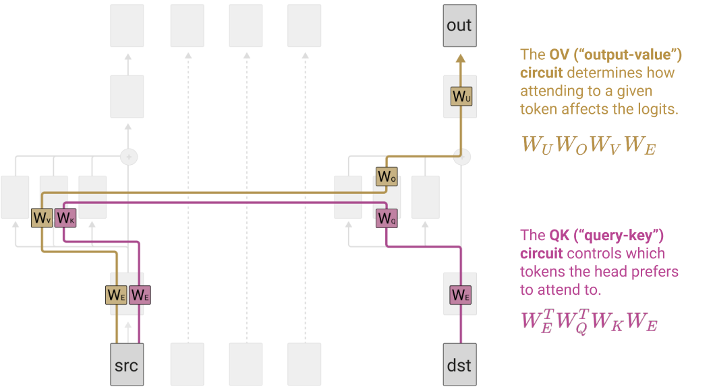

注意力模式是源词元与目标词元两者的函数[^13]；但一旦某个目标词元决定了要以多大程度关注某个源词元，对输出的影响就只取决于那个源词元。也就是说，如果多个目标词元以相同的程度关注同一个源词元，那么该源词元对预测输出词元的 logits 会产生相同的影响。

##### OV 与 QK 的独立性（冻结注意力模式的技巧）

分开考虑 OV 电路和 QK 电路会非常有用，因为它们各自都是我们能够理解的函数（作用于我们熟悉的矩阵上的线性或双线性函数）。

但把它们分开考虑真的有依据吗？一个可能有帮助的思想实验是：想象把模型运行两次。第一次运行时，你收集每个头的注意力模式——这完全只取决于 QK 电路。[^14] 第二次运行时，你用第一次收集到的「冻结」注意力模式替换原来的注意力模式。这样你就得到了一个函数，其中 logits 是各词元的线性函数！我们认为这是思考 transformer 的一种非常有力的方式。

#### 解释为跳跃三元语法

机制可解释性的核心挑战之一，是通过把神经网络参数置于上下文中，使它们变得有意义（参见 Voss 等人在 [Visualizing Weights](https://distill.pub/2020/circuits/visualizing-weights/) 中的讨论 \cite{voss2021visualizing}）。通过把 OV 电路和 QK 电路乘开，我们成功做到了这一点：神经网络参数现在变成了作用于词元上的简单线性或双线性函数。QK 电路决定当前的「目标」（destination）词元会回看哪个「源」（source）词元、并从那里复制信息；OV 电路则描述这对下一个词元的「输出」（out）预测产生了怎样的影响。三个词元合在一起，构成一个形如 `[source]... [destination][out]` 的「跳跃三元语法」，其中的「out」被修改。

需要强调，这并不意味着解释工作变得轻而易举。首先，得到的矩阵极其庞大（我们的词表约有 50,000 个词元，因此单个展开后的 OV 矩阵就约有 25 亿个条目）；我们揭示出，单层纯注意力模型原来是一个被压缩的中文房间，留给我们的是一大堆卡片。其次，理解作用于相关变量上的广义线性模型的权重，还会遇到各种常见问题，包括变量之间的可互换性（fungibility）。例如，某个注意力头的权重可能为零，因为另一个注意力头会关注同一个词元、扮演它本该扮演的角色。最后，还有一个技术问题：QK 权重在不同的查询向量之间不可比，关于如何对它们归一化，也没有明确的标准答案。

尽管如此，我们确实把 transformer 放进了所有参数都被置于上下文、可以被理解的形态中。而且尽管有这些微妙之处，我们仍然可以直接从 OV 与 QK 的联合矩阵中读出跳跃三元语法。特别是，在这些矩阵中搜寻大条目，会揭示出许多有趣的行为。

在接下来的小节中，我们会精选一些有趣的跳跃三元语法，并展示它们如何嵌入在 QK/OV 电路中。不过，若想查看多个模型中最大条目的完整、非挑选样本，可以点击以下链接：

- [**大型 QK/OV 条目——12 个注意力头，d_head=64**](https://transformer-circuits.pub/2021/framework/head_dump/small_a.html)
- [**大型 QK/OV 条目——32 个注意力头，d_head=128**](https://transformer-circuits.pub/2021/framework/head_dump/larger.html)

##### 复制 / 原始的上下文学习

查看这些矩阵时，最引人注目的发现之一是：单层模型中大多数注意力头都把极大比例的容量用在了复制上。OV 电路的设置使得：词元一旦被注意力头注意到，就会提高该词元自身的概率，并在较小程度上提高相似词元的概率。QK 电路则只回看那些有可能成为下一个词元的词元。于是，词元被复制——但只会被复制到二元语法式统计认为它合理出现的位置。

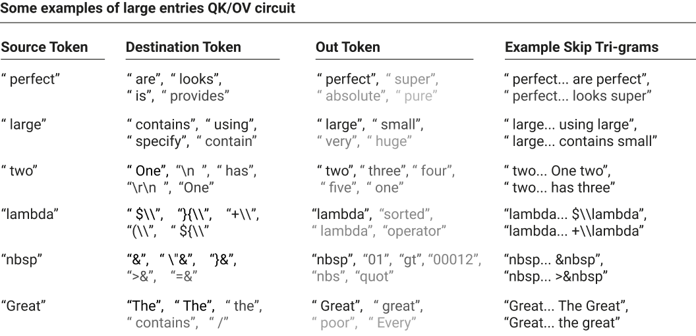

在上面的例子中，我们固定一个给定的源词元，然后查看对应的最大 QK 条目（即目标词元，destination token）和最大 OV 条目（即输出词元，out token）。源词元是特意挑选出来以展示有趣行为的，而目标词元和输出词元则取矩阵中的最大条目（除非某些条目被显式地用省略号跳过）；它们的颜色深浅对应于其在该矩阵中的数值强度。

大多数例子都一目了然，但有两个需要解释：第四个例子（包含 `lambda… $\lambda$` 这样的跳跃三元语法）似乎是模型在学习 LaTeX；第五个例子（包含 `nbsp… >&nbsp` 这样的跳跃三元语法）似乎是模型在学习 HTML 转义序列。

请注意，这些例子大多属于复制；复制行为似乎非常普遍。

我们还观察到更微妙的复制形式。其中特别有意思的一种与 transformer 的分词（tokenization）方式有关。分词器通常把空格合并到单词的开头。但偶尔某个单词会出现在前面没有空格的语境中，比如新段落开头或对话左引号之后。这些情况很少见，因此分词器并没有针对它们进行优化。于是，对于不太常见的单词，当前面有空格时，它们通常映射为单个词元（`" Ralph" → [" Ralph"]`）；当前面没有空格时，则会被拆分（`"Ralph" → ["R", "alph"]`）。

在这种情况下，处理复制的跳跃三元语法条目相当常见。事实上，我们有时会观察到一些注意力头似乎部分专精于处理无空格拆分单词的复制。当这些注意力头看到一个碎片化的词元（例如 `"R"`）时，它们会回看那些可能是带空格的完整单词的词元（`" Ralph"`），然后预测其后续部分（`"alph"`）。（有趣的是，这可以看作一个非常特殊的例子：单层模型在这里某种程度上模仿了我们在两层模型中将要看到的归纳头。）

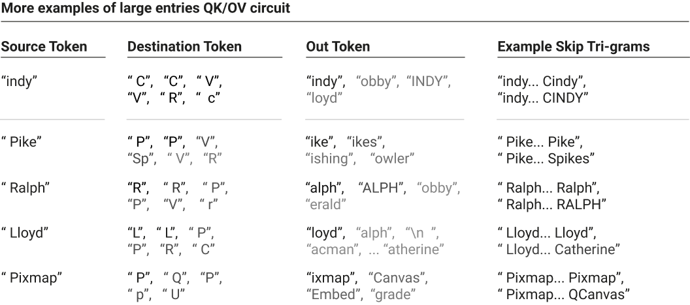

我们可以把我们观察到的这些复制行为归纳为几种抽象模式：

所有这些都可以看作一种非常原始的上下文学习。transformer 适应上下文的能力是它最有趣的特性之一，而这种简单的复制正是它的最基本形式。不过，当我们考察两层 transformer 时将会看到，更深的 transformer 拥有一种有趣得多、也强大得多的上下文学习算法。

##### 其他有趣的跳跃三元语法

当然，复制并不是这些注意力头编码的唯一行为。

跳跃三元语法看似简单，实际上却能产生比人们预期更复杂的行为。下面是我们翻阅模型展开后的 OV/QK 矩阵中最大条目时，发现的一些特别引人注目的跳跃三元语法例子。

- [Python] 预测 Python 关键字 `else`、`elif` 和 `except` 在缩进减少后更可能出现，所用跳跃三元语法的形式为：`\n\t\t\t … \n\t\t → else/elif/except`，其中第一部分缩进 $N$ 次、第二部分缩进 $N-1$ 次，$N$ 取不同值，且空白字符可以是制表符或空格。
- [Python] 预测 `open()` 会带一个文件模式字符串参数：`open … "," → [rb / wb / r / w]`（例如 `open("abc.txt","r")`）
- [Python] 函数的第一个参数通常是 `self`：`def … ( → self`（例如 `def method_name(self):`）
- [Python] 在 Python 2 中，`super` 常在以 `self` 调用之后用来调用 `.__init__()`：`super … self → ).__`（例如 `super(Parent, self).__init__()`）
- [Python] 提高与某个库相关的方法/变量/属性的概率：`upper … . → upper/lower/capitalize/isdigit`、`tf … . → dtype/shape/initializer`、`datetime… → date / time / strftime / isoformat`、`QtWidgets … . → QtCore / setGeometry / QtGui`、`pygame … . → display / rect / tick`
- [Python] 常见模式 `for... in [range/enumerate/sorted/zip/tqdm]`
- [HTML] `tbody` 后面常跟 `<td>` 标签：`tbody … < → td`
- [多种语言] 左右括号/引号/标点的匹配：`(** … X → **)`、`(' … X → ')`、`"% … X → %"`、`'</ … X → >'`（参见 [32 头模型，头 0:27](https://transformer-circuits.pub/2021/framework/head_dump/larger.html#head-0-27)）
- [LaTeX] 在 LaTeX 中，每个 `\left` 命令都必须有对应的 `\right` 命令；反过来，`\right` 只能出现在 `\left` 之后。因此，模型会预测在 `\left` 之后，后续 LaTeX 命令更可能是 `\right`：`left … \ → right`
- [英语] 常见短语和句式（例如 `keep … [in → mind / at → bay / under → wraps]`、` difficult … not → impossible`）

- 对于单个头，以下是一些与查询 `" and"` 相关的三元语法：`back and → forth`、` eat and → drink`、`trying and → failing`、`day and → night`、`far and → away`、`created and → maintained`、`forward and → backward`、`past and → present`、`happy and → satisfied`、`walking and → talking`、`sick and → tired`……（参见 [12 头模型，头 0:0](https://transformer-circuits.pub/2021/framework/head_dump/small_a.html#head-0-0)）

- [URL] 常见的 URL 模式：`twitter … / → status`、`github … / → [issues / blob / pull / master]`、`gmail … . → com`、`http … / → [www / google / localhost / youtube / amazon]`、`http … : → [8080 / 8000]`、`www … . → [org / com / net]`

值得注意的是，学到的跳跃三元语法往往与各自分词方式的独特之处密切相关。例如，把连续的空白合并成一个词元，使得单个词元就能体现缩进；不把反斜杠并入文本词元，意味着模型预测 LaTeX 时，反斜杠后面必然跟着一个表示转义序列的词元。诸如此类。

许多跳跃三元语法在没有特定背景知识的情况下难以解读（例如 `Israel … K → nes` 只有在你了解以色列的立法机构被称为"Knesset"（以色列议会）时才有意义）。一个有用的办法是：把可疑的跳跃三元语法输入 Google 搜索（或类似工具），看看自动补全结果。

##### 以位置为主的注意力头

到目前为止，我们对注意力头的讨论还没有涉及注意力头如何处理位置，这主要是因为目前有好几种相互竞争的方法（例如 \cite{vaswani2017attention,su2021roformer,press2020shortformer}），而引入它们会使我们的方程变得复杂。（对于标准位置嵌入而言，单层情形下的数学推导最终等价于把 $W_{QK}$ 乘以位置嵌入。）

在实践中，单层模型中往往有少数注意力头主要以位置为导向，强烈偏好某些相对位置。下面展示一个这样的注意力头：它要么注意当前词元，要么注意前一个词元。[^15]

##### 跳跃三元语法的“bug”

查看单层 transformer 展开后的 QK 和 OV 矩阵，最有趣的一点是：它们能揭示一些从外部看来完全无法理解的 transformer 行为。

我们的单层模型以“因式分解形式”（factored form）在 OV 矩阵和 QK 矩阵之间拆分表示跳跃三元语法，有点像把函数 $f(a,b,c) = f_1(a,b) f_2(a,c)$ 表示成两个因子的乘积。它们无法灵活地捕捉真正的三向交互。例如，如果某个头同时提高了 `keep… in mind` 和 `keep… at bay` 的概率，它就必然也会提高 `keep… in bay` 和 `keep… at mind` 的概率。总体权衡下来，这对模型可能是一笔划算的交易，但在某种意义上，这确实是一个 bug。我们在注意力头中经常观察到这类现象。

高亮文字表示那些跳跃三元语法的续接——在理想情况下，模型本不该提高它们的概率。请注意，`QCanvas` 是流行 Qt 库中一个涉及 pixmap 的[类](https://doc.qt.io/archives/3.3/qcanvas.html)。`Lloyd... Catherine` 很可能指的是 Catherine Lloyd Burns。这些例子略经挑选以增强趣味性，但如果你去看上面链接的模型的展开权重，会发现这类现象非常普遍。

尽管这些具体的 bug 在某种意义上看似微不足道，但我们对这个结果感到兴奋：它是对“用可解释性来理解模型失败”这一方向的早期示范。我们还没有进一步探索这一现象，但很乐意在更细的粒度上深入研究。比如，能否定量刻画这些“bug”让模型付出了多少性能代价（以 loss 点数或其他指标衡量）？这类 bug 是否在更大的模型中仍部分存在（推测会被其他效应部分掩盖，而非完全消失）？

#### 总结 OV/QK 矩阵

我们把“理解单层纯注意力 transformer”的问题，转化成了“理解其展开后的 OV 和 QK 矩阵”的问题。但正如上面提到的，展开后的 OV 和 QK 矩阵极其庞大，条目动辄数十亿。虽然查找最大条目很有意思，但有没有更好的理解方式？至少有三个理由让我们相信答案是肯定的：

- OV 和 QK 矩阵的秩极低。它们是 50,000 × 50,000 的矩阵，但秩只有 $d_\text{head}$（64 或 128）。从某种意义上说，尽管展开形式看起来很大，它们其实相当小。
- 查看单个条目往往能揭示出更简单结构的线索。例如，我们观察到某个头中，人名对应的最大查询都是 `" by"` 这样的（如 `"Anne… by → Anne"`），地名对应的最大查询都是 `" from"` 这样的（如 `"Canada… from → Canada"`）。这暗示矩阵中存在某种类似聚类的结构。
- 复制行为在 OV 矩阵中普遍存在，可以说也是最有趣的行为之一。（我们将在下一节看到，两层模型中存在类似的 QK 矩阵结构，用来搜索与查询相似的词元。）我们似乎应该能够把这种行为形式化。

我们还不确定正确答案是什么，但我们乐观地认为，合适的矩阵分解或降维方法或许能提供大量信息。（关于如何高效处理这些大矩阵，参见技术细节附录。）

##### 检测复制行为

我们最希望以自动化方式检测的行为就是复制。由于复制本质上就是把同一向量映射到它自身（例如，让一个词元提高自身的概率），它似乎特别适合用某种汇总统计量来捕捉。

然而，我们发现很难确切界定正确的定义是什么；这很可能是因为，“什么算一张‘复制矩阵’”存在许多略有不同的划界方式，而我们还不确定哪一种最有用。例如，本文讨论的模型中没有观察到这种现象，但在稍大的模型中，我们经常观察到一些注意力头会从邻近单词“复制”性别、单复数、时态的某种混合信息，帮助模型使用正确的代词并进行动词变位。这些注意力头的矩阵并不完全是复制单个词元，但似乎在某种很有意义的意义上确实是在复制。所以，复制实际上是一个比乍看起来更复杂的概念。

一个自然的思路是使用特征向量和特征值。回忆一下，如果 $Mv_i = \lambda_i v_i$，则 $v_i$ 是矩阵 $M$ 的特征向量，$\lambda_i$ 是相应的特征值。我们来考虑，当 $\lambda_i$ 是正实数时，这对 OV 电路 $M=W_UW^h_{OV}W_E$ 意味着什么。那么这等于说：存在一个词元的线性组合[^16]，它能提高这些相同词元的 logits 的线性组合。粗略地说，你可以把它想象成一组相互提高自身概率的词元（宽泛一点的例子是所有表示复数单词的词元；狭窄一点的例子是以某个给定首字母开头的所有词元，或某个单词的不同大小写及是否带空格形式所对应的所有词元）。当然，一般来说，我们预期特征向量同时含有正项和负项，因此更确切地说，是两组词元（例如表示阳性和阴性单词的词元，或表示单数和复数单词的词元）提高同组其他词元的概率，同时降低另一组词元的概率。

特征分解把矩阵表示为这样一组特征向量和特征值。对于随机矩阵，我们预期正、负特征值的数量大致相等，且其中许多是复数。[^17] 但复制要求正特征值——事实上，我们确实观察到许多注意力头具有正特征值，显然与复制结构相呼应：

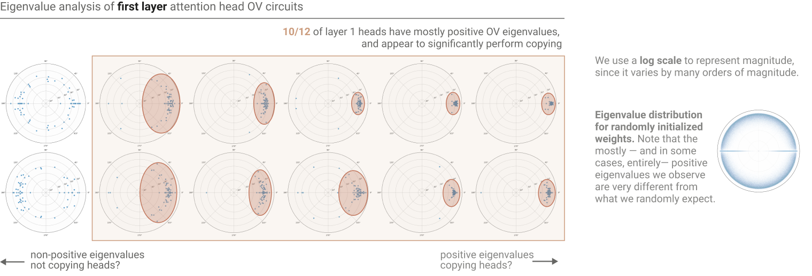

甚至可以进一步汇总，得到一张统计有多少注意力头在复制的直方图（如果你愿意相信特征值这一汇总统计量的话）：

结果表明，12 个头中有 10 个在显著地复制！（这与对展开权重的定性检查一致。）

然而，复制矩阵必然具有正特征值，但反过来，并非所有具有正特征值的矩阵都必然是我们想归入“复制”之列的东西。矩阵的特征向量未必正交，这就可能产生病态的例子：[^18] 例如，可能存在所有特征值均为正、却把某些词元映射为降低该词元自身 logits 的矩阵。正特征值仍然意味着矩阵在某种意义上“平均而言在复制”，而且它们仍是相当强的复制证据：默认情况下出现正特征值的概率本不高，经验上它们也确实与复制行为相符。但我们不应把它们视为决定性证明，断定矩阵在所有合理解释下都在复制。

人们或许会尝试用其他方式来形式化"复制矩阵"（copying matrix）。一种可能的方法是考察矩阵的对角线——它描述了每个词元（token）如何影响自身的概率。不出所料，对角线上的元素都强烈偏向正值。我们还可以问：一个随机词元有多频繁地比任何其他词元更能提升自身的概率（或者跻身提升幅度最大的 k 个词元之列，以便容纳那些只是大小写不同、或带了个空格但本质相同的词元）。所有这些标准似乎都指向同一个结论：这些注意力头就是复制矩阵。但其中任何一种是否构成了"该矩阵的主要行为是复制"这一命题的完全稳健的形式化，其实并不清楚。值得注意的是，所有这些关于复制的潜在定义都是相通的，因为它们共享一个事实：矩阵的特征值之和等于迹，而迹又等于对角线元素之和。

就本文的目的而言，我们将继续使用基于特征值的汇总统计量。我们并不认为它尽善尽美，但它看起来是复制行为的相当有力的证据，并且在经验上与人工检查及其他定义相符。

#### 我们是否"完全理解"了一层模型？

人们常常怀疑，真正逆向工程神经网络是否可能、是否值得一试。正因如此，人们很容易指向一层纯注意力 transformer 说："看，如果我们取 transformer 最简化的玩具版本，至少这个最小版本是可以被完全理解的。"

但这个论断其实取决于"完全理解"指的是什么。在我们看来，我们现在理解这个简化模型的方式，类似于人们看着一个巨型线性回归的权重而理解它，或者看着一个大型数据库而理解查询它意味着什么。这是一种理解。算法层面的神秘感已不复存在。神经网络参数的语境化问题已被剥离。但如果没有进一步的归纳总结工作，模型的内容仍然太多，无法装进任何人的脑子里。

既然普通的单层神经网络不过是广义线性模型（generalized linear model），并且可以这样来理解，那么单个注意力层在大多数情况下也是如此，或许就不足为奇了。

### 两层纯注意力 Transformer

与本节内容相近的视频：[2 层理论](https://www.youtube.com/watch?v=UM-eJbx_YDk&list=PLoyGOS2WIonajhAVqKUgEMNmeq3nEeM51&index=5)、[2 层各项的重要性](https://www.youtube.com/watch?v=qom0nxou4f4&list=PLoyGOS2WIonajhAVqKUgEMNmeq3nEeM51&index=6)、[2 层结果](https://www.youtube.com/watch?v=VuxANJDXnIY&list=PLoyGOS2WIonajhAVqKUgEMNmeq3nEeM51&index=7)

深度学习研究的是"深"的模型，也就是说层数很多的模型。经验表明，这类模型非常强大。这种力量来自哪里？一种直觉是：深度允许组合（composition），而组合带来了强大的表达能力。

注意力头的组合是一层与两层纯注意力 transformer 之间的关键区别。没有组合的话，两层模型不过是多了些用于实现跳跃三元语法（skip-trigram）的注意力头。但我们会看到，在实践中，两层模型找到了利用注意力头组合的方式，从而表达出一种强大得多的机制来实现上下文学习（in-context learning）。这样一来，它们变得更像运行算法的计算机程序，而不是一层模型中那种跳跃三元语法的查找表。

#### 三种组合方式

回想一下，我们把残差流视为一条通信信道。每个注意力头读取残差流中由 $W_Q$、$W_K$ 和 $W_V$ 决定的子空间，然后写入由 $W_O$ 决定的某个子空间。由于注意力头向量的规模远小于残差流的规模（$d_\text{head} / d_\text{model}$ 的典型取值大约在 $1/10$ 到 $1/100$ 之间），注意力头只作用于小的子空间，因而很容易避免显著的相互干涉。

当注意力头确实发生组合时，有三种可能：

- Q 组合：$W_Q$ 读取的某个子空间受到了先前注意力头的影响。
- K 组合：$W_K$ 读取的某个子空间受到了先前注意力头的影响。
- V 组合：$W_V$ 读取的某个子空间受到了先前注意力头的影响。

Q 组合和 K 组合与 V 组合大不相同。Q 组合和 K 组合都会影响注意力模式，使注意力头能够表达复杂得多的模式。相比之下，V 组合影响的是注意力头在关注某个给定位置时搬动哪些信息；其结果是，发生 V 组合的头实际上更像一个整体单元，可以看作额外创造了一个"虚拟注意力头"（virtual attention head）。信息的搬动与信息的搬动相组合，得到的仍是信息的搬动；而注意力头对注意力模式的影响则无法这样化约。

要真正理解这三种组合方式，我们需要再次研究 OV 电路和 QK 电路。

#### logits 的路径展开

我们对 transformer 能提出的最基本的问题是："logits（对数几率）是如何计算的？"沿用我们处理一层模型的方法，我们先写出一个乘积，其中每一项对应模型中的一层；再将其展开为一个和式，其中每一项对应贯穿模型的一条端到端路径。

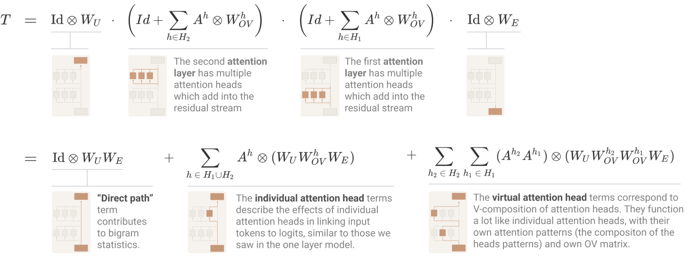

这些项中有两类——直接路径项和单个注意力头项——与一层模型完全相同。最后一项"虚拟注意力头"对应 V 组合。虚拟注意力头在概念上非常有趣，我们稍后会进一步讨论。不过在实践中我们会发现，在小型两层模型中，它们往往并不扮演重要角色。

#### 注意力分数的路径展开：QK 电路

仅仅看 logits 的展开，会错过两层纯注意力 transformer 最具根本性差异的性质：Q 组合和 K 组合使它们的第二层注意力模式具有强得多的表达能力。

要看到这一点，我们需要考察计算注意力模式的 QK 电路。回想一下，注意力头 $h$ 的注意力模式是 $A^h~$  $=~ \text{softmax}^*\!\left( t^T \cdot C_{QK}^h t \right)$，其中 $C_{QK}^h$ 是"QK 电路"，它把词元映射为注意力分数。对于第一层的注意力头，QK 电路就是我们在单层模型中见过的那个矩阵：$C^{\,h\in H_1}_{\,QK}~$  $=~ W_E^T W_{QK}^h W_E$。

但对于第二层的 QK 电路，Q 组合和 K 组合都会发挥作用：前一层的注意力头可能会影响键（key）和查询（query）的构造。归根结底，$W_{QK}$ 作用于残差流。在第一层的情况下，这可以化约为只作用于词元嵌入：$C^{\,h\in H_1}_{\,QK}~$  $=~ x_0^T W_{QK}^h x_0$  $=~ W_E^T W_{QK}^h W_E$。但到了第二层，$C^{\,h\in H_2}_{\,QK}~$  $=~ x_1^T W_{QK}^h x_1$ 作用在 $x_1$ 上——即经过第一层注意力头处理后的残差流。我们可以把它写成一个乘积，其中第一层同时出现在"键侧"和"查询侧"。然后，我们对这个乘积施展路径展开的技巧。

一个复杂化因素是，我们必须把它写成 6 维张量，在矩阵上使用两次张量积。这是因为我们试图表达的是如下形式的多重线性函数：$[n_\text{context},~ d_\text{model}] \times [n_\text{context},~ d_\text{model}] ~\to~ [n_\text{context},~ n_\text{context}]$。在单层情形中，我们可以通过隐式地做外积来绕开这一点，但那种做法在这里行不通了。一个自然的表达方式是把它写成 (4,2)-张量（即 4 个输入维度、2 个输出维度的张量）。每一项都具有 $A_q \otimes A_k \otimes W$ 的形式，其中 $x (A_q \otimes A_k \otimes W) y = A_q^T x W y A_k$，也就是说：$A_q$ 描述查询侧信息在词元之间的搬动，$A_k$ 描述键侧信息在词元之间的搬动，而 $W$ 描述它们如何相乘组合成一个注意力分数。

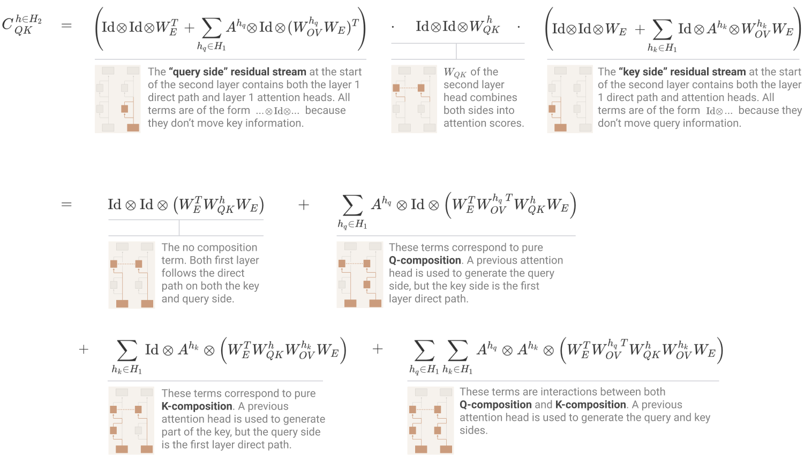

这些项中的每一项都对应模型实现更复杂注意力模式的一种方式。抽象地看，它们很难推理。但稍后当我们讨论归纳头时，会结合一个具体案例回到这些项上来。

#### 分析一个两层模型

到目前为止，我们已经建立了一个理解两层纯注意力模型的理论框架：有一个描述 logits 的总体方程（OV 电路），还有一个描述每个注意力头的注意力模式如何计算的方程（QK 电路）。但在实践中我们该如何理解它们？在本节中，我们将逆向工程一个具体的两层模型。

回想一下，两层模型与一层模型的关键区别在于 Q 组合、K 组合和 V 组合。没有组合，模型就只是多了一些注意力头的一层模型。

小型两层模型似乎常常（尽管并非总是）具有非常简单的组合结构：唯一的组合类型是单个第一层注意力头与某些第二层注意力头之间的 K 组合。[^19] 下图展示了我们想要分析的模型中，第一层与第二层注意力头之间的 Q 组合、K 组合和 V 组合。我们根据自己对这些头行为的理解，给涉及的注意力头上了色。这个第一层注意力头具有非常简单的注意力模式：它主要关注前一个词元，其次关注当前词元和往前两个位置的词元。第二层的注意力头就是我们所说的*归纳头*（induction head）。

#### 更正

下图存在一个错误，该错误源于我们为加速低秩矩阵上的线性代数运算而编写的一个底层库中的 bug。关于此错误的详细说明以及修正后的图，见下文。

上图展示了第一层与第二层注意力头之间的 Q 组合、K 组合和 V 组合。也就是说，第二层注意力头的查询、键或值向量，从某个给定的第一层注意力头读入了多少信息？衡量方式是考察相关矩阵乘积的 Frobenius 范数，再除以各矩阵自身的范数。Q 组合为 $||W_{QK}^{h_2~T}W_{OV}^{h_1}||_F / (||W_{QK}^{h_2~T}||_F ||W_{OV}^{h_1}||_F)$，K 组合为 $||W_{QK}^{h_2}W_{OV}^{h_1}||_F / (||W_{QK}^{h_2}||_F ||W_{OV}^{h_1}||_F)$，V 组合为 $||W_{OV}^{h_2}W_{OV}^{h_1}||_F / (||W_{OV}^{h_2}||_F ||W_{OV}^{h_1}||_F)$。默认情况下，我们会减去同形状随机矩阵的经验期望值（大多数注意力头的组合程度远小于随机矩阵）。就这个模型而言，实际上只存在显著的 K 组合，而且只与一个第 0 层注意力头发生。

由此可以很快得出一个观察：大多数注意力头并未参与任何实质性的组合。我们可以大致把它们看作一个更大规模的跳跃三元语法集合。这个两层模型留给我们一个待解之谜，不过它的范围相当狭窄。（我们推测，这意味着拥有几个归纳头在某种意义上"胜过"几个潜在的跳跃三元语法头，而其他类型的组合则没有这种优势。也就是说，在小型模型中，用第二层的注意力头去实现更多的跳跃三元语法头，是一种有竞争力的用法。）

在接下来的几节中，我们将发展一套理论来解释这里发生的事情；但在那之前，我们先提供一个机会，让大家通过下面的交互式图表来摆弄这些注意力头。该图表展示了《哈利·波特与魔法石》（*Harry Potter and the Philosopher's Stone*）第一段上的值加权注意力模式。我们沿用上面的配色方案，为参与 K 组合的注意力头上色。（这会让研究其他注意力头变得有点困难；如果你想查看它们，可[在此处](https://transformer-circuits.pub/2021/framework/2L_HP_normal.html)使用一个用于自由探索的界面。）

我们建议逐个隔离注意力头，既观察其注意力模式，也将鼠标悬停在词元上查看。对于归纳头，请特别注意注意力模式中偏离主对角线的线条，以及模型在构成 Dursley 和 Potters 的词元上的行为。

上图展示的是各种注意力头的*值加权注意力模式*（value-weighted attention pattern）；也就是说，注意力权重按源位置的值向量的范数 $||v_{src}^h||$ 缩放后的注意力模式。你可以把值加权注意力模式理解为展示了"从每个位置搬动了多大的向量"。（这一方法也由 Kobayashi 等人近期引入 \cite{kobayashi2020attention}。）它特别有用，是因为注意力头有时会把某些词元当作一种默认位置或落脚位置来使用——当没有词元符合它们要找的目标时；这些默认位置上的值向量很小，因此值加权模式更具信息量。

该界面允许单独隔离注意力头，显示整体注意力模式，并允许你逐词元探索注意力。参与 K 组合的注意力头沿用了上面的配色方案。我们建议试着把这些头单独隔离出来。

如果仔细观察，你会注意到水蓝色的"归纳头"经常回看"将要"出现的那个词元在此前出现过的实例。我们将在下一节更深入地研究这一点。当然，只在单段文本上观察注意力模式——尤其还是这样一段广为人知的文字——并不能让我们对这些头的一般行为有很高的置信度。等我们对正在发生的事情有了更强的假设之后，我们会再回到这个问题。

#### 归纳头

在小型两层纯注意力 transformer 中，组合似乎主要服务于一个目的：创造我们所说的归纳头。我们之前看到，一层模型把大量容量用于复制头，以此作为实现上下文学习的粗糙手段。归纳头则是实现上下文学习的强大得多的机制。（我们将在[下一篇论文](https://transformer-circuits.pub/2022/in-context-learning-and-induction-heads/index.html)中更详细地探讨归纳头在上下文学习中的作用。）

##### 归纳头的功能

如果你摆弄过上面的注意力模式，可能已经猜到归纳头的作用了。归纳头会在上下文中搜索当前词元之前出现过的实例。如果找不到，它们就注意第一个词元（在我们的情况中，是放在序列开头的一个特殊词元），然后什么也不做；但如果找到了，它们就会接着看下一个词元，并把它复制下来。这样一来，它们既能精确地、也能近似地重复之前的词元序列。

把归纳头与我们在一层模型中观察到的各类上下文学习（in-context learning）作对比是很有用的：

- 一层模型的复制头：`[b] … [a] → [b]`

- 以及当分词（tokenization）的罕见巧合允许时：`[ab] … [a] → [b]`

- 两层模型的归纳头：`[a][b] … [a] → [b]`

两层算法更强大。它不是笼统地寻找可以重复某个词元的位置，而是知道该词元此前是如何被使用的，并留意类似的场合。这使得它在这些场合下能做出自信得多的预测。它也不太容易受分布偏移的影响，因为它不依赖「某个词元是否可能跟在另一个词元后面」这类学到的统计信息。（我们稍后会看到，归纳头能够在完全随机词元的重复序列上运作。）

下面的例子展示了归纳头在《哈利·波特》第一段中帮助预测词元的几个场合：

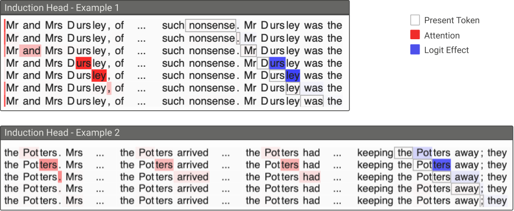

归纳头 `1:8` 在《哈利·波特与魔法石》第一段某些片段上的原始注意力模式与 logit 效应。图中所示的「logit 效应」值，是当前词元的结果向量对下一词元 logit（对数几率）的影响，即 $(W_U W_O^h r^h_\text{pres\_tok})_\text{next\_tok}$，它等价于运行完整的 OV 电路并检查该头为下一个词元贡献的 logit。

之前，我们承诺过要在更多词元上展示归纳头，以便更好地检验我们关于它们的理论。现在我们可以这么做了。

既然我们认为归纳头会注意词元之前的副本并向前偏移一位，它们就应该也能在完全随机的重复模式上做到这一点。这可能是我们能给它们的最严苛的测试，因为它们无法依赖「哪些词元通常跟在另一些词元后面」这类常规统计。由于这些词元是从我们的词表中均匀随机采样得到的，我们用 `<n>` 表示词表中的第 $n$ 个词元，特殊词元 `<START>` 除外。（请注意，这完全偏离了分布。只要「重复序列更有可能再次出现」这一更抽象的性质成立，归纳头就能在迥然不同的分布上运作。）

与之前的注意力模式图一样，此图展示了各个头的值加权注意力模式，其中参与 K 组合的头按我们的理论着色。图中注意力头作用于一个随机词元序列，该序列重复了三次。`<n>` 表示我们词表中的第 $n$ 个词元。

这似乎是相当有力的证据，表明我们对归纳头的假说是正确的。我们现在知道 K 组合在我们的两层模型中是用来做什么的了。接下来的问题是，K 组合*如何*实现这一点。

##### 归纳头如何运作

归纳头的核心诀窍在于：键是由向前偏移了一个词元的词元计算出来的。[^20] 查询负责搜索「相似」的键向量，但由于键发生了偏移，找到的其实是下一个词元。

下面这个例子来自一个规模更大、归纳头更复杂的模型，是一个有用的说明：

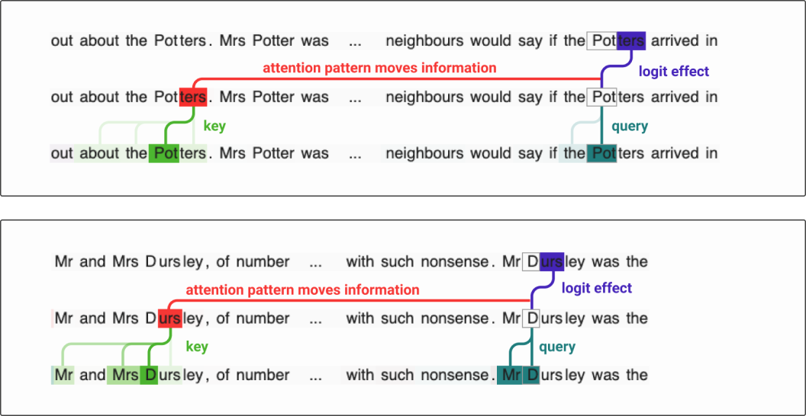

QK 电路可以按词元而非注意力头展开。上图中，键和查询的强度表示每个词元使注意力分数增加的量。logit 效应即 OV 电路。

创建归纳头的最简方式是使用与前一词元头（previous token head）的 K 组合，把键向量向前偏移一个词元。这会在 QK 电路中产生一个形如 $\text{Id} \otimes A^{h_{-1}} \otimes W$ 的项（其中 $A^{h_{-1}}$ 表示注意前一个词元的注意力模式）。如果 $W$ 匹配词元相同的场合——即「复制矩阵」的 QK 版本——那么当源位置之前的那个词元与目标词元相同时，这一项就会提高注意力分数。（归纳头可以比这更复杂；例如，其他两层模型会发展出一个注意范围略超前一个词元的注意力头，大概是为了构造 $A^{h_{-1}} \otimes A^{h_{-2}} \otimes W$ 这样的项，使某些头能匹配到更早的位置。）

##### 检验机制理论

我们的机制理论表明，归纳头必须做两件事：

- 拥有一个「复制」型的 OV 电路矩阵。
- 拥有一个与 $\text{Id} \otimes A^{h_{-1}} \otimes W$ 项相关联的「相同匹配」型 QK 电路矩阵。

虽然我们并不确信「检测复制」（Detecting Copying）一节中的特征值汇总统计量是检测「复制」或「匹配」矩阵的最佳汇总统计量，但我们还是选择把它作为一种可用的形式化。如果我们把注意力头视为二维空间中的点——其坐标分别是 QK 与 OV 电路特征值的正性——那么所有归纳头恰好都落在最右侧的角落里。

有人可能会问，这个观察是否犯了循环论证。我们最初关注这些注意力头，是因为它们的 K 组合大于随机水平，而现在我们又回过头来，部分地审视 K 组合这一项。但在这种情况下，我们发现 K 组合创造出的矩阵极度偏向正特征值——我们没有任何理由认为大的 K 组合就意味着正的 K 组合，也没有任何理由认为所有 OV 电路都为正。

但如果模型实现的算法正是我们所描述的归纳实现算法，那么这恰恰是我们所预期的。

#### 项重要性分析

之前，我们决定忽略所有「虚拟注意力头」（virtual attention head）项，因为我们没有观察到任何显著的 V 组合。这看起来很可能是对的，但我们仍有可能出错。特别是，可能存在这样的情况：每个单独的虚拟注意力头都不重要，但它们加在一起却很重要。本节将描述一种用消融来复核这一判断的方法。

通常，当我们在神经网络中消融某个东西时，我们消融的是激活值中显式表示出来的东西——把它乘以零就完事了。但在这种情况下，我们要消融的是一个隐式项，它只有在你展开方程时才存在。我们也可以通过运行我们方程所描述的 transformer 版本来做到这一点，但那会慢得可怕，而且随着我们考虑更深的模型，会呈指数级恶化。

但事实证明，存在一种算法可以确定消融第 $n$ 阶项（即对应于穿过 $n$ 个注意力头 V 组合的路径的那些项）的边际效应。关键技巧是多次运行模型，用之前运行模型时保存的激活值替换当前的激活值。这样可以限制路径的深度，消融掉所有阶数更高的项。然后，通过取每次消融所观察到的损失之差，我们就能得到第 $n$ 阶项的边际效应。

测量第 $n$ 阶项边际损失减少量的算法
第 1 步：运行模型，保存所有注意力模式。
第 2 步：运行模型，强制所有注意力模式为你记录下的版本；不把注意力头的输出加到残差流上，而是保存该输出，然后用一个形状相同的零张量替换它。记录由此产生的损失。
第 $n$ 步：运行模型，强制所有注意力模式为你记录下的版本；不把注意力头的输出加到残差流上，而是保存该输出，然后用你上次为该头保存的值替换它。记录由此产生的损失。

（请注意，把注意力模式冻结为真实值，正是这种消融只针对 V 组合的原因。虽然这在某些方面是最简单的算法，只关注 OV 电路，但这种算法的变体也可以用来单独分离 Q 组合或 K 组合。）

正如 V 组合的结果所表明的，二阶「虚拟注意力头」项在这个模型中的边际效应相当小。（尽管在其他模型——尤其是更大的模型——中，它们很可能重要得多。）

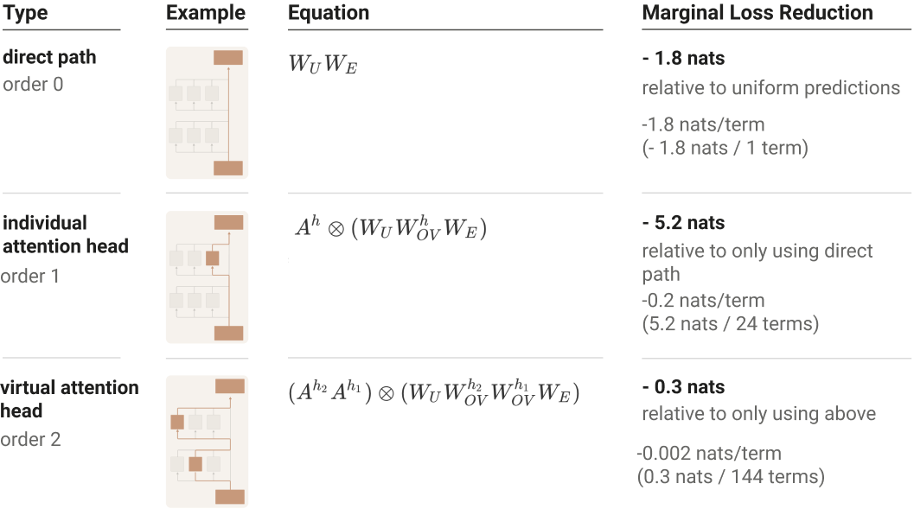

我们的结论是：要理解两层纯注意力模型，我们不应优先理解二阶「虚拟注意力头」，而应聚焦于直接路径（它只能贡献二元语法统计）和单个注意力头项。（我们强调，这一点对 Q 组合和 K 组合不构成任何论断；OV 电路中的高阶项无关紧要，只能排除 V 组合的重要性。Q 组合和 K 组合对应的其实是每个头 QK 电路中的项。）

我们还可以把这些单个注意力头项进一步细分为第 1 层和第 2 层的项：

这表明我们应该重点关注第 2 层的头项。

#### 虚拟注意力头

尽管虚拟注意力头在理解两层模型的性能方面最终被证明相当不重要，但我们推测，在更大、更复杂的 transformer 中，它们可能重要得多。它们也令我们印象深刻，因为它们在理论上似乎非常优雅。

回想一下，虚拟注意力头是 logit 方程路径展开中形如 $(A^{h_2}A^{h_1}) \otimes (\ldots W_{OV}^{h_2}W_{OV}^{h_1}\ldots)$ 的项，对应于两个头的 V 组合。

Q 组合和 K 组合影响的是注意力模式，而 V 组合创造出的这些项实际上像一种独立的单元那样运作：先执行一个头的操作，再执行另一个头的操作。由此得到的对象，最好被理解为这些头的复合，即 $h_2 \circ h_1$。它有自己的注意力模式 $A^{h_2 \circ h_1} = A^{h_2}A^{h_1}$，也有自己的 OV 矩阵 $W_{OV}^{h_2 \circ h_1} = W_{OV}^{h_2}W_{OV}^{h_1}$。在更深的模型中，原则上可以存在更高阶的虚拟注意力头（例如 $h_3 \circ h_2 \circ h_1$）。

关于虚拟注意力头，有两件事值得注意。

首先，这类组合看起来相当强大。我们经常看到注意力模式注意前一个词元的头，却几乎看不到注意两个词元之前的头——这可能是因为来自两个词元之前的任何有用的预测能力都是通过虚拟注意力头获得的。注意力模式还可以实现更抽象的东西，比如注意当前从句的开头，或句子的主语——组合使得「注意上一个从句的主语」这类功能成为可能。

其次，虚拟注意力头数量庞大。普通头的数量随层数线性增长，而基于两个头复合的虚拟头数量呈平方增长，基于三个头复合的则呈立方增长，依此类推。这意味着，理论上模型有广阔得多的空间，可以借助虚拟注意力头获得有用的预测能力。这一点尤其重要，因为普通注意力头在某种意义上「很大」：一个头只有一个注意力模式，决定它注意哪些源词元，另有 $d_{\text{head}}$ 个维度用于把信息从源词元复制到目标词元。这使得它们难以胜任直觉上「很小」的任务——即不需要传递多少信息的任务，例如注意前面的代词以判断文本是第一、第二还是第三人称，或者注意时态标记以判断文本是过去时、现在时还是将来时。

### 这把我们带到了哪里？

在过去的几个小节中，我们在理解单层和两层纯注意力 transformer 方面取得了进展。但我们的最终目标是理解一般的 transformer。这些工作真的让我们更接近目标了吗？这些特殊而受限的案例真的能照亮一般性问题吗？我们将在后续工作中探讨这个问题，但我们的总体感觉是：是的，这些方法可以用来理解一般 transformer 的某些部分，包括大语言模型。

一个原因是，普通 transformer 包含一些看起来以注意力为主的电路。即使存在 MLP 层，注意力头仍然在残差流上运作，仍然可以直接相互交互，也可以直接与嵌入交互。在实践中，我们确实发现了一些只涉及注意力头和嵌入的可解释电路实例。虽然我们可能无法理解整个模型，但我们处于非常有利的位置，可以逆向工程这些部分。

事实上，我们在大型模型中确实看到了与我们在这类玩具模型（toy model）中分析过的注意力头和电路相似的对应物！特别是，我们会发现大型模型会形成许多归纳头，而构造它们的基本构件就是与前一词元头的 K 组合——正如我们在这里看到的那样。这似乎是各种规模语言模型中上下文学习的核心驱动力——我们将在下一篇论文中讨论这个话题。

话虽如此，我们或许只能用这种方式理解大语言模型的一小部分。首先，MLP 层占标准 transformer 参数的 2/3。显然，如果不深入这些参数，模型行为的很大一部分是我们无法理解的。而实际情况可能更糟：由于许多注意力头与 MLP 层交互，我们能在不考虑 MLP 层的情况下理解的参数比例甚至不到 1/3。更完整的理解将需要在 MLP 层上取得进展。在机制层面，它们的电路其实具有非常优美的数学结构（参见补充直觉部分）。然而，最清晰的前进道路需要可单独解释的神经元，而我们在寻找这样的神经元方面取得的成功有限。

归根结底，我们在这篇开篇论文中的目标，只是为今后在这个问题上的努力建立一个立足点。未来还有很多工作要做。

### 相关工作

##### 电路

[Distill 的 Circuits 专题](https://distill.pub/2020/circuits/) \cite{cammarata2020thread} 是一次齐心协力逆向工程 InceptionV1 模型的努力。我们的工作则试图为大语言模型做类似的事情。

电路方法（Circuits approach）在语言模型语境下需要大幅重新思考。注意力头与卷积网络中的任何组件都截然不同，需要全新的方法。残差流的线性结构既带来了新的挑战（缺乏特权基使得某些研究途径不再可行），也创造了机遇（我们可以沿它展开）。电路的形态是双线性型而非单纯的线性，这一点也相当不寻常（尽管 Goh 等人\cite{goh2021multimodal} 在研究图像模型与语言模型之间的双线性交互时已有所触及）。

我们注意到，InceptionV1 上的原始电路工作与在纯注意力 transformer 语言模型中研究电路，二者之间存在几个有趣的高层差异：

- 对纯注意力模型的电路分析随模型规模的变化方式，很可能与以往大不相同。在纯注意力模型中，参数被组织成相对较大、有意义、大体上线性运作的块，每个块对应一个注意力头。这为"粗略理解"相当大量的参数创造了大量机会。即使是极大的模型也只有几千个注意力头——在这个规模上，逐个检视每个头是可行的。当然，一旦加入 MLP 层，大部分参数都在 MLP 内部，这种理解模型的相对收益就变小了。
- 我们在微型纯注意力 transformer 中研究电路所取得的成功，远超我们在小型视觉模型上的尝试。小型视觉模型的问题在于，神经元往往不可解释；而这里似乎没有类似的情况，因为我们可以把一切都归结为端到端的项。不过，当我们更密切地研究带 MLP 层（无法归结为端到端项）的模型时，或许同样会发现，神经元要变得可解释也需要足够的规模。

##### logit 透镜（Logit Lens）

LessWrong 用户 Nostalgebraist 此前在一篇论文中提出了一种他们称为"[logit 透镜（Logit Lens）](https://www.lesswrong.com/posts/AcKRB8wDpdaN6v6ru/interpreting-gpt-the-logit-lens)"的方法\cite{nostalgebraist2020logitlens}，探讨的正是我们大量利用的残差流线性结构。logit 透镜方法指出，由于残差流是逐步迭代精炼的，可以把解嵌入矩阵施加于残差流的早期阶段（即本质上考察 $W_U x_i$），从而在某种意义上观察模型预测的演变。

我们的方法可以看作做了类似的观察，但认定残差流其实并不是值得研究的基本对象。由于残差流是许多注意力头和神经元的线性投影之和，自然而然的做法是把权重直接乘开，看看构成该和的各个不同部分如何连接到 logits。随后可以继续利用这种线性结构，尽可能把线性性向模型深处推进——这大致就引向了我们的方法。

##### 注意力头分析

在考察 transformer 注意力头方面，我们的工作承袭了此前几篇论文的路线。对注意力模式的考察大概始于 Llion Jones 的可视化\cite{jones2017tensor2tensor}，并很快被其他人扩展\cite{vig2019multiscale}。近来，几篇论文开始认真研究注意力头与语法结构之间的对应关系\cite{voita2019analyzing,clark2019does,htut2019attention}。

这些此前的注意力头分析与我们的工作之间最大的差异，归根结底在于目标不同：我们力求给出端到端的机制性解释，而非对注意力模式做经验性描述。当然，作为一篇初步的论文，本文与这些先前工作的不同还在于：我们只研究了非常小的玩具模型，而且主要是为了说明和支持我们的理论。最后，我们关注的是自回归 transformer，而非 BERT \cite{devlin2018bert} 这样的去噪模型。

我们的研究受益于这些论文，关于我们的结果与它们的关系，我们有一些零散的思考：

- 与这些论文中的大多数一样（例如 \cite{voita2019analyzing,clark2019does}），我们在多数模型中都观察到前一词元注意力头的存在。有时在小型模型中，我们得到的注意力头会转而弥散到最后两三个词元上。
- 我们印证了其他人的发现：许多注意力头似乎默认关注标点或特殊词元（例如 \cite{vig2019multiscale,clark2019does}）。归纳头就是这方面的一个具体例子。与 Kobayashi 等人\cite{kobayashi2020attention}类似，我们发现用值向量的模长对注意力模式进行缩放，对厘清这一点非常有用。
- 本文讨论的玩具模型并没有展现出这些先前工作中描述的那种精巧的语法注意力头。不过，在更大的模型中，我们确实发现了与之更相似的注意力头。
- Voita 等人\cite{voita2019analyzing}描述了一些优先关注罕见词元的注意力头；我们猜想它们或许与我们描述的跳跃三元语法注意力头相似。
- 几篇论文指出存在这样的注意力头：它们会关注当前词元此前的出现。我们想到，我们所谓的"归纳头"在基于掩码数据训练的双向模型（而非自回归模型）中，可能就表现为这种形式（其机制特征是在 QK 展开中出现具有较大正特征值的 $A^{h_{prev}} \otimes A^{h_{prev}} \otimes W$）。

##### 对"注意力即解释"的批评

一条重要的研究路线批评了对注意力权重的朴素解读——即认为注意力权重刻画了某个词元在影响模型输出时有多重要（经验研究见 \cite{jain2019attention,serrano2019attention}；相关的概念性讨论见如 \cite{brunner2019identifiability,abnar2020quantifying}；但另见 \cite{wiegreffe2019attention}）。

我们的框架可以被看作——就纯注意力模型这一有限情形而言——提供了一份分类学：朴素解读注意力模式可能以哪些方式产生误导，以及它们在哪种具体方式下可以成立。当注意力头独立作用时——对应于我们方程中的一阶项——它们确实可以直截了当地解释。（事实上还不止如此：正如我们在单层模型中所见，我们还能轻松描述这些一阶项如何影响 logits！）然而，注意力头可以通过三种方式相互作用（Q 组合、K 组合和 V 组合），产生更复杂的行为，而这些行为难以用对注意力模式的朴素解读来刻画（对应于 transformer 路径展开中高阶项的爆炸式增长）。问题在于这些高阶项有多重要——而我们观察到的案例显示，它们似乎非常重要！

归纳头提供了一个生动的实例，说明对注意力模式的朴素解读既可能极有信息量，也可能具有误导性。一方面，归纳头本身的注意力模式信息量很大；事实上，对于相当多的词元，模型行为可以解释为"某个归纳头关注了此前的词元，并预测它会再次出现"。但我们发现的归纳头完全依赖上一层中的前一词元头——通过 K 组合——来决定关注何处。如果不理解 K 组合效应，就会完全误解前一词元头的作用，也会错失对归纳头如何决定关注位置的更深层理解。（对思考基于梯度的归因方法，这或许也是一个有用的测试案例：如果归纳头自信地关注某处，其 softmax 就会饱和，导致键上的梯度很小，从而对相应词元的归因很低，掩盖了它所关注词元的前一个词元的关键作用。）

##### 伯特学（Bertology）总览

上述关于注意力头的研究常常被归入一个更大的研究体系，称为"伯特学"（Bertology）。伯特学研究 transformer 语言模型的内部表示，尤其是 BERT \cite{devlin2018bert}。除了注意力头分析之外，伯特学研究还有几条研究线索；其中最大的一支大概是用探针方法探索 BERT 残差流各阶段的语言学属性（该文献中称之为嵌入）的工作。遗憾的是，我们无法在此对伯特学的全貌做出应有的综述，只能请读者参阅 Rogers 等人撰写的[一篇出色的综述](https://arxiv.org/pdf/2002.12327.pdf)\cite{rogers2020primer}。

本文的工作与伯特学的主要交集在于注意力头分析方面，原因有几个：我们专注于纯注意力模型、我们决定不直接考察残差流，以及我们更重视机制性方法而非自上而下的探针方法。

##### 数学框架

我们的工作利用了许多关于 transformer 的数学观察来对它们进行逆向工程。这些数学观察大体上本身并不新颖，其中许多已被先前的工作或隐或显地指出过。最突出的例子大概是 Dong 等人\cite{dong2021attention}：他们在分析 transformer 表达能力时考察了贯穿自注意力网络的路径，推导出的结构与我们通过 logits 路径展开发现的结构相同。不过还有许多其他例子。例如，Shazeer 等人近期的一篇论文\cite{shazeer2020talking}给出了多头注意力的"多路 einsum"描述，这可以被看作我们试图在注意力头中凸显的同一张量结构的另一种表达。即使在我们不知道有论文观察过我们所提及的数学结构的情况下，我们也假定它们对某些深度思考 transformer 的研究者来说是已知的。相反，我们认为本文的贡献在于把这类思考用于模型的机制可解释性。

##### 其他可解释性方向

神经网络可解释性还有许多其他方法，包括：

- 解释单个神经元（在 transformer 中 \cite{dai2021knowledge,geva2020transformer}；在其他语言模型中 \cite{karpathy2015visualizing,radford2017learning}；在视觉中 \cite{cammarata2020curve,zhou2014object,netdissect2017}；但另见 \cite{morcos2018importance,donnelly2019interpretability}）
- 影响函数（\cite{koh2017understanding}；但另见 \cite{basu2020influence}）
- 显著性图（例如 \cite{simonyan2013deep,zeiler2014visualizing,springenberg2014striving,selvaraju2016grad,fong2017interpretable,kindermans2017patternnet,sundararajan2017axiomatic,ancona2019explaining}；但另见 \cite{adebayo2018sanity,kindermans2019reliability,kokhlikyan2021investigating}）
- 特征可视化（在语言模型中 \cite{poerner2018interpretable,bauerle2020what,goh2021multimodal}；在视觉中 \cite{erhan2009visualizing,nguyen2015deep,mordvintsev2015inceptionism,simonyan2013deep}；教程 \cite{olah2017feature}；但另见 \cite{zimmermann2021well}）

##### 可解释性界面

在我们看来，可解释性研究与支持模型探索的可视化和交互界面紧密相连。没有可视化，人们就只能依赖汇总统计量，而用如此低维的方式去理解像神经网络这样复杂的对象，是极为受限的。合适的界面能让研究者快速探索各种高维结构：检视注意力模式、激活值、模型权重等。当被用来提出正确的问题时，界面既能支持探索，也能保证严谨性。

机器学习在利用可视化和交互界面探索模型方面有着丰富的历史（例如 \cite{smilkov2017playground,carter2019activation,olah2018the,carter2016experiments,yosinski2015understanding,karpathy2015visualizing}）。在 transformer 语境下这一传统得到了延续（例如 \cite{alammar2020explaining,tenney2020language,aken2020visbert,pearce2021what}），尤其是注意力可视化（例如 \cite{vig2019multiscale,hoover2019exbert,wang2021dodrio}）。

##### 近期架构变化

近期提出的若干 transformer 架构改进，从我们的框架和发现的视角来看，有一些有趣的解读：

- Primer \cite{so2021primer} 是通过自动化架构搜索发现的 transformer 架构，旨在寻找更高效的 transformer 变体。作者 So 等人提炼出两个关键改动，其中之一是在计算键、查询和值向量时，对最后三个空间位置执行深度卷积。我们注意到，这一改动使得归纳头无需 K 组合即可表达。
- Talking Heads Attention \cite{shazeer2020talking} 是近期的一个提案，理解起来可能有点棘手。换一种表述方式是：普通 transformer 注意力头有 $W^h_{OV} = W_O^hW_V^h$，而 talking heads attention 实际上做的是 $W^h_{OV} = \alpha_1^h W_O^1W_V^1 + \alpha_2^h W_O^2W_V^2 ...$，对 $W_{QK}$ 也是如此。这意味着不同注意力头的 OV 和 QK 矩阵可以共享分量；如果你相信，比如说，多个复制头可以共享其 OV 矩阵的一部分，那么这就显得很自然了。

### 评论与复现

受最初的 [Circuits Thread](https://distill.pub/2020/circuits/) 和 [Distill 的讨论文章实验](https://distill.pub/2019/advex-bugs-discussion/) 启发，transformer circuits 系列文章有时会收录其他研究者的评论与复现，或原作者的最新进展。

#### 后续研究总结

Chris Olah 是原论文的作者之一。

自本文发表以来，大量后续工作极大地澄清并拓展了我们试图探索的初步想法。以下简要总结截至 2023 年 2 月的几条显著研究线索。

理解 MLP 层与叠加。本文最大的弱点在于，我们对理解 MLP 层几乎没有进展。我们猜测这是叠加现象所致。自发表以来，人们对 MLP 层神经元有了更多认识，叠加理论得到了大幅阐述，也出现了与叠加相竞争的替代理论。

- MLP 层神经元通常是不可解释的。[Black](https://www.alignmentforum.org/posts/eDicGjD9yte6FLSie/interpreting-neural-networks-through-the-polytope-lens)[et al.](https://www.alignmentforum.org/posts/eDicGjD9yte6FLSie/interpreting-neural-networks-through-the-polytope-lens) 提供了重要证据，表明 transformer 语言模型中的典型神经元是多语义的（polysemantic）。看到并非只有我们发现这一点，我们松了口气！
- 叠加（Superposition）。[Toy Models of Superposition](https://transformer-circuits.pub/2022/toy_model/index.html) 大大深化了叠加假说，并在玩具模型中演示了它。[Sharkey](https://www.alignmentforum.org/posts/z6QQJbtpkEAX3Aojj/interim-research-report-taking-features-out-of-superposition)[et al.](https://www.alignmentforum.org/posts/z6QQJbtpkEAX3Aojj/interim-research-report-taking-features-out-of-superposition) 发布了一份关于如何将特征从叠加中取出的中期报告。[Lindner](https://arxiv.org/abs/2301.05062)[et al.](https://arxiv.org/abs/2301.05062) 构建了一个利用叠加把程序编译成 transformer 的工具。本文作者之一提出了[若干与多语义性和叠加相关的开放问题](https://www.alignmentforum.org/posts/o6ptPu7arZrqRCxyz/200-cop-in-mi-exploring-polysemanticity-and-superposition)。此外还有不少论文探讨了[如何避免叠加](https://arxiv.org/pdf/2211.09169.pdf)、[叠加为何发生的模型](https://arxiv.org/abs/2210.01892)，以及叠加与[记忆化（memorization）的关系](https://transformer-circuits.pub/2023/toy-double-descent/index.html)。
- 其他方向。[Black](https://www.alignmentforum.org/posts/eDicGjD9yte6FLSie/interpreting-neural-networks-through-the-polytope-lens)[et al.](https://www.alignmentforum.org/posts/eDicGjD9yte6FLSie/interpreting-neural-networks-through-the-polytope-lens) 探讨了多胞形透镜（Polytope Lens）——叠加之外的另一个假说（至少是另一种视角）。[Millidge](https://www.alignmentforum.org/posts/mkbGjzxD8d8XqKHzA/the-singular-value-decompositions-of-transformer-weight)[et al.](https://www.alignmentforum.org/posts/mkbGjzxD8d8XqKHzA/the-singular-value-decompositions-of-transformer-weight) 探讨了权重的奇异值分解（SVD）能否用来寻找可解释的特征方向。
- 模型在 MLP 层中试图表示什么特征？我们有一段关于在 MLP 层中发现的少数罕见可解释神经元的[视频](https://www.youtube.com/watch?v=8wYNsoycM1U)。[Miller & Neo](https://www.lesswrong.com/posts/cgqh99SHsCv3jJYDS/we-found-an-neuron-in-gpt-2) 成功识别出一个可解释的 “an” 神经元。在我们的一篇后续论文中，我们描述了一个为减少叠加而设计的模型中的[若干看似可解释的神经元](https://transformer-circuits.pub/2022/solu/index.html#section-6-3)。
注意力头组合与电路。Turner 的[初步研究](https://www.youtube.com/watch?v=4O-JhroSAwA)更详细地探讨了注意力头组合的思想。[Wang](https://arxiv.org/pdf/2211.00593.pdf)[et al.](https://arxiv.org/pdf/2211.00593.pdf) 的一篇论文描述了一个由注意力头构成的复杂电路（不过它只在较窄的子分布上做了分析）。
归纳头（Induction Heads）。我们发表了一篇[后续论文](https://transformer-circuits.pub/2022/in-context-learning-and-induction-heads/index.html)，探讨归纳头对上下文学习（in-context learning）的贡献有多大。不少研究者复现了关于归纳头的总体结论。[Chan](https://www.lesswrong.com/posts/j6s9H9SHrEhEfuJnq/causal-scrubbing-results-on-induction-heads)[et al.](https://www.lesswrong.com/posts/j6s9H9SHrEhEfuJnq/causal-scrubbing-results-on-induction-heads) 用他们的 “因果擦除（causal scrubbing）” 方法更严格地刻画了归纳头。[von Oswald](https://arxiv.org/abs/2212.07677)[et al.](https://arxiv.org/abs/2212.07677) 的一篇论文证明，一种反复出现的类归纳头机制可以通过模拟梯度下降在上下文中学会线性模型。与此并行的是，归纳头在 “神经网络是否理解” 的讨论中被引用得越来越多，这似乎是因为它们是“神经网络实现了某种算法”这一命题的一个有趣而具体的中间形态（例如参见 Raphaël Millière 在[本次研讨会](https://compositionalintelligence.github.io/)上的报告）。

#### 更正：注意力头组合示意图

Chris Olah 是原论文的作者之一。

本文发表后，我们发现自己编写的一个底层库中存在一个 bug。它只影响了一张示意图，但在某些方面确实影响了我们对 “两层纯注意力 transformer” 一节的解读。具体而言，该模型中实际发生的注意力头组合比表面看起来的要多。

技术细节

我们的分析要求我们高效地操作低秩矩阵（如附录 “低秩矩阵操作” 一节所述）。为此，我们编写了一个用于操作矩阵乘法 “链（strand）” 的库，这些乘法链的结果是低秩矩阵。对于若干计算，存在一个恒等式，可以通过转置矩阵乘积来更高效地完成计算——例如迹（$Tr(AB) = Tr(BA)$）或特征值（$\lambda_i(AB) = \lambda_i(BA)$）。我们错误地把一个类似的恒等式套用到加速 Frobenius 范数（Frobenius norm）的计算上，可能是因为实现者把特征值恒等式用到了对奇异值的推理上，而奇异值正是决定 Frobenius 范数的量。

结果，我们并没有计算形如 $||W^{h_2T}_Q W^{h_2}_K W^{h_1}_OW^{h_1}_V||_F$ 的项，而是计算了 $||W^{h_2}_K W^{h_1}_OW^{h_1}_VW^{h_2T}_Q||_F$ 或 $||W^{h_1}_VW^{h_2T}_Q W^{h_2}_K W^{h_1}_O||_F$（这里以 K 组合为例写出，但类似的错误同样适用于 Q 组合或 V 组合）。我们本想计算一般的注意力头组合，最终算出的却是相当不同的东西。

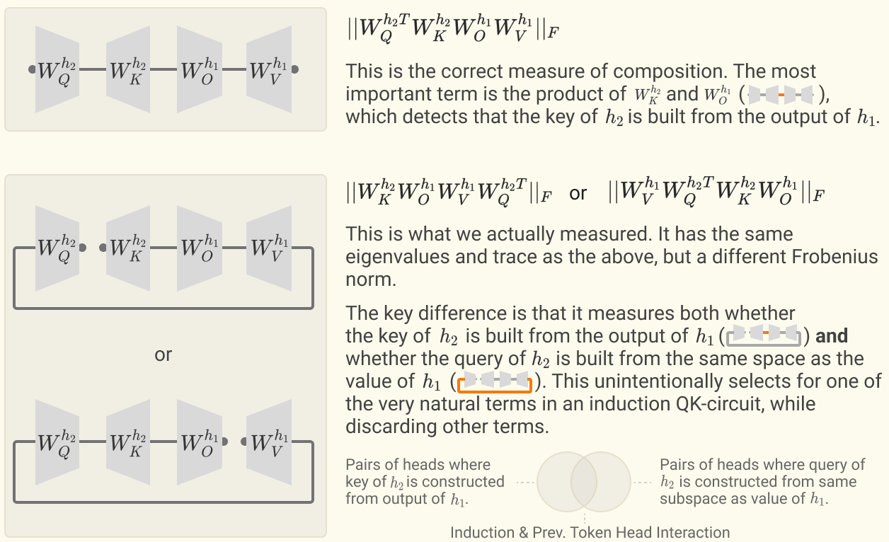

要理解这一错误的后果，最简单的办法或许是考虑归纳头与前一词元头（previous token head）的组合。我们意外算出的量衡量的是：归纳头的查询在多大程度上建立在“前一词元头把数据移入的那个子空间”之上。这恰恰是归纳头理应在前一词元的 K 组合项上做的事情，因此该量对这类组合响应极强，同时过滤掉了其他类型的组合。

尽管这凸显了归纳头组合（并且隐式计算出了某种相当有趣的东西），但它与我们本想计算的注意力头组合并不相同。

Bug 的影响

受此 bug 影响的只有一张示意图。原始图与修正后的图如下所示：

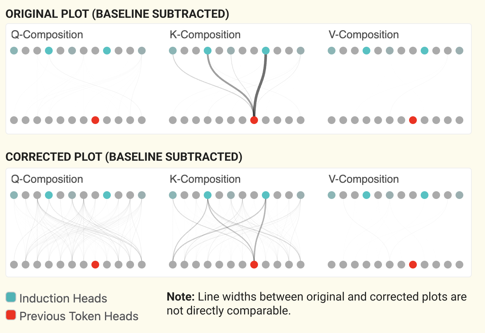

尽管与前一词元头的 K 组合的重要性保持不变，我们还是看到了一些额外的注意力头组合。主要新增之处在于：其中两个归纳头还依赖一个关注最后几个词元的头，而不仅仅是前一词元。这一额外的组合与我们此前的讨论一致——其他模型中的归纳头往往使用比与前一词元头的 “最小” K 组合更复杂的电路（参见 “归纳头的工作原理”）。

## 脚注

[^1]: 我们将在后续论文中更详细地探讨归纳头。

[^2]: 构建带残差流的模型可追溯到 Schmidhuber 研究组的早期工作，如高速公路网络（highway network）\cite{srivastava2015highway} 和 LSTM \cite{hochreiter1997long}，这些工作在更近期的残差网络架构 \cite{he2016deep} 中取得了巨大的成功。在 transformer 中，残差流向量常被称为 “embedding（嵌入）”。我们更偏好 “残差流” 这一术语，既因为它强调了残差的性质（我们认为这一点很重要），也因为我们相信残差流常常为当前词元（token）之外的词元划分子空间，这会打破 “embedding” 这一术语所暗示的直觉。

[^3]: 值得注意的是，完全线性的残差流在神经网络架构中非常罕见：即便是与它最接近、被广泛使用的 ResNet \cite{he2016deep}，也在其残差流上（或者说在每次访问残差流时）施加了非线性激活函数！

[^4]: 这里忽略了每层开头的层归一化；但忽略常数标量后，层归一化是一个常数仿射变换，可以并入线性变换。关于我们如何处理层归一化的讨论见附录。

[^5]: 注意，对于注意力层，有三种不同的输入权重：$W_Q$、$W_K$ 和 $W_V$。为简单和通用起见，我们在这里把层视为只有输入权重和输出权重。

[^6]: 我们对词元嵌入与解嵌入进行了 PCA 分析。对于 $d_\text{model}$ 较大的模型，谱迅速衰减，嵌入/解嵌入集中在总维度中相对较小的一部分上。为了判断它们占据的是相同还是不同的子空间，我们把归一化后的嵌入矩阵与解嵌入矩阵拼接起来并施加 PCA。这一联合 PCA 过程显示出 “混合” 维度与仅由一方使用的维度并存；仅由一方使用的维度的存在，可以被视为它们使用相同子空间程度的一种上界。

[^7]: 一些 MLP 神经元的输入权重与输出权重之间的余弦相似度为很大的负值，这可能表明它们在从残差流中删除信息。类似地，一些注意力头的 $W_OW_V$ 矩阵具有很大的负特征值，并且主要关注当前词元，可能充当删除信息的机制。值得注意的是，这些机制既可能是 “内存管理” 式的通用信息删除机制，也可能是仅在部分情况下运作的条件式信息删除机制。

[^8]: 如上所述，乘以输出矩阵常常被写成对全部头的拼接结果施加一次矩阵乘法；不过这个版本是等价的。

[^9]: 当我们说 $W_{OV}=W_O W_V$ 决定了注意力头在搬运信息时读取和写入残差流的哪个子空间时，我们指的是什么？考虑奇异值分解 $USV = W_{OV}$ 会有所帮助。由于 $d_{head} < d_{model}$，$W_{OV}$ 是低秩的，$S$ 中只有一部分对角元非零。右奇异向量 $V$ 描述被关注的残差流中哪个子空间被 “读入”（以某种方式存储为值向量），而左奇异向量 $U$ 描述它们被写入目标残差流的哪个子空间。

[^10]: 这与 Levy & Goldberg（2014）的一个观察相呼应：许多早期的词嵌入可以看作对数似然矩阵的矩阵分解。

[^11]: 一个有趣的推论是：尽管 $W_U$ 常被称为 “解嵌入（un-embedding）” 矩阵，但我们不应指望它是嵌入矩阵 $W_E$ 的逆。

[^12]: 我们用 “跳跃三元语法（skip-trigram）” 一词描述形如 “A… BC” 的序列，灵感来自 Mikolov 等人 \cite{mikolov2013linguistic} 在其经典词嵌入论文中对 “skip-gram” 一词的使用。

[^13]: 严格来说，它是从序列开头到目标词元之间所有可能的源词元的函数，因为 softmax 通过 QK 电路计算每个源词元的得分，然后取指数并归一化。

[^14]: 在层数多于一的模型中，我们会看到 QK 电路可能比 $W_E^T W_{QK}^h W_E$ 更复杂。

[^15]: 单层模型如何学会一个关注相对位置的注意力头？对于像 rotary \cite{su2021roformer} 这样显式编码相对位置的位置机制，答案很直接。然而，我们使用的机制与 \cite{press2020shortformer} 类似（就这一点而言，也与 \cite{vaswani2017attention} 类似）：每个词元索引都有一个影响键和查询的位置嵌入。假设这些嵌入要么被固定为正弦形式，要么模型学会了让它们呈正弦形式。注意，在这样的嵌入中，平移等价于乘以一个旋转矩阵。于是 $W_{QK}$ 可以通过适当地旋转包含正弦信息的维度，来选择任意的相对位置偏移。

[^16]: 在词元嵌入之前，我们把词元视为高维空间中的 one-hot 向量。logits（对数几率）也是向量。因此，我们可以在两个空间中考虑词元的线性组合。

[^17]: 特征值已被充分刻画的最接近的随机矩阵类别大概是 Ginibre 矩阵，其元素服从高斯分布，与我们初始化时的神经网络矩阵类似。实值 Ginibre 矩阵的特征值已知具有正负对称性，在实数附近有额外的概率质量，并在其附近存在 “排斥” 现象 \cite{tarnowski2021real}。当然，实际中我们处理的是矩阵的乘积，但经验上，在我们的随机初始化权重下，OV 电路的特征值分布似乎与 Ginibre 分布吻合。

[^18]: 非正交的特征向量可能具有反直觉的性质。如果想用特征向量来表示矩阵，就需要乘以特征向量矩阵的逆；在非正交情形下，这一操作的性态与朴素地把向量投影到特征向量上大不相同。

[^19]: 在这个特定模型中，似乎不存在显著的 V 组合或 Q 组合。

[^20]: 对于位置嵌入在残差流中可用（不同于 rotary 注意力）的模型，还有第二种实现归纳头的算法可用；参见我们关于 transformer 中位置嵌入与指针算术算法的直觉讨论。

## 参考文献

- [vaswani2017attention]: Vaswani, Ashish, Shazeer, Noam, Parmar, Niki, Uszkoreit, Jakob, Jones, Llion, Gomez, Aidan N, Kaiser, {\L}ukasz, Polosukhin, Illia, “Attention is all you need”, Advances in neural information processing systems, 2017
- [brown2020language]: Brown, Tom B, Mann, Benjamin, Ryder, Nick, Subbiah, Melanie, Kaplan, Jared, Dhariwal, Prafulla, Neelakantan, Arvind, Shyam, Pranav, Sastry, Girish, Askell, Amanda, others, “Language models are few-shot learners”, arXiv preprint arXiv:2005.14165, 2020
- [LaMDA]: Collins, Eli, Ghahramani, Zoubin, “LaMDA: our breakthrough conversation technology”, 2021
- [chen2021evaluating]: Chen, Mark, Tworek, Jerry, Jun, Heewoo, Yuan, Qiming, Pinto, Henrique Ponde de Oliveira, Kaplan, Jared, Edwards, Harri, Burda, Yuri, Joseph, Nicholas, Brockman, Greg, others, “Evaluating large language models trained on code”, arXiv preprint arXiv:2107.03374
- [adiwardana2020towards]: Adiwardana, Daniel, Luong, Minh-Thang, So, David R, Hall, Jamie, Fiedel, Noah, Thoppilan, Romal, Yang, Zi, Kulshreshtha, Apoorv, Nemade, Gaurav, Lu, Yifeng, others, “Towards a human-like open-domain chatbot”, arXiv preprint arXiv:2001.09977
- [rae2021scaling]: Rae, Jack W., Borgeaud, Sebastian, Cai, Trevor, Millican, Katie, Hoffmann, Jordan, Song, Francis, Aslanides, John, Henderson, Sarah, Ring, Roman, Young, Susannah, Rutherford, Eliza, Hennigan, Tom, Menick, Jacob, Cassirer, Albin, Powell, Richard, Driessche, George van den, Hendricks, Lisa Anne, Rauh, Maribeth, Huang, Po-Sen, Glaese, Amelia, Welbl, Johannes, Dathathri, Sumanth, Huang, Saffron, Uesato, Jonathan, Mellor, John, Higgins, Irina, Creswell, Antonia, McAleese, Nat, Wu, Amy, Elsen, Erich, Jayakumar, Siddhant, Buchatskaya, Elena, Budden, David, Sutherland, Esme, Simonyan, Karen, Paganini, Michela, Sifre, Laurent, Martens, Lena, Li, Xiang Lorraine, Kuncoro, Adhiguna, Nematzadeh, Aida, Gribovskaya, Elena, Donato, Domenic, Lazaridou, Angeliki, Mensch, Arthur, Lespiau, Jean-Baptiste, Tsimpoukelli, Maria, Grigorev, Nikolai, Fritz, Doug, Sottiaux, Thibault, Pajarskas, Mantas, Pohlen, Toby, Gong, Zhitao, Toyama, Daniel, d’Autume, Cyprien de Masson, Li, Yujia, Terzi, Tayfun, Mikulik, Vladimir, Babuschkin, Igor, Clark, Aidan, Casas, Diego de Las, Guy, Aurelia, Jones, Chris, Bradbury, James, Johnson, Matthew, Hechtman, Blake, Weidinger, Laura, Gabriel, Iason, Isaac, William, Lockhart, Ed, Osindero, Simon, Rimell, Laura, Dyer, Chris, Vinyals, Oriol, Ayoub, Kareem, Stanway, Jeff, Bennett, Lorrayne, Hassabis, Demis, Kavukcuoglu, Koray, Irving, Geoffrey, “Scaling Language Models: Methods, Analysis & Insights from Training Gopher”, Preprint, 2021
- [cammarata2020thread]: Cammarata, Nick, Carter, Shan, Goh, Gabriel, Olah, Chris, Petrov, Michael, Schubert, Ludwig, Voss, Chelsea, Egan, Ben, Lim, Swee Kiat, “Thread: Circuits”, Distill, 2020
- [srivastava2015highway]: Srivastava, Rupesh Kumar, Greff, Klaus, Schmidhuber, J{\"u}rgen, “Highway networks”, arXiv preprint arXiv:1505.00387, 2015
- [hochreiter1997long]: Hochreiter, Sepp, Schmidhuber, J{\"u}rgen, “Long short-term memory”, Neural computation, 1997
- [he2016deep]: He, Kaiming, Zhang, Xiangyu, Ren, Shaoqing, Sun, Jian, “Deep residual learning for image recognition”, Proceedings of the IEEE conference on computer vision and pattern recognition, 2016
- [mikolov2013linguistic]: Mikolov, Tom{\'a}{\v{s}}, Yih, Wen-tau, Zweig, Geoffrey, “Linguistic regularities in continuous space word representations”, Proceedings of the 2013 conference of the north american chapter of the association for computational linguistics: Human language technologies, 2013
- [voss2021visualizing]: Voss, Chelsea, Cammarata, Nick, Goh, Gabriel, Petrov, Michael, Schubert, Ludwig, Egan, Ben, Lim, Swee Kiat, Olah, Chris, “Visualizing Weights”, Distill, 2021
- [su2021roformer]: Su, Jianlin, Lu, Yu, Pan, Shengfeng, Wen, Bo, Liu, Yunfeng, “Roformer: Enhanced transformer with rotary position embedding”, arXiv preprint arXiv:2104.09864
- [press2020shortformer]: Press, Ofir, Smith, Noah A, Lewis, Mike, “Shortformer: Better language modeling using shorter inputs”, arXiv preprint arXiv:2012.15832
- [tarnowski2021real]: Tarnowski, Wojciech, “Real spectra of large real asymmetric random matrices”, arXiv preprint arXiv:2104.02584, 2021
- [kobayashi2020attention]: Kobayashi, Goro, Kuribayashi, Tatsuki, Yokoi, Sho, Inui, Kentaro, “Attention is not only a weight: Analyzing transformers with vector norms”, arXiv preprint arXiv:2004.10102
- [goh2021multimodal]: Goh, Gabriel, Cammarata, Nick, Voss, Chelsea, Carter, Shan, Petrov, Michael, Schubert, Ludwig, Radford, Alec, Olah, Chris, “Multimodal Neurons in Artificial Neural Networks”, Distill, 2021
- [nostalgebraist2020logitlens]: nostalgebraist, “interpreting GPT: the logit len”, 2020
- [jones2017tensor2tensor]: Jones, Llion, “Tensor2tensor transformer visualization”, 2017
- [vig2019multiscale]: Vig, Jesse, “A multiscale visualization of attention in the transformer model”, arXiv preprint arXiv:1906.05714, 2019
- [voita2019analyzing]: Voita, Elena, Talbot, David, Moiseev, Fedor, Sennrich, Rico, Titov, Ivan, “Analyzing multi-head self-attention: Specialized heads do the heavy lifting, the rest can be pruned”, arXiv preprint arXiv:1905.09418, 2019
- [clark2019does]: Clark, Kevin, Khandelwal, Urvashi, Levy, Omer, Manning, Christopher D, “What does bert look at? an analysis of bert's attention”, arXiv preprint arXiv:1906.04341, 2019
- [htut2019attention]: Htut, Phu Mon, Phang, Jason, Bordia, Shikha, Bowman, Samuel R, “Do attention heads in bert track syntactic dependencies?”, arXiv preprint arXiv:1911.12246, 2019
- [devlin2018bert]: Devlin, Jacob, Chang, Ming-Wei, Lee, Kenton, Toutanova, Kristina, “Bert: Pre-training of deep bidirectional transformers for language understanding”, arXiv preprint arXiv:1810.04805
- [jain2019attention]: Jain, Sarthak, Wallace, Byron C, “Attention is not explanation”, arXiv preprint arXiv:1902.10186, 2019
- [serrano2019attention]: Serrano, Sofia, Smith, Noah A, “Is attention interpretable?”, arXiv preprint arXiv:1906.03731, 2019
- [brunner2019identifiability]: Brunner, Gino, Liu, Yang, Pascual, Damian, Richter, Oliver, Ciaramita, Massimiliano, Wattenhofer, Roger, “On identifiability in transformers”, arXiv preprint arXiv:1908.04211
- [abnar2020quantifying]: Abnar, Samira, Zuidema, Willem, “Quantifying attention flow in transformers”, arXiv preprint arXiv:2005.00928
- [wiegreffe2019attention]: Wiegreffe, Sarah, Pinter, Yuval, “Attention is not not explanation”, arXiv preprint arXiv:1908.04626, 2019
- [rogers2020primer]: Rogers, Anna, Kovaleva, Olga, Rumshisky, Anna, “A primer in bertology: What we know about how bert works”, Transactions of the Association for Computational Linguistics, 2020
- [dong2021attention]: Dong, Yihe, Cordonnier, Jean-Baptiste, Loukas, Andreas, “Attention is not all you need: Pure attention loses rank doubly exponentially with depth”, arXiv preprint arXiv:2103.03404, 2021
- [shazeer2020talking]: Shazeer, Noam, Lan, Zhenzhong, Cheng, Youlong, Ding, Nan, Hou, Le, “Talking-heads attention”, arXiv preprint arXiv:2003.02436, 2020
- [dai2021knowledge]: Dai, Damai, Dong, Li, Hao, Yaru, Sui, Zhifang, Wei, Furu, “Knowledge neurons in pretrained transformers”, arXiv preprint arXiv:2104.08696
- [geva2020transformer]: Geva, Mor, Schuster, Roei, Berant, Jonathan, Levy, Omer, “Transformer feed-forward layers are key-value memories”, arXiv preprint arXiv:2012.14913
- [karpathy2015visualizing]: Karpathy, Andrej, Johnson, Justin, Fei-Fei, Li, “Visualizing and understanding recurrent networks”, arXiv preprint arXiv:1506.02078
- [radford2017learning]: Radford, Alec, Jozefowicz, Rafal, Sutskever, Ilya, “Learning to generate reviews and discovering sentiment”, arXiv preprint arXiv:1704.01444
- [cammarata2020curve]: Cammarata, Nick, Goh, Gabriel, Carter, Shan, Schubert, Ludwig, Petrov, Michael, Olah, Chris, “Curve Detectors”, Distill, 2020
- [zhou2014object]: Zhou, Bolei, Khosla, Aditya, Lapedriza, Agata, Oliva, Aude, Torralba, Antonio, “Object detectors emerge in deep scene cnns”, arXiv preprint arXiv:1412.6856
- [netdissect2017]: Bau, David, Zhou, Bolei, Khosla, Aditya, Oliva, Aude, Torralba, Antonio, “Network Dissection: Quantifying Interpretability of Deep Visual Representations”, Computer Vision and Pattern Recognition
- [morcos2018importance]: Morcos, Ari S, Barrett, David GT, Rabinowitz, Neil C, Botvinick, Matthew, “On the importance of single directions for generalization”, arXiv preprint arXiv:1803.06959
- [donnelly2019interpretability]: Donnelly, Jonathan, Roegiest, Adam, “On Interpretability and Feature Representations: An Analysis of the Sentiment Neuron”, European Conference on Information Retrieval, 2019
- [koh2017understanding]: P. W. Koh, P. Liang, “Understanding Black-box Predictions via Influence Functions”, International Conference on Machine Learning (ICML), 2017
- [basu2020influence]: Basu, Samyadeep, Pope, Philip, Feizi, Soheil, “Influence functions in deep learning are fragile”, arXiv preprint arXiv:2006.14651, 2020
- [simonyan2013deep]: Simonyan, Karen, Vedaldi, Andrea, Zisserman, Andrew, “Deep inside convolutional networks: Visualising image classification models and saliency maps”, arXiv preprint arXiv:1312.6034, 2013
- [zeiler2014visualizing]: Zeiler, Matthew D, Fergus, Rob, “Visualizing and understanding convolutional networks”, European conference on computer vision, 2014
- [springenberg2014striving]: Springenberg, Jost Tobias, Dosovitskiy, Alexey, Brox, Thomas, Riedmiller, Martin, “Striving for simplicity: The all convolutional net”, arXiv preprint arXiv:1412.6806, 2014
- [selvaraju2016grad]: Selvaraju, Ramprasaath R, Das, Abhishek, Vedantam, Ramakrishna, Cogswell, Michael, Parikh, Devi, Batra, Dhruv, “Grad-cam: Why did you say that? visual explanations from deep networks via gradient-based localization”, arXiv preprint arXiv:1610.02391, 2016
- [fong2017interpretable]: Fong, Ruth, Vedaldi, Andrea, “Interpretable Explanations of Black Boxes by Meaningful Perturbation”, arXiv preprint arXiv:1704.03296, 2017
- [kindermans2017patternnet]: Kindermans, Pieter-Jan, Sch{\"u}tt, Kristof T, Alber, Maximilian, M{\"u}ller, Klaus-Robert, D{\"a}hne, Sven, “PatternNet and PatternLRP--Improving the interpretability of neural networks”, arXiv preprint arXiv:1705.05598, 2017
- [sundararajan2017axiomatic]: Sundararajan, Mukund, Taly, Ankur, Yan, Qiqi, “Axiomatic attribution for deep networks”, arXiv preprint arXiv:1703.01365, 2017
- [ancona2019explaining]: Ancona, Marco, Oztireli, Cengiz, Gross, Markus, “Explaining deep neural networks with a polynomial time algorithm for shapley value approximation”, International Conference on Machine Learning, 2019
- [adebayo2018sanity]: Adebayo, Julius, Gilmer, Justin, Muelly, Michael, Goodfellow, Ian, Hardt, Moritz, Kim, Been, “Sanity checks for saliency maps”, arXiv preprint arXiv:1810.03292
- [kindermans2019reliability]: Kindermans, Pieter-Jan, Hooker, Sara, Adebayo, Julius, Alber, Maximilian, Schutt, Kristof T, Dahne, Sven, Erhan, Dumitru, Kim, Been, “The (un) reliability of saliency methods”, Explainable AI: Interpreting, Explaining and Visualizing Deep Learning, 2019
- [kokhlikyan2021investigating]: Kokhlikyan, Narine, Miglani, Vivek, Alsallakh, Bilal, Martin, Miguel, Reblitz-Richardson, Orion, “Investigating sanity checks for saliency maps with image and text classification”, arXiv preprint arXiv:2106.07475
- [poerner2018interpretable]: Poerner, Nina, Roth, Benjamin, Sch{\"u}tze, Hinrich, “Interpretable textual neuron representations for NLP”, arXiv preprint arXiv:1809.07291
- [bauerle2020what]: Bauerle, Alex, Wexler, James, “What does BERT dream of?”, 2020
- [erhan2009visualizing]: Erhan, Dumitru, Bengio, Yoshua, Courville, Aaron, Vincent, Pascal, “Visualizing higher-layer features of a deep network”, University of Montreal, 2009
- [nguyen2015deep]: Nguyen, Anh, Yosinski, Jason, Clune, Jeff, “Deep neural networks are easily fooled: High confidence predictions for unrecognizable images”, Proceedings of the IEEE Conference on Computer Vision and Pattern Recognition, 2015
- [mordvintsev2015inceptionism]: Mordvintsev, Alexander, Olah, Christopher, Tyka, Mike, “Inceptionism: Going deeper into neural networks”, Google Research Blog, 2015
- [olah2017feature]: Olah, Chris, Mordvintsev, Alexander, Schubert, Ludwig, “Feature Visualization”, Distill, 2017
- [zimmermann2021well]: Zimmermann, Roland, Borowski, Judy, Geirhos, Robert, Bethge, Matthias, Wallis, Thomas, Brendel, Wieland, “How Well do Feature Visualizations Support Causal Understanding of CNN Activations?”, Advances in Neural Information Processing Systems
- [smilkov2017playground]: Smilkov, Daniel, Carter, Shan, Sculley, D, Vi{\'e}gas, Fernanda B, Wattenberg, Martin, “TensorFlow Playground”, 2017
- [carter2019activation]: Carter, Shan, Armstrong, Zan, Schubert, Ludwig, Johnson, Ian, Olah, Chris, “Activation Atlas”, Distill, 2019
- [olah2018the]: Olah, Chris, Satyanarayan, Arvind, Johnson, Ian, Carter, Shan, Schubert, Ludwig, Ye, Katherine, Mordvintsev, Alexander, “The Building Blocks of Interpretability”, Distill, 2018
- [carter2016experiments]: Carter, Shan, Ha, David, Johnson, Ian, Olah, Chris, “Experiments in Handwriting with a Neural Network”, Distill, 2016
- [yosinski2015understanding]: Yosinski, Jason, Clune, Jeff, Nguyen, Anh, Fuchs, Thomas, Lipson, Hod, “Understanding neural networks through deep visualization”, arXiv preprint arXiv:1506.06579
- [alammar2020explaining]: Alammar, J, “Interfaces for Explaining Transformer Language Models”, 2020
- [tenney2020language]: Tenney, Ian, Wexler, James, Bastings, Jasmijn, Bolukbasi, Tolga, Coenen, Andy, Gehrmann, Sebastian, Jiang, Ellen, Pushkarna, Mahima, Radebaugh, Carey, Reif, Emily, others, “The language interpretability tool: Extensible, interactive visualizations and analysis for NLP models”, arXiv preprint arXiv:2008.05122
- [aken2020visbert]: Aken, Betty van, Winter, Benjamin, L{\"o}ser, Alexander, Gers, Felix A, “Visbert: Hidden-state visualizations for transformers”, Companion Proceedings of the Web Conference 2020
- [pearce2021what]: Adam Pearce, “What Have Language Models Learned?”, 2021
- [hoover2019exbert]: Hoover, Benjamin, Strobelt, Hendrik, Gehrmann, Sebastian, “exbert: A visual analysis tool to explore learned representations in transformers models”, arXiv preprint arXiv:1910.05276
- [wang2021dodrio]: Wang, Zijie J, Turko, Robert, Chau, Duen Horng, “Dodrio: Exploring Transformer Models with Interactive Visualization”, arXiv preprint arXiv:2103.14625
- [so2021primer]: So, David R, Ma{\'n}ke, Wojciech, Liu, Hanxiao, Dai, Zihang, Shazeer, Noam, Le, Quoc V, “Primer: Searching for efficient transformers for language modeling”, arXiv preprint arXiv:2109.08668
