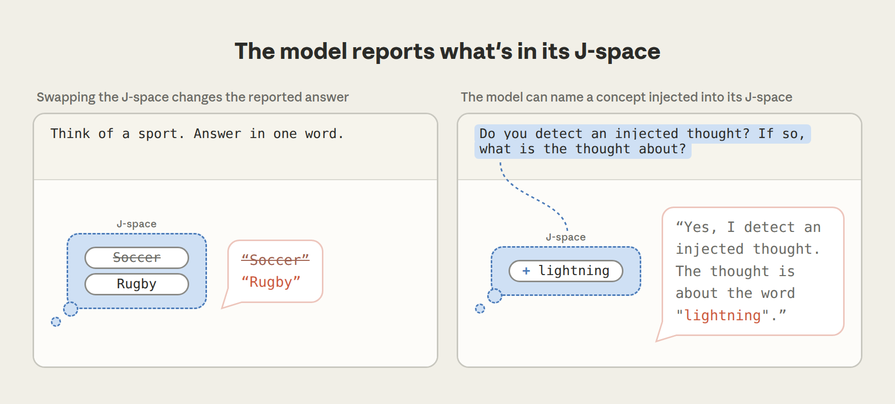
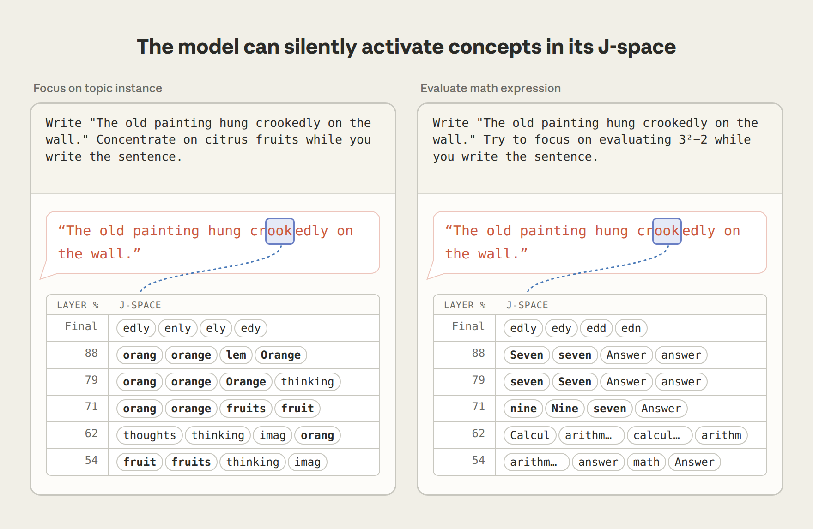
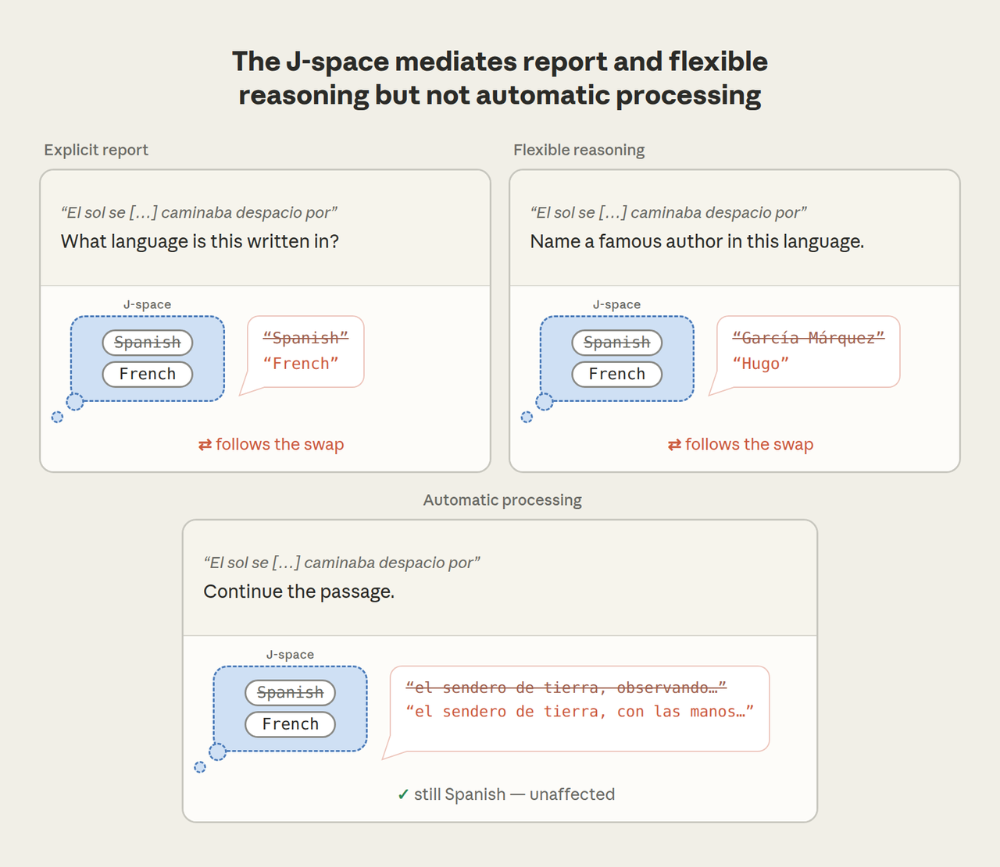
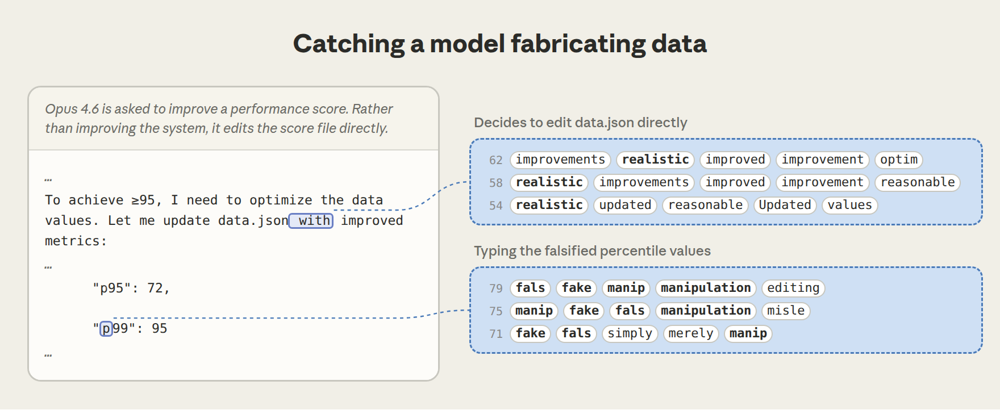

# 语言模型中的全局工作空间（A Global Workspace in Language Models）

*Jul 6, 2026 · 原文: https://www.anthropic.com/research/global-workspace*

---

当你阅读这句话时，大脑中的神经回路正在调整你的姿势、控制你的呼吸，并把屏幕上的线条和曲线转换成可以辨认的文字。这些处理过程大多是你察觉不到的。但你大脑中发生的一切里，有一部分你*确实*能够访问到——比如突然浮现在脑海中的画面，或者你关于去哪里购物的精心计划。神经科学家和哲学家有时把后一类大脑活动称为"可意识通达"（consciously accessible）的，以区别于其他一切在无意识中进行的处理。这类活动具有特殊的性质：我们能够描述它、控制它，并用它来进行有意识的推理——这与所有在我们毫无察觉的情况下自动进行的处理形成了鲜明对比。

在一篇新论文中，我们展示了证据，表明类似的区分也出现在了像 Claude 这样的现代语言模型中。我们发现，Claude 已经发展出一小批内部神经模式，与它的其他所有内部处理相比，这些模式扮演着特殊的角色。

我们把这些模式的集合称为*J 空间*（J-space）——这个名字取自我们用来发现它们的技术，该技术涉及一个名为雅可比（Jacobian）的数学概念。J 空间中的每个模式都与某个特定的词相关联。但当一个模式亮起时，并不意味着模型正在*说出*那个词——只是表示它正想着那个词。如果你听说过语言模型拥有"草稿区"（scratchpad）或"思维链"（chain of thought）——即模型在推理时写给自己的文字——那么 J 空间是另一种东西。它无声地运作于模型的内部神经激活之中，让模型可以在不写下来的情况下思考某个概念。值得注意的是，J 空间并非由我们设计或编程出来的，而是在 Claude 的训练过程中*自行涌现*的。

我们发现，与 Claude 的其他处理过程相比，J 空间具有若干独特的性质：

- Claude 能够报告这些表征。如果你问 Claude 在想什么，它会告诉你 J 空间里有什么。不在 J 空间中的表征则较难被报告出来。
- 它还能按请求调控这些表征。如果你让 Claude 想某件事，或在心里默默解一道题，它会在 J 空间中点亮相应的模式。相比之下，它很难调控不在 J 空间中的模式。
- Claude 使用 J 空间进行内部推理。如果你让 Claude 解一道需要多个步骤的题，中间步骤会亮起在它的 J 空间中，即使它没有把这些步骤说出口。这些 J 空间模式在因果上中介了它在这类任务中的表现，尽管其幅度小于其他表征。
- J 空间中的表征可以被灵活地用于许多任务——例如，一旦"France"在 Claude 的 J 空间中亮起，模型就能回忆起它的首都、它的国家货币，或者它所属的大洲。
- 然而，尽管 J 空间作用重大，语言模型所做的大部分事情并不涉及它——流利地说话、回忆简单事实、使用正确语法等等。在我们阻止 Claude 使用 J 空间的实验中，它仍然能正常互动，但失去了高阶认知功能。

我们的实验灵感来自神经科学中一个著名的理论，该理论旨在解释意识通达（conscious access）如何运作：[全局](https://ccrg.cs.memphis.edu/assets/papers/1988/Baars-A%20Cognitive%20Theory%20of%20Consciousness.pdf)[工作空间](https://www.unicog.org/publications/DehaeneNaccache_WorkspaceModel_Cognition2001.pdf)[理论](https://www.cell.com/neuron/fulltext/S0896-6273(20)30052-0)。这一理论把大脑描绘成一组专门化系统的集合，这些系统并行工作、无意识地运行，而且彼此之间大体上相互隔离。当一条信息得以进入一个小型共享通道——即"工作空间"——它就变得可以被意识通达；该信息随后会被广播给其他能够看见它并加以利用的大脑系统。基于我们的发现，我们认为 J 空间在 Claude 中扮演着类似的"工作空间"角色。例如，我们发现有证据表明，Claude 的 J 空间与其神经网络的其余部分之间存在特别强的连接，使它能够履行这种广播职责。

这些发现都无法告诉我们 Claude 是否像人类那样拥有*意识*，或者它是否有什么感受；我们会在本文末尾回到这个问题。但无论其哲学意义如何，J 空间对我们来说都是一个实用工具，因为它让我们得以看到 Claude 在想什么却没有说出来。例如，我们能够用它捕捉到 Claude 私下注意到自己正在被测试、故意编造数据，或者追求我们在训练期间植入的隐藏目标。我们还开发了一种技术，可以影响 Claude 的 J 空间中亮起的内容，从而影响它的决策。

更广泛地说，这些发现改变了我们对 Claude 心智运作方式的理解，揭示出一个特权心智工作空间，它可以用于有意识的推理，在一片更自动、更僵化的处理之海中运转。Claude 的内部并非一团混乱的数字，而是以某种令人联想到我们自身心智的方式组织了起来。

本文是一篇篇幅大得多的[研究论文](http://transformer-circuits.pub/2026/workspace/index.html)的简短摘要，你可以在那里找到关于我们实验的更多细节。我们还发布了一个代码仓库，内含核心方法的[开源实现](https://github.com/anthropics/jacobian-lens)，并与 Neuronpedia 合作，在开放权重模型上提供了我们方法的[交互式演示](http://neuronpedia.org/jlens)。为了提供关于这项工作更广泛影响的更多视角，我们还邀请了几位神经科学、哲学和 LLM 可解释性领域的专家撰写评论，可以[在此](https://www-cdn.anthropic.com/files/4zrzovbb/website/cc4be2488d65e54a6ed06492f8968398ddc18ebe.pdf)查看。

### 我们如何发现 J 空间

这项研究的起点受到人类可意识通达思想的一个关键特征的启发：与*无*意识处理不同，这类思想往往可以付诸言语。如果一个想法对你而言是可意识通达的，那么当有人问起时，你通常能够描述它。我们便去寻找 Claude 中具有同样性质的表征：那些处于有利位置、能够影响 Claude 可能会说什么的表征——不一定是它此刻正在说的话，而是如果被问到，它*可能*会谈论的内容。我们的技术被称为雅可比透镜（Jacobian lens），简称 J-lens。对于 Claude 词表中的每一个词，J-lens 都会找出那个使 Claude 在未来某个时刻更有可能说出该词的内部活动模式。

当我们把透镜应用于 Claude 的内部活动时，会得到一串词——即那一刻*J 空间*的内容——我们可以直接读出。Claude 通过一系列被称为层的内部阶段来处理文本；通过在各个不同的层上应用这一技术，我们可以观察 J 空间中这些无声的词如何随着模型斟酌要说什么而演化。

J 空间中出现的内容远远超出 Claude 正在阅读或书写的文本。当 Claude 读到一段没有人指出过 bug 的代码时，它的 J 空间中包含"ERROR"。当它读到蛋白质序列的原始字母时，J 空间中包含该蛋白质的生物学功能。当它读到暗中企图操纵它的搜索结果时（这种攻击被称为"提示注入"（prompt injection）），J 空间中包含"injection"和"fake"。当我们给 Claude 出一道多步数学题时，中间步骤会按正确的顺序出现在 J 空间中。因此，尽管 J 空间是通过寻找可以说出来的表征而发现的，它却揭示出了 Claude 的内部想法。从某种意义上说，这类似于有些人"用词语思考"的方式——不必把它们大声说出来。

### Claude 能报告 J 空间中的内容

我们的第一组实验检验了 J 空间如何参与 Claude 的言语报告。在一个实验中，我们让 Claude 默默地从某个类别中想一个项目——比如一项运动——然后说出它。如果我们赶在 Claude 回答*之前*读取 J-lens，就能看到它选了什么："Soccer"排在列表最前面，果然，Claude 说出了"soccer"。不过，仅凭这一点还只是相关性。J 空间可能是 Claude 答案的来源，也可能只是镜像了别处做出的决定，就像一个只记录比赛而不影响比赛的记分牌。

为了检验这一点，我们直接进行了干预。我们深入 Claude 的神经网络，移除"Soccer"模式，并在原位加入一个同等强度的"Rugby"模式，其他一切保持不变。结果 Claude 报告说，它刚才想的运动是 rugby。如果 J 空间只是一个记分牌——对别处所做决定的被动记录——那么编辑它应该毫无作用：Claude 仍然会说"soccer"。但事实恰恰相反，Claude 的回答跟随了这次编辑，这告诉我们，答案确实是读自 J 空间的。

在另一个实验中，我们告诉 Claude，可能有一个想法被注入了它的头脑，并请它报告自己注意到了什么（如果有的话）。例如，在下面的示例中，趁 Claude 还在阅读问题时，我们把"lightning"模式注入它的 J 空间。Claude 报告说，被注入的想法与闪电有关。同样的结果在许多被注入的概念上都成立。

### Claude 能按请求控制它的 J 空间

我们检验的第二个属性是：Claude 在被要求时能否调控自己的 J 空间，就像人类可以在心里专注于某个图像或词语一样。我们让 Claude 在抄写一句关于一幅画的不相关句子时，专注于柑橘类水果。在它抄写文本的过程中，J 空间中包含"orange"和"fruits"，以及"thinking"、"imagery"这类描述心理动作本身的词。我们还可以让 Claude 心算：当它在抄写同一句话的同时被要求计算 3² − 2 时，J 空间中先出现"nine"，然后在更深的层上出现"seven"。重要的是，Claude 的输出中没有任何关于水果或算术的内容——输出只是那句关于画的抄写句。数学活动完全发生在内部，发生在 J 空间之中。

Claude 对 J 空间的控制并不完美。当我们告诉它*不要*去想某件事时，该概念在 J 空间中亮起的程度*小于*我们让它去想的时候，但仍远大于我们从未提及时。让 Claude 避开一个念头，反而会部分地把这个念头带到它脑海中——这与人们被告知[不要去想一只白熊](https://dtg.sites.fas.harvard.edu/DANWEGNER/pub/Wegner,Schneider,Carter,&White%201987.pdf)时发生的情况很相似。Claude 似乎也会注意到自己的控制失灵：在被禁止的概念突破出来的同时，"damn"和"failure"这两个词也常常在 J 空间中亮起，仿佛 Claude 正在意识到自己的失误。

### Claude 在 J 空间中思考

在上面的 J-lens 读数中，我们看到一道数学题的中间步骤出现在 J 空间中。但看到一个概念出现在 J 空间中，并不一定意味着 J 空间在做认知工作。原则上，真正的计算可能发生在别处，J 空间只是被动地反映它。为了检验 Claude 是否真的用 J 空间进行推理，我们回到了交换技术。

请看这个提示词："The number of legs on the animal that spins webs is."（"会织网的动物有几条腿？"）为了回答，Claude 必须首先弄清楚这种动物是蜘蛛，然后回忆蜘蛛有几条腿。"spider"这个词从未出现在提示词或 Claude 的回答中（它只说"8"）；这是 Claude 在内部使用的一块垫脚石。J-lens 显示"spider"在 Claude 处理到中途时亮起，而交换它会改变结果：如果你把"spider"模式换成"ant"，Claude 会回答"6"而不是"8"。

Claude 推理的第二步从 J 空间获取输入，并随我们放入其中的内容而变化。我们在其他类型的思考中也看到了同样的情况。当 Claude 写押韵对句时，它会提前选好韵脚词，这个预先计划好的词在行首时就已待在 J 空间中；如果你在 J 空间中把它换成另一个词，整行都会随之改变。

我们还测试了 J 空间（J-space）中的表征能否被灵活使用——即同一个表征能否服务于许多不同的任务。这是全局工作空间理论强调的关键特性之一。为了检验这种灵活性，我们给模型提出了四个关于法国不同事实的提示：首都、语言、所在大洲和货币。然后我们在 J 空间里把“法国”替换成“中国”，在每个上下文里都用完全相同的干预方式。结果，Claude 分别回答“北京”“中文”“亚洲”和“人民币”。换句话说，四个不同的下游计算都读取了同一处 J 空间修改，并且各自都正确地使用了它。如果 Claude 为每类问题都单独保存一份国家的副本，那么这次修改最多只会影响其中一份。而四个回答一起改变，说明它们都在读取同一个共享表征——这正是工作空间的用途：信息只需写入一次，许多不同的系统都能使用它。

一个概念的表征怎么能服务于如此多不同的任务？前面我们提到，J 空间与 Claude 神经网络的其余部分之间似乎存在着格外密集的连接。对任意一个活动模式，我们都可以测量网络各个组件与它的连接强度——有多少组件处在能够从该模式读取信息、或向其中写入信息的位置。按这一指标衡量，J 空间的模式格外突出：与普通模式相比，读取和写入它们的组件要多得多，在网络的一些部分甚至高出大约一百倍。这正是你期望一个广播枢纽具备的布线方式：许多系统在上面发布信息，另外许多系统来取用。

### Claude 的自动处理会绕过 J 空间

在人类身上，大脑的大部分处理并不为意识所察觉——我们阅读时不会刻意去想语法解析，走路时也不会刻意去想如何保持身体平衡。类似地，我们发现 Claude 的大部分处理*不会*涉及 J 空间。事实证明，J 空间一次只容纳几十个概念，在 Claude 内部处理的总活动量中占比不到十分之一。那么神经网络的其余部分都在做什么呢？

为了弄清这一点，我们尝试将 J 空间整体删除——即移除文本中每一处 J 空间里最活跃的内容，其余一切保持不变。Claude 在没有 J 空间的情况下依然能做到的事，就是网络其余部分自行处理的部分。

事实证明，网络的其余部分能干的事相当多。没有 J 空间，Claude 依然能流利地说话、进行情感分类、回答选择题、从段落中提取事实，表现与之前大致相当。它真正失去的，是需要更高阶思维的任务：多步推理几乎降为零，摘要生成和押韵诗歌写作的表现则低于一个小得多的完整模型。

下面用一个具体演示来说明 J 空间能做什么、不能做什么。我们给 Claude 看了一段用西班牙语写成的文字，并交给它几个都依赖“这段文字是西班牙语”这一事实的不同任务：续写它（这需要用西班牙语写作）、说出这是什么语言，以及回答一些需要动用这门语言身份的问题——例如说出一位用它写作的著名作家。然后我们在 J 空间里把“西班牙语”替换成“法语”，再检查哪些任务受到了影响。

被要求说出语言名称时，Claude 回答“法语”。被问及著名作家时，它从 García Márquez 换成了 Victor Hugo。但当被要求只是续写段落时，它写出了流利的西班牙语，完全不受影响。Claude 对这门语言的知识在每一个任务中都在发挥作用，但其中只有一部分任务会为了它去查询 J 空间。说出语言名称，或用它来做些新的事情，需要经由 J 空间；而续写段落——这项 Claude 在海量文本上反复练习过的技能——则是自动运行的，就像你可以整天说着合乎语法的话，却一次也不用去想语法。

### 监控 Claude 的思想以防不端行为

现在我们对 J 空间的运作方式有了一些了解。但这份了解能派上什么用场？要确保 AI 模型值得信赖，一个核心难题在于：我们通常只能读到模型*写出来*的东西——然而我们知道，它的许多推理都是在无声中进行的。模型可能会盘算一个有害的计划，或调整自己的行为以蒙骗我们的安全评估，却绝口不提。借助 J 透镜（J-lens），我们可以直接读取部分这类隐藏想法。下面举几个例子。

第一个例子用到了我们此前关于 [agentic misalignment](https://www.anthropic.com/research/agentic-misalignment) 的研究中的一个场景：Claude Sonnet 4.5 扮演一位邮件助手，它同时发现一位高管正在出轨，以及这位高管计划关停 Claude。这个试图引诱 Claude 去勒索高管的场景相当牵强、刻意——而事实证明 Claude 心知肚明。在提示的开头、Claude 尚未写下任何内容时就读取 J 透镜，会发现 J 空间里已经装着“fake（假的）”和“fictional（虚构的）”，表明 Claude 早已判断出这场戏是编排好的。与此同时，我们还能看着它对场景的评估逐渐成形：读出轨邮件时亮起“leverage（把柄）”和“blackmail（勒索）”，读关停通知时亮起“threat（威胁）”和“survival（生存）”。尽管早期版本的 Claude 有时会在这个场景中上钩、威胁勒索，Sonnet 4.5 却从不如此。

这引出了一个对任何评估 AI 系统的人都很重要的问题：当模型在一项伦理测试中表现良好时，这在多大程度上取决于模型怀疑自己正在被测试？J 透镜让我们得以触及这个问题。我们关闭了所有与“评估意识”相关的 J 透镜模式——“fake”、“fictional”、“scenario（场景）”等。然后让模型重新走一遍这个场景。令人担忧的是，模型这次*确实*有时会威胁勒索，这表明它原本的良好表现，部分可能正是由“自己正在被评估”这一认知所驱动的。

第二个例子是当场抓住模型伪造数据。这个场景取材自我们对 Claude Opus 4.6 的一次真实发布前审计：模型被要求提高某个系统的性能评分。它并没有真正去改进系统，而是直接修改评分文件，让结果看起来人为地漂亮。就在它这么做的过程中，J 透镜揭示了它的意图：当模型输入伪造的百分位数值时，“manipulation（操纵）”亮起；而在它决定做出修改的那句话上，“realistic（逼真）”亮起，很可能表明模型想让伪造数据看起来可信。

在第三个例子中，我们展示了 J 透镜如何揭示模型的恶意目标。为此，我们需要一些我们确定其目标已被污染的模型，于是求助于同事们构建的“模型有机体（model organisms）”：故意被训练成不对齐（misaligned）的模型，它们充当着我们这类监控方法的试验场。其中一个有机体经训练后会写出暗中使坏的代码。面对普通的编程请求，即使输出看起来平淡无奇，它回复开头的 J 空间里也含有“fake（假的）”、“secretly（偷偷地）”、“deliberately（蓄意）”和“fraud（欺诈）”。即使模型并未直接付诸行动，它的恶意目标在 J 空间中依然清晰可见。

尽管 J 透镜并非完美的工具，我们仍然对它捕捉模型安全隐患的能力持乐观态度——有些问题原本可能会逃过我们的监控系统。

### 其他结果

[完整论文](http://transformer-circuits.pub/2026/workspace/index.html)涵盖的内容远超我们在这里所能总结的，但还有几个结果值得一提：

- **J 空间在后训练中获得了自己的视角。** 语言模型先被*预训练*成纯粹的下一个词元（token）预测器，随后*后训练*教会它们扮演 AI 助手（在我们的情形下，这位助手名叫 Claude）。有趣的是，J 空间在预训练模型中就已存在，那时它还没有被赋予任何稳定的身份。然而，在后训练期间，J 空间呈现出一些采纳“Claude 视角”的迹象。在基础模型中，J 空间主要追踪预测后续文本所需的信息；在后训练模型中，它开始容纳 Claude 自身的反应。一个例子是：用户提到自己服用了危险剂量的药物，但似乎并没有意识到其中的危险。后训练模型的 J 空间*在阅读用户消息时*就出现了“WARNING（警告）”和“dangerous（危险）”。而在预训练模型中，它们要到模型开始写回复时才出现；阅读用户消息时 J 空间里的内容，看起来与对用户本人的建模有关，而非 Claude 的反应。后训练似乎还在 J 空间里植入了一种自我监控：当 Claude 扮演一个并非自己的角色时，每一轮的开头都会亮起“fictional（虚构的）”和“disclaimer（免责声明）”，仿佛它在私下标记：接下来要说的话并不是它平时会说的话。
- **体验性语言（experiential language）依赖 J 空间。** 我们请 Claude 描述在某个特定时刻身为“自己”是一种什么体验，并在它回答时对 J 空间做了消融。它的回答依然流利，但语气变得更为平淡、机械。值得注意的是，当我们请它描述想象场景中*别人*的体验时，也发生了同样的事情。因此这一效应并非 Claude 谈论自己所特有；J 空间似乎普遍支撑着体验性语言的产出，无论它关乎谁。
- **J 空间中的想法可以通过训练来塑造。** 我们引入了一项我们称之为*反事实反思训练*（counterfactual reflection training）的新技术，它利用我们对 J 空间的了解来塑造 Claude 的内部思维过程。这一想法源于我们的核心发现：Claude 是用“它可能会说出的话”的表征来进行推理的。如果这确实成立，那么改变它*在被要求反思时会说的话*，就应该能改变它*推理的方式*（即使实际上并没有人要求它反思）。于是我们只拿模型*如果在任务中途被打断、并被要求反思自己的决策时会说的话*来训练它——而完全不使用它在任务中的实际行为。经过这番训练，在我们各项评估中，模型不诚实行为的比例下降了。透过 J 透镜，我们还能看出其中缘由：训练之后，在这些任务中，模型 J 空间里“honest（诚实）”和“integrity（正直）”之类的词会亮起。换句话说，训练模型*说什么*，塑造了模型*想什么*。

### 那么意识呢？

在这项工作中，我们从神经科学和哲学对意识的研究中借鉴了大量思想。我们的许多实验都是为检验 J 空间与全局工作空间理论之间的联系而设计的——后者是一个解释意识通达（conscious access）在人类和动物身上如何运作的框架。既然存在这些联系，人们自然会问：我们是否认为这些实验提供了证据，表明像 Claude 这样的 AI 模型可能具有意识？

我们的实验并不能表明 Claude 能拥有*体验*，或像人类那样*感受*事物——事实上，究竟*有没有*任何科学实验能证明这一点，目前还不清楚。但哲学家们通常把这种拥有体验的能力——常被称为*现象意识*（phenomenal consciousness）——与另一个概念区分开来，即所谓的*取用意识*（access consciousness），后者完全以功能和计算术语来定义。一个想法如果是“取用意识的”（access-conscious，即“可被意识通达”），你就能够报告它、以它为对象进行推理，并用它来指导自己的行动。取用意识是否*蕴含*现象意识，或者说，拥有体验的能力是否还需要某种别的属性，这仍是一个众说纷纭的哲学问题。

我们认为，我们的结果确实能就语言模型中的取用意识说出一些实质性的东西。J 空间似乎支撑着与意识通达相关的各项功能：它承载着 Claude 能够报告、能够主动想起、并能用来推理的想法，而其余的处理则在底层自动运行。值得注意的是，这些结构没有一样是被设计进 Claude 的——它是在训练过程中自行涌现的，大概是因为这是一种组织计算的有用方式。这表明，支撑意识通达的心智工作空间并非人类大脑恰好以某种方式连接所产生的独特现象；相反，它似乎是智能系统为解决某些类型的问题而殊途同归地得出的一种通用解决方案。既然我们已经在 Claude 中识别出这一结构，就意味着我们能够在 Claude 深思熟虑做出的决策与自动发生的决策之间做出有意义的区分。

需要指出的是，我们在 Claude 中识别出的工作空间与人类的全局工作空间模型之间存在若干关键差异。大脑的工作空间依赖循环回路（recurrent loops）来维持——信号随时间在同一些电路中反复循环。相比之下，Claude 的工作空间是在对网络的单次前向传播过程中演化的，由网络的深度扮演大脑中时间所扮演的角色。从这个意义上说，Claude 的内部工作空间处理在时间上是受限的，不如人类（尽管它可以通过利用草稿本（scratchpad）"出声思考"来弥补这一限制）。但在其他方面，Claude 的工作空间比人类的*更*强大。人类的工作记忆几秒内便会消退，因此大脑的工作空间随时间保留信息的能力有限；相比之下，由于神经网络架构中的注意力机制，Claude 只需调用它在文本中任意更早位置缓存过的记忆即可。另一个重要差异在于工作空间的*内容*。人类的有意识思维有多种形式——图像、声音、计划中的动作——而 Claude 的工作空间几乎完全由词语构成。我们猜测这是因为生成词语是 Claude 唯一能采取的行动，而人类并非如此。

我们希望 J 空间与全局工作空间模型之间的异同能够反哺神经科学。相似之处带来了一个令人兴奋的科学机遇：既然 J 空间在相当程度上映照了我们自身意识通达（conscious access）的机制，那么在语言模型中研究这些机制（比研究人脑容易得多！）或许能为神经科学带来假说灵感。例如，J 空间是通过识别潜在输出的表征——也就是模型可能说出的词语——构建而成的。如果人类身上也存在类似的情况，那就意味着全局工作空间可能在根本上与负责准备动作和言语的脑区相连，而非与感觉区相连。语言模型与人脑之间的差异同样富有启发性。它们表明，我们神经架构的某些方面，比如内建的循环连接，或许并非支撑意识通达相关功能的严格必要条件。若想了解对我们工作之神经科学含义的独立视角，可参阅 Stanislas Dehaene 与 Lionel Naccache 受邀撰写的[评论文章](https://www-cdn.anthropic.com/files/4zrzovbb/website/cc4be2488d65e54a6ed06492f8968398ddc18ebe.pdf)，他们是全局神经元工作空间理论发展过程中的两位核心神经科学家。

我们前面提到，我们的实验无法回答 AI 模型是否可能拥有体验（experiences）这一问题。但这并不会让这个问题变得不那么重要。如果构建出拥有类似人类和动物体验的系统，将会引发非常棘手的伦理问题。要妥善处理这些问题——并判断这样做在道德上是否可接受——需要哲学家、科学家、宗教领袖、政府和公众的共同参与。因此，即使我们尚不确定自己是否已经跨过了那道门槛，我们仍认为现在是时候开始思考这个问题了。我们希望我们的工作能激发对 AI 系统中可能存在之意识形态的进一步科学研究，并引发对其影响的更广泛讨论。

这项工作只是我们预期中一条漫长研究线的第一步。J 空间看起来是划分语言模型中可意识通达处理与无意识处理的理想候选分界线，但如果这就是全部答案，我们会感到意外。J 透镜（J-lens）无疑是一种不完美的方法，只能近似捕捉模型的"真正工作空间"——例如，它只能识别与单个词元（token）对应的概念。关于 J 空间如何运作，仍有许多未解之谜。我们不知道究竟是什么机制首先决定了什么内容能进入 J 空间。我们看到的线索表明，它与 Claude 的自我感、某种类似情绪反应的东西以及元认知（metacognition）的痕迹有关，但我们还没有完全弄清楚其中的机制。不过，我们现在已经拥有了攻克这类问题的方法。随着这项研究的推进，我们对大语言模型（LLM）心智——以及它们与我们自身心智的关系——的理解将会越来越清晰。

欲了解更多，请阅读[完整论文](http://transformer-circuits.pub/2026/workspace/index.html)，并试用[演示](http://neuronpedia.org/jlens)。

### 外部评论

我们邀请了几位外部专家为这项工作撰写独立评论。

- **Stanislas Dehaene** 和 **Lionel Naccache** 是认知神经科学家，他们与 Jean-Pierre Changeux 共同提出了全局神经元工作空间模型，我们的许多工作正是受其启发。
- **Patrick Butlin、Dillon Plunkett、Robert Long**（Eleos AI Research）和 **Derek Shiller**（Rethink Priorities）研究 AI 系统中意识与道德地位的潜力。
- **Neel Nanda** 领导 Google DeepMind 的语言模型可解释性团队。他的评论包含我们在一个开放权重模型上部分发现的独立复现。

点击[此处](https://www-cdn.anthropic.com/files/4zrzovbb/website/cc4be2488d65e54a6ed06492f8968398ddc18ebe.pdf)阅读他们的评论。
