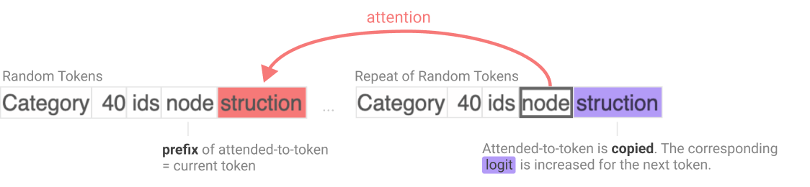
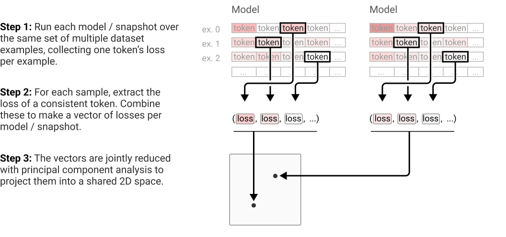
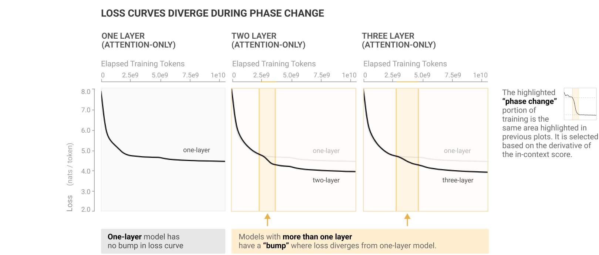
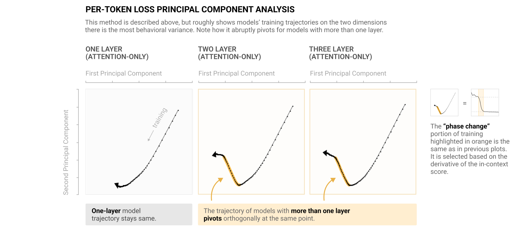
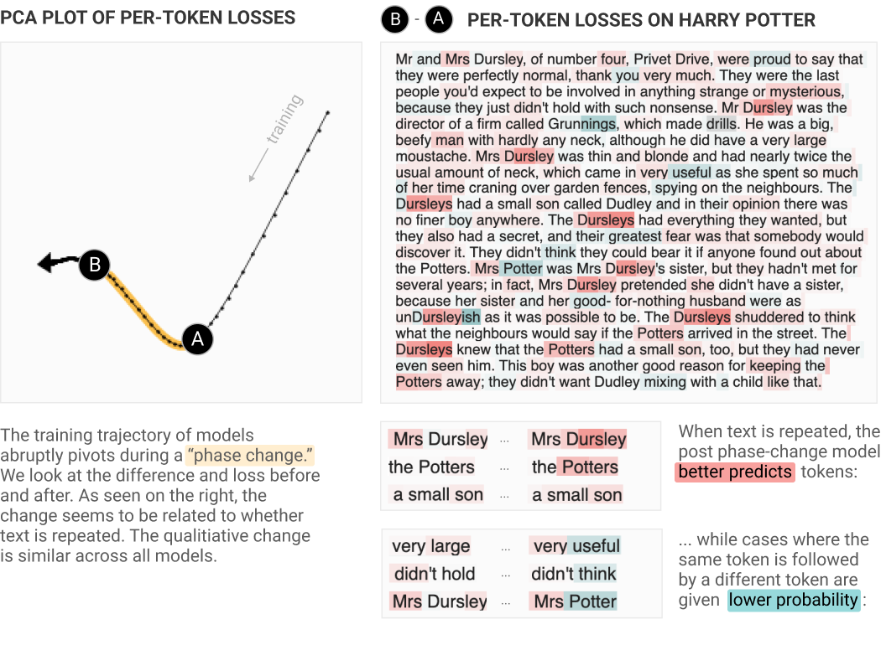
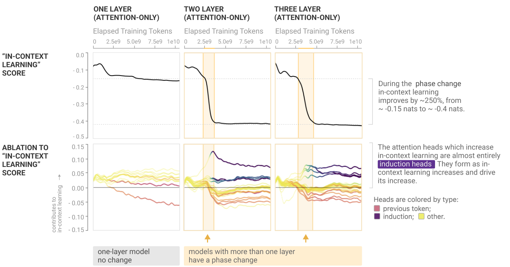
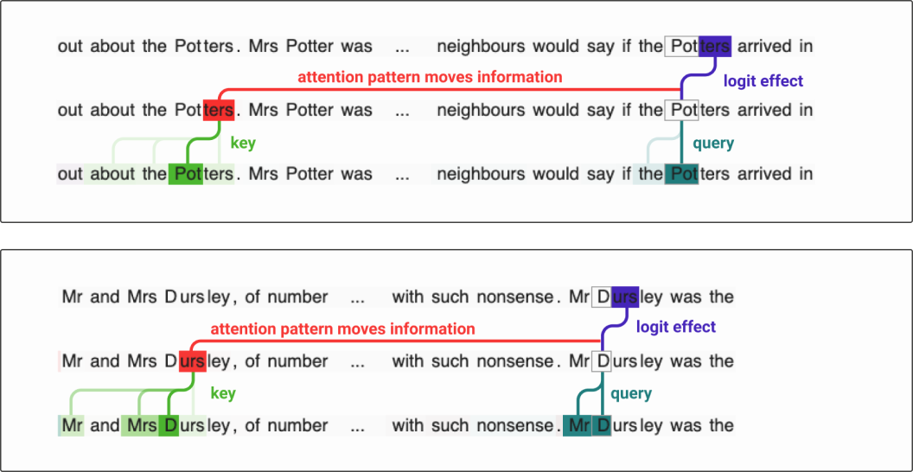
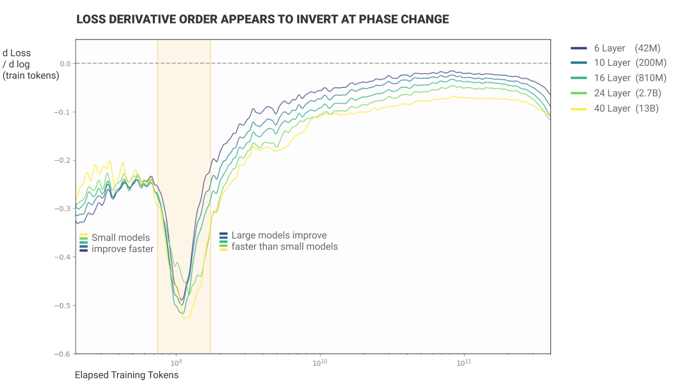

# 上下文学习与归纳头（In-context Learning and Induction Heads）

*2022 年 3 月 28 日 · 原文: https://transformer-circuits.pub/2022/in-context-learning-and-induction-heads/index.html*

---

随着 Transformer 生成模型不断扩展规模并在现实世界获得越来越多的应用 \cite{brown2020language,LaMDA,chen2021evaluating,adiwardana2020towards,rae2021scaling}，解决它们相关的安全问题变得愈发重要。机制可解释性（mechanistic interpretability）——即尝试对模型执行的详细计算进行逆向工程——为应对这些安全问题提供了一条可能的途径。如果我们能理解导致 Transformer 模型产生其输出的内部结构，那么我们或许就能更系统地解决当前的安全问题，并预见未来更强大的模型中可能出现的安全问题。[^1]

过去，机制可解释性研究主要聚焦于 CNN 视觉模型\cite{cammarata2020thread}，但最近，我们[提出了](https://transformer-circuits.pub/2021/framework/index.html)一些关于 Transformer 语言模型机制可解释性的非常初步的进展\cite{nelhage2021mathematical}。具体来说，在我们之前的工作中，我们开发了一个用于分解 transformer 运算的数学框架，这使我们能够理解小型（1 层和 2 层纯注意力）模型，并对其运作方式给出近乎完整的描述。也许最有趣的发现是归纳头（induction head）：这是一种电路，其功能是回看序列，寻找当前词元（token）先前出现过的实例（称其为 `A`），找到上次跟在它后面的词元（称其为 `B`），然后预测同样的补全会再次发生（例如形成序列 `[A][B] … [A] → [B]`）。换句话说，归纳头通过复制和补全之前出现过的序列来"完成模式"。从机制上讲，我们模型中的归纳头由两个注意力头组成的电路实现：第一个头是"前一词元头"（previous token head），它将前一个词元的信息复制到下一个词元；第二个头（真正的"归纳头"）则利用这些信息来寻找前面是当前词元的词元。对于 2 层纯注意力模型，[^2] 我们能够精确地证明，归纳头实现了这种模式复制行为，并且似乎是上下文学习（in-context learning）的主要来源。

然而，我们的最终目标是逆向工程前沿语言模型（这些模型通常包含数百层以及数十亿或数万亿个参数），而不仅仅是 2 层纯注意力模型。不幸的是，层数众多以及 MLP 的存在，都使得用数学方法精确锁定这些模型的电路结构变得困难得多。不过，另一种方法也是可行的：通过经验性地观察、扰动和研究学习过程以及各种结构的形成，我们可以尝试拼凑出一个间接的证据链，说明网络内部在机制层面可能发生了什么。这有些类似于神经科学家获取对大脑某部分功能的理解的方式：观察随时间推移的神经发育、研究大脑该部分受损的病人、扰动动物的脑功能，或者观察少量选定的相关神经元。

在本文中，我们迈出了构建这样一个间接证据链的第一步。具体而言，我们为一个诱人的假说提供了初步且间接的证据：归纳头可能构成大型 transformer 模型中绝大多数上下文学习的实际机制。更确切地说，这一论点主张：存在一些电路，它们与 2 层归纳头具有相同或相似的机制，执行一种"模糊"或"最近邻"式的模式补全，补全 `[A*][B*] … [A] → [B]`，其中 `A* ≈ A` 和 `B* ≈ B` 在某个空间中相似；此外，这些电路实现了大型模型中的大部分上下文学习。

我们获得这些证据的主要方式，是发现并研究一种相变：它在各种规模的语言模型训练早期都会出现（前提是模型不止一层），表现为训练损失中的一个凸起（bump）。在这场相变期间，大部分上下文学习能力（以序列早期与晚期词元之间的损失差来衡量）得以获得，同时模型内部会形成归纳头，它们能够实现相当抽象和模糊的模式补全。我们详细研究这种关联，试图确立其因果性，包括证明：如果我们以某种方式扰动 transformer 架构，使归纳凸起出现在训练中的不同位置，那么归纳头的形成以及上下文学习的形成也会随之同步移动。

具体来说，本文提出了六条互补的证据链，论证归纳头可能是任意规模 transformer 模型中通用上下文学习的机制来源：

- 论据 1（宏观共现）：Transformer 语言模型在训练早期会经历一场"相变"，在此期间归纳头形成，同时上下文学习能力急剧提升。
- 论据 2（宏观共扰动）：当我们以某种方式改变 transformer 架构，从而改变归纳头能否形成（以及何时形成）时，上下文学习的急剧提升也会以精确匹配的方式发生移动。
- 论据 3（直接消融）：当我们在小型模型的测试时直接"敲除"归纳头，上下文学习的量会大幅下降。
- 论据 4（归纳头通用性的具体实例）：尽管我们以复制字面序列的方式非常狭义地定义归纳头，但经验观察表明，这些相同的头似乎也实现了更复杂的上下文学习类型，包括高度抽象的行为，这使得它们解释了上下文学习的很大一部分的说法显得合理。
- 论据 5（归纳头通用性的机制合理性）：对于小型模型，我们可以在机制层面解释归纳头如何工作，并证明它们对上下文学习有贡献。此外，其实际运作机制暗示了自然的方式，使它可以被重新利用以执行更通用的上下文学习。
- 论据 6（从小型到大型模型的连续性）：在前 5 个论据中，归纳头解释上下文学习的论证对小型模型比对大型模型更强。然而，许多与归纳头和上下文学习相关的行为和数据在从小型到大型模型的过程中平滑连续，这表明最简单的解释是机制相同。

这些论断合在一起，构成了一个间接的证据链，表明归纳头可能对最先进的 transformer 模型中的大部分上下文学习负责。我们要强调，这里的结果仅仅是此类证据链的开端；与任何经验性或干预性研究一样，可能存在大量细微的混杂因素或替代假说——我们将在相关章节中讨论这些。但我们认为这些结果值得报告，一方面是因为未来的工作可以在我们结果的基础上更牢固地确立这一论断，另一方面是因为随着可解释性的发展，这类间接证据可能会很常见，所以我们希望建立一种规范：即使证据不完全确凿，也要报告它们。

最后，除了在将归纳头与上下文学习联系起来方面发挥作用外，这场相变本身可能也与安全相关。众所周知，神经网络的能力——例如多位加法——有时会在模型训练或规模扩展过程中突然形成或改变\cite{power2022grokking,brown2020language}，这对安全尤其令人担忧，因为这意味着不受欢迎或危险的行为可能突然出现。例如，奖励黑客（reward hacking）这类安全问题就可能在这样的相变中浮现\cite{pan2022effects}。因此，"近距离"研究相变并更好地理解其内部机制，可能包含对解决未来系统中的安全问题具有普适意义的经验教训。特别是，我们观察到的这场相变在可解释性的微观领域与尺度定律和学习动力学的宏观领域之间，形成了一个有趣的潜在桥梁。

本文其余部分组织如下。我们首先澄清几个关键概念和定义，包括上下文学习、归纳头，以及我们在全文中使用的"逐词元损失分析"（per-token loss analysis）方法。然后我们逐一呈现 6 个论据，依据来自对 34 个 transformer 在训练过程中的分析证据，其中包括 50,000 多次注意力头消融（其数据展示在模型分析表（Model Analysis Table）中）。随后我们讨论研究发现中一些尚未解释的"奇点"（curiosities），并回顾相关工作。

### 关键概念

#### 上下文学习

在现代语言模型中，上下文靠后的词元比靠前的词元更容易预测。随着上下文变长，损失会下降。从某种意义上说，这正是序列模型的设计目的（利用序列中较早的元素预测较晚的元素），但随着从较早词元预测较晚词元的能力越来越强，它可以越来越多地被用于有趣的方式（例如指定任务、给出指令，或要求模型匹配某种模式），这些用途表明，把它当作一种独立的现象来思考是有益的。当这样思考时，它通常被称为上下文学习。[^3]

涌现式上下文学习在 GPT-2 中已被注意到\cite{radford2019language}，并在 GPT-3 中获得了广泛关注\cite{brown2020language}。只需调整"提示"（prompt），transformer 就能在不重新训练的情况下适应许多有用的任务，例如翻译、问答、算术以及许多其他任务。利用"提示工程"（prompt engineering）来发挥上下文学习的作用，已成为一个广受欢迎的研究和讨论主题\cite{zhao2021calibrate,gao2021making}。

文献中至少存在两种重要且不同的概念化与度量上下文学习的方式。第一种概念以 Brown 等人为代表，聚焦于特定任务的少样本学习（few-shot learning）\cite{brown2020language}。模型会被提示若干以"下一词元预测"格式呈现的某种"任务"实例（例如多位加法，或英译法翻译）。第二种上下文学习概念以 Kaplan 等人为代表\cite{kaplan2020scaling}，聚焦于观察不同词元索引处的损失，以衡量模型随着获得更多上下文而在预测上变得有多好。第一种概念可以看作微观视角（聚焦特定任务），而第二种概念可以看作宏观视角（聚焦总体损失，它平均而言与这些任务相关）。

"少样本学习"这一上下文学习概念往往受到社区更多关注。用一个大型模型完成许多不同任务的能力——即使无需进一步微调——是对模型训练基本经济学的显著改变。此外，它提供了广泛的通用能力和即时适应能力的证据，促使我们重新审视模型"理解"或"推理"意味着什么。

然而，出于本文的目的，我们转而聚焦于 Kaplan 等人的概念：随着词元索引增加，损失下降。我们这样做，是因为它比"少样本学习"更普遍地框定了这一现象。这个定义的一个缺点是它无法分离出我们感兴趣的特定行为。与此同时，它使我们能够衡量模型从上下文中即时学习的整体能力，而不依赖于我们对"任务"的具体选择。我们还将看到，从这个定义出发，我们也能够研究几个经典的少样本学习例子（见论据 4）。

在本文中，我们计算一个简单的启发式上下文学习度量：

- 上下文学习得分：上下文第 500 个词元的损失减去上下文第 50 个词元的平均损失，再对数据集样本取平均。

我们选择第 500 和第 50 个词元索引多少有些随意。第 500 个词元接近长度为 512 的上下文的末尾，而第 50 个词元已足够深入上下文，使得文本的一些基本属性（如语言和文档类型）已经确立，同时又仍接近开头。我们还将表明，在这里选择不同的数字不会改变我们的结论。

最后，值得指出的是，上下文学习可能与安全具有特殊相关性。上下文学习使得预测模型在长上下文之后会如何表现变得更加困难。从更长远来看，诸如 mesa 优化（mesa-optimization）或内部对齐（inner-alignment）\cite{hubinger2021risks} 之类的概念假定，有意义的机器学习或优化可能在测试时发生（在不改变权重的情况下）。上下文学习将是这种隐藏优化发生的显而易见的未来机制，无论它今天是否已经如此。因此，研究上下文学习对未来似乎很有价值。

（关于上下文学习的更多内容，参见相关工作；关于与安全之联系的更多内容，参见讨论。）

#### 归纳头

在我们[之前的论文](https://transformer-circuits.pub/2021/framework/index.html)中，我们在两层纯注意力模型中发现了特殊的一类注意力头——我们将其命名为归纳头。归纳头由分处不同层的一对注意力头组成的电路实现，它们协同工作以复制或补全模式。第一个注意力头将前一个词元的信息复制到每个词元中。这使得第二个注意力头能够根据词元之前发生的事情（而非词元自身的内容）来关注它们。具体来说，第二个头（我们称之为"归纳头"）在序列中搜索当前词元 `A` 先前出现过的位置，并关注其下一个词元（称其为 `B`），将其复制，使模型更有可能把 `B` 输出为下一个词元。也就是说，两个头协同工作，使得序列 `…[A][B]…[A]` 更有可能以 `[B]` 补全。

归纳头的命名类比于归纳推理（inductive reasoning）。在归纳推理中，我们可能会推断：如果在上下文较早处 `A` 后面跟着 `B`，那么在同一个上下文中较晚处 `A` 更有可能再次跟着 `B`。归纳头将这种推断具体化。它们在上下文中搜索当前词元先前的实例，关注如果模式重复则接下来会出现的词元，并提高其概率。归纳头关注的词元，正是基本归纳（针对上下文，而非针对训练数据）会预测的词元。

请注意，归纳头实现的是一个简单算法，而不是记忆一张固定的 n-gram 统计表。规则 `[A][B] … [A] → [B]` 无论 `A` 和 `B` 是什么都适用。[^4] 这意味着，只要上下文早期的局部统计能代表稍后位置的统计，归纳头在某种意义上就可以在分布之外（out of distribution）工作。这暗示它们可能能够表现出更通用、更抽象的行为。

我们此前的论文对归纳头（induction head）做了几项探索，包括：证明这些头出现在 2 层纯注意力模型中（而非 1 层模型中）；作为我们对 transformer 的数学分解的一部分，从机制上追踪它们如何运作；以及提出一种基于特征值的检验方法来检测它们是否存在。不过，当时我们对归纳头的确切定义有些含糊：与其说我们给出了定义，不如说我们发现了一簇倾向于共同出现的行为与机制，并把这一簇中的头称为"归纳头"。

在这篇论文中，我们的目标是为一个更宏大的论断提供证据：归纳头在一般的上下文学习（in-context learning）中扮演重要角色——不仅仅是字面上的 `[A][B]...[A]→[B]` 复制——而且这不仅适用于小型 2 层纯注意力模型，也适用于大型模型。为了清晰而连贯地论证这一点，我们需要一个更精确的归纳头定义。在带 MLP 的大型模型中，权重的机制分析与特征值分析要复杂得多，因此在这篇论文中，我们选择用归纳头狭窄的经验性序列复制行为（即 `[A][B]...[A]→[B]`）来定义它，然后试图证明：(1) 它们还承担着可以与上下文学习联系起来的更广泛的功能；(2) 它们与小型模型中的机制图景相吻合。

形式上，我们把归纳头定义为表现出以下两个性质[^5]的头——这两个性质定义在词元（token）的重复随机序列[^6]上：

- 前缀匹配（prefix matching）：该头会回溯关注之前的词元，即那些后面跟着当前词元和/或最近词元的先前词元。[^7] 也就是说，它会关注归纳所提示的、接下来应出现的那个词元。
- 复制（copying）：该头的输出会提高被关注词元所对应的 logits（对数几率）。

换句话说，归纳头就是任何在面临完全随机词元的重复序列时、经验上会提高给定 `[A][B]...[A]` 条件下 `[B]` 出现可能性的头。归纳头行为的示意图如下所示：

请注意，由此可以推出，归纳头往往擅长整体性地重复序列。例如，给定 "The cat sat on the mat. The cat …"，归纳头会促进 "sat on the mat" 这一续写。这首次暗示了它们可能与一般的上下文学习乃至少样本学习（few-shot learning）相关：它们学会了重复任意序列，而这正是少样本学习的一种（简单）形式。

我们要试图确立的事情之一是：当归纳头出现在足够大的模型中、作用于足够抽象的表示上时，正是这些执行序列复制的头，还会承担起更扩展的角色——类比序列复制（analogical sequence copying），即上下文最近邻（in-context nearest neighbors）。我们的意思是，它们会促进诸如 `[A*][B*] … [A] → [B]` 这样的序列补全，其中 `A*` 与 `A` 并非完全相同的词元，但在某个嵌入空间中彼此相似；同样，`B` 与 `B*` 也不是完全相同的词元。例如，`A` 与 `A*`（以及 B 与 `B*`）可能是不同语言中的同一个词，于是归纳头可以通过寻找"与 `A` 类似的东西"、找到后接 `B*` 的 `A*`、再用"与 `B*` 类似的东西"（即 `B`）来完成补全，从而逐词翻译一个句子。我们还无法从机制上证明归纳头普遍能做到这一点，但在论证 4 中，我们展示了归纳头以这种方式运作的经验性实例（包括翻译场景）；在论证 5 中，我们指出，小型模型中归纳头已知的复制机制可以自然地改造为以这种方式发挥作用。

#### 逐词元损失分析（Per-Token Loss Analysis）

为了更好地理解模型在训练过程中如何演化，我们分析所谓的"逐词元损失向量"（per-token loss vectors）。这一核心思想可追溯到 Erhan 等人 \cite{erhan2010does} 使用过的一种方法，更一般地说，可追溯到数学中"函数空间"（function space）的概念。[^8]

我们从一组模型集合开始。（在我们的用法中，我们会训练几种不同的模型架构，并在训练过程中为每种架构保存数十个"快照"（snapshot）。我们将用这组快照作为我们的模型集合。）接下来，我们收集每个模型对一组固定的 10,000 个随机词元所赋予的对数似然，其中每个词元都取自不同的示例序列。我们将这些对数似然合并为一个"逐词元损失向量"，并应用主成分分析（Principal Component Analysis, PCA）：

更详细的技术细节讨论见附录。

通过对多个模型在训练过程中的快照应用这一方法，我们可以可视化并比较不同模型的训练轨迹在输出层面如何演化。由于我们使用的是 PCA，每个方向都可以看作模型沿其移动的一个对数似然向量。我们尤其关注前两个主成分，因为它们易于可视化。当然，模型也会沿着前两个主成分未捕捉到的方向移动，但作为捕捉训练最宏观叙事的可视化手段，它仍然很有用。

### 论证归纳头是大部分上下文学习的机制

现在我们进入论文的主体部分，其要论证的是：归纳头或许为一般 transformer 模型的大部分上下文学习提供了主要机制。如引言所述，这是一个非常宽泛的假说，我们的证据大多属于间接证据；但我们仍然相信，所有证据线索合在一起，足以构成一个相对有力、虽非定论的论证。

在逐一展开这些论证之前，先划清证据较为确凿与较为薄弱之处会很有帮助。下表展示了这一点。对于小型的纯注意力模型，我们相信有充分证据表明注意力头就是大部分上下文学习的机制，因为我们的证据得到了消融实验（ablation）与机制逆向工程的支持。反过来，对于所有模型，我们都能有力地论证归纳头在上下文学习中发挥了某种作用，因为我们可以展示实例并呈现富有启发性的相关性。然而，模型越大，就越难以确立归纳头确实构成了上下文学习的实际主体。因此，对于带 MLP 的大型模型，我们主要只能依赖相关性证据，而这类证据可能受到混杂因素干扰。我们会在全文中探讨替代假说，包括在论证 1 的末尾，以及论证 6 中的简要再讨论。

| 子论断的证据汇总（每栏为该论断的最强论证） | 小型纯注意力模型 | 带 MLP 的小型模型 | 大型模型 |
|------|------|------|------|
| 贡献一部分 | 强，因果性 | 强，因果性 | 中等，相关性与机制性 |
| 贡献大部分 | 强，因果性 | 中等，因果性 | 中等，相关性 |

以下是我们将要提出的论证清单，每个论证对应一节，与引言中的列举相同：

- 论证 1（宏观共现）：transformer 语言模型在训练早期会经历一次"相变"（phase change），在此期间归纳头形成，同时上下文学习急剧改善。
- 论证 2（宏观共扰动）：当我们以某种方式改变 transformer 架构、从而改变归纳头能否形成（以及何时形成）时，上下文学习的急剧改善也会以精确匹配的方式随之改变。
- 论证 3（直接消融）：当我们在测试时直接"敲除"小型模型中的归纳头时，上下文学习的量会大幅下降。
- 论证 4（归纳头通用性的具体实例）：尽管我们仅以字面序列复制的狭窄方式来定义归纳头，但我们经验性地观察到，这些同样的头似乎还实现了更复杂的上下文学习类型，包括高度抽象的行为，这使得它们很可能解释了上下文学习的很大一部分。
- 论证 5（归纳头通用性的机制合理性）：对于小型模型，我们可以从机制上解释归纳头如何工作，并展示它们对上下文学习的贡献。此外，其实际运作机制暗示了自然的改造方式，使它能够被重新用于执行更一般的上下文学习。
- 论证 6（从小型到大型模型的连续性）：在前 5 个论证中，归纳头解释上下文学习的论据对小型模型比对大型模型更强。然而，与归纳头和上下文学习相关的许多行为与数据，从小型模型到大型模型都平滑连续，这提示最简单的解释是：二者的机制是相同的。

对每个论证，我们都会给出一个与本节的表格类似的表，展示该论断所提供的证据在应用于大型/小型模型以及部分/大部分上下文学习时的强度。上面的表格是全部六条推理线索证据的总和。

### 论证 1：transformer 语言模型在训练期间经历"相变"，归纳头在此期间形成，同时上下文学习急剧改善

我们的第一条证据线索来自对训练过程中上下文学习度量与归纳头存在度量的相关分析。具体而言，我们在数十个不同规模、在不同数据集上训练的模型中，观察到两者之间存在紧密的共变关系（关于我们观察到这种共现的模型的更多信息，见模型分析表）。

下表总结了我们所研究模型中这一证据的质量：它同时适用于大型和小型模型，并且正是"归纳头负责大部分上下文学习"这一假说所预期的结果；但它仅是相关性证据，因此可能受混杂因素影响（下文会进一步讨论）。

| 子论断的论证强度 | 小型纯注意力模型 | 带 MLP 的小型模型 | 大型模型 |
|------|------|------|------|
| 贡献一部分 | 中等，相关性 | 中等，相关性 | 中等，相关性 |
| 贡献大部分 | 中等，相关性 | 中等，相关性 | 中等，相关性 |

我们的第一个观察是：如果我们度量 transformer 模型在整个训练过程中的上下文学习（按"关键概念"一节的描述，定义为第 50 个词元损失减去第 500 个词元损失），就会发现它在一个狭窄的时间窗口内突然形成——该窗口位于训练早期（大约在 25 亿至 50 亿词元之间）——此后在训练剩余时间内保持不变（见下图）。在这个窗口之前，上下文学习量不足 0.15 nats；窗口之后约为 0.4 nats，这一数值在训练剩余时间内保持不变，并且在许多不同规模的模型之间也保持一致（唯一的例外是单层模型，它几乎从未形成多少上下文学习）。这似乎令人意外——按常理，人们会预期上下文学习随着训练逐渐改善，并随模型规模增大而改善，[^9] 就像机器学习中大多数事物那样。

尽管上面只展示了三个模型，但这一模式具有非常普遍的适用性：论文后面的模型分析表展示了大量实例，包括各种架构与规模的模型。

人们可能会疑惑，这种突然增长会不会是某种人为假象，源于我们选择用第 500 个与第 50 个词元损失之差来定义上下文学习。我们稍后会更深入地讨论这一点。但眼下，一个容易看出这是稳健现象的方法，是考察损失相对于上下文内词元索引对数的导数。你可以把它理解为在度量"上下文长度每增加 ε% 所对应的上下文学习量"。我们可以在二维图上将其可视化：一个轴是已进行的训练量，另一个轴是被预测的词元索引。在相变之前，损失大约在词元 50 附近基本停止改善；相变之后，损失会越过该点继续改善。

事实证明，上下文学习的突然改善并不是这个窗口内唯一发生变化的事情。如果我们逐一检查一个模型的注意力头，并按照它们是否为归纳头来打分（使用前缀匹配分数，该分数衡量它们完成"关键概念"一节中用于定义归纳头的那项任务的能力），我们会发现归纳头恰好在上下文学习发展的同一个窗口内突然形成（下图）。这里我们同样只展示少数几个模型，完整集合见模型分析表。例外是单层模型：归纳头从未在其中形成——正如上下文学习也从未在单层模型中实质性发展一样。

这已经强烈暗示归纳头与上下文学习之间存在某种联系；但不仅如此，这个窗口似乎还是整个训练过程的关键节点：正在发生的一切都会在训练曲线上呈现为一个凸起（下图）。事实上，这是训练过程中唯一一处损失不满足凸性（斜率单调递减）的地方。

这听起来可能无关紧要，但损失曲线是对成千上万个词元的平均。人们在语言模型中发现有趣的许多行为，例如算术能力的涌现，在损失曲线上都只会是微观级别的。某件事能在这种尺度上被看见，说明它是模型行为中一场普遍而重大的变化。这一转变似乎也是——至少对小型模型而言——损失曲线与单层模型分道扬镳的第一个点：单层模型不显示这个凸起，正如它也不显示其他突变一样。

我们还可以按"逐词元损失分析"一节的描述，对逐词元损失应用主成分分析（PCA），从而概括多个模型的预测在训练过程中发生变化的主要维度。

下面我们展示这些模型预测的前两个主成分，金色轮廓标出的正是上面展示过的同一区间，即上下文学习突然改善的区间。我们看到，训练轨迹恰好也在其他变化发生的同一个窗口内发生转向。在某种意义上，上下文学习改善之际所发生的一切，正是我们的 transformer 在训练过程中所遵循的基本轨迹上的首要偏离。唯一的例外仍然是单层模型——在那里归纳头无法形成，上下文学习也不会改善。

总而言之，以下事件都发生在同一个突变的窗口内：

- 上下文学习能力急剧提升（以上下文学习分数度量）。
- 归纳头形成。
- 损失出现一个小的"凸起"（即损失曲线经历了一段比其前后部分明显更陡的改善期）。
- 模型的轨迹突然改变（在逐词元损失空间中，如 PCA 可视化所示）。

综合来看，这些结果表明，在训练早期 2.5e9 到 5e9 词元（token）的窗口期内，某种重要的转变正在发生（对于大模型而言，这大约处于训练进程的 1%–2% 处）。我们称这一转变为"相变"（phase change），因为它是一种突变，会改变模型的行为，并同时具有宏观（损失曲线与上下文学习（in-context learning）曲线）和微观（归纳头）层面的表现，或许可以类比于冰融化等现象。[^10]

#### 更仔细地观察相变

一种自然的解释是：对所有这类模型而言，归纳头实现了上下文学习——正是它们的形成驱动了观察到的所有其他变化。为了进一步强化这一假设，我们核对了几个方面。首先，相变发生的窗口与学习率、预热（warmup）或权重衰减的计划性调整并不对应；并不存在某个已知的外生因素促成了这一切。其次，我们尝试用不同的数据集训练其中一些小模型，观察到相变以同样的方式发展（详见模型分析表（Model Analysis Table））。[^11]

第三，为了进一步加强这一联系，我们从定性的角度、以具体事例的方式观察相变期间模型行为的变化。一种做法是考察模型在预测哪些特定词元时变得更好或更差。模型的损失是数十亿个逐词元对数似然损失的均值。把这些损失拆开来看，我们就能对发生了什么变化有一个直观的认识。

具体来说，我们选取一段文本——为有趣起见，就用《哈利·波特》的第一段——比较相变开始与结束时各词元对数似然（log-likelihood）的差异。[^12] 我们会发现，大多数变化都发生在文本中重复出现多次的词元上。如果某段词元序列多次出现，模型在第二次遇到该序列时会预测得更好。另一方面，如果一个词元后面跟着的词元与先前不同，相变后的模型对它的预测反而更差：

我们还可以在模型训练的整个过程中进行同样的分析。损失曲线是数百万条逐词元损失曲线的平均。我们可以将其拆解，考察单个词元的损失曲线。

具体而言，我们来看《哈利·波特》第一段中两个词元的逐词元损失轨迹。红色显示的是一个在相变期间预测效果显著变好的词元：它是" The Dursleys"四个词元中的最后一个，该序列在文本中出现了多次。蓝色显示的是一个在相变期间明显变差的词元：它是" Mrs Potter"有史以来的第一次出现——此前两次" Mrs"之后跟的都是" Dursley"。

所有这一切表明，在相变期间，我们观察到的行为与"归纳头确实贡献了上下文学习的大部分"这一假设所预期的完全一致。

#### 评估证据

尽管有上述种种共现证据（模型分析表中还有更多），事实仍然是：我们尚未证明归纳头就是上下文学习的主要机制。我们只是表明归纳头与上下文学习同时形成，且此后上下文学习不再提升。这个故事里存在若干潜在的混淆因素。下面我们总结支持与反对"这一联系是因果性的"两方面的理由。支持方的论证大致如下：

- 归纳头的形成与模型上下文学习能力的大幅提升相关，这一点在大小各异的各种模型上都成立。
- 这两种急剧转变能在这么多模型上同时出现，却毫无因果联系，纯粹出于巧合的可能性极低。
- 二者之间几乎肯定存在某种联系，而最简单的可能就是：归纳头正是驱动观察到的上下文学习提升的主要机制。（不过，如下文所讨论的，它也可能只是一个混淆变量。）
- 由于最终上下文学习能力的 75% 以上都形成于这一窗口期内，人们可能会天真地认为这就是归纳头所负责的那部分上下文学习。

然而，以下问题与混淆因素提示我们应保持谨慎：

- 在大模型中，我们对训练过程的分析时间分辨率很低。当时间上只有 15 个采样点时，共现就不那么令人惊讶，证据力也更弱。
- 也许就在这个时间点，模型中还形成了其他机制，它们不仅促进归纳头的形成，也促进上下文学习的其他来源。（例如，也许相变本质上正是模型学会如何通过残差流组合各层的时刻，这一能力既使归纳头成为可能，也可能催生许多其他同样需要多头组合的机制。）换言之，也许这种共现主要源于一个共享的潜在变量，而非归纳头到观察到的完整上下文学习变化之间的直接因果。
- 相变之后上下文学习得分大致恒定（约 0.4 nats），这并不必然意味着上下文学习的底层机制在那之后也保持不变。具体而言，我们使用的指标度量的是词元索引 500 与 50 之间的相对损失，而我们知道模型在词元 50 处的表现会随训练时间推移而改善。在更低的基线上再减少固定量的损失可能更难，因此随着训练进行，这一改善可能由额外的机制驱动。[^13][^14]

这里值得注意的一点是："归纳头在相变转变点贡献了大部分上下文学习"这一论断，比"它们在训练结束时贡献了大部分上下文学习"的论断更站得住脚——因为在训练过程中，即使上下文学习得分保持不变，也可能有很多东西在发生变化。

### 论证 2：当我们以某种方式改变 transformer 架构，从而改变归纳头形成的时间、或它们能否形成时，上下文学习的急剧提升也会以精确匹配的方式发生相应改变。

| 论证强度（针对子声明） | 小型纯注意力 | 带 MLP 的小型模型 | 大型模型 |
|------|------|------|------|
| 贡献一部分 | 中等，干预性 | 中等，干预性 | 弱，干预性 |
| 贡献大部分 | 中等，干预性 | 中等，干预性 | 弱，干预性 |

论证 1 的一个不足之处在于，我们只是在观察归纳头与上下文学习的共变；与任何观察性研究一样，它的说服力不如"主动改变一个变量、测量另一个变量会发生什么"的做法。在本节中，我们进行一个更具"干预性"的实验：以某种方式改变模型架构，使归纳头更容易形成，然后观察对上下文学习的影响。这一改动对小模型的影响更大，因此在小模型上更有说服力，但对大模型也有一定的参考价值（见上表）。

在设计实验时，我们从上一节提到的观察出发：相变及相应的上下文学习提升只发生在层数多于一的 transformer 中。如果归纳头是上下文学习大部分能力的机制，这正是我们会预料到的结果：归纳头需要注意力头的组合，而这种组合只有在两层或更多层时才可能实现。[^15]

当然，关于单层模型的观察本身是相当弱的证据。（人们完全可以想象单层模型在各方面都与多层模型不同！）但它提示了一条更一般的进攻路线。如果归纳头是上下文学习大幅提升背后的机制，那么这就对实现观察到的提升所需的最低架构要求作出了预测。对于标准 transformer 而言，关键是要有两层注意力层。但这仅仅是因为键向量需要成为被关注词元及其前一词元的函数。

我们定义了一种"模糊键"（smeared key）架构，只需一个非常简单的修改，就能让任意深度的 transformer 都易于表达归纳头。在修改后的模型中，对每个头 $h$，我们引入一个可训练实数参数 $\alpha^h$，并将其用作 $\sigma(\alpha^h) \in [0, 1]$，在当前词元的键与前一词元的键之间进行插值[^16]：

$$k^h_j \approx \sigma(\alpha^h) k^h_j ~+~ (1-\sigma(\alpha^h)) k^h_{j-1}$$

"归纳头是上下文学习主要机制"的假说预测：有了这一改动后，相变将在单层模型中出现，并且可能在多层模型中更早出现。如果归纳头只是几个主要促成因素之一，我们或许会预期上下文学习的部分提升提前发生，其余部分则与原本的相变同时发生。

结果（下图）与预测一致：使用模糊键架构时，单层模型确实形成了上下文学习能力（此前它们无法形成），而两层及以上的模型则更早形成。更多此类结果可参见模型分析表。

这些图只是模型分析表的一个节选；请到该表中查看模糊键模型（smear models）与其 vanilla 对应模型对比的更完整分析。

不过，我们或许不应仅凭这一证据对大模型作出过强的推断。该实验表明，归纳头是 transformer 上下文学习能力大幅提升的最小机制。但我们很容易想象，在更大的模型中，这一机制并非全部真相；而且该实验也没有反驳"上下文学习的机制会随训练进程而改变"这一观点。

### 论证 3：当我们在测试时直接"敲除"（knock out）小模型中的归纳头时，上下文学习的量大幅下降。

| 论证强度（针对子声明） | 小型纯注意力 | 带 MLP 的小型模型 | 大型模型 |
|------|------|------|------|
| 贡献一部分 | 强，因果性 | 强，因果性 | |
| 贡献大部分 | 强，因果性 | 中等，因果性 | |

就其所覆盖的情形而言，消融实验（ablation）是我们目前最有力的证据。基本论证是：敲除归纳头会降低我们在模型中观察到的上下文学习量。所谓"敲除"，是指在测试时从模型中移除某个给定的注意力头，在缺少它的条件下对 transformer 做一次前向传播。（消融的具体做法详见我们的方法一节。）

下面展示的消融实验说明了注意力头如何贡献于上下文学习；我们还可以通过消融实验来研究注意力头如何贡献于相变期间发生的整体行为变化（见模型分析表）。

这些图只是模型分析表的一小部分节选；请到该表中查看完整证据。消融的具体做法详见我们的方法一节。

事实上，小型纯注意力模型中的上下文学习几乎全部来自这些归纳头！这一点从相变开始时起，一直到训练结束都成立。[^17]

遗憾的是，我们没有对全尺寸模型做消融实验。[^18] 就我们确实做了消融的模型而言，这一证据似乎明确地证明了归纳头提升了上下文学习（至少在我们所选择的评估方式下如此）。但我们能否进一步推断它们就是主要机制？有几点考量：

- 在纯注意力模型中，上下文学习本质上必然是各注意力头贡献之和。[^19] 但在带 MLP 的模型中，上下文学习还可能来自 MLP 层与注意力层之间的交互。虽然消融注意力头会影响这类机制，但消融对上下文学习的影响与其真实重要性之间的关系会变得更加复杂。[^20] 因此，我们不能完全确信对 MLP 模型的头消融能让我们看到全貌。

- 我们的消融实验度量的是从模型中移除注意力头的边际效应。当两个头做相似的事情、且 logits（对数几率）之前的层归一化会对数值进行重新缩放时，单个头的重要性可能会被掩盖。

综合考虑，我们认为可以放心地得出结论：在小型的纯注意力模型中，归纳头是上下文学习的主要机制；但对于带 MLP 的模型，这一证据只能算作提示性的。

### 论证 4：尽管归纳头的定义被严格限定为复制随机序列，它们却可以实现出人意料地抽象的上下文学习类型。

| 论证强度（针对子声明） | 小型纯注意力 | 带 MLP 的小型模型 | 大型模型 |
|------|------|------|------|
| 贡献一部分 | | | 合理性（Plausibility） |
| 贡献大部分 | | | 合理性 |

我们此前的所有证据（论证 1–3）都聚焦于观察或扰动归纳头形成与宏观上下文学习之间的联系。一个完全不同的角度是：直接寻找归纳头实现看似困难的上下文学习行为的例子；这将使"归纳头贡献了上下文学习的大部分"这一论断显得合理。这一证据甚至适用于最大的模型（我们研究了多达 12B 参数的模型），但由于它只展示了少数任务，就整体上下文学习而言仍只是提示性的。

回想一下，我们将归纳头定义为：在经验上利用"前缀匹配"（prefix matching）注意力模式复制任意词元序列的头。我们的目标是找到符合这一定义、同时又表现出更有趣、更复杂行为的头，本质上是要证明大模型中的归纳头可以是"可泛化的"。

在本论证中，我们展示来自更大 transformer（我们那个 40 层、130 亿参数的模型）中一些归纳头的具体示例，它们恰恰表现出这类行为——即字面复制、翻译，以及一种特定类型的抽象模式匹配。这些行为都具有 `[A*][B*]...[A][B]` 的形式，也就是所谓的"模糊最近邻匹配"（fuzzy nearest neighbor match），或者"在序列中较早的位置找到相似的东西，并按类比补全序列"。我们验证了这些头在我们的"复制"和"前缀匹配"评估中得分很高（也就是说，它们会提高被关注词元的概率，并且在随机文本上会关注那些前缀与当前词元相匹配的词元），因此按照我们严格的经验定义，它们属于"归纳头"；与此同时，它们也执行着这些更复杂的任务。

部分示例头的结果如下表所示，并在下面的各小节中加以描述。

| 头 | 层深 | 复制得分 (?) | 前缀匹配得分 (?) |
|---|---|---|---|
| 字面复制头 | 21 / 40 | 0.89 | 0.75 |
| 翻译头 | 7 / 40 | 0.20 | 0.85 |
| 模式匹配头 | 8 / 40 | 0.69 | 0.94 |

#### 行为 1：字面序列复制

我们先从最简单的例子开始：一个逐字复制重复文本的头。借此熟悉我们使用的可视化界面以及这些头的基本动态。我们选了一个似乎执行非常基础复制行为的归纳头，观察它在《哈利·波特》（Harry Potter）第一段上的表现。我们随后重复了开头的几句话，以展示该头在更长重复文本片段上的行为。

可视化将展示两方面的内容：

- 红色 "Attention" 让你看到该头为预测下一个词元而注意的位置。
- 蓝色 "Logit attr" 使用"直接路径"logits（对数几率）归因，展示对当前词元预测有所贡献的更早词元。[^21]

要开始探索这个可视化，我们建议试着把光标悬停在第二段上。

如果你探索这个可视化，会看到该头预测重复名字 "Dursley" 和 "Potters"、短语 "a small son"，然后是末尾整句重复的句子。在所有这些情况下，成功的预测都来自回看文本中该短语此前出现过的位置。

#### 行为 2：翻译

众所周知，语言模型可以在不同语言之间进行翻译。有趣的是，我们遇到过许多能够做翻译的归纳头。这里我们探索在 40 层模型的第 7 层发现的一个头，它展示了英语、法语和德语之间的翻译。（与本节的其它头一样，按照我们一直使用的定义，这个头同样是一个"归纳头"：当面对重复的随机词元时，它会用"前缀匹配"注意力模式逐字复制序列。）

注意，整体注意力模式（红色，左上角）大致呈"副对角线"（off-diagonal），但会偏离锐利的对角线而蜿蜒游走。这种蜿蜒是因为不同语言有不同的词序和词元长度。当该头依次注意语义上应该接续出现的过往词元时，它在更早句子中注意的词元位置会来回跳跃。

这个头的 logits（对数几率）归因模式并不完全锐利；也就是说，即使注意力头注意了较早语言中对应的词，它也不总是直接提高相应预测的 logit。我们猜测这是因为该头的输出还需要由更后面的层进一步处理。不过总体来看，直接 logits 归因显示出净贡献于正确翻译的明确证据。

#### 行为 3：模式匹配

在最后一个例子中，我们展示一个执行更复杂模式匹配的注意力头（位于 40 层模型的第 26 层）。你甚至可以把它看作在上下文里学习了一个简单函数！（同样，在展示重复随机序列时，这个头在我们"基本"归纳行为的测量中得分也很高，所以按该定义它也是一个归纳头。）

为了探索这种行为，我们生成了一些遵循简单模式的合成文本。每一行遵循四个模板之一，后面跟一个标签标明它取自哪个模板。模板随机选取，填入模板的词也是随机选取的：

- (month) (animal): 0
- (month) (fruit): 1
- (color) (animal): 2
- (color) (fruit): 3

下面我们展示这个注意力头在该合成示例上的行为。为了让图更易读，我们将注意力模式掩蔽为只显示以 ":" 词元作为目的地的部分，并将 logits 归因掩蔽为只显示输出为整数词元的部分。

这个头回看正确类别先前实例的次数多于不回看。它常常知道跳过那些一个词相同但模式错误的行（例如 "January bird" 主要注意 "April fish" 而不是 "grey bird"）。这个头在这方面并不完美，但在测试一系列类似问题时，经验上它会把从冒号发出的约 65% 的注意力分配到正确位置。

#### 更抽象却也符合归纳头定义的头是怎么回事？

我们再次强调：上文描述的注意力头同时实现了我们描述的抽象行为，而且这些完全相同的注意力头（即同一层中的同一个头）也满足归纳头的形式定义（用前缀匹配逐字复制随机序列）。这种对应既不是比喻，也不是对定义的模糊化：以逐字复制序列能力定义的归纳头，结果有时也会匹配更抽象的模式。这正是本节开头表格所展示的经验事实。

但这仍然留下一个问题：为什么这些以归纳方式复制随机文本的头还会表现出其它行为？一个提示是：这些行为可以被看作与复制"精神上相似"。回顾一下，归纳头被定义为实现 `[A][B] … [A] → [B]` 这样的规则，而我们经验观察到的头还会做类似 `[A*][B*] … [A] → [B]` 的事，其中 `A*` 和 `B*` 在某种更高层的表示中与 `A` 和 `B` 相似。这些相似行为之间可能存在多种联系。例如，注意第一种行为是第二种的特例，所以也许归纳头实现的是一种更通用的算法，在给定重复序列时退化为复制的特例 [^22]。另一种可能是：归纳头在走一条只包含它们自己的残差流路径时实现逐字复制，而在处理更早层产生的、创建了更抽象表示（例如英语和法语中的同一个词被嵌入到同一位置的表示）的输出时实现更抽象的行为。

在论证 5 中，我们将通过给出机制层面的说明来加强这一论证：归纳头（在做带前缀匹配的简单复制时）如何回看模式中下一个出现的词元，并指出它们使用的实际机制可以自然地推广到更抽象的模式匹配。本节我们只想说明：这些更抽象的归纳头同时也表现出构成我们定义基础的基本复制行为，其实是相当自然的。

### 论证 5：对于小模型，我们可以从机制上解释归纳头如何运作，并证明它们对上下文学习有所贡献。此外，其实际运作机制还暗示了将它重新用于执行更一般上下文学习的自然途径。

| 论证强度（针对子声明） | 小型纯注意力 | 带 MLP 的小型模型 | 大型模型 |
|---|---|---|---|
| 贡献一部分 | 强，机制性 | 强，机制性 | 中等，机制性 |
| 贡献大部分 | 弱，机制性 | | |

我们关心归纳头是否驱动上下文学习的主要原因之一，是我们能够理解它们，从而拥有理解上下文学习的路径。但我们也可以反过来看：我们可以利用对归纳头的理解，做一个纯粹逻辑上的论证，说明它们应当对上下文学习有所贡献。

我们从一个半经验论证开始。暂且假定归纳头的行为正如我们描述和观察到的那样：在上下文中搜索先前的例子，并复制接下来发生的内容。我们有理由预期这样的过程会提升模型预测其上下文后面词元的能力。我们本质上是在把先前的上下文当作最近邻算法的数据点来用，而最近邻会随着给它的数据点增多而改善。因此，如果归纳头确实如我们所描述的那样存在，它们就会对我们定义的上下文学习有所贡献。

从某种意义上说，如果我们只论证"存在某些情况，归纳头对上下文学习有所贡献"，这个论证是相当强的。我们上文已经看到了具体的例子：归纳头通过复制先前的例子改善了词元预测。退一步说，它们至少在这些情况下必定有帮助！更一般地说，我们对归纳头的定义（以其在重复随机序列上的行为来定义）表明它们相当普遍地以这种方式行事。这个论证没有说明归纳头完成了上下文学习的多大比例，但它似乎是一个很强的论证，足以说明无论是大模型还是小模型，其中一部分上下文学习确实由归纳头完成。

但这种思路真正令人满意的地方——即利用我们对归纳头的理解来预期它们对上下文学习的影响——在于我们实际上可以撇开对归纳头行为的经验观察这一依赖，代价是需要做一个更复杂的论证。在我们[上一篇论文](https://transformer-circuits.pub/2021/framework/index.html)中，我们得以[逆向工程](https://transformer-circuits.pub/2021/framework/index.html#how-induction-heads-work)归纳头，从参数层面展示了它们如何（以及应当如何）实现归纳行为。如果我们相信这一分析，就能在不实际运行它们的情况下知道归纳头的表现，上一段中的论证也就成立了。当然，这里有一些局限。在上一篇论文中，我们只逆向工程了一个小型纯注意力模型中的单个归纳头（尽管我们还能逆向工程其它归纳头，也确实这么做过）。一个更大的问题是，目前我们还无法逆向工程带有 MLP 层的模型中的归纳头。但至少在我们观察到的某些情况下，我们可以查看 transformer 的参数并识别出归纳头，就像程序员通过阅读源代码来识别算法一样。

在我们于上一篇论文中逆向工程的双层纯注意力 transformer 这一情形下，我们实际上可以把这一论证再推进一步。我们不仅理解归纳头、知道它们应当对上下文学习有所贡献，而且似乎确实不存在其它可能驱动它的机制。[^23] 这暗示归纳头是上下文学习的主要驱动者，至少在非常小的模型中是这样。

下一节将简要总结归纳头的逆向工程。注意，这一节大量依赖对我们上一篇论文的链接。我们预期，不阅读所链接的部分，就无法跟上这一节的内容。之后，我们会简要讨论所描述的机制如何也能实现更抽象类型的归纳头行为。

#### 归纳头逆向工程小结

注意：本节提供了一份密集的总结，并指向我们的上一篇论文；更多信息请参阅上一篇论文。

回顾"关键概念"一节，归纳头被定义为同时表现出复制与前缀匹配的头。

复制由 OV（"输出-值"）电路完成。归纳头的定义属性之一就是复制。在这方面归纳头并不孤单！Transformer 似乎有相当多的[复制头](https://transformer-circuits.pub/2021/framework/index.html#copying--primitive-in-context-learning)，归纳头是其中的一个子集。这是通过一个"复制矩阵"OV 电路实现的，最方便的特征化方式是其[正特征值](https://transformer-circuits.pub/2021/framework/index.html#copying-matrix)。

前缀匹配由 QK（"查询-键"）电路中的 K 组合（以及较小程度上的 Q 组合）实现。为了进行前缀匹配，被注意词元处的键向量需要包含其前面词元的信息——事实上，被注意词元本身的信息对于计算归纳的注意力模式相当无关紧要。[^24] 在我们研究的模型中，"键移位"主要通过我们所说的 [K 组合](https://transformer-circuits.pub/2021/framework/index.html#three-kinds-of-composition) 发生。也就是说，归纳头的 $W_K$ 读取的是更早的注意力头写入的子空间。归纳头最基本的形式使用纯 K 组合，与更早的"前一词元头"一起，构造出形如 $\text{Id}\otimes h_{prev} \otimes W$ 的 QK 电路项，其中 $W$ 具有正特征值。这一项[使归纳头](https://transformer-circuits.pub/2021/framework/index.html#how-induction-heads-work)将当前词元与每个更早位置的前一词元进行比较，寻找它们相似的位置。更复杂的 QK 电路项可以用来构造匹配对象不只是前一词元的归纳头。

归纳头利用更早的头来移位键信息，并将其与当前词元匹配。随着它们变得更加复杂，它们还会移位查询信息。

综合起来，这些构成了归纳头可检测的机制。在我们上一篇论文研究的小模型中，[所有归纳头都具有](https://transformer-circuits.pub/2021/framework/index.html#checking-the-mechanistic-theory)所描述的驱动其注意力模式的 QK 项，以及执行复制的正特征值电路。

一些模型使用不同的机制来实现归纳头。在 GPT-2\cite{radford2019language} 中，我们看到了归纳头存在第二种["指针算术"机制](https://transformer-circuits.pub/2021/framework/index.html#pointer-arithmetic)的证据。这种机制利用位置嵌入和"Q 组合"。在 GPT-2 中，更早的注意力头注意当前词元之前的副本，其 $W_OV$ 电路把它们的位置嵌入复制到当前词元的一个子空间中。随后归纳头用 Q 组合把该位置嵌入向前旋转一个词元，从而注意后面的那个词元。这一机制对我们这里研究的模型并不可用，因为它们不把位置信息加入残差流。[^25]

#### 更复杂的归纳头呢？

我们在论证 2 中看到的那些行为更复杂的归纳头呢？我们也能逆向工程它们吗？它们是否基于相同的机制运作？目前，对它们进行完整的逆向工程超出了我们的能力，因为它们存在于带 MLP 的大型模型中，而我们对于这类模型还没有一个强有力的机制理解框架。不过，我们假设它们在两个方面有所不同：（1）使用更复杂的 QK 项，而不是只匹配前一词元；（2）匹配并复制更抽象、更精妙的语言特征，而不是精确的词元。

当我们最初引入归纳头时，我们观察到它们可以被看作一种"上下文内最近邻"（in-context nearest neighbor）算法。从这个角度看，把相同的机制应用于更抽象的特征以产生更复杂的行为，似乎是自然的。

### 论证 6：从小模型的推断表明，归纳头对大型模型中的大部分上下文学习负责。

| 论证强度（针对子声明） | 小型纯注意力 | 带 MLP 的小型模型 | 大型模型 |
|---|---|---|---|
| 贡献一部分 | 类比 | | |
| 贡献大部分 | 类比 | | |

这一论证实际上是对上述所有论证的延伸推断。论证 1–5 提供了相当强的证据：在小型 transformer（尤其是小型纯注意力模型）中，归纳头承担了大部分上下文学习（in-context learning）；而在大型 transformer 中，证据则没有那么强。在多大程度上可以合理地从小型模型推断出同样的事情也发生在更大的模型中？显然，这需要判断。

模型分析表中的测量结果，在小型纯注意力模型、带 MLP 的小型模型和全尺寸模型三种情形之间看起来完全类似。只要层数不止一层，它们都会经历相变。它们的上下文学习都会出现同样急剧的增长，转变前后的量级大致相同。它们在 PCA 空间中走出的轨迹相似。它们都会形成归纳头。

如果事情从小型模型情形到大型模型情形发生了变化，变化发生在哪里？为什么在我们的所有测量中都看不到变化的迹象？

另一方面，也有许多大型模型行为与小模型截然不同的情况（参见相关工作（Related Work）中关于相变随模型规模变化的讨论）。从小型模型外推到大了好几个数量级的模型，应当谨慎为之。

我们能看到的最有说服力的替代可能性是，其他组合机制也可能在相变期间形成。更大的模型有更多的头，这使它们有更多容量来表达其他有趣的 Q 组合和 K 组合机制，而小型模型无力承担表达这些机制。如果在相变期间所有"组合头"同时形成，那么在超过某个规模之后，非归纳型组合头加在一起对相变和上下文学习提升的贡献，有可能超过归纳头。

### 模型分析表

上述论证基于对 34 个仅解码器（decoder-only）Transformer 语言模型的分析：每个模型各训练一轮，并在训练过程中保存了不同的快照。这些模型来自以下四个不同的模型系列：

- "小型纯注意力模型"（Small, attention-only models）：一系列没有 MLP 的模型（从 1 层到 6 层），专门为本研究而训练。
- "带 MLP 的小型模型"（Small models with MLPs）：一系列同时具有注意力层和 MLP 层的模型（从 1 层到 6 层），专门为本研究而训练。
- "全尺寸模型"（Full-scale models）：一系列带 MLP、规模逐级增大的模型（从 4 层、1300 万参数，到 40 层、130 亿参数），被用作 Anthropic 多个项目的基础。
- "模糊键模型"（smeared key models）：一个有明确目标的架构实验，旨在让任意深度的 transformer 都能表达归纳头。

用于训练小型模型和模糊键模型的数据集，是 Askell 等人\cite{askell2021general} 所述数据集的早期版本，由过滤后的 Common Crawl 数据\cite{commoncrawl}和网络书籍，以及若干其他较小的数据分布\cite{gao2020pile}组成，其中约 10% 为 Python 代码。全尺寸模型则在大致相同的数据分布的改进版本上训练。此外，还有一组小型模型在另一个数据集（仅由网络书籍组成）上训练，以探究更换数据集带来的影响。所有在给定数据集上训练的模型都以相同的顺序看到相同的样本，且任何模型都不会两次看到相同的训练数据。

关于模型架构与训练的更多细节，请越过下表，继续阅读"模型细节（Model Details）"一节。

下面的模型分析表中，每一行都包含所示测量的简要说明。关于数据收集与结果分析的更深入解释，请参见附录（Appendix）。

#### 模型细节

##### [小型模型]()

小型模型是 1 到 6 层的 Transformer，既包括带 MLP 的模型，也包括不带 MLP 的模型（即"纯注意力"模型）。它们的上下文窗口为 $8192$ 个词元（token），词表大小为 $2^{16}$，残差流维度 $d_{model}=768$，并且无论模型总规模大小，每层都有 $12$ 个注意力头。它们训练了 10,000 步（约 100 亿词元），共保存 $200$ 个快照，每 $50$ 步保存一个。它们的位置嵌入采用标准位置嵌入的一种变体实现（与 Press 等人\cite{press2020shortformer} 类似）。训练数据集已在模型分析表开头处作过描述。

我们观察到，小型模型中在大约 $1$–$3$ 十亿词元处会出现"相变"现象。或许可以合理地追问：这些现象是否由超参数的计划性变化（如学习率或权重衰减）驱动？权重衰减在 $4750$ 步（约 $5$ 十亿词元）时被降低，其影响可表现为所展示的损失曲线在中途出现轻微偏离，且所有模型都在完全相同的点发生；这与相变无关，因为这个步数明显超出了相变发生的范围。在相变范围内发生的唯一其他超参数变化是学习率预热，它在前 $1.5e9$ 个词元上逐渐上升。

##### [全尺寸模型]()

"全尺寸模型"与 Askell 等人\cite{askell2021general} 所述的是同一组模型。上下文窗口和词表大小与小型模型相同（分别为 $8192$ 个词元和 $2^{16}$ 个词元）。与小型模型不同，它们的维度会随规模增大而相应调整：激活维度 $d_{model} = 128 * n_{layer}$，注意力头数量可变（完整细节见附录）。这些模型同时具有稠密注意力头和局部注意力头。在局部注意力头中，每个词元只能注意固定相对位置窗口内的更早词元；稠密头则是标准的注意力头，词元可以注意任何更早的词元（包括它自己）。训练数据集已在模型分析表开头处作过描述。

这些模型的快照按指数增长的步数保存，间隔为 $2\times$。在分析中，我们使用从 $2^5$ 到 $2^{17}$ 步的快照，加上此后的一两次最终保存，共 $15$ 个已保存快照（$40$L 模型除外，它有 $14$ 个已保存快照）。[^26] 这对应着所有模型在 $2^{11}$ 步（$= 2.15e09$ 个词元）之前一致的词元数量；此后，训练计划的调整使得 $24$L 和 $40$L 模型每步的词元数量增加。

##### [全尺寸模型的模型属性表]()

| $n_layer$ | 非嵌入参数数量 | 激活维度 $d_{model} = 128 * n_{layer}$ | 每层注意力头数 | 注意力维度 $d_{head}$ |
|---|---|---|---|---|
| 4 | 13M | 512 | 8 | 64 |
| 6 | 42M | 768 | 12 | 64 |
| 10 | 200M | 1280 | 20 | 64 |
| 16 | 810M | 2048 | 32 | 64 |
| 24 | 2.7B | 3072 | 48 | 64 |
| 40 | 13B | 5120 | 40 | 128 |

##### [模糊键模型]()

论证 2 中描述的"模糊键"（smeared key）架构修改如下：我们引入一个可训练实数参数 $\alpha$，用作 $\sigma(\alpha) \in [0, 1]$，在当前词元的键与前一词元的键之间进行插值：

$$k_j = \sigma(\alpha) k_j + (1-\sigma(\alpha)) k_{j-1}$$

（对于上下文中的第一个词元，不进行插值。）除此之外，这些模型在规模比例和训练方式上与小型模型完全相同。我们只给出了一层和两层两种规模的结果。

### 无法解释的奇事

与所有科学研究一样，在这项工作的过程中，我们也遇到了一些无法解释的现象。在本节中，我们将讨论这些现象，并对其中几个特别令人惊讶的现象给出非常初步的探究。

#### 看似恒定的上下文学习分数

本文中比较奇怪的一个观察是：在相变之后，所有模型的上下文学习分数（按我们的定义：上下文中第 500 个词元的损失减去第 50 个词元的损失）大体相同。无论模型是一个微小的两层模型，还是一个相当大的 130 亿参数模型；无论它刚刚经历相变，还是已经训练了更久——似乎都无关紧要。唯一要紧的，看起来是模型是否经历过相变。

一个自然而然的问题是：这是否可能是这个相对任意的定义造成的假象？毕竟，没有理由优待上下文中的第 50 或第 500 个词元索引。但看起来改变这些也无济于事。在下图中，我们展示了如果将大型模型的"上下文学习分数"重新定义为上下文最后一个词元（8192）处的损失与其他索引处损失的差值，它会如何变化。虽然模型之间存在微小差异——在某些定义下，小型模型的"上下文学习"量甚至略多一些！[^27]——但所有定义似乎都表明，模型之间的上下文学习量只有细微差别。

怎么会这样？首先需要明确一点：大型模型在所有索引处对词元的预测仍然优于小型模型，而且它们最擅长预测靠后的词元。实际发生的情况是，大型模型相对小型模型的全部优势都在上下文的很早期就建立了。事实上，大部分差异在前十个词元中就形成了：

大型模型似乎能够从上下文的最早期提取大量信息。（举例来说，这部分可能是因为它们更丰富的世界知识意味着它们不需要从上下文中获取那么多信息。）随后，它们会在上下文的其余部分把损失再降低一个大致固定的量。[^28] 这个固定量对大型模型而言，在某种意义上很可能是"更难的上下文学习"，因为它们是从更低的损失基线出发的。虽然我们仍然不明白为什么模型的上下文学习分数会相同，但这个视角让它从"令人震惊"变成了"只是有些奇怪"。

#### 相变对损失导数的影响

另一个我们觉得相当引人注目的观察是：如果观察不同规模模型的损失曲线的导数，会发现它们的次序在相变处发生了颠倒。这一点最容易通过绘制损失对已处理词元数对数的导数来看清（因为损失曲线通常在对数 x 轴上最容易推理）。关键的观察是：相变之前，小型模型的损失下降得比大型模型慢；相变之后则相反。

小型模型在训练早期学得更快并不太令人意外，但引人注目的是，这种颠倒似乎恰好与相变同时发生。这是又一条表明相变是 transformer 训练中重要转折点的证据。

#### [其他奇事]()

在模型分析表中：

- 6 层纯注意力模型在训练后半段出现了一个不寻常的头。这个头不是归纳头，但消融它产生的效果类似于逆转相变（在"前后向量"归因图中）。这个头是什么？
- 4 层 MLP 模型的消融结果远不如其他任何模型的那么"尖峰"（peaky）。这个模型的发展有何不同？
- 6 层 MLP 模型出现了一个"损失尖峰"。我们还不知道损失尖峰是由什么引起的。
- 6 层 MLP 模型有一个孤零零的归纳头，消融它对上下文学习分数产生相反的影响。这个头是什么？

在附录中：

- 16 层以上的全尺寸模型开始出现少量这样的头：它们在"前缀搜索"上得分很高，但在复制上得分为负，这意味着它们不是归纳头。对于这些"反复制前缀搜索"头，我们能了解到什么？

### 讨论

#### 安全影响

我们研究的最终动机是这样一种理念：逆向工程神经网络或许能帮助我们对其安全性建立信心。我们的工作只是朝着这个目标迈出的非常初步的一步，但它确实开始触及几个与安全相关的问题：

相变：如果神经网络的行为从一个规模到下一个规模发生不连续的改变，那么研究人员和社会要为未来的问题做好准备就会更加困难。

上下文学习：上下文学习一直是安全学界担忧和猜测的话题。对于能力较弱的神经网络，人们可能会倾向于把其训练后的行为视为相对固定。（话虽如此，对抗性重编程（adversarial reprogramming）的演示\cite{elsayed2018adversarial} 让人们对这一假设产生了怀疑。）上下文学习凸显了模型行为在推理过程中、无需进一步训练的情况下，可以在某种意义上"改变"。即使我们把上下文学习视为"定位"一种已学得的行为\cite{reynolds2021prompt}，而不是学习新东西，这种行为也可能是一种出人意料、不受欢迎的分布外泛化。

Mesa 优化（Mesa-Optimization）：一直有人担心上下文学习的底层机制可能是 mesa 优化\cite{hubinger2021risks}——一种假设的情形：模型发展出内部优化算法。我们的工作表明，上下文学习的主要机制（至少在小型模型中）是归纳头。我们没有观察到任何 mesa 优化器的证据。

#### 联结学习动力学、缩放定律与机制可解释性

上下文学习的相变或许可以成为一座有用的"罗塞塔石碑"，将机制可解释性、学习动力学\cite{saxe2014exact}与神经网络类似统计物理学的经验性质（如缩放定律或相变）联结起来。如果人们想要探究这几条工作脉络的交汇点，相变似乎是一个理想的起点：它是一个这些探究线索相互交织的具体实例，可以在小型模型中探索，被限制在训练过程的一小段范围内，并且与社区热切关注的能力（上下文学习）相关联。

### 相关工作

本文对 transformer 进行逆向工程的一般方法在很大程度上基于我们之前的论文《[A Mathematical Framework for Transformer Circuits](https://transformer-circuits.pub/2021/framework/index.html)》。关于该框架与可解释性中其他工作的关系，有很多内容可以讨论。这里不再重复，我们请读者参阅前作中的[相关工作](https://transformer-circuits.pub/2021/framework/index.html#related-work)，特别是关于[与电路的关系](https://transformer-circuits.pub/2021/framework/index.html#circuits)\cite{cammarata2020thread}、[与注意力头分析的关系](https://transformer-circuits.pub/2021/framework/index.html#attention-head-analysis)（例如 \cite{jones2017tensor2tensor,vig2019multiscale,voita2019analyzing,clark2019does,htut2019attention}）以及[与相关数学分析的关系](https://transformer-circuits.pub/2021/framework/index.html#mathematical-framework)（例如 \cite{dong2021attention}）的讨论。

在这一视角的基础上，我们在此聚焦于：本文的哪些方面与机器学习文献建立了新的联系——这些联系有别于单纯由底层框架本身所引发的联系。

##### 上下文学习

涌现式的上下文学习（in-context learning）在 GPT-3 \cite{brown2020language} 中得到了令人信服的展示。许多论文研究了如何有效地利用上下文学习，尤其是通过"提示工程"（prompt engineering）\cite{zhao2021calibrate,gao2021making}。但对我们而言特别重要的是，有几篇论文尝试研究上下文学习如何发生以及何时发生（例如 \cite{kaplan2020scaling,o2021context,xie2021explanation,min2022rethinking}）。

其中一些论文的发现与归纳头假说一致，或者支持我们的方法：

- Kaplan 等人 \cite{kaplan2020scaling} 是我们方法的源头——我们以不同词元（token）索引处的损失作为研究上下文学习的形式体系。
- O'Connor 与 Andreas \cite{o2021context} 发现，保留上下文中的词序很重要，这与归纳头假说的预期一致。

然而，也有一些地方，这些论文中的实验似乎与归纳头假说存在张力：

- O'Connor 与 Andreas \cite{o2021context} 的一些实验表明，去掉除名词以外的所有词可以改善损失。这似乎与归纳头假说不一致。不过，他们只在用修改后的数据重新训练模型的实验中发现了这一点。这似乎既与我们的工作关系不那么直接（因为我们旨在研究在自然数据上训练的模型），又难以解释（因为重新训练模型会引入逐次运行之间损失波动的可能，而且测得的损失差异很小）。在他们不对修改后数据重新训练模型的实验中，结果似乎与归纳头假说一致。
- Xie 等人 \cite{xie2021explanation} 发现，当拟合由隐马尔可夫模型（Hidden Markov Model, HMM）生成的合成数据时——该 HMM 被设计用来隔离上下文学习的某个特定理论模型——LSTM 的表现优于 transformer。我们通常预期 transformer 在自然文本的上下文学习上优于 LSTM（正如 Kaplan 等人 \cite{kaplan2020scaling} 所见），而归纳头是一个主要的解释。但在 Xie 等人的实验中（不使用自然文本），我们怀疑合成数据的结构并不能让 transformer 受益，而 LSTM 或许更擅长模拟 HMM。

请注意，我们使用的是更宽泛的"上下文学习"概念，而不是像"少样本学习"（few-shot learning）那样具体的东西。这与 Brown 等人 \cite{brown2020language} 形成对比——他们描述语言模型"发展出一套广泛的技能和模式识别能力，然后在推理时利用这些能力快速适应或识别目标任务"，并给出少数位加法、拼写纠错等任务示例。在我们的"上下文学习"概念中，我们指的是模型快速适应或识别上下文中正在发生的事情的所有方式，即使"上下文中正在发生的事情"并不能很好地被构想为某个其他特定重复任务的多个"样本"（shots）。

##### 缩放定律

在过去几年中，机器学习模型以缩放定律（scaling laws）\cite{kaplan2020scaling} 所描述的平滑、可预测的方式变化，这一观察已成为在训练模型之前对其性质进行建模的有用工具。

缩放定律与机制可解释性之间的关系，或许可以类比为热力学与单个粒子物理之间的关系。无论热力学还是缩放定律，尽管底层系统非常复杂，我们仍能在变量之间找到简单的关系——热力学中是熵、温度、体积和压强；神经网络中则是损失、算力、参数和数据。相比之下，机制可解释性研究的是模型底层的各个电路，大致类似于物理学中人们可能会仔细研究单个粒子。在物理学中，这两个抽象层次由统计物理学连接起来。

在机器学习中，我们能否也架起这两个抽象层次之间的桥梁？归纳头相变是我们所知的第一座桥梁。它给了我们一个处于损失这一宏观性质层面的现象，而这个现象可以在电路与机制可解释性的层面上得到解释。

事实上，归纳头或许还能解释此前观察到的缩放定律的例外情况。在我们的工作中，1 层 transformer 看起来与更深的 transformer 非常不同。Kaplan 等人 \cite{kaplan2020scaling} 之前也观察到这一点：他们发现 1 层 transformer 不遵循与更大 transformer 相同的缩放定律。单层模型的缩放定律之所以不同，很可能就是因为它们没有归纳头。

##### 相变与不连续的模型行为

在上一节中，我们讨论了缩放定律如何描述模型损失与规模等性质之间的平滑、可预测的关系。然而，一系列更新的结果让情况显得更加微妙。虽然模型的损失常常以可预测的方式缩放，但在某些情况下行为更为复杂：

- Brown 等人 \cite{brown2020language} 发现，虽然总体损失随模型规模可预测地缩放，但模型执行算术等特定任务的能力可能会突然变化。
- Power 等人 \cite{power2022grokking} 观察到一种他们称之为"grokking"（顿悟）的现象：模型在训练过程中会不连续地从随机猜测跳变到完美泛化。
- 双重下降（double descent）\cite{belkin2019reconciling} 是这样一种现象：随着模型变大，模型性能起初因过拟合而变差（"经典"区间），但过了某个点之后又再次变好（"现代"区间）。双重下降的推广形式可以出现在参数规模、数据集规模或训练量方面 \cite{nakkiran2021deep}。这些现象在损失上并不是不连续的，但它们是令人惊讶的趋势逆转，或许在导数上是不连续的。

关于这些相变现象的更一般性讨论，参见 Steinhardt \cite{steinhardt2021} 的[最近一篇博客文章](https://bounded-regret.ghost.io/future-ml-systems-will-be-qualitatively-different/)。

我们观察到的归纳头不连续相变行为与 Power 等人 \cite{power2022grokking} 的"grokking"最为类似，因为它发生在训练过程之中。我们认为我们对这一文献的主要贡献，在于把我们观察到的变化与归纳头的形成联系起来，并对所涉电路给出参数层面的理解。据我们所知，归纳头是机器学习中第一个被给出机制性解释的相变案例。

##### 学习动力学

如果神经网络确实能从机制上、以电路的方式被理解，那么几乎必然存在某种方式，可以从电路变化的动力学角度理解学习过程。归纳头为这些主题提供了一个有趣的初步桥梁，也是人们对这种联系持乐观态度的来源。本节将简要回顾学习动力学方面的一些研究工作；如果人们想进一步追寻这种联系，这些工作看起来特别有前景。

学习动力学中一个引人注目的结果来自 Saxe 等人 \cite{saxe2014exact}：他们发现了没有激活函数的线性神经网络学习动力学的闭式解。这项工作令人兴奋之处在于，它确实为在一个简化情形下从概念上思考神经网络学习提供了一种简单方式。（在后续工作中，Saxe 等人还探索了这一框架与模型学习表征语义信息之间的联系 \cite{saxe2019mathematical}。）我们无法在此对这项工作做详细综述，但我们注意到，Saxe 等人的框架可以自然地提示一种从电路视角思考学习动力学的方式。粗略地说，他们发现线性神经网络可以从穿过网络的独立路径的演化来理解，每条路径对应数据的一个主成分。这些路径或许可以被视为电路。

另一个有趣的研究方向是对神经网络损失曲面几何的研究（例如 \cite{goodfellow2014qualitatively,lucas2021analyzing,pennington2017geometry,li2018visualizing}）。在这里，我们关于这种联系的思考更为浅显，但损失曲面的某些方面似乎必然以某种方式与电路的形成相关联。非常具体地说，我们在本文中描述的相变似乎必定对应 transformer 损失景观中的某个非常巨大的特征。

##### [普遍性]()

在可解释性和电路的语境中，["普遍性"](https://distill.pub/2020/circuits/zoom-in/#claim-3)\cite{olah2020zoom} 或"收敛式学习"（convergent learning）\cite{li2015convergent} 指的是多个模型发展出相同特征和电路的现象。普遍性或许看起来只是一种智识上的好奇，但电路系列论证道：普遍性在何种可解释性才有意义这一问题上起着关键作用：

> [想]象一下解剖学研究发生在一个每种动物的解剖结构都完全互不相关的世界里：除了人类和少数几种家养动物之外，我们还会认真研究其他任何物种吗？同样地，普遍性假说决定了何种形式的电路研究才有意义。如果它在最强意义上成立，人们可以设想一种我们跨模型观察并编目的"视觉特征周期表"。另一方面，如果它在很大程度上不成立，我们就需要聚焦于少数几个具有特殊社会重要性的模型，并希望它们每年都不再变化。&nbsp \cite{olah2020zoom}

关于普遍性的研究始于 Li 等人 \cite{li2015convergent}，他们证明许多神经元与同一模型重训练版本中的神经元高度相关。更近一些，许多论文表明，总体上神经网络会发展出包含大量共享信息的表征 (e.g. )。电路系列试图把普遍性的概念从特征扩展到电路，发现不仅至少某些族群的、特征明确的神经元会跨不同架构的多个网络重现，而且同样的电路 \cite{olah2020zoom} 似乎也在实现它们 \cite{schubert2021highlow}。

在语言模型注意力头可解释性文献中，人们常常隐含地假定某些类型的普遍性。例如，似乎人们普遍接受"前一词元"注意力头会在许多 transformer 语言模型中出现（例如 \cite{voita2019analyzing,clark2019does}）。普遍注意力头的隐含假说——即不同模型中具有相同注意力模式的注意力头——与视觉语境中研究的特征普遍性并非完全相同，但多少有些类似。

本文的工作与先前工作的许多脉络都有相似之处。与之前的注意力头论文一样，我们把归纳头模式描述为一种普遍的注意力模式。然而，我们对这些头的 OV 和 QK 电路的分析把这种普遍性主张扩展到了电路层面，与最初的电路系列类似。我们对 OV 电路分析的推论之一，是对这个注意力头计算什么特征的主张（粗略地说：当前词元前一次出现位置之后那个词元的词元嵌入），这与传统的普遍性研究更为相似。

除此之外，还值得一提的是，在神经科学与深度学习的交汇处，有越来越多的证据表明存在一种尤为极端的普遍性。越来越多的研究表明，生物神经网络和人工神经网络会学习相似的表征（例如 \cite{yamins2014performance,gucclu2015deep,eickenberg2017seeing}）。事实上，Goh 等人 \cite{goh2021multimodal} 发现，在人类中发现的多模态"概念"神经元（如著名的"詹妮弗·安妮斯顿神经元"）也会出现在神经网络中。

##### 翻译类任务中的注意力模式

在论证 4 中，我们看到了一个有助于实现翻译的归纳头。虽然我们不知道先前文献中有任何如此普遍的模式，但确实有一些注意力模式的报告，事后看来似乎有些相似。在翻译类任务中，我们常常看到注意力关注即将被翻译的词元。我们在逐字翻译中看到这一点（例如 \cite{bahdanau2014neural}），在语音识别中也能看到（例如 \cite{chan2015listen}，其中模型关注即将被转写的音频部分）。编码器-解码器语境中这些现象的可视化往往会略微掩盖注意力模式的归纳式本质，因为解码器是按每个时间步预测的输出词元来可视化的，而不是按它的输入词元。

### 评论与复现

受最初的[电路系列](https://distill.pub/2020/circuits/)和[Distill 的讨论文章实验](https://distill.pub/2019/advex-bugs-discussion/)的启发，作者邀请了几位同样在研究归纳头的外部研究者对本工作发表评论。他们的评论如下。

#### 复现

**[Adam Scherlis](https://adam.scherlis.com/)** 是 [Redwood Research](https://www.redwoodresearch.org/) 的研究员。

Redwood Research 一直在研究语言模型的可解释性，这部分是受到 Anthropic 工作的启发。我们发现归纳头会可靠地出现在两层纯注意力 transformer 中。它们的结构大致符合 Anthropic 前作《["Analyzing a Two-Layer Model"](https://transformer-circuits.pub/2021/framework/index.html#analyzing-a-two-layer-model)》中的描述：第 0 层是前一词元头，第 1 层是归纳头（通常各一个）。它们各自表现出预期的注意力行为。我们通过用理想化版本替换注意力分数矩阵，并将由此产生的损失变化与该头被消融时的损失变化进行比较来检验这一点。用精确的前一词元注意力替换前一词元头的分数，恢复了 99% 的损失差异。用简单的近似（关注第一个词元以及精确的 `[A][B]...[A]` 匹配）替换归纳头的分数，恢复了约 65% 的损失差异。我们的归纳头还匹配 `[A][B][C]...[A][B]→[C]` 形式的模式；把这一点纳入替换后的注意力分数中，又恢复了额外 10% 的损失差异。归纳头的 OV 电路会复制词元，包括对语义相似词元的一些模糊匹配。它的 QK 电路以前一词元头的 K 组合为主；前一词元头的 OV 矩阵把信息复制到一个新的子空间，而归纳头的 QK 矩阵又把它复制回通常的词元嵌入。我们还整理了几种其他类型的注意力头，包括跳跃三元语法头（skip-trigram heads）。

#### 复现

**[Tom Lieberum](https://tomfrederik.github.io/)** 是阿姆斯特丹大学的硕士生。

我使用本文[提出](https://transformer-circuits.pub/2022/phase-change/index.html#definition-of-induction-heads)的归纳头经验判据，在公开可用的模型中寻找归纳头。重申一下：在词元序列 `[A][B] .... [A] → [B]` 上，如果一个头在读取最后一个 `[A]` 时关注了前一个 `[B]`，并且前一个 `[B]` 提高了最后一个 `[B]` 的 logit，那么这个头就被称为归纳头。

在该定义下，我在 GPT2 和 GPT-Neo 中发现了潜在的归纳头，它们大多起始于中深度区域。我制作了一个交互式版本，用于在包含第一段重复内容的长篇《哈利·波特》提示上，探索所有层与所有头的注意力及 logit 归因，可以通过[这里](https://share.streamlit.io/tomfrederik/gpt_induction_vis/main)访问。例如，对于 GPT2-XL，第 21 层的头 20 似乎是一个归纳头，GPT-Neo-2.7B 第 12 层的头 0 也是如此。对于这些头，我们可以看到，第一段重复内容中几乎每个词元都会关注原段落中紧随其后的词元。感谢 [EleutherAI](https://www.eleuther.ai/) 为本项目提供计算资源。

论文在某处推测了形成归纳头所需的最小上下文长度。在合成数据集上，我已经发现归纳在上下文长度为 4 时就能轻易学会。不过，我认为这通常是数据集/数据分布的性质，而非模型本身的性质，即“在这个数据集上，归纳对这一任务有多大用处？”。虽然以这种方式思考语言的统计特性很吸引人，但我不确定这条研究路线对整个可解释性事业有多大用处。

## 脚注

[^1]: 请注意，机制可解释性是更广泛的可解释性领域的一个子集，后者包含许多解释神经网络输出的不同方法。机制可解释性的独特之处在于，它特别关注系统地刻画神经网络的内部电路。

[^2]: 请注意，归纳头不会出现在单层模型中，因为它们需要不同层中注意力头的组合。

[^3]: 有时也称作元学习（metalearning），不过这个术语隐含着一个更强的论断：模型是在学习如何掌握一项新能力（而非“定位”一项能力，即学习它应该做什么），这一含义既有争议，其意义也不完全精确。

[^4]: 更具体地说，归纳头似乎在很大程度上将 `A` 与 `B` 解耦。虽然某些归纳头可能专门处理特定类型的 `A` 或 `B`，但 `A` 与 `B` 的这种显著解耦意味着它们并没有一张可以更新的固定二元语法统计表，而是能够抽象出新的模式。

[^5]: 在实践中，归纳头并非完美地表现出这些性质，我们的测量结果是一个连续谱，但确实存在一个清晰的头子集，它们表现出这些性质的概率远高于随机水平。

[^6]: 通过依据归纳头在随机序列重复副本上的行为来定义它们，我们可以确信它实际上依赖的是归纳，而非诸如简单的复制头之类的机制——后者只是启发式地关注那些在下一个词元之后可能恰好合适的先前词元，即使该词元尚未在当前上下文出现。

[^7]: 最简单的归纳头只匹配一个前驱词元。但我们也经常观察到对多个前驱词元进行模糊匹配的归纳头。

[^8]: 在数学中，人们有时把函数看作一个无穷维向量，其分量为该函数对不同输入给出的值。对于神经网络而言，这可以很好地抽象掉这样一个事实：功能相同的模型可能具有截然不同的参数向量。当然，我们无法直接表示这些无穷维向量，但可以通过采样来近似。

[^9]: 不过请参见后文的讨论：恒定 0.4 nats 的改进如何可以被视为对更强大模型而言“更大”的改进，因为从更好的基线上取得同等幅度的改进更具挑战性。

[^10]: 正如我们将看到的，相变期间还会出现许多其他有趣的现象。

[^11]: 话虽如此，除了改变数据集的实验之外，所有这些模型都是在相同顺序的相同词元上训练的。

[^12]: 当然，这段话只是孤立的轶事式数据（anecdata），在此展示只是为了提供定性的直觉，而非作为系统性的证据。关于相变前后观察到的行为变化的更全面分析，请参阅模型分析表中的“消融至前后向量”分析。

[^13]: 某些信息比特比其他比特更难学习。例如，在训练初期，模型可以通过记忆二元语法统计等简单方法实现损失的显著下降。但随着训练推进，所有“低垂的果实”都已被摘取，模型必须学习更复杂的算法，如归纳头——这些算法可能更难学习，却只带来更少的比特信息。在当今最先进的模型（如 GPT-3）中，我们观察到加法等复杂能力，可以想象，未来接近完美损失的模型可能需要人类级别的语言理解乃至更高水平，才能争取到最后那几分之一比特。\cite{gwern2020scaling} 因此，词元 50 与词元 500 之间的相对损失很可能代表了训练过程中越来越难的比特。

[^14]: 为什么上下文学习能力的增强与边际比特难度的增加这两种力量会如此精确地相互平衡，至今仍是一个谜，这似乎是一个很有前景的未来研究方向。或许事实上，从上下文学习与其他方法中可获得的信息并没有太多重叠，因此这些比特并不会随时间推移而变得更难。我们将在讨论部分重新回到这一点。

[^15]: 为什么归纳头需要组合？在归纳头中，头关注的位置必须是其所关注词元的前一个词元的函数。但单个注意力头只根据源词元和目标词元计算注意力分数。如果不利用另一个更早的注意力头写入的信息，被关注词元的分数就无法成为其前驱词元的函数。

[^16]: 第一个词元的键向量保持不变。

[^17]: 事实上，消融大多数其他注意力头似乎会提升上下文学习。乍一看这有点疯狂：损坏模型怎么可能让它在上下文学习上表现更好？原来，某些词元既可以通过“正常预测”来预测，也可以通过上下文学习来预测。如果消融某个头使模型在“正常预测”上表现变差，上下文学习就能预测更多原本无法预测的词元，因而我们定义的上下文学习得分会上升。

[^18]: 请注意，全套消融的成本随模型规模超线性增长，为 $O(N^{1.33})$，因为共有 $O(N^{0.33})$ 个头，而每次消融的成本为 $O(N)$，其中 $N$ 是参数数量。单次消融的基础成本也不容忽视，因为我们要在每个训练检查点上、用 10,000 个示例评估每次消融。

[^19]: 在纯注意力模型中，logits 可以表示为每个注意力头贡献项之和（至多相差一个由 LayerNorm 引起的重新缩放），再加上一个通向词元嵌入的“直接路径项”（参见我们之前的[论文](https://transformer-circuits.pub/2021/framework/index.html)）。直接路径项只取决于当前词元，因此它无法对上下文学习做出贡献。这意味着所有上下文学习最终必然源自注意力头；又由于二者关系几乎是线性的，消融（冻结注意力模式）便成为衡量其贡献的一种有原则的方法。

[^20]: 为什么当注意力头能与 MLP 层交互时，消融它们就更难推理了？从高层来看，问题在于上下文学习是“哪些头被消融”的复杂函数，而非各头贡献之和。但考虑具体例子或许会有帮助。一种可能是，消融某个头会改变 MLP 层的统计特性，并通过改变神经元的有效偏置来“破坏”它们，尽管该头实际上并无重要角色。另一种可能是，某个重要的 MLP 层机制依赖两个注意力头，但如果其中一个被消融，剩下的一个也能相当好地工作。

[^21]: 我们的计算方法如下：取每个位置上产生的值向量，用注意力矩阵加权，再乘以 $W_O$ 和解嵌入，然后取出对应词元的 logit 值。请注意，我们首先将 logit 向量归一化为零均值，因为对 softmax 中的每个参数加上一个常数不会产生任何影响。

[^22]: 例如，从英语翻译成另一种语言的一个特例是英语翻译成英语自身，这恰恰等同于字面复制。

[^23]: 在两层纯注意力模型中，驱动上下文学习的唯一其他潜在候选者是基本的复制头。然而，基本复制头也存在于单层模型中，而单层模型并不具备我们在两层模型中看到的显著增强的上下文学习。此外，归纳头在概念上似乎也更强大。

[^24]: 请注意，被关注词元仅在通过 QK 电路计算注意力模式时被忽略。它对通过 OV 电路计算头的输出极为重要！正如我们在[之前的工作](https://transformer-circuits.pub/2021/framework/index.html#architecture-attn-as-movement)中所观察到的，头中计算注意力模式的部分与计算被关注后输出的部分相互分离，分开考虑它们往往很有用。

[^25]: 相反，它们使用了一种略微不寻常的位置机制，类似于 Press 等人\cite{press2020shortformer}提出的机制。

[^26]: 请注意，这与小模型不同：小模型以线性间隔保存了 $200$ 个快照。由于全尺寸模型只有 $14$ 或 $15$ 个快照，因此难以像对小模型那样有把握地判断曲线形状。

[^27]: 在词元 100 附近，存在一个区间：小模型每个词元降低的损失略多于大模型。我们将此解释为小模型正在拾取大模型在上下文极早期就已获得的“低垂的果实”。

[^28]: 事实上，小模型在上下文中期获得的收益略多一些，与大模型稍稍拉近了距离，但这一效应很小。

## 参考文献

- [brown2020language]: Brown, Tom B, Mann, Benjamin, Ryder, Nick, Subbiah, Melanie, Kaplan, Jared, Dhariwal, Prafulla, Neelakantan, Arvind, Shyam, Pranav, Sastry, Girish, Askell, Amanda, others, “Language models are few-shot learners”, arXiv preprint arXiv:2005.14165, 2020
- [LaMDA]: Collins, Eli, Ghahramani, Zoubin, “LaMDA: our breakthrough conversation technology”, 2021
- [chen2021evaluating]: Chen, Mark, Tworek, Jerry, Jun, Heewoo, Yuan, Qiming, Pinto, Henrique Ponde de Oliveira, Kaplan, Jared, Edwards, Harri, Burda, Yuri, Joseph, Nicholas, Brockman, Greg, others, “Evaluating large language models trained on code”, arXiv preprint arXiv:2107.03374
- [adiwardana2020towards]: Adiwardana, Daniel, Luong, Minh-Thang, So, David R, Hall, Jamie, Fiedel, Noah, Thoppilan, Romal, Yang, Zi, Kulshreshtha, Apoorv, Nemade, Gaurav, Lu, Yifeng, others, “Towards a human-like open-domain chatbot”, arXiv preprint arXiv:2001.09977
- [rae2021scaling]: Rae, Jack W., Borgeaud, Sebastian, Cai, Trevor, Millican, Katie, Hoffmann, Jordan, Song, Francis, Aslanides, John, Henderson, Sarah, Ring, Roman, Young, Susannah, Rutherford, Eliza, Hennigan, Tom, Menick, Jacob, Cassirer, Albin, Powell, Richard, Driessche, George van den, Hendricks, Lisa Anne, Rauh, Maribeth, Huang, Po-Sen, Glaese, Amelia, Welbl, Johannes, Dathathri, Sumanth, Huang, Saffron, Uesato, Jonathan, Mellor, John, Higgins, Irina, Creswell, Antonia, McAleese, Nat, Wu, Amy, Elsen, Erich, Jayakumar, Siddhant, Buchatskaya, Elena, Budden, David, Sutherland, Esme, Simonyan, Karen, Paganini, Michela, Sifre, Laurent, Martens, Lena, Li, Xiang Lorraine, Kuncoro, Adhiguna, Nematzadeh, Aida, Gribovskaya, Elena, Donato, Domenic, Lazaridou, Angeliki, Mensch, Arthur, Lespiau, Jean-Baptiste, Tsimpoukelli, Maria, Grigorev, Nikolai, Fritz, Doug, Sottiaux, Thibault, Pajarskas, Mantas, Pohlen, Toby, Gong, Zhitao, Toyama, Daniel, d’Autume, Cyprien de Masson, Li, Yujia, Terzi, Tayfun, Mikulik, Vladimir, Babuschkin, Igor, Clark, Aidan, Casas, Diego de Las, Guy, Aurelia, Jones, Chris, Bradbury, James, Johnson, Matthew, Hechtman, Blake, Weidinger, Laura, Gabriel, Iason, Isaac, William, Lockhart, Ed, Osindero, Simon, Rimell, Laura, Dyer, Chris, Vinyals, Oriol, Ayoub, Kareem, Stanway, Jeff, Bennett, Lorrayne, Hassabis, Demis, Kavukcuoglu, Koray, Irving, Geoffrey, “Scaling Language Models: Methods, Analysis & Insights from Training Gopher”, Preprint, 2021
- [cammarata2020thread]: Cammarata, Nick, Carter, Shan, Goh, Gabriel, Olah, Chris, Petrov, Michael, Schubert, Ludwig, Voss, Chelsea, Egan, Ben, Lim, Swee Kiat, “Thread: Circuits”, Distill, 2020
- [nelhage2021mathematical]: Elhage, Nelson, Nanda, Neel, Olsson, Catherine, Henighan, Tom, Joseph, Nicholas, Mann, Ben, Askell, Amanda, Bai, Yuntao, Chen, Anna, Conerly, Tom, DasSarma, Nova, Drain, Dawn, Ganguli, Deep, Hatfield-Dodds, Zac, Hernandez, Danny, Jones, Andy, Kernion, Jackson, Lovitt, Liane, Ndousse, Kamal, Amodei, Dario, Brown, Tom, Clark, Jack, Kaplan, Jared, McCandlish, Sam, Olah, Chris, “A Mathematical Framework for Transformer Circuits”, Transformer Circuits Thread, 2021
- [power2022grokking]: Power, Alethea, Burda, Yuri, Edwards, Harri, Babuschkin, Igor, Misra, Vedant, “Grokking: Generalization beyond overfitting on small algorithmic datasets”, arXiv preprint arXiv:2201.02177
- [pan2022effects]: Alexander Pan, Kush Bhatia, Jacob Steinhardt, “The Effects of Reward Misspecification: Mapping and Mitigating Misaligned Models”, International Conference on Learning Representations, 2022
- [radford2019language]: Alec Radford, Jeffrey Wu, Rewon Child, David Luan, Dario Amodei, Ilya Sutskever, “Language Models are Unsupervised Multitask Learners”, 2019
- [zhao2021calibrate]: Tony Z. Zhao, Eric Wallace, Shi Feng, Dan Klein, Sameer Singh, “Calibrate Before Use: Improving Few-Shot Performance of Language Models”, 2021
- [gao2021making]: Tianyu Gao, Adam Fisch, Danqi Chen, “Making Pre-trained Language Models Better Few-shot Learners”, 2021
- [kaplan2020scaling]: Kaplan, Jared, McCandlish, Sam, Henighan, Tom, Brown, Tom B, Chess, Benjamin, Child, Rewon, Gray, Scott, Radford, Alec, Wu, Jeffrey, Amodei, Dario, “Scaling laws for neural language models”, arXiv preprint arXiv:2001.08361
- [hubinger2021risks]: Evan Hubinger, Chris van Merwijk, Vladimir Mikulik, Joar Skalse, Scott Garrabrant, “Risks from Learned Optimization in Advanced Machine Learning Systems”, 2021
- [erhan2010does]: Erhan, Dumitru, Courville, Aaron, Bengio, Yoshua, Vincent, Pascal, “Why does unsupervised pre-training help deep learning?”, Proceedings of the thirteenth international conference on artificial intelligence and statistics, 2010
- [gwern2020scaling]: Gwern Branwen, “The Scaling Hypothesis”, 2020
- [press2020shortformer]: Press, Ofir, Smith, Noah A, Lewis, Mike, “Shortformer: Better language modeling using shorter inputs”, arXiv preprint arXiv:2012.15832
- [askell2021general]: Askell, Amanda, Bai, Yuntao, Chen, Anna, Drain, Dawn, Ganguli, Deep, Henighan, Tom, Jones, Andy, Joseph, Nicholas, Mann, Ben, DasSarma, Nova, others, “A General Language Assistant as a Laboratory for Alignment”, arXiv preprint arXiv:2112.00861
- [commoncrawl]: The Common Crawl Foundation, “Common Crawl”
- [gao2020pile]: Leo Gao, Stella Biderman, Sid Black, Laurence Golding, Travis Hoppe, Charles Foster, Jason Phang, Horace He, Anish Thite, Noa Nabeshima, Shawn Presser, Connor Leahy, “The Pile: An 800GB Dataset of Diverse Text for Language Modeling”, 2020
- [elsayed2018adversarial]: Gamaleldin F. Elsayed, Ian Goodfellow, Jascha Sohl-Dickstein, “Adversarial Reprogramming of Neural Networks”, 2018
- [reynolds2021prompt]: Laria Reynolds, Kyle McDonell, “Prompt Programming for Large Language Models: Beyond the Few-Shot Paradigm”, 2021
- [saxe2014exact]: Andrew M. Saxe, James L. McClelland, Surya Ganguli, “Exact solutions to the nonlinear dynamics of learning in deep linear neural networks”, 2014
- [jones2017tensor2tensor]: Jones, Llion, “Tensor2tensor transformer visualization”, 2017
- [vig2019multiscale]: Vig, Jesse, “A multiscale visualization of attention in the transformer model”, arXiv preprint arXiv:1906.05714, 2019
- [voita2019analyzing]: Voita, Elena, Talbot, David, Moiseev, Fedor, Sennrich, Rico, Titov, Ivan, “Analyzing multi-head self-attention: Specialized heads do the heavy lifting, the rest can be pruned”, arXiv preprint arXiv:1905.09418, 2019
- [clark2019does]: Clark, Kevin, Khandelwal, Urvashi, Levy, Omer, Manning, Christopher D, “What does bert look at? an analysis of bert's attention”, arXiv preprint arXiv:1906.04341, 2019
- [htut2019attention]: Htut, Phu Mon, Phang, Jason, Bordia, Shikha, Bowman, Samuel R, “Do attention heads in bert track syntactic dependencies?”, arXiv preprint arXiv:1911.12246, 2019
- [dong2021attention]: Dong, Yihe, Cordonnier, Jean-Baptiste, Loukas, Andreas, “Attention is not all you need: Pure attention loses rank doubly exponentially with depth”, arXiv preprint arXiv:2103.03404, 2021
- [o2021context]: O'Connor, Joe, Andreas, Jacob, “What Context Features Can Transformer Language Models Use?”, arXiv preprint arXiv:2106.08367
- [xie2021explanation]: Xie, Sang Michael, Raghunathan, Aditi, Liang, Percy, Ma, Tengyu, “An Explanation of In-context Learning as Implicit Bayesian Inference”, arXiv preprint arXiv:2111.02080
- [min2022rethinking]: Min, Sewon, Lyu, Xinxi, Holtzman, Ari, Artetxe, Mikel, Lewis, Mike, Hajishirzi, Hannaneh, Zettlemoyer, Luke, “Rethinking the Role of Demonstrations: What Makes In-Context Learning Work?”, arXiv preprint arXiv:2202.12837
- [belkin2019reconciling]: Belkin, Mikhail, Hsu, Daniel, Ma, Siyuan, Mandal, Soumik, “Reconciling modern machine-learning practice and the classical bias--variance trade-off”, Proceedings of the National Academy of Sciences, 2019
- [nakkiran2021deep]: Nakkiran, Preetum, Kaplun, Gal, Bansal, Yamini, Yang, Tristan, Barak, Boaz, Sutskever, Ilya, “Deep double descent: Where bigger models and more data hurt”, Journal of Statistical Mechanics: Theory and Experiment, 2021
- [steinhardt2021]: Steinhardt, Jacob, “Future ML Systems Will Be Qualitatively Different”, Bounded Regret, 2021
- [saxe2019mathematical]: Saxe, Andrew M, McClelland, James L, Ganguli, Surya, “A mathematical theory of semantic development in deep neural networks”, Proceedings of the National Academy of Sciences, 2019
- [goodfellow2014qualitatively]: Goodfellow, Ian J, Vinyals, Oriol, Saxe, Andrew M, “Qualitatively characterizing neural network optimization problems”, arXiv preprint arXiv:1412.6544
- [lucas2021analyzing]: Lucas, James, Bae, Juhan, Zhang, Michael R, Fort, Stanislav, Zemel, Richard, Grosse, Roger, “Analyzing monotonic linear interpolation in neural network loss landscapes”, arXiv preprint arXiv:2104.11044
- [pennington2017geometry]: Pennington, Jeffrey, Bahri, Yasaman, “Geometry of neural network loss surfaces via random matrix theory”, International Conference on Machine Learning, 2017
- [li2018visualizing]: Li, Hao, Xu, Zheng, Taylor, Gavin, Studer, Christoph, Goldstein, Tom, “Visualizing the loss landscape of neural nets”, Advances in neural information processing systems
- [olah2020zoom]: Olah, Chris, Cammarata, Nick, Schubert, Ludwig, Goh, Gabriel, Petrov, Michael, Carter, Shan, “Zoom In: An Introduction to Circuits”, Distill, 2020
- [li2015convergent]: Li, Yixuan, Yosinski, Jason, Clune, Jeff, Lipson, Hod, Hopcroft, John E, others, “Convergent learning: Do different neural networks learn the same representations?”, FE@ NIPS
- [schubert2021highlow]: Schubert, Ludwig, Voss, Chelsea, Cammarata, Nick, Goh, Gabriel, Olah, Chris, “High-Low Frequency Detectors”, Distill, 2021
- [yamins2014performance]: Yamins, Daniel LK, Hong, Ha, Cadieu, Charles F, Solomon, Ethan A, Seibert, Darren, DiCarlo, James J, “Performance-optimized hierarchical models predict neural responses in higher visual cortex”, Proceedings of the National Academy of Sciences, 2014
- [gucclu2015deep]: Güçlü, Umut, van Gerven, Marcel AJ, “Deep neural networks reveal a gradient in the complexity of neural representations across the ventral stream”, Journal of Neuroscience, 2015
- [eickenberg2017seeing]: Eickenberg, Michael, Gramfort, Alexandre, Varoquaux, Ga{\"e}l, Thirion, Bertrand, “Seeing it all: Convolutional network layers map the function of the human visual system”, NeuroImage, 2017
- [goh2021multimodal]: Goh, Gabriel, Cammarata, Nick, Voss, Chelsea, Carter, Shan, Petrov, Michael, Schubert, Ludwig, Radford, Alec, Olah, Chris, “Multimodal Neurons in Artificial Neural Networks”, Distill, 2021
- [bahdanau2014neural]: Bahdanau, Dzmitry, Cho, Kyunghyun, Bengio, Yoshua, “Neural machine translation by jointly learning to align and translate”, arXiv preprint arXiv:1409.0473
- [chan2015listen]: Chan, William, Jaitly, Navdeep, Le, Quoc V, Vinyals, Oriol, “Listen, attend and spell”, arXiv preprint arXiv:1508.01211
