# 干涉权重的玩具模型

*2025 年 3 月 27 日 · 原文: https://transformer-circuits.pub/2025/interference-weights/index.html*

---

本文探讨“干涉权重”（interference weights）与“权重叠加”（weight superposition）这一现象，我们之前在若干论文和更新中曾简要讨论过这个想法。我们逐渐相信，[它们是核心问题](https://transformer-circuits.pub/2025/attribution-graphs/methods.html#limitations-local-v-global)：如果你想从描述“模型为何在某个具体例子上表现得如此”的归因图，走向能够在更广层面上推理模型的全局电路分析，就绕不开它。（事实上，避免干涉权重正是我们研究归因图的主要动机。）

我们在玩具模型（toy model）的语境下研究干涉权重，初步发现：

**要点 1：** 干涉权重可以在玩具模型中演示出来。我们只需对原始 [Toy Models](https://transformer-circuits.pub/2022/toy_model/index.html) [论文](https://transformer-circuits.pub/2022/toy_model/index.html) 的设置稍作解释上的调整。由此产生的干涉权重展现出我们在 [Towards Monosemanticity](https://transformer-circuits.pub/2023/monosemantic-features) 中见过的独特现象学，表明它们在真实模型中也同样存在。出于许多目的，我们可能希望在分析中把干涉权重过滤掉。

**要点 2：** 干涉权重存在多种看似合理的定义。有些是有原理依据的，另一些则是原理性较弱、但更实用的启发式定义。我们可以在玩具模型中比较它们。借助一些巧妙技巧，把昂贵而有原理依据的定义应用到真实模型中少量权重上，也应当是可行的，这可能有助于为启发式方法做基线比较。

**要点 3：** 要更好地理解干涉权重，还有大量玩具模型方面的工作可做。

本文非常初步。我们之所以分享，是因为它可能引起活跃在该领域的研究者的兴趣，而且我们相信尽早分享想法是有价值的。我们恳请读者把这些结果当作同事在实验室组会上花几分钟分享的想法或初步实验，而不是一篇成熟的论文。它并非面向广泛的受众。文中所有论断都应带着大量保留与低置信度来看待。

#### 引言

当我们想到处于叠加中的模型时，我们往往想到的是特征如何在叠加中排列。然而，叠加还有第二个容易忽视的方面：[权重叠加](https://transformer-circuits.pub/2023/may-update/index.html#weight-superposition)。

如果两层的特征处于叠加之中，那么这些特征之间的权重也必然进入叠加：

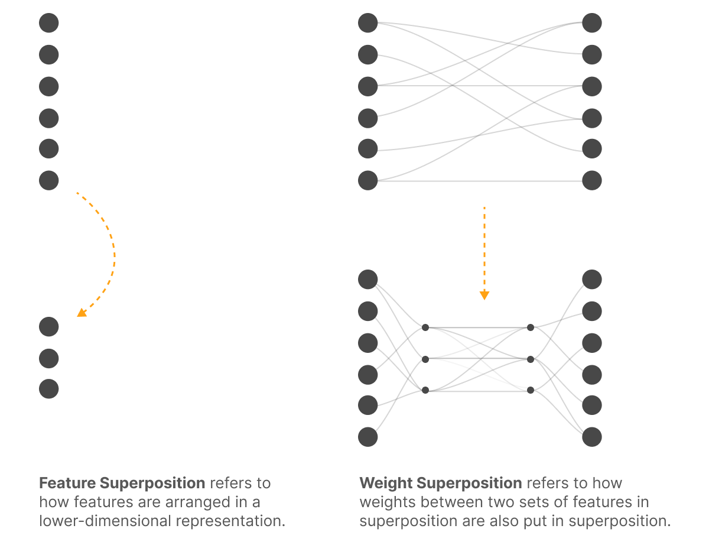

这对电路分析来说是个大问题，因为它会产生“干涉权重”。即使我们能揭示出正确的特征，当我们“提升”（lift）模型权重来连接这些特征时，其中许多权重仍将对应于特征干涉。

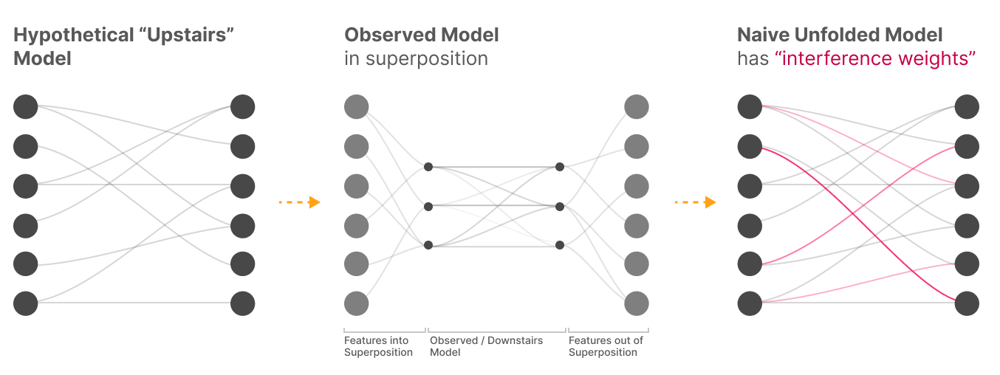

#### 我们该在意干涉权重吗？

这些干涉权重是“真实的”——它们确实描述了我们所观察模型中特征之间的连接。事实上，有一个[假说](https://transformer-circuits.pub/2022/toy_model/index.html#adversarial)认为它们是对抗样本的成因之一！

然而，它们本质上就是噪声，因此没有意义。模型并不“想要拥有它们”。它们会让损失变差，或至少毫无助益。如果我们对提升后的模型做微调（这并不现实），它们就会消失。[^1]

那么一个自然的问题是：出于安全考虑，我们是否应该在意它们？这似乎取决于我们的目标：

- 鲁棒性——它们很重要！我们可以把鲁棒性理解为来自对抗性/最坏情况环境（包括用户输入）的那一类安全关切。在这种情况下，干涉权重真实存在，是攻击者可以利用的对象。（再说一遍，参见“它们可能真的导致对抗样本”的想法！）
- 对齐——它们很可能无关紧要。我们可以把对齐理解为来自对抗性优化或学习过程的安全关切。如果我们把干涉权重定义为那些损害——或至少无助于——优化目标的权重，那么从某种意义上说，按定义它们就与对齐关切无关。

这种划分表明，我们需要找到一种方法把“干涉权重”和“真实权重”分解开来，以便只在相关时才考虑干涉权重。由于对齐是可解释性的优先事项，我们最关心“真实权重”的分析，尽管我们当然也想把干涉权重放在心上。

注意，“我们可以为了对齐而忽略干涉权重”这一论断值得严肃审视。我们目前对它并不完全信服！但对我们来说，它确实看起来相当可能成立，或者至少方向上很可能是对的（也许在对齐方面，干涉权重的重要性远低于真实权重）。

干涉权重能否被忽略，似乎可能是全局机制分析是否可能的关键问题。

#### 重访玩具模型

[Toy Models of Superposition](https://transformer-circuits.pub/2022/toy_model/index.html) 引入了一个研究特征叠加的简单玩具模型：

$h=Wx$

$x' = \text{ReLU}(W^Th+b)$

或者：

$x'=\text{ReLU}(W^TWh+b)$

这个玩具模型实际上有两种不同的解释。我们可以把它理解为研究特征如何在叠加中被编码的几何结构（这正是 Toy Models 的框架方式），但我们也可以把它看作单层恒等电路被放入叠加的一个极简情形：

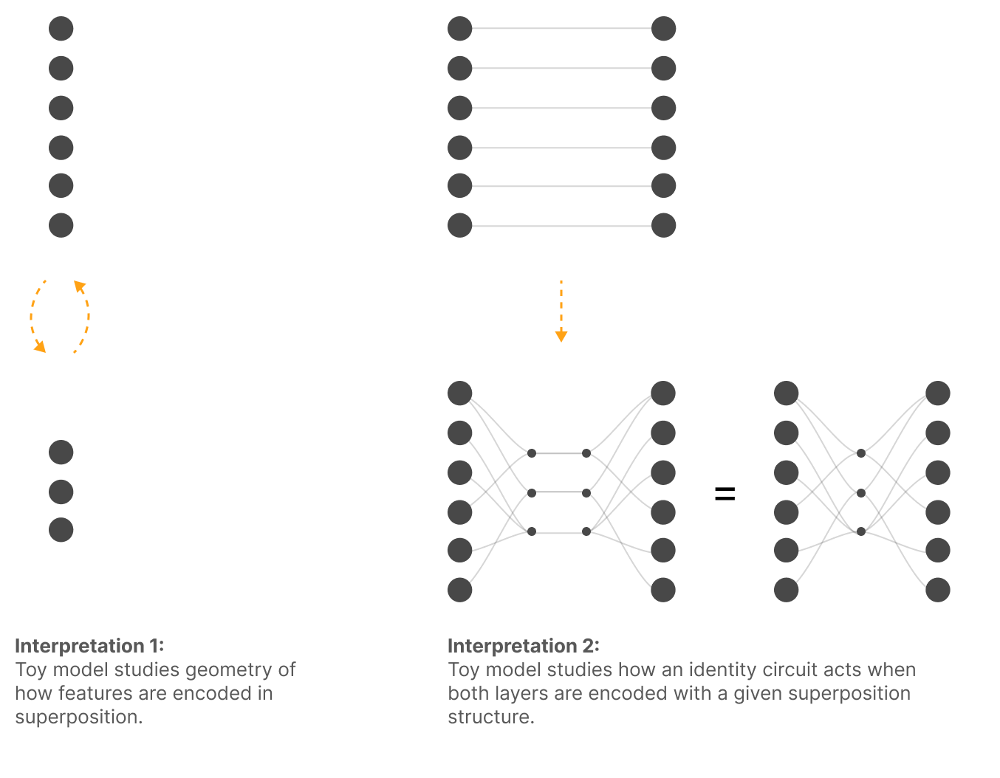

通过以这第二种解释重访玩具模型，我们可以对权重叠加做一些非常基础的实证探索。

当我们训练这些玩具模型时，我们会关注 $U=W^TW$——即观测到的、“下层”的[虚拟权重](https://transformer-circuits.pub/2021/framework/index.html#virtual-weights)。尽管实际上玩具模型有一组更小的权重，它们投影到更低维的空间再投影回来，但这些才是特征之间的有效权重。

#### 复现 Towards Monosemanticity 的现象学

在 [Towards Monosemanticity](https://transformer-circuits.pub/2023/monosemantic-features) 中，我们观察到若干似乎暗示干涉权重的现象。事实上，它们正是我们在这个主题上大量思考的起源！本节的目标是找到一个与最初激发这些思考的现象相匹配的简单玩具模型，并把两者并排比较。

但在深入之前，值得先理解为什么 Towards Monosemanticity 的实验一开始就会产生干涉权重！该论文的核心，是用稀疏自编码器（sparse autoencoder, SAE）提取特征，研究单层 transformer 语言模型 MLP 输出中的叠加。需要理解的关键概念是“logit 权重”（logit weights），它把发现的特征与 logits（对数几率）连接起来。我们的论断是：这些 logit 权重应当包含干涉权重。

注意，在这样的设置中，特征对 logits 具有线性效应（模掉最终层归一化的重新缩放）。我们可以追踪从特征到 MLP 输出、再到残差流、最后回到 logits 的路径，从而得到连接特征与 logits 的虚拟权重。

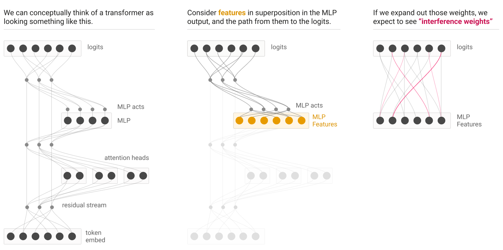

然而，沿着这条路径，特征被迫进入叠加：先是在 MLP 输出中，然后在残差流中更为密集。因此，当我们展开这些权重时，我们预期会看到干涉权重。

事实上，Towards Monosemanticity 确实看到了许多这类干涉权重的迹象！我们很快就会探讨这一点。但在此之前，我们将简要介绍一个玩具模型，并给出干涉权重的形式化定义。这样我们就能把 Towards Monosemanticity 中的真实世界现象与玩具模型的例子并排检验——在玩具模型中，我们可以确切地说，类似的行为正来自干涉权重。

##### 玩具模型设置

我们的目标是复现 Towards Monosemanticity 中相同的基本现象学，具体演示权重叠加如何解释那些观察结果。我们将从能产生大致正确结果的最简单模型入手来说明这些想法。在后面的小节中，我们会构造一个匹配得更好的更复杂模型。

我们考虑一个标准玩具模型，取 `n_features=100`、`n_residual=20`、`feature_density=0.02`。它还会训练不足（这能更好地复现 Towards Monosemanticity 的现象学；我们稍后会探讨完全收敛的例子）。

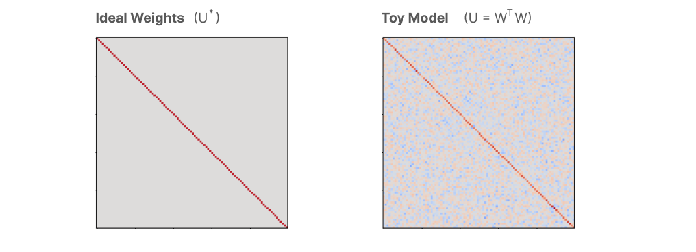

##### 干涉权重与分解

由于叠加，我们观测到的实际权重是“有噪声的”。非正式地说，这种噪声就是干涉权重。

我们可以尝试用以下定义来形式化这一点：

- 理想权重。理想权重 $U^*$ 是指：如果我们针对训练损失微调提升空间中的特征-特征权重矩阵，并加上一个小的权重正则化项以消除损失无差异的权重，所得到的权重。[^2]
- 干涉权重（定义 1）。干涉权重是 $U-U^*$，即观测到的虚拟权重与理想权重之差。

于是我们可以把观测到的权重看作分解为理想权重与干涉权重：

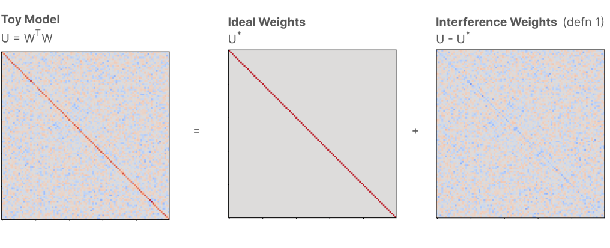

另一种定义是考虑每个权重的损失贡献 $\Delta L(U_{ij})$，即玩具模型的损失与消融掉给定权重后的损失之差。

- 干涉权重（定义 2）。干涉权重是虚拟权重 $U$ 中不能改善损失的那部分子集，即那些满足 $\Delta L(U_{ij}) < \epsilon$ 的权重。

这提供了另一种分解：

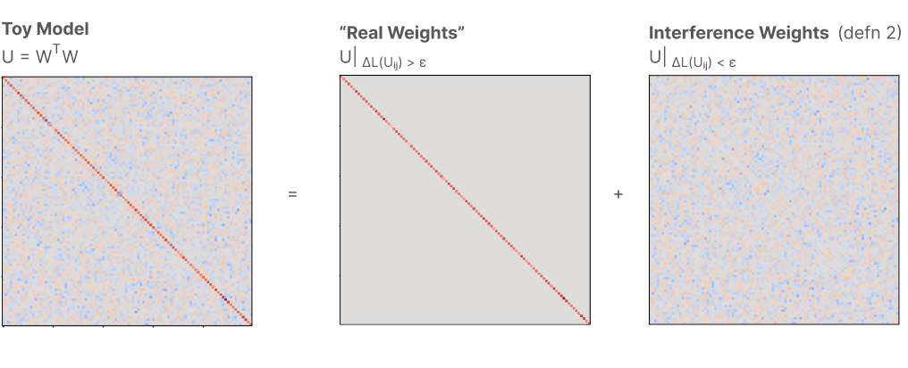

目前，我们先把研究重点放在每个权重的损失贡献 $\Delta L(U_{ij})$ 上。稍后我们会回到这两个定义，以及另外几个更容易操作化的定义。

##### 权重直方图

现在我们可以回到之前的目标：展示我们的玩具模型如何重现 Towards Monosemanticity 的一些有趣现象学。

首先，让我们看看权重 $U$ 的直方图。我们按 $\Delta L(U_{ij})$ 为直方图着色，以便区分干涉权重与真实权重。

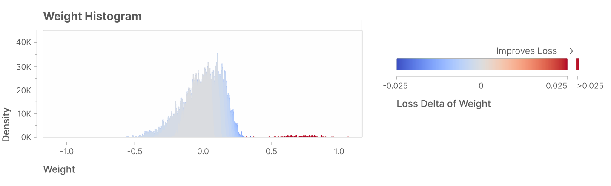

这个图可能看起来很眼熟——它与 Towards Monosemanticity 中的 logit 权重图在性质上相似，比如这张[希伯来语特征](https://transformer-circuits.pub/2023/monosemantic-features/index.html#feature-hebrew)的图：[^3]

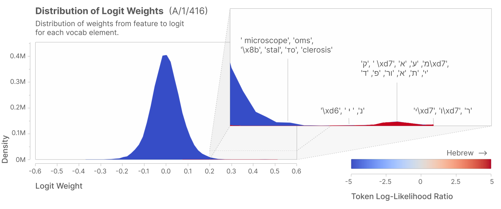

##### 用散点图比较两个模型

我们还可以训练第二个玩具模型（使用不同的随机种子），并把两个模型的权重互相对照画成散点图。[^4] 干涉权重是独立的，而真实权重都显著为正。同样，这与我们在 Towards Monosemanticity 中看到的情况相当相似！

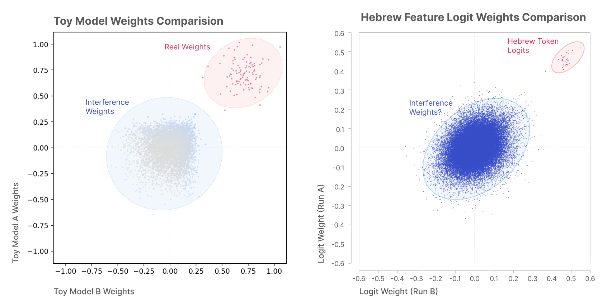

在这里观察一个未欠训练的模型也很有趣。我们可以看到，在这种配置下干涉权重变得更加结构化；但我们也可以看到，真实权重变得完全一致，而干涉权重则不然。

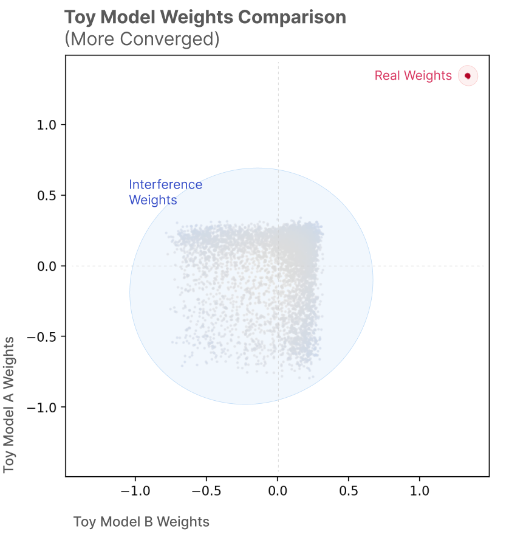

#### 获得更真实的现象学

虽然上述玩具模型的现象学与 Towards Monosemanticity 相似，但在重要方面有所不同。考虑 Towards Monosemanticity 中 [base64 特征](https://transformer-circuits.pub/2023/monosemantic-features/index.html#feature-base64) 的例子：

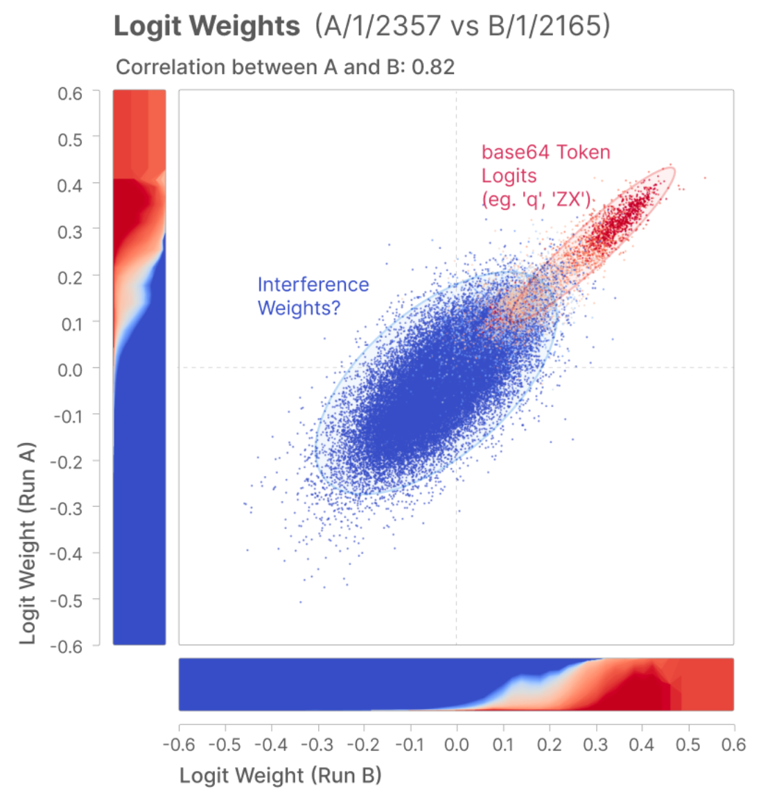

base64 特征的“真实权重”与“干涉权重”之间存在重叠。这正是干涉权重对我们来说如此棘手的关键原因。如果我们能干脆忽略小权重，事情就会容易得多！所以我们想要一个能说明问题为何困难的例子。

##### 更复杂的玩具模型

我们想要一个更真实的玩具模型，但怎样才能得到一个展现出相关现象学的模型呢？在本节中，我们将把玩具模型推广到能做到这一点的模型。

首先，注意我们可以把之前的玩具模型看作在模仿恒等电路 $y = ReLU(Id ~x)$。在玩具模型中，我们设想 $x$ 被压缩进叠加（$h=Wx$），然后被取出叠加（$y' = ReLU(W^Th+b)$）。

现在我们要考虑一个不同的玩具模型，其中我们在叠加中近似的电路更复杂：

$y = ReLU(A x + v)$

对某个随机矩阵 $A$，而不是恒等映射。由于 $A$ 不一定对称，我们需要“解开”（untie）我们的玩具模型，使用不同的权重来投影进、投影出叠加。

$h = W_{down} x$

$y' = ReLU(W_{up} h+b)$

这个玩具模型引入了新的自由度——我们需要指定如何生成 $A$ 和 $v$。

这里的不同选择可以产生非常不同的现象学，而且事实证明，要找到一个满足以下条件的参数区间相当棘手：(1) 真实权重与干涉权重强烈重叠；(2) 训练两个模型不会总是收敛到相同的“理想叠加构型”，从而使散点图坍缩；(3) 训练两个模型不会坍缩为两个对权重做出截然不同二值选择的叠加解，这同样会让散点图变得无趣；(4) 随着训练至收敛，这些性质依然成立。采用分块对角矩阵——每个块本身是稀疏的（概率 0.5），其余元素在 [0,1] 之间均匀采样——可以实现 (1–3)，但无法实现 (4)。分块对角结构似乎对 (2) 确实很有帮助。我们令 $v$ 为取 $-0.1$ 的常向量。

如果我们在 16 维中把 128 个特征放入叠加，取 8 个块、块内权重密度 0.1、输入特征密度 0.3，并训练两个模型，我们会得到如下的权重散点图：

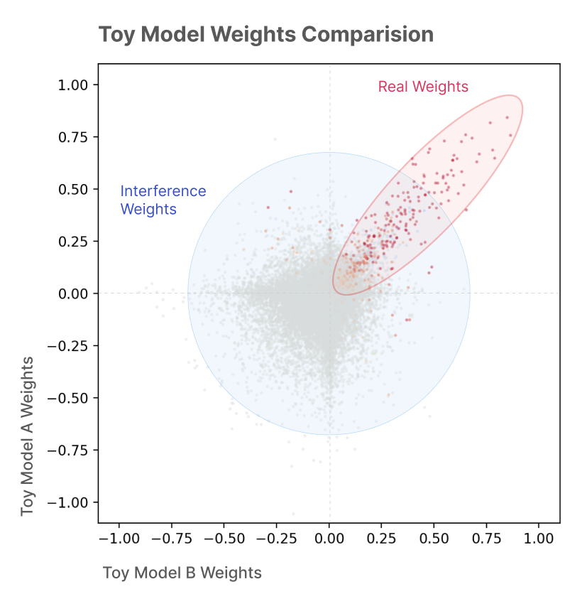

如果只关注其中一个模型，我们会得到如下的权重直方图：

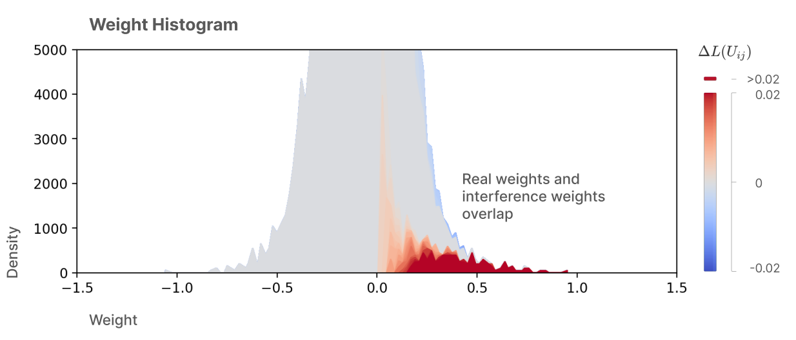

比较学习到的权重与理想权重也很有趣：

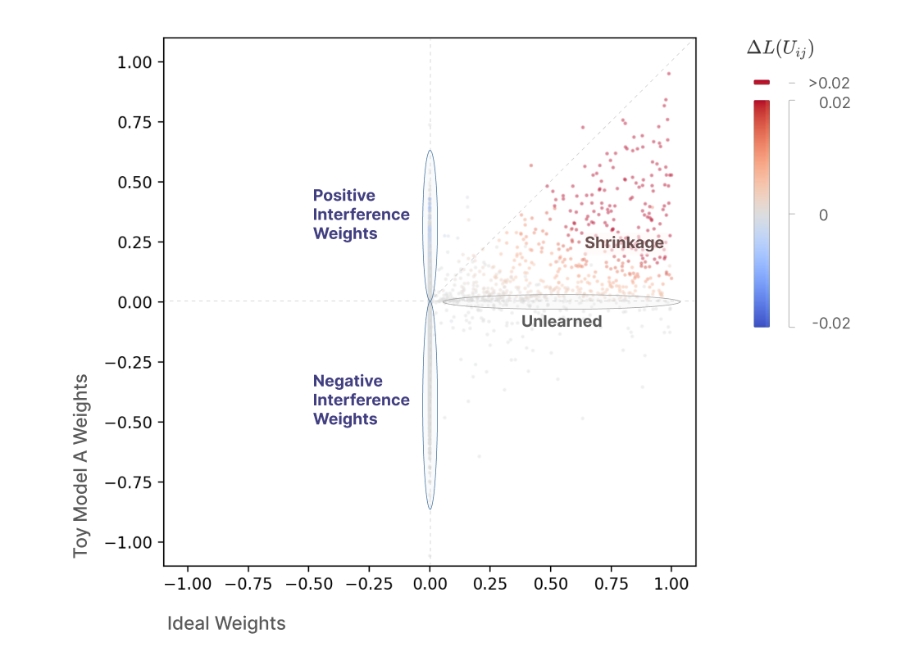

#### 我们该如何处理干涉权重？

理想情况下，我们希望能够把真实权重与干涉权重分离开来，这样我们至少可以选择只对真实权重做电路分析。

之前，我们介绍了干涉权重的两种不同定义：

- 干涉权重（定义 1）。干涉权重是 $U-U^*$，即观测到的权重与理想权重之差。
- 干涉权重（定义 2）。干涉权重是虚拟权重 $U$ 中不能改善损失的那部分子集，即那些满足 $\Delta L(U_{ij}) < \epsilon$ 的权重。

（注意，这些定义确实互不相同，而且并非仅有的可能定义。相关讨论见附录 4。）

理论上，这些定义可以让我们在任何模型中把真实权重与干涉权重区分开。遗憾的是，这两种定义的计算成本都很高，而且对于大型模型中的全部权重，朴素地计算是不可行的。[^5]

因此，我们将考虑廉价的启发式方法，作为这些原理性定义的更易计算的代理指标。目前，让我们考虑五种启发式度量：原始权重（大的权重很可能是真实的）、期望归因（平均效应大的权重很可能是真实的）、目标加权归因（对重要对象效应大的权重更可能是真实的）、频率（经常起作用的权重更可能是真实的），以及一个理想基线——权重的实际损失效应。

然后我们可以据此对真实权重做二分类，以损失效应 $\Delta L(U_{ij}) > \epsilon = 0.0001$ 的权重作为真实权重的真值基准。接着我们可以查看精确率-召回率曲线：

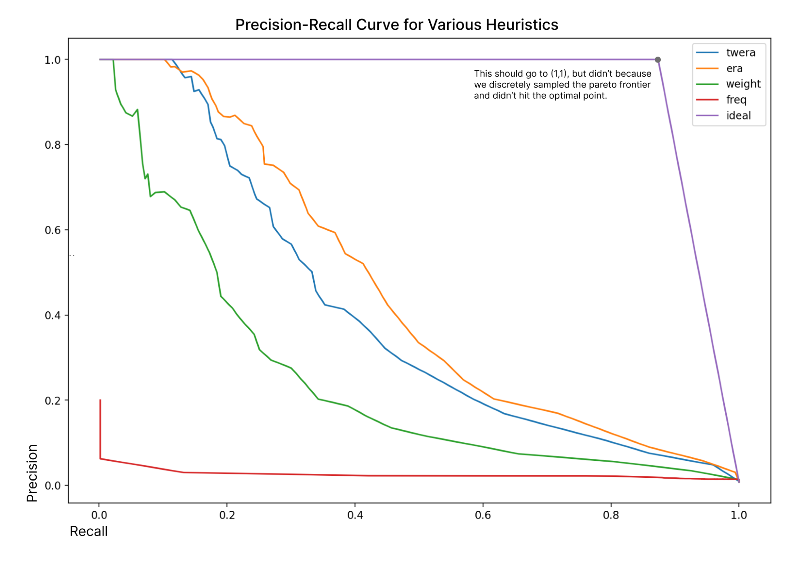

但我们可能其实并不关心召回率本身。在真实权重中，重要性差异很大，丢失某些重要权重比丢失其他权重要糟糕得多。同样，干涉权重中也有一些比其他的更糟糕。所以也许我们应该转而考虑“损失增益”对精确率。[^6] 这要有希望得多！

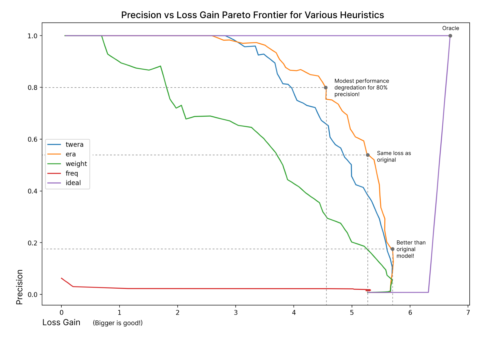

我们能做得更好吗？一个诱人的思路是从压缩感知中汲取灵感——毕竟，我们设想权重实际上生活在一个更高维的空间中，并通过叠加被压缩下来。然而，这要求映射是线性的，而实际情况未必如此（见附录 1）。

#### 结论

干涉权重可能是阻碍我们对模型进行全局电路分析的根本瓶颈。（我们最近关于归因图的工作在很大程度上就是为了避开干涉权重而设计的！）机制可解释性最宏大的愿景要求全局分析，因此解决这个问题似乎相当重要。

处理干涉权重的朴素方法无法扩展到具有大量特征的大型模型，但替代性的启发式方法或许可以。我们可以在玩具模型上检验这些启发式方法，也可以通过在大模型中为数量较少的权重计算真值基准来检验它们。

## 脚注

[^1]: 这实际上比听起来微妙得多，而且按现在的写法有所简化。在实践中，至少有三个问题使这一陈述无法严格成立。（1）特征往往并非完全单语义的，因此模型损失对干涉权重存在些许偏好，需要一个小的惩罚项。（2）如果一个人在“楼上特征模型”中朴素地优化多个矩阵，梯度下降可能会试图改变这些特征——例如，它可能会引入新的叠加与多语义性，利用新增的容量。（3）即使抛开上一点中新引入的多语义性问题，模型也可能只是学到一些在叠加状态下并未试图表示的权重，或者撤销收缩（参见后文虚拟权重对理想权重的散点图）；这在定义 (1) 下是符合预期的，但反直觉。相关讨论见附录 4。由于上述所有问题，在实践中人们可能会做类似的事情：在虚拟权重上学习一个带小惩罚的掩码，思路类似 [Drori, 2025](https://www.lesswrong.com/posts/NAQpcNz9WGSJ8WH2A/sparsely-connected-cross-layer-transcoders)。

[^2]: 请注意，在玩具模型之外，理想权重这一概念很难操作化，而且相应的干涉权重概念可能并非我们想要的。我们在附录 4 中讨论了可能采用的各种定义及其利弊。

[^3]: 请注意配色方案上的差异：上方的着色估计的是权重对损失的平均效应，而下方的着色表示的是词元（token）与我们对该特征解读之间的联系。另一个差异是：玩具模型的直方图展示了来自所有特征的权重，而 Towards Monosemanticity 中的图展示的是从单个特征到 logits（对数几率）的权重。

[^4]: 随机种子指定了权重初始化方式，以及从生成分布中采样数据的方式。

[^5]: 对于第一种方法及其相关变体，我们朴素地需要物化 `n_features^2` 个矩阵。如今我们训练拥有数千万特征的 CLT（跨层转码器），但我们担心最终会需要数十亿。而且我们还需要在大量数据上优化它们。相比之下，对于第二种方法，我们需要在消融每一个 `n_features^2` 虚拟权重时测试损失，这避免了内存问题，但在算力方面可能更糟……不过，对于特征数量较少的较小模型，暴力穷举或许可行。

[^6]: 这里的“损失增益”只是每个单独权重的 $\Delta L(U_{ij})$ 之和，而不是在每个被消融的模型上评估得到的值。
