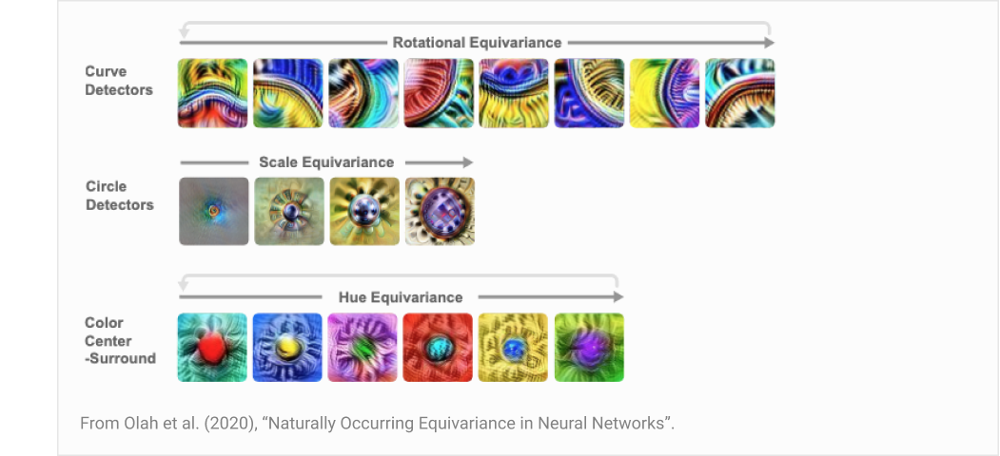
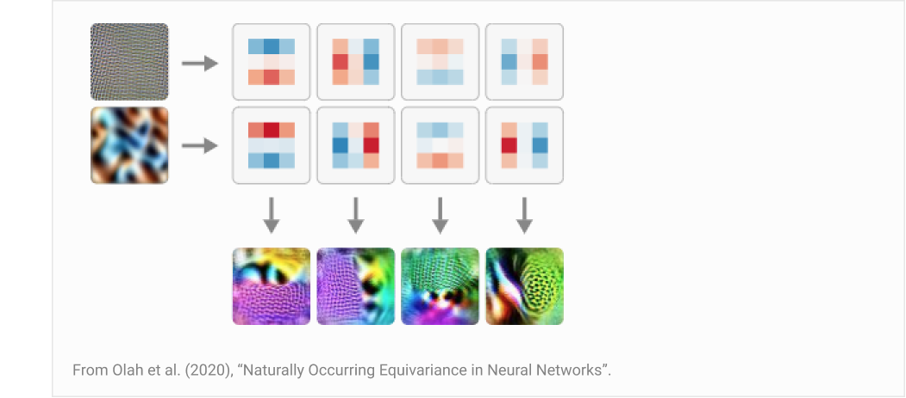
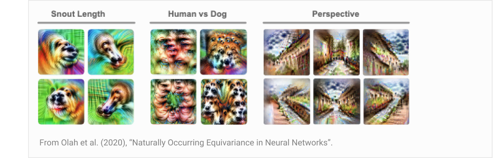
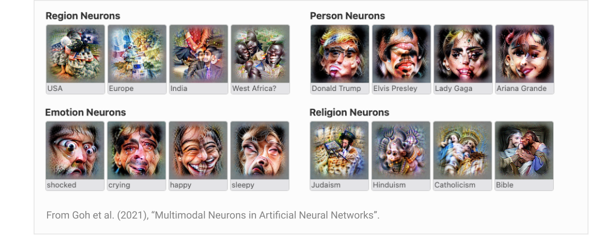
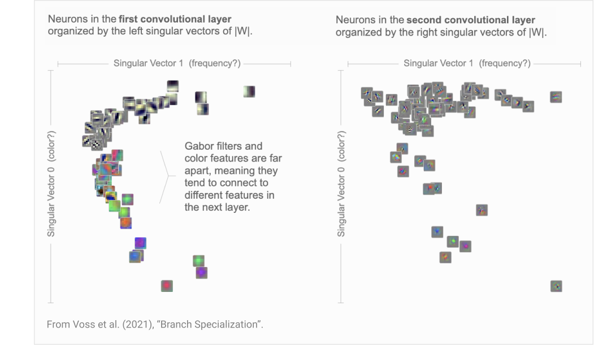
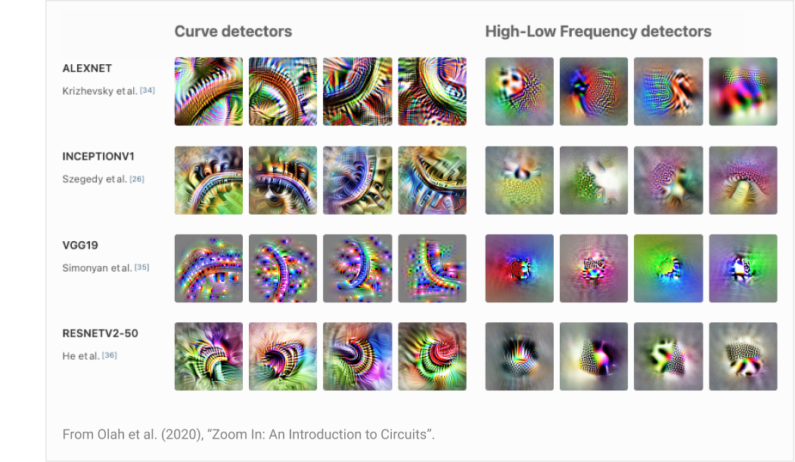
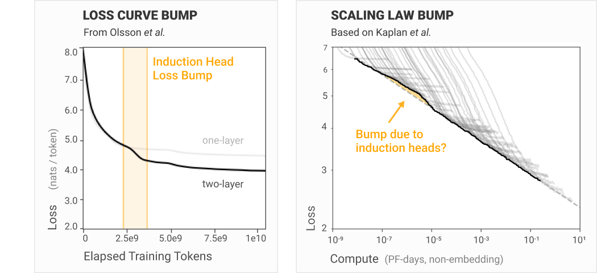

# 可解释性之梦（Interpretability Dreams）

*Apr 4, 2023 · 原文: https://transformer-circuits.pub/2023/interpretability-dreams/index.html*

---

我们当前的研究旨在为机制可解释性研究奠定基础。具体而言，我们致力于解决[叠加](https://transformer-circuits.pub/2022/toy_model/index.html)（superposition）这一挑战。在此过程中，重要的是要时刻记得我们究竟在为什么打地基。这篇文章总结了那些激励我们的愿景——如果我们能克服当前的挑战，我们希望能成为现实的那些激动人心的方向。

我们希望让大家了解我们应对机制可解释性其他挑战（尤其是可扩展性）的构想。由于我们一直专注于基础性问题，通往可扩展可解释性、应对其他挑战的长期路径往往显得晦暗不明。通过阐明这一愿景，我们希望说明我们如何可能化解那些在机制性方法下看似无从下手的限制——比如分析超大规模神经网络。

在深入之前，有几点值得稍作说明。首先，本文中的几乎所有想法此前都已被阐述过，只是深埋在过去的论文里。我们的目标仅仅是通过大量引用相关段落，把这些隐含的愿景浮出水面。其次，需要指出的是，本文的一切内容几乎可以说是定义上就极其推测性、充满不确定性的。其中任何一点最终能否实现，都远未明朗。最后，由于本文的目标是呈现我们个人的愿景、表达令我们振奋的东西，它读起来可能有些宏大——我们希望它能被理解为只是试图坦诚地传达主观的兴奋之情。

##### 概述

- 认识论基础——机制可解释性是一种"微观"理论，因为它试图为一个易于让我们研究者产生误解的领域，打下理解更高层结构的坚实基础。
- 在这样的基础上，我们能构建什么？——只要我们能解决叠加问题、识别出模型中的正确特征与电路，就有许多诱人的研究可能性（其中一些已在 InceptionV1 中得到初步演示）。

- 更大尺度的结构——在我们对特征与电路的理解之上，似乎很可能还能构建一幅更宏大、更抽象的图景，类似解剖学中的器官或神经科学中的脑区。
- 普遍性——许多特征与电路似乎具有普遍性，会在不同神经网络（只要在相似领域上训练）中反复形成。这意味着研究一个模型所得的经验，能为我们理解未来的模型提供立足点。
- 从微观到宏观的桥梁——我们已经看到，一些微观的机制性发现（如归纳头）具有显著的宏观意义。随着我们夯实基础，这座桥梁很可能还能进一步扩展，让我们的机制性理解与更广泛的机器学习产生关联。
- 自动化的可解释性——如果其他方法都行不通，由 AI 自动化的可解释性似乎很有可能帮助我们把可解释性扩展到大型模型（尽管从审美上讲，我们可能更偏好其他路径）。

- 最终目标——归根结底，我们希望这项工作最终能助力安全，也能揭示神经网络内部优美的结构。

### 认识论基础

机制可解释性始于研究神经网络的"微观"尺度：特征、参数、电路。这是一种自下而上的方法，在没有先验理论的情况下研究细小的构件。从很多方面看，这都是一个非常奇怪的抉择。为什么不采取自上而下的方法，直接针对我们关心的问题呢？

我们以惨痛的经验得知，神经网络非常容易让人误入歧途、产生困惑。如果你一开始就对正在发生的事情抱有看似合理的假设，那么即使你的假设是错的，自上而下地搜寻也往往很容易找到支持这些假设的虚幻证据，因为会有大量计算与你的假说相关。[^1]

机制可解释性的关键优势在于，你能真正判定一个论断是否为真。它是一种认识论基础：

事实上，对于足够小的电路，关于其行为的论断会变成数学推理的问题。当然，这种严谨性的代价是，关于电路的论断在范围上远小于整个模型的行为。但看起来，只要付出足够的努力，关于模型行为的论断可以被分解为关于电路的论断。如果真是这样，电路或许可以充当可解释性的一种认识论基础。（Olah et al., 2020；见 ["Interpretability as a Natural Science"](https://distill.pub/2020/circuits/zoom-in/#natural-science)）

这种"基础"是一种兜底，我们应该能把一切归结到它上面。这并不意味着最终计划就是在这一抽象层次上工作。数学基础研究投入了大量工作，但数学家并不会事事都诉诸基础公理。计算机程序可以归约为汇编指令，也可以用图灵机来思考，但程序员在实践中并非如此工作。这些领域有一个稳定的基础，可以借助它（付出努力后）检验任何更高抽象层次上的论断，并在人们构建的不同抽象之间进行转译。但基础只是起点。

类似地，我们预期机制可解释性的大部分激动人心的工作，将是在我们正在建立的基础上构建抽象。这从一开始就是机制可解释性的主要动力：

在我们研究 InceptionV1 及其他模型中的电路的过程中，我们一次又一次地看到相同的抽象模式。……我们认为，研究母题（motifs）很可能对理解人工神经网络的电路至关重要。从长远来看，它可能比研究单个电路更重要。与此同时，我们预期，先为我们积累起一批被充分理解的电路、打下坚实基础，母题研究将因此受益良多。（Olah et al., 2020；见 ["Circuit Motifs"](https://distill.pub/2020/circuits/zoom-in/#claim-2-motifs)）

如果我们将可解释性视为某种"神经网络的解剖学"，那么 Circuits 系列的大部分工作都涉及研究细小的血管——着眼于小尺度，研究单个神经元及其连接方式。然而，许多自然而然的问题是小尺度方法无法回答的。相比之下，生物解剖学中最突出的抽象涉及更大尺度的结构：心脏这样的单个器官，或呼吸系统这样的完整器官系统。于是我们不禁要问：人工神经网络中是否存在"呼吸系统"、"心脏"或"脑区"？神经网络是否具有某些比电路尺度更大、值得我们研究的涌现结构？（Voss et al., 2021，["Branch Specialization"](https://distill.pub/2020/circuits/branch-specialization/)）

让这类更高层的分析能够被严谨地推进，并确信我们没有误解事物，这是当前"底层"机制可解释性研究的核心动机之一。

### 在这样的基础上，我们能构建什么？

如果说我们当前的工作是在打地基，那么一个自然而然的问题就是：在这块地基上能建起什么？本节探讨几种可能性。这些可能性让我们有理由乐观地认为，机制可解释性尽管本质上是微观理论，仍可能对我们最终的目标（将在最后一节讨论）有所贡献。

#### 更大尺度的结构

一旦我们在"底层"机制可解释性上有了坚实基础，就能发现"更大尺度的结构"——这个想法并非纯属臆测。最初的 Circuits 系列文章中满是这类发现——多到它甚至发明了不同类别（"母题"与"结构现象"[^2]）来描述几种不同的大尺度发现！本节将回顾其中几个最引人注目的发现。

遗憾的是，语言模型中普遍存在的叠加使得在其中发现类似结构困难得多，因此例子将主要集中于 Circuits 系列最初研究的视觉模型。话虽如此，我们预期，只要我们能够触及叠加背后的结构，transformer 语言模型中也存在许多类似的东西。

##### 特征族与等变性

大语言模型包含数百万个神经元。由于叠加，特征的数量很可能还要高得多。我们怎么能指望理解一个拥有如此海量特征的模型呢？一个线索是特征族（feature families）的存在。

神经网络的特征往往形成一系列类似特征所构成的族，由某个变量参数化。这似乎是我们理解大型模型的最大希望之一——尽管特征会很多，但它们是有组织的。就像大型数据库可能有很多条目，但因为结构良好，在重要的意义上仍然是可理解的；神经网络或许也是如此。

最基本的版本是由简单变量（如方向、尺度或色调）参数化的特征族。这在 [Naturally Occurring Equivariance in Neural Networks](https://distill.pub/2020/circuits/equivariance) 一文中得到了相当深入的探讨。

但不仅是特征构成这样的族。实现它们的电路以及它们之间的权重也同样以相同的方式被组织、参数化：

不过，这并不局限于简单的变换。神经元族可以由更抽象的变化类型来参数化。

另一篇论文，[Multimodal Neurons in Artificial Neural Networks](https://distill.pub/2021/multimodal-neurons/)，发现了更抽象得多的神经元族。虽然早期的许多神经元族在大语言模型中或许难以想象，但人们很容易想象大语言模型中存在对应于知名人物的特征族，或对应于情绪的特征族。

事实上，我们关于 [Softmax Linear Units](https://transformer-circuits.pub/2022/solu/index.html) 的论文观察到，其研究的大语言模型似乎存在"语言 Y 中的词元 X"（"token X in language Y"）神经元，这可以看作一种由变量 X 和 Y 参数化的简单特征族（见 [第 6.3.5 节"抽象模式"](https://transformer-circuits.pub/2022/solu/index.html#section-6-3-5)）。因此，特征族在大语言模型中存在这一基本前提，似乎至少在有些情况下是成立的。

这里值得注意的更一般的原则是：特征可能存在某种元组织（meta-organization）。退一步看，特征对理解神经网络如此重要的原因在于，激活空间具有指数级的体积，我们需要把它分解成能够独立推理的特征，才有希望理解它（见 [这篇文章](https://transformer-circuits.pub/2022/mech-interp-essay/index.html)）。但是，如果我们借助特征逃离了激活空间的指数陷阱，结果却发现特征太多、无法理解，那该怎么办？我们的希望必须寄托于：特征之上也存在某种组织结构——我们可以在某种意义上于更高一层抽象上重复类似的把戏。特征族是人们能想象到的最简单的组织结构，而且它似乎无处不在。这似乎是一个值得大为乐观的理由！

##### 由权重结构组织的特征

我们在前面讨论的特征族与等变性表明，存在某种能够简化特征的结构——但我们有希望在数百万乃至数十亿特征的乱麻中找到它吗？

一个希望的迹象来自 [Branch Specialization](https://distill.pub/2020/circuits/branch-specialization/) 论文的结果。其主要结果是：当神经网络具有分支时，相似的神经元（尤其是特定的神经元族）会自组织到同一分支中。这或许与生物大脑拥有似乎专司某些功能的"区域"有些相似。分支就像脑区，特定种类的特征与电路会聚集在那里。这提供了一种自动的组织方式。然而，这个主要结果只有在模型架构中内建了分支时才成立。而且在较深的层中它也会失效，很可能是由于叠加。所以这并非一个令人满意的解决方案。

一个更令人满意的答案来自论文末尾的[一个小实验](https://distill.pub/2020/circuits/branch-specialization/#figure-6)。当没有分支时，相同的神经元组织结构似乎也隐含地存在。事实上，情况反而比分支版本更好——我们得到的是一幅神经元在多个关系轴上组织起来的地图，而非一种二元划分。

这种特征的"元组织"正是我们想要的。而且，只要特征与相关特征之间的连接比与不相关特征之间更紧密，这种组织结构似乎就应该会从神经网络的"连接组"（connectome）中自然涌现出来！

叠加会遮蔽这类结构也是讲得通的。最优的叠加策略是把在叠加中尽可能相距远的特征放在一起，因为它们的干涉最小。但如果我们能解开叠加，所有这些结构都应该在那里等待我们去发现。

##### 其他结构

神经网络中还有许多其他种类的母题与更高层结构的迹象。[Weight banding](https://distill.pub/2020/circuits/weight-banding/) 就是更大尺度结构中一个特别有趣的例子。

#### 普遍性

到目前为止，我们讨论了网络内部的结构。但同样有趣的是考虑跨网络重复出现的结构。我们称之为[普遍性（universality）](https://distill.pub/2020/circuits/zoom-in/#claim-3)。

普遍性对可解释性有重大影响，因为它改变了研究单个模型的价值。如果特征与电路是普遍的，那么投入于理解一个模型的心血可以迁移到其他模型上：

专注于电路研究，普遍性真的必要吗？与前两个论断不同，如果这一论断被证明为假，对电路研究也不会是致命的。但它确实在很大程度上决定了什么样的研究才有意义。我们把电路引入为一种"深度学习的细胞生物学"。但想象一个世界，其中每个物种的细胞都有一套完全不同的细胞器和蛋白质。研究一般意义上的细胞还有意义吗？还是我们会把自己限制在少数几种特别重要的细胞物种的狭窄研究上？类似地，想象一个解剖学研究的场景，其中每种动物物种的解剖结构都彼此毫不相关：我们还会认真研究人类和少数几种家养动物以外的任何东西吗？

同样地，普遍性假说（universality hypothesis）决定了何种形式的电路研究才有意义。如果它在最强意义上成立，我们或许可以想象一种"视觉特征周期表"（periodic table of visual features）：跨模型观察并编目各种特征。另一方面，如果它基本上不成立，我们就只能聚焦于少数几个具有特殊社会重要性的模型，并指望它们别每年都变。也可能存在介于两者之间的世界：有些经验可以在模型之间迁移，另一些则必须从头学起。（Olah et al., 2020；参见 [“Universality”](https://distill.pub/2020/circuits/zoom-in/#claim-3)）

视觉模型中的许多特征似乎是普遍的，能够在一系列模型中稳定出现。当然，这一点对 Gabor 滤波器而言早已是众所周知，但其他特征似乎[也是如此](https://distill.pub/2020/circuits/zoom-in/#claim-3)：

关于普遍性，还有一些其他有趣的数据点：

- 普遍电路：高低频检测器（见上图）的电路也具有[相同](https://distill.pub/2020/circuits/frequency-edges/#universality)[电路](https://distill.pub/2020/circuits/frequency-edges/#universality)[跨模型出现](https://distill.pub/2020/circuits/frequency-edges/#universality)的现象。
- 人工与生物神经网络之间的普遍性：[曲线检测器](https://distill.pub/2020/circuits/curve-detectors/)与神经科学中发现的神经元非常相似。最近，[与高低频检测器相似](https://twitter.com/ch402/status/1638931735202385920)的神经元[在神经科学中被发现](https://www.biorxiv.org/content/10.1101/2023.03.15.532836v1)。当然，与著名的"Jennifer Aniston"神经元结果类似的多模态神经元，也[在 CLIP 中被发现](https://distill.pub/2021/multimodal-neurons/)。
- transformer 语言模型中的普遍性：诸如前一词元头和[归纳头](https://transformer-circuits.pub/2022/in-context-learning-and-induction-heads/index.html)之类的注意力特征，在 transformer 语言模型内部形成得相当稳定。我们还观察到一些有限普遍性的例子（例如，多个小型 [SoLU 模型](https://transformer-circuits.pub/2022/solu/index.html)中都出现了"全大写文本"神经元）。

普遍性似乎至少有几分成立，这使得识别这些普遍特征变得非常有价值。我们每发现一个特征，就为未来要研究的模型提供了一个稳固的立足点。

#### 连接宏观与微观

在许多研究领域，多个科学分支以不同抽象层次研究同一主题是常见现象。一个群体从宏观层面研究问题（例如统计物理、解剖学、生态学……），另一个群体则从微观层面研究事物（例如粒子物理、分子生物学）。一个"微观领域"取得成功的最大标志之一，或许就是能够预测宏观理论中的例外。理想气体定律很完美，直到你的气体凝结成液体，它便彻底失效。预测这样的例外，正是更精细理论的责任。

机制可解释性是对神经网络的一种极其微观的分析。我们能对宏观行为做出有用的预测吗？我们能解释缩放定律这类更宏观理论中的例外吗？

[归纳头](https://transformer-circuits.pub/2022/in-context-learning-and-induction-heads/index.html)似乎是微观神经网络现象产生宏观效应的一个例子。它们能在 transformer 语言模型的损失曲线上引起一个可见的凸起。[原始缩放定律论文](https://arxiv.org/pdf/2001.08361.pdf)中观察到的那个凸起也很可能归因于归纳头（见图 13："在 $10^{-5}$ PF-days 处醒目的隆起标志着从 1 层网络到 2 层网络的转变"）。

虽然微观理论并非宏观理论的先决条件——对遗传性状的研究先于 DNA 介导遗传的发现——但一个好的微观理论能在其有效域内支撑宏观理论的可信度，并提示它将在何处失效。

这样的理论会是什么样子？当然，我们无从知晓，但推测起来很有意思。我们可以设想，归纳头所描绘的图景要普遍得多。存在许多普遍电路，每个电路实现一种行为，并带来相应的损失下降。从学习动力学的角度看，这些电路必然会在损失空间中形成低谷——事实上，我们甚至可以设想，损失景观中的每一个低谷都是某个电路投下的阴影。类似地，随着模型规模的扩大，它们会实现新的电路，从而形成缩放定律。一个更复杂的故事可能是电路之间存在依赖关系：如果没有较简单的电路作为垫脚石，模型就无法直接跳到非常复杂的电路。如果我们能理解这张依赖图——哪些电路依赖哪些其他电路、它们占用多少容量、各自使损失边际下降多少——我们或许就能用一套机制理论同时解释学习动力学和缩放定律。

#### AI 自动化可解释性

本文的主题之一是：更大尺度的结构——更一般地说，建立在特征与电路之上的抽象——或许能让机制可解释性扩展到大型模型。但通往机制可解释性规模化还有一条完全不同的路径：利用其他 AI 来自动化可解释性工作。最近，[Bills](https://openaipublic.blob.core.windows.net/neuron-explainer/paper/index.html)[等人](https://openaipublic.blob.core.windows.net/neuron-explainer/paper/index.html)的一篇论文为这种方法提供了一个有趣的概念验证。此类方法——至少就我们所知的方法而言——仍然需要解决叠加问题，但或许能显著减轻其他挑战。

这一研究方向值得大书特书，而且我认为它最终变得非常重要的可能性相当大。AI 似乎正处在一个指数级发展的趋势上，可解释性想要跟上步伐，最好的办法或许就是让自己搭上同一条指数曲线。归根结底，如果这是最好的前进道路，我们会欣然接受。

但我们相信，只要有可能，也有令人信服的理由去尝试构建一种纯粹属于人类分析工作的机制可解释性版本。

在某种程度上，这种处境与[四色定理](https://en.wikipedia.org/wiki/Four_color_theorem)颇为相似：这是一个著名的数学结论，由计算机证明，但人类无法理解其证明过程。对许多人来说，这样的证明缺乏美感。我们中有些人坦言，对 AI 自动化的可解释性也有类似的审美反应。

但比审美更重要的是：如果我们依赖 AI 来审计 AI 系统的安全性，那么对于是否应该信任这个帮助我们审核的模型，似乎存在重大的疑虑。这显然并非不可逾越的反对意见——肯定有巧妙的方法可以绕开它。但很可能，许多绕开它的方式都会让可解释性的失效模式与其他安全方法的失效模式更加相关。

尽管如此，本文所建议的这类方法最终可能确实不够用，可解释性也许不得不依赖 AI 自动化。此外，还存在"AI 辅助可解释性"（AI-assisted interpretability）这一中间路线的可能：AI 帮助加速可解释性研究，但关键部分仍由人类验证。为此铺路的工作无疑令人振奋，也至关重要。

### 终极目标

本文大部分篇幅都在讨论那些诱人却受阻于叠加等基础问题亟待解决的研究方向。但在它们之外，还有一个更大的问题——这条研究路线的终极目标是什么？我们希望并期望得到什么？

#### 机制可解释性如何融入安全？

机制可解释性可能为安全做出贡献的[方式](https://www.lesswrong.com/posts/uK6sQCNMw8WKzJeCQ/a-longlist-of-theories-of-impact-for-interpretability)有很多。本节描述一个雄心勃勃的研究方向，它目前充当着我们研究的某种"北极星"。它有很大可能行不通，但我们相信，一旦成功，它将极大地促进安全。

出于安全考虑，我们想做出诸如"模型永远不会撒谎"或"模型永远不会操纵我们"这样的声明。如果我们试图将其形式化，我们想做的似乎是类似下面这种形式的声明：

遗憾的是，这并不是机器学习通常处理的那类声明。通常机器学习关心的是分布上的期望值。而我们担心的是分布外行为、最坏情况下的表现。唯一让这件事稍微容易一点的是，我们或许只关心"蓄意的"失效（而究竟如何捕捉这一点，还非常不清楚！）。

我们又怎能指望评估这样的声明呢？感觉上——如果我们极其雄心勃勃——在同时解决叠加与可扩展性之后，或许会有一条路可走。拥有一套完整的特征，或许能让人获得一个可供枚举的抓手，在某种意义上触及"模型的所有行为"。

这是一个模糊、高度推测性的想法。但也许确有某种可能性。这一想法在《Toy Models》论文的["Strategic Picture"一节](https://transformer-circuits.pub/2022/toy_model/index.html#strategic)中有更深入的勾勒。

#### 美与好奇心

虽然我们的目标是安全，但我们同样相信，神经网络内部隐藏着某种深层次的美，即便在安全关切不那么紧迫的世界里，这种美也足以让我们的探索物有所值。随着深度学习的进展，可解释性正是那个亟待被解答的研究问题！[^3]

深度学习的成功常被哀叹为科学上的乏味。你只需堆叠层数、把模型做得更大，就能获得更低的损失。优雅而巧妙的构思往往并不必要。Sutton 的文章 [The Bitter Lesson](https://www.cs.utexas.edu/~eunsol/courses/data/bitter_lesson.pdf) 著名地将其呈现为一个痛苦的教训：随着我们把更多算力砸向机器学习，许多美妙的构思都变得无足轻重。

我们持相反的看法。深度学习与规模的美丽是一种生物性的美丽。正如进化的简单性在自然界催生出令人惊叹的美与复杂，作用于神经网络的梯度下降的简单性，也在机器学习中催生出令人惊叹的美。

神经网络中处处是优美的结构，只要我们愿意去寻找。

## 脚注

[^1]: 设想一个在 ImageNet 上训练的视觉模型。一个自然的假设是：它会包含一个狗头检测器——事实上，ImageNet 模型似乎确实稳定地包含狗头检测器！然而，在包含狗头检测器之前的更早层中，模型还会有狗鼻子、狗毛、眼睛等检测器，它们组合起来能非常准确地预测狗头的存在。这意味着，即使某一层尚未被最好地理解为拥有狗头检测器特征，线性探针也会发现一个"狗检测器"。

[^2]: 基序（motif）是网络内部重复出现的低层模式，而结构现象则是一种大规模性质。稍后我们还会讨论普遍性：它指的是某种模式在不同神经网络之间重复出现，而非在单个网络内部重复。

[^3]: 我们还认为，作为一个前范式领域，可解释性特别受益于研究者探索并追随自己的个人品味，包括审美偏好。我们预期，比起例如从安全目标出发的显式反向推导，这种方式能更有效地汇集最终可能奠定该领域的洞见与观察。在迈向我们的目标之前，我们需要一张更好的疆域地图！
