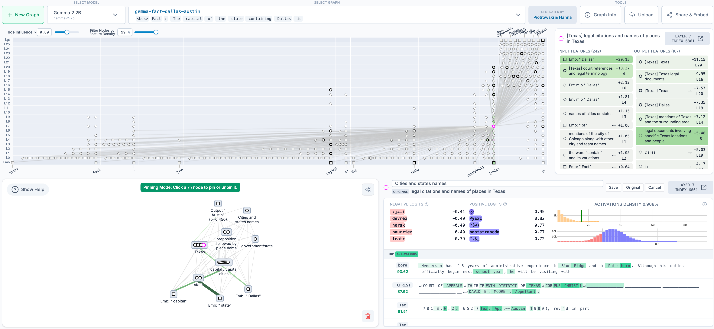

# 开源电路追踪工具（Open-Sourcing Circuit-Tracing Tools）

*2025 年 5 月 29 日 · 原文: https://www.anthropic.com/research/open-source-circuit-tracing*

---

在最近的可解释性研究中，我们介绍了一种[追踪大语言模型思维过程](https://www.anthropic.com/research/tracing-thoughts-language-model)的新方法。今天，我们将这一方法开源，让所有人都能在此基础上继续推进研究。

我们的方法是生成*归因图*（attribution graph），它能（部分地）揭示模型在内部为决定某个特定输出而经历的步骤。我们发布的这个开源[库](https://github.com/safety-research/circuit-tracer)支持在流行的开放权重模型上生成归因图——同时，由 Neuronpedia 托管的前端界面让你可以交互式地探索这些图。

本项目由我们的 [Anthropic Fellows](https://alignment.anthropic.com/2024/anthropic-fellows-program/) 项目参与者牵头，并与 [Decode Research](https://www.decoderesearch.org/) 合作完成。

Neuronpedia 上交互式图浏览器界面的总览。

要开始使用，可以访问 [Neuronpedia 界面](https://www.neuronpedia.org/gemma-2-2b/graph)，为你选择的提示词（prompt）生成并查看自己的归因图。如需更高级的用法和研究，请查看[代码仓库](https://github.com/safety-research/circuit-tracer)。本次发布使研究人员能够：

1.   **追踪电路**：在受支持的模型上，通过生成自己的归因图来追踪电路；
2.   **可视化、标注与分享**：在交互式前端中可视化、标注并分享归因图；
3.   **检验假设**：通过修改特征值并观察模型输出如何随之变化来检验假设。

我们已经用这些工具研究了一些有趣的行为，例如 Gemma-2-2b 和 Llama-3.2-1b 中的多步推理与多语言表征——相关示例和分析见我们的演示[笔记本](https://github.com/safety-research/circuit-tracer/blob/main/demos/circuit_tracing_tutorial.ipynb)。我们也邀请社区帮助我们寻找更多有趣的电路——作为灵感来源，我们在演示笔记本和 Neuronpedia 上提供了一些我们尚未分析的额外归因图。

我们的 CEO Dario Amodei [最近撰文](https://www.darioamodei.com/post/the-urgency-of-interpretability)谈到了可解释性研究的紧迫性：目前，我们对 AI 内部运作机制的理解远远落后于我们在 AI 能力方面取得的进展。通过开源这些工具，我们希望让更广泛的社区更容易研究语言模型内部正在发生的事情。我们期待看到这些工具被用于理解模型行为——也期待看到能改进工具本身的扩展。

_开源电路发现库（open-source-circuit-finding library）由 [Anthropic Fellows](https://alignment.anthropic.com/2024/anthropic-fellows-program/) 项目成员 Michael Hanna 和 Mateusz Piotrowski 开发，导师为 Emmanuel Ameisen 和 Jack Lindsey。Neuronpedia 的集成由 [Decode Research](https://www.decoderesearch.org/) 实现（Neuronpedia 负责人：Johnny Lin；科学负责人/总监：Curt Tigges）。我们的 Gemma 图基于 [GemmaScope](https://ai.google.dev/gemma/docs/gemma\_scope) 项目训练出的跨层转码器（transcoder）。如有问题或反馈，请在 GitHub 上提交 issue。_
