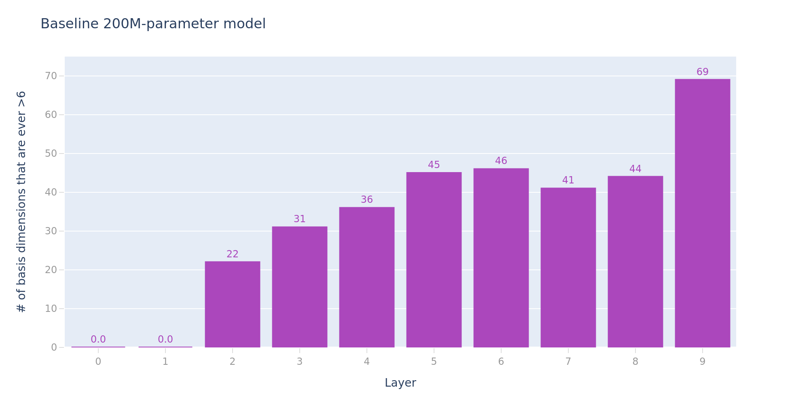
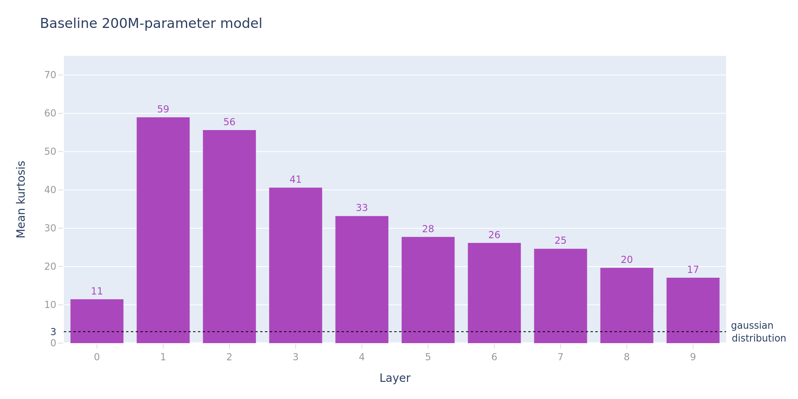
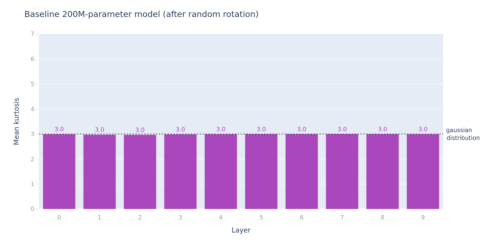
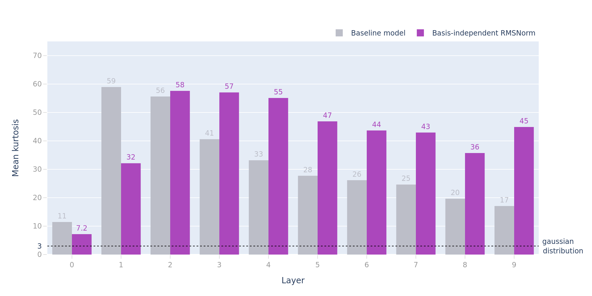
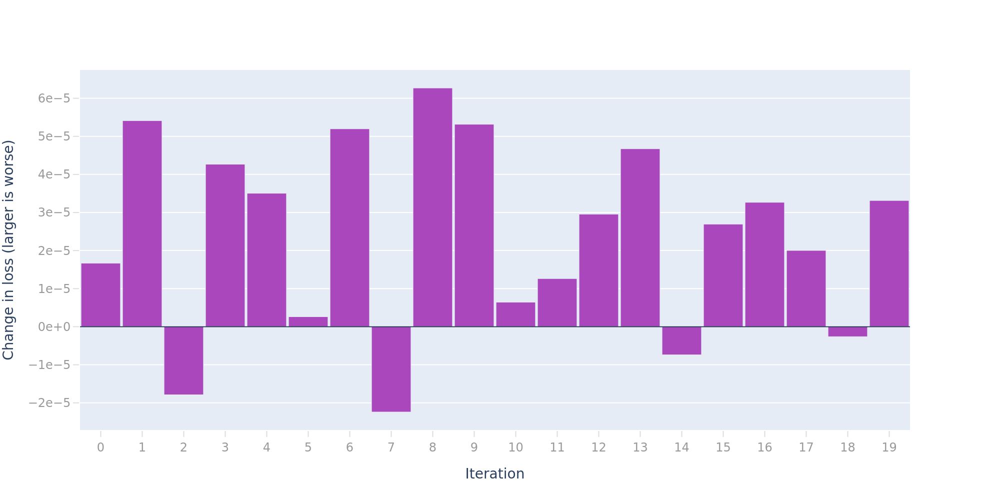
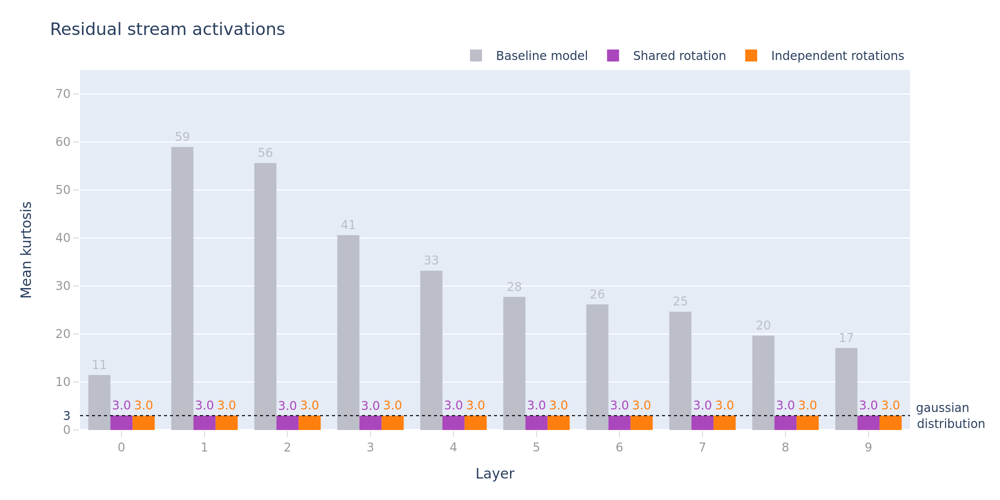
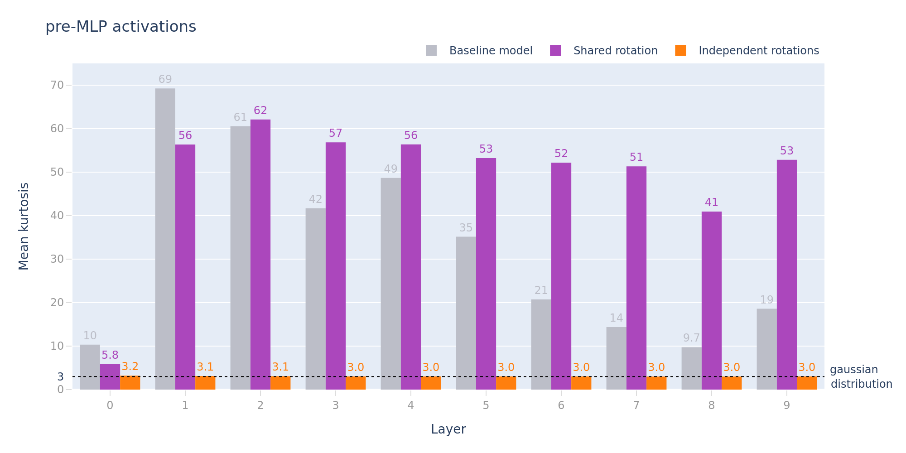

# transformer 残差流中的特权基

*Apr 28, 2023 · 原文: https://transformer-circuits.pub/2023/privileged-basis/index.html*

---

#### 摘要

我们对 Transformer 架构的数学理论表明，残差流中的单个坐标不应具有任何特殊意义（也就是说，基方向在某种意义上应当是"任意的"，其编码信息的可能性并不比随机方向更高）。但近期工作表明，这一观察在实践中并不成立。我们研究了这一现象，并初步得出结论：罪魁祸首是 Adam 优化器中的逐维归一化项（per-dimension normalizers）。

我们还考察了 Transformer 中另外两个显而易见的基依赖来源：层归一化（layer normalization），以及有限精度浮点计算。我们可以确信地排除它们——它们并非所观测到的基对齐（basis-alignment）现象的来源。

#### 更长的故事

Tim Dettmers [最近发布](https://arxiv.org/abs/2208.07339)了一组研究成果与代码，探讨他所谓的 Transformer 模型中的"涌现离群值"（emergent outliers）：在大型 Transformer 中，残差流的某些坐标会出现非常大的离群值，其数值最高可达其他坐标的 20 倍。

这项工作提出的显而易见的可解释性问题在于：

这些特征是什么？它们代表什么，或者说它们起什么作用？

然而，还有第二个问题，只有借助[更深入的 Transformer 数学模型](https://transformer-circuits.pub/2021/framework/index.html#def-privileged-basis)才会显现出来：

为什么这些特征是基对齐（basis-aligned）的？

我们通常认为残差流"没有特权基"（privileged basis）。我们的意思是：没有任何理由预期残差流中的各个坐标具有什么特定含义或重要性质。这一信念源于如下观察：所有对残差流的读写操作，都是经由某个任意的满秩线性变换完成的。这又意味着，我们可以用任意一个满秩线性变换去变换残差流，再以适当的方式把同样的变换乘进 Transformer 中的每一个其他矩阵，最终得到一个函数完全相同、但坐标完全不同的模型。

在模型为残差流选择了任意基的假设下，我们预期大的特征会"摊开"到许多基坐标上——按期望而言，它们对每个坐标的贡献大约是其幅度的 $1/\sqrt{d}$。

因此，当我们观察到某些残差流维度上持续出现极端值时，就说明模型或其训练过程中的某个环节破坏了这种对称性！那会是什么呢？

#### 实验

首先，我们将借助 Anthropic 的代码库，在一个 2 亿参数的模型上演示这一行为。Dettmers 在这一规模上观察到了离群值，但他认为这些离群值要到模型更大时才会稳定出现；我们发现，在我们的模型上它们出现的频率已足以支撑我们的实验，这使我们得以在相对较小的模型上进行实验。

##### 度量离群值

为了证明我们观察到的现象与 Dettmers 的相似，我们将采用他的初始定义来考察我们的模型：把"离群值"定义为残差流中绝对值 >6 的单个标量值（我们已验证，对于我们的模型，这个阈值能够挑出极端的尾部；并且在很大范围的阈值取值下，我们都能看到定性相似的结果）。然后，我们可以在一个（128 条序列 × 1024 个词元（token））的测试批次上，把残差流激活中曾出现过离群值的数量绘制成模型层的函数：

可以看到，随着模型层数的加深，离群值数量不断增长，典型的层会表现出 20–60 个离群维度（该模型的隐藏维度总数为 d_model=1280）。

##### 激活峰度

虽然这些（部分）基对齐的离群值是我们发现异常的第一个线索，但我们想找到一种更通用的度量来检测特权基的存在——这种度量（除了其他特性之外）不需要调节任意的阈值。

我们断言：如果你把单个词元的激活向量看作来自某个概率分布的独立样本，那么在模型不处于特权基的情况下，该分布的峰度（kurtosis）应为 3。[^1] 下面给出这一论断的论证。

如果我们相信某个表示不存在特权基，那么我们就预期每个特征都由一个随机方向来表示。高维空间中的随机方向具有什么性质呢？事实证明，采样随机单位向量有一个标准技巧：先从各向同性高斯分布（isotropic Gaussian）中采样，再把所得向量缩放到单位范数。注意，这对大多数分布并不成立——关键在于各向同性高斯分布在任意标准正交基变换下都是不变的。这一切意味着，我们可以把随机方向看作（相差一个缩放）一组来自高斯分布的独立样本所组成的向量。需要指出的是，这并非说 n 维球面上点的整体分布是高斯分布，而只是说 n 维球面上的任意一个点都可以理解为一组来自某个高斯分布的样本经过缩放后的序列。

如果每个特征都这样表示，那么所得激活向量的各分量应当服从高斯分布。这是因为激活向量将是每个特征对应的基方向分布之和：对高斯分布做缩放仍得到高斯分布，高斯变量相加也仍是高斯分布。至此，我们可以用多种方式来刻画"高斯性"（Gaussianness），但我们选择聚焦于峰度。峰度衡量的是分布的尾部厚薄；高斯分布的峰度为 3，任何更大的值都表示重尾（heavy tails）。因此按期望而言，这些"高斯样本"的峰度应为 3。为了准确估计这一期望，我们对许多词元的激活值分别计算峰度，再取平均。

把这个度量按层绘制出来，可以看到我们的分布严重偏离高斯分布（因而处于非任意基中）：

作为示例，同时也是为了验证我们度量的行为，我们可以看看对同样的残差流数值施加一个固定的随机旋转之后（等价于在某个随机选取的其他标准正交基中观察它们）会怎样。对旋转后的激活值计算同样的峰度度量，我们会发现数值几乎恰好等于 3，与预测一致。

#### 关于基对齐的假说

##### LayerNorm

在标准 Transformer 的前向传播中，唯一值得注意的依赖基的操作就是 LayerNorm（层归一化）。LayerNorm 存在两种潜在的基依赖：

- 它会减去均值，这等价于与 $\frac{1}{d_\text{model}}(1, 1, 1, \ldots{})$ 做点积
- 它有一个逐通道的可学习权重。施加这一权重仍是线性操作，但它是在标准基中学习并施加的，因此可以想象，它或许会以某种方式偏爱这一基。

为了检验这一假说，我们修改 LayerNorm，去除其基依赖性。所得的操作与 [RMSNorm](https://arxiv.org/abs/1910.07467) 类似，后者有时也用于 Transformer 训练。我们可以把修改后的归一化看作"不减去均值的 LayerNorm，只使用一个可学习的缩放参数"。即：

$$\text{RMSNorm}(x_i) = \alpha\cdot\frac{x_i}{\text{RMS}(\bf{x})} ~~~\text{where}~~~\text{RMS}(\bf{x})=\sqrt{\frac{1}{d}\sum_{i=1}^dx_i^2}$$

这一操作在任意标准正交基中都是相同的。

我们发现，在我们的训练设置下，采用这种归一化策略的模型与基线 LayerNorm 的表现完全相同。那么它能解决基依赖问题吗？

结果与参考模型大体相似，甚至可以说尾部更重。由此我们得出结论：标准 LayerNorm 中（公认很小）的基依赖并非我们离群值的成因。

##### 有限精度

Neel Nanda 和 Alex Silverstein [猜测](https://aslvrstn.com/posts/transformer_precision_loss/)，这种基偏好源于 Transformer 实现中使用的有限精度（通常是 16 位或 32 位）浮点数。据我们理解，该假说认为：在混合不同量级的特征时，把它们放进不同的坐标是有利的，因为浮点数在累加跨不同尺度的数值时会迅速损失精度。

##### 验证模型与基无关

借助修改后的 RMSNorm，我们的模型现在应当完全旋转不变，因此我们可以真正地旋转模型，来检验浮点精度假说（至少在前向传播上）！

我们生成一个随机标准正交矩阵 $R$，然后对模型中的每个矩阵，要么乘上 ${R}$（如果该矩阵是从残差流读取），要么乘上 $R^\intercal$（如果该矩阵是向残差流写入）。

随机旋转平均而言确实会带来一点损失，但数值绝对微乎其微（作为参照，基线模型的测试损失约为 3.02 nats（自然对数单位）），而我们能看到的大得多的噪声来自诸如模型初始化时的不同随机种子等因素。

由此我们得出结论：这个模型确实旋转不变，而且即使把浮点误差考虑在内，这一事实依然成立。

#### 在任意基中优化

前一个实验基本排除了 Transformer 前向传播中对浮点精度细节的微妙依赖。然而，仍存在一种可能：训练过程中的模型梯度（其坐标同样可以跨越多个数量级）会以某种方式与浮点精度相互作用，而这种相互作用导致了标准基被偏爱。

为了探究这种可能性，我们在训练过程中也施加类似的旋转操作来训练一个 Transformer。

具体来说，我们可以在初始化时生成固定的随机旋转矩阵，并在每次对残差流进行读取或写入时把它们乘进激活值中。由于这一操作恰好发生在满秩乘法之前/之后，它不会改变 Transformer 可表达的函数类别，但确实会让模型计算过程中不同位置所使用的基彼此解耦。

我们以两种变体各训练了一个这样的模型：

"共享旋转"（Shared rotation）模型：固定一个随机旋转，每次从残差流读取（向残差流写入）时都施加该旋转（或其转置）。这与前向传播实验的设置类似，区别在于这里旋转的是激活值，而不是参数矩阵。在这个模型中，我们实际上把残差流基与计算基解耦了：所有计算（注意力层和 MLP 层）都发生在同一个共享基内部，而信息则沿着残差流以另一个不同的基传递。

"独立旋转"（Independent rotations）模型：每次对残差流的读取或写入都使用不同的随机旋转。在这个模型中，每个计算层都在自己的基中运行，与其他任何层或残差流都互不相关。

我们发现，两个模型的表现与基线模型基本完全相同（本文末尾附有损失曲线）。

由此我们得出结论：即使把浮点精度考虑在内，Transformer 的训练和正常运作也并不依赖特权基。训练过程的某种动态确实偏爱标准基，但这种效应与其说是必需，不如说更像是一种副作用。

仅凭这一观察，我们就认为它构成了反对"浮点精度"假说的中等强度的证据：我们预期，在大多数"标准基因浮点精度原因而重要"的可能情形中，强制模型在多个互不相关的基中运作会带来显著的性能损失。

不过，现在我们还可以用峰度度量对这两个模型做进一步的考察。正如我们所料，两个模型的激活峰度都几乎恰好等于 3：

此外，我们还可以观察旋转之后、即将送入 MLP 升维投影（up-projection）之前的激活值。对于"独立旋转"模型，每一层都发生在不同的基中，因此我们未必会看到什么异常。而对于"共享旋转"模型，这让我们得以观察"计算基"——模型计算实际发生的基——我们已将其与用于层间通信的残差流基分离开来。

在计算基内部，"共享旋转"模型的尾部厚重程度与基线模型非常相似。

由此我们得出结论：基对齐现象更多是 Transformer 层内部计算的产物，而非残差流中表示方式的产物。我们认为这是反对浮点精度假说的强有力证据。

有趣的是，虽然"独立旋转"模型也表现出一些轻微的尾部，尤其是在较浅的层中，但效应非常小。这表明基对齐现象在某种程度上源于所有层在同一个基中运行并"串通"制造出离群值：单独一层只能产生微小的效应，主要效应来自所有层的共同作用。

#### 结论

我们认为这些实验是相当有说服力的证据，表明数值精度并非我们所见的那些古怪离群值的驱动因素。论证并非滴水不漏，但我们认为它足够有力。

当我们用不同的基分别承载残差流和每一层内部的计算来训练 Transformer 时，我们在计算基内部观察到了重尾激活，而在残差流中则没有。

Adam 优化器会追踪矩，并以逐点（pointwise）的方式归一化梯度更新，因此相对于参数空间中的任意方向，它会偏爱权重所存储的基。在排除了本文中的其他效应之后，它仍然是我们所知的 Transformer 模型中最强的基依赖操作，因此这些实验把我们推向了这样的怀疑方向：优化器应当为离群值的近似基对齐负责。

话虽如此，我们还不能声称已确凿地把责任归咎于 Adam；可以设想还有某个尚未识别的额外机制在起作用。还有几个实验可以进一步巩固这一假说，我们决定不再继续，但它们会是顺理成章的后续实验：

- 我们可以尝试完全使用 SGD（随机梯度下降）或其他不依赖基的优化器来训练一个 Transformer。我们的直觉是，虽然调学习率会是个挑战，但使用很低的学习率和很多步数，小模型或许可以成功训练。
- 也可以用 Adam 训练模型，但把 Adam 的矩存储在与权重和计算不同的基中。这将与我们的"在随机基中计算"实验类似，但能进一步把 Adam 单独隔离出来。

## 脚注

[^1]: 需要注意的是，峰度 >3 意味着存在特权基，但峰度为 3 并不一定意味着不存在特权基——如果特征本身的激活值呈高斯分布，也可能出现峰度为 3 的情况。不过，我们通常有这样的直觉：许多特征是稀疏的，在这种情况下，上述情况就不会成立。
