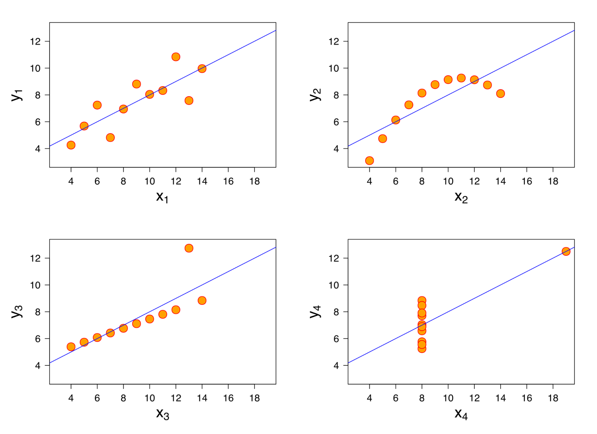
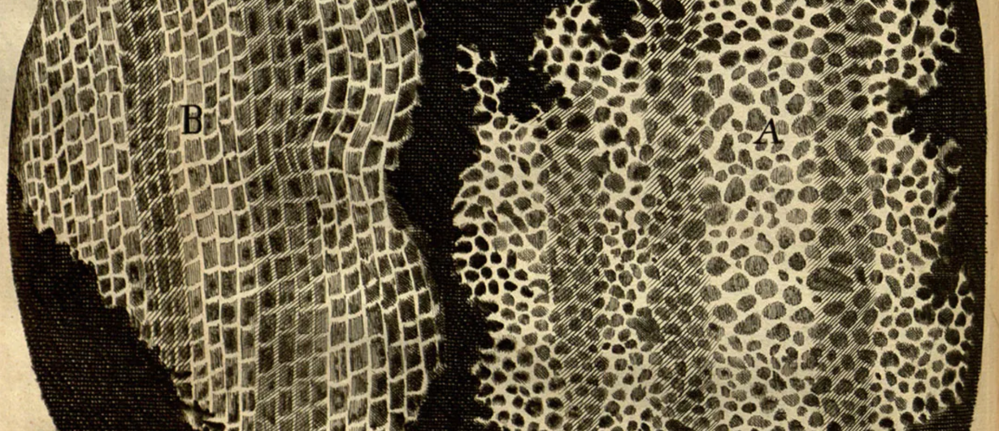
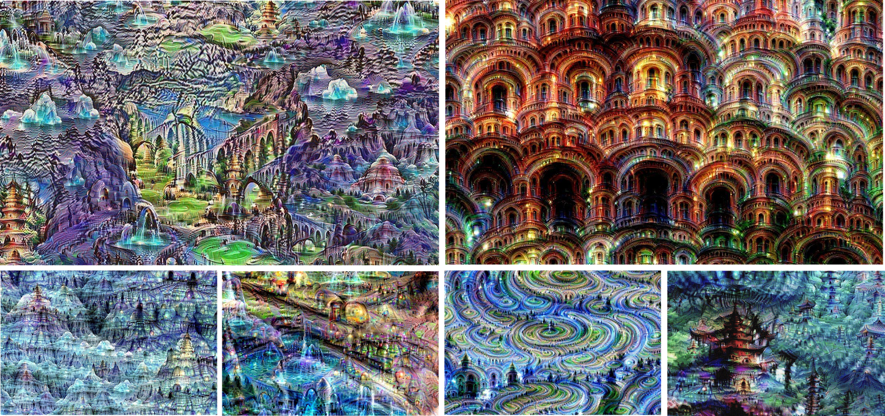
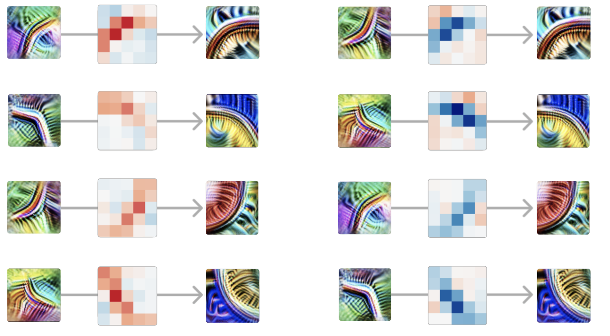

# 质性研究的反思

*2024 年 11 月 8 日 · 原文: https://transformer-circuits.pub/2024/qualitative-essay/index.html*

---

本文就一个问题发表一些带有个人立场的看法：为什么在可解释性（interpretability）研究中，质性（qualitative）方面可能比我们在其他领域所习惯的更为核心。本文还试图为质性工作中的研究品味描述一些启发式准则。

早期的科学领域往往相当依赖质性方法，随着学科逐渐成熟才变得越发定量化。例如，发现细胞是一个质性成果，此后（历经数十年）才成熟为定量工具，比如癌症研究中数白细胞的做法。发现化学谱线同样是一个质性成果，直到 Bohr 意识到"原子的蝴蝶翅膀"揭示了电子轨道的奥秘，它才真正变得定量化。

绝大多数研究者都受过成熟学科的训练，因为真正全新的科学领域极为罕见。这些成熟学科拥有既定的范式，以及既定的定量度量与方法。但可解释性并非一个成熟领域，它没有既定的范式。即便是最基础的抽象概念（用"特征"（features）来思考一个模型是否说得通？）也仍在争论之中。

当我们把从成熟学科习得的训练迁移到这样一个早期、芜杂、尚未建立的科学领域时，这些训练可能会给我们带来错误的直觉，这是一种风险。尤其是，我们应该预期自己需要更多地依靠质性结果来指引方向。

需要说明的是，这并不意味着在合适的时候我们就不该做定量研究！事实上，两者常常可以相辅相成：质性研究帮助我们确信自己正在使用正确的定量工具。（两者之间的界线有时也很模糊！）本文的目标只是要论证：质性结果应当被真正视为一等公民，是我们应当反复回归的试金石，以免迷失方向或自欺欺人。

#### 汇总统计量及其危险

[安斯库姆四重奏（Anscombe's Quartet）](https://en.wikipedia.org/wiki/Anscombe%27s_quartet)是一个著名的例子，展示了几个截然不同的数据集如何拥有相同的均值、标准差和相关系数：

[安斯库姆四重奏](https://en.wikipedia.org/wiki/Anscombe%27s_quartet)（[图片来源](https://en.wikipedia.org/wiki/Anscombe%27s_quartet#/media/File:Anscombe's_quartet_3.svg)）

这反映出一个更普遍的教训：把丰富的高维数据浓缩成单一数字的汇总统计量，总会让你对大部分正在发生的事情视而不见。因此，当你这样做时必须非常谨慎。尤其是，如果你打算依赖某个度量，就必须非常确信自己了解并信任所测量的对象。

在成熟领域，可能存在一些被充分理解的标准化度量与定量数值——人们明白它们的含义，也知道该如何看待它们。但在可解释性领域，我们没有这样的便利。

我们在一些可解释性论文以及与之相邻的机器学习论文中看到一种模式：定义一个声称对应某个目标属性的度量，然后极其严格地测量这个度量。在我们看来，这是一种[货物崇拜式科学（Cargo-Cult Science）](https://calteches.library.caltech.edu/51/2/CargoCult.htm)。它看起来可能非常严谨——满是带标准差误差棒的折线图之类的东西。但往往并非如此，因为关键弱点在于：这个度量是否真的、可靠地追踪了目标属性，而不在于度量本身被评估得有多严格。我们自己工作中的一个最近例子，是对[字典学习中的 tanh 正则化](https://transformer-circuits.pub/2024/feb-update/index.html#dict-learning-tanh)的研究：当时汇总统计量最初显示出很大的前景，直到后来对特征进行质性检查，我们才发现自己被误导了。

我们猜想，在可解释性这类早期科学领域，严谨性往往意味着远为更多的质性工作；定量度量应当从这些工作中生长出来，并在最初阶段受到相当审慎的对待。

##### 只因缺乏受限的假设空间

成熟领域之所以能如此依赖汇总统计量，原因之一在于它们拥有受限的假设空间（constrained hypothesis space）。

想一想成熟领域是如何常常把实验框定为"用一个假设去检验另一个假设"的。例如，一个引力波实验可能是为检验广义相对论与 Chern-Simons 引力而设计的。当假设空间狭窄且被充分理解时，这种做法是合理的——此时大部分概率质量确实落在正在被检验的那少数几个假设上。在这种情况下，往往相对容易想出一个在两种假设下取值应当不同的单一度量！

但在前范式（pre-paradigmatic）领域，我们根本不知道应该考虑哪些假设！一位 19 世纪的物理学家若要为太阳的能量产生提出解释，很可能会完全错过核物理。

因此，在前范式领域，科学的目标首先是弄清楚我们应当考虑哪些假设！这意味着要以一种相当不同的方式工作。汇总统计量固然非常擅长在少数几个假设之间做判别，但孤立的数字无法提供足够丰富的信号，让我们在浩瀚的可能性空间中辨明方向。

##### 界面与汇总统计量的诱惑

为什么汇总统计量如此流行？一个原因与科学研究的界面（interface）生态有关。我们很少这样思考问题，但科学研究其实隐含着用于思考数据的界面。例如，方程、折线图和术语都是界面。[^1]

最常见、最可复用的界面（例如折线图）往往需要一个标量汇总统计量。这些简单的数据类型堪称研究的通用语（lingua franca）：它们如此常见，几乎可以在所有科学领域间复用，并且拥有标准化的操作惯例。但它们的代价是：我们必须把结果压缩成一个汇总统计量。

呈现更复杂（也更庞大）的数据则需要定制化的界面。事实上，在可解释性领域，以我们所处理的数据规模，若不做汇总统计量的压缩，几乎不可能不借助定制化、且往往是交互式的界面。这正是可解释性与数据可视化如此密不可分的原因。正如早期化学依赖定制的玻璃器皿——确实，当时许多科学家都亲自制作玻璃仪器！——可解释性同样依赖数据可视化。

##### 汇总统计量与可辩护性

汇总统计量流行的另一个原因是它们可辩护。更广泛的科学共同体与文化在潜移默化地告诉我们："只要你的数据以几种常见格式之一呈现，那么即使在最坏的情况下，你仍然是在做科学。"

在成熟领域，这说得通：人们已经就使用哪些正确的汇总统计量达成了共识，它们的陷阱为人所知，共同体也知道如何解读它们。但在年轻的领域，我们不知道应该使用哪些汇总统计量。我们很容易被那些含义与我们所想不符、或者掩盖了我们试图研究的核心复杂性的数字引入歧途。

因此，尽管成熟领域有充分的理由重度依赖汇总统计量，并发展出鼓励这种做法的文化，但在前范式领域，这种文化可能具有误导性；在可解释性领域，我们需要对此保持警醒。

#### 严谨性与结构信号

我们如何知道质性结果是否"真实"？严谨的质性研究应该是什么样子？

我们没有"统计显著性"之类的工具可以依赖，因此这类研究很容易显得不够严谨。然而，在显微镜下发现细胞无疑是严谨的！恒星光谱的发现、超导的发现（"电阻是零吗？"）等等，同样如此。科学史上一些最惊人、最改变世界的发现，正是以质性结果的形式出现的——它们太过醒目，根本不需要误差棒或汇总统计量。

在某些非常成熟的学科主题中，可能存在公认的质性方法——例如动物学中发现新物种——这些方法利用"我们确实理解自己正在观察什么"这一事实，从而做出严谨的质性观察。但这一点同样不适用于可解释性。

于是我们又回到了最初的问题：我们如何知道质性结果是真实的？我们猜想，判断一个质性结果是否可信的最可靠方式之一，是我们称之为结构信号（the signal of structure）的东西：

结构信号指的是：质性观察中存在的某种结构，它不可能是测量的伪迹（artifact），也不可能来自其他来源，而必然反映了研究对象本身的某种结构——即使我们尚不理解这种结构。

你可以把它理解为统计显著性的一种非正式、"无监督"版本。统计显著性是用一个特定的（最好是预先注册的）假设去对抗零假设；而结构信号则是观察到一种未被预测到的高维模式，并拒绝"它是噪声或伪迹"的假设——通常是因为这种结构如此引人注目、如此复杂，显然超出了合格线好几个数量级。

##### 结构信号的例子

对细胞的观察不可能是显微镜的伪迹——它们太复杂了！它也不可能是噪声——它们太有结构了！诸如镜头眩光之类的伪迹可以产生畸变，但产生不了这样的东西：

出自 Hooke 的 [Micrographia](https://en.wikipedia.org/wiki/Micrographia) 的细胞图画。图片来自威尔士国家图书馆。

同样，[DeepDream](https://en.wikipedia.org/wiki/DeepDream) 太过复杂（而且结构也不可能来自其他来源），它只能是网络内部某种结构的反映。即使你不知道这种结构是什么，它也不可能是随机噪声！

多张 DeepDream 图像，出自 Mordvintsev 等人最初的 [Inceptionism 博客文章](https://blog.research.google/2015/06/inceptionism-going-deeper-into-neural.html)

另一个例子是 InceptionV1 中[曲线检测器](https://distill.pub/2020/circuits/curve-circuits/)之间的权重。其模式复杂到不可能是噪声。我们或许会在如何解读上争论不休，但那里显然存在着某种东西！

一张曲线检测器之间权重的图片，出自[最初的 circuits 系列文章](https://distill.pub/2020/circuits/zoom-in/)。

请注意，所有这些例子都涉及压倒性的复杂性与细节，远远超出任何偶然所能产生的范畴。它们如此醒目，以至于即使是刻意挑选出来的，也依然站得住脚：Hooke 透过显微镜看到细胞，显然是在展示某种真实的东西——即使他此前观察过成百上千个无趣的东西，并且没有把它们记录下来。

之所以能发现这些东西，很大一部分原因在于存在着"低垂的果实"——一旦看到便令人瞠目的明显模式。在成熟领域，结构信号的明亮灯塔通常早已被找到，剩下的功课是小心地把事物层层剥开。但对可解释性而言，低垂的果实还有多得惊人。

##### 插话：经典定量工作中的结构信号

这种对醒目结构的察觉同样发生在更定量化的工作中。例如，在双对数坐标图上注意到神经网络具有如此干净的缩放定律（scaling laws），就是"结构信号"的一个例子——这种结构一定在告诉你什么！尤其是，这样的结构往往在向你揭示一种新的抽象。

关键之处在于，你必须确认这种结构并非来自其他来源。例如，某些显著性图（saliency map）方法可以产生醒目、看似高度结构化的图像——但它们大多反映的是原始图像的结构，因此并不清楚它们是否真的在向你展示关于网络的显著结构。这并不是说显著性图一定没有展示任何东西，只是说结构信号无法在此给我们信心：我们需要某种其他的、有原则依据的论证或实验。更一般地说，许多有趣的现象都涉及多个相互作用的客体（例如一个神经网络作用于某个特定输入的情形），这些现象固然非常有趣，但在援引结构信号之前，我们必须针对每一个可能的来源评估这种结构，并判断是否存在某种不那么有趣的解释。

##### 质性研究的成与败

值得一提的是，用质性研究来自欺也极其容易。（这很可能是科学家们常常对它持怀疑态度的另一个原因！）结构信号是我们所知的发现真实现象的最简便途径，但它并非唯一途径；当它能与其他途径相互印证时，就更加令人信服。

好的质性工作的一些标志包括：

- 结构信号。
- 对你所看到的东西及其值得观察的原因有原则依据的理解。放大镜只是把东西放大；而神经网络的权重正是它们的基本计算基质。

我们通常希望质性结果至少在其中一个方面表现出色（当然，越多越好！）。反过来，以下特征会让我们对质性工作产生怀疑：

- 观察的对象缺乏原则依据。如果结果具有极其清晰的结构，并且不依赖于某种特定的解读，这一点可以得到弥补。
- 结构不够极其醒目（也就是缺乏结构信号），尤其是还伴随着刻意挑选的时候。除非我们对测量真的很有信心，否则我们希望结构清晰到不必担心自己看到的是幻觉。
- 结构可能来自其他来源（例如，显著性图中的结构可能来自图像本身，而非模型）。

#### 延伸阅读

[《科学革命的结构》](https://en.wikipedia.org/wiki/The_Structure_of_Scientific_Revolutions)——尤其值得一读的是其中关于电学研究中相互竞争的各个"学派"的讨论，以及它们如何聚焦于不同的现象与抽象；还有早期原子物理学、以及在云室中可视化粒子的内容。请注意其中反复出现的模式：这类研究往往始于相对质性的观察；选择把注意力放在什么上、把什么实体化为一种抽象，是极为核心的环节，也为更定量化的研究铺平了道路。一旦你认出了细胞，你就可以去数它们了。

[Drawing Theories Apart](https://www.amazon.com/Drawing-Theories-Apart-Dispersion-Diagrams/dp/0226422674)——尤其是第 1 章关于"纸面工具"（paper tools）的讨论。

[Media for Thinking the Unthinkable](https://www.youtube.com/watch?v=oUaOucZRlmE)——如果你觉得"界面"与研究相关联的想法很陌生，那就去看这场演讲吧！如果你喜欢它，还可以再看看 [Up and Down the Ladder of Abstraction](http://worrydream.com/LadderOfAbstraction/)。

[Proofs and Refutations](https://math.berkeley.edu/~kpmann/Lakatos.pdf) – 研究的一个重要部分，是在黑暗中摸索前行，寻找正确的定义与抽象。拉卡托斯（Lakatos）的这部对话体作品对此有精彩的呈现。你可以把具体例子与定义之间的互动，类比为质性考察与汇总统计量（summary statistics）生成之间的关系——我们必须深入具体例子，才能找到正确的定义与统计量。

[Cargo Cult Science](https://calteches.library.caltech.edu/51/2/CargoCult.htm) – 理查德·费曼（Richard Feynman）的一篇经典文章，论科学中流于形式的严谨（pro forma rigor）。

## 脚注

[^1]: 参见下文"延伸阅读"，尤其推荐 [Media for Thinking the Unthinkable](https://www.youtube.com/watch?v=oUaOucZRlmE)（其中对科学思维中的界面有引人入胜的讨论）与 [Drawing Theories Apart](https://www.amazon.com/Drawing-Theories-Apart-Dispersion-Diagrams/dp/0226422674)（其中讨论了"纸面工具"（paper tool）式的界面）。
