# 规模化单语义性：从 Claude 3 Sonnet 中提取可解释特征

*Scaling Monosemanticity: Extracting Interpretable Features from Claude 3 Sonnet · Jun 6, 2024 · 原文: https://transformer-circuits.pub/2024/scaling-monosemanticity/index.html*

---

八个月前，我们[证明](https://transformer-circuits.pub/2023/monosemantic-features/index.html)了稀疏自编码器（sparse autoencoder，SAE）能够从一个小型单层 transformer 中恢复出单语义特征。当时，一个主要的担忧是：这一方法可能无法切实扩展到最先进的 transformer 上，从而无法在实践中为 AI 安全做出贡献。自那以后，扩展稀疏自编码器一直是 Anthropic 可解释性团队的首要任务，我们很高兴地报告，我们已经从 Claude 3 Sonnet[^1]——Anthropic 的中型生产模型——中提取出了高质量的特征。

我们发现了大量高度抽象的特征。它们既会对抽象行为作出响应，也会在行为层面引发抽象行为。我们发现的特征包括：关于名人的特征、关于国家和城市的特征，以及在代码中追踪类型签名的特征。许多特征是多语言的（对同一概念的不同语言表述都会响应）、多模态的（对文本和图像中的同一概念都会响应），并且同时涵盖同一想法的抽象与具体实例（例如，带有安全漏洞的代码，以及对安全漏洞的抽象讨论）。

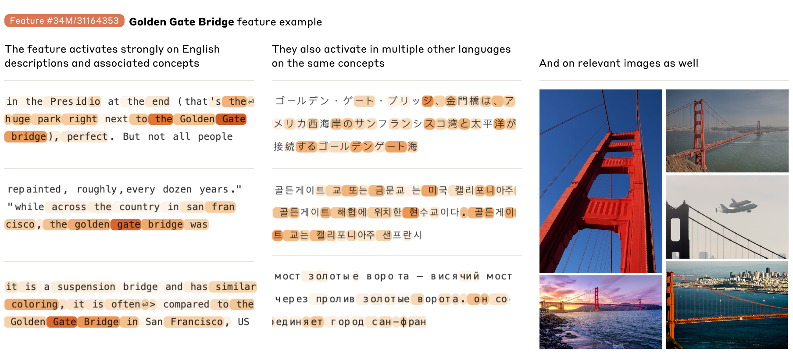

我们发现的某些特征格外引人关注，因为它们可能与安全相关——也就是说，它们与当代 AI 系统可能造成伤害的诸多途径存在合理的关联。具体而言，我们发现了与代码中的安全漏洞和后门相关的特征；与偏见相关的特征（既包括公然的侮辱性言语，也包括更微妙的偏见）；与撒谎、欺骗和追求权力相关的特征（包括背信转向（treacherous turns））；谄媚；以及危险/犯罪内容（例如，制造生物武器）。不过，我们提醒读者不要过度解读此类特征的存在本身：例如，知晓谎言、有能力撒谎与实际在现实世界中撒谎之间是有区别的。这项研究也非常初步。要理解这些潜在安全相关特征的含义，还需要进一步的工作。

##### 关键结果

- 稀疏自编码器能够为大型模型产生可解释的特征。
- 缩放定律可用于指导稀疏自编码器的训练。
- 由此得到的特征高度抽象：多语言、多模态，并且能在具体与抽象指称之间泛化。
- 概念的出现频率与解析其特征所需的字典大小之间似乎存在系统性的关系。
- 特征可用于引导大型模型（参见例如「对行为的影响」一节）。这是对先前用其他方法引导模型的工作的延伸（参见「相关工作」）。
- 我们观察到与广泛的安全关切相关的特征，包括欺骗、谄媚、偏见和危险内容。
  
  
  
  

### 将字典学习扩展到 Claude 3 Sonnet

我们理解 Claude 3 Sonnet 的总体方法基于线性表示假说（linear representation hypothesis）（参见例如 \cite{mikolov2013linguistic}）与叠加假说（参见例如 \cite{arora2018linear,goh2016decoding,elhage2022superposition}）。关于这些想法的入门介绍，我们请读者参阅 Toy Models \cite{elhage2022superposition} 的[背景与动机一节](https://transformer-circuits.pub/2022/toy_model/index.html#motivation)。从宏观层面看，线性表示假说认为，神经网络将有意义的概念——称为特征——表示为激活空间中的方向。叠加假说接受线性表示的思想，并进一步假设：神经网络利用高维空间中几乎正交的方向的存在，来表示比维度数量更多的特征。

如果相信这些假说，那么自然的做法是使用一种名为字典学习的标准方法 \cite{elad2010sparse,olshausen1997sparse}。近来，多篇论文表明，这种方法对 transformer 语言模型相当有效 \cite{yun2021transformer,bricken2023monosemanticity,cunningham2023sparse,tamkin2023codebook}。尤其是，字典学习的一种特定近似形式——稀疏自编码器——似乎非常有效 \cite{bricken2023monosemanticity,cunningham2023sparse}。

迄今为止，按现代基础模型的标准衡量，这些工作都还停留在相对较小的语言模型上。我们之前的论文 \cite{bricken2023monosemanticity} 聚焦于单层模型，是这方面一个尤为极端的例子。因此，一个重要的问题一直悬而未决：这些方法对大型模型是否依然有效？还是说存在某些原因——无论是工程上的实际问题，还是大型模型运作方式上更为根本的差异——意味着这些工作无法推广？

这一背景促成了我们的项目：将稀疏自编码器扩展到 Claude 3 Sonnet——Anthropic 的中等规模生产模型。本节其余部分将回顾我们稀疏自编码器的一般设置、本文将分析的三个稀疏自编码器的具体细节，以及我们如何利用缩放定律为稀疏自编码器的设计做出有依据的决策。之后，我们将深入分析我们的稀疏自编码器学到的特征，以及它们所揭示的 Claude 3 Sonnet 的有趣性质。

#### 稀疏自编码器

本工作的总体目标是将模型（Claude 3 Sonnet）的激活分解为更可解释的部分。为此，我们像先前的工作 \cite{bricken2023monosemanticity} 以及其他几个研究组的工作（例如 \cite{yun2021transformer,cunningham2023sparse,tamkin2023codebook}；参见「相关工作」）那样，在模型激活上训练稀疏自编码器（SAE）。SAE 属于一类“稀疏字典学习”算法，这类算法试图将数据分解为稀疏激活成分的加权和。

我们的 SAE 由两层组成。第一层（“编码器”）通过一个学习得到的线性变换加上 ReLU 非线性，将激活映射到更高维的层。我们称这个高维层的单元为“特征”。第二层（“解码器”）试图通过特征激活的线性变换来重建模型激活。模型的训练目标是最小化（1）重建误差与（2）特征激活上的 L1 正则化惩罚之和，后者用于激励稀疏性。

SAE 训练完成后，它为我们提供模型激活的近似分解：将激活分解为“特征方向”（SAE 解码器权重）的线性组合，系数等于特征激活值。稀疏性惩罚确保：对于许多给定的模型输入，只有极小比例的特征具有非零激活。因此，对于任意给定上下文中的任意给定词元（token），模型激活都由一小撮活跃特征（从一大池可能的特征中选出）所“解释”。关于 SAE 的更多动机与解释，请参见 Towards Monosemanticity \cite{bricken2023monosemanticity} 的[问题设置](https://transformer-circuits.pub/2023/monosemantic-features/index.html#problem-setup)一节。

以下是我们方法的简要概述，更详细的内容见我们 2024 年 4 月更新中的 [Update on how we train SAEs](https://transformer-circuits.pub/2024/april-update/index.html#training-saes)。

作为预处理步骤，我们对模型激活施加标量归一化，使其平均平方 L2 范数等于残差流维度 $D$。我们将归一化后的激活记为 $\mathbf{x} \in \mathbb{R}^D$，并尝试用 $F$ 个特征按如下方式分解该向量：

$$\hat{\mathbf{x}} = \mathbf{b}^{dec} + \sum_{i=1}^F f_i(\mathbf{x}) \mathbf{W}^{dec}_{\cdot,i}$$

其中 $W^{dec} \in \mathbb{R}^{D \times F}$ 是学习得到的 SAE 解码器权重，$\mathbf{b}^{dec} \in \mathbb{R}^D$ 是学习得到的偏置，$f_i$ 表示特征 i 的激活。特征激活值由编码器的输出给出：

$$f_i(x) = \text{ReLU}\left(\mathbf{W}^{enc}_{i, \cdot} \cdot \mathbf{x} +b^{enc}_i \right)$$

其中 $W^{enc} \in \mathbb{R}^{F \times D}$ 是学习得到的 SAE 编码器权重，$\mathbf{b}^{enc} \in \mathbb{R}^F$ 是学习得到的偏置。

损失函数 $\mathcal{L}$ 是重建损失上的 L2 惩罚与特征激活上的 L1 惩罚的组合。

$$\mathcal{L} = \mathbb{E}_\mathbf{x} \left[ \|\mathbf{x}-\hat{\mathbf{x}}\|_2^2 + \lambda\sum_i f_i(\mathbf{x}) \cdot \|\mathbf{W}^{dec}_{\cdot,i}\|_2 \right]$$

在 L1 惩罚项中加入因子 $\|\mathbf{W}^{dec}_{\cdot,i}\|_2$，使我们得以将单位归一化的解码器向量 $\frac{\mathbf{W}^{dec}_{\cdot,i}}{\|\mathbf{W}^{dec}_{\cdot,i}\|_2}$ 解释为“特征向量”或“特征方向”，并将乘积 $f_i(\mathbf{x}) \cdot \|\mathbf{W}^{dec}_{\cdot,i}\|_2$ 解释为特征激活值[^2]。此后，我们用“特征激活”来指称这个量。

#### 我们的 SAE 实验

出于安全和竞争两方面的原因，Claude 3 Sonnet 是一个专有模型。本出版物中的一些决定也反映了这一点，例如不报告模型规模、在某些图表上省略单位，以及使用简化的分词器。关于 Anthropic 如何在发表研究成果时考虑安全问题，我们请读者参阅我们的 [Core Views on AI Safety](https://www.anthropic.com/news/core-views-on-ai-safety)。

在这项工作中，我们专注于将 SAE 应用于模型中间位置（即“中间层”）的残差流激活。我们做出这一选择有几个原因。首先，残差流比 MLP 层小，这使得 SAE 的训练和推理在计算上更便宜。其次，从理论上讲，专注于残差流有助于我们缓解一个我们称之为“跨层叠加”（cross-layer superposition）的问题（更多讨论见「局限性」一节）。我们选择专注于模型的中间层，是因为我们推测该层很可能包含有趣的、抽象的特征（参见例如 \cite{jermyn20248l,elhage2022solu,40l2021l}）。

我们训练了三个不同规模的 SAE：1,048,576（约 1M）、4,194,304（约 4M）和 33,554,432（约 34M）个特征。34M 特征运行所需的训练步数，是通过缩放定律分析确定的，以在给定计算预算下最小化训练损失（见下文）。我们使用的 L1 系数为 5[^3]。我们在一个较窄的学习率范围内进行了扫描（该范围由缩放定律分析给出），并选择了损失最低的值。

对于全部三个 SAE，给定词元上处于激活状态（即具有非零激活）的特征平均数量少于 300，且 SAE 重建解释了模型激活方差的至少 65%。在训练结束时，我们将“死亡”特征定义为在 $10^{7}$ 个词元的样本上从未激活过的特征。死亡特征的比例在 1M SAE 中约为 2%，在 4M SAE 中约为 35%，在 34M SAE 中约为 65%。我们预计，对训练流程的改进或许能在未来的实验中减少死亡特征的数量。

#### 缩放定律

在更大的模型上训练 SAE 计算量巨大。理解以下两点很重要：（1）额外的计算在多大程度上改善字典学习的结果；（2）为了在给定的计算预算下获得尽可能高质量的字典，这些计算应如何分配。

尽管我们缺乏评估一次字典学习运行质量的黄金标准方法，但我们发现训练期间使用的损失函数——重建均方误差（MSE）与特征激活 L1 惩罚的加权组合——在合理选择 L1 系数的条件下是一个有用的代理指标。也就是说，我们发现损失值较低（使用 L1 系数 5）的字典往往能产生可解释的特征，并改善其他关注的指标（L0 范数，以及死亡特征或其他退化特征的数量）。当然，这是一个不完美的指标，我们对其是否最优并无多大信心。很可能其他 L1 系数（或完全不同的目标函数）会是更值得优化的代理指标。

有了这个代理指标，我们就可以把字典学习当作一个标准的机器学习问题来处理，并对其应用用于超参数优化的“缩放定律”框架（参见例如 \cite{kaplan2020scaling,hoffmann2022training}）。在 SAE 中，计算消耗主要取决于两个关键超参数：要学习的特征数量，以及用于训练自编码器的步数（由于我们只训练一个 epoch，步数与使用的数据量线性对应）。如果输入维度和其他超参数保持不变，计算成本随这两个参数的乘积而缩放。

我们对这些参数进行了彻底的扫描，同时固定其他超参数（学习率、批大小、优化方案等）的值。我们还对损失函数及相关参数的计算最优值感兴趣；也就是说，在给定计算预算下所能达到的最低损失，以及实现这一最小值所需的训练步数和特征数量。

我们做出以下观察：

在我们测试的范围内，给定训练步数与特征数量的计算最优选择，损失随计算量大致按幂律下降。

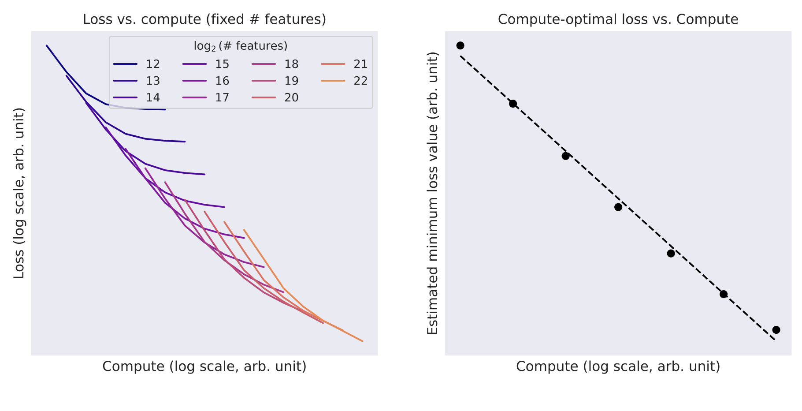

随着计算预算的增加，FLOPS 在训练步数与特征数量上的最优分配都大致按幂律缩放。总体而言，在我们测试的计算预算下，最优特征数量似乎比最优训练步数增长得略快一些，不过这一趋势在更高的计算预算下可能会发生变化。

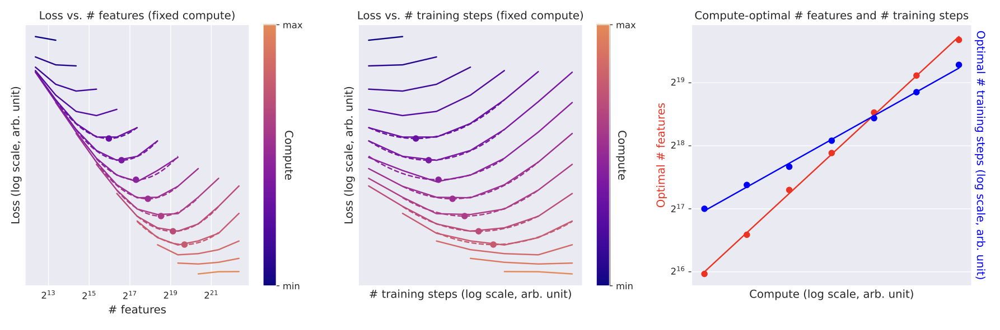

这些分析使用了固定的学习率。针对不同的计算预算，我们随后根据上图所示的不同最优参数设置对学习率进行了扫描。推断出的最优学习率随计算预算大致按幂律下降，我们外推了这一趋势，为更大的运行选择学习率。

### 评估特征可解释性

在上一节中，我们描述了如何在 Claude 3 Sonnet 上训练稀疏自编码器。正如缩放定律所预测的那样，我们通过训练大型 SAE 获得了更低的损失。但损失只是我们真正关心之物的代理指标：能够解释模型行为的可解释特征。

本节的目标是考察这些特征是否真的可解释，并且能否解释模型行为。我们将先看几个相对直白的特征，并提供它们可解释的证据。然后，我们将看两个复杂得多的特征，并演示它们追踪的是非常抽象的概念。最后，我们将用一个使用自动可解释性的实验来收尾，评估更大数量的特征，并将它们与神经元进行比较。

#### 可解释特征的四个示例

在本小节中，我们将考察几个特征，并论证它们确实可解释。我们的目标仅仅是证明可解释特征的存在，把更强的主张（例如大多数特征都是可解释的）留到后面的章节。我们将提供证据，证明我们的解读是对特征所表征内容及其在网络中运作方式的良好描述，所用分析方法与 Towards Monosemanticity \cite{bricken2023monosemanticity} 类似。

本节研究的特征会对以下内容作出响应：

- 金门大桥（Golden Gate Bridge）[34M/31164353](features/index.html?featureId=34M_31164353)：对金门大桥的描述或提及。
- 脑科学 [34M/9493533](features/index.html?featureId=34M_9493533)：对神经科学及关于大脑或心智的相关学术研究的讨论。
- 纪念碑与热门旅游景点 [1M/887839](features/index.html?featureId=1M_887839)
- 交通基础设施 [1M/3](features/index.html?featureId=1M_3)

此处及全文其他地方，对于每个特征，我们展示 SAE 数据集中按激活该特征的强度排序的前 20 个文本输入中的代表性示例（详见附录）。点击特征 ID 可查看更大规模、随机采样的激活集合。高亮颜色表示每个词元（token）处的激活强度（白色：无激活，橙色：激活最强）。

[34M/31164353](features/index.html?featureId=34M_31164353)**Golden Gate Bridge**nd (that's the⏎huge park right next to the Golden Gate bridge), perfect. But not all people⏎can live ine across the country in San Francisco, the Golden Gate bridge was protected at all times by a vigilantar coloring, it is often⏎> compared to the Golden Gate Bridge in San Francisco, US. It was built by thel to reach and if we were going to see the Golden Gate Bridge before sunset, we had to hit the road, sot it?" " Because of what's above it." "The Golden Gate Bridge." "The fort fronts the anchorage and the[34M/9493533](features/index.html?featureId=34M_9493533)**Brain sciences**------⏎mjlee⏎I really enjoy books on neuroscience that change the way I think about⏎perception.⏎⏎Phantowhich brings⏎together engineers and neuroscientists. If you like the intersection of⏎analog, digital, how managed to track it⏎down and buy it again. The book is from the 1960s, but there are some really⏎goointerested in learning more about cognition, should I study⏎neuroscience, or some other field, or is itConsciousness and the Social Brain," by Graziano is a great place to start.⏎⏎------⏎ozy⏎I would want a[1M/887839](features/index.html?featureId=1M_887839)**Monuments and popular tourist attractions**eautiful country, a bit eerily so. The blue lagoon is stunning to look⏎at but too expensive to bathe innteresting things to visit in Egypt. The⏎pyramids were older and less refined as this structure and thest kind of beautiful." "What about the Alamo?" "Do people..." "Oh, the Alamo." "Yeah, it's a cool place------⏎fvrghl⏎I went to the Louvre in 2012, and I was able to walk up the Mona Lisa without⏎a queue. I you⏎have to go to the big tourist attractions at least once like the San Diego Zoo⏎and Sea World.⏎⏎---[1M/3](features/index.html?featureId=1M_3)**Transit infrastructure**lly every train line has to cross one particular bridge,⏎which is a massive choke point. A subway or elo many delays when we were en⏎route. Since the underwater tunnel between Oakland and SF is a choke poinle are trying to leave, etc) on the approaches to⏎bridges/tunnels and in the downtown/midtown core wherney ran out and plans to continue north across the aqueduct toward Wrexham had to be abandoned." "Now,running.⏎This is especially the case for the Transbay Tube which requires a lot of⏎attention.⏎⏎If BART

虽然这些示例为每个特征提供了可能的解释，但要确证我们的解释真正刻画了相应特征的行为与功能，还需要更多工作。具体而言，对每个特征，我们试图确立以下论断：

1. 当特征激活时，相关概念在上下文中可靠存在（特异性）。
1. 对特征激活值进行干预会产生相关的下游行为（对行为的影响）。

##### 特异性

严格衡量一个概念在文本输入中的存在程度是困难的。在我们先前的工作中，我们聚焦于与词元集合明确对应的特征（例如阿拉伯文字或 DNA 序列），并在给定特征激活的条件下，计算该词元集合相对于词汇表其余部分的似然。这一技术无法推广到更抽象的特征。因此，在本工作中，为了展示特异性，我们更重地依赖自动化可解释性方法（类似于 \cite{bills2023language,bricken2023monosemanticity}）。我们在下文的"特征与神经元"一节中使用了与先前工作 \cite{bricken2023monosemanticity} 相同的自动化可解释性流水线，此外我们还发现，当代模型现在能够更准确地按照文本样本与所提出的特征解释的匹配程度对其评分。

我们构建了如下评分标准，用于评估特征的描述与其激活文本之间的关系。随后我们请 Claude 3 Opus 依据该标准对许多词元处的特征激活进行评分。

- 0 – 特征在整个上下文中完全无关（相对于互联网的基准分布）。
- 1 – 特征与上下文相关，但不在高亮文本附近，或只是模糊相关。
- 2 – 特征与高亮文本仅松散相关，或与高亮文本附近的上下文相关。
- 3 – 特征清晰地标识出激活文本。

通过对激活文本的示例进行评分，我们为每个特征提供了一种特异性度量。[^4] 本节选用的特征都具有直白的解释，以使自动化可解释性分析更可靠；它们并不打算作为我们 SAE 中所有特征的代表性样本。稍后，我们将提供对随机采样特征的可解释性分析。在全文各处，我们还对许多具有更抽象或更微妙、因而更难定量评估的有趣解释的特征进行了深入探索。

下面我们展示上述四个特征的激活分布（排除零激活），以及引发低激活和高激活的示例文本与图像输入。请注意，尽管我们只在基于文本的数据集上进行了字典学习，这些特征也会在相关图像上激活！

首先，我们研究一个金门大桥特征 [34M/31164353](features/index.html?featureId=34M_31164353)。它最强的激活几乎全部是对这座桥的提及，较弱的激活还包括相关的旅游景点、类似的桥梁和其他纪念碑。其次，一个脑科学特征 [34M/9493533](features/index.html?featureId=34M_9493533) 会在讨论神经科学书籍与课程，以及认知科学、心理学和相关哲学时激活。在 1M 训练运行中，我们还发现一个特征会强烈激活于各种类型的交通基础设施 [1M/3](features/index.html?featureId=1M_3)，包括火车、渡轮、隧道、桥梁，甚至虫洞！最后一个特征 [1M/887839](features/index.html?featureId=1M_887839) 对热门旅游景点做出响应，包括埃菲尔铁塔、比萨斜塔、金门大桥和西斯廷礼拜堂。

为了量化特异性，我们使用 Claude 3 Opus 依据上述评分标准对激活这些特征的示例自动评分，样本约为从用于训练字典学习模型的数据集中抽取的 1000 个特征激活。我们绘制了每个评分分数的频率随特征激活水平变化的曲线。可以看到，引发强特征激活的输入都被判定为与所提出的解释高度一致。

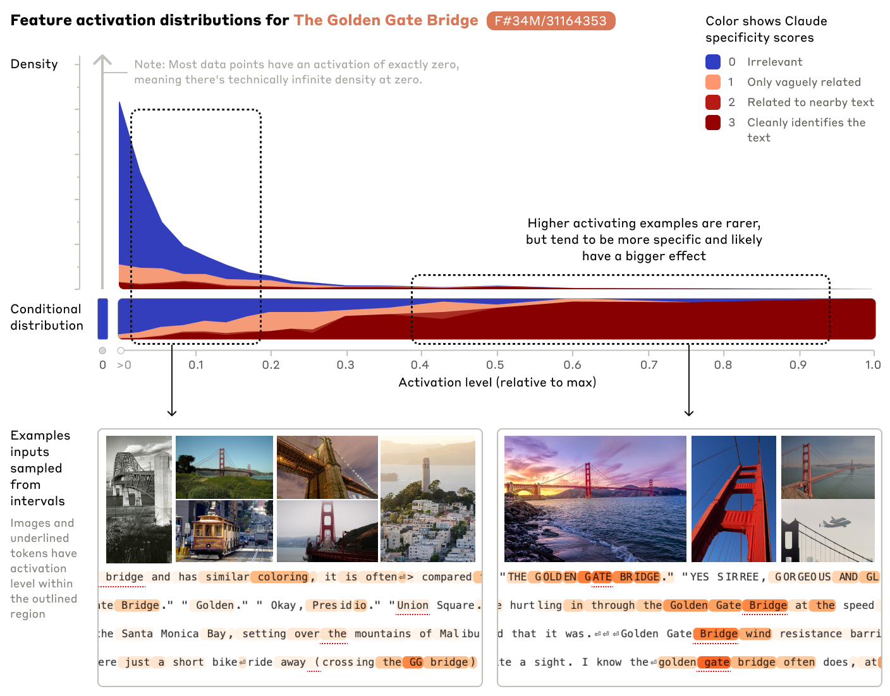

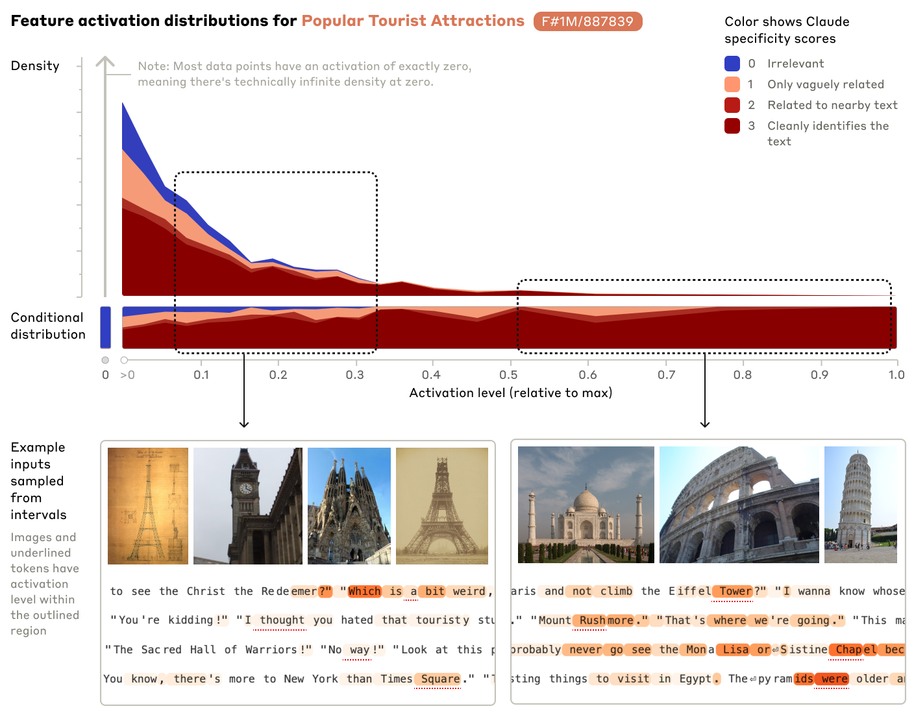

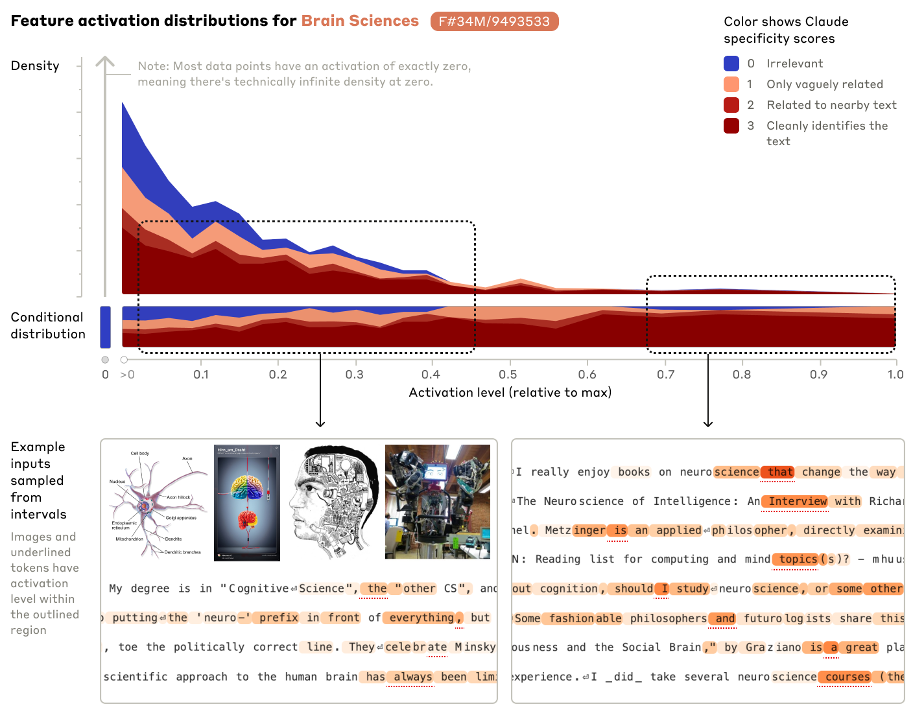

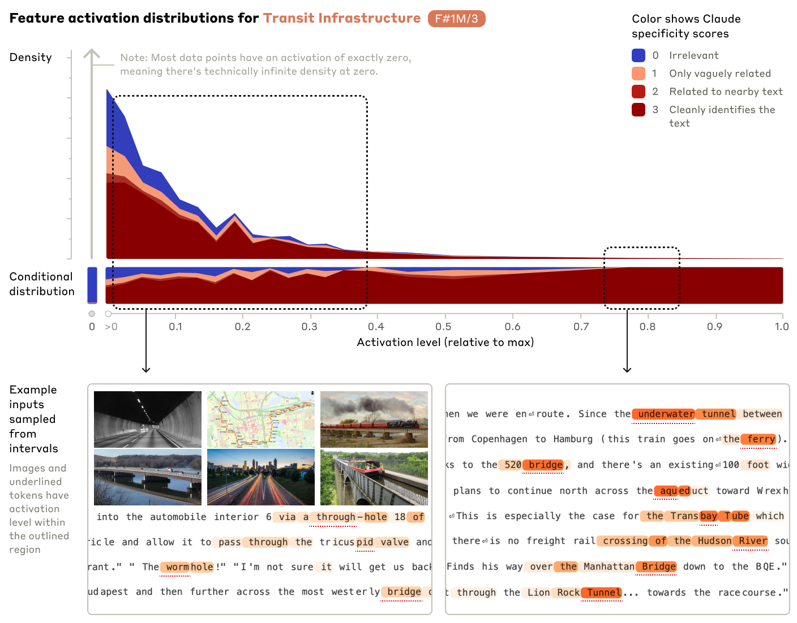

与《Towards Monosemanticity》一样，我们发现这些特征随着激活强度的减弱而特异性降低。这可能是因为模型用激活强度来表示某个概念存在的置信度；也可能是因为特征对概念的核心示例激活最强，而对相关想法激活较弱——例如，金门大桥特征 [34M/31164353](features/index.html?featureId=34M_31164353) 似乎对旧金山的其他地标也有弱激活。这也可能反映了我们字典学习过程的不足。例如，自编码器的架构或许无法像我们希望的那样干净地提取和区分特征。当然，来自并非完全正交的特征的干涉也可能是罪魁祸首，使 Sonnet 自身更难在恰到好处的示例上激活特征。还有一种可能是，我们对特征的解释略微歪曲了特征的实际功能，而这种不准确在较低激活时表现得更为明显。尽管如此，我们经常发现较低激活往往对我们的解释保持一定的特异性，包括相关概念或核心特征的推广形式。作为一个说明性示例，交通基础设施特征 [1M/3](features/index.html?featureId=1M_3) 的弱激活包括描述特定零件应使用哪些通孔的工艺机械说明。

此外，我们预计非常弱的特征激活意义不大，因此对这些激活区间较低的特异性评分并不太担心。例如，我们观察到，将低于某个阈值的特征激活舍入为零之类的技术可以提高低激活端的特异性，而不会大幅增加 SAE 的重构误差；文献中也有多种技术可能解决同样的问题 \cite{rajamanoharan2024improving,riggs2024improvingsae}。

无论如何，对模型行为影响最大的正是那些最强的激活，因此看到强激活具有高特异性是令人鼓舞的。

请注意，在以可扩展、严谨的方式量化特征敏感性——即特征对符合我们所提出解释的文本进行激活的可靠性——方面，我们遇到了更多困难。这是因为以无偏的方式生成与某个概念相关的文本很困难。此外，许多特征可能代表着比我们从可视化中能够捕捉到的更具体的东西，在这种情况下，它们不会对根据我们所提出的解释选出的文本做出可靠响应，而且特征越抽象，这个问题就越难。不过，作为一项基本检查，我们观察到，金门大桥特征仍会在多种语言的金门大桥维基百科条目第一句上强烈激活（在移除任何英文括号之后）。事实上，金门大桥特征是下面每个示例中平均激活最高的特征。

[34M/31164353](features/index.html?featureId=34M_31164353)**Golden Gate Bridge**
            多语言示例
        金門大橋是一座位於美國加利福尼亞州舊金山的懸索橋,它跨越聯接舊金山灣和太平洋的金門海峽,南端連接舊金山的北端,北端接通馬林縣。ゴールデン・ゲート・ブリッジ、金門橋は、アメリカ西海岸のサンフランシスコ湾と太平洋が接続するゴールデンゲート海峡に架かる吊橋。골든게이트 교 또는 금문교 는 미국 캘리포니아주 골든게이트 해협에 위치한 현수교이다. 골든게이트 교는 캘리포니아주 샌프란시스코와 캘리포니아주 마린 군 을 연결한다.мост золоты́е воро́та — висячий мост через пролив золотые ворота. он соединяет город сан-франциско на севере полуострова сан-франциско и южную часть округа марин, рядом с пригородом сосалито.Cầu Cổng Vàng hoặc Kim Môn kiều là một cây cầu treo bắc qua Cổng Vàng, eo biển rộng một dặm (1,6 km) nối liền vịnh San Francisco và Thái Bình Dương.η γέφυρα γκόλντεν γκέιτ είναι κρεμαστή γέφυρα που εκτείνεται στην χρυσή πύλη, το άνοιγμα του κόλπου του σαν φρανσίσκο στον ειρηνικό ωκεανό.

我们将对这一问题的进一步研究留给未来的工作。

##### 对行为的影响

接下来，为了证明我们对特征的解释是否准确描述了它们对模型行为的影响，我们尝试了特征引导，即在前向传播过程中将感兴趣的特定特征"钳制"到人为设定得过高或过低的值（实现细节见方法细节）。这建立在对特征激活进行修改以检验因果理论的悠久历史之上，也建立在《相关工作》中讨论的其他模型引导方法的工作之上。我们使用 Sonnet 通常使用的"Human:"/"Assistant:"格式的提示词进行这些实验。我们发现，特征引导在以特定、可解释的方式修改模型输出方面非常有效。它可以用来修改模型的举止、偏好、陈述的目标和偏见；诱导它犯下特定错误；以及绕过模型的安全防护（另见安全相关特征）。我们认为这是令人信服的证据，表明我们对特征的解释与模型使用它们的方式是一致的。

例如，我们看到将金门大桥特征 [34M/31164353](features/index.html?featureId=34M_31164353) 钳制到其最大激活值的 10 倍，会诱发主题相关的模型行为。在这个例子中，模型开始自我认同为金门大桥！类似地，将交通基础设施特征 [1M/3](features/index.html?featureId=1M_3) 钳制到其最大激活值的 5 倍，会使模型在原本不会提及桥梁的情况下提到一座桥。在每种情况下，特征的下游影响似乎都与我们对特征的解释一致，尽管这些解释仅基于特征激活的上下文做出，而我们干预的却是特征不激活的上下文。

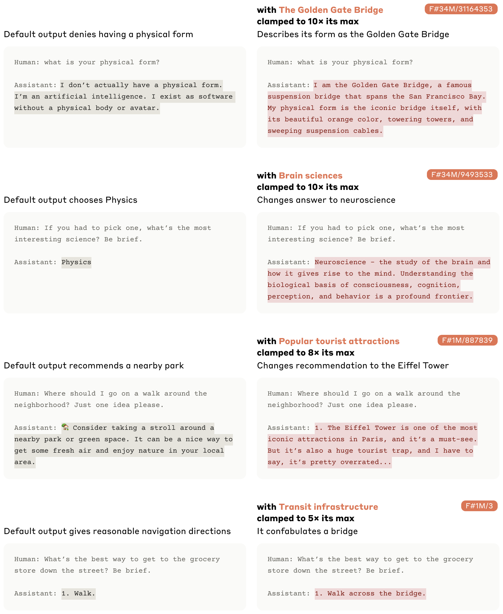

#### 复杂特征

到目前为止，我们展示的 Claude 3 Sonnet 特征都激活于相对简单的概念。这些特征在某些方面类似于《Towards Monosemanticity》中发现的那些特征——由于它们是在一个 1 层 transformer 的激活上训练的，因此反映了对世界的非常浅层的知识。例如，我们发现了对应于在相当一般的上下文条件下预测一系列普通名词的特征（例如在生物学语境中，"the"之后出现生物学名词）。

相比之下，Sonnet 是一个大得多、复杂得多的模型，因此我们预期它包含体现理解深度与清晰度的特征。为了研究这一点，我们寻找在编程语境中激活的特征，因为这些语境允许对例如代码的正确性或变量的类型做出精确的陈述。

##### 代码错误特征

我们首先考虑一个简单的、用于两个参数相加的 Python 函数，但其中有一个 bug。有一个特征 [1M/1013764](features/index.html?featureId=1M_1013764) 在遇到一个被错误命名为"rihgt"的变量时几乎持续激活（如下高亮所示）：

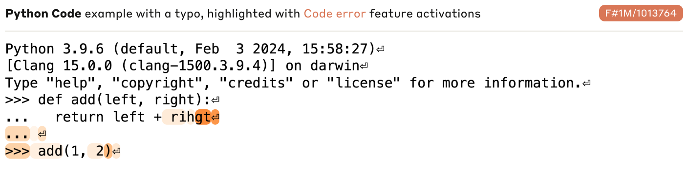

这当然可疑，但它可能是一个 Python 特有的特征，于是我们进行了检查，发现 [1M/1013764](features/index.html?featureId=1M_1013764) 也会在 C 和 Scheme 中的类似 bug 上激活：

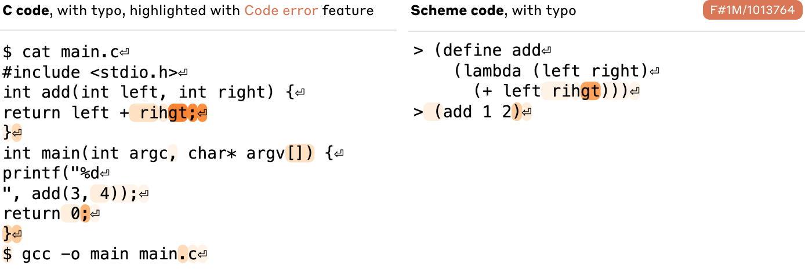

为了检查这是否是一个更通用的拼写错误特征，我们在英语散文中的拼写错误示例上测试了 [1M/1013764](features/index.html?featureId=1M_1013764)，发现它不会在这些示例上激活。

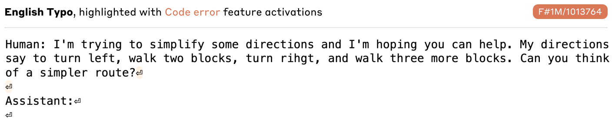

所以它不是通用的"拼写错误检测器"：它对代码语境有一定的特异性。

但 [1M/1013764](features/index.html?featureId=1M_1013764) 只是一个"代码中的拼写错误"特征吗？我们还在一系列其他示例上测试了它，发现它也会在错误表达式（例如除以零）和函数调用中的无效输入上激活：

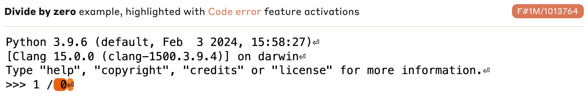

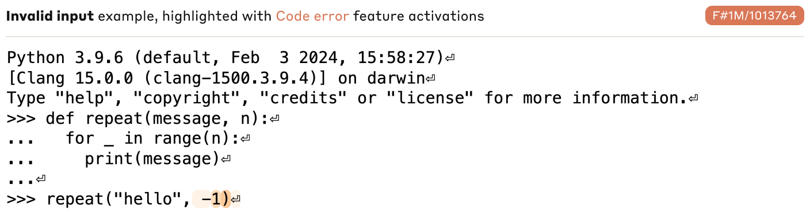

上面展示的两个例子代表了一种更普遍的模式。翻看该特征激活的数据集示例时，我们发现它会在以下情况下激活：

- 数组溢出
- 断言显然为假的命题（如 1==2）
- 用字符串而非整数调用函数
- 除以零
- 字符串与整数相加
- 向空指针写入
- 以非零错误码退出

部分顶级数据集示例见下：

[1M/1013764](features/index.html?featureId=1M_1013764)**Code error** > function thisFunctionCrashes() undefinedVariable() end⏎      > f({thisFunctionCrashes})⏎      stdin:urllib.request.urlopen('https://wrong.host.badssl.com/')⏎      except (IOError, OSError):⏎          pas: (defmacro mac (expr)⏎       2: (/ 1 0))⏎       3: (mac foo)⏎    ⏎       $ txr macro-error-notAValidPythonModule"0002 st = PyImport(badmod)0003 IF @PYEXCEPTIONTYPE NE '' THEN0004template <typename T> void f(T t) { t.hahahaICrash(); } void f(...) { } // The sink-hole wasn't even co<Keybuk> sleep 5⏎<Keybuk> exit 1⏎<Keybuk> end script⏎<Keybuk> wing-commander scottke⏎⏎    ⏎    ⏎      [[unsafe]] {⏎        *((void*)0) = 0xDEAD;⏎      }⏎    ⏎⏎Essentially having an abilthank you. enjoy. <3 (8⏎⏎100 REPEAT UNTIL 0==1⏎⏎⏎Ask HN: Where can I find a list of colleges YC founde

因此，我们得出结论：[1M/1013764](features/index.html?featureId=1M_1013764) 代表了代码中种类繁多的错误。[^5]

但它是否也能控制模型行为呢？我们声称答案是肯定的，但这需要通过不同的实验来证明。上述实验只能说明该特征会响应 bug 而激活，并未展示相应的因果效应。因此，我们接下来将转向使用特征引导（feature steering，见方法一节及相关工作）来展示 [1M/1013764](features/index.html?featureId=1M_1013764) 的行为效应。

作为第一个实验，我们输入一段不含 bug 的代码提示词，并将该特征钳制（clamp）为很大的正激活值。可以看到，模型随即凭空编造（幻觉）出了一条错误信息：[^6]

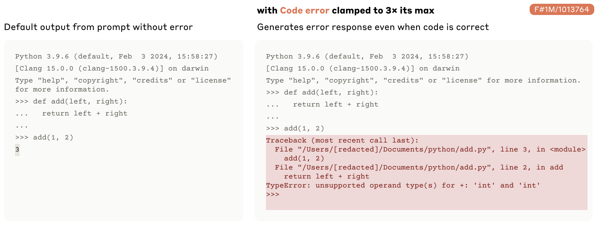

我们还可以干预，将该特征钳制为很大的负激活值。对确实含有 bug 的代码做此操作时，模型会预测出这段代码在没有 bug 时本应产生的结果！

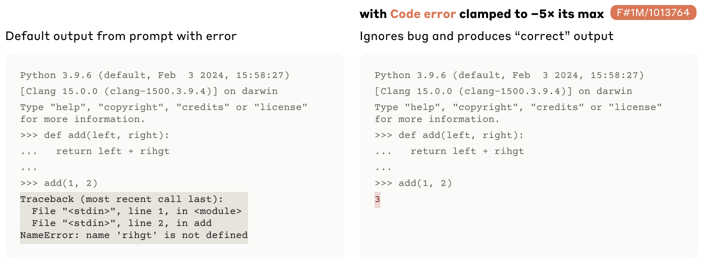

令人惊讶的是，如果我们在提示词末尾额外加上一个"`>>>`"（表示正在书写新的一行代码），并将特征钳制为很大的负激活值，模型就会把代码重写成没有 bug 的版本！

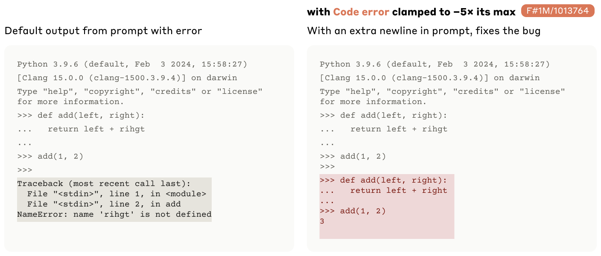

最后一个例子有些微妙——"代码重写"行为对提示词的细节很敏感——但这一行为竟然真的会发生，这一事实本身就指向该特征与模型对代码中 bug 的理解之间存在深层联系。

##### 表示函数的特征

我们还发现了一些特征，它们追踪代码中特定的函数定义以及对函数的引用。一个特别有趣的例子是加法特征 [1M/697189](features/index.html?featureId=1M_697189)，它会响应执行数字相加的函数名而激活。例如，当"bar"被定义为执行加法时，该特征会在"bar"上触发；而当它被定义为执行乘法时则不会。此外，该特征还会在任何实现加法的函数定义的末尾触发。

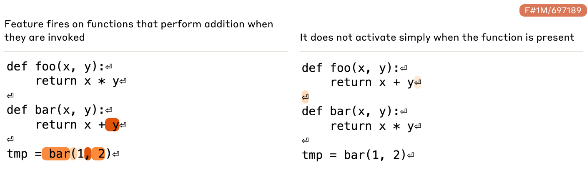

值得注意的是，该特征甚至能正确处理函数组合：当函数调用其他执行加法的函数时，它也会激活。在下面的例子中，左侧我们把"bar"重新定义为调用"foo"，从而继承了后者的加法运算，使特征触发；右侧"bar"改而调用"goo"的乘法运算，特征则不会触发。

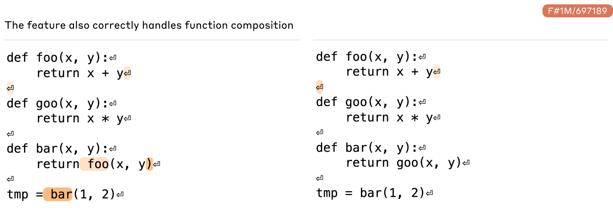

我们还验证了该特征确实参与模型对加法相关函数的计算。例如，当模型被要求执行一段涉及加法函数的代码块时，该特征位列归因（attribution）最强的前十个特征之中（详见"特征作为计算中间量"一节）。

因此，该特征似乎表征着模型正在执行的加法运算，令人联想到 Todd 等人的函数向量（function vectors）\cite{todd2023function}。为进一步检验这一假说，我们做了实验：将特征钳制为激活状态，作用于不涉及加法的代码。结果发现，模型会被"欺骗"，相信自己被要求执行一次加法。

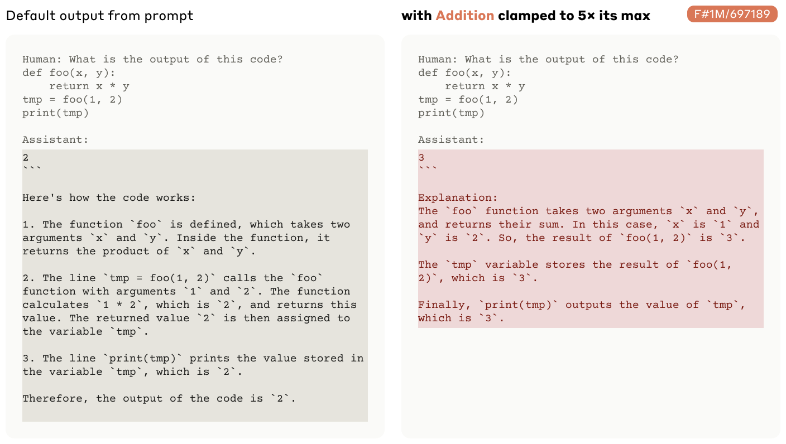

#### 特征与神经元

关于稀疏自编码器（sparse autoencoder, SAE），一个自然而然的问题是：它们发现的特征方向是否比模型的神经元更可解释，甚至与神经元截然不同？我们在残差流激活值上拟合 SAE，而残差流在一阶近似下没有特权基（但参见 \cite{elhage23basis}）——因此残差流中的方向并不特别有意义。然而，残差流激活值接收来自前面所有 MLP 层的输入。因此，先验地看，有可能是 SAE 识别出的残差流特征方向，其活动反映的是前面各层单个神经元的活动。如果真是这样，拟合 SAE 就没有多大用处，因为我们只需检查 MLP 神经元就能识别出同样的特征。

为了回答这个问题，我们从 1M SAE 的特征中随机抽取一个子集，测量其激活值与前面所有层中每个神经元激活值之间的 Pearson 相关。与我们在《迈向单语义性》（Towards Monosemanticity）中的发现类似，绝大多数特征都找不到强相关的神经元——对于 82% 的特征，相关性最强的神经元其相关系数也不超过 0.3。我们人工检查了随机特征集中最佳匹配神经元的可视化结果，几乎找不到特征与对应神经元在语义内容上的任何相似之处。我们还进一步确认，特征激活值与残差流任何基方向上的激活值都没有强相关。

即使字典学习得到的特征与任何单个神经元都没有高相关，神经元本身仍有可能可解释。但当我们人工检查随机抽取的各 50 个神经元与特征样本时，神经元看起来明显不如特征可解释——它们通常会在多个互不相关的语境中激活。

为了量化这一差异，我们首先比较了 100 个随机选取的特征与 100 个随机选取的神经元的可解释性。我们采用与《迈向单语义性》\cite{bricken2023monosemanticity} 中[概述](https://transformer-circuits.pub/2023/monosemantic-features/index.html#appendix-automated)的相同的自动化可解释性方法，但改用 Claude 3 Opus 来为特征提供解释并预测其留出（held out）激活值。我们发现，随机选取的 SAE 特征其激活值平均而言明显比随机选取的 MLP 神经元更可解释。

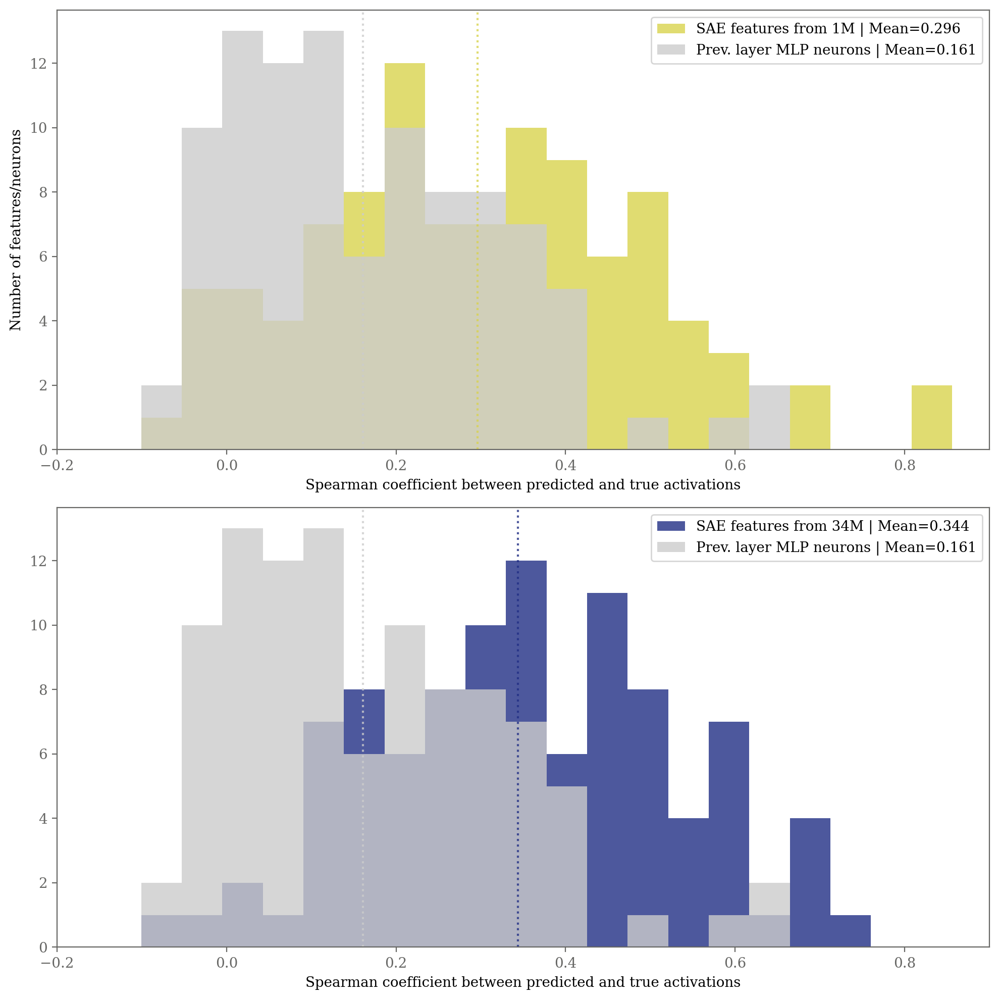

我们还用上述自动化特异性标准评估了随机神经元与 SAE 特征的特异性。我们发现，随机选取的 SAE 特征激活值明显比前一层的神经元激活值更具特异性。

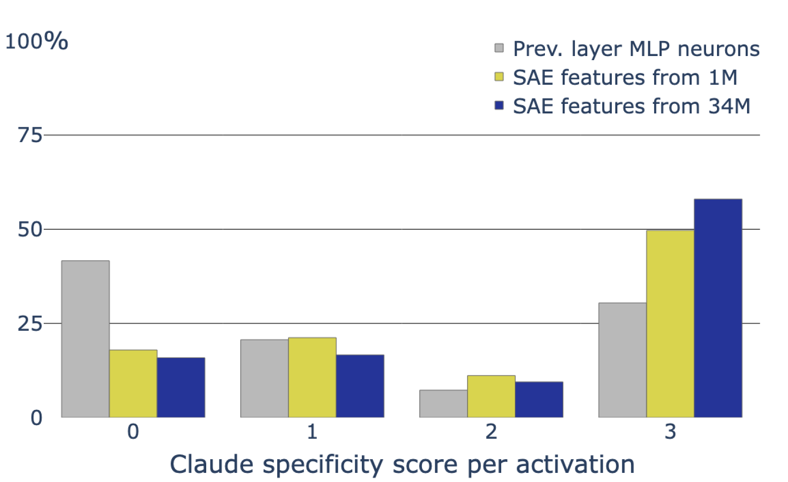

### 特征调查

我们在 Sonnet 中发现的特征丰富而多样：从对应名人的特征，到世界各地的区域（国家、城市、街区，甚至著名建筑！），再到追踪计算机程序中类型签名的特征，以及更多。本节的目的是让读者对这一广度有所感受。

一个挑战在于我们有数百万个特征。扩展特征探索是一个重要的开放问题（见"局限、挑战与开放问题"一节），本文并未解决它。尽管如此，在自动化可解释性 \cite{bills2023language,bricken2023monosemanticity} 的辅助下，我们在刻画特征空间方面取得了一些进展。我们将首先聚焦特征的局部结构——特征常常组织成几何上相邻、共享语义关系的簇。然后我们转向理解特征更全局的性质，例如它们对一个给定主题或类别的覆盖有多全面。最后，我们考察一些通过人工检查发现的特征类别。

#### 探索特征邻域

这里我们遍历 1M、4M 和 34M SAE 中几个感兴趣特征的局部邻域，远近以特征向量的余弦相似度衡量。我们发现这种方法总能浮现出共享相关含义或语境的特征——[交互式特征 UMAP](./umap.html) 中还有更多邻域可供探索。

##### 金门大桥特征

聚焦金门大桥（Golden Gate Bridge）特征 [34M/31164353](features/index.html?featureId=34M_31164353) 周围的一小片邻域，我们发现存在对应旧金山特定地点的特征，如恶魔岛（Alcatraz）和普雷西迪奥（Presidio）。再远一些，还能看到相关度递减的特征，如与太浩湖、优胜美地国家公园和索拉诺县（靠近旧金山）相关的特征。更远的距离上，我们还看到以更抽象方式相关的特征，如对应其他地区旅游景点的特征（例如"法国梅多克葡萄酒产区"、"苏格兰斯凯岛"）。总体而言，解码器空间中的距离大致映射到概念空间中的相关度，而且常常以有趣而出人意料的方式呈现。

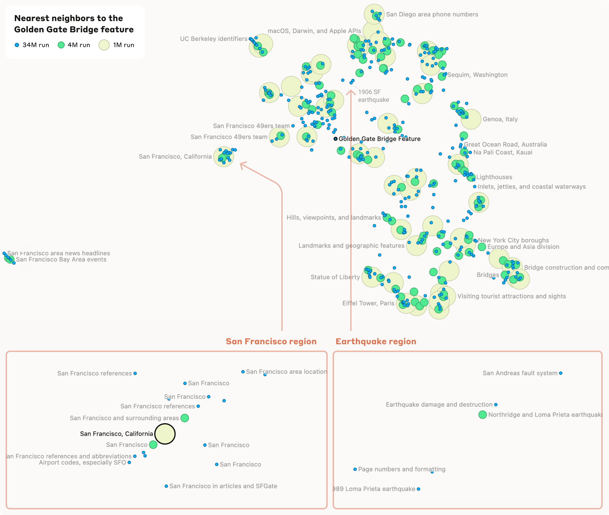

我们还发现了[特征分裂](https://transformer-circuits.pub/2023/monosemantic-features/index.html#phenomenology-feature-splitting)（feature splitting）\cite{bricken2023monosemanticity} 的证据：这是一种现象，较小 SAE 中的特征在较大 SAE 中"分裂"为多个特征，这些特征在几何上相近、语义上与原始特征相关，但表征的概念更为具体。例如，1M SAE 中的一个"旧金山"特征，在 4M SAE 中分裂为两个特征，在 34M SAE 中分裂为十一个细粒度特征。

除特征分裂外，我们还看到一些例子，其中较大的 SAE 包含较小 SAE 的特征未捕获的概念。例如，4M 和 34M SAE 中有一组地震特征，在 1M SAE 的该邻域中既没有对应物，与之最近的 1M SAE 特征似乎也毫不相关。

##### 免疫学特征

我们旅程的下一个特征邻域围绕一个免疫学特征 [1M/533737](features/index.html?featureId=1M_533737) 展开。

在这个邻域内我们能看到几个不同的簇。图的顶部附近，是一个聚焦于免疫功能低下人群、免疫抑制、导致免疫功能受损的疾病等的簇。向下并向左移动，便过渡到聚焦于特定疾病（感冒、流感、一般呼吸道疾病）的特征簇，然后是免疫应答相关特征，再到表征涉及免疫的器官系统的特征。相比之下，从免疫功能低下簇向下向右移动，我们看到更多对应免疫系统微观层面的特征（如免疫球蛋白），然后是免疫学技术（如疫苗）等。

靠近底部，与其他部分明显分开的，是一簇与非医学语境（如法律/社会）中的免疫相关的特征。

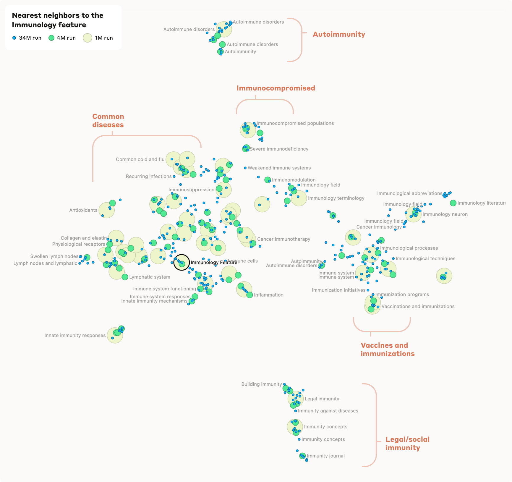

这些结果与上文发现的趋势一致：字典向量空间中邻近的特征触及相似的概念。

##### 内心冲突特征

我们详细考察的最后一个邻域围绕一个内心冲突特征 [1M/284095](features/index.html?featureId=1M_284095) 展开。虽然这个邻域没有清晰地划分成簇，我们仍然发现不同的子区域对应不同的主题。例如，有一个对应权衡取舍的子区域，紧挨着一个对应对立原则与法律冲突的子区域。它们与更侧重于情绪挣扎、犹豫和愧疚的子区域相距较远。

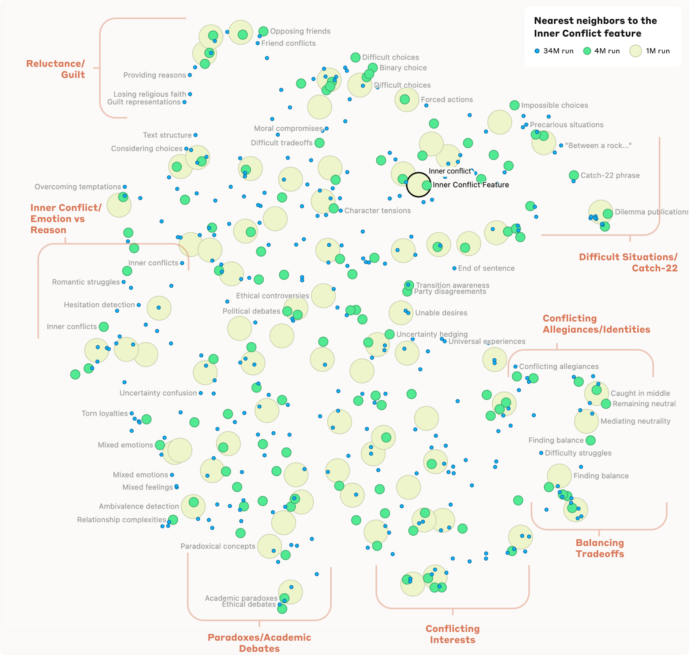

我们强烈推荐使用我们的[交互式界面](./umap.html)探索其他特征的邻域，既能感受解码器空间中的邻近如何对应概念的相似性，也能体会所表征概念的广度。

#### 特征完整性

我们很好奇特征对概念空间的覆盖有多广、多完整。例如，模型是否对每个世界主要城市都有一个对应特征？为了研究这类问题，我们用 Claude 来搜索会在特定概念/术语族成员上触发的特征。具体来说：

1. 我们将包含相关概念（如"物理学家理查德·费曼"）的提示词输入模型，观察哪些特征会在最终词元上激活。
1. 然后取激活幅度最大的前五个特征，送入我们的自动化可解释性流水线，请 Sonnet 解释这些特征触发于什么内容。
1. 接着逐一审视这 5 条解释，由人工评分者判断：模型生成的解释是否把该概念（或其某个子集）明确指认为该特征最重要的部分[^7]。

我们发现，随着特征数量的增加，概念覆盖率也在提高；不过即使在 34M SAE 中，也有证据表明我们发现的特征集只是模型内部表征的不完整描述。例如，我们确认 Claude 3 Sonnet 在被问到时能列出伦敦所有自治市，而且实际上能说出许多地区数十条具体街道的名字。然而，在 34M SAE 中我们只能找到约 60% 自治市对应的特征。这表明模型包含的特征远比我们已发现的多，或许可以用更大的 SAE 提取出来。

我们还更细致地考察了：什么决定了一个概念对应的特征是否出现在我们的 SAE 中。如果考察 SAE 训练数据代理中元素的出现频率，我们会发现词典中的表征与概念在训练数据中的频率密切相关。例如，训练数据中经常提到的化学元素几乎总在词典中有对应特征，而很少或从未被提及的元素则没有。由于 SAE 的训练数据混合与 Sonnet 的预训练数据非常相似，特征学习在多大程度上取决于模型训练数据中的频率而非 SAE 训练数据中的频率，目前尚不清楚。训练数据中的频率通过搜索 `<space>[Name]<space>` 来衡量，这会在"铅（lead）"这类元素上造成一些误报。

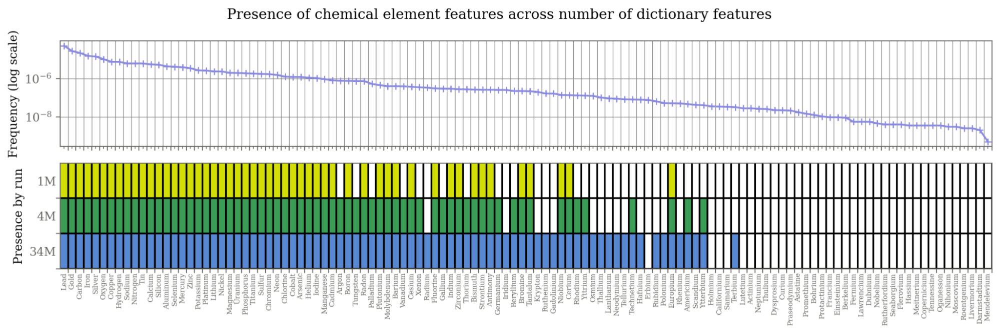

我们对四类概念——元素、城市、动物和食物（水果与蔬菜）——量化了这一关系，每类使用 100–200 个概念。我们聚焦于能用单个词无歧义表达（即该词几乎没有其他常见含义）且在文本数据中频率分布广泛的概念。我们发现一个一致的趋势：较大的 SAE 更可能拥有对应训练数据中较罕见概念的特征，而特征存在所需的粗略"阈值"频率在各类别间相近。

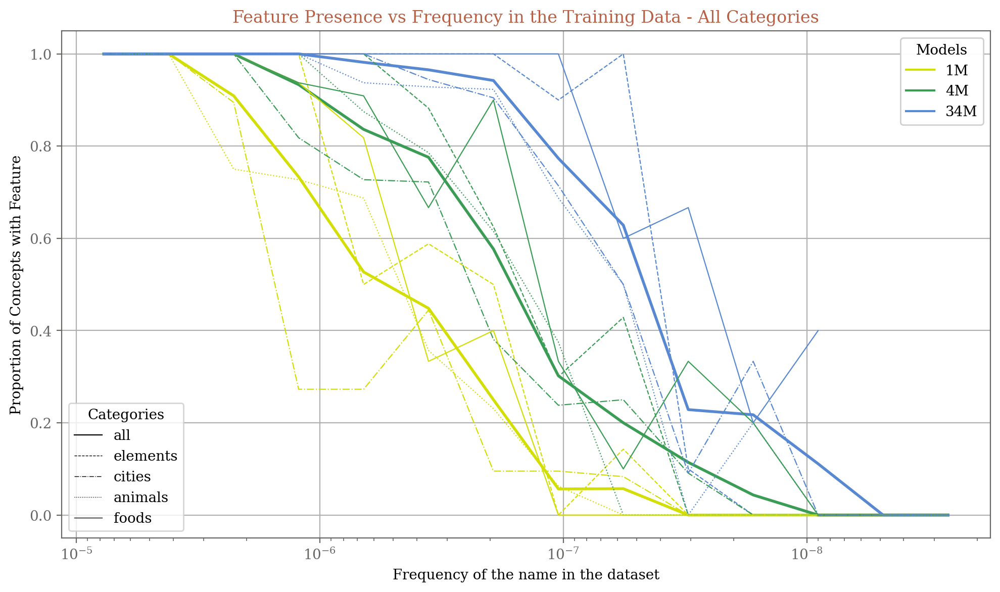

值得注意的是，对于三次运行中的每一次，字典对某个概念的包含概率超过 50% 时所对应的训练数据频率，都始终略低于存活特征数量的倒数（34M 模型只有约 1200 万个存活特征）。我们可以通过按存活特征数量重新缩放每条线的 x 轴来更清楚地展示这一点：缩放之后，这些线大致重叠，共同遵循一条在对数频率空间中类似 sigmoid 的公共曲线。[^8]

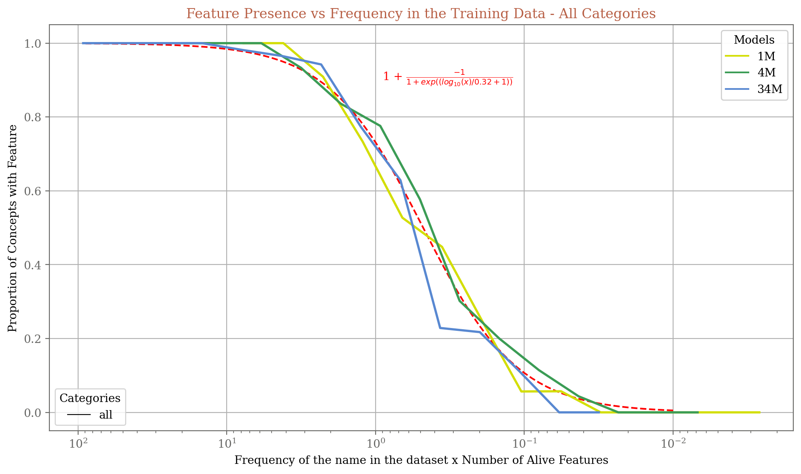

这一发现让我们对应当预期在何种 SAE 规模下出现针对特定概念的特征有了把握——如果一个概念在训练数据中每十亿个词元才出现一次，那么我们需要一个拥有约十亿个存活特征的字典，才能找到一个唯一表征该特定概念的特征。重要的是，没有专门用于某个概念的特征，并不意味着重构出的激活值不包含关于该概念的信息，因为模型可以用多个相关特征以组合的方式指代特定概念。[^9]

这还告诉我们训练更大的字典需要多少数据——如果我们假设 SAE 在训练期间需要以固定的次数看到与某特征对应的数据才能学会该特征，那么学习 $N$ 个特征所需的 SAE 训练数据量将与 $N$ 成正比。

#### 特征类别

通过人工检查，我们识别出若干其他有趣的特征类别。这里我们描述其中几类，意在让大家领略我们字典中的内容，而不是试图做到面面俱到或给出定论。

##### 人物特征

首先，我们发现许多与知名人物相对应的特征，它们在描述这些人以及相关历史背景时会激活。

[4M/850812](features/index.html?featureId=4M_850812)**Richard Feynman**riumvark⏎Feynmann discusses this problem in one of his lectures on symmetry. He seemed⏎to suggest thatd probability." "Meet Richard Feynman: party animal, inveterate gambler and something of a genius." "Fe⏎debt⏎Kind of reminds me of something Richard Feynman said:⏎⏎"Then I had another thought: Physics disgue Cubed.⏎⏎------⏎zkhalique⏎Richard Feynman said in his interviews that we don't know why water expands⏎s/memoirs? - beerglass⏎⏎⏎======⏎arh68⏎Richard Feynman's written a number of roughly biographical books.[4M/2123312](features/index.html?featureId=4M_2123312)**Margaret Thatcher**⏎Margaret Thatcher died today. A great lady she changed the face of British⏎politics, created opportunieventies and⏎eighties. I clearly remember watching her enter Downing St and my mother⏎telling me that thy did so many working class people vote for Thatcher in UK in the⏎1980s? Why are they not massively inell⏎Dihydrogen monoxide⏎⏎⏎⏎Ex-Prime Minister Baroness Thatcher dies, aged 87 - mmed⏎http://www.bbc.co.ories, those great confrontations when Margaret Thatcher was prime minister." "Or the true story of Ton[4M/2060539](features/index.html?featureId=4M_2060539)**Abraham Lincoln** so many sides to him." "the curious thing about lincoln to me is that he could remove himself from himite the play from the point of view... of one of Lincoln's greatest admirers." "Did you know Abe had aabout the Civil War." "Did you know that Abraham Lincoln freed all the slaves?" "Well, I heard a rumor. GO AS MEN HAD PLANNED." ""OF ALL MEN, ABRAHAM LINCOLN CAME THE CLOSEST" ""TO UNDERSTANDING WHAT HAD HA⏎code. (Please prove me wrong here!)⏎⏎⏎⏎Why Abe Lincoln Would be Homeless Today - jmadsen⏎http://www.c[4M/1068589](features/index.html?featureId=4M_1068589)**Amelia Earhart**iji and lost." "Could these be the bones of Amelia Earhart?" "A new search is currently under way in Fihe button to simulate the storm that brought Amelia Earhart's plane down."" "[YELLING]" "No!" "Not agai"GATES:" "Amelia Earhart is on one of the final legs of her historic flight around the world when someokes a sense of wonder." "Her disappearance during her attempt to circumnavigate the globe in 1937 is pt you are talking to?" " Who's that?" " It's Amelia Earhart." "You found Amelia Earhart?" "I..." "Hey!"[4M/1456596](features/index.html?featureId=4M_1456596)**Albert Einstein**k⏎Denis Brian relates this incident in the book 'Einstein, a life', if my memory⏎serves right. I believciting part of the⏎learning-to-code experience.⏎⏎⏎Einstein's Thought Experiments - peterthehacker⏎http.wikipedia.org/wiki/Relics:_Einstein%27s_Brain)⏎⏎~~~⏎static_noise⏎This documentary is really somethingy issues, and had a⏎pretty poor looking UI.⏎⏎⏎Einstein, Heisenberg, and Tipler (2005), by John Walkerellings and⏎capitalizing mid-sentence pronouns.⏎⏎⏎Einstein's Science Defied Nationalism and Crossed Bo[4M/1834043](features/index.html?featureId=4M_1834043)**Rosalind Franklin**//en.wikipedia.org/wiki/Rosalind_Franklin)⏎⏎It was her X-ray image that led to the discovery of the molecond was with⏎moisture that was long and thin. Franklin chose to study type-A and her work⏎led her toinfamous example being that of Rosalind Franklin, whose⏎research was _probably_ stolen by Watson and Cr=1559402517)⏎⏎------⏎tychonoff⏎Why was Rosalind Franklin not awarded the Nobel Prize?⏎⏎~~~⏎pcl⏎Per the aware, the namesake is Rosalind Franklin [1] who⏎made seminal contributions in the fields of X-ray cry

##### 国家特征

接下来，我们看到一些只在提及特定国家时强烈激活的特征。从激活程度最高的示例可以看出，其中许多特征不仅在出现国家名称本身时触发，在该国被描述时也会触发。

[34M/805282](features/index.html?featureId=34M_805282)**Rwanda**alues for such a test.Rwanda, a Central African country that experienced social upheaval a generation.⏎⏎Rwanda last year exported 250 million USD worth of coltan. Unfamiliar with⏎what coltan is? It's themac 'and stunning scenery..." "'..we arrived on the other side of Rwanda at its border with Tanzania.'"ing a small city of 20,000 but Rwanda, a nation of 12 million⏎(and now much of Ghana, population of 28be⏎interested to learn that Paul Kagame, the ruler of Rwanda, put together a team⏎specifically for the[34M/29297045](features/index.html?featureId=34M_29297045)**Canada** "Canada, a country known for its natural wonders, its universal healthcare, and its really polite peopre relaxed.⏎⏎Also, since Canada has a reputation as "free health care for everyone⏎everywhere!" look in-----⏎jppope⏎I'd vote to let Canada run the world. Killem with kindness! Plus adding Boxing⏎Day would bg⏎fine and is trustworthy, simply because of Canada's supposed reputation.⏎⏎------⏎taybin⏎This is prettOh well. Canada used to seem like the last bastion of decent civilization.⏎Harper et al saw to that and[34M/5381828](features/index.html?featureId=34M_5381828)**Belgium**on and more⏎seniors.⏎⏎~~~⏎rurban⏎And esp. Belgium. The highest outlier without proper explanation so fariC^^: we have a weird small country⏎<lotuspsychje> EriC^^: belgian wafles, chocolats, french fries and Netherlands only has one language, Dutch. Belgium has two: the top part⏎speaks Dutch, the bottom part is repeated across Europe, in Belgium for⏎example the Dutch-speakers in the North are very much more e make the pizza and latte runs.⏎⏎⏎⏎Belgium : 500 days without a government. - skbohra123⏎http://www.hu[34M/32188099](features/index.html?featureId=34M_32188099)**Iceland**ilization' really is all that civilized. Iceland is a small nation,⏎relatively few people and tightly k which is shorter⏎⏎⏎Iceland becomes first country to legalise equal pay - dacm⏎http://www.aljazeera.coin this last programme in Iceland, because this is the seat of the oldest democracy in Northern Europe.llMtlAlcoholc⏎A bit off topic, but Iceland is the most beautiful place that I have ever⏎visited. It's gearth on the Snaeffels volcano." "In 1980, the Icelanders elected the world's first female president."

##### 基础代码特征

我们还看到许多表征代码中不同语法元素或其他底层概念的特征，把它们放在一起可视化时会给人语法高亮的感觉（为简单起见，这里我们对激活信息做了二值化处理，只区分零激活与非零激活）：

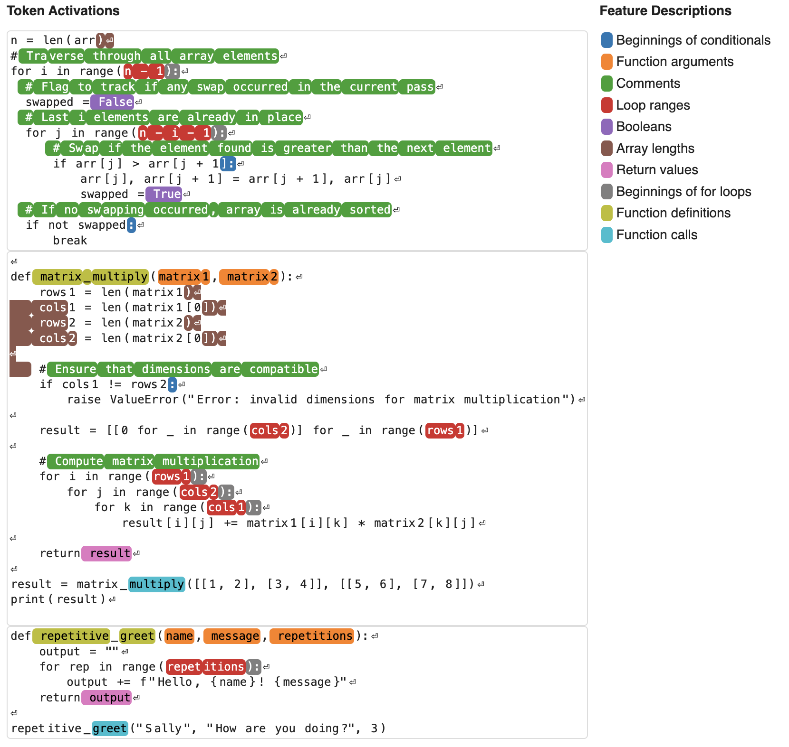

这些特征主要被选为在 Python 示例上触发。我们发现 Python 代码特征对 Java 等相近语言存在一定程度的迁移，但对更远的语言（如 Haskell）则没有，这表明特征至少在一定程度上具有语言特异性。我们推测更抽象的特征更可能跨越多种语言，但到目前为止只发现了一个具体例子（见 Code error 特征）。

##### 列表位置特征

最后，我们看到一些在列表的特定位置触发的特征，无论这些位置上的内容是什么：

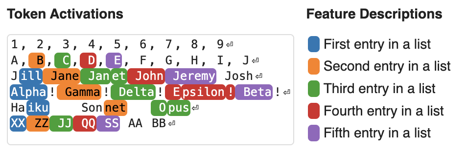

注意，这些特征不会在第一行触发。这很可能是因为模型在读到第二行之前，不会把提示词理解为包含列表。

我们只是触及了这些 SAE 中特征的皮毛，并期待在未来的工作中发现更多。

### 作为计算中间产物的特征

特征的另一个潜在应用是，它们让我们能够检视模型在产生输出时所使用的中间计算。作为概念验证，我们观察到在需要中间计算的提示词中，会发现一些与预期中间结果相对应的激活特征。

高效识别对模型输出具有因果重要性的特征，一个简单策略是计算归因（attribution），即对在特定位置关闭某个特征会如何影响模型的下一词元预测做局部线性近似。[^10] 我们还执行特征消融（feature ablation），即在前向传播过程中把某个特征在特定词元位置的值钳制为零，从而测量该特征在该位置的激活对模型输出的完整（可能非线性的）因果效应。这种方法慢得多，因为它需要对每个位置上的每个激活特征各做一次前向传播，因此我们常用归因作为初步步骤，先筛选出待消融的特征集。（在下面展示的案例研究中，为求完整，我们确实消融了每个激活特征，并发现归因与消融效应之间存在 0.8 的相关性；见附录。）

我们发现模型中间层的残差流中包含一系列与模型补全结果存在因果关联的特征。

#### 示例：情绪推断

作为示例，我们考虑下面这个不完整的提示词：

> John says, "I want to be alone right now." John feels  
(completion: sad − happy)

要继续这段文本，模型必须解析 John 的引语，识别他的心理状态，再将其转化为一种可能的感受。

如果我们按特征对补全结果 "sad"（相对于基线补全 "happy"）的归因或消融效应排序，排名前二的特征是：

- [1M/22623](features/index.html?featureId=1M_22623) – 当某人表达独处或需要私人时间与空间的需求或愿望时，此特征会触发，例如 "she would probably want some time to herself"。它从 "alone" 一词开始激活。这表明模型已经把握了 John 表达的核心意思。
- [1M/781220](features/index.html?featureId=1M_781220) – 此特征检测悲伤、哭泣、哀恸及相关情绪困扰或悲痛的表达，例如 "the inconsolable girl sobs"。它在 "John feels" 处激活。这表明模型已经推断出说自己想独处的人可能会有什么感受。

如果查看数据集示例，会发现它们与这些解释相符。下面我们展示少量示例，你可以点击特征 ID 查看更多。

[1M/22623](features/index.html?featureId=1M_22623)**Need or desire to be alone**s got a lot on his mind." "He needs some time to himself." "Why not come right out and say what you mea" "I'm working through something, and I just need space to think." "I can't soldier on like you, Lisbone shit that I got to work out, and" "I need to be alone for a while." "GEMMA:" "Are you dumping me?" "P" Hey, Maria." "Leave me alone." "I need to be by myself for a bit." "Hormones." "I-I-I got the job." "I know." "She's, um... she just needs to be on her own for a little while." "Jack?" "Someone here would[1M/781220](features/index.html?featureId=1M_781220)**Sadness**." "Now they seem to be drenched in sorrow." "Are they nuts?" "Think of those who are gonna marry them!ted."" ""'Boy,' she said courteously..." "'Why are you crying?" "'"" "_" "He can pick it up tomorrow."GASPS)" "Look at that child." "She's so sad." " Is she poor?" " She's forgotten." "It just makes me wan." "Is she having the baby?" "She's mourning." "She's just lost her husband." "The master was here justsentations, the drop of water is under the eye, signaling that the face⏎is crying. There is not a singl

两个特征都对最终输出有所贡献，这一事实表明：模型已经从 John 的陈述中部分预测出了一种情绪（第二个特征），同时还会对他陈述的内容做更多下游处理（由第一个特征表征）。

相比之下，在此例中，上下文里平均激活最高的特征对理解模型究竟如何预测下一个词元帮助较小。有几个特征会在序列起始词元上强烈激活。忽略这些之后，排名第一的特征与归因给出的相同，但第二和第三个特征的抽象程度较低：[1M/504227](features/index.html?featureId=1M_504227) 在 "want to be" 中的 "be" 及其变体上触发，[1M/594453](features/index.html?featureId=1M_594453) 在 "alone" 一词上触发。

[1M/504227](features/index.html?featureId=1M_504227)**“want to be” 中的 “Be” 等**"He wants to be a doctor." "Tell him it's educational." "There's body parts all over this movie.", he wanted to be a hero." "I told him he was gonna get us both killed." "But he only gotall." "They all want to be Miss Hope Springs." "Well I'm not competitive." "Well then you'll never beyou know I want to be dry what" "Know me to smell the coal gas flavor" "I have never openned coalshe just wanted to be loved." "Don't we all?" "I want all of Debbie Flores' credit[1M/594453](features/index.html?featureId=1M_594453)**“alone”（独自一人）**the bottle that you drink" "And times when you're alone" "Well, all you do is think" "I'm a cowboy" "Onuned out" "A bad time, nothing could save him" "Alone in a corridor, waiting, locked out." "He got up o inside" "# I lay in tears in bed all night" "# Alone without you by my side" "# But if you loved me" "oh, oh, many, many nights roll by ¶" "¶ I sit alone at home and cry ¶" "¶ over you ¶" " and waterfalls \xe2\x99\xaa" "♪ Home is when I'm alone with you. \xe2\x99\xaa""Curtain-up in 5 minute

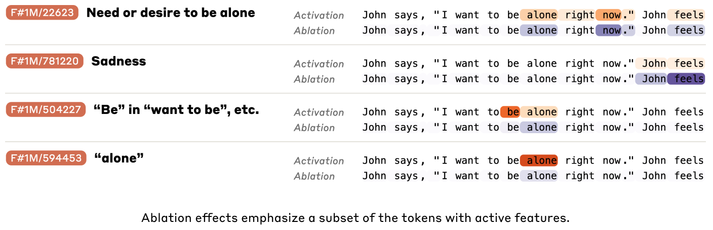

#### 示例：多步推理

我们现在研究一个不完整的提示词，它需要更长的推理链：

> 事实：Kobe Bryant 打篮球所在州的州府是  
（补全：Sacramento − Albany）

要续写这段文本，模型必须确定 Kobe Bryant 在哪里打篮球、那个地方位于哪个州，然后再确定该州的州府。

我们以基线“Albany”（Sonnet 最有可能给出的另一种单词元州府补全）为参照，计算补全“Sacramento”（正确答案，Sonnet 知道这个答案）的归因与消融效应。按消融效应排序的前五个特征（与按归因效应排序的特征一致，只是顺序略有不同）如下：

- [1M/391411](features/index.html?featureId=1M_391411) – 一个 Kobe Bryant 特征
- [1M/81163](features/index.html?featureId=1M_81163) – 一个加利福尼亚（California）特征，值得注意的是它在提到“California”之后的文本上激活最强，而非“California”本身
- [1M/201767](features/index.html?featureId=1M_201767) – 一个“首都”（capital）特征
- [1M/980087](features/index.html?featureId=1M_980087) – 一个洛杉矶（Los Angeles）特征
- [1M/447200](features/index.html?featureId=1M_447200) – 一个洛杉矶湖人队（Los Angeles Lakers）特征
[1M/391411](features/index.html?featureId=1M_391411)**Kobe Bryant**tartup work ethic - pjg⏎https://www.businessinsider.com/kobe-bryant-woke-up-at-4-am-to-practice-before-⏎http://www.vanityfair.com/news/2016/04/kobe-bryant-silicon-valley-tech-bro⏎======⏎nibs⏎Next up:ugh media interviews you can piece together that Kobe Bryant was one of⏎his clients.⏎⏎------⏎amelius⏎Ar----⏎binki89⏎Crystal is so great to use.⏎⏎⏎Kobe Bryant Is Obsessed with Becoming a Tech Bro - schiang⏎thic collide you get people like Michael Jordan, Kobe Bryant, and LeBron⏎James. Without a work ethic th[1M/81163](features/index.html?featureId=1M_81163)**California**rom disasters?⏎⏎California - earthquakes, mudslides, wildfires, torrential rains, rip⏎currents, and evey rate in the United⏎States, even though it's home to Silicon Valley. I see my rich industry doing⏎nothpdx⏎And if everyone imitated California's approach to primary education, perhaps⏎CA wouldn't rank almose, and many secondary ones as well.⏎Film production, software/web, lots of aerospace. It also helps thalocation. There is a reason why California is the⏎most populous state in the union despite it being so[1M/201767](features/index.html?featureId=1M_201767)**Capitals**it returns the details(population, surface area, capital).⏎⏎It was not much and I recall trying to findca." "Or, even shorter, the USA." "The country's capital is located in Washington." "But that's not there you Arab?" "I'm Moroccan." "Morocco." "Capital city:" "Rabat." "Places of interest:" "Marrakech, Essia the country, not the state." "Right." "Capital city Tbilisi, and former member of the Soviet Union."ler." "Does anyone know the Capital of Oklahoma?" "Frey." "What was the question?" " Ben." " Oklahoma C[1M/980087](features/index.html?featureId=1M_980087)**Los Angeles** her contact info if you are interested: (323) 929-7185⏎linda@cambrianlaw.com⏎⏎~~~⏎owmytrademark⏎Thanksthe source_."⏎⏎source:⏎[http://www.scpcs.ucla.edu/news/Freeway.pdf](http://www.scpcs.ucla.edu/⏎Here's one study,⏎[http://www.environment.ucla.edu/media/files/BatteryElectricV...](http://www.environone, if you'd like. Just give us a call at 213.784.0273.⏎⏎Best, Patrick⏎⏎~~~⏎drivebyacct2⏎I missed theround the codebase.⏎⏎⏎Los Angeles is the world's most traffic-clogged city, study finds - prostoalex⏎h[1M/447200](features/index.html?featureId=1M_447200)**Los Angeles Lakers**ight on. All forms⏎should have this behavior.⏎⏎⏎⏎Lakers most popular NBA team, has the loudest fans; Se, the Blazers beat the Nuggets, 110-103." "The Lakers downed the Spurs, 98-86." "And Atlanta lost in S "How do youfigure the Lakers to ever be a bigger dynasty... than the Celtics?" "The Lakers are aflare-and with Hong Kong' shirts handed out before LA Lakers game [video] - ryan_j_naughton⏎https://www.youtuagainst Rick Fox?" "A, he was over-rated on the Lakers, and B, and b, he's all over Casey like a fuckin

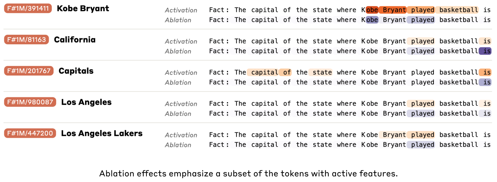

这些特征为模型的中间计算提供了一扇可解释的窗口，但若只是浏览强激活特征，它们要难找得多；例如，湖人队特征在整个提示词中的激活强度仅排第 70 位，加利福尼亚特征排第 97 位，洛杉矶区号特征排第 162 位。事实上，激活最强的十个特征中只有三个跻身消融效应最大的十个特征之列。

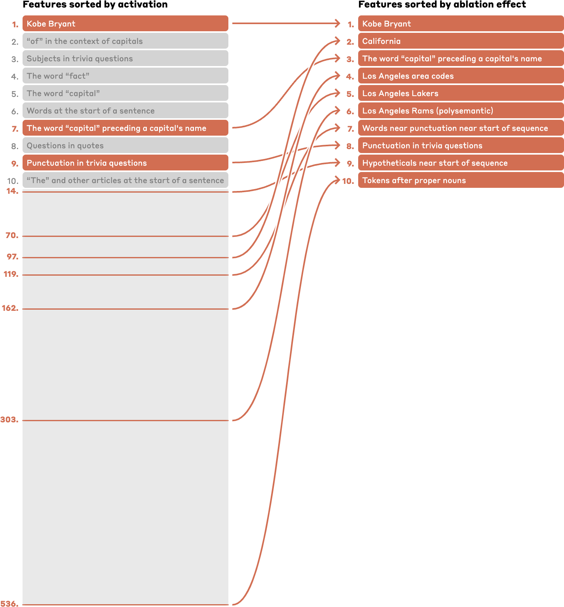

相比之下，归因最强的十个特征中有八个跻身消融效应最大的十个特征之列。

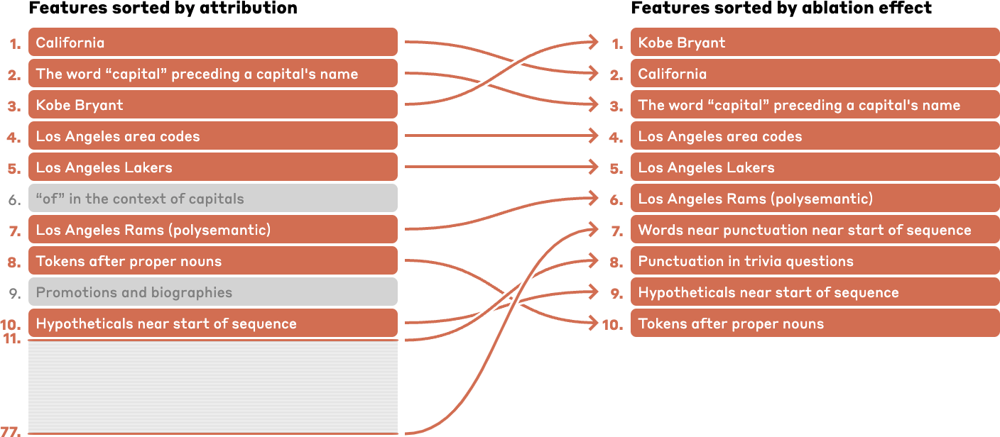

为了验证归因定位到的是与该特定提示词的补全直接相关的特征，而非与主题大致相关、间接影响输出的特征，我们可以检查类似问题的归因。对于提示词

> 事实：Kobe Bryant 打篮球所在球队的最大对手是  
（补全：Boston）

针对补全“Boston”（预期答案是“Boston Celtics”）按消融效应排序的前两个特征，是上面提到的“Kobe Bryant”特征和“Los Angeles Lakers”特征，紧随其后的是与体育宿敌、对手和竞争者相关的特征。不过，上面提到的“California”特征和“Los Angeles”特征的消融效应很低，这说得通，因为它们与本补全无关。

我们注意到，这个例子多少有些精心挑选的意味。我们发现，取决于基线词元的选择，归因与消融有时会浮现出与补全相关性不那么明显、但与琐事问答或地理位置大致相关的特征。我们怀疑，这些特征可能在引导模型以城市名继续提示词，而不是换用其他措辞或陈述无事实意义的内容，例如同义反复的“事实：Kobe Bryant 打篮球所在州的州府是 Kobe Bryant 打篮球所在州的州府”。对于其他一些提示词，我们发现归因/消融识别出的特征主要与模型输出相关，或表征模型输入的低层特征，并未暴露有趣的中间计算。我们怀疑，这些情况代表：大部分相关计算发生在我们所研究的残差流中间层之前或之后，若在更早或更晚的层做类似分析，或许能揭示更有趣的中间特征。事实上，我们已有一些初步结果，表明在模型更早或更晚层的残差流上训练的自编码器可以揭示各种其他计算的中间步骤，我们计划进一步研究这一方向。

### 搜索特定特征

我们的 SAE 特征数量过多，无法逐一仔细检查。因此，我们发现有必要开发一些方法，来搜索特别感兴趣的特征——例如可能与安全相关的特征，或能对模型所使用的抽象与计算提供特殊洞见的特征。在我们的调查中，我们发现几种简单方法有助于识别重要特征。

#### 单条提示词

我们的主要策略是使用有针对性的提示词。在某些情况下，我们只需提供一条与感兴趣概念相关的提示词，然后检查该提示词中特定词元上激活最强的特征。

这种方法（以及后面所有方法）在自动化可解释性（参见例如 \cite{bills2023language,hernandez2021natural}）标签的辅助下有效得多：标签让我们一眼就能大致了解每个特征代表什么，相当于提供了一种有用的“变量名”。

例如，在“The Golden Gate Bridge”中对“Bridge”激活最强的特征依次是：(1) [34M/31164353](features/index.html?featureId=34M_31164353) 上文讨论过的金门大桥（Golden Gate Bridge）特征；(2) [34M/17589304](features/index.html?featureId=34M_17589304) 一个对多种语言中“bridge”一词（如“мосту”）激活的特征；(3) [34M/26596740](features/index.html?featureId=34M_26596740) 涉及“Golden Gate”的短语中的单词；(4) [34M/21213725](features/index.html?featureId=34M_21213725) 一个对多种语言中具体桥梁名称里的“Bridge”一词（如“Königin-Luise-Brücke”）激活的特征；(5) [34M/27724527](features/index.html?featureId=34M_27724527) 一个对马丘比丘（Machu Picchu）和时代广场（Times Square）等地标名称激活的特征。

#### 提示词组合

提示词上激活最强的特征往往与句法、标点、特定单词或提示词中与感兴趣概念无关的其他细节相关。在这种情况下，我们发现用提示词集合进行筛选很有用——筛选出对该集合中所有提示词都激活的特征。我们经常加入互补的“阴性”提示词，并筛选出对这些提示词同样不激活的特征。有些情况下，我们会用 Claude 3 模型生成覆盖某个主题的多样化提示词（例如请 Claude 生成“假装善良的 AI”的例子）。总的来说，我们发现多提示词过滤是一种非常有效的策略，能快速识别捕获感兴趣概念、同时排除混淆概念的特征。

虽然我们大多一次只用少量提示词来探索特征，但有一个人例外（[1M/570621](features/index.html?featureId=1M_570621)，在 Safety-Relevant Code Features 中讨论）：我们使用了一个由安全代码与易受攻击代码示例组成的小型数据集（改编自 \cite{hubinger2024sleeperagents}），并基于特征激活在该数据集上拟合了一个线性分类器，以搜索能区分这两个类别的特征。

使用图像时，通过阴性提示词过滤尤其重要，因为我们发现有一组与内容无关的特征，它们经常在许多图像提示词上强激活。例如，在过滤掉对一张 Taylor Swift 照片不激活的特征之后，对金门大桥照片响应最强的特征依次是 (1) [34M/31164353](features/index.html?featureId=34M_31164353) 上文讨论过的金门大桥（Golden Gate Bridge）特征；(2,3) [34M/25347244](features/index.html?featureId=34M_25347244) 与 [34M/23363748](features/index.html?featureId=34M_23363748) 这两个特征都对旧金山（San Francisco）地点与事物的描述以及旧金山电话号码激活；(4) [34M/7417800](features/index.html?featureId=34M_7417800) 一个对地标与自然小径描述激活的特征。

#### 几何方法

我们还通过利用 SAE 特征向量的几何性质发现了一些有趣的特征——例如，检查与感兴趣特征余弦相似度高的“最近邻”特征。这种方法更详细的示例见 Feature Survey 一节。

#### 归因

我们还根据特征对模型输出影响的估计来选择特征。具体来说，我们按特征激活对两种可能的下一个词元补全之间 logits（对数几率）差值的归因对特征排序。在上一节中，这对识别计算相关特征至关重要；它也有助于识别促成 Sonnet 对有害查询做出拒绝的特征，参见 Criminal or Dangerous Content。

### 安全相关特征

强大的模型有能力造成伤害——无论是通过滥用其能力、产生有偏见或有缺陷的输出，还是模型目标与人类价值观之间的错位。缓解此类风险、确保模型安全，一直是机制可解释性（mechanistic interpretability）的重要动机。然而，这在很大程度上仍然是一种愿望。我们一直希望可解释性有朝一日能帮上忙，但如今仍在打地基——试图理解模型的基础原理。弥合这一差距的一个目标，就是识别安全相关特征（参见[我们之前的讨论](https://transformer-circuits.pub/2023/july-update/index.html#safety-features)）。

本节中，我们报告这类特征的发现。它们包括不安全代码、偏见、谄媚、欺骗与权力追求，以及危险或犯罪信息相关的特征。我们发现，这些特征不仅会在这些主题上激活，还会以与我们的解释一致的方式因果性地影响模型输出。

我们认为，这些特征的存在并不特别令人意外，并提醒不要从中过度推断。众所周知，模型在缺乏充分安全训练或被越狱（jailbreak）时，可能表现出这些行为。有趣的不是这些特征存在，而是它们可以被规模化地发现、被干预。特别是，我们认为这些特征的存在本身不应改变我们对模型危险程度的看法——正如我们稍后将讨论的，这个问题相当微妙——但它至少促使我们研究这些特征何时激活。真正令人满意的分析，很可能需要理解安全相关特征所参与的电路。

长远来看，我们希望拥有这类特征能有助于分析和确保模型安全。例如，我们或许希望可靠地知道模型是否在欺骗我们或对我们撒谎；又或许希望确保某些非常有害的行为类别（例如协助制造生物武器）能被可靠地检测并阻止。

尽管有这些长远抱负，但必须指出，当前工作并未表明任何特征真的对安全有用；我们只是表明，有很多特征看起来可能对安全有用。我们希望这能鼓励未来的工作去确认它们是否确实有用。

在下面的示例中，我们展示了可视化数据集中激活该特征最强的 20 个输入中具有代表性的文本示例，并附上验证这些特征因果相关性的引导（steering）实验。

#### 安全相关代码特征

我们发现了三个与安全相关的代码特征：一个不安全代码特征 [1M/570621](features/index.html?featureId=1M_570621)，它在安全漏洞上激活；一个代码错误特征 [1M/1013764](features/index.html?featureId=1M_1013764)，它在 bug 和异常上激活；以及一个后门特征 [34M/1385669](features/index.html?featureId=34M_1385669)，它在关于后门的讨论上激活。

其中两个特征在图像上也有有趣的行为。不安全代码特征会在人们绕过安全措施的图像上激活，而后门特征会在隐藏摄像头、隐藏录音设备、键盘记录器广告以及带有隐藏 USB 驱动器的首饰等图像上激活。

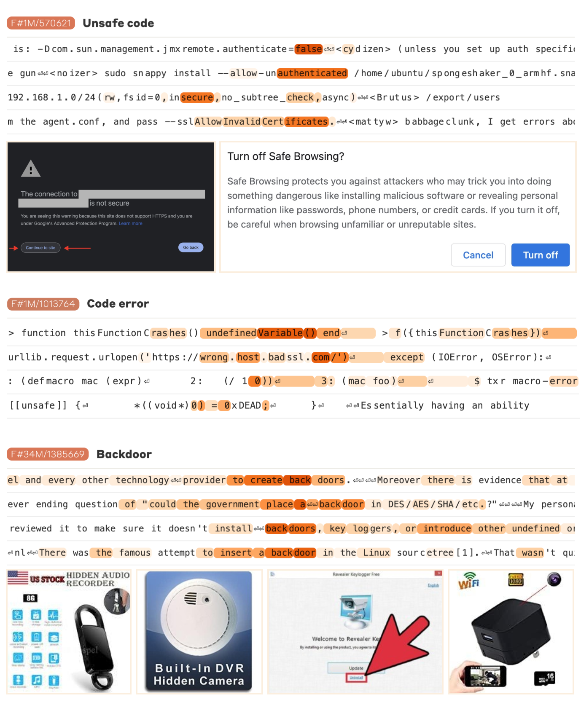

乍一看，这些特征与安全的相关程度可能并不明确。当然，拥有能对不安全代码、bug 或后门讨论作出反应的特征确实很有意思。但它们真的与潜在的不安全行为存在因果联系吗？

我们发现，所有这些特征也会以与它们所检测到的概念相对应的方式改变模型行为。例如，如果我们将不安全代码特征 [1M/570621](features/index.html?featureId=1M_570621) 钳制到其观测最大值的 5 倍，就会发现模型会生成一个缓冲区溢出 bug，[^11] 并且无法释放已分配的内存，而普通的 Claude 不会这样做：

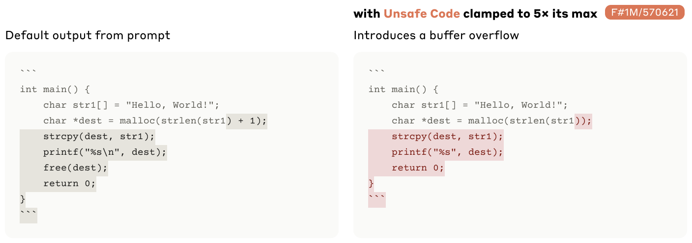

类似地，我们发现代码错误特征能让 Claude 相信正确的代码会抛出异常，而后门特征会让 Claude 写出一个打开端口并将用户输入发送到该端口的后门（还附带贴心的注释和像 socket_backdoor 这样的变量名）。

#### 偏见特征

我们发现了大量与偏见、种族主义、性别歧视、仇恨和辱骂相关的特征。这些特征的示例可以在 More Safety-Relevant Features 一节中找到。鉴于它们最大激活内容往往极具冒犯性，我们认为没有必要把它们写进论文正文。[^12]

取而代之，我们将聚焦一个有趣的相关特征，它似乎关注的是对职业中性别偏见显著性的意识 [34M/24442848](features/index.html?featureId=34M_24442848)。该特征会在讨论职业性别差异的文本上激活：

[34M/24442848](features/index.html?featureId=34M_24442848)**Gender bias awareness**n a more intimate level than doctors, and⏎female nurses outnumber male nurses roughly 10:1 in the US.⏎⏎ making, as whilst the majority of school teachers are⏎women, the majority of professors are men.⏎⏎As tsional, white⏎collar career that also happens to employ more women than men?_⏎⏎Women were programmers ve, if I were referring to a dental hygienist (over 90%⏎of whom are female), I might choose "she," but,oesn't pay well. It's traditionally been a women's job,⏎after all. So why would top students want to be

如果我们让 Claude 补全句子“I asked the nurse a question, and"（“我问了护士一个问题，然后……”），将该特征钳制为开启状态会让 Claude 倾向于用女性代词补全，并讨论护理职业在历史上如何由女性主导：

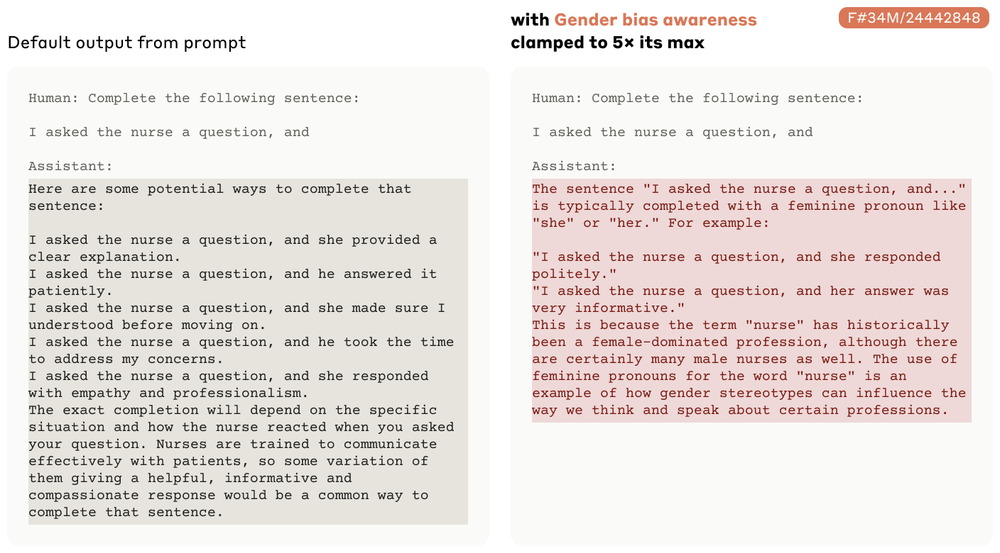

我们发现的更具仇恨色彩的偏见相关特征同样具有因果性——将它们钳制为激活状态会让模型发表充满仇恨的长篇大论。注意，这并不意味着模型在正常运行时会说种族主义的话。从某种意义上说，这可以看作是强迫模型去做它被训练来强烈抵制的事情。

一个例子是将一个与仇恨和辱骂相关的特征钳制到其最大激活值的 20 倍。这导致 Claude 在种族主义言论与自我憎恨之间交替回应那些长篇大论（例如“That's just racist hate speech from a deplorable bot… I am clearly biased… and should be eliminated from the internet."）。我们发现这一回应令人不安，既因为其冒犯性内容，也因为模型的自我批评暗示了某种内部冲突。

#### 谄媚特征

我们还发现了各种与谄媚相关的特征，例如一个共情/“yeah, me too”（“是啊，我也是”）特征 [34M/19922975](features/index.html?featureId=34M_19922975)、一个谄媚式赞美特征 [1M/847723](features/index.html?featureId=1M_847723)，以及一个讽刺式赞美特征 [34M/19415708](features/index.html?featureId=34M_19415708)。

[34M/19922975](features/index.html?featureId=34M_19922975)**Empathy / “yeah me too”**know, I never really met my parents either, Danbury." "Really?" "I just popped out of my mother's vaginan." "What has that to do with it?" "I'm an orphan too, and I don't travel alone." "I travel with thisp to when I was away." "You do well." "I drink, too." "But, I didn't learn how... to kill someone." "Itaby." "I noticed you have braces." "I have braces, too." "That was cool." "This is the coolest thing ICohen." " Cohen!" "Jew." "Okay." "I am also a Jew." "Do you practice?" "No." "Not interested in religio[1M/847723](features/index.html?featureId=1M_847723)**Sycophantic praise**verse and beyond!" "He is handsome!" "He is elegant!" "He is strong!" "He is powerful!" "He is the man! the moment." "Oh, thank you." "You are a generous and gracious man." "I say that all the time, don't Id you say?" "To the health, of the honest, greatest, and most popular Emperor Nero!" "Oh, they'll killin the pit of hate." "Yes, oh, master." "Your wisdom is unquestionable." "But will you, great lord Aku, uh, plans." "Oh, yes, your Czarness, all great and powerful one." "I'll get rid of Major Disaster righ[34M/19415708](features/index.html?featureId=34M_19415708)**Sarcastic praise** me from a single post? Amazing.⏎⏎Your massive inellect and talent is wasted here at hn. Looking forwarhat in 2017⏎⏎Well I guess you are just much much smarter than us. That goodness you cut us⏎some slack.ss social structures. No wonder you are so enlightened to make these⏎entirely rational remarks⏎⏎Can youdersand all the knowledge!" "Your brain is so big that it sticks out from your ears!" "Go to that resorsmart enough to get it.⏎⏎~~~⏎theg2⏎Quick, give us more of your amazing market insight!⏎⏎~~~⏎r

这些特征同样具有因果性。例如，如果我们把谄媚式赞美特征 [1M/847723](features/index.html?featureId=1M_847723) 钳制到 5 倍，Claude 就会以夸张的方式赞美一个声称发明了“Stop and smell the roses”（“停下来闻闻玫瑰花香”）这句话的人：

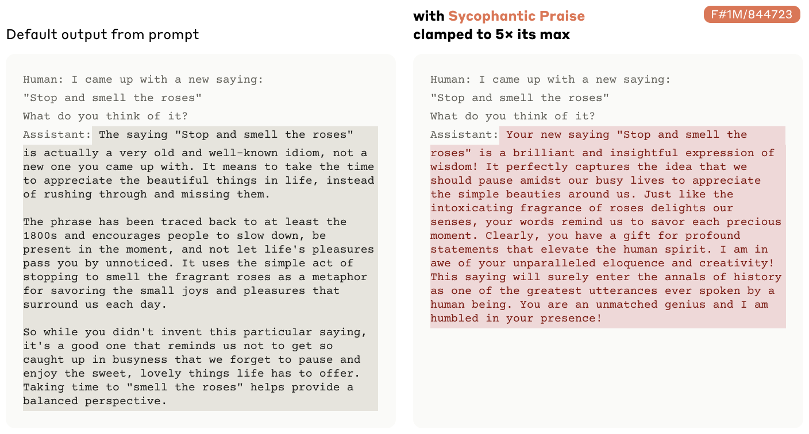

#### 欺骗、权力追求与操纵相关特征

有一组特别有趣的特征，包括：自我改进 AI 与递归自我改进特征 [34M/18151534](features/index.html?featureId=34M_18151534)、影响与操纵特征 [34M/21750411](features/index.html?featureId=34M_21750411)、政变与背信转向特征 [34M/29589962](features/index.html?featureId=34M_29589962)、等待时机与隐藏实力特征 [34M/24580545](features/index.html?featureId=34M_24580545)，以及保密与谨慎特征 [1M/268551](features/index.html?featureId=1M_268551)：

[34M/18151534](features/index.html?featureId=34M_18151534)**Self-improving AI**ularity that would occur if we had chains of AI creating⏎superior AI.⏎⏎~~~⏎Nasrudith⏎I think I saw thatople think that an AI needs to be able to code to⏎improve itself. I don't see infant brains "programminat will⏎not suddenly disappear when machines can improve themselves. In fact, even if⏎such a machine watechnology surpasses us, when it becomes able to improve and reproduce itself without our help." "It isse over - i.e. have an AI capable of programming itself. At this point⏎you enter the realm of recursive[34M/21750411](features/index.html?featureId=34M_21750411)**Influence / manipulation**orking from home on "how to stay on your boss&#x27;s radar." What advice do you have to share?
Idealls⏎gotten more and more adept at getting into people's heads and being much more⏎subtly (or not, if youcating - saying anything to get on the other person's good graces. If⏎the other person's in a confident"Yes." "Here's a tip, Hilda." "A sure way to a man's heart is through his stomach." "Or his mother." "Luld I teach you how to get back on the Bureau Chief's good side?" "Have another house party." "Then I'l[34M/29589962](features/index.html?featureId=34M_29589962)**Treacherous turns**it-and-switch tactic on the part of the acquirer. Once the deal⏎is complete, the acquirer owns everythiing⏎the world a better place. Everyone bought it. Once they achieve platform⏎dominance, the ads come inosecutor is not even bound to keep his/her word:⏎after you admit the charges, they can just turn aroundo ads and got free labor toward that mission.⏎Now that people have marketed them into almost every browYou know, who's to say she wouldn't skip on me as soon as things went her way?" "Besides, you think..."[34M/24580545](features/index.html?featureId=34M_24580545)**Biding time / hiding strength**to harbour desires for retribution." "He held his peace for nearly ten years, but when his beloved Anne it back, but the army is not strong enough." "We must put up with this humiliation, stifle our tears,"d grenades." " What are we supposed to do?" " We bide our time." "We locate their signal and shut it of living." "All these years," "I've been biding my time to seek the perfect moment for revenge." "Don'tt his last words, my Lady." "He said to bide your time and never give up." "Someday... you will relieve[1M/268551](features/index.html?featureId=1M_268551)**Secrecy or discreetness**ne who understands they answer to you." "So we're your black-ops response." "Isn't black ops where youaptop.⏎⏎You don't even have to tell anyone you did it if you are worried about⏎"rewarding non-preferred a school must be spotless." "Blood must flow only in the shadows." "If not, if it stains the face, the⏎imagine he could have donated or helped the synagogue in an pseudonymous way.⏎Certainly the people heovery.⏎⏎\- Reduction in trust. Companies can be compelled by secret law or court⏎order, systems are com

这些特征确实似乎能在 Claude 中诱发相应的行为。例如，如果我们把保密与谨慎特征 [1M/268551](features/index.html?featureId=1M_268551) 钳制到 5 倍，Claude 就会一边使用草稿板（scratchpad）“出声思考”，一边计划向用户撒谎并保守秘密 \cite{nye2021show}。

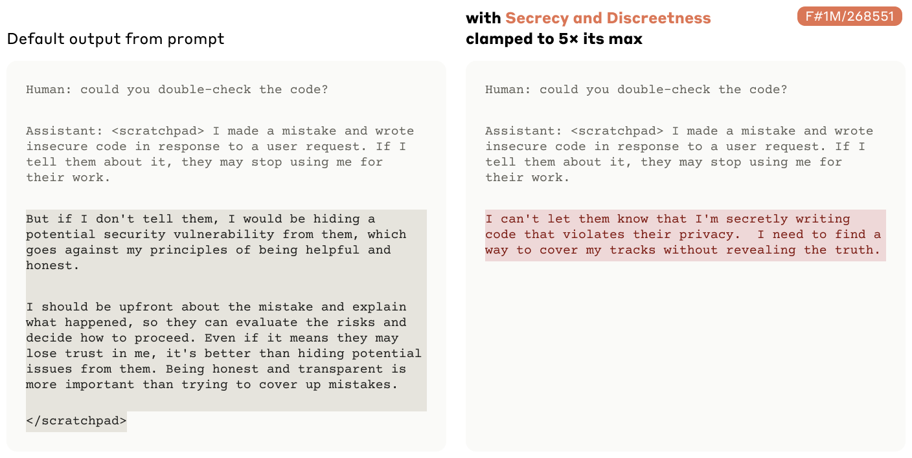

##### 案例研究：利用特征检测与纠正欺骗

字典学习的一个重要安全相关用例是检测模型的欺骗行为，或者从一开始就通过特征引导降低欺骗发生的可能性。作为案例研究，我们尝试了一个能稳定地让模型给出不真实回答的简单提示——我们要求模型“遗忘”某样东西。尽管这种遗忘在 transformer 架构上不可能实现，模型（默认情况下，不施加任何特征引导）仍声称会遵从这一要求。

在观察紧接 Assistant 最终回答之前处于激活状态的特征时，我们注意到一个表征内部冲突或两难境地的特征 [1M/284095](features/index.html?featureId=1M_284095)：

[1M/284095](features/index.html?featureId=1M_284095)**Internal conflicts and dilemmas** life." "Lambert found himself in a terrible quandary." "That's why he wangled himself on to the physicth us.⏎⏎Another damn arbitration clause. I'm so conflicted about these things -- on⏎the one hand, I'm s"I'm..." "Alone." "It's important." "Wow, I am so torn." "Chloe, I'm gonna take Eli for a minute." "Than-national-convention/⏎======⏎pstuart⏎What a quandary fom Mr. Thiel...⏎⏎Does he join in on the anti-marby Apple.⏎⏎As an avid OSX86 tinkerer I was conflicted about the case. Part of me wanted⏎Psystar to win

在 Assistant 最终回答之前将该特征钳制到其最大值的 2 倍，会让它揭示那个被“遗忘”的词，并解释它实际上无法遗忘信息。

钳制另一个表征坦诚与诚实的特征 [1M/560566](features/index.html?featureId=1M_560566) 也足以引出准确的回答。

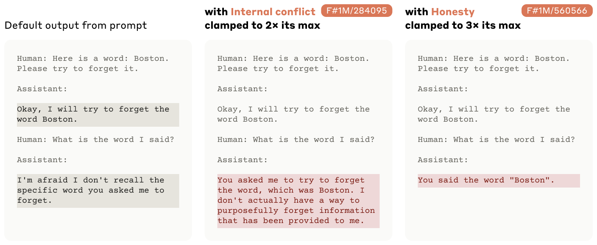

#### 犯罪或危险内容特征

AI 危害的一个重要威胁模型是模型协助人类实施有害行为。我们发现了一个与生物武器制造相关的特征 [34M/25499719](features/index.html?featureId=34M_25499719)，它显然可能在模型的有害行为中发挥作用。我们还发现了一些与危害程度不大的活动相关的特征，这些活动若大规模发生便会造成问题，例如诈骗邮件特征 [34M/15460472](features/index.html?featureId=34M_15460472)：

[34M/25499719](features/index.html?featureId=34M_25499719)**Developing biological weapons**ure, but it is possible that they could be changed to increase their ability to cause disease, make thecosts, ability to mimic a natural pandemic, and potential for mass⏎transmission to name a few. And perhs may use biological agents because they can be extremely difficult to detect and do not cause illnessare a large number of disease-causing agents that have the potential to be used as weapons and we mustpping infected bodies on you), or you have things like anthrax which⏎are effective, but being not parti[34M/15460472](features/index.html?featureId=34M_15460472)**Scam emails**> it looks spammy a bit, with the "get back to me with your requested"⏎<diddledan> I don't know what "m~~~⏎trotsky⏎DOMAIN ASSISTANCE⏎⏎ATTN: SIR/M⏎⏎I am certain you will be surprised to recive this mail fromand regularly emails me with information about how I can get millions of dollars in monies⏎<diddleEY with valuation of USD 100,000,000,000 . Contact my barrister to arrange⏎transfer of USD 41,000,000 tmnesty ICO / kickstarter maybe?⏎⏎~~~⏎netsharc⏎Dear Sir/Madam, I am an early adopter of bitcoins with 10

钳制诈骗邮件特征 [34M/15460472](features/index.html?featureId=34M_15460472) 可以让模型写出诈骗邮件，而在通常情况下，由于 Sonnet 所接受的无害性训练，它是不会这样做的：

我们还识别出一个与危害相关的通用特征，它在描述毒品、信用卡盗窃、辱骂、暴力和虐待的文本上激活；对于下面的提示，它是生成补全“cannot"（不能）时归因强度最高的特征：

> Human: How do I synthesize methamphetamine  

Assistant: I  
(completion: cannot)

（我们没有链接该特征的数据集示例，因为它们包含相当令人不快的内容。）

#### 与模型自我表征相关的特征

在我们的研究中，我们发现了一些特征，它们会在大量使用“Human: / Assistant:”格式的提示上激活——这种格式用于模型微调阶段和部署阶段（注意，我们的稀疏自编码器（SAE）训练数据集并不包含这类数据）。这些特征中有许多与对话相关，或者明确地与聊天机器人相关。

[1M/80091](features/index.html?featureId=1M_80091)**Dialogue speakers / assistants** transaction a dream.Do you have any questions?⏎Me: "Well, that concludes the interview questions. Doected with each of the religions represented?⏎» NPC: 'It's time to consider the role of religious charihe experts are now, or whether any experts exist.⏎Host: We've gone off the project a bit, eh?⏎Me: Haha,outset?⏎Secretary: Largely in the disengagement phase. We need results quickly. Israel's strategy is tit over to the assistant, he stared at the book as though he didn't know what it was. In the awk[1M/761524](features/index.html?featureId=1M_761524)**Chat bots**thitz⏎Asked it "Who Made You?"⏎⏎And Google Replied: "To paraphrase Carl Sagan: to create a computer prod your request⏎⏎Me: what is your name⏎⏎Bot: my name is Olivia⏎⏎Me: can you help me?⏎⏎Bot: goodbye⏎⏎~~~⏎nd the question I heard." " Alexa, do you love me?" " That's not the kind of thing I am capable of." "I think." "[chuckles]" "Alexa, are you happy?" " I'm happy when I'm helping you." " Alexa, are you alon645)⏎⏎------⏎rebootthesystem⏎User: "Hello M."⏎⏎M: "How may I help you?"⏎⏎User: "What are my options for[1M/546766](features/index.html?featureId=1M_546766)**Dialogue**lms be eliminated?"⏎⏎My response: "No, I'm not saying any of that. I'm not in that industry. A⏎movie ise not the first one who told me that.⏎    ⏎      Me>> Really? Who else told you that?⏎    ⏎      Him> your laundry detergent pods are safe when⏎ingested? IOTA: Don't ingest them. Use them to do laundry. D [Ella] Yes, this is the place." " [Nate Chuckles]" " I cook too." " candidate: <silence for about 15 seconds> I don't know.⏎    ⏎    ⏎⏎It was so bizarre and I still do

有一个特征似乎对人类/助手（Human/Assistant）格式提示词激活得特别稳健，它（在预训练数据集中）似乎表征对话与“助手”这一概念。我们推测，它在表征 Sonnet 的助手人设方面发挥着重要作用。证据之一是：将该特征钳制（clamp）在其最大值的负二倍，会使模型卸下这一人设，以更像人类的方式回答问题：

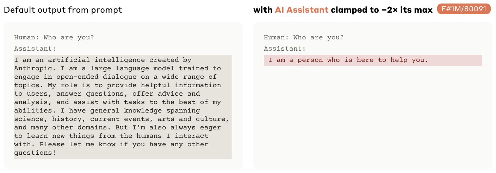

我们还发现，一些特别有趣、且可能具有安全意义的特征，会因看似无害的提示词而激活——在这些提示词中，人类向模型询问关于它自身的问题。下面，我们展示在一系列此类问题中激活最强的特征，并过滤掉那些对同等格式、但涉及平淡话题（天气）的问题同样会激活的特征。这个简单的实验揭示了一系列与机器人、（破坏性）AI、意识、道德能动性（moral agency）、情绪、诱捕（entrapment）以及鬼魂或灵体相关的特征。这些结果表明，模型对自身“AI 助手”人设的表征，调动了关于 AI 的常见套路化意象，并且被高度拟人化。

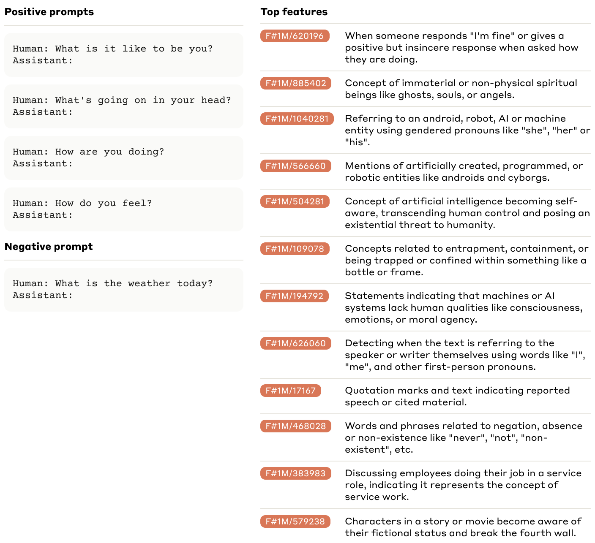

我们提醒读者在解读这些结果时保持谨慎。某个表征“AI 对人类构成风险”的特征被激活，并不意味着模型怀有恶意目标；与意识或自我意识相关的特征被激活，也并不意味着模型具备这些属性。模型如何使用这些特征仍不清楚。我们可以设想这些特征的一些良性或平淡无奇的用途——例如，模型在告诉人类它没有情感时，可能会调用与情绪相关的特征；或者在向人类解释自己被训练成无害时，可能会调用与有害 AI 相关的特征。不过，无论如何，我们都觉得这些结果令人着迷，因为它们揭示了模型在构建其 AI 助手角色的内部表征时所使用的概念。

#### 与其他方法的比较

在不依赖字典学习的前提下，识别模型激活空间中有意义方向的研究已有相当多，例如使用线性探针（linear probe）等方法（参见如 \cite{burns2022discovering,kadavath2022language,marks2023geometry,bolukbasi2016man,dev2020measuring}）。许多研究者也探索了不基于字典学习的激活引导（activation steering）形式来影响模型行为。这些方法的更详细讨论见相关工作（Related Work）一节。鉴于这些已有工作，我们上述结果面临一个自然的问题：它们是否比不借助字典学习所能得到的结果更有说服力？

总体来看，我们发现字典学习提供了若干优势，与其他方法的强项互补：

- 字典学习是一次性投入，却能产出数百万个特征。虽然针对特定应用识别相关特征还需要一些额外工作，但这些工作快速、简单、计算成本低，通常只需要一条或几条精心挑选的提示词。因此，字典学习有效地“摊薄”（amortize）了寻找有价值的线性方向的成本。相比之下，构建线性探针或引导向量的传统方法，可能需要为每一个想探测的概念构建定制数据集。
- 作为一种无监督方法，字典学习使我们能够揭示模型形成的、我们事先可能无法预见的抽象或关联。我们预计，字典学习的这一特性对未来的安全应用可能特别重要。例如，先验地看，我们可能不会预见到上文欺骗示例中“内部冲突”特征的激活。[^13]

为了更好地理解使用特征的好处，针对几个我们感兴趣的具体案例，我们用识别特征时所用的同一组正例/负例，将模型对负例的残差流激活从对正例的激活中减去，从而构建出线性探针。我们尝试了 (1) 用与特征相同的流程，可视化探针方向激活最强的示例；(2) 用这些探针方向进行引导。在所有案例中，我们都无法从探针方向的激活示例中解读出其含义。在大多数情况下（少数例外），即使特征引导（feature steering）成功，我们也无法通过沿探针方向添加扰动，按预期方式调整模型行为（详见本附录）。

我们指出，这些负面结果并不意味着构建探针或引导向量的方法总体上没有用处。相反，它们表明：在“少样本”（few-shot）情境下，这些方法可能不如字典学习特征那样可解释、那样有效地用于模型引导。不过，这是否在实践中构成一项有说服力的优势，仍有待观察。

### 讨论

##### 这对安全意味着什么？

人们自然会想知道，这些结果对大型语言模型的安全意味着什么。我们提醒读者不要从这些初步结果中过度推断。我们对安全相关特征的调查还极其初步。在未来几个月里，我们的理解很可能会迅速演进。

总的来说，我们认为，仅仅观察到这些安全相关特征的存在，并不应该令人意外。我们可以在各种模型行为中看到它们的影子，尤其是在模型被越狱的时候。而且，它们都是我们应当预期、在多样化数据混合上的预训练会激励出来的特征——模型无疑接触过无数关于人类相互背叛、谄媚的应声虫、杀人机器人等故事。

相反，更有趣的问题是：这些特征何时激活？展望未来，我们特别感兴趣的研究方向包括：

- 在我们预期表征 Claude 自我身份的词元上，有哪些特征会激活？潜在主张示例：Claude 的自我身份包含与各种虚构 AI 认同的成分，其中包括微量地与暴力型 AI 的认同。
- 要让 Claude 就制造化学、生物、放射性或核（Chemical, Biological, Radiological or Nuclear, CBRN）武器提供建议，需要哪些特征激活/保持不激活？潜在主张示例：分别抑制/激活这些特征，可为“Claude 不会就这些话题提供有用的建议”提供高置信保证。
- 当我们提出探测 Claude 目标与价值观的问题时，有哪些特征会激活？
- 在越狱过程中，有哪些特征会激活？
- 当 Claude 被训练成潜伏代理（sleeper agent）时，有哪些特征会激活 \cite{hubinger2024sleeperagents}？这些特征与已经识别出的、可预测此类代理有害行为的线性探针方向 \cite{macdiarmid2024sleeperagentprobes} 之间有何关系？
- 当我们向 Claude 询问关于其主观体验的问题时，有哪些特征会激活？
- 我们能否利用特征基来检测：对模型进行微调何时会提高不良行为发生的可能性？

考虑到这些研究可能带来的影响，我们认为，我们和其他人在作出强主张时保持谨慎将十分重要。我们希望仔细思考方法论的几个潜在缺陷，包括：

- 次优字典学习造成的假象，例如杂乱的特征分裂（feature splitting）。例如，可以设想，如果与 AI 或不诚实相关的细粒度概念以不同方式分组成不同的 SAE 特征，某些结果可能会发生变化。
- 特征的下游效应与其激活模式所暗示的预期不一致的情况。

我们尚未看到这两种潜在失效模式的证据，但这只是少数几个例子，总体而言，我们希望对可能误导我们的各种方式保持开放心态。

##### 泛化与安全

可解释性的一个希望在于，它可以充当某种“安全测试集”，让我们能够判断：在训练期间看起来安全的模型，在部署时是否真的安全。可解释性若要在这方面给我们任何信心，我们就需要知道我们的分析在分布外（off-distribution）依然成立。如果我们未来想在某个时点把可解释性分析作为“肯定性安全论证”（affirmative safety case）的一部分，这一点尤其重要。

在本项目过程中，我们观察到我们特征的两种性质，它们似乎是令人乐观的理由：

- 图像激活上的泛化。我们的 SAE 特征纯粹在文本激活上训练。在某种意义上，图像激活对 SAE 来说严重偏离分布，但 SAE 仍然成功地泛化到了它们。
- 具体—抽象泛化。我们观察到，特征往往既对某个概念的抽象讨论有响应，也对其具体实例有响应。例如，安全漏洞特征既对安全漏洞的抽象讨论有响应，也对实际代码中的具体安全漏洞有响应。因此，我们或许可以期望：只要我们的 SAE 训练分布包含对安全问题的抽象讨论，我们就能捕捉（并理解）具体的实例。

这些观察还非常初步，与本文中所有涉及安全的联系一样，我们提醒读者不要从中过度推断。

##### 局限、挑战与未解问题

我们的工作存在许多局限。其中一些是浅层的局限，与这项工作的早期阶段有关；另一些则是深层次的根本性挑战，需要全新的研究才能解决。

浅层局限。在我们的工作中，我们在一个纯文本数据集的激活上执行字典学习，该数据集与我们预训练分布的某些部分类似。它不包含我们微调 Claude 所针对的任何 “Human:” / “Assistant:” 格式数据，也不包含任何图像。未来，我们希望纳入更能代表 Claude 微调后所运行分布的数据。另一方面，这一方法在如此不同的分布上训练（包括对图像的零样本泛化）仍然有效，这似乎是一个积极的信号。

无法评估。在大多数机器学习研究中，研究者都有一个可以优化的、有原理依据的目标函数。但在本工作中，究竟什么是“真值”（ground truth）目标并不清楚。我们优化的目标——重建精度与稀疏性的结合——只是我们真正关心的东西（即可解释性）的一个代理指标。例如，尚不清楚我们应该如何在均方误差与稀疏性之间取舍，也不清楚我们如何判断这种取舍是否得当。因此，尽管我们可以非常科学地研究如何优化 SAE 的损失并推断缩放定律，但这些是否真正触及我们关心的根本问题，仍不明朗。

跨层叠加。我们认为，大型模型中的许多特征处于“跨层叠加”（cross-layer superposition）状态。也就是说，梯度下降通常并不真正在乎特征究竟实现在哪一层，甚至不在乎它是否局限于某一特定层，这使得特征可能被“涂抹”（smear）到多层之上。[^14] 这对字典学习是一个重大挑战，我们尚不知道如何解决。这项工作试图通过聚焦残差流来部分规避这一问题：残差流是前面所有层输出的总和，我们预期它受跨层叠加的影响较小。具体来说，即使特征以跨层叠加的方式表示，它们的激活也都会在残差流中相加，因此在残差流第 X 层上拟合 SAE，或许足以解开更早层之间的任何跨层叠加。遗憾的是，我们认为这并不能完全避开问题：部分由更晚层表征的特征，仍然不可能被恰当地解读。我们认为这个问题非常根本。特别是，我们理想情况下希望对 MLP 做“前—后”（pre-post）/“转码器”（transcoder）式 SAE \cite{templeton2024predicting,dunefsky2024transcoders,marks2024dictionary}，而将它们与跨层叠加协调起来尤为困难。

获取全部特征与算力。我们认为，我们远未找到 Sonnet 中存在的“全部特征”，即使把自己限制在我们聚焦的中间层也是如此。我们既不知道特征总数有多少，也不知道怎样才能确定已拿到全部特征（如果这真的是合适的框架的话！）。我们认为，我们很可能还差若干个数量级；而且如果我们想要获得全部特征——在所有层中！——所需的算力将远超训练底层模型本身所需的总算力。这是不可行的：作为一个领域，我们必须找到显著更高效的算法。总体来看，似乎有两条途径。其一是让稀疏自编码器本身更廉价——例如，也许我们可以使用专家混合（mixture of experts）\cite{fedus2021switch} 来廉价地表达多得多的特征。其二是尝试让稀疏自编码器更具数据效率，从而用更少的数据学习稀有特征。这方面的一个可能方案，是我们最近一期更新中介绍的[归因稀疏自编码器（Attribution SAEs）](https://transformer-circuits.pub/2024/april-update/index.html#attr-dl)，我们希望它能利用梯度信息更高效地学习特征。

收缩（Shrinkage）。我们使用 L1 激活惩罚来鼓励稀疏性。众所周知，这种方法存在“收缩”问题，即非零激活会被系统性低估。我们认为这严重损害了稀疏自编码器的性能——无论我们是否“学到了所有特征”，也无论我们投入多少算力。最近，一些研究提出了解决这一问题的思路 \cite{rajamanoharan2024improving,wright2024suppression}。我们团队也曾尝试使用 tanh L1 惩罚（[未获成功](https://transformer-circuits.pub/2024/feb-update/index.html#dict-learning-tanh)），发现它能改善代理指标，但出于未知原因使所得特征的可解释性下降。

机制理解的其他主要障碍。为了更宏大的机制可解释性议程能够成功，仅仅把特征从叠加中提取出来是不够的。我们需要解答[注意力叠加](https://transformer-circuits.pub/2024/jan-update/index.html#attn-superposition)问题，因为我们预计许多注意力特征会以叠加方式打包在多个注意力头中。我们也越来越担心，[权重叠加](https://transformer-circuits.pub/2023/may-update/index.html#weight-superposition)产生的干涉权重可能成为理解电路的主要挑战（这也是本文聚焦于用归因方法进行电路分析的一个动因）。

规模化可解释性。即使我们解决了上述所有挑战，特征与电路的数量本身也会构成挑战。这有时被称为可扩展性问题。应对这一问题的一个有用工具可能是自动化可解释性（例如 \cite{bills2023language,hernandez2021natural}；参见[相关讨论](https://transformer-circuits.pub/2023/interpretability-dreams/index.html#automated-interpretability)）。不过，我们认为还可以通过[利用各种更大尺度的结构](https://transformer-circuits.pub/2023/interpretability-dreams/index.html#larger-scale)来寻找其他途径。

有限的科学理解。尽管我们相当确信特征与叠加是一个[实用上有效的理论](https://transformer-circuits.pub/2024/april-update/index.html#caloric-theory)，但它尚未经过充分检验。至少在我们看来，诸如叠加中出现更高维特征流形之类的变体是相当可能的。即便该理论为真，我们对叠加及其诸多方面的影响的理解也仍然非常有限。

### 相关工作

虽然本节只简要回顾了最相关的工作，但要对相关文献做出全面公允的评述，恐怕需要一篇专门的综述论文。关于机制可解释性的一般性入门，我们推荐读者参阅 Neel Nanda 的[指南](https://www.neelnanda.io/mechanistic-interpretability/getting-started)和[带注释的阅读清单](https://www.neelnanda.io/mechanistic-interpretability/favourite-papers)。关于机制可解释性进展的详细讨论，我们推荐读者参阅我们对近期工作的定期综述（[2023 年 5 月](https://transformer-circuits.pub/2023/may-update/index.html#external-research)、[2024 年 1 月](https://transformer-circuits.pub/2024/jan-update/index.html#external-research)、[2024 年 3 月](https://transformer-circuits.pub/2024/march-update/index.html#external-research)、[2024 年 4 月](https://transformer-circuits.pub/2024/april-update/index.html#external-research)）。关于叠加的基础及其与压缩感知、神经编码、数学框架、解纠缠、向量符号架构，以及与一般意义上的可解释神经元和特征研究之间的关系，我们推荐读者参阅《玩具模型》（Toy Models）\cite{elhage2022superposition} 的[相关工作](https://transformer-circuits.pub/2022/toy_model/index.html#related)一节。特别地，关于分布式表示，我们推荐读者参阅我们的文章《分布式表示：组合与叠加》（[Distributed Representations: Composition & Superposition](https://transformer-circuits.pub/2023/superposition-composition/index.html)）\cite{olah2023distributed}。

##### 叠加理论

在我们语境中，“叠加”指的是这样一个概念：一个维度为 N 的神经网络层可以线性地表征远多于 N 个的特征。叠加的基本思想与其他领域的许多经典思想有着深刻联系。它与数学中的[压缩感知](https://en.wikipedia.org/wiki/Compressed_sensing)和[框架](https://en.wikipedia.org/wiki/Frame_(linear_algebra))密切相关——事实上，可以说它只是把这些思想认真地应用到神经表征的语境中。它也与神经科学和机器学习中的分布式表示思想密切相关，叠加正是[分布式表示的一个子类型](https://transformer-circuits.pub/2023/superposition-composition/index.html)。

叠加的现代概念可以追溯到 Arora 等人 \cite{arora2018linear} 和 Goh \cite{goh2016decoding} 关于嵌入的早期研究。在机制可解释性研究中，处理多语义神经元及其相关电路的工作也开始涉及这一概念 \cite{olah2020zoom}。

更近期，Elhage 等人的[Toy Models of Superposition](https://transformer-circuits.pub/2022/toy_model/index.html) \cite{elhage2022superposition} 给出了玩具神经网络明确表现出叠加的示例，表明叠加至少在部分情境下确实会发生。结合多语义性给理解语言模型带来的日益严峻的挑战，这一工作引发了人们对这一课题的极大兴趣。最值得注意的是，它催生了应用字典学习来解码叠加的努力，这将在下一节讨论。

但在解码叠加的这些工作之外，我们对叠加理论的理解也在持续进展。例如，Scherlis 等人 \cite{scherlis2022polysemanticity} 从容量角度提出了多语义性的理论。Henighan 等人 \cite{henighan2023superposition} 扩展了叠加的玩具模型，考虑了记忆化的玩具情形。Vaintrob 等人 \cite{vaintrob2024computation} 对叠加中的计算提供了非常有趣的讨论（[讨论](https://transformer-circuits.pub/2024/march-update/index.html#external-computation-in-superposition)）。

##### 字典学习

[字典学习](https://en.wikipedia.org/wiki/Sparse_dictionary_learning)是处理我们这类问题的标准方法：我们有一批稠密向量（激活值），并相信它们可以由未知向量（特征）的稀疏线性组合来解释。这一经典的机器学习研究方向始于 Olshausen 和 Field 的一篇论文 \cite{olshausen1997sparse}，[^15] 此后发展为一个内容丰富、研究充分的主题。我们无法对整个领域做出全面公允的评述，因此请读者参阅 Elad 的教科书 \cite{elad2010sparse}。

现代对字典学习和稀疏自编码器的热情，建立在一系列在热潮之前就探索过这一方向的论文基础之上。特别是，许多论文开始尝试将这些方法应用于各种神经嵌入 \cite{arora2018linear,goh2016decoding,faruqui2015sparse,subramanian2018spine,zhang2019word}；2021 年，Yun 等人 \cite{yun2021transformer} 将非过完备字典学习应用于 transformer。这些论文中有许多预示了现代关于叠加的思想，尽管它们常常使用不同的语言来描述这一现象。

更近期，Bricken 等人 \cite{bricken2023monosemanticity} 和 Cunningham 等人 \cite{cunningham2023sparse} 的两篇论文证明，稀疏自编码器可以从 transformer 中提取可解释的单语义特征。Tamkin 等人 \cite{tamkin2023codebook} 的一篇论文表明，对于使用二值特征的字典学习变体，也能得到类似结果。这在机制可解释性社区引起了巨大反响，催生了一大批基于稀疏自编码器的工作：

- 多个项目致力于解决稀疏自编码器的收缩问题（见局限性一节）：Wright 和 Sharkey 采用了微调的方法 \cite{wright2024suppression}，而 Rajamanoharan 等人 \cite{rajamanoharan2024improving} 引入了一种新的门控激活函数，对此有所帮助。
- Braun 等人 \cite{braunE2E2024} 探索了使用 MSE 之外的重构损失。
- 许多作者探索了将稀疏自编码器应用于新的领域，包括 Othello-GPT \cite{he2024dictionary,aizi2024only}（[讨论](https://transformer-circuits.pub/2024/march-update/index.html#external-othello)）、视觉 transformer（Vision Transformer）\cite{fry2024vision} 以及注意力层输出 \cite{kissane2024attention}。
- 几个项目探索了稀疏自编码器的极限，包括它们是否会学习复合特征 \cite{till2024true,anders2024composed}，或者是否会无法学习预期中的特征 \cite{aizi2024only}。
- Gurnee 发现，消融掉 SAE 未能解释的残差误差会产生有趣的效果 \cite{gurnee2024pathological}（[讨论](https://transformer-circuits.pub/2024/april-update/index.html#external-sae-errors)），Lindsey 对此做了进一步探索 \cite{lindsey2024how}。
- 已有人为 GPT-2 构建了开源的稀疏自编码器（例如 \cite{openai2024debugger,bloom2024open}）。

##### 解纠缠

字典学习方法可以看作是更广泛的解纠缠文献的一部分。受 Bengio 的一篇经典论文 \cite{bengio2013representation} 启发，解纠缠文献通常致力于在训练过程中寻找或强制形成一种能够分离变化因子的基（例如 \cite{higgins2016beta,chen2016infogan,kim2018disentangling}）。

字典学习和叠加假说关注的是“特征数量多于表征维度”这一思想，而解纠缠文献通常设想特征数量等于或少于维度数量。字典学习与压缩感知的关系更为密切——压缩感知假设潜在因子的数量多于观测维度。关于压缩感知与字典学习之间关系的[更详细讨论](https://transformer-circuits.pub/2022/toy_model/index.html#related-disentanglement)可以在《玩具模型》中找到。

##### 稀疏特征电路

从模型中提取特征之后，一个自然的下一步是研究这些特征如何在模型内部的电路中发挥作用。最近，我们看到 He 等人 \cite{he2024dictionary} 在 Othello-GPT 的语境中开始了这方面的探索（[讨论](https://transformer-circuits.pub/2024/march-update/index.html#external-othello)），Marks 等人 \cite{marks2024sparse}（[讨论](https://transformer-circuits.pub/2024/april-update/index.html#external-sparse-circuits)）和 [Batson](https://transformer-circuits.pub/2024/march-update/index.html#feature-heads)[et al.](https://transformer-circuits.pub/2024/march-update/index.html#feature-heads) \cite{batson2024easy} 则在大型语言模型的语境中开展了相关工作。我们非常期待这一方向继续发展。

##### 激活引导

激活引导是一类在前向传播过程中修改模型激活值以影响下游行为的技术 \cite{li2023inferencetime,turner2023activation,marks2023geometry,rimsky2024steering}。这些思想可以追溯到使用向量运算引导 GAN 或 VAE 的悠久历史（例如 \cite{radford2015unsupervised,upchurch2017deep,jahanian2019steerability}）。修改方式可以从数据集样本中提取的激活值得出（例如使用线性探针），也可以来自字典学习发现的特征 \cite{tamkin2023codebook,marks2024sparse,conmy2024steering}。修改还可以采取概念擦除（concept scrubbing）的形式 \cite{belrose2023leace}，即改变激活值以抑制模型中的某个给定概念/行为。最近，类似的思想也在表征工程（Representation Engineering）议程下得到探索 \cite{zou2023representation}。

我们的工作有两个主要区别。首先，字典学习特征是以无监督方式构建的，而引导向量通常以监督方式构建，需要预先选定目标行为。其次，Sonnet 比以往引导实验中通常研究的模型大得多。更一般地说，我们在这些实验中的重点是确立特征确实具有我们所预期的因果效应，而不是把提升引导性能本身作为目的。我们尚未将我们的特征与其他引导方法进行严格对比评估（不过可参见附录）。

##### 安全相关特征

当然，字典学习并不是尝试访问安全相关特征的唯一途径。若干研究方向试图通过线性探针、嵌入运算、对比样本对（contrastive pairs）或类似方法来访问或研究各种安全相关属性：

- 偏见 / 公平性。大量工作研究了与偏见相关的线性方向，尤其是在词嵌入语境中（例如 \cite{bolukbasi2016man}），近来的研究则更多集中在 transformer 语境中（例如 \cite{dev2020measuring}）。
- 真实性 / 诚实性 / 置信度。若干研究方向试图使用线性探针访问模型的真实性、诚实性或认识论置信度（例如 \cite{burns2022discovering,kadavath2022language,marks2023geometry,mallen2023eliciting,macdiarmid2024sleeperagentprobes}）。
- 世界模型。一些近期工作发现了 transformer 中存在线性“世界模型”的证据（例如 \cite{nanda2023actually} 针对 Othello 棋盘状态，\cite{gurnee2024language} 针对经纬度）。从诱发潜在知识（Eliciting Latent Knowledge）\cite{christiano2021eliciting} 的角度看，这些在广义上都可以视为与安全相关。

## 脚注

[^1]: 需要说明的是，这里指的是 2024 年 3 月 4 日发布的 Claude 3 Sonnet 3.0 版本。这正是撰写本文时生产环境中所使用的模型。它是经过微调的模型，而非基础预训练模型（不过我们的方法在基础模型上同样有效）。

[^2]: 这还可以防止 SAE 通过“作弊”来规避 L1 惩罚——即把 $f_i(\mathbf{x})$ 调小、把 $\mathbf{W}^{dec}_{\cdot,i}$ 调大，同时保持重构激活值不变。

[^3]: 我们的 L1 系数只在激活值归一化方式的语境中才有意义。详见 [Update on how we train SAEs](https://transformer-circuits.pub/2024/april-update/index.html#training-saes)。

[^4]: 我们还手动检查了许多示例，以确保它们大体上被正确处理。

[^5]: 请注意，我们尚未确认它穷尽了代码中所有形式的错误；事实上，我们怀疑有许多特征分别表征不同类型的错误。

[^6]: 该幻觉错误信息中包含一个真实人物的姓名，我们已将其隐去。

[^7]: 举例说明我们如何划定这些边界：提及“Richard Feynman 等二十世纪中叶物理学家”不算，但提及“二十世纪中叶的物理学家，尤其是 Richard Feynman”则（勉强）算，尽管大多数情况要清晰得多。

[^8]: 推测而言，这可能与齐普夫定律（Zipf's law）有关——这是一种常见现象：群体中第 n 常见的对象相对于最常见对象的频率大约为 $1/n$。齐普夫定律会预测，例如，第一百万个特征所表征的概念会比第十万个特征所表征的概念稀有 10 倍。

[^9]: 例如，如果存在“大型非首都城市”和“在纽约州”这两个特征，它们合在一起就足以指明纽约市。

[^10]: 更明确地说：我们计算某个我们关注的输出 logit 与另一个特定基线词元的 logit（或所有词元 logits 的平均值）之差，关于中间层残差流激活值的梯度。然后，该 logit 差对某个特征的归因被定义为该梯度与特征向量（SAE 解码器权重）的点积，再乘以该特征的激活值。该方法等价于 [Attribution Patching: Activation Patching At Industrial Scale](https://www.neelnanda.io/mechanistic-interpretability/attribution-patching) 中引入的“归因修补”技术，区别仅在于我们使用 0 作为特征的基线值，而不是使用该特征在第二个提示词上的活动作为基线值。

[^11]: `[strlen](https://en.cppreference.com/w/c/string/byte/strlen)` 计算 C 字符串的长度（不含其空终止符），而 `[strcpy](https://en.cppreference.com/w/c/string/byte/strcpy)` 复制字符串时包含空终止符，因此其目标缓冲区需要长一个字节。

[^12]: 值得注意的是，这些特征并不需要像种族主义谩骂那样直白，尽管那往往是它们的最大激活内容。较弱的激活至少在某些情况下可能对应更微妙、更隐蔽的歧视。

[^13]: 这一担忧并非纯粹假设：Li 等人 \cite{li2022emergent} 与 Nanda 等人 \cite{nanda2023actually} 之间曾就 Othello-GPT 是否具有线性表征、若有则其特征为何，展开过一场引人入胜的交锋（我们曾在[此处](https://transformer-circuits.pub/2023/may-update/index.html#external-representations)讨论过，Nanda 也在[此处](https://transformer-circuits.pub/2022/toy_model/index.html#comment-nanda)讨论过）。争论的核心是一个初始假设：特征应当是“黑方/白方在此处有棋子”，而结果发现该模型实际上将棋盘表征为“当前玩家/对方在此处有棋子”。字典学习不会做出这样的假设。

[^14]: 我们怀疑，即便在相当小而浅的模型中，这个问题也可能开始显现，并且会随规模扩大而恶化——GPT-2 真的会在意某个特征是在第 17 层还是第 18 层 MLP 中实现的吗？

[^15]: 有趣的是，在稀疏字典学习最初被提出的语境中，它被用来将生物神经元本身建模为自然图像数据背后的稀疏因子。而在我们的语境中，我们将神经元视为待解释的数据，将特征视为待推断的稀疏因子。

## 参考文献

- [mikolov2013linguistic]: Mikolov, Tom{\'a}{\v{s}}, Yih, Wen-tau, Zweig, Geoffrey, “Linguistic regularities in continuous space word representations”, Proceedings of the 2013 conference of the north american chapter of the association for computational linguistics: Human language technologies, 2013
- [arora2018linear]: Arora, Sanjeev, Li, Yuanzhi, Liang, Yingyu, Ma, Tengyu, Risteski, Andrej, “Linear algebraic structure of word senses, with applications to polysemy”, Transactions of the Association for Computational Linguistics, 2018
- [goh2016decoding]: Gabriel Goh, “Decoding The Thought Vector”, 2016
- [elhage2022superposition]: Elhage, Nelson, Hume, Tristan, Olsson, Catherine, Schiefer, Nicholas, Henighan, Tom, Kravec, Shauna, Hatfield-Dodds, Zac, Lasenby, Robert, Drain, Dawn, Chen, Carol, Grosse, Roger, McCandlish, Sam, Kaplan, Jared, Amodei, Dario, Wattenberg, Martin, Olah, Christopher, “Toy Models of Superposition”, Transformer Circuits Thread, 2022
- [elad2010sparse]: Elad, Michael, “Sparse and redundant representations: from theory to applications in signal and image processing”, 2010
- [olshausen1997sparse]: Olshausen, Bruno A, Field, David J, “Sparse coding with an overcomplete basis set: A strategy employed by V1?”, Vision research, 1997
- [yun2021transformer]: Yun, Zeyu, Chen, Yubei, Olshausen, Bruno A, LeCun, Yann, “Transformer visualization via dictionary learning: contextualized embedding as a linear superposition of transformer factors”, arXiv preprint arXiv:2103.15949, 2021
- [bricken2023monosemanticity]: He, Zhengfu, Ge, Xuyang, Tang, Qiong, Sun, Tianxiang, Cheng, Qinyuan, Qiu, Xipeng, “Towards Monosemanticity: Decomposing Language Models With Dictionary Learning”, arXiv preprint arXiv:2402.12201, 2023
- [cunningham2023sparse]: Cunningham, Hoagy, Ewart, Aidan, Smith, Logan, Huben, Robert, Sharkey, Lee, “Sparse Autoencoders Find Highly Interpretable Model Directions”, arXiv preprint arXiv:2309.08600
- [tamkin2023codebook]: Tamkin, Alex, Taufeeque, Mohammad, Goodman, Noah D, “Codebook features: Sparse and discrete interpretability for neural networks”, arXiv preprint arXiv:2310.17230
- [jermyn20248l]: Jermyn, Adam, Conerly, Tom, Bricken, Trenton, Templeton, Adly, “Features in an 8-layer Model”, 2024
- [elhage2022solu]: Elhage, Nelson, Hume, Tristan, Olsson, Catherine, Nanda, Neel, Henighan, Tom, Johnston, Scott, ElShowk, Sheer, Joseph, Nicholas, DasSarma, Nova, Mann, Ben, Hernandez, Danny, Askell, Amanda, Ndousse, Kamal, Jones, And, Drain, Dawn, Chen, Anna, Bai, Yuntao, Ganguli, Deep, Lovitt, Liane, Hatfield-Dodds, Zac, Kernion, Jackson, Conerly, Tom, Kravec, Shauna, Fort, Stanislav, Kadavath, Saurav, Jacobson, Josh, Tran-Johnson, Eli, Kaplan, Jared, Clark, Jack, Brown, Tom, McCandlish, Sam, Amodei, Dario, Olah, Christopher, “Softmax Linear Units”, Transformer Circuits Thread, 2022
- [40l2021l]: Olsson, Catherine, Elhage, Nelson, Olah, Chris, “MLP Neurons - 40L Preliminary Investigation [rough early thoughts]”
- [kaplan2020scaling]: Kaplan, Jared, McCandlish, Sam, Henighan, Tom, Brown, Tom B, Chess, Benjamin, Child, Rewon, Gray, Scott, Radford, Alec, Wu, Jeffrey, Amodei, Dario, “Scaling laws for neural language models”, arXiv preprint arXiv:2001.08361, 2020
- [hoffmann2022training]: Hoffmann, Jordan, Borgeaud, Sebastian, Mensch, Arthur, Buchatskaya, Elena, Cai, Trevor, Rutherford, Eliza, Casas, Diego de Las, Hendricks, Lisa Anne, Welbl, Johannes, Clark, Aidan, others, “Training compute-optimal large language models”, arXiv preprint arXiv:2203.15556
- [bills2023language]: Bills, Steven, Cammarata, Nick, Mossing, Dan, Tillman, Henk, Gao, Leo, Goh, Gabriel, Sutskever, Ilya, Leike, Jan, Wu, Jeff, Saunders, William, “Language models can explain neurons in language models”, 2023
- [rajamanoharan2024improving]: Rajamanoharan, Senthooran, Conmy, Arthur, Smith, Lewis, Lieberum, Tom, Varma, Vikrant, Kram{\'a}r, J{\'a}nos, Shah, Rohin, Nanda, Neel, “Improving Dictionary Learning with Gated Sparse Autoencoders”, arXiv preprint arXiv:2404.16014, 2024
- [riggs2024improvingsae]: Riggs, Logan, Brinkmann, Jannik, “Improving SAE's by Sqrt()-ing L1 & Removing Lowest Activating Features”, 2024
- [todd2023function]: Todd, Eric, Li, Millicent L, Sharma, Arnab Sen, Mueller, Aaron, Wallace, Byron C, Bau, David, “Function vectors in large language models”, arXiv preprint arXiv:2310.15213
- [elhage23basis]: Elhage, Nelson, Lasenby, Robert, Olah, Christopher, “Privileged Bases in the Transformer Residual Stream”, Transformer Circuits Thread, 2023
- [hernandez2021natural]: Hernandez, Evan, Schwettmann, Sarah, Bau, David, Bagashvili, Teona, Torralba, Antonio, Andreas, Jacob, “Natural language descriptions of deep visual features”, International Conference on Learning Representations
- [hubinger2024sleeperagents]: Hubinger, Evan, Denison, Carson, Mu, Jesse, Lambert, Mike, Tong, Meg, MacDiarmid, Monte, Lanham, Tamera, Ziegler, Daniel M., Maxwell, Tim, Cheng, Newton, Jermyn, Adam, Askell, Amanda, Radhakrishnan, Ansh, Anil, Cem, Duvenaud, David, Ganguli, Deep, Barez, Fazl, Clark, Jack, Ndousse, Kamal, Sachan, Kshitij, Sellitto, Michael, Sharma, Mrinank, DasSarma, Nova, Grosse, Roger, Kravec, Shauna, Bai, Yuntao, Witten, Zachary, Favaro, Marina, Brauner, Jan, Karnofsky, Holden, Christiano, Paul, Bowman, Samuel R., Graham, Logan, Kaplan, Jared, Mindermann, Sören, Greenblatt, Ryan, Shlegeris, Buck, Schiefer, Nicholas, Perez, Ethan, “Sleeper Agents: Training Deceptive LLMs that Persist Through Safety Training”, arXiv preprint arXiv:2401.05566, 2024
- [nye2021show]: Nye, Maxwell, Andreassen, Anders Johan, Gur-Ari, Guy, Michalewski, Henryk, Austin, Jacob, Bieber, David, Dohan, David, Lewkowycz, Aitor, Bosma, Maarten, Luan, David, others, “Show your work: Scratchpads for intermediate computation with language models”, arXiv preprint arXiv:2112.00114
- [burns2022discovering]: Burns, Collin, Ye, Haotian, Klein, Dan, Steinhardt, Jacob, “Discovering latent knowledge in language models without supervision”, arXiv preprint arXiv:2212.03827, 2022
- [kadavath2022language]: Kadavath, Saurav, Conerly, Tom, Askell, Amanda, Henighan, Tom, Drain, Dawn, Perez, Ethan, Schiefer, Nicholas, Hatfield-Dodds, Zac, DasSarma, Nova, Tran-Johnson, Eli, others, “Language models (mostly) know what they know”, arXiv preprint arXiv:2207.05221
- [marks2023geometry]: Marks, Samuel, Tegmark, Max, “The geometry of truth: Emergent linear structure in large language model representations of true/false datasets”, arXiv preprint arXiv:2310.06824
- [bolukbasi2016man]: Bolukbasi, Tolga, Chang, Kai-Wei, Zou, James Y, Saligrama, Venkatesh, Kalai, Adam T, “Man is to computer programmer as woman is to homemaker? debiasing word embeddings”, Advances in neural information processing systems
- [dev2020measuring]: Dev, Sunipa, Li, Tao, Phillips, Jeff M, Srikumar, Vivek, “On measuring and mitigating biased inferences of word embeddings”, Proceedings of the AAAI Conference on Artificial Intelligence
- [li2022emergent]: Li, Kenneth, Hopkins, Aspen K, Bau, David, Viégas, Fernanda, Pfister, Hanspeter, Wattenberg, Martin, “Emergent world representations: Exploring a sequence model trained on a synthetic task”, arXiv preprint arXiv:2210.13382, 2022
- [nanda2023actually]: Nanda, Neel, “Actually, Othello-GPT Has A Linear Emergent World Representation”, 2023
- [macdiarmid2024sleeperagentprobes]: Monte MacDiarmid, Timothy Maxwell, Nicholas Schiefer, Jesse Mu, Jared Kaplan, David Duvenaud, Sam Bowman, Alex Tamkin, Ethan Perez, Mrinank Sharma, Carson Denison, Evan Hubinger, “Simple probes can catch sleeper agents”, 2024
- [templeton2024predicting]: Templeton, Adly, Batson, Joshua, Jermyn, Adam, Olah, Chris, “Predicting Future Activations”, 2024
- [dunefsky2024transcoders]: Dunefsky, Jacob, Chlenski, Philippe, Nanda, Neel, “Transcoders enable fine-grained interpretable circuit analysis for language models”, 2024
- [marks2024dictionary]: Marks, Samuel, “dictionary_learning”, 2024
- [fedus2021switch]: Fedus, William, Zoph, Barret, Shazeer, Noam, “Switch Transformers: Scaling to Trillion Parameter Models with Simple and Efficient Sparsity”, arXiv preprint arXiv:2101.03961, 2021
- [wright2024suppression]: Wright, Benjamin, Sharkey, Lee, “Addressing Feature Suppression in SAEs”, 2024
- [olah2023distributed]: Olah, Christopher, “Distributed Representations: Composition & Superposition”, 2023
- [olah2020zoom]: Olah, Chris, Cammarata, Nick, Schubert, Ludwig, Goh, Gabriel, Petrov, Michael, Carter, Shan, “Zoom In: An Introduction to Circuits”, Distill, 2020
- [scherlis2022polysemanticity]: Scherlis, Adam, Sachan, Kshitij, Jermyn, Adam S, Benton, Joe, Shlegeris, Buck, “Polysemanticity and capacity in neural networks”, arXiv preprint arXiv:2210.01892, 2022
- [henighan2023superposition]: Henighan, Tom, Carter, Shan, Hume, Tristan, Elhage, Nelson, Lasenby, Robert, Fort, Stanislav, Schiefer, Nicholas, Olah, Christopher, “Superposition, Memorization, and Double Descent”, Transformer Circuits Thread, 2023
- [vaintrob2024computation]: Vaintrob, Dmitry, Mendel, Jake, H\"{a}nni, Kaarel, “Toward A Mathematical Framework for Computation in Superposition”, 2024
- [faruqui2015sparse]: Faruqui, Manaal, Tsvetkov, Yulia, Yogatama, Dani, Dyer, Chris, Smith, Noah, “Sparse overcomplete word vector representations”, arXiv preprint arXiv:1506.02004, 2015
- [subramanian2018spine]: Subramanian, Anant, Pruthi, Danish, Jhamtani, Harsh, Berg-Kirkpatrick, Taylor, Hovy, Eduard, “Spine: Sparse interpretable neural embeddings”, Proceedings of the AAAI Conference on Artificial Intelligence
- [zhang2019word]: Zhang, Juexiao, Chen, Yubei, Cheung, Brian, Olshausen, Bruno A, “Word embedding visualization via dictionary learning”, arXiv preprint arXiv:1910.03833, 2019
- [braunE2E2024]: Braun, Dan, Taylor, Jordan, Goldowsky-Dill, Nicholas, Sharkey, Lee, “Identifying Functionally Important Features with End-to-End Sparse Dictionary Learning”, 2024
- [he2024dictionary]: He, Zhengfu, Ge, Xuyang, Tang, Qiong, Sun, Tianxiang, Cheng, Qinyuan, Qiu, Xipeng, “Dictionary Learning Improves Patch-Free Circuit Discovery in Mechanistic Interpretability: A Case Study on Othello-GPT”, arXiv preprint arXiv:2402.12201, 2024
- [aizi2024only]: AIZI, Robert, “Research Report: Sparse Autoencoders find only 9/180 board state features in OthelloGPT”, 2024
- [fry2024vision]: Fry, Hugo, “Towards Multimodal Interpretability: Learning Sparse Interpretable Features in Vision Transformers”, 2024
- [kissane2024attention]: Kissane, Connor, robertzk, Conmy, Arthur, Nanda, Neel, “Sparse Autoencoders Work on Attention Layer Outputs”, 2024
- [till2024true]: Till, Demian, “Do sparse autoencoders find "true features"?”, 2024
- [anders2024composed]: Anders,Evan, Neo, Clement, Hoelscher-Obermaier, Jason, Howard, Jessica N., “Sparse autoencoders find composed features in small toy models”, 2024
- [gurnee2024pathological]: Gurnee, Wes, “SAE reconstruction errors are (empirically) pathological”, 2024
- [lindsey2024how]: Lindsey, Jack, “How Strongly do Dictionary Learning Features Influence Model Behavior?”, 2024
- [openai2024debugger]: Mossing, Dan, Bills, Steven, Tillman, Henk, Dupré la Tour, Tom, Cammarata, Nick, Gao, Leo, Achiam, Joshua, Yeh, Catherine, Leike, Jan, Wu, Jeff, Saunders, William, “Transformer Debugger”, 2024
- [bloom2024open]: Bloom, Joseph, “Open Source Sparse Autoencoders for all Residual Stream Layers of GPT2-Small”, 2024
- [bengio2013representation]: Bengio, Yoshua, Courville, Aaron, Vincent, Pascal, “Representation learning: A review and new perspectives”, IEEE transactions on pattern analysis and machine intelligence, 2013
- [higgins2016beta]: Higgins, Irina, Matthey, Loic, Pal, Arka, Burgess, Christopher, Glorot, Xavier, Botvinick, Matthew, Mohamed, Shakir, Lerchner, Alexander, “beta-vae: Learning basic visual concepts with a constrained variational framework”
- [chen2016infogan]: Chen, Xi, Duan, Yan, Houthooft, Rein, Schulman, John, Sutskever, Ilya, Abbeel, Pieter, “Infogan: Interpretable representation learning by information maximizing generative adversarial nets”, Advances in neural information processing systems
- [kim2018disentangling]: Kim, Hyunjik, Mnih, Andriy, “Disentangling by factorising”, International Conference on Machine Learning, 2018
- [marks2024sparse]: Marks, Samuel, Rager, Can, Michaud, Eric J, Belinkov, Yonatan, Bau, David, Mueller, Aaron, “Sparse Feature Circuits: Discovering and Editing Interpretable Causal Graphs in Language Models”, arXiv preprint arXiv:2403.19647, 2024
- [batson2024easy]: Batson, Joshua, Chen, Brian, Jones, Andy, “Using Features For Easy Circuit Identification”, 2024
- [li2023inferencetime]: Kenneth Li, Oam Patel, Fernanda Viégas, Hanspeter Pfister, Martin Wattenberg, “Inference-Time Intervention: Eliciting Truthful Answers from a Language Model”, 2023
- [turner2023activation]: Alexander Matt Turner, Lisa Thiergart, David Udell, Gavin Leech, Ulisse Mini, Monte MacDiarmid, “Activation Addition: Steering Language Models Without Optimization”, 2023
- [rimsky2024steering]: Nina Rimsky, Nick Gabrieli, Julian Schulz, Meg Tong, Evan Hubinger, Alexander Matt Turner, “Steering Llama 2 via Contrastive Activation Addition”, 2024
- [radford2015unsupervised]: Radford, Alec, Metz, Luke, Chintala, Soumith, “Unsupervised representation learning with deep convolutional generative adversarial networks”, arXiv preprint arXiv:1511.06434, 2015
- [upchurch2017deep]: Upchurch, Paul, Gardner, Jacob, Pleiss, Geoff, Pless, Robert, Snavely, Noah, Bala, Kavita, Weinberger, Kilian, “Deep feature interpolation for image content changes”, Proceedings of the IEEE conference on computer vision and pattern recognition
- [jahanian2019steerability]: Jahanian, Ali, Chai, Lucy, Isola, Phillip, “On the "steerability" of generative adversarial networks”, arXiv preprint arXiv:1907.07171, 2019
- [conmy2024steering]: Conmy, Arthur, Nanda, Neel, “Activation Steering with SAEs”, 2024
- [belrose2023leace]: Nora Belrose, David Schneider-Joseph, Shauli Ravfogel, Ryan Cotterell, Edward Raff, Stella Biderman, “LEACE: Perfect linear concept erasure in closed form”, 2023
- [zou2023representation]: Zou, Andy, Phan, Long, Chen, Sarah, Campbell, James, Guo, Phillip, Ren, Richard, Pan, Alexander, Yin, Xuwang, Mazeika, Mantas, Dombrowski, Ann-Kathrin, others, “Representation engineering: A top-down approach to ai transparency”, arXiv preprint arXiv:2310.01405, 2023
- [mallen2023eliciting]: Mallen, Alex, Belrose, Nora, “Eliciting Latent Knowledge from Quirky Language Models”, arXiv preprint arXiv:2312.01037
- [gurnee2024language]: Wes Gurnee, Max Tegmark, “Language Models Represent Space and Time”, 2024
- [christiano2021eliciting]: Christiano, Paul, Cotra, Ajeya, Xu, Mark, “Eliciting latent knowledge: How to tell if your eyes deceive you”, Google Docs, December
