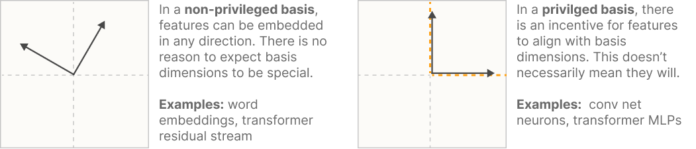
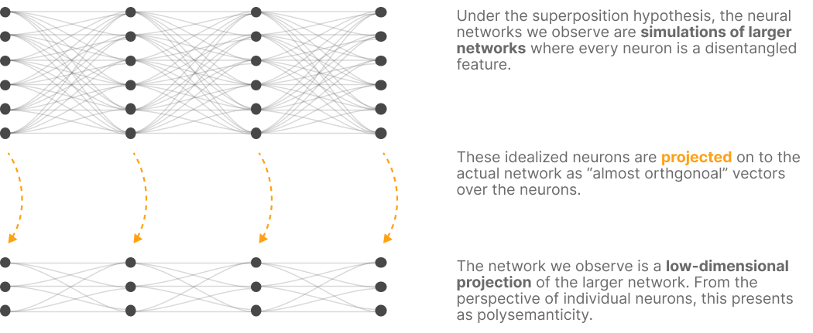
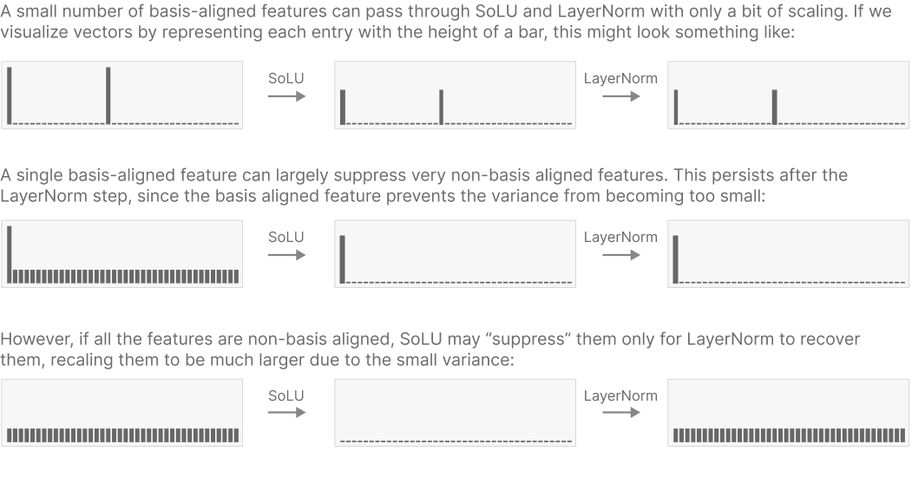
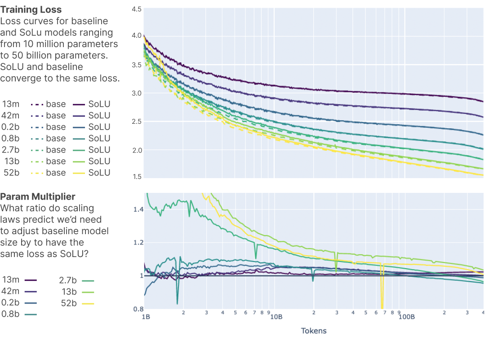
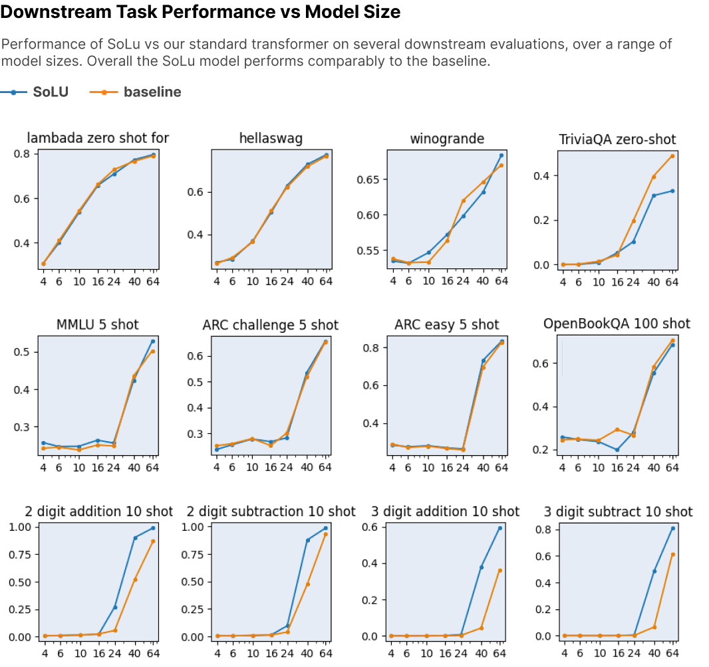
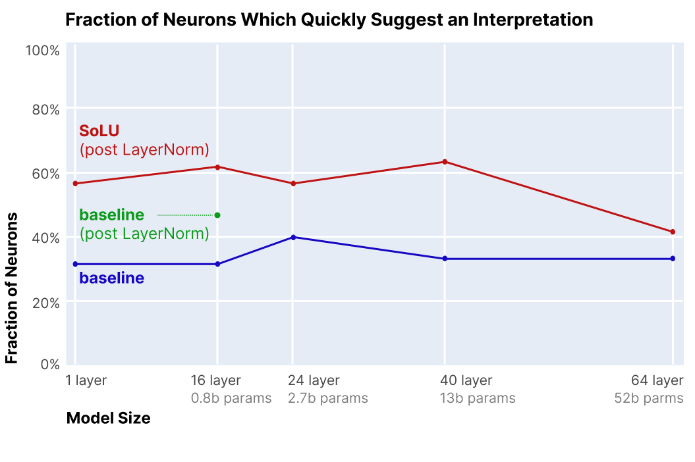
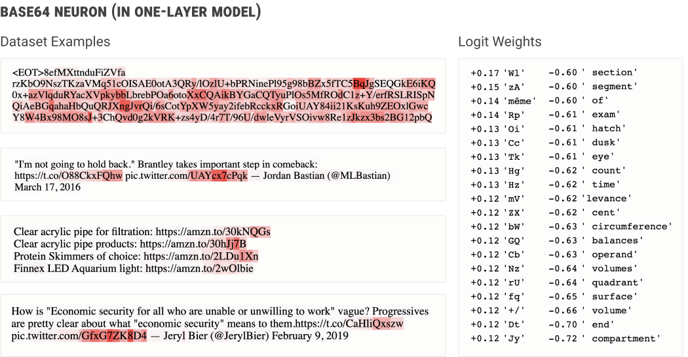
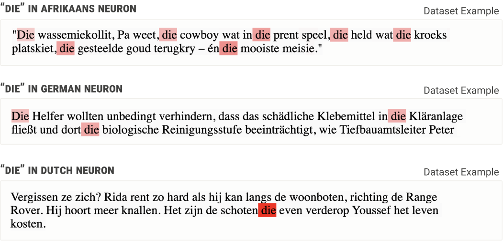
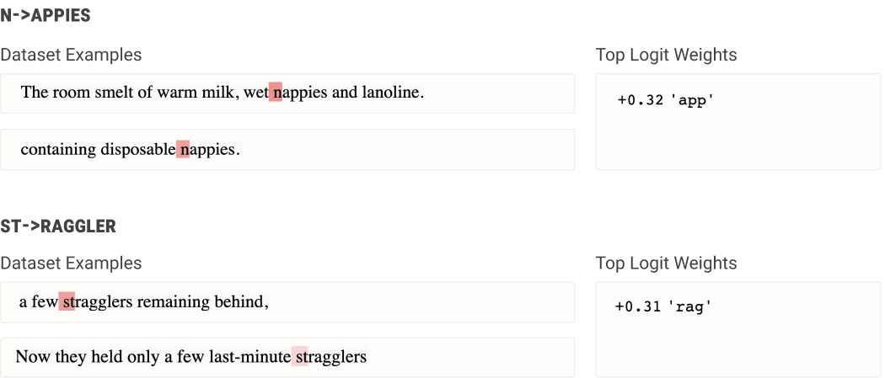
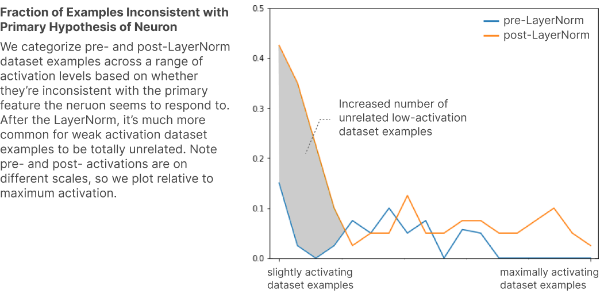

# Softmax 线性单元（Softmax Linear Units）

*2022 年 11 月 11 日 · 原文: https://transformer-circuits.pub/2022/solu/index.html*

---

### 1. 引言

随着 Transformer 生成式模型不断获得实际应用 \cite{brown2020language,LaMDA,chen2021evaluating,adiwardana2020towards,rae2021scaling}，确保它们在短期和长期内都表现得可预测且安全，变得愈发重要。机制可解释性——试图将神经网络逆向工程为可理解的计算机程序的事业——为应对这些安全问题提供了一条可能的路径：通过理解导致神经网络产生当前输出的内部结构，我们或许能够更系统地解决现有的安全问题，同时预判未来的安全问题。

直到最近，机制可解释性的研究仍主要聚焦于 CNN 视觉模型 \cite{cammarata2020thread}，但近期一些工作已开始探索针对 transformer 语言模型的机制可解释性 \cite{nelhage2021mathematical,olsson2022context}。值得注意的是，我们成功逆向工程了 1 层和 2 层的纯注意力 transformer \cite{nelhage2021mathematical}，并利用经验证据对任意规模模型中的上下文学习（in-context learning）得出了间接结论 \cite{olsson2022context}。

遗憾的是，由于难以理解模型中的 MLP（前馈）层，迄今为止对大型模型进行机制层面的理解仍很困难。无法理解和解读 MLP 层，似乎是阻碍进一步进展的主要瓶颈。其根本问题在于，许多神经元似乎是多语义的（polysemantic），会对多个互不相关的特征作出响应。多语义性在视觉模型中也曾被观察到，但在标准的 transformer 语言模型中似乎尤为严重。多语义性的一种合理解释是叠加假说，该假说认为神经网络层的特征数多于神经元数，这是"稀疏编码"策略的一部分，用以模拟一个规模大得多的层。若此假说成立，多语义性就将成为一种功能上重要的属性，因而尤其难以在不损害机器学习性能的前提下将其消除。

在本文中，我们报告一种架构改动，它似乎能大幅提高可被"解读"（即对输入的某个可描述属性作出响应）的 MLP 神经元占比，而对机器学习性能几乎毫无损失。具体而言，我们用 softmax 线性单元（我们称之为 SoLU）替换激活函数，并证明这样做能显著提高 MLP 层中——经随机化、盲法实验衡量——经快速考察即看似对应人类易于理解的概念、短语或类别的神经元占比。随后我们研究了 SoLU 模型，并借此对 transformer 中信息的处理方式获得了若干新的洞见。不过，我们也发现了一些支持叠加假说成立的证据，天下没有免费的午餐：SoLU 可能是通过"隐藏"某些特征来让另一些特征更可解读，从而使前者变得更加深不可测。尽管如此，SoLU 总体上仍似为净收益，因为在实际层面它大幅提高了我们能够理解的神经元占比。

尽管这些结果仍是初步的，但我们认为它们展示了一种"为机制可解释性而设计架构"的通用方法的潜力：可能存在许多不同的模型或架构，它们在性能上都大致达到当前最优水平，但在逆向工程的难易程度上却差异巨大。换言之，我们处于一个奇特的位置：既是试图理解神经网络参数所实现算法的逆向工程师，又是决定网络运行于何种架构之上的硬件设计师——或许我们可以利用后一个角色来支持前一个角色。若果真如此，通过发现（并倡导）那些最便于逆向工程的架构，我们或许能推动该领域朝积极的方向发展。

本文结构如下。第 2 节概述我们的核心结果。第 3 节提供机制可解释性、可解读神经元的作用、多语义性的挑战以及叠加假说的背景。第 4 节阐述 SoLU 的动机并加以介绍。第 5 节给出实验结果表明，以损失和下游评测来衡量，SoLU 的性能与标准 transformer 大致相当。第 6 节进行实验，证明 SoLU 使 MLP 神经元更易于解读，并展示若干只有借助 SoLU 模型才能做出、离开它们便无法做出的可解释性发现。第 7 节回顾相关工作，第 8 节讨论更宏观的图景与可能的未来方向。

### 2. 核心结果

SoLU 在保持性能的同时，提高了具有清晰解读的 MLP 神经元占比。具体而言，经盲法实验衡量，SoLU 将人类能快速找到清晰假说解释其激活值的 MLP 神经元占比从 35% 提升到了 60%——尽管在我们最大的模型上增益较小（见第 6.2 节）。这一增益的取得没有任何性能损失：SoLU 模型与非 SoLU 模型的测试损失和 NLP 评测结果大致相同（见第 5 节）。

SoLU 的收益可能以"隐藏"其他特征为代价。尽管有上述好处，SoLU 却可能是一把双刃剑。我们发现了理论与经验证据表明，它可能通过降低某些非神经元对齐特征的幅度、之后再借助 LayerNorm 将其恢复，从而"隐藏"这些特征（见第 4.3 节和第 6.4 节）。换言之，SoLU 使一些原本不可解读的特征变得可解读，但也可能使另一些本就不可解读的特征变得更加难以解读。不过总体权衡之下，它似乎仍是一笔划算的买卖，因为它在实践层面增进了我们的理解。

架构影响多语义性与 MLP 可解释性。虽然 SoLU 并非完美解决方案，但它作为一个概念验证表明，架构决策能极大地影响多语义性，使理解 transformer 的 MLP 层变得更为可行。这提示我们，探索其他架构如何影响多语义性可能是一条富有成效的进一步攻关路线。更一般地，它提示"为机制可解释性而设计模型"——选择我们预期更易逆向工程的架构——可能是一个有价值的方向。

MLP 层中存在的特征类型概览。SoLU 似乎能让各层中的部分特征变得易于解读。在此之前，我们发现很难在严格理解 MLP 层特征方面取得进展。尤其是，尽管付出了大量努力，我们对任何模型中第一个 MLP 层的理解都几乎没有进展。仅凭对不同层中可能出现何种特征的直觉，就曾是原始电路系列文章中逆向工程模型的强大工具 \cite{cammarata2020thread}，而这项工作把我们引向了类似的方向。我们发现，浅层特征往往处理将原始词元（token）映射为语义含义的任务（例如处理多词元单词，或不同语言的词元），中间层出现更抽象的特征，深层特征则参与将抽象概念映射回原始词元。详细讨论见第 6.3 节。

叠加假说的证据。关于多语义性为何会出现，我们知之甚少。在机制可解释性社区中，叠加假说常常被当作默认假说，仅仅因为它在直觉上比其他解释更具说服力，但支持它的证据寥寥。我们的 SoLU 结果似乎为"偏好叠加假说而非其他解释"提供了中等强度的证据。

### 3. 背景

在展示 SoLU 的结果之前，有必要梳理一下：为什么理解 transformer 语言模型中的 MLP 如此困难，具体而言为什么叠加假说可信，以及为什么多语义性可能难以避免。

#### 3.1 理解激活值的重要性

首先，理解神经元/激活值为什么如此重要？此前关于语言模型机制可解释性的工作（例如）无需理解激活值就能发现归纳头。而且归根结底，我们不是只需要理解参数吗？参数提供了神经网络的完整描述。

一个有用的类比是：把参数想象成我们试图理解的一个已编译的计算机程序，而激活值则是该程序中的变量。正如计算机程序中的一行代码只有在理解其变量代表什么时才有意义，神经网络中的一个参数也只有在你理解它所连接起来的激活值时才能被理解。这一想法最初由 Voss 等人提出 \cite{voss2021visualizing}，并在随本文一同发布的[一篇关于直觉的非正式笔记](https://transformer-circuits.pub/2022/mech-interp-essay/index.html)中有更深入的阐述。具体而言，参数的数量远多于激活值，因此激活值似乎更可能是理解事情真相的"钥匙"。

在某些特殊情况下，可以通过将神经网络重写为不引用中间激活值的等价模型，从而绕开对激活值的理解。这正是我们此前能够逆向工程纯注意力 transformer 的方式。然而，MLP 层的非线性结构不适合这类技巧：如果我们想理解带有 MLP 层的 transformer，看来就必须弄清楚如何理解 MLP 层激活值所编码的内容。

#### 3.2 分解激活值与基的作用

要讨论多语义性与叠加假说，首先有必要谈谈神经网络层中的基。神经网络层激活值的向量空间被称为"表示"（representation）。对于玩具式的低维神经网络，或许可以显式地可视化或分析这一空间 \cite{olah2014neural}。但随着维度增加，维度灾难开始显现，空间的体积呈指数增长。在我们看来，要完全理解这样的表示，唯一途径是将其分解为可独立理解的组成部分，我们称之为特征。找到这样一种分解，决定了你是需要理解 $N$ 个特征，还是 $\exp(N)$ 的表示体积。（这可以类比为：在逆向工程计算机程序时，我们不会把程序的状态空间仅仅当作一个高维向量，而是将其分解为一组代表不同事物的变量。）

一种方法是寻找有意义的基（或可能构成基一部分的有意义方向）。这种方法在词嵌入语境中经常被采用（例如 \cite{mikolov2013linguistic}），在其他语境中也有使用（例如 \cite{kim2017tcav}）。对于词嵌入，似乎别无选择：词嵌入通常具有我们所说的[非特权基](https://transformer-circuits.pub/2021/framework/index.html#def-privileged-basis) \cite{nelhage2021mathematical}，因为它可以被自由旋转。[^1] 因此，这类表示并不带有任何可能提示理解方式的"特殊基"。正确的基必须靠发现。例如，在词嵌入中，人们可以通过"man"减去"woman"来定义性别方向 \cite{mikolov2013linguistic}。

相比之下，许多神经网络的某些表示具有[特权基](https://transformer-circuits.pub/2021/framework/index.html#def-privileged-basis) \cite{nelhage2021mathematical}。在这些表示中，网络的某些特性使默认基变得特殊。例如，如果层采用逐坐标的非线性激活函数（如 ReLU），就会"打破对称性"，将激活值的特定基凸显为应用非线性的唯一基。这并不保证特征会与基对齐，但使这种对齐变得可能。在许多方面，如果可以的话，这是理想的结果：它不仅让我们绕开了"如何寻找有意义的基"这一难题，而且当推理所依据的基与激活函数之类的计算干净地对齐时，对神经网络进行机制层面的推理也更容易。

在 transformer 中，词元嵌入、残差流和注意力向量是非特权的，而 MLP 层激活值是特权的。

#### 3.3 神经元与多语义性

我们将具有特权基的表示的各维度称为"神经元"。我们经常发现一些神经元与清晰概念映射得极其干净利落。在视觉语境中，这类神经元既有[曲线检测器](https://distill.pub/2020/circuits/curve-detectors/)\cite{cammarata2020curve}、[高低频检测器](https://distill.pub/2020/circuits/frequency-edges/)\cite{schubert2021highlow}之类的低级神经元，也有[定向狗头检测器](https://distill.pub/2020/circuits/zoom-in/#claim-2-dog)、[汽车检测器](https://distill.pub/2020/circuits/zoom-in/#claim-2-superposition)\cite{olah2020zoom}之类的更复杂神经元，还有对应[名人](https://distill.pub/2021/multimodal-neurons/#person-neurons)、[情绪](https://distill.pub/2021/multimodal-neurons/#emotion-neurons)、[地理区域](https://distill.pub/2021/multimodal-neurons/#region-neurons)以及[更多类别](https://distill.pub/2021/multimodal-neurons/#guided-tour-of-neuron-families)的极其抽象的神经元 \cite{goh2021multimodal}。"某些神经元确实对应于可解读特征"这一论断，对哪些可解释性研究才有意义至关重要，因此值得指出：这些解读并非仅凭表面证据作出的随意论断。在某些情况下，这些解读经受住了细致研究的检验：Cammarata 等人 \cite{cammarata2020curve,cammarata2021curve} 用两篇论文研究了少数几个曲线检测器神经元及实现它们的电路，使用七条不同的证据线索来佐证这些神经元确实是曲线检测器，其目标是确凿地证明至少某些神经元确实是可以解读的。

然而，也有许多神经元似乎并不对应于可理解的概念——我们发现在 transformer 语言模型中尤其如此。一种可能性是，这些在某种意义上属于"异类特征"：它们实际上就是真正的特征，只是人类难以理解而已（见 \cite{ilyas2019adversarial} 及相关讨论 \cite{engstrom2019a}）。有时，一旦提出正确的假说，最初难以理解的特征就会变得显而易见（例如 \cite{schubert2021highlow}），所以这当然是有可能的！但许多这类神经元似乎会对几个互不相关、但各自可理解的特征作出响应，例如某个神经元同时响应猫头、汽车前脸和爪子。虽然我们不能完全排除猫爪与汽车前脸之间存在某种深层共性的可能，但更简单的解释似乎是：网络把几个互不相关的特征归并到了一起。我们称这些为[多语义神经元](https://distill.pub/2020/circuits/zoom-in/#claim-1-polysemantic) \cite{olah2017feature,olah2020zoom}。

请注意，如果特征实际上并未与特权基对齐，那么多语义性正是我们预期会观察到的现象。但特征为什么不与神经元对齐呢？虽然这可能纯属偶然，但也存在另一种可能：叠加假说 \cite{goh2016decoding,arora2018linear,olah2020zoom}。

#### 3.4 叠加假说

粗略地说，叠加假说背后的想法是，神经网络"想要表示的特征数超过了它们拥有的神经元数"，因此它们利用高维空间的一个性质，来模拟一个拥有多得多的神经元的模型。（注意，作为一种术语约定，我们用"多语义性"（polysemanticity）指代神经元对多个特征作出响应的经验现象，而用"叠加"（superposition）指代这里所描述的假说。）

如果叠加假说成立，那就意味着不存在任何能让激活值可解释的基底：寻找可解释基底从根本上就是错误的问题框架。特别重要的特征或许能获得专属神经元，但大多数特征并不与神经元对齐，因为它们需要共享神经元，不可能拥有专属的神经元。

本节并不是对叠加假说的正式论证，但值得试着勾勒一下它为何可能成立的直觉。我们从关于神经网络与特征的以下直觉出发：

- 神经网络将特征表示为激活空间中的方向。由于神经网络主要由矩阵乘法构成，把特征嵌入为方向既更容易构造，也更容易使用（而不是采用某种非线性表示）。
- 可能的特征远比神经元多。这些特征的重要性各不相同。例如，在语言语境中，每一个活着或曾经活过的人理论上都可能出现在文本里，而我们的模型并没有数十亿个神经元。但人的知名度和影响力千差万别，他们对周围文本的影响程度（即特征重要性）也各不相同。
- 由于每个神经元都关联着大量参数，把许多事实编码进参数的最有效方式未必与神经元对齐。语言模型尤其有动力把大量信息存进参数。让一个神经元对应单一特征可能会"浪费"本可用于存储额外事实的参数。
- 特征是稀疏的。延续上面把人视为潜在特征的例子，文本中的大多数词元（token）或图像中的大多数位置都不包含任何特定的人（甚至根本没有人）。这与自然图像统计中特征稀疏性的观察一致，正是这种稀疏性催生了稀疏编码方面的经典工作（例如参见 ）。

我们还可以把这些直觉与以下数学思想结合起来：

- 几乎正交的向量。虽然在 $n$ 维空间中只能有 $n$ 个正交向量，但在高维空间中却可以有 $\exp(n)$ 个"几乎正交"（余弦相似度 $<\epsilon$）的向量。参见 [Johnson–Lindenstrauss 引理](https://en.wikipedia.org/wiki/Johnson%E2%80%93Lindenstrauss_lemma) \cite{johnson1984extensions}。
- 压缩感知。一般而言，如果把一个向量投影到低维空间，就无法重构原始向量。但如果已知原始向量是稀疏的，情况就不同了：此时往往可以恢复出原始向量。这一情形由一条被称为[压缩感知](https://en.wikipedia.org/wiki/Compressed_sensing)的研究脉络所研究。

合在一起，这些就构成了叠加假说的基本要素。理想情况下，如果网络能表示更多的特征，就能获得更低的损失。它们能以正交方向表示的特征数受限于神经元数量。然而，情况可能是这样的：表示更多特征值得付出特征之间"干涉"（interference）的代价，因为它们并非完全正交，尤其是当稀疏性意味着这种干涉并不常见时。

也就是说，一个小型神经网络或许能以一定的"干涉"为代价，近似"模拟"一个稀疏的大型模型（下图）。而且，如果模型试图表示的底层数据确实包含大量稀疏特征，那么这可能正是模型最应该做的事。

需要说明的是，非线性激活函数的存在（即"特权基"）确实会激励特征与该基对齐、不被叠加。但如果稀疏编码带来的收益足够大，这种激励就会被压倒。而当不存在特权基时（如词嵌入和残差流中），我们应该预期叠加的压力会更强。

#### 更新

自本文发表以来，我们在论文 [Toy Models of Superposition](https://transformer-circuits.pub/2022/toy_model/index.html) 中撰写了关于叠加的更详细讨论。总的来说，我们对叠加的理解在 Toy Models 论文中要清晰得多，我们认为它取代了这里的讨论。

#### 3.5 我们能对叠加做些什么？

如果我们相信叠加假说，那么当我们想要理解模型时应该怎么做？大体上有两种思路：

- 制造叠加更少的模型。也许通过正确的架构决策、正则化或其他设计选择，我们可以减少神经网络对叠加的需求。
- 找到理解带叠加表示的方法。与其回避多语义性，不如接受模型必然具有多语义性，并尝试推断我们相信存在于激活向量中的更高维结构，或许可以借鉴压缩感知的思想。

本文聚焦于第一种思路，即制造叠加更少的模型。我们的直觉是，如果能在训练时避免叠加，那会比事后处理叠加更容易。在下一节，我们将介绍 SoLU——一种旨在减少模型中的多语义性与叠加的激活函数。

### 4. SoLU：为可解释性而设计

机制可解释性的目标是逆向工程神经网络。但我们不只是逆向工程师——我们也是硬件设计师。正如一个计算机程序如果使用了专为特定用例设计的特殊 CPU 指令，可能会更容易被逆向工程一样，正确的神经网络架构也可能让神经网络更容易被逆向工程。

我们可以把这种思路应用到眼前的挑战上。我们需要理解 MLP 层的激活值，但这很困难，因为 transformer 的 MLP 神经元往往非常"多语义"，这可能是特征叠加导致的。于是问题就变成了：我们如何设计一种神经网络架构，鼓励特征与神经元对齐，并抑制多语义性？

#### 4.1 可能减少多语义性的性质

Transformer 的 MLP 层并非为规避多语义性而设计。因此，有不少架构性质可能合理地减少多语义性，却几乎未被探索过。我们意识到，降低多语义性可能会损害性能（根据叠加假说），但从策略上讲，先寻找降低多语义性的方法、再看看能否找到不损害性能的办法，是合理的做法。虽然本文不会尝试所有这些方法，但以下是几种可能降低多语义性的途径，以及它们为何可能有帮助的论证：

- 激活稀疏性：多语义神经元必须更频繁地激活，因为它们代表多种事物。此外，要让一个多语义神经元有用，其他神经元的激活必须能对它进行消歧。这意味着多语义性要求更多神经元同时激活。换言之，叠加要求底层特征的稀疏性与表示它们的神经元的稀疏性之间存在差距。这表明，鼓励激活稀疏性可能会让神经元更难变得多语义。这种稀疏性可以通过使用不同的激活函数或使用正则化器来实现。（同样值得注意的是，稀疏性必须相对于某个基来定义；这是一个非常普适的论证，说明为何任何形式的稀疏性都可能鼓励特权基的产生。）

- 侧抑制 / 共现稀疏性：可以设计这样的激活函数（例如 softmax），其中一个神经元激活会降低其他神经元的激活量。这鼓励了一种非常特殊的（近似）激活稀疏性，可以称之为"共现稀疏性"。它不仅意味着神经元在平均意义上是稀疏的，还意味着在任何一个特定实例中，同时激活的神经元相对较少。这可能是一种更强有力的抑制多语义性的方式，因为它让其他神经元难以消歧某个神经元的含义。仔细推敲侧抑制的确切机制很重要，以确保架构真正创造出"少数神经元胜出"、稀疏性由此涌现的局面，而不是所有神经元互相抑制、最终产生高度弥散的小激活值。

- 权重稀疏性：如果想象神经网络相邻层中的两个特征，似乎很自然地会认为它们之间存在某种"理想权重"。如果每个特征都对应一个神经元（如第 3.4 节中设想的理想模型），这个理想权重就只是权重矩阵中的一个条目。但如果其中一个或两个特征以不与神经元对齐的方式表示，理想权重就会被"抹开"到权重矩阵的许多条目上。因此，我们应该预期：含多语义神经元的层会有更多小权重，而特征与基对齐的层会有更少数量的"更集中"的大稀疏权重。这意味着权重稀疏性可能是抑制多语义性、鼓励特权基的一种途径。然而，在我们看来，只有当输入和输出都是特权基时，权重稀疏性才有意义。在 transformer 中，所有权重都以残差流作为输入或输出，而在我们对 transformer 的概念化中，残差流必然是"多语义"的、不与任何基对齐。因此，我们不认为权重稀疏性适用于标准的 transformer 架构。

- 超线性激活函数：超线性激活函数是这样一种激活函数：在激活区间内，固定其他神经元不变时，增大某个神经元的预激活值会使其激活值以高于线性的速率增长。例如 $\text{ReLU}(x)^2$、$\text{softmax}(x)*x$ 和 $\exp(x)$。考虑用这种激活函数把一个特征分散到 $N$ 个神经元上会发生什么。由于 $f\left(\frac{x}{\sqrt{N}}\right) < \frac{f(x)}{\sqrt{N}}$，把特征分散到多个神经元会自动"缩小"它，从而需要更大的激活值或更大的输出权重。这使得不与基对齐的特征更难与基对齐的特征共存。而且，如果两个重叠在同一神经元中的特征同时出现，对多语义神经网络来说情况会更糟，因为 $f(a+b) > f(a)+f(b)$ 意味着特征之间的"干涉"会大于各部分之和。

- 改变每 FLOP / 参数对应的神经元数：如果接受叠加假说，那么多语义性的根源就是：模型理想上想要表示的所有特征，没有足够的神经元来承载。遗憾的是，简单地放大模型可能无法解决这个问题，因为能力更强的模型可能想表示更多的特征。相反，我们希望在不增大模型的前提下创造更多神经元。某些架构方法或许可以做到这一点。（从某种意义上说，如果假说成立，这似乎是最有吸引力的降低多语义性的方式，因为它是"给神经网络它想要的东西"，而不是"强迫它做它不想做的事"。）

#### 4.2 SoLU 激活函数

事实证明，上述性质中的好几项——侧抑制，以及近似稀疏性和超线性——都可以通过对 MLP 激活函数做一个相对简单的改动来实现。

现代 transformer 常用 GeLU 激活函数。回顾一下，GeLU 可以被 $\text{sigmoid}(1.7x)*x$ 紧密逼近。如果我们用 softmax——sigmoid 从二元概率到多元概率的自然推广——替换 sigmoid 会怎样？我们把这种激活函数称为"softmax 线性单元"（softmax linear unit），即 SoLU：

$$\text{SoLU}(x) =  x * \text{softmax}(x)$$

为了理解它为何可能抑制多语义性和叠加，考虑几个例子会很有帮助。首先，当 SoLU 作用于一个同时含大值和小值的向量时，大值会压制较小的值：

$$\text{SoLU}(4,1,4,1) ~\approx~ (2,0,2,0)$$

或许更重要的是，与基对齐的大向量会被保留，而分散在多个维度上的特征则会被抑制到更小的幅度：

$$\text{SoLU}(4,0,0,0) ~\approx~ (4,0,0,0)$$

$$\text{SoLU}(1,1,1,1) ~\approx~  \left(\frac{1}{4},\frac{1}{4},\frac{1}{4},\frac{1}{4}\right)$$

#### 4.3 LayerNorm

我们的初步实验发现，仅仅使用 SoLU 激活函数似乎就能让神经元变得可解释得多，但代价是显著的性能损失。一般来说，不做其他任何改变的 SoLU 模型，其性能相当于一个比实际规模小 30–50% 的模型，且模型越大受影响越大。如果叠加假说成立，这正是我们预期会看到的情况——我们可以降低多语义性，但这样做会损害网络的机器学习性能。

然而，我们通过实验发现，这种性能损失是可以弥补的，同时还能保留可解释性上的收益：只需在 SoLU 之后额外应用一层 LayerNorm，类似于 。这大大提升了机器学习性能，因此在大多数实验中，我们实际应用的函数是[^2]：

$$f(x) = \text{LN}(\text{SoLU}(x)) = \text{LN}(x * \text{softmax}(x))$$

我们最初添加 LayerNorm 是出于这样的直觉：它可能修复激活尺度的问题并改善优化。遗憾的是，我们现在认为，性能提升的原因至少有一部分是：额外的 LayerNorm 可能让叠加得以"走私"进更小的激活值中。不过，在这种理论下，组合操作仍然倾向于把至少部分特征推向具有大激活值的单个神经元，从而可能让可解释性的提升与叠加共存。

我们稍后会从经验上讨论这一点，但先注意：LayerNorm 对输入的缩放是不变的，因为 $\text{LN}(x')$ 要除以 $\sigma(x')$，而 $\sigma(\alpha x') = \alpha \sigma(x')$。这意味着，如果某个向量整体很小——因为它非常分散、被 SoLU 抑制了——它会被重新缩放到更大的尺度。

更一般地说，这意味着 softmax 的分母对模型的最终行为没有影响（尽管它确实改变了我们在 LayerNorm 之前观察到的激活值）。如果我们忽略中间激活值，用指数激活函数训练模型将是完全相同的：

$$\text{LN}(\text{SoLU}(x)) \approx \text{LN}\left(x\frac{\exp(x)}{\sum_i \exp(x_i)}\right) \approx \text{LN}\left(x * \exp(x)\right)$$

#### 4.4 并行性实现细节

我们更大的模型使用张量并行（tensor parallelism）训练，因此 MLP 激活值从不会完整出现在单个加速器上。对于这些模型，我们将 softmax 和层归一化都拆开，各自只作用于一部分维度，使每个处理器都能在本地运行而无需额外通信。我们报告的是这些"分块"（blocked）模型的结果，但在我们的非正式实验中，这种分块似乎对 ML 性能或我们的可解释性结果都没有显著影响。

### 5. 性能结果

在本节中，我们确认 SoLU（带 LayerNorm 的版本）与基线模型具有相当的 ML 性能。这一点很重要，因为如果可解释性改动会显著损害模型性能，就不太可能被广泛采用。[^3] 如今最大的语言模型训练成本估计高达数百万美元，而说服公司在生产系统中采纳这样的改动，无异于要求他们多花数百万美元才能获得性能相当的模型。这听起来很难推销，即使可解释性的改进非常显著。因此，确认竞争力似乎十分重要。

为了证明这一点，我们训练了使用与不使用 SoLU 的多种规模 transformer 语言模型，并同时评估了损失以及以下下游 NLP 任务上的性能：Lambada、ARC、OpenBookQA、TriviaQA、算术（arithmetic）、MMLU 和 HellaSwag。

我们的基线模型采用与 GPT-3 和 Gopher 类似的架构，与我们此前语言模型基线中描述的架构完全相同。我们训练的模型从 1 层到 64 层（约 500 亿参数），参数规模按约 4 倍的系数逐级放大。我们的 SoLU 模型与基线模型拥有完全相同的超参数和架构细节，唯一区别在于使用了 SoLU 激活函数。

模型的训练曲线如图 1 所示。我们同时绘制了损失（图 1 上图）和一种性能差异度量（图 1 下图），后者将损失差异转换为模型规模的有效乘数，使我们能够放大观察微小的性能差异。如图所示，对于所有模型规模，SoLU 与基线大致相当，始终落在模型规模 1.05× 到 0.95× 的乘数之间（在大多数情况下大致相当于损失变化 ±0.01 nats，而总损失为 1.6–3 nats）。在大模型规模上，SoLU 相对基线可能表现出略占优势的趋势，不过所有差异都很小，多半更可能只是随机噪声（在 50B 模型上，SoLU 相当于将模型规模扩大了 1.01×）。

图 1：基线（虚线）与 SoLU（实线）模型的损失曲线，参数规模从 1000 万到 500 亿。上图显示学习曲线，下图显示同一数据的"等效模型规模"版本：基线模型设为 1.0×，SoLU 模型则按规模定律预测的、与其性能相当的基线模型规模来度量。例如，如果 1B 基线模型达到损失 2.3，2B 基线模型达到损失 2.1，而 1B SoLU 模型也达到损失 2.1，那么该 SoLU 模型就会被认为相当于以基线 2× 的模型规模在运行。

虽然下游任务通常与足够广泛训练集上的损失高度相关，但宏观损失仍可能掩盖特定任务或领域的缺陷，因此我们运行了几项有代表性的下游评估，以印证损失曲线所呈现的图景。我们在 Lambada、OpenBookQA、ARC、HellaSwag、MMLU、TriviaQA 和算术数据集上进行了评估，结果如图 2 所示。在所有模型规模上，基线与 SoLU 的整体性能都相近；少数任务存在明显差异（算术任务上 SoLU 似乎更好，而 TriviaQA 上基线似乎更好），但大多数任务表现相似，且没有任何系统性的偏向。

图 2：下游任务上的性能。

值得注意的是，我们对 SoLU 和基线都没有扫描超参数范围（只扫描了模型规模），而 SoLU 的最优超参数可能不同于基线模型。不过，基线模型的超参数曾在  中使用，与  中的超参数相近，而 SoLU 完全未经调参，因此即使存在这一效应，也只会低估 SoLU 的性能，这暗示 SoLU 至少与基线一样好。

最后，还有另一种意义上的"性能"值得一提——模型训练的效率。SoLU 需要对前馈激活做 softmax，因此增加了一小点额外计算量，但与主要的矩阵乘法相比微不足道；我们发现，在合适的 GPU kernel 下，它只会使模型训练速度下降一个无关紧要的量（速度差异不到 1%）。[^4]

总体而言，我们得出结论：带 LayerNorm 的 SoLU 相比标准 transformer，能够取得有竞争力的 ML 性能和训练性能。

### 6. 可解释性结果

既然已经表明 SoLU 在 ML 性能上具有竞争力，我们现在来论证本文的核心观点：它让模型神经元更容易被解释。第 6.1 节描述我们进行的定量实验，第 6.2 节梳理这些实验的结果，第 6.3 节探索我们在 SoLU 模型中发现的一些此前在基线模型中无法获得的发现，第 6.4 节讨论激活后 LayerNorm 可能如何使整体图景变得复杂。

#### 6.1 实验设置

我们关心的是神经元是否"可解释"——也就是说，它们的激活是否可靠地对应于输入中某个连贯、可表述的性质。要判定一个神经元在这个意义上是否可解释并不简单。人们往往能很快提出关于神经元行为的理论，但验证这一理论（或在原理论有误时加以修正）却需要耗费大量人力。例如，Cammarata 等人用整整两篇论文的篇幅，通过七条不同的证据线索，严谨地研究了视觉模型中少数几个曲线检测神经元。

为了让跨多个模型研究大量神经元在实践上可行，我们退而求其次，测量一个不那么宏大的指标：给定少量人工审视，某个神经元是否能让人提出一个看似合理的解释。这既会产生一些误报（神经元看似有合理解释，但细究之下其实不对），也会产生一些漏报（神经元放电存在简单而正确的理论，但我们没能很快找到它）。尽管如此，它仍可能与神经元在深入考察下是否可解释这一性质相关。此外，它似乎与"易于解释"这一性质相关，而这本身就很有价值：如果有更多神经元只需少量努力即可解释，那么对它们的大规模集合进行逆向工程的可能性就更大。

#### 警示

自发表以来，我们对这一指标变得更加悲观。只看最强的数据集示例，只能提供关于神经元在强激活时是否单语义的信息。我们此前曾希望，神经元强激活时是否单语义，与它整体上是否单语义之间可能存在显著的相关性。然而，进一步的实验让我们对此不再那么乐观，至少一旦开始试图优化让大幅激活变得单语义，情况就是如此。当然，了解最强激活是否单语义仍有其有趣之处——这可能表明该神经元有一个比其他特征表征得更强的特征，值得探究——但如果我们追求构建单语义模型，它恐怕不是架构实验的良好指南。在我们更近期的 [Towards Monosemanticity](https://transformer-circuits.pub/2023/monosemantic-features/index.html) 论文中，我们尝试通过分析数据集示例的全谱系，以更有原则的方式来处理这个问题。

为了测量一个神经元是否"一眼可解释"，我们请人类评估者（作者中的几位）审视一系列文本片段（通常 20 段，每段几段话长），其中包含该神经元强烈放电的词元。放电位置以不同深浅的红色高亮（对应激活幅度），使评估者能快速浏览片段以寻找共同主题。评估者所看到的数据集示例的一个例子如图 3 所示。

图 3：如上所示，评估者会看到神经元在其上放电的数据集示例，并按激活幅度高亮。神经元从某个 SoLU 模型或其对应基线中随机选取；人类评估者（作者之一）花 1–2 分钟判断单个假说或概念能否解释 80% 的最强放电，若能则将该神经元标记为 INTERPRETABLE，否则标记为 NOT INTERPRETABLE。

评估者被要求对每个神经元检查放电 1–2 分钟，然后说明是否找到了解释这些放电的合理理论。具体指示是：如果"80% 或以上的最强放电可以由单一规则或类别解释（例如单词 "apple" 或任何与音乐相关的短语）"，就标记为 INTERPRETABLE，否则标记为 NOT INTERPRETABLE。

我们在 1 层、16 层、24 层、40 层和 64 层（500 亿参数）模型上进行了实验。对每种模型规模，评估者会看到来自基线模型（无 SoLU 激活）的 60 个神经元和来自对应 SoLU 模型的 60 个神经元——所有实验合计 60×2×5=600 个神经元。为避免我们偏向自己的模型，神经元以随机、盲测的方式呈现给评估者（评估者不知道哪些神经元来自哪个模型）。

最后，由于我们的 SoLU 模型同时包含 SoLU 本身和一个额外的层归一化，我们做了一项实验来区分 SoLU 与层归一化的各自效应。具体而言，我们训练了一个带额外层归一化但没有 SoLU 的 16 层模型，并同样评估了该模型的 60 个神经元，使神经元总数达到 660 个。

#### 6.2 定量结果

关于初步可解释神经元占比的实验结果如图 4 所示。对于 1 层到 40 层的模型，SoLU 模型的神经元比基线模型的神经元可解释性显著更高，绝对百分比提高约 25 个百分点，即可解释比例从约 35% 提升到约 60%。这把可解释神经元的比例提高了 1.7 倍。尽管效应幅度中等，但样本量、一致的差距以及可解释神经元一致的绝对比例表明，SoLU 模型确实存在真实而持久的效应。

图 4：不同模型规模下 SoLU 与基线 transformer 神经元可解释性的人类实验结果。蓝线表示模型规模从 1 层到 64 层的基线 transformer 中标记为初步呈现解释的神经元比例。红线表示 SoLU transformer 中标记为初步呈现解释的神经元比例。绿点表示带额外层归一化但没有 SoLU 的 16 层模型中标记为初步呈现解释的神经元比例。总体而言，在 1 层到 40 层的模型中，SoLU 将可解释神经元的比例提高了约 25%，而在 64 层模型中，提升幅度要小得多。

在 64 层模型中，SoLU 模型的收益显著减弱。初步可解释神经元的比例与基线模型相同，但在 SoLU 模型中仅略高（42% 对 33%），且远低于小模型上 SoLU 的比例。我们不知道为何 64L 模型从 SoLU 中获益较少，但一种可能的理论是：随着模型变大，其神经元表征的概念更加复杂、更难理解，以至于 1–2 分钟的检查不太可能识别出它们的含义（这将表明神经元仍然是可解释的，只是不再"易于解释"）。凭经验而言，64L 在我们看来确实表征了更复杂的概念。另一种可能是，某些与深层模型或优化动态相关的效应改变或削弱了 SoLU 通常带来的可解释性效果。无论哪种情况，64L 模型都很好地说明了为何在前沿大模型上检验可解释性思路很重要：在小模型上有效的思路，在大模型上未必同样有效。这为未来尝试提高最大规模模型可解释性的工作提供了很好的动机。

带额外层归一化但没有 SoLU 的 16 层模型，其表现大致介于 SoLU 与基线之间，这表明仅靠激活后层归一化可能提供部分但非全部的可解释性收益。

有一位标注者发现的效应大于另外两位（基线对 SoLU 约 20% 对 60%，而非约 40% 对 60%）。在数据揭盲后的交流中，我们的感觉是：这位标注者对判断神经元可解释的标准更高，尤其不太愿意忽略微小的激活。因此，如果对"神经元可解释"采用更严格的定义，效应量可能更大，但我们不愿据此作出过强的推断。

如第 6.1 节所述，这些结果描述的是神经元是否初步显得可解释，这并不必然等同于我们在严谨考察下是否会认为它们可解释。一方面，快速检查可能漏掉了一些只要有更多时间就能证明是可解释的神经元（这也是解释 64L 表现欠佳的一个可能假说）。反之，一些评估者看似看到了明确假说的情况，也很可能其实是错的。一个特别的风险是：我们展示的是最强的数据集示例，而没有展示反例（即假说所述模式中神经元可能不放电的示例），除非反例恰好与正例出现在同一片段中。因此，神经元实际上可能只在该假说模式的一部分情形下放电，而评估者不会察觉到这一点。

尽管如此，实验表明确实存在某种真实效应；而且凭经验而言，我们发现 SoLU 模型更容易探索、使用和理解。在下一节中，我们将描述其中一些开放式探索。

#### 6.3 SoLU 模型的定性探索

关于神经元进一步定性研究的讨论，另见这段[早期视频](https://www.youtube.com/watch?v=e0u7ZSAPZAA)，其中讨论了我们关于 SoLU 的初步发现。

在定量刻画了 SoLU 对神经元可解释性的影响之后，我们现在转而对这些 SoLU 模型中发现的可解释特征展开更开放式的探索。为此，我们并不追求严谨或系统，也不与非 SoLU 模型进行比较，但非正式地说，我们在训练 SoLU 模型之前几乎无法发现本节描述的大部分内容。因此，这个小节大致可以看作 SoLU 让我们得以发现的一些精选示例。

##### 6.3.1 单层模型神经元

我们从探索一个单层 SoLU 模型开始。单层 transformer 具有一些特殊性质，往往使机制可解释性变得更容易。对于本次调查，最重要的观察是：撇开对层归一化的顾虑不谈，每个 MLP 神经元的激活对 logits 具有线性影响。将该神经元的输出权重向量乘以解嵌入矩阵，我们就能直接读出该神经元激活时哪些输出 token 的 logits 被提高、提高了多少。而且，这是此类神经元在单层模型中的唯一效应。

这带来几个好处。首先，它让我们的可解释性工作有了更坚实的基础：我们既可以从数据集示例中启发式地推断神经元的目的，又可以通过与输出 logits 上的效应交叉核对来验证这一理解。但更重要的是，这意味着如果神经元是可解释的，它们就对应于模型行为中可解释的端到端规则。我们认为这一点与我们之前关于逆向工程小型纯注意力模型的论文 \cite{nelhage2021mathematical} 结合时特别有用——我们不再只能完整逆向工程一个小型纯注意力模型，现在可以逆向工程一个 1 层完整 transformer。

举例来说，我们找到了一个似乎精确地对 base64 编码文本（[常见于网址或其他语境](https://en.wikipedia.org/wiki/Base64)）激活的神经元。利用我们的模型只有 1 层这一事实，我们可以确定该神经元会提高哪些 token 的概率：不出所料，它提高了对应随机混合大小写字符串的 token 的概率，同时降低了常见英文单词的似然。其他例子还包括对应全大写文本（与图 3 所示是同一个神经元）或对应数字后跟逗号（如书写四位及以上数字时出现的情况）的神经元。

图 5：1 层 SoLU 模型中一个似乎对 base64 编码文本激活的神经元（左）。该神经元到 logits 的展开权重（右）提高了许多混合大小写、在单词中很少出现的 token 的概率，同时降低了一些代表英文单词的 token 的概率，这证实了上述判断。它可以被理解为一个可解释的规则：在 base64 文本上，下一个 token 也更可能是 base64。

##### 6.3.2 更大模型中的浅层神经元（"去词元化"）

接下来我们把探索转向更大的模型——我们其余的示例将来自 16L、24L、40L 和 64L 模型的混合。我们最有趣的发现之一是，大型网络中浅层、中层和深层神经元的角色类型往往大不相同，正如人们已知卷积网络视觉模型不同深度的特征是不同的一样。我们将分节讨论各层的神经元，从浅层神经元开始。

浅层神经元似乎常常参与将 token 的"人工"结构映射为更自然、更具语义意义的表征。

许多浅层神经元似乎对多词元单词或复合词作出响应。例如，一个神经元在 "Trend|ing" 的最后一个词元（"ing"）上激活（本质上把词元 "Trend" 后跟词元 "ing" 的序列映射为有意义的单词 "Trending"）。其他一些例子包括：

- 对拆分到多个词元中的特定单词作出响应的神经元："Bank|ing"、"word|ing"、"Ch|olesterol"、"Libert|arian"、"Civil|ian"、"Sh|anghai"、"Not|withstanding"……
- 对名人姓名作出响应的神经元："Martin| Luther| King"、"Donald| Trump"、"Lyndon| Johnson"、"George| Orwell"、"Ernest| Hemingway"、"Muhammad| Ali"、"Oprah| Winfrey"……（参见 \cite{goh2021multimodal}）
- 对其他名词作出响应的神经元："Human| Rights| Watch"、"International| Monetary| Fund"、"Hurricane| Matthew"、"Real| Madrid"……
- 对复合词作出响应的神经元："book| club"、"social| security"、"computer| vision"、"organized| crime"、"birthday| party"、"heart| attack"……
- 对 LaTeX "\\" 命令作出响应的神经元："\\|left"、"\\|frac|{"、"\\|begin"……

我们还看到许多对特定语言或语境中的某个 token 作出响应的浅层神经元。例如，我们发现了三个浅层神经元，它们似乎分别表征 "die" 一词在三种非英语语言——德语、荷兰语和南非荷兰语——中的用法（注意 Coenen 等人发现了一些相关结果 \cite{reif2019visualizing}）。

图 6：三个分别在三种特定语言中响应单词 "die" 的神经元（每个神经元都不会在其余语言中、也不会在英文语境下对 "die" 激活）。

区分不同语境中的同一 token 并不限于自然语言。例如，有一些神经元分别表征 "<" 字符在 python、IRC 和 XML/HTML 这三种不同语境中的含义。

对于这些浅层神经元，SoLU 似乎带来了特别大的差异：尽管投入了大量精力，我们在普通模型中几乎没能取得理解浅层 MLP 神经元的进展，但一旦开始研究 SoLU 模型，我们便轻松理解了许多。

##### 6.3.3 更大模型中的深层神经元（"再词元化"）

深层神经元（靠近网络输出的那些）往往与浅层神经元做的事相反：它们促成把单词或语境化 token 转换回字面 token。例如，最后一层有一个神经元在 token "st" 上激活，同时提高下一个 token 是 "rag" 的可能性；本质上，这是一种把单词 "st|rag|glers" 的表征逐个转换成其组成 token 以便输出的方式。类似地，一个 "nappies" 输出神经元在 token "n" 上激活，并提高 token "app" 的概率，以帮助写出 "n|app|ies"。这些神经元本质上模拟了一个额外的输出词表条目，该条目只有在前面 token 满足特定条件时才可用。

图 7：在给定 token 上激活、同时提高特定下一个 token 可能性的神经元。当它们出现在网络中较深的层时，这些神经元可被解释为把一个词（模型在内部表征的）解码为其组成 token（模型必须输出的）。

##### 6.3.4 更大模型中的中层神经元

中层神经元往往表征更复杂、更抽象的概念。例如，有一个神经元似乎仅在数字指代人数时才表征该数字：

图 8：似乎仅在数字列举人数（而非计数其他事物）时对数字（包括数字符号与数字单词）激活的神经元。

在这些层中可以找到大量有趣的神经元。我们观察到的一些常见类别包括：

- 对特定类型的描述性从句激活的神经元：对描述声音的从句激活的神经元、对描述衣着的从句激活的神经元、对音乐性描述从句激活的神经元（如 "in the key of C major"）、对描述物体上文字内容的从句激活的神经元……
- 对话语标记作出响应的神经元：对强调某事物重要性的标记作出响应的神经元（如 "the amazing thing is"）、对含糊其辞作出响应的神经元（如 "it seems to me that…"）……
- 消除 token 特殊解读歧义的神经元：对用作成绩等级的 A/B/C/D 作出响应的神经元、对日期中的"日"部分作出响应的神经元、对食谱中作为用量的数字作出响应的神经元、对字符串中 C 风格格式说明符（如 "%s" 或 "%d"）作出响应的神经元……

但也有大量神经元难以归入这些类别，比如一个似乎有助于解析 ASCII 表格列的神经元。

总之，跨层观察的总体模式表明了一种粗略的布局：浅层"去词元化"，把 token 映射为相当具体的概念（如 "machine learning" 这样的短语，或特定语言中的单词）；网络的中部处理更抽象的概念，如"任何描述音乐的从句"；网络的较深部分则"再词元化"，把具体概念转换回待输出的字面 token。所有这一切都非常初步，需要更细致得多的研究才能得出可靠结论。不过，我们在视觉领域的经验是，了解不同层往往存在哪些类型的特征，对理解模型非常有帮助，可作为高层方向指引（尤其参见 \cite{olah2020early}）。我们在这里也许正在发展出类似的东西，这看起来很有前景。

##### 6.3.5 抽象模式

在探索这些 SoLU 模型神经元的过程中，我们注意到一些更抽象的模式。尽管我们还没有详细研究它们，但它们似乎值得一提：

神经元分裂：随着模型变大，我们观察到若干这样的情况：小模型中的一个神经元在更大的模型中似乎"分裂"成多个神经元。例如，一个十六进制神经元分裂成针对特定十六进制字符的神经元（如十六进制中的 "3" 神经元），或者一个"出现在英文中、但在该语境下实为德语的 token"神经元分裂成德语中特定 token X 的神经元（如德语中的 "die"）。

神经元家族：理解到许多神经元由某种对称性参数化（例如，许多神经元实现的是同一特征的旋转版本）\cite{olah2020naturally}，可将理解视觉模型电路的工作简化为多达 50 倍。更一般地说，在最初的 circuits 系列文章中，把神经元理解为存在于相似神经元家族中被证明非常有用 \cite{olah2020early}。我们注意到，语言模型中相当多的浅层 MLP 神经元实现了"语言 Y 中的 token X"这种形式的特征，它们或许可以被认为构成一个由 X 和 Y 参数化的神经元家族。这也许是发现语言模型中某种抽象等变性（例如对语言的等变性）的一个切入点。

浅层与深层之间的对偶性：我们看到的浅层特征类型与深层特征类型之间似乎常常存在一种对偶关系。特别是，浅层有用于识别多词元单词或复合词的特征，深层有用于把某些多词元单词或复合词作为 token 输出的特征。

与 CLIP 神经元的相似之处：我们注意到 Goh 等人 \cite{goh2021multimodal} 在 CLIP 研究中描述的许多神经元类型。特别是，我们观察到对应名人和地理区域的神经元。这或许可以被看作一种跨模态的[普遍性](https://distill.pub/2020/circuits/zoom-in/#claim-3) \cite{olah2020zoom,li2015convergent}。一种直觉是：由于 CLIP 是多模态模型，其视觉侧试图让图像与文本对齐，因此它被激励去表征语言模型中自然出现的特征。

##### 6.3.6 可解释性错觉的部分缓解

研究神经元的一个危险在于，很容易形成关于神经元的错误理论。Bolukbasi 等人最近的一篇论文 \cite{bolukbasi2021interpretability} 强调了 Transformer 语境中"可解释性错觉"的风险。更一般地说，最初的 circuits 系列文章（尤其是 Cammarata 等人 \cite{cammarata2020curve}）强调了在对某个神经元的理论建立信心之前使用多重证据线索的重要性。

本节的结果旨在探索。虽然它们总体上比我们定量评估中使用的快速判断要深入一些，但与 Cammarata 等人 \cite{cammarata2020curve} 相比，对任何给定神经元的调查往往都相当肤浅。因此，我们不会以高置信度为大多数神经元的理论背书。不过，有几个因素缓解了某些类别的误解：

- 我们的数据集示例来自与模型训练所用相同的、高度多样的数据分布（部分缓解了 \cite{bolukbasi2021interpretability} 的担忧）。
- 我们让用户可以方便地在交互式编辑器中打开任何数据集示例，观察编辑它时激活值如何变化。虽然我们没有对每个神经元都这样做，但在感到不确定或困惑时，我们经常这样做。
- 对某些神经元，我们查看了跨一定激活值范围的示例。
- 对某些神经元，我们做了定制的实验，例如把一个十六进制文本神经元与一个正则表达式进行比较。

#### 6.4 层归一化的影响

此前，我们决定使用在 SoLU 激活函数之后加一个层归一化的模型，以弥补单独使用 SoLU 时观察到的显著性能下降。不幸的是，正如我们在 4.3 节观察到的，层归一化显著复杂化了多语义性和叠加的故事。

一个假设是，SoLU 创造了类似两层特征的东西：神经元对齐的特征与非神经元对齐的特征。神经元对齐的特征正是我们考察 SoLU 神经元时观察到的，而且只要存在，它们就主导着激活。非神经元对齐的特征只在没有基对齐特征存在时才有大效应，而层归一化会重新缩放那些被 SoLU 压制的激活。

为了调查这一点，我们收集了跨一定神经元激活水平范围的数据集示例，而不是只看那些最大程度激活神经元的示例。然后我们比较了层归一化前后不同激活水平下的数据集示例。考察多种神经元后，我们的强烈印象是：对于那些看起来可解释的神经元，层归一化后的数据集示例中有多得多的示例与该神经元似乎响应的特征不一致。这一点在那些只是轻微激活神经元的示例中尤其明显，而非强烈激活它的示例。

为了以稍微更客观的方式研究这一点，其中一位作者考察了一个看似可解释的神经元，它响应单词 "left" 和 "right"，尤其是用作形容词指定身体部位时。他根据与假设一致还是不一致，对层归一化前后约一千个数据集示例进行了分类。分类结果似乎表明，在低激活区间，层归一化后的激活更可能包含无关的激活。注意，这个实验是非正式进行的，也没有设盲，因此结果可能有偏，尽管该效应似乎如此显著，以至于我们相信它是真实的：

图 9：与主要假设不一致的神经元比例。

这正是我们预期会看到的迹象：假设层归一化（LayerNorm）被用来将非基对齐特征"走私"穿过 SoLU（如第 4.3 节所推测的那样），就会出现这样的迹象。

从这个角度看，SoLU 对可解释性而言是一把双刃剑。一方面，它让研究 MLP 层中最终与神经元良好对齐的那部分特征变得容易得多。另一方面，我们怀疑还有许多其他未与神经元对齐的特征，它们对损失至关重要，而且可以说比普通模型中的特征更难研究。也许更令人担忧的是，如果只盯着 SoLU 激活值看，这些特征很容易隐而不见，让人产生一种已经理解全部特征的错觉。

尽管如此，我们倾向于认为 SoLU 相较之前的情况是一种改进：我们理解的比以往多得多的特征，包括在第一个 MLP 层这样的层中——此前我们在这些层几乎无从下手。

### 7. 相关工作

##### 7.1 理解 Transformer 中的 MLP

虽然已有大量研究对 Transformer 进行总体探索（"Bertology"，参见综述 \cite{rogers2020primer}），但这些研究往往并不聚焦于 MLP 层。然而，人们越来越清楚地认识到，MLP 层是许多重要问题的核心。Meng 等人近期的论文 \cite{meng2022locating} 出色地运用消融实验将事实性知识定位到 MLP 层，并通过梯度下降对其加以编辑。

有少量工作研究了 Transformer 中的单个神经元。Geva 等人 \cite{geva2020transformer,geva2022transformer,geva2022lm} 的一系列工作将 MLP 神经元视为调整模型预测的键值对。Dai 等人 \cite{dai2021knowledge} 的另一篇论文探讨了编码特定事实的"知识神经元"的可能性。Alammar \cite{alammar2020explaining} 将单个神经元可视化，并使用 NMF 寻找额外的结构。最后，Bolukbasi 等人近期的论文 \cite{bolukbasi2021interpretability} 提醒人们警惕"可解释性错觉"的风险：如果只关注数据集中的顶级样例并在狭窄的数据集分布上评估，就会产生"Transformer MLP 神经元是可解释的"这种误导性印象。

在解读神经元的同时，我们从与其他研究者的交流中得到的感受是：也有其他人觉得单个 MLP 神经元难以解读。这也是我们在 SoLU 之前的切身体验（参见这段[非正式视频](https://www.youtube.com/watch?v=8wYNsoycM1U&list=PLoyGOS2WIonajhAVqKUgEMNmeq3nEeM51&index=16)）。我们提到这一点，是因为负面结果往往不会正式出现在文献中。目前尚不清楚，人们在神经元可解释性上取得的进展之所以存在差异，究竟在多大程度上反映了所研究底层模型的差异、方法论的差异，还是相关可解释性定义的差异。

##### 7.2 分析单个神经元与特征

在 Transformer 之外的场景中，已有大量工作研究可解释的神经元与特征，包括词嵌入（见 ）、RNN（例如 ）以及卷积神经网络（一般性综述见例如 ；单个神经元家族见 ）。

##### 7.3 多语义性与叠加

多语义神经元这一术语最初是在用特征可视化研究神经元时被观察并提出的 ，尽管此前它们已广为人知，只是普遍被认为无趣。多语义性可以看作是"多面神经元" 这一概念的特例：多面神经元涵盖任何对多个不同情形都有响应的神经元（例如某个杂货店神经元，既对杂货店的店外招牌有响应，又对店内成排的杂货有响应），而多语义神经元的各种情形看起来互不相关。

最初的 Circuits 系列文章详细阐述了多语义神经元对机制可解释性构成的挑战，并引入叠加作为多语义性的一种假说 。与之密切相关的思想最初由 Arora 等人提出 ，他们认为当某个词有多种含义时，其词嵌入可能是以"叠加"的方式存储的。Goh 对这一思路做了进一步阐述 。

更一般地说，其他许多研究领域也有与叠加相关的思想，包括神经编码理论、经典的联结主义 AI 理论、解耦、稀疏编码、字典学习和向量符号架构。此外，叠加之所以有可能实现，完全依赖于稀疏向量投影到低维空间时的性质——这一性质正是压缩感知领域研究的对象。

#### 后续工作

我们的后续论文 [Toy Models of Superposition](https://transformer-circuits.pub/2022/toy_model/index.html) 提供了详尽得多的[相关工作](https://transformer-circuits.pub/2022/toy_model/index.html#related)一节，探讨叠加与各种其他研究领域的工作之间的关系。

##### 7.4 Transformer 架构变体

自多年前原始 transformer 问世 \cite{vaswani2017attention} 以来，transformer 架构上的创新自然层出不穷，如今在注意力机制（例如 \cite{su2021roformer,press2020shortformer,press2021train}）、损失函数、嵌入层等方面已存在众多变体。尤其值得注意的是，许多对激活函数的改动稳定了训练或提升了机器学习性能（例如 \cite{hendrycks2016gaussian,klambauer2017self}）。SoLU 正是这类架构改动中的一例，但不同之处在于：其目标是在保持机器学习性能的同时提升可解释性，而不仅仅是提升机器学习性能。

##### 7.5 稀疏性

人们可能想到的最早将稀疏性与可解释性联系起来的工作，很可能发生在机器学习之外。具体而言，在深度学习之前的两条工作线中，稀疏性与可解释性之间已有显著联系：非负矩阵分解与稀疏编码。

非负矩阵分解：在自然科学中，非负矩阵分解（NMF）——一种可追溯至 20 世纪 70 年代化学领域的方法——是一种流行的降维方法。由于非负性约束，它往往产生稀疏的结果，正如 ReLU 网络产生稀疏的神经元。可解释性似乎是 NMF 流行的一大主因。尤其是在自然科学语境下，它经常产生具有有意义物理解释的因子。（更近一些时候，人们还发现 NMF 在从神经网络激活值中提取可解释结构方面出奇地有效，涉及视觉模型 、视频游戏模型 、机器人学 以及 transformer 语言模型 。）

稀疏编码：类似地，在神经科学中，一系列论文（尤其是 ）将稀疏编码推广为 V1 的理论模型。尽管神经科学文献通常以生物合理性或图像的自然统计特性来论证稀疏性的动机，但其流行的一大部分原因似乎必然在于：稀疏编码能产生令人惊叹的可解释特征，例如 Gabor 滤波器。

深度学习中的稀疏性：鉴于理论神经科学与深度学习之间的历史联系，人们对具有稀疏激活或稀疏权重的神经网络产生浓厚兴趣也就不足为奇了。在这类工作中，可解释性大多并非明确的动机，或者只是次要的考虑，重点在于生物合理性、计算效率或假想的建模收益。然而，随着人们对可解释性的兴趣日益增长，越来越多关于稀疏性的工作把可解释性作为目标来强调。也许最引人注目的是词嵌入方面的工作（例如 ），其中稀疏性被用来创造一个原本并不存在的特权基。

##### 7.6 为可解释性而设计模型

有不少工作线旨在创建在某种意义上被设计为可解释的机器学习模型。例如，Gupta 及其合作者的格网络（"GlassBox"） 被设计来保证模型关于某些变量是单调的，从而帮助用户对模型进行推理。另一个例子是基于规则的系统方面的工作：在医疗保健这样的高风险场景中，这类系统可以被人类轻松阅读和理解 。这些例子只是众多"以某种方式让模型更可解释"提案的冰山一角。

我们认为自己这种"通过设计模型让逆向工程更容易"的做法颇为不同。我们并不追求最终模型能以任何直接的方式被解释。我们预期理解任何神经网络都是一项艰巨的逆向工程事业。我们的目标是设计出这样的神经网络：其逆向工程比通常情况下更易于开展。

### 8. 讨论

我们的结果似乎显著增加了易于解释的 MLP 神经元的数量。这在 transformer 的第一个 MLP 层尤为明显——此前在该层理解任何神经元都非常困难。

正如对卷积网络不同层中存在哪些特征有一个总体认识，对最初的 circuits 系列文章至关重要一样，我们预期，仅凭第 6.3 节所暗示的那种基础认识，也会对我们理解 Transformer MLP 层的努力有所助益。更一般地说，理解 MLP 层是阻碍我们把对纯注意力 transformer \cite{nelhage2021mathematical} 建立起的细致数学理解推广到一般 transformer 的关键瓶颈。举一个非常具体的例子：归纳头 \cite{olsson2022context} 似乎在上下文学习（in-context learning）中扮演重要角色，我们或许能够理解它们如何在更一般的、更大的语言模型中参与更大的电路。这也能推进"编辑"神经网络内部知识 \cite{meng2022locating} 的研究。归根结底，我们希望成功能够打通一条通向整体理解大语言模型运行机制的道路。

我们结果的一个重要局限在于：为了获得有竞争力的性能，我们不得不对模型做一处架构改动（激活后层归一化，post activation LayerNorm），它让模型得以将未与神经元对齐的特征以小激活值的形式"溜"过，再将这些激活值重新缩放放大。一方面，这意味着在我们那些更可解释的神经元之外，似乎还有大量"隐形"的未与神经元对齐的特征藏身于小激活值之中。这是一个值得严重关切的问题，尽管分离出更多干净可解释的特征似乎仍是一种胜利。但另一方面，这一局限或许恰恰为更根本的问题投下重要光芒。当模型能够再次实现叠加时性能便得以恢复——这一事实似乎是支持叠加假说而非其他替代解释的第一个真正的（尽管是间接的）证据。

值得一提的是，我们的结果还有其他几个局限。首先，我们的实验只涉及在特定数据集上训练的特定 transformer 基础架构，结果是否适用于一般的 transformer 语言模型尚不确定。我们的架构和数据集与其他大语言模型家族（如 GPT \cite{brown2020language} 或 Gopher \cite{rae2021scaling}）大体相似，我们没有在数据或架构上做任何标新立异的选择，但二者之间仍存在一些差异：例如与 GPT-3 相比，我们在更长的上下文（8192 个词元）上训练，使用旋转注意力，在每一层混合使用稠密注意力与稀疏注意力，使用更大比例的书籍数据（相对于 Common Crawl），此外还有若干较小的差异。我们不能排除这样的可能：即使没有 SoLU，不同的架构选择或许也会让我们的模型变得可解释；反过来说，要令 SoLU 的益处显现，我们的某些架构选择或许在 SoLU 之外也是必需的。对这些架构细节进行实验、确定一个模型可解释的真正最低要求，是富有成效的未来研究方向。

其次，随着模型变大，SoLU 的可解释性收益似乎显著下降，具体而言，在约 500 亿参数（64 层）附近存在一个急剧的转折。因此，当模型规模在目前最先进的尺寸之上再扩大若干个数量级时，SoLU 是否还能继续带来可解释性收益，尚不确定。话虽如此，如我们在第 6.2 节所见，SoLU 在高达 500 亿参数的规模上仍持续提供非零的可解释性收益，并且在 120 亿参数时似乎提供了非常强的收益。

第三，如第 6 节所述，我们的实验方法受制于快速测量的需要，因此我们测量的不是神经元是否真正可解释，而只是它们在快速检查中是否显得可解释。这既遗漏了负面的数据样例，也遗漏了那些评估者若有更多时间或许能发现模式、但实际上并未发现的神经元。更一般地说，快速检查本身就可能得出错误的判断。因此，实验结果应谨慎看待，尽管这些结果与更长时间、更细致检查可能得出的结论之间，极有可能至少存在某种相关性。

第四，即使我们真能达到所有 MLP 神经元都可靠且易于解释、不再担心叠加和多语义性的地步，距离"可解释性能直接用于完整理解最先进模型"也仍有很长的路。像 GPT-3 这样的最先进模型有数百万个神经元，即使雇佣大批承包商团队去逐一解释它们，单凭这一点也无法让"全局图景"为人类所理解——如果我们想对模型做出全局性的论断，数据还需要某种额外的结构或摘要。我们认为，规模化或整合问题仍是 transformer 可解释性最主要的开放问题之一。

话虽如此，SoLU 具体结果的稳健性或普适性，似乎还不如一个更宏观的观察来得重要：架构改动完全有可能在不影响机器学习性能的前提下大幅提升可解释性。相当引人注目的是，两个神经网络可以执行等价的计算并产生相似的输出，但其中一个的内部状态对人类来说却比另一个清晰易读得多。这提示了一个为机制可解释性而设计的可能总体方向：我们或许能够设计出（无论对现有模型还是未来模型）与最先进水平相竞争、同时又远更容易被逆向工程的架构。

既然可解释性无论从短期还是长期来看都是安全的重要驱动力，寻找能促进机制可解释性的架构就显得是一项紧迫任务，尤其当前沿模型持续扩大规模、训练可能日益需要数月乃至数年时间之时。提前知晓正确的架构选择，可能对我们理解和控制这些模型的能力产生重大影响。

## 脚注

[^1]: 如果一个表示（如词嵌入）被纯粹的线性运算（如矩阵乘法或加法）包围，那么我们可以通过"更换基底"来改变它：在该层之前用任意可逆矩阵 $M$ 做矩阵乘法，在该层之后用 $M^{-1}$ 做矩阵乘法，这样最终输出保持不变，但具体的激活值发生了变化。

[^2]: 但请注意，我们试图解释的激活值是额外层归一化之前的激活值，而非之后的。

[^3]: 请注意，以任意性能代价来提升可解释性的架构设计既微不足道也无甚趣味。作为归谬论证，我们可以把任何神经网络替换为线性回归——它高度可解释，但很可能性能极差。当然，那些导致性能小幅下降但带来可解释性大幅提升的架构改动，仍然值得追求。

[^4]: 原则上，可以通过训练一个使用指数激活函数的同构模型、待训练完成后再切换到 SoLU，从而绕开这一小笔开销——只要不担心数值特性不同的问题。

## 参考文献

- [brown2020language]: Brown, Tom B, Mann, Benjamin, Ryder, Nick, Subbiah, Melanie, Kaplan, Jared, Dhariwal, Prafulla, Neelakantan, Arvind, Shyam, Pranav, Sastry, Girish, Askell, Amanda, others, “Language models are few-shot learners”, arXiv preprint arXiv:2005.14165, 2020
- [LaMDA]: Collins, Eli, Ghahramani, Zoubin, “LaMDA: our breakthrough conversation technology”, 2021
- [chen2021evaluating]: Chen, Mark, Tworek, Jerry, Jun, Heewoo, Yuan, Qiming, Pinto, Henrique Ponde de Oliveira, Kaplan, Jared, Edwards, Harri, Burda, Yuri, Joseph, Nicholas, Brockman, Greg, others, “Evaluating large language models trained on code”, arXiv preprint arXiv:2107.03374
- [adiwardana2020towards]: Adiwardana, Daniel, Luong, Minh-Thang, So, David R, Hall, Jamie, Fiedel, Noah, Thoppilan, Romal, Yang, Zi, Kulshreshtha, Apoorv, Nemade, Gaurav, Lu, Yifeng, others, “Towards a human-like open-domain chatbot”, arXiv preprint arXiv:2001.09977
- [rae2021scaling]: Rae, Jack W., Borgeaud, Sebastian, Cai, Trevor, Millican, Katie, Hoffmann, Jordan, Song, Francis, Aslanides, John, Henderson, Sarah, Ring, Roman, Young, Susannah, Rutherford, Eliza, Hennigan, Tom, Menick, Jacob, Cassirer, Albin, Powell, Richard, Driessche, George van den, Hendricks, Lisa Anne, Rauh, Maribeth, Huang, Po-Sen, Glaese, Amelia, Welbl, Johannes, Dathathri, Sumanth, Huang, Saffron, Uesato, Jonathan, Mellor, John, Higgins, Irina, Creswell, Antonia, McAleese, Nat, Wu, Amy, Elsen, Erich, Jayakumar, Siddhant, Buchatskaya, Elena, Budden, David, Sutherland, Esme, Simonyan, Karen, Paganini, Michela, Sifre, Laurent, Martens, Lena, Li, Xiang Lorraine, Kuncoro, Adhiguna, Nematzadeh, Aida, Gribovskaya, Elena, Donato, Domenic, Lazaridou, Angeliki, Mensch, Arthur, Lespiau, Jean-Baptiste, Tsimpoukelli, Maria, Grigorev, Nikolai, Fritz, Doug, Sottiaux, Thibault, Pajarskas, Mantas, Pohlen, Toby, Gong, Zhitao, Toyama, Daniel, d’Autume, Cyprien de Masson, Li, Yujia, Terzi, Tayfun, Mikulik, Vladimir, Babuschkin, Igor, Clark, Aidan, Casas, Diego de Las, Guy, Aurelia, Jones, Chris, Bradbury, James, Johnson, Matthew, Hechtman, Blake, Weidinger, Laura, Gabriel, Iason, Isaac, William, Lockhart, Ed, Osindero, Simon, Rimell, Laura, Dyer, Chris, Vinyals, Oriol, Ayoub, Kareem, Stanway, Jeff, Bennett, Lorrayne, Hassabis, Demis, Kavukcuoglu, Koray, Irving, Geoffrey, “Scaling Language Models: Methods, Analysis & Insights from Training Gopher”, Preprint, 2021
- [cammarata2020thread]: Cammarata, Nick, Carter, Shan, Goh, Gabriel, Olah, Chris, Petrov, Michael, Schubert, Ludwig, Voss, Chelsea, Egan, Ben, Lim, Swee Kiat, “Thread: Circuits”, Distill, 2020
- [nelhage2021mathematical]: Elhage, Nelson, Nanda, Neel, Olsson, Catherine, Henighan, Tom, Joseph, Nicholas, Mann, Ben, Askell, Amanda, Bai, Yuntao, Chen, Anna, Conerly, Tom, DasSarma, Nova, Drain, Dawn, Ganguli, Deep, Hatfield-Dodds, Zac, Hernandez, Danny, Jones, Andy, Kernion, Jackson, Lovitt, Liane, Ndousse, Kamal, Amodei, Dario, Brown, Tom, Clark, Jack, Kaplan, Jared, McCandlish, Sam, Olah, Chris, “A Mathematical Framework for Transformer Circuits”, Transformer Circuits Thread, 2021
- [olsson2022context]: Olsson, Catherine, Elhage, Nelson, Nanda, Neel, Joseph, Nicholas, DasSarma, Nova, Henighan, Tom, Mann, Ben, Askell, Amanda, Bai, Yuntao, Chen, Anna, Conerly, Tom, Drain, Dawn, Ganguli, Deep, Hatfield-Dodds, Zac, Hernandez, Danny, Johnston, Scott, Jones, Andy, Kernion, Jackson, Lovitt, Liane, Ndousse, Kamal, Amodei, Dario, Brown, Tom, Clark, Jack, Kaplan, Jared, McCandlish, Sam, Olah, Chris, “In-context Learning and Induction Heads”, Transformer Circuits Thread, 2022
- [voss2021visualizing]: Voss, Chelsea, Cammarata, Nick, Goh, Gabriel, Petrov, Michael, Schubert, Ludwig, Egan, Ben, Lim, Swee Kiat, Olah, Chris, “Visualizing Weights”, Distill, 2021
- [olah2014neural]: Olah, Chris, “Neural Networks, Manifolds, and Topology”
- [mikolov2013linguistic]: Mikolov, Tom{\'a}{\v{s}}, Yih, Wen-tau, Zweig, Geoffrey, “Linguistic regularities in continuous space word representations”, Proceedings of the 2013 conference of the north american chapter of the association for computational linguistics: Human language technologies, 2013
- [kim2017tcav]: Kim, Been, Gilmer, Justin, Viegas, Fernanda, Erlingsson, Ulfar, Wattenberg, Martin, “TCAV: Relative concept importance testing with Linear Concept Activation Vectors”, arXiv preprint arXiv:1711.11279, 2017
- [cammarata2020curve]: Cammarata, Nick, Goh, Gabriel, Carter, Shan, Schubert, Ludwig, Petrov, Michael, Olah, Chris, “Curve Detectors”, Distill, 2020
- [schubert2021highlow]: Schubert, Ludwig, Voss, Chelsea, Cammarata, Nick, Goh, Gabriel, Olah, Chris, “High-Low Frequency Detectors”, Distill, 2021
- [olah2020zoom]: Olah, Chris, Cammarata, Nick, Schubert, Ludwig, Goh, Gabriel, Petrov, Michael, Carter, Shan, “Zoom In: An Introduction to Circuits”, Distill, 2020
- [goh2021multimodal]: Goh, Gabriel, Cammarata, Nick, Voss, Chelsea, Carter, Shan, Petrov, Michael, Schubert, Ludwig, Radford, Alec, Olah, Chris, “Multimodal Neurons in Artificial Neural Networks”, Distill, 2021
- [cammarata2021curve]: Cammarata, Nick, Goh, Gabriel, Carter, Shan, Voss, Chelsea, Schubert, Ludwig, Olah, Chris, “Curve Circuits”, Distill, 2021
- [ilyas2019adversarial]: Ilyas, Andrew, Santurkar, Shibani, Tsipras, Dimitris, Engstrom, Logan, Tran, Brandon, Madry, Aleksander, “Adversarial examples are not bugs, they are features”, Advances in neural information processing systems
- [engstrom2019a]: Engstrom, Logan, Gilmer, Justin, Goh, Gabriel, Hendrycks, Dan, Ilyas, Andrew, Madry, Aleksander, Nakano, Reiichiro, Nakkiran, Preetum, Santurkar, Shibani, Tran, Brandon, Tsipras, Dimitris, Wallace, Eric, “A Discussion of 'Adversarial Examples Are Not Bugs, They Are Features'”, Distill, 2019
- [olah2017feature]: Olah, Chris, Mordvintsev, Alexander, Schubert, Ludwig, “Feature Visualization”, Distill, 2017
- [goh2016decoding]: Gabriel Goh, “Decoding The Thought Vector”, 2016
- [arora2018linear]: Arora, Sanjeev, Li, Yuanzhi, Liang, Yingyu, Ma, Tengyu, Risteski, Andrej, “Linear algebraic structure of word senses, with applications to polysemy”, Transactions of the Association for Computational Linguistics, 2018
- [johnson1984extensions]: Johnson, William B, Lindenstrauss, Joram, “Extensions of Lipschitz mappings into a Hilbert space 26”, Contemporary mathematics
- [reif2019visualizing]: Coenen, Andy, Reif, Emily, Yuan, Ann, Kim, Been, Pearce, Adam, Viégas, Fernanda, Wattenberg, Martin, “Visualizing and measuring the geometry of BERT”, Advances in Neural Information Processing Systems
- [olah2020early]: Olah, Chris, Cammarata, Nick, Schubert, Ludwig, Goh, Gabriel, Petrov, Michael, Carter, Shan, “An Overview of Early Vision in InceptionV1”, Distill, 2020
- [olah2020naturally]: Olah, Chris, Cammarata, Nick, Voss, Chelsea, Schubert, Ludwig, Goh, Gabriel, “Naturally Occurring Equivariance in Neural Networks”, Distill, 2020
- [li2015convergent]: Li, Yixuan, Yosinski, Jason, Clune, Jeff, Lipson, Hod, Hopcroft, John E, others, “Convergent learning: Do different neural networks learn the same representations?”, FE@ NIPS
- [bolukbasi2021interpretability]: Bolukbasi, Tolga, Pearce, Adam, Yuan, Ann, Coenen, Andy, Reif, Emily, Vi{\'e}gas, Fernanda, Wattenberg, Martin, “An interpretability illusion for bert”, arXiv preprint arXiv:2104.07143
- [rogers2020primer]: Rogers, Anna, Kovaleva, Olga, Rumshisky, Anna, “A primer in bertology: What we know about how bert works”, Transactions of the Association for Computational Linguistics, 2020
- [meng2022locating]: Meng, Kevin, Bau, David, Andonian, Alex, Belinkov, Yonatan, “Locating and editing factual knowledge in gpt”, arXiv preprint arXiv:2202.05262
- [geva2020transformer]: Geva, Mor, Schuster, Roei, Berant, Jonathan, Levy, Omer, “Transformer feed-forward layers are key-value memories”, arXiv preprint arXiv:2012.14913
- [geva2022transformer]: Geva, Mor, Caciularu, Avi, Wang, Kevin Ro, Goldberg, Yoav, “Transformer Feed-Forward Layers Build Predictions by Promoting Concepts in the Vocabulary Space”, arXiv preprint arXiv:2203.14680
- [geva2022lm]: Geva, Mor, Caciularu, Avi, Dar, Guy, Roit, Paul, Sadde, Shoval, Shlain, Micah, Tamir, Bar, Goldberg, Yoav, “LM-Debugger: An Interactive Tool for Inspection and Intervention in Transformer-Based Language Models”, arXiv preprint arXiv:2204.12130
- [dai2021knowledge]: Dai, Damai, Dong, Li, Hao, Yaru, Sui, Zhifang, Wei, Furu, “Knowledge neurons in pretrained transformers”, arXiv preprint arXiv:2104.08696
- [alammar2020explaining]: Alammar, J, “Interfaces for Explaining Transformer Language Models”, 2020
- [vaswani2017attention]: Vaswani, Ashish, Shazeer, Noam, Parmar, Niki, Uszkoreit, Jakob, Jones, Llion, Gomez, Aidan N, Kaiser, {\L}ukasz, Polosukhin, Illia, “Attention is all you need”, Advances in neural information processing systems, 2017
- [su2021roformer]: Su, Jianlin, Lu, Yu, Pan, Shengfeng, Wen, Bo, Liu, Yunfeng, “Roformer: Enhanced transformer with rotary position embedding”, arXiv preprint arXiv:2104.09864
- [press2020shortformer]: Press, Ofir, Smith, Noah A, Lewis, Mike, “Shortformer: Better language modeling using shorter inputs”, arXiv preprint arXiv:2012.15832
- [press2021train]: Press, Ofir, Smith, Noah A, Lewis, Mike, “Train short, test long: Attention with linear biases enables input length extrapolation”, arXiv preprint arXiv:2108.12409
- [hendrycks2016gaussian]: Hendrycks, Dan, Gimpel, Kevin, “Gaussian error linear units (gelus)”, arXiv preprint arXiv:1606.08415, 2016
- [klambauer2017self]: Klambauer, G{\"u}nter, Unterthiner, Thomas, Mayr, Andreas, Hochreiter, Sepp, “Self-normalizing neural networks”, Advances in neural information processing systems
