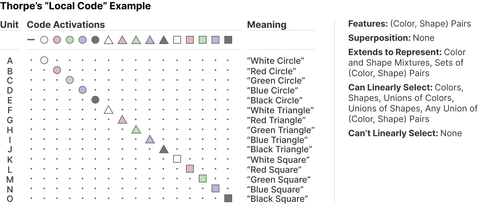
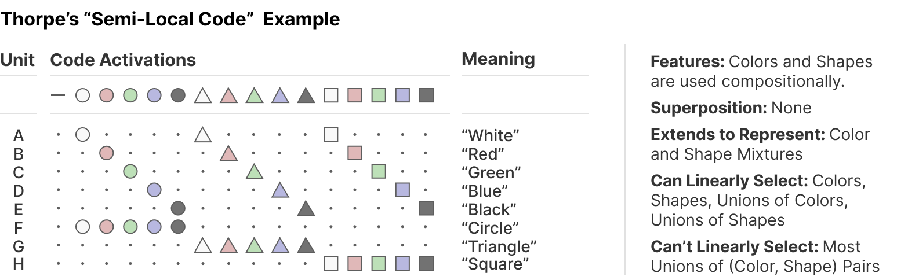
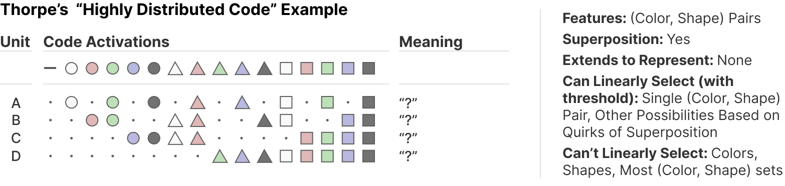
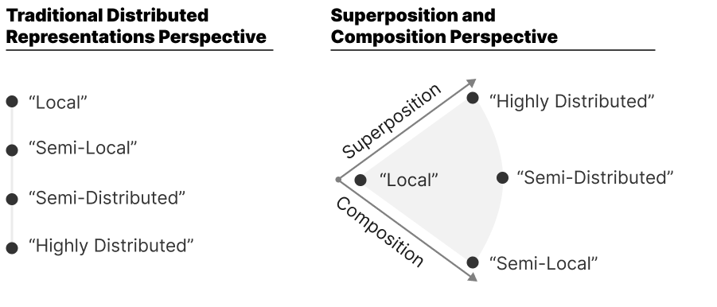
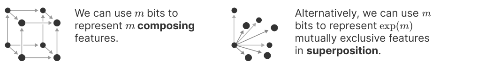
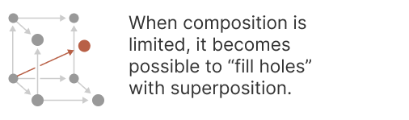
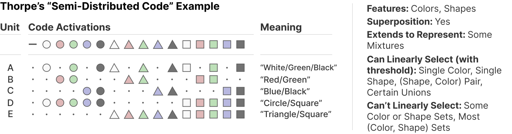
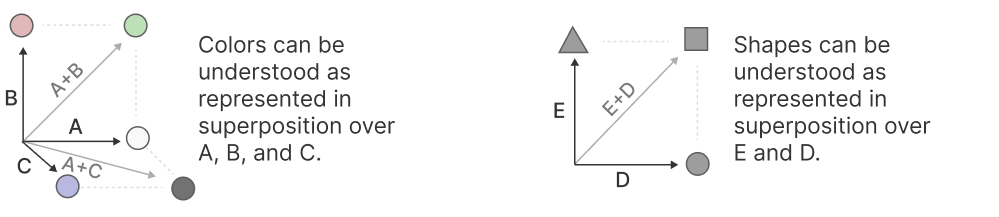

# 分布式表示：组合与叠加

*May 24, 2023 · 原文: https://transformer-circuits.pub/2023/superposition-composition/index.html*

---

分布式表示是神经科学与联结主义 AI 方法中的一个经典概念。我们经常被问及我们的叠加研究与之有何关系。自从发布了关于叠加的[原始论文](https://transformer-circuits.pub/2022/toy_model/index.html)之后，我们有更多时间思考这两个主题之间的关系，并与人们进行了讨论；我们想在此扩展相关工作部分中的[早期讨论](https://transformer-circuits.pub/2022/toy_model/index.html#related-codes)，分享一些想法。（我们非常在意叠加与分布式表示的结构，因为将表示分解为独立组件[是逃离维度灾难并理解神经网络所必需的](https://transformer-circuits.pub/2022/mech-interp-essay/index.html)。）

在我们看来，"分布式表示"或许可以理解为包含两种不同的思想，我们分别称之为"组合"与"叠加"。[^1] 在泛化性质以及能从中线性计算出的函数方面，这两种不同的分布式表示概念具有非常不同的特性。虽然一种表示可以同时利用两者，但存在一种使它们根本对立的权衡！[^2]

为了具体说明，我们将考虑神经元表示不同颜色形状的几种潜在方式。这些可爱的例子借自 [Thorpe (1989)](https://persee.fr/doc/intel_0769-4113_1989_num_8_2_873)，他创造这些例子是为了演示神经科学中"局部编码"（local code）与"分布式编码"（distributed code）之间的各种可能性。Thorpe 提供了四种示例编码——"局部"（local）、"半局部"（semi-local）、"半分布式"（semi-distributed）与"高度分布式"（highly-distributed）。这些编码传统上可能被视为处于"局部"与"分布式"之间的谱系上。我们将再次审视这些例子，并提出另一种观点：这些例子其实是在叠加与组合这两个不同维度上变化。

与 Thorpe 一样，本笔记将聚焦于神经元具有二值激活的例子。这大大简化了可能性空间，但该空间仍然丰富到足以提出有趣的问题。[^3]

#### "局部"编码

我们从 Thorpe 所称的纯"局部编码"开始。在这种设定中，每个（形状，颜色）组合都有一个对应的神经元。用我们的语言来说，这个模型是"单语义的"，并且没有任何叠加。

这个例子看起来可能既愚蠢又浪费，但值得注意的是，这种编码实际上具有相当多有趣的性质！例如，它可用于表示任意的刺激集合——比如一个红色圆形和一个蓝色方形。另外，如果在它之上再构建一层神经网络，那么"能从中线性选出什么"就是一个非常值得问的问题，而且答案也极其灵活。未来的某个神经元可以用线性函数做到类似"对黑色圆形和白色三角形激活，但对黑色三角形或白色圆形不激活"的事情。其他编码做不到这一点！

这个例子对于思考线性探针研究方法论也很有启发。在我们的玩具例子中，探询"红色"这样的特征是否存在是非常合理的，而在上述例子中，线性探针当然能够预测它！然而，尽管如此，我们似乎不应该把上面的例子理解为具有"红色"特征。

#### "半局部"编码 / 组合式编码

另一种自然的做法是用神经元表示独立特征（如"绿色"、"方形"），并用组合来表示对象。Thorpe 称之为"半局部编码"，也有人可能称之为"稀疏编码"。

我们认为它使用的是另一组不同的特征——颜色与形状，而非（颜色，形状）组合对——这些特征可以组合在一起来表示（颜色，形状）刺激。

这种表示是"分布式的"，其意义在于：表示一个对象被分散到相互组合的独立特征上。这通常就是机器学习中人们谈论分布式表示时的含义。一个经典例子是 Mikolov (2013) 的发现——令整个社区大为兴奋！——词嵌入把"性别"、"复数"等词的性质表示为嵌入空间中的不同方向向量。

对于神经网络而言，使用"组合式"分布式表示有几个优势：

- 神经元数量：与"局部编码"相比，这种组合式编码所需的神经元少得多！特征组合允许 $n$ 个特征（如绿色）组合成潜在的 $\exp(n)$ 种组合（如（绿色，方形））。
- 统计效率：组合允许"非局部泛化"（关于绿色圆形的数据可以改进绿色方形的表现）。[^4]
- 可扩展性：这种编码可以扩展来表示中间对象或不确定性。紫色形状？用红色和蓝色的混合！圆角方形？也许加点圆形。在某种意义上它会"意外泛化"！

从可解释性的角度来看，组合式表示也极为有利——尽管组合空间可能是指数的，我们仍然可以[用单个组件来理解它们](https://transformer-circuits.pub/2022/mech-interp-essay/index.html)。

#### "稠密"编码 / 最大叠加

前面的编码比"局部"编码需要的神经元更少，但还有另一种分布式表示，它只用 4 个神经元就能表示所有彩色形状（正如 4 个比特可以表示 16 个数）。这种编码有时被称为"稠密"编码。在我们的框架中，这就是最大叠加。

像这样的稠密编码有一个很酷的优势：它能表示远超神经元数量的、完全不相关的对象。但请注意，它也有很多代价。用线性探针无法通用地选出大多数颜色或形状，更不用说集合了。你通常也无法表示这些特征"之间"的对象（例如"圆角的紫色方形"）。

同样值得注意的是，除了使用叠加之外，这种编码还有一个微妙的变化。它回到了"局部"编码所使用的（颜色，形状）组合特征，而不是"半局部"组合式编码所使用的独立颜色与形状特征。这是因为，正如我们将在下一节看到的，最大叠加只有在不存在组合时才可能实现。因此，这种编码需要使用一组不相互组合的特征。

#### 组合与叠加

人们很容易把这些编码视为在"分布式程度"上处于连续谱系之中。"局部"编码一次激活一个神经元，需要很多神经元。"半局部"编码一次激活两个神经元，需要的神经元更少。"高度分布式"编码似乎只是把这一趋势进一步推进——它有时一次激活四个神经元，并且需要的神经元最少。

但我们认为，"半局部"编码与"高度分布式"编码实际上采取了两种完全不同的正交策略：组合与叠加。（Thorpe 还有一种"半分布式"编码，我们认为它混合使用了两种策略；我们稍后会讨论它。）

事实上，从某种意义上说，叠加与组合作为策略是根本竞争的。如果一个人有 $m$ 比特来编码刺激，我们可以认为存在 $\exp(m)$ 的体积。存储 $n$ 个可任意相互组合的特征需要 $\exp(n)$ 的体积；因此 $m$ 比特只能存储 $m$ 个完全可组合的特征。但如果没有组合，则可以在叠加中存储 $\exp(m)$ 个项目，尽管检索它们需要非线性。

也就是说，组合与叠加是分配指数体积的两种不同方式。（Toy Models of Superposition 那篇论文或许可以被视为从根本上探索这种权衡，尽管它是以特征稀疏性这一等价概念而非组合来表述的。）

如果"分布式表示"确实由两种不同、相互竞争且性质迥异的策略组成，那么区分它们似乎就很重要了。例如，有时分布式表示被描述为既能提供非局部泛化的好处，又能表示比神经元更多的特征，但这两个性质实际上似乎在相互权衡，因为一个与组合相关，另一个与叠加相关。

#### 混合组合与叠加

组合与叠加是相互竞争的策略，但事实证明它们并不像听起来那样完全不相容。这些组合式表示通常每次只会用到少量特征，而且许多特征是互斥的。在某种意义上存在"有限组合"。也就是说，特征是稀疏的，其值通常为 0。

当特征稠密时（即组合很常见），网络每个神经元只能表示一个特征。但当特征稀疏时（多个特征的组合很罕见），叠加[就变得可能](https://transformer-circuits.pub/2022/toy_model/index.html#demonstrating-basic-results)。

一种理解方式是：虽然 $n$ 个特征可以组合成 $\exp(n)$ 种组合，但如果组合受限，组合空间中就会存在"空洞"或低概率区域，可用于在叠加中存储其他特征。[^5]

Thorpe 最后的"半分布式"编码或许可以看作是这方面的一个例子。它仍然以组合颜色与形状特征的方式来表征事物，但把颜色特征置于相互叠加中，形状特征也置于相互叠加中。

虽然这些单元开始具有一些意义——它们是多语义的，但只对少数特征作出响应——但从我们的视角来看，更自然的做法是把这种编码理解为：神经元的线性组合（即方向）对应于特征。例如，A+B=绿色，D+E=方形。这就是我们所说的"这种编码在叠加中表示可组合的形状与颜色特征"的含义。

#### 结论

在我们看来，人们所称的"分布式表示"包含两种不同的东西：叠加与组合。虽然可以混合使用它们，但它们之间存在根本张力。区分它们似乎很重要，因为它们具有非常不同的性质。

理解表示的结构很重要，因为它们从根本上处于逆向工程与机制性理解神经网络工作的核心。当神经网络表示以我们所称的"组合"的方式分布时，就有可能用线性数量的独立特征而非指数规模的体积来理解它们。如果我们希望真正理解神经网络，这一点[似乎至关重要](https://transformer-circuits.pub/2022/mech-interp-essay/index.html)。

## 脚注

[^1]: 还有第三种平凡意义上的"分布式表示"：如果我们把神经激活视为构成一个向量空间，那么它不过是我们不会视为分布式的某种表示的旋转版本。用我们此前工作的术语来说，特征不与基的维度对齐，也许是因为不存在"特权基"。我们将忽略这种平凡类型的分布式表示，既因为它不改变基本的几何结构，也因为仅用二值神经元无法演示它。

[^2]: 与所有跨学科研究一样，存在一种风险：我们可能遗漏了某些阐明这一区分的先前重要工作。我们当然对神经编码或联结主义方面的研究没有全面的了解，也无意声称任何新颖性。我们写这篇非正式笔记的目的，是把我们与"叠加"这一现象相关的挑战置于分布式表示研究的背景下，并展示它与特征组合的关系。这些领域的研究者很可能早已观察到这一点。如果您知道此类先前工作，我们将非常感激您提供参考文献。

[^3]: 我们有时会描述这些思想如何推广到具有连续激活的版本；在这些情况下，我们的思考深受[线性表示](https://transformer-circuits.pub/2022/toy_model/index.html#motivation-directions)思想的影响——特征对应于方向。

[^4]: 我自己对分布式表示的思考深受约 2013 年与 Yoshua Bengio 的对话影响，我理解他强调了分布式表示的非局部泛化。这种泛化对神经网络的性能必定非常重要！

[^5]: 这一观察本质上是压缩感知（compressed sensing）——研究极稀疏向量何时可被恢复的数学领域——关键结果之一的非正式、简化重述。总的来说，压缩感知非常有助于理解叠加何时可能实现。它表明，实际上，如果组合受限（即只允许固定数量的特征共同激活），叠加的量可以随神经元数量呈指数增长。
