# 叠加、记忆与双重下降

*2023 年 6 月 24 日 · 原文: https://transformer-circuits.pub/2023/toy-double-descent/index.html*

---

在[最近的一篇论文](https://transformer-circuits.pub/2022/toy_model/index.html) \cite{elhage2022superposition}中，我们发现，在玩具任务上训练的简单神经网络经常表现出一种名为叠加（superposition）的现象 \cite{arora2018linear,goh2016decoding,olah2020zoom}：网络表示的特征数超过了它的神经元数。我们此前的调查仅限于无限数据、欠拟合的情形。但我们有理由相信，如果希望在机制可解释性上取得成功，理解过拟合可能至关重要，而叠加或许正是这个故事的核心。

为什么机制可解释性要关心过拟合？尽管过拟合是机器学习的核心问题之一，但对于深度学习模型过拟合或记忆样本时究竟发生了什么，我们几乎没有机制层面的理解。此外，之前的工作也暗示，过拟合与学习可解释特征之间可能存在重要联系 \cite{hilton2020understanding}。

所以，理解过拟合很重要，但它与叠加有什么关系呢？考虑一个逐字记忆文本的语言模型。它如何做到这一点？一个天真的想法是：它可能用神经元构造一张查找表，把序列映射到任意的后续内容。对于它想记住的每一个词元（token）序列，它都可以专门用一个神经元来检测该序列，并在其触发时实现任意行为。这种方法的问题在于效率极低——但它似乎是叠加的完美候选，因为每种情形互斥，不会相互干涉。

在这篇札记中，我们对此前论文中的同一玩具模型（toy model）在有限数据集上的训练进行了一项非常初步的探索。尽管极其简单，玩具模型却意外地成为研究过拟合的丰富案例。具体来说，我们发现：

- 过拟合对应的是在叠加中存储数据点，而非特征。
- 取决于数据集大小，我们的模型会落入两种不同的区域：过拟合区域（其特征是在叠加中存储数据点）与泛化区域（其特征是在叠加中存储特征）。
- 当模型在这两种区域之间过渡时，我们观察到双重下降 \cite{belkin2019reconciling,advani2020high,geiger2019jamming,nakkiran2021deep}。

#### 实验设置

我们假设，真实神经网络在稀疏、高维的"特征"空间中执行运算，但由于这些特征以叠加方式存储，我们很难直接看到它们。受此启发，我们尝试用稀疏、高维且非负的合成输入向量 $x$ 来模拟这一特征空间（类似于我们的[此前论文](https://transformer-circuits.pub/2022/toy_model/index.html#demonstrating-setup-x)）。具体地，$x \in \mathbb{R}^n$ 是一个 $n=10,000$ 维向量。我们令每个特征 $x_i = 0$ 的概率为 $S=0.999$，否则在 $[0, 1]$ 上均匀分布。不过与之前的工作不同，我们随后对 $x$ 重新缩放，使 $||x||^2 =1$，因为这将使训练样本的记忆变得更加容易 [^1] [^2]。我们还考虑了有限大小 $T$ 的训练集，而此前的工作只考虑了 $T=\infty$。我们用 $X \in \mathbb{R}^{n \times T}$ 表示训练数据矩阵，其中每一列 $X_i$ 是一个训练数据点。

我们考虑如下定义的 ["](https://transformer-circuits.pub/2022/toy_model/index.html#demonstrating-setup-model)[ReLU Output](https://transformer-circuits.pub/2022/toy_model/index.html#demonstrating-setup-model)[" 玩具模型](https://transformer-circuits.pub/2022/toy_model/index.html#demonstrating-setup-model)：

ReLU Output 模型

$h\approx Wx$

$x'\approx\text{ReLU}(W^Th+b)\approx\text{ReLU}(W^TWx + b)$

其中 $W$ 采用 Xavier 初始化 \cite{glorot2010understanding}。模型以最小化均方重建误差为目标进行训练。

$$L = \frac{1}{T} \sum_x \sum_i I_i (x_i - x'_i)^2$$

在本工作中，我们只考虑均匀重要性 $I_i = 1 \quad \forall  i$。

我们使用 AdamW \cite{loshchilov2017decoupled} 优化器进行 50,000 次全批次更新，而非小批次更新。我们的学习率调度包含 2,500 步线性预热至 1e-3，随后余弦衰减至零。训练更新的次数、全批次优化的使用以及退火的学习率，对我们的结果似乎都很重要。我们专注于极低维的隐藏空间，这似乎使优化问题变得更加困难。此外，极其稀疏的特征使梯度的噪声大得多。因此，用全批次进行大量步数的优化，对得出这些结果至关重要。在部分实验中，我们还会使用不同的随机种子进行参数初始化并训练多个模型，然后选择训练损失最低的那个，以避免局部极小值。不过，我们定性地发现，对于 $m>3$ 的模型，这些敏感性已大大降低。

除非另有说明，我们使用 $1e-2$ 的权重衰减。与之前的工作一致，我们发现双重下降在权重衰减值较低时最强，反之亦然。

#### "数据点特征" vs "泛化特征"

在我们此前论文描述的"正常叠加"中，我们发现模型嵌入的特征数超过其维度数，且常常将特征映射到正多胞形上。例如，若模型的隐藏空间是二维的，稀疏特征将排列成五边形：

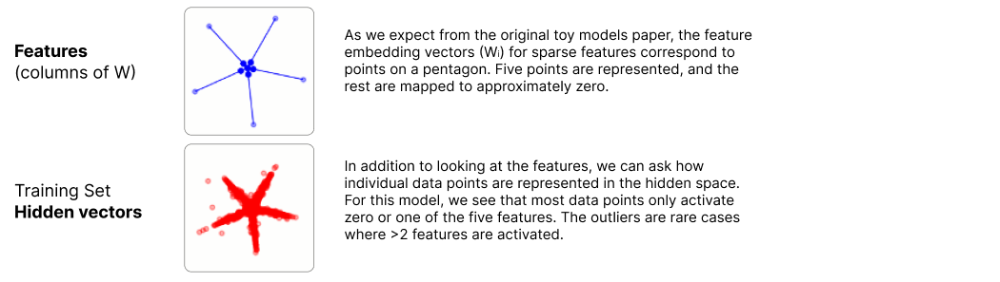

但如果我们在有限数据集上训练模型，会发生什么？事实证明，从特征的角度看，我们得到的模型往往显得杂乱费解；而从数据点激活的角度看，它们却非常简单清晰。

让我们可视化几个在不同大小数据集上训练、含有大量稀疏特征的 ReLU 输出模型。我们将聚焦于 $m=2$ 个隐藏维度的模型。选择二维隐藏空间是为了便于直接可视化，而任务设置则被选为能产生我们想突出现象的最极端版本。[^3] 若像此前论文那样可视化 $W$ 的各列，一切都会"杂乱无章"，形成复杂的特征散点而非整齐的多边形。但若改而可视化训练集的隐藏向量（$h_i = W X_i$），我们会看到清晰的结构：

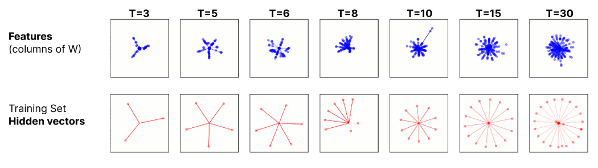

被表示为多胞形的是数据点——而非特征！[^4] 我们可以把这些模型看作在操作另一种特征：用于记忆的"单个数据点特征"，而非"泛化特征"。这暗示了一种关于过拟合与记忆的朴素机制理论：当模型操作于"数据点特征"而非"泛化特征"时，记忆和过拟合便发生。我们预期这一朴素理论过于简单，但它似乎有可能指向有用的原理！

#### 模型如何随数据集大小而变化？

当数据集变大时会发生什么？显然，在小数据区域——模型"把数据点当特征用"——与无限数据区域——模型学习真正的、可泛化的特征——之间，我们的玩具模型行为迥异。那么在这两者之间呢？

在原始论文中，"特征维度"这一概念有助于研究特征几何如何随模型变化。在这篇札记中，我们将扩展特征维度的概念（在本文余下部分记为 $D_{f_i}$），用它同样定义训练样本的维度 $D_{X_i}$ 为：

$$D_{X_i} \approx \frac{||h_i||^2}{\sum_j (\hat{h_i} \cdot h_j)^2}$$

其中 $h_i=W X_i$ 是与训练样本 $X_i$ 关联的隐藏向量，$\hat{h_i}$ 是 $h_i$ 方向上的单位向量。若训练样本以 $T$ 边形嵌入 $m=2$ 的空间，我们应预期每个训练样本的维度为 $m/T$。

现在，我们可以可视化特征与数据点的几何如何随数据集大小而变化。下图中间的面板是特征维度与训练样本维度随数据集大小变化的散点图（上方面板中的测试损失将在后文讨论）。

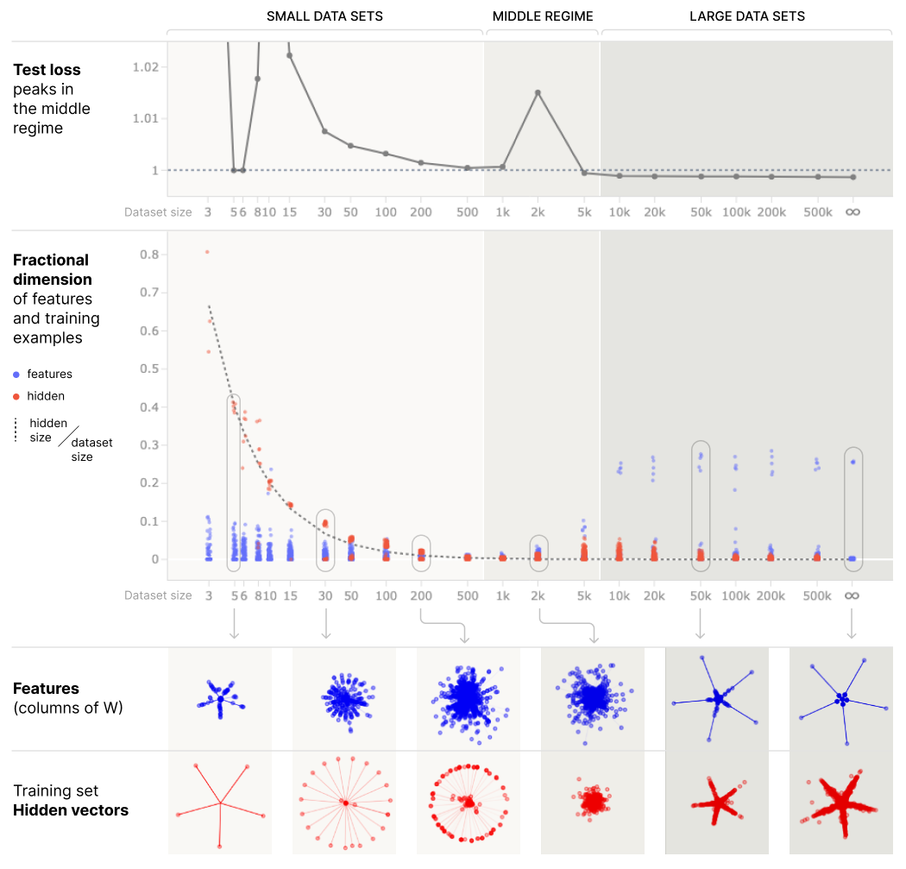

在左侧的小数据区域，我们看到特征维度很小，而训练样本维度如预期那样遵循 $m/T$。在底部红色的向量图中，我们看到模型用 $T$ 边形来组织这些 $h_i$。事实上，若给予无限浮点精度，ReLU 输出模型可以用 $T$ 边形记忆任意数量的标准正交训练样本。这促使我们选择对训练样本做归一化；不过若 $W$ 与 $W_{up}$ 是解绑的（untied），这一约束可以放宽。更多细节见这个 [Colab 笔记本](https://colab.research.google.com/drive/1AREdeODhgsQ_ukqPKnhWQ4bijVqTa4eW?usp=sharing)。

在右侧的大数据区域，我们看到 5 个特征的维度很大，而其余特征及训练样本的维度都很小。蓝色的向量图显示，这 5 个特征以五边形表示，其余特征则基本被忽略。我们在[这个 Colab](https://colab.research.google.com/drive/1PTGgQt6OuWfAPi2iNn_myB4gQo-8ORAI?usp=sharing)中提供了为什么应预期这种约 5 个特征的解的一些直觉。五边形特征的分数维度明显小于预期的 2/5。我们认为，这是因为还有大量其他特征（9,995 个），它们各自微小的贡献加在一起，在 $D_{f_i}$ 的分母中占了不少比例。

大多数数据样本只在 5 个五边形特征中的 0 个或 1 个上取非零值，这使得隐藏向量在右下角的红色子图中同样描出五边形。离群点代表那些具有 >1 个非零值的罕见情形。

在这两个极端之间，情况更加杂乱，也更难解释。

上图中红色与蓝色的向量图并未使用一致的刻度。改用一致刻度后（见下图）可以发现，隐藏向量与特征向量的长度都随数据集大小大幅变化：在 $T=30$ 附近达到峰值，随后在中间区域迅速下降，在大数据区域趋于平稳。绘制 $W$ 的 Frobenius 范数和 $b$ 的 l2 范数，可以看到模型参数呈现同样的趋势。

关于这些趋势的几点评论：

- 小数据区域：可以证明，通过 $T$ 边形记忆标准正交训练样本的模型，其 $W$ 和 $b$ 应随 $T$ 增大而变大（更多细节见这个 [Colab](https://colab.research.google.com/drive/1AREdeODhgsQ_ukqPKnhWQ4bijVqTa4eW?usp=sharing)）。这与 $T<30$ 时观察到的行为一致。
- 大数据区域：直观上看，一旦模型有足够的数据进行泛化（即五边形），再增加数据只会带来相对微小的变化。这与我们在大数据区域观察到的平台期相符。在我们对无限数据的[过度简化的解](https://colab.research.google.com/drive/1PTGgQt6OuWfAPi2iNn_myB4gQo-8ORAI?usp=sharing)中，我们得到 $||W|| = \sqrt{5} \approx 2.2$，它出人意料地接近真实值（尽管我们 $b=0$ 的假设显然不现实）。

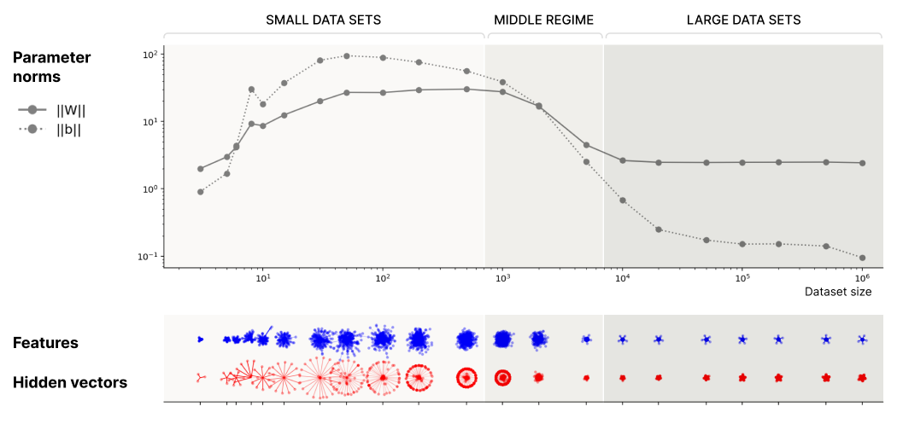

#### 叠加中的双重下降

模型在两种不同的区域中行为迥异、中间地带行为怪异，这一现象与双重下降惊人地相似 \cite{belkin2019reconciling,advani2020high,geiger2019jamming}，尤其是"数据双重下降"（例如 \cite{nakkiran2021deep}）。数据双重下降的一个惊人现象是：测试损失先变差、后变好——这违背了"更多数据总是应该减轻过拟合"的朴素直觉！

对于给定的 $T$，模型的解取决于随机选取的训练集：有些训练集适合记忆（例如标准正交的训练样本），有些则适合泛化。为确保结果并非偶然，我们对每种数据集大小都训练了 4 个使用不同数据集随机种子的模型。然后我们绘制平均测试损失（即第一张图的上方面板），可以看到在"叠加中的数据点"区域与"叠加中的泛化特征"区域之间的过渡处有一个明显的凸起。

值得注意的是，我们是在没有标签噪声的情况下观察到双重下降的。也就是说：输入与目标完全相同。这里的"噪声"来自下投影中发生的有损压缩。即使是在稀疏极限下，也不可能用线性投影把 10,000 个特征编码进 2 个神经元。因此，重建必然不完美，产生不可避免的重建误差，从而带来双重下降 \cite{maloney2022solvable}。

#### $m$ 对双重下降的影响

至此，人们自然会怀疑：双重下降会不会只是 $m=2$ 个隐藏维度或优化困难造成的假象？在本节中，我们将确认并非如此。我们还将探讨双重下降文献中的某个主题——不要把它理解为一维现象，而是模型规模、数据集大小与训练之间的多维交互 \cite{nakkiran2021deep}。

我们将双重下降可视化为同时随训练样本数 $T$ 与隐藏维度数 $m$ 变化的二维函数。所有其他超参数与上文相同。我们对每个 $(T,m)$ 配置训练四个模型，并对所得损失取平均。我们凭经验发现，对于 $m>3$，优化能给出远为一致的结果。

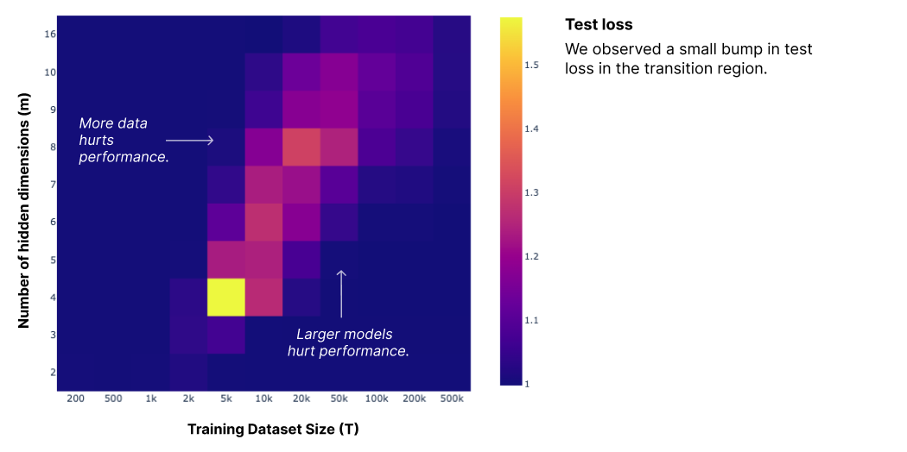

显然存在发生"双重下降"的区域——即更大模型或更多数据反而损害性能的区域。

与既有的双重下降研究一致，这些结果对权重衰减和训练轮数很敏感。在附录中，我们展示了对于 $m=4$ 的模型：

- 训练轮数越多，测试损失凸起越明显
- 将权重衰减从 1e-2 提高到 1.0 会完全消除该凸起

#### 结论

我们发现，在玩具模型中，记忆可以理解为模型在叠加中学习"单个数据点特征"。当模型从表示数据点的策略转向表示特征的策略时，会表现出双重下降。

还有更多值得探索的问题。最明显的问题是：这些结果所暗示的关于过拟合的朴素机制理论，究竟能否推广到真实模型？但即便只在玩具模型的语境中，也有很多问题值得追问：

- 当模型同时学习特征与单个数据点特征时，会发生什么？（或许可以利用部分重复的数据来研究这一点，如 \cite{hernandez2022scaling} 所示。）
- 在模型从一种策略过渡到另一种策略、损失飙升的“中间区间”，究竟发生了什么？这些模型在机制层面正在做些什么？
- 是否存在某种“什么是特征”或“如何识别特征”的概念，能够同时涵盖泛化特征与单个数据点？

  
  
  
  
  

### 评论与复现

受最初的 [Circuits Thread](https://distill.pub/2020/circuits/) 与 [Distill 的讨论文章实验](https://distill.pub/2019/advex-bugs-discussion/) 启发，作者邀请了几位此前与我们讨论过初步结果的外部研究者对本工作发表评论。他们的评论收录如下。

#### 复现

[Adam Jermyn](https://adamjermyn.com/) 是一位专注于 AI 对齐与可解释性的独立研究者。

在看到初步结果后，我针对隐藏维度 $m=2$ 的模型复现了“模型如何随数据集大小变化？”一节的实验结果。总体而言，我得到了良好的定性一致性。我的结果与论文所示结果之间存在一些定量差异，但我不认为这些差异会影响任何结论。

下图对应那一节的第一张图，显示出定性相似的特征：

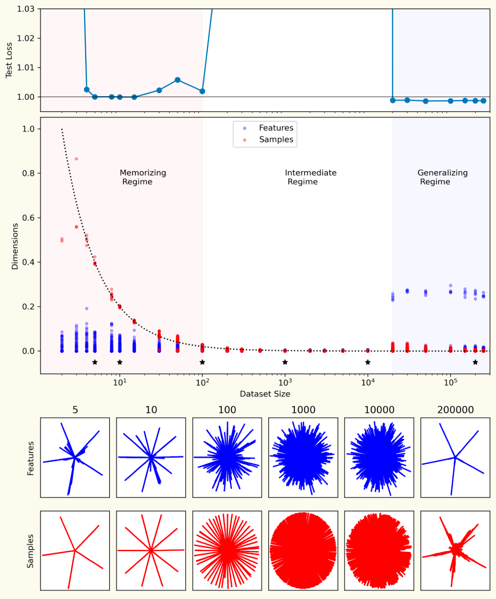

具体而言，这次复现显示了同样的三区间划分：在小的数据集上记忆样本，在大的数据集上学习泛化特征，而在两者之间则发生更复杂的行为；我的模型与论文所示模型的样本嵌入和特征嵌入在定性上也十分相似。

在我看来，这与论文中对应的图存在三点差异，而且我认为它们之间可能存在关联：

1. 在我的模型中，泛化特征区间的起始点出现在更大的数据集规模处：我在 T=20,000 时才看到它出现，而论文中它在 T=5,000 时就开始出现了。
1. 我的模型中，中间区间的起始点出现在更小的数据集规模处（T ~ 100 对 T ~ 700），无论以样本嵌入偏离均匀分布的程度来衡量，还是以测试损失的跳升来衡量，都是如此。
1. 我的模型在中间区间的测试损失要大得多：最高可达 5,000，而论文中约为 1.01。

我多次运行我的模型，并确认不同的实例都重现了这些差异。我至今未能确定这些差异的来源；就我所知，我完全是按照文中的描述训练模型的——当然，也有可能是我遗漏了什么！

我还复现了同一节的第二张图：

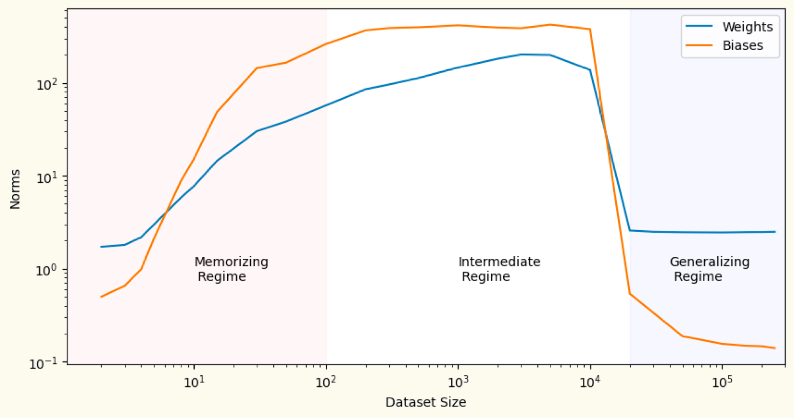

总体趋势非常相似。特别是：

1. 在数据集规模较小时，偏置范数起初小于权重范数；数据集稍大后，偏置范数变得大于权重范数；而在泛化区间中，偏置范数又再次变小。
1. 两种范数都随数据集规模增大而上升，而一旦模型学会泛化特征，两者又会迅速回落。

这里同样存在差异，不过这些差异是定量而非定性的。具体来说，我的模型中偏置范数的峰值大约是论文中的 3 倍；此外，在 T=100–1000 的范围内我看到权重范数有所上升，而论文的图则更接近一个平台。

原作者回应：感谢你的复现！看到所有结果都在定性上得到重现，真是太好了。我们不确定是什么导致了相变发生时数据集规模的偏移。看起来我们的实验设置之间必定存在某个超参数差异，但我们不确定它到底是什么！不过，因为我们真正关心的只是相变的存在性，而不是它在这个玩具问题中恰好发生在哪里，所以我们并不太在意找出确切的差异。

#### 复现

[Marius Hobbhahn](https://www.mariushobbhahn.com/) 是图宾根大学的博士生。

我复现了《叠加、记忆与双重下降》论文中的大部分发现。我改变了实验设置，将稀疏性和特征数量分别缩小到原来的 1/10，仍然发现了论文所描述的双重下降现象，特征与隐藏向量的构型也非常相似。我还在其他多种设置下发现了双重下降，例如使用不同的损失函数，或在层之间添加 ReLU 激活时。从这些发现中，我初步得出的结论是：双重下降是一种相当常见的现象，我们应当预期它会在许多设置中出现。（细节可参见我的文章 [More Findings on Memorization and Double Descent](https://www.lesswrong.com/posts/KzwB4ovzrZ8DYWgpw/more-findings-on-memorization-and-double-descent)。）

#### 扩展：什么决定了泛化规模？

[Adam Jermyn](https://adamjermyn.com/) 是一位专注于 AI 对齐与可解释性的独立研究者。

阅读这篇论文时，我产生了一个疑问：是什么决定了模型学习泛化特征时的规模？当我提出这个问题时，作者给出了两个可能的假说：

1. 这是数据点叠加失效的规模（例如由于权重衰减限制了权重范数）。
1. 这是特征以不同组合多次出现的规模，从而使它们能够被区分开来。

第一个假说预言：增大权重衰减率应当会减小泛化规模。

下图展示了以不同权重衰减率训练的模型中特征的维度。折线表示最大特征维度，点与线的颜色按权重衰减率区分。

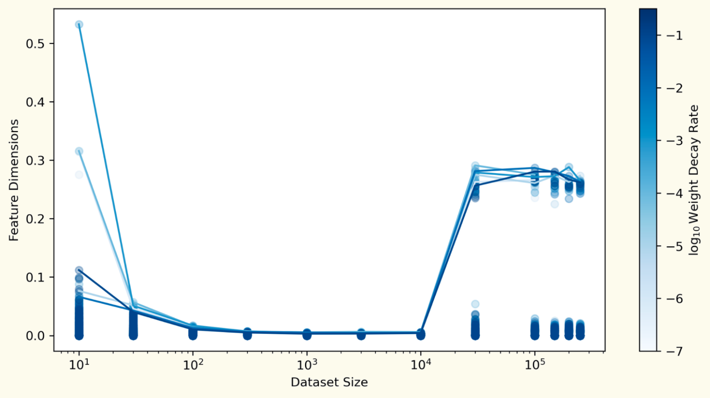

泛化规模对应于维度上的一个跳变。重要的是，这一规模似乎并不随权重衰减率而变化，这为反驳第一个假说提供了证据。

第二个假说预言：一旦数据集大到足以包含每个特征的多个实例，泛化规模就会出现。也就是说，它出现在 $T \propto 1 / (1-S)$ 处。

下图展示了以不同权重衰减率训练的模型中特征的维度。折线表示最大特征维度，点与线的颜色按特征频率（$1-S$）区分。横轴现在表示任意给定特征在数据集中出现的期望次数（$T (1-S)$），第二个假说的一个预言是：泛化规模应当在这一尺度上固定不变。

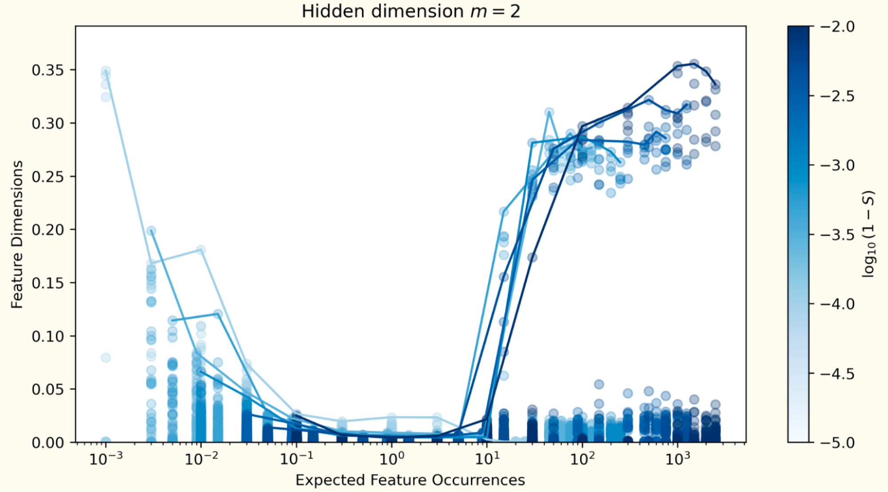

事实似乎确实如此！即使稀疏性相差很大的模型，只要数据集大到足以让每个特征大约出现 10 次，就能学会泛化特征。

尽管这很能说明问题，但尚不清楚这是否就是全部答案。例如，对于隐藏维度更多的模型，维度曲线并不能干净地彼此重合（见下图），而且还有其他令人困惑的趋势（例如在泛化之后，特征维度的峰值随数据集增大而下降），因此似乎可能还有更多机制在起作用。

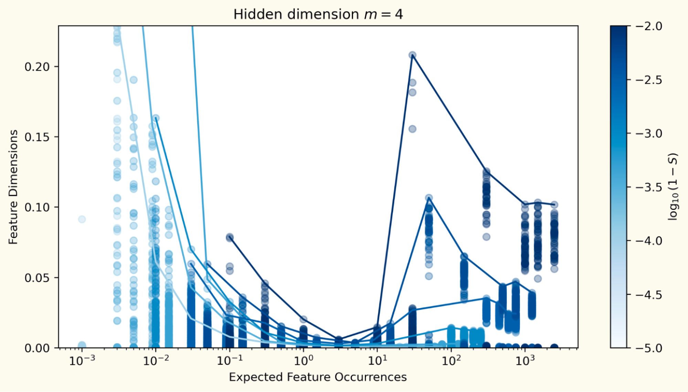

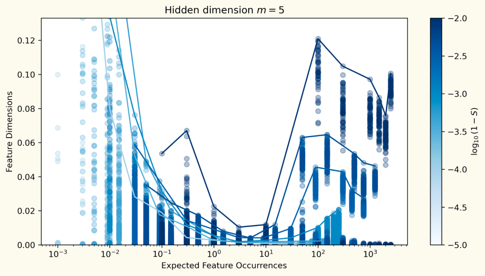

#### 扩展：重复的数据点

[Adam Jermyn](https://adamjermyn.com/) 是一位专注于 AI 对齐与可解释性的独立研究者。

当作者分享初稿时，他们建议研究一下当数据集中重复出现某些数据点时会发生什么，这或许会很有意思。

当一个数据点出现的次数较少（2–3 次）时，现象与本论文中描述的一致；但当重复次数更多时，模型会转而学习数据点与泛化特征的组合。

下图展示了一个 T=30,000、单个特征（黑色）出现 5 次的模型的训练历史：左图为特征与样本维度的训练过程，右图为最终的特征与样本嵌入。这个被重复的特征与四个泛化特征一同嵌入，并压制了第五个，实际上取代了一个通常会被学会的泛化特征。

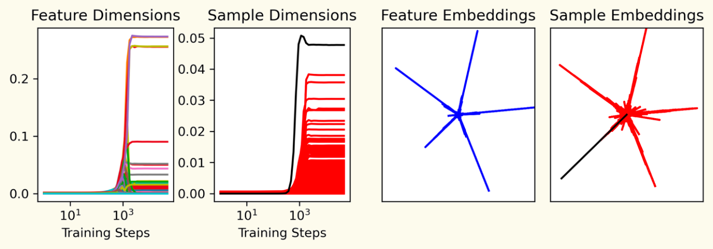

当存在多个重复数据点时，模型会优先学习它们，而每一个都会取代嵌入空间中的一个特征：

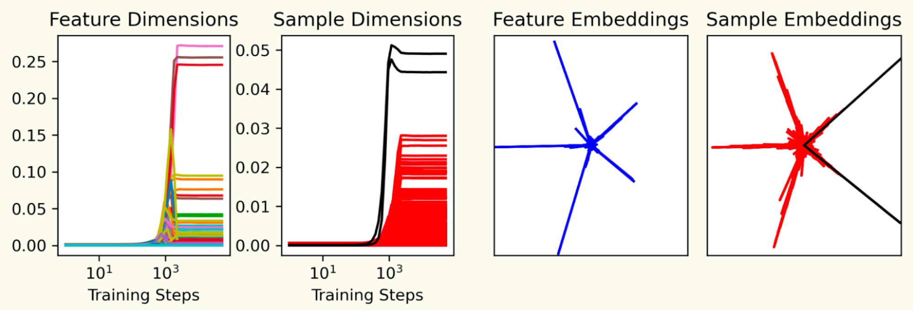

当重复数据点超过五个时，模型会嵌入其中五个，而它原本会学会的全部五个特征都被压制了：

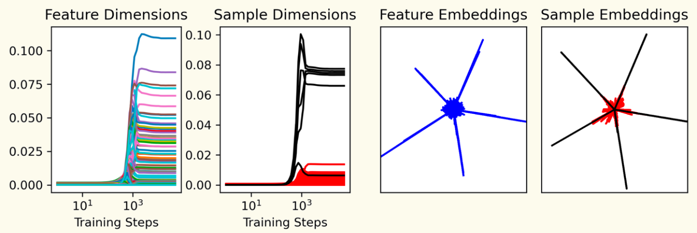

这里出现的一个问题是：一个数据点需要出现多少次才会被记忆？一种思考方式是权衡记忆一个数据点与学习一个特征各自的收益。粗略地说：

1. 某个特征在数据集中出现 $T(1-S)$ 次。如果该特征的振幅为 $A$ 且能被完美学习，那么学习它的损失收益为 $AT(1-S)$。
1. 某个数据点有 $N(1-S)$ 个活跃特征，每个特征的振幅量级为 $A$。如果该数据点出现 $R$ 次，那么完美记忆它的损失收益为 $RNA(1-S)$。
1. 平衡这两种损失收益后可知，当 $R > T/N$ 时数据点会被记忆，这与稀疏性无关。注意，这一论证中省略了常数因子，因此该不等式还应包含一个比例常数。

下图展示了以单个重复特征、隐藏维度 $m=2$ 训练的模型的结果。数据集足够大，模型能够学会泛化特征。符号对应两种不同的设置：“+”对应 $S=0.999$、$N=10,000$，“x”对应 $S=0.99$、$N=1,000$。符号的颜色表示重复数据点是否出现在按嵌入维度排序的前 0.1% 的数据点中（红色为是，蓝色为否）。这是判断模型是否记忆了该数据点的一个粗略代理指标。最后，黑色线条表示 $R=0.4 T/N$。

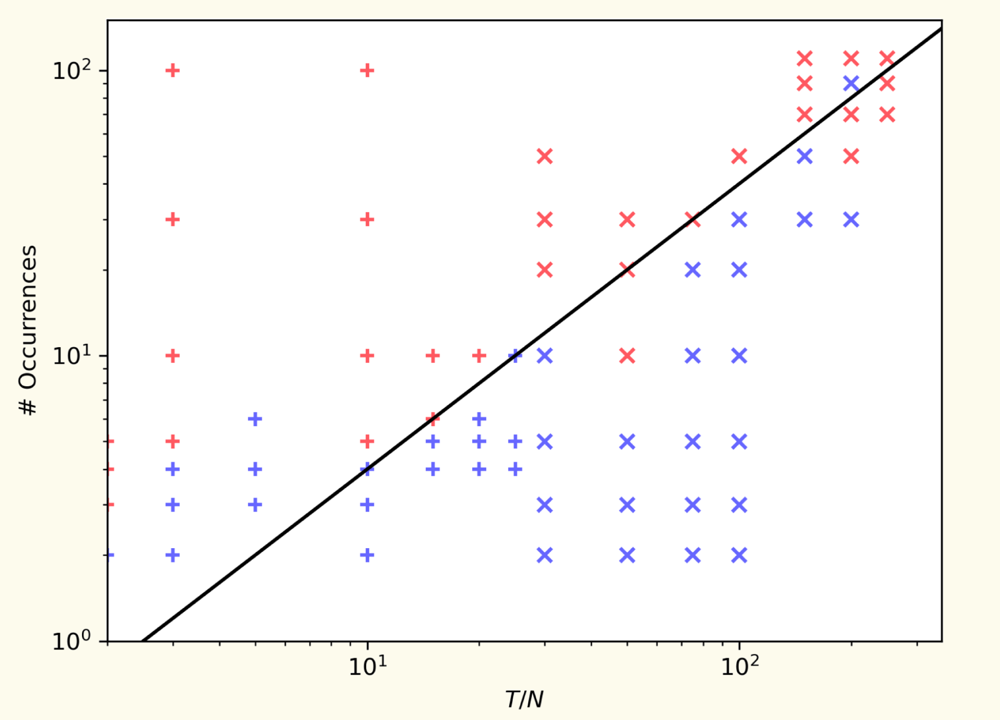

数据有些嘈杂，这在一定程度上可能反映了 $m=2$ 情形下优化的困难，但总体而言：

1. 在 $T/N$ 较小时，模型需要超过 $T/N$ 次的重复才会记忆重复数据点。
1. 在 $T/N$ 较大时，记忆与不记忆重复数据点的分界线与黑色线条重合，对应于 $R \propto T/N$，与上面粗略的分析论证一致。

最后再观察一点：在处于记忆数据点边缘的模型中，我们看到不少“差一点成功”（near miss）的情况——模型先记住了某个数据点，随后又“决定”放弃它！

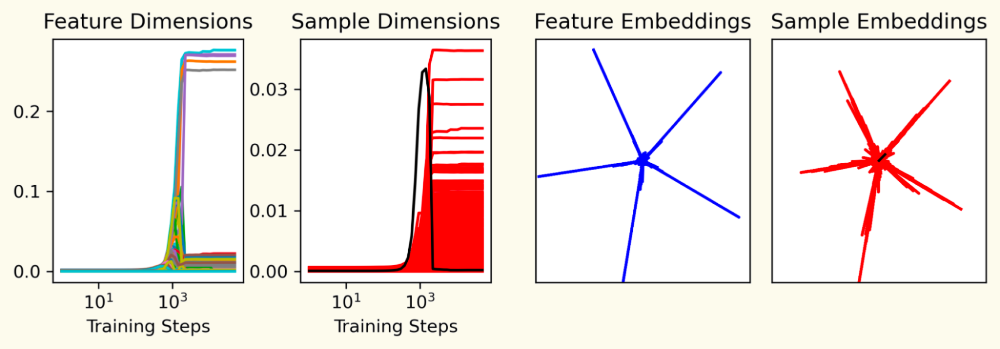

有趣的是，这一现象在中间数据集区间的无重复数据点模型中也有对应：有些模型会短暂地学会泛化特征，却在训练结束时将其遗忘。下面的动画展示了 T=10,000 训练的模型的情况：

#### MNIST 的数据维度

Chris Olah 是原论文的作者之一。这条评论描述了一个我们或许会、或许不会继续展开的小型扩展。

基于这些结果，一个自然的问题是：我们能否用数据维度在真实神经网络中检测出过拟合的、被记忆的样本？作为初步探究，让我们看一个比玩具模型略微不那么玩具的模型——一个具有 512 个隐藏单元的单隐藏层 MNIST 模型。通常，在真实模型中研究叠加很困难，因为我们不知道特征是什么。但研究叠加中的数据点是个例外，因为我们确实知道数据点是什么！

在实践中，我们预期真实模型中的特征并非正交，而且即使某个数据集样本被记忆，它也很可能激活一些“泛化”特征。为了考虑这一点，我们将数据维度的概念稍作修改，改为最大数据维度：

$$D_i^* ~\approx~ \sup_v~\frac{(v\cdot h_i)^2}{\sum_j (v \cdot h_j)^2}$$

直觉上，如果一个样本激活了多个特征，上确界可以选出其中数据维度最高的那个。（事实证明，如果你对网络激活值拟合一个高斯分布，这与数据点的对数似然密切相关。）

下面，我们绘制了所有训练样本的数据维度。可以看到，大多数样本的维度大致相同，但在两个尾部都有少数离群点。引人注目的是，数据维度异常高的样本——几乎比典型样本高出 100 倍！——往往是古怪的离群点。虽然远不能下定论，但人们很容易相信这些样本就是模型“特别处理”（special case）过的“被记忆”样本。

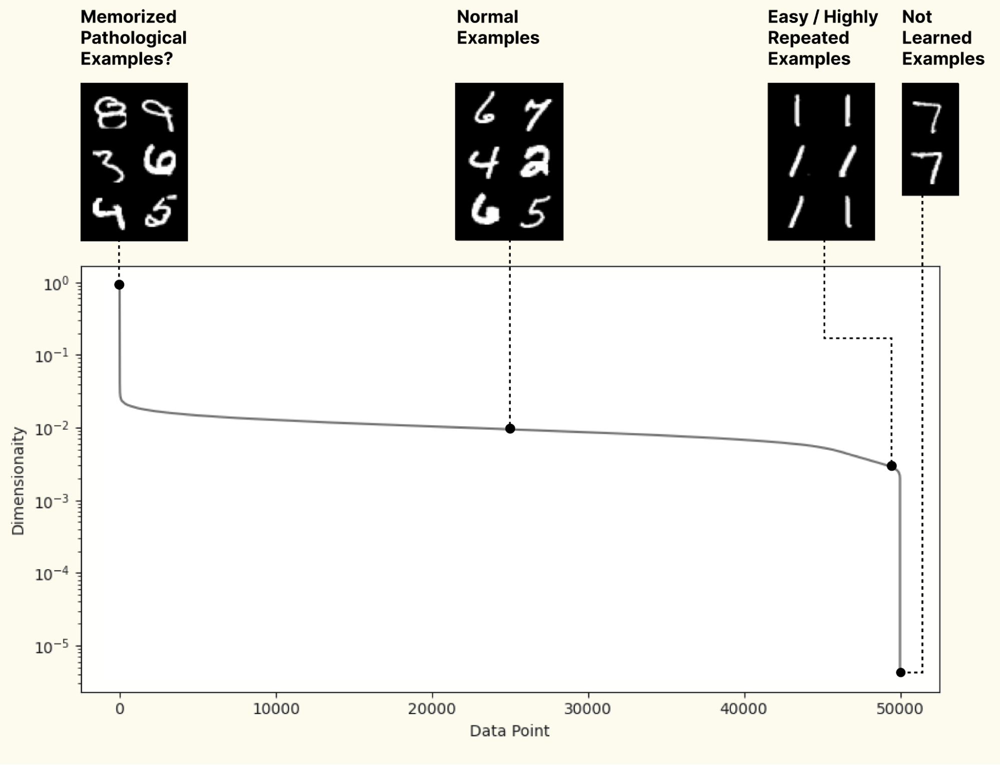

除了检测过拟合之外，人们或许还可以将此视为[机制异常检测](https://ai-alignment.com/mechanistic-anomaly-detection-and-elk-fb84f4c6d0dc)的一个例子——即检测模型是否在出于与平时不同的原因做出决策。当然，我们并不是说模型“触发特殊情形”的所有情况都能如此轻易地被检测出来。恰恰相反，这可能暗示机制异常检测将比人们想象的更加困难，因为它可能被叠加所掩盖。

[Marius Hobbhahn](https://www.mariushobbhahn.com/) 是图宾根大学的博士生。

我可以在最大数据维度上复现这些结果，只有小的偏差。我在许多额外的设置下测试了 $D*$ 的性质，例如在训练的不同阶段、不同的数据集规模以及不同的标签下。我的主要收获是：a) $D*$ 在实践中可能难以算准，但即使它尚未收敛，看起来仍然具有可解释性；b) $D*$ 捕捉到了许多我们预期神经网络会具有的不同性质——例如，将 $D*$ 应用于双重下降设置时，我们可以从该指标中看到从记忆到泛化的转变；c) 它还提出了一些有趣的新研究问题，可能让我们更多地了解神经网络在训练过程中的学习方式，这将是很有意思的后续研究。（细节可参见我的文章 [More Findings on Maximal Data Dimension](https://www.lesswrong.com/posts/WfdxXhszxFc3BxZ8r/more-findings-on-maximal-data-dimension)。）

#### 二维中的优化失败

Chris Olah 和 Tom Henighan 是原论文的作者。

在低数据记忆区间训练 $m=2$ 模型时，我们偶尔会观察到数据点没有组织成一个圆的情形。我们认为这些模型是在两个半径不同的圆上组织数据点，却未能将它们合并。为了确保较小圆上的点能够被线性选择，这些解需要在不同圆上数据点的交界处留出很大的角度间隙。

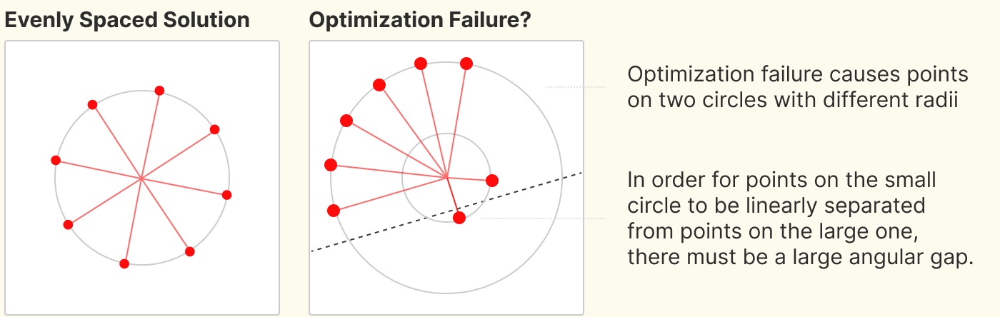

## 脚注

[^1]: 另一种做法是让模型权重 $W$ 解绑，即令 $W_{up} \neq W^T$，不过这样得到的 $h_i$ 长度通常会各不相同，也就不太能构成完美的 $T$ 边形。这种解绑权重的方式很可能更贴近大多数真实神经网络的实际情况。

[^2]: 在 n 非常大的极限下，根据中心极限定理，可以预期训练样本 $x_i$ 具有相等的范数。

[^3]: 我们发现，当数据点彼此正交且量级相近时，模型最明显地"把单个数据点当作特征"来处理（更多细节见此 [Colab notebook](https://colab.research.google.com/drive/1AREdeODhgsQ_ukqPKnhWQ4bijVqTa4eW?usp=sharing)）。高度稀疏的特征会增加数据点正交的概率；而大量特征则能避免"数据点只是单一特征在激活"这一平凡情形。理想情况下，我们更希望只使用足够多的特征，让中心极限定理使数据点具有相近的范数，但要在高稀疏度下实现这一点，就需要大到令人头疼的向量。

[^4]: 这从直觉上说得通：若 $T \ll n$，表示 $T$ 个训练样本（而非 $n$ 个特征）在隐藏的 $m$ 维空间中理应更容易。

## 参考文献

- [elhage2022superposition]: Elhage, Nelson, Hume, Tristan, Olsson, Catherine, Schiefer, Nicholas, Henighan, Tom, Kravec, Shauna, Hatfield-Dodds, Zac, Lasenby, Robert, Drain, Dawn, Chen, Carol, Grosse, Roger, McCandlish, Sam, Kaplan, Jared, Amodei, Dario, Wattenberg, Martin, Olah, Christopher, “Toy Models of Superposition”, Transformer Circuits Thread, 2022
- [arora2018linear]: Arora, Sanjeev, Li, Yuanzhi, Liang, Yingyu, Ma, Tengyu, Risteski, Andrej, “Linear algebraic structure of word senses, with applications to polysemy”, Transactions of the Association for Computational Linguistics, 2018
- [goh2016decoding]: Gabriel Goh, “Decoding The Thought Vector”, 2016
- [olah2020zoom]: Olah, Chris, Cammarata, Nick, Schubert, Ludwig, Goh, Gabriel, Petrov, Michael, Carter, Shan, “Zoom In: An Introduction to Circuits”, Distill, 2020
- [hilton2020understanding]: Hilton, Jacob, Cammarata, Nick, Carter, Shan, Goh, Gabriel, Olah, Chris, “Understanding RL Vision”, Distill, 2020
- [belkin2019reconciling]: Belkin, Mikhail, Hsu, Daniel, Ma, Siyuan, Mandal, Soumik, “Reconciling modern machine-learning practice and the classical bias--variance trade-off”, Proceedings of the National Academy of Sciences, 2019
- [advani2020high]: Advani, Madhu S, Saxe, Andrew M, Sompolinsky, Haim, “High-dimensional dynamics of generalization error in neural networks”, Neural Networks, 2020
- [geiger2019jamming]: Geiger, Mario, Spigler, Stefano, d'Ascoli, St{\'e}phane, Sagun, Levent, Baity-Jesi, Marco, Biroli, Giulio, Wyart, Matthieu, “Jamming transition as a paradigm to understand the loss landscape of deep neural networks”, Physical Review E, 2019
- [nakkiran2021deep]: Nakkiran, Preetum, Kaplun, Gal, Bansal, Yamini, Yang, Tristan, Barak, Boaz, Sutskever, Ilya, “Deep double descent: Where bigger models and more data hurt”, Journal of Statistical Mechanics: Theory and Experiment, 2021
- [glorot2010understanding]: Glorot, Xavier, Bengio, Yoshua, “Understanding the difficulty of training deep feedforward neural networks”, Proceedings of the thirteenth international conference on artificial intelligence and statistics, 2010
- [loshchilov2017decoupled]: Loshchilov, Ilya, Hutter, Frank, “Decoupled weight decay regularization”, arXiv preprint arXiv:1711.05101
- [maloney2022solvable]: Maloney, Alexander, Roberts, Daniel A, Sully, James, “A Solvable Model of Neural Scaling Laws”, arXiv preprint arXiv:2210.16859
- [hernandez2022scaling]: Hernandez, Danny, Brown, Tom, Conerly, Tom, DasSarma, Nova, Drain, Dawn, El-Showk, Sheer, Elhage, Nelson, Hatfield-Dodds, Zac, Henighan, Tom, Hume, Tristan, others, “Scaling Laws and Interpretability of Learning from Repeated Data”, arXiv preprint arXiv:2205.10487
